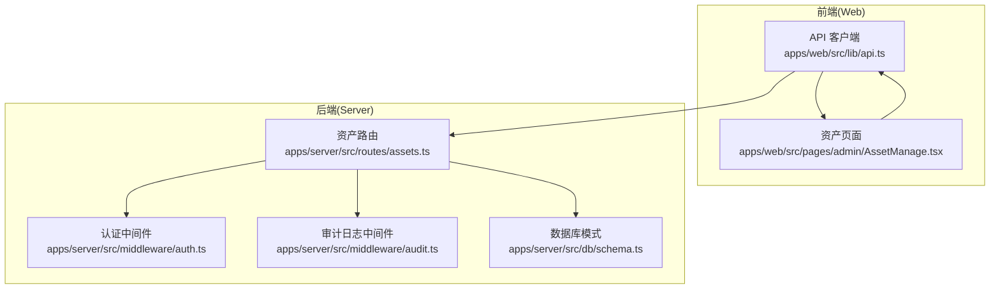
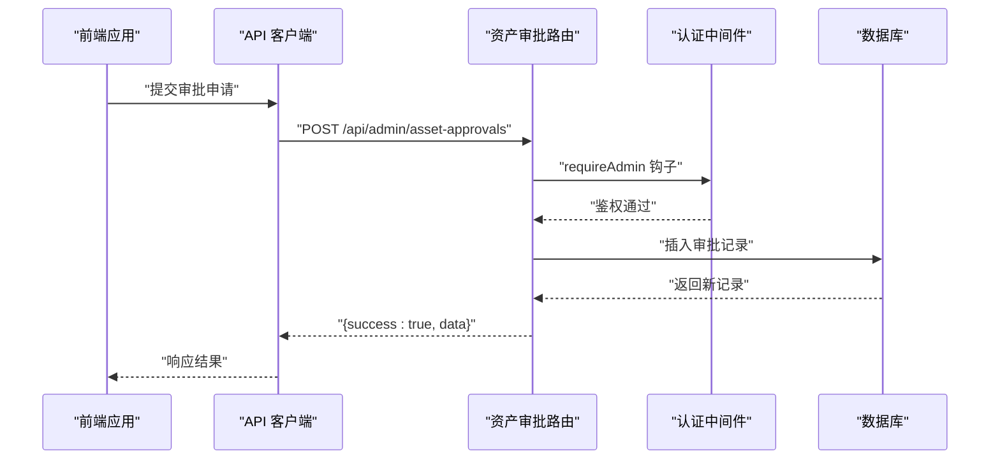
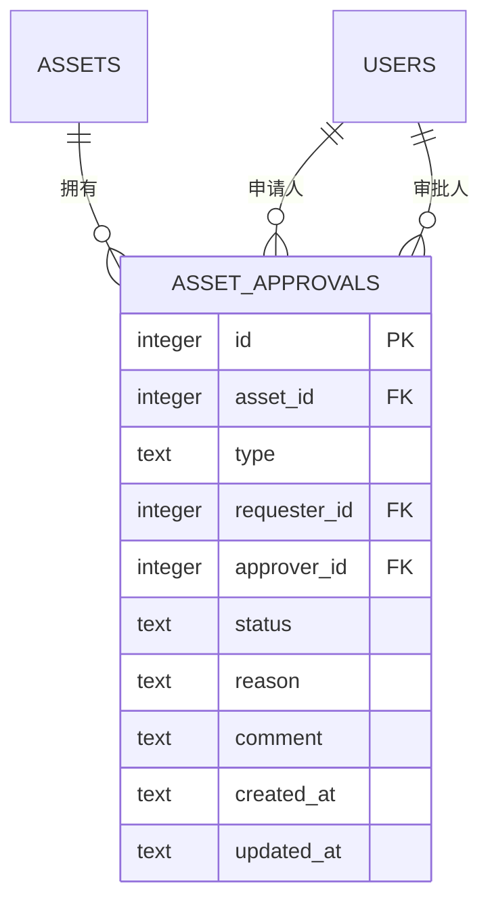
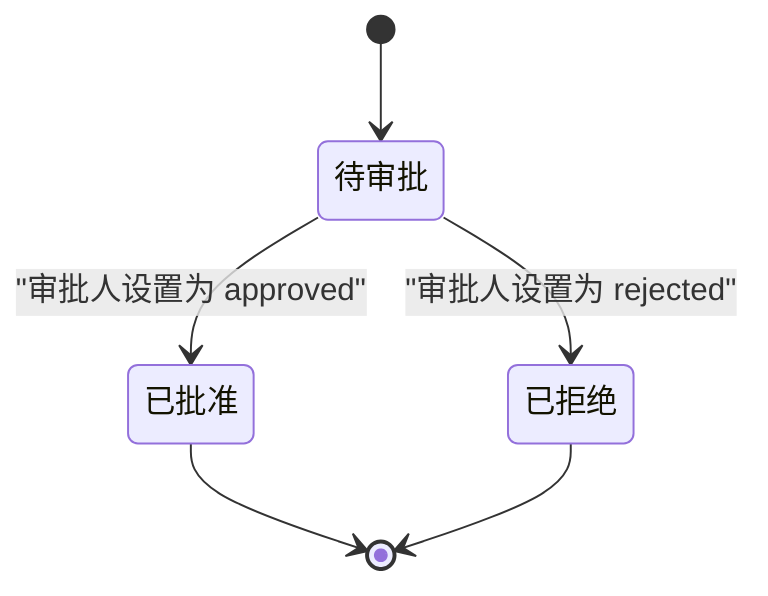
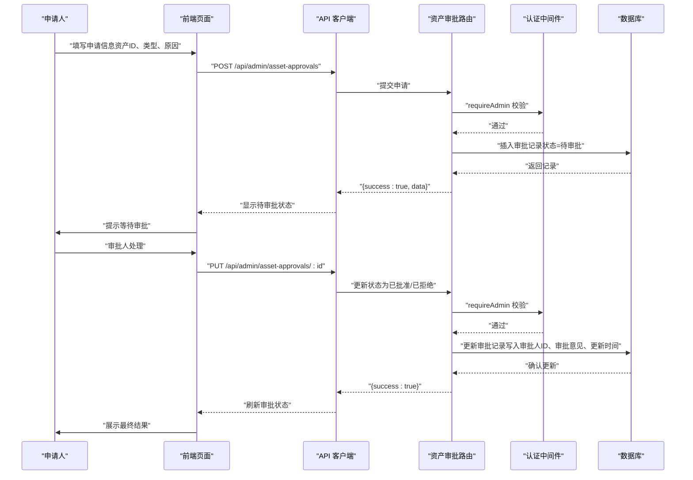
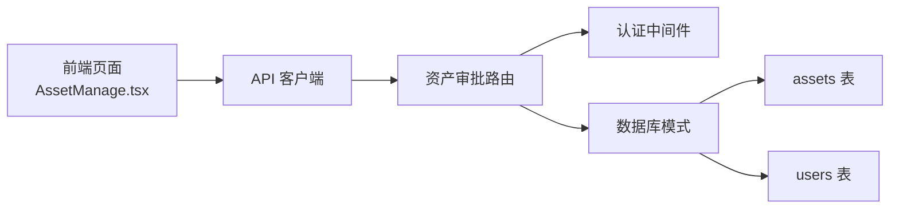

# 资产审批API

<cite>
**本文引用的文件**
- [apps/server/src/routes/assets.ts](file://apps/server/src/routes/assets.ts)
- [apps/server/src/db/schema.ts](file://apps/server/src/db/schema.ts)
- [apps/server/src/middleware/auth.ts](file://apps/server/src/middleware/auth.ts)
- [apps/server/src/middleware/audit.ts](file://apps/server/src/middleware/audit.ts)
- [apps/server/drizzle/0001_zippy_shadowcat.sql](file://apps/server/drizzle/0001_zippy_shadowcat.sql)
- [apps/web/src/pages/admin/AssetManage.tsx](file://apps/web/src/pages/admin/AssetManage.tsx)
- [apps/web/src/lib/api.ts](file://apps/web/src/lib/api.ts)
</cite>

## 目录
1. [简介](#简介)
2. [项目结构](#项目结构)
3. [核心组件](#核心组件)
4. [架构总览](#架构总览)
5. [详细组件分析](#详细组件分析)
6. [依赖关系分析](#依赖关系分析)
7. [性能考虑](#性能考虑)
8. [故障排查指南](#故障排查指南)
9. [结论](#结论)
10. [附录](#附录)

## 简介
本文件为 ZBH2 平台“资产审批API”的权威接口文档，聚焦于资产相关审批流程的接口定义与行为规范。内容涵盖：
- 审批申请提交、审批状态查询、审批处理等核心接口
- 不同类型审批的业务场景说明（如出库/领用、归还、报废等）
- 审批状态流转机制（待审批、已批准、已拒绝）
- 审批人权限验证与审批历史记录保存机制
- 完整的审批流程示例（从申请提交到审批完成）
- 审批备注、审批意见与时间戳等附加信息的处理方式

## 项目结构
资产审批能力由后端路由模块提供，配合数据库模式与中间件实现权限控制与审计日志记录。前端通过统一的 API 客户端调用后端接口。

图示来源
- [apps/web/src/lib/api.ts:1-16](file://apps/web/src/lib/api.ts#L1-L16)
- [apps/web/src/pages/admin/AssetManage.tsx:1-133](file://apps/web/src/pages/admin/AssetManage.tsx#L1-L133)
- [apps/server/src/routes/assets.ts:1-165](file://apps/server/src/routes/assets.ts#L1-L165)
- [apps/server/src/middleware/auth.ts:1-56](file://apps/server/src/middleware/auth.ts#L1-L56)
- [apps/server/src/middleware/audit.ts:1-28](file://apps/server/src/middleware/audit.ts#L1-L28)
- [apps/server/src/db/schema.ts:129-169](file://apps/server/src/db/schema.ts#L129-L169)

章节来源
- [apps/server/src/routes/assets.ts:1-165](file://apps/server/src/routes/assets.ts#L1-L165)
- [apps/server/src/db/schema.ts:129-169](file://apps/server/src/db/schema.ts#L129-L169)
- [apps/server/src/middleware/auth.ts:1-56](file://apps/server/src/middleware/auth.ts#L1-L56)
- [apps/server/src/middleware/audit.ts:1-28](file://apps/server/src/middleware/audit.ts#L1-L28)
- [apps/web/src/lib/api.ts:1-16](file://apps/web/src/lib/api.ts#L1-L16)
- [apps/web/src/pages/admin/AssetManage.tsx:1-133](file://apps/web/src/pages/admin/AssetManage.tsx#L1-L133)

## 核心组件
- 审批路由模块：提供审批申请提交、审批状态查询、审批处理等接口
- 数据库模式：定义资产审批表结构及枚举字段
- 认证中间件：确保仅管理员可访问审批相关接口
- 审计日志中间件：记录关键操作的审计信息

章节来源
- [apps/server/src/routes/assets.ts:116-143](file://apps/server/src/routes/assets.ts#L116-L143)
- [apps/server/src/db/schema.ts:158-169](file://apps/server/src/db/schema.ts#L158-L169)
- [apps/server/src/middleware/auth.ts:48-55](file://apps/server/src/middleware/auth.ts#L48-L55)
- [apps/server/src/middleware/audit.ts:3-27](file://apps/server/src/middleware/audit.ts#L3-L27)

## 架构总览
资产审批API采用“路由层-中间件-数据层”三层架构：
- 路由层：暴露REST风格接口，负责请求解析与响应封装
- 中间件层：认证与权限校验、审计日志
- 数据层：Drizzle ORM + SQLite，提供强类型的数据模型与约束

图示来源
- [apps/server/src/routes/assets.ts:122-131](file://apps/server/src/routes/assets.ts#L122-L131)
- [apps/server/src/middleware/auth.ts:48-55](file://apps/server/src/middleware/auth.ts#L48-L55)

## 详细组件分析

### 审批表结构与字段说明
资产审批表包含以下关键字段：
- 主键与外键：自增主键、关联资产、申请人、审批人
- 类型与状态：审批类型（出库/归还/报废）、审批状态（待审批/已批准/已拒绝）
- 附加信息：申请原因、审批意见、创建与更新时间戳

图示来源
- [apps/server/src/db/schema.ts:158-169](file://apps/server/src/db/schema.ts#L158-L169)
- [apps/server/drizzle/0001_zippy_shadowcat.sql:1-15](file://apps/server/drizzle/0001_zippy_shadowcat.sql#L1-L15)

章节来源
- [apps/server/src/db/schema.ts:158-169](file://apps/server/src/db/schema.ts#L158-L169)
- [apps/server/drizzle/0001_zippy_shadowcat.sql:1-15](file://apps/server/drizzle/0001_zippy_shadowcat.sql#L1-L15)

### 审批接口定义

#### 获取审批列表
- 方法与路径：GET /api/admin/asset-approvals
- 权限要求：管理员
- 返回：审批记录数组（按创建时间倒序）

章节来源
- [apps/server/src/routes/assets.ts:117-119](file://apps/server/src/routes/assets.ts#L117-L119)

#### 提交审批申请
- 方法与路径：POST /api/admin/asset-approvals
- 权限要求：管理员
- 请求体字段：
  - assetId：资产ID
  - type：审批类型（check_out、return、scrap）
  - reason：申请原因（可选）
- 响应：返回新建的审批记录

章节来源
- [apps/server/src/routes/assets.ts:122-131](file://apps/server/src/routes/assets.ts#L122-L131)

#### 处理审批
- 方法与路径：PUT /api/admin/asset-approvals/:id
- 权限要求：管理员
- 请求体字段：
  - status：审批状态（pending、approved、rejected）
  - comment：审批意见（可选）
- 响应：更新成功

章节来源
- [apps/server/src/routes/assets.ts:133-142](file://apps/server/src/routes/assets.ts#L133-L142)

### 审批状态流转机制
审批状态包含三种取值：pending（待审批）、approved（已批准）、rejected（已拒绝）。状态转换规则如下：
- 待审批 → 已批准：审批人将状态更新为 approved，并填写审批意见
- 待审批 → 已拒绝：审批人将状态更新为 rejected，并填写审批意见

图示来源
- [apps/server/src/db/schema.ts:164](file://apps/server/src/db/schema.ts#L164)
- [apps/server/src/routes/assets.ts:135-142](file://apps/server/src/routes/assets.ts#L135-L142)

### 审批类型与业务场景
- 出库/领用（check_out）：用于员工借领资产，需填写目标用户ID
- 归还（return）：用于资产归还，无需额外用户信息
- 报废（scrap）：用于资产报废处理，通常需要更严格的审批流程

章节来源
- [apps/server/src/db/schema.ts:161](file://apps/server/src/db/schema.ts#L161)
- [apps/server/src/routes/assets.ts:123-131](file://apps/server/src/routes/assets.ts#L123-L131)

### 审批人权限验证
- 所有审批相关接口均通过 requireAdmin 钩子进行权限校验
- 若未登录或非管理员，将返回相应错误码与提示

章节来源
- [apps/server/src/middleware/auth.ts:48-55](file://apps/server/src/middleware/auth.ts#L48-L55)
- [apps/server/src/routes/assets.ts:7](file://apps/server/src/routes/assets.ts#L7)

### 审批历史记录与审计
- 审批记录保存在 asset_approvals 表中，包含创建与更新时间戳
- 审计日志中间件支持记录关键操作的审计信息（如登录、创建、更新、删除等），可用于追踪审批流程中的关键事件

章节来源
- [apps/server/src/db/schema.ts:158-169](file://apps/server/src/db/schema.ts#L158-L169)
- [apps/server/src/middleware/audit.ts:3-27](file://apps/server/src/middleware/audit.ts#L3-L27)

### 审批流程示例（从申请到完成）
以下示例展示一次“出库/领用”审批的完整流程：

图示来源
- [apps/server/src/routes/assets.ts:122-142](file://apps/server/src/routes/assets.ts#L122-L142)
- [apps/server/src/middleware/auth.ts:48-55](file://apps/server/src/middleware/auth.ts#L48-L55)
- [apps/web/src/lib/api.ts:1-16](file://apps/web/src/lib/api.ts#L1-L16)

## 依赖关系分析
- 路由依赖认证中间件：所有审批接口均受 requireAdmin 保护
- 审批记录依赖资产与用户表：通过外键关联保证数据一致性
- 前端通过统一 API 客户端与后端交互，避免跨域与会话问题

图示来源
- [apps/web/src/pages/admin/AssetManage.tsx:1-133](file://apps/web/src/pages/admin/AssetManage.tsx#L1-L133)
- [apps/web/src/lib/api.ts:1-16](file://apps/web/src/lib/api.ts#L1-L16)
- [apps/server/src/routes/assets.ts:1-165](file://apps/server/src/routes/assets.ts#L1-L165)
- [apps/server/src/middleware/auth.ts:1-56](file://apps/server/src/middleware/auth.ts#L1-L56)
- [apps/server/src/db/schema.ts:129-169](file://apps/server/src/db/schema.ts#L129-L169)

章节来源
- [apps/web/src/pages/admin/AssetManage.tsx:1-133](file://apps/web/src/pages/admin/AssetManage.tsx#L1-L133)
- [apps/web/src/lib/api.ts:1-16](file://apps/web/src/lib/api.ts#L1-L16)
- [apps/server/src/routes/assets.ts:1-165](file://apps/server/src/routes/assets.ts#L1-L165)
- [apps/server/src/middleware/auth.ts:1-56](file://apps/server/src/middleware/auth.ts#L1-L56)
- [apps/server/src/db/schema.ts:129-169](file://apps/server/src/db/schema.ts#L129-L169)

## 性能考虑
- 审批列表查询按创建时间倒序，适合高频读取场景
- 审批状态更新为轻量级写操作，建议在前端做必要的输入校验后再提交
- 审计日志写入为异步建议（当前实现为同步），可根据业务量评估是否引入队列

## 故障排查指南
- 401 未登录：检查会话Cookie与登录状态
- 403 权限不足：确认当前用户角色为管理员
- 404 资产不存在：确认资产ID有效且存在
- 400 无效操作：确认审批类型与状态值符合枚举定义

章节来源
- [apps/server/src/middleware/auth.ts:42-55](file://apps/server/src/middleware/auth.ts#L42-L55)
- [apps/server/src/routes/assets.ts:76-84](file://apps/server/src/routes/assets.ts#L76-L84)

## 结论
资产审批API提供了清晰的审批生命周期管理能力，结合管理员权限控制与审计日志，能够满足企业级资产管理的合规与追踪需求。通过标准化的接口与严谨的状态机设计，系统可在不同业务场景下灵活扩展（例如增加“重大资产处置”等审批类型）。

## 附录

### 接口一览表
- GET /api/admin/asset-approvals：获取审批列表
- POST /api/admin/asset-approvals：提交审批申请
- PUT /api/admin/asset-approvals/:id：处理审批

章节来源
- [apps/server/src/routes/assets.ts:117-142](file://apps/server/src/routes/assets.ts#L117-L142)