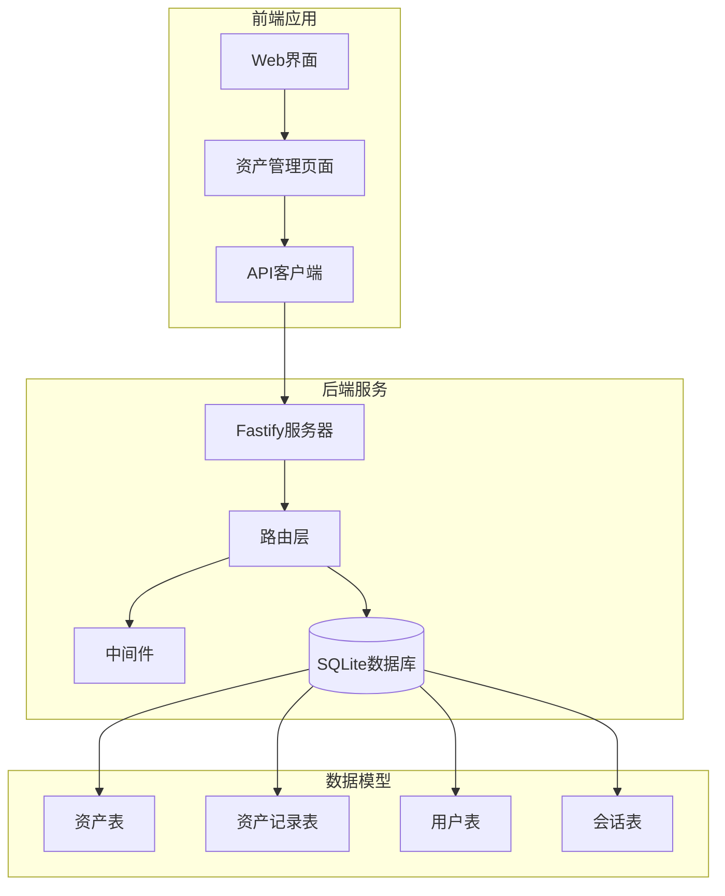
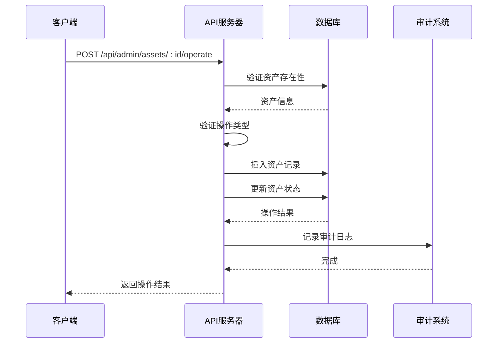
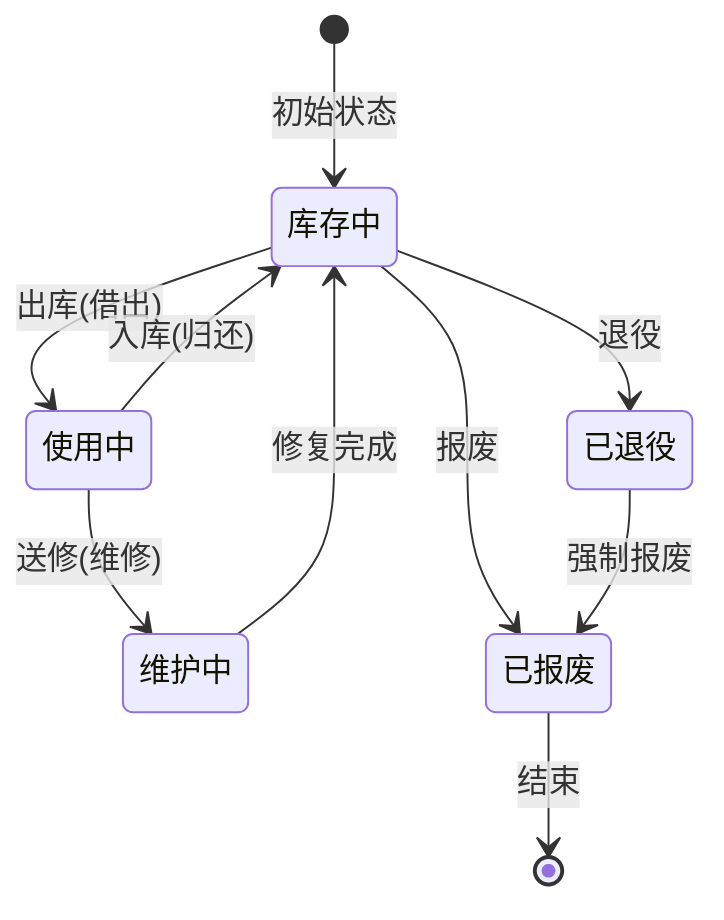
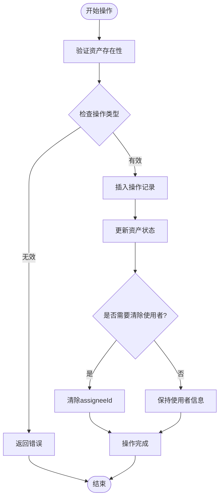
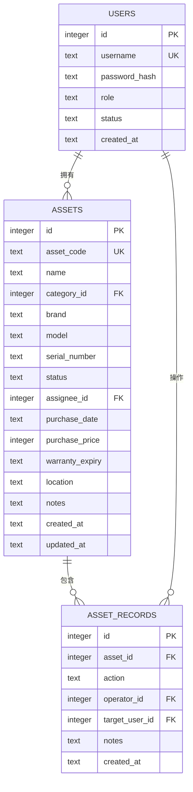
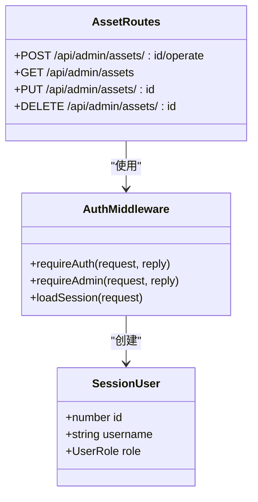
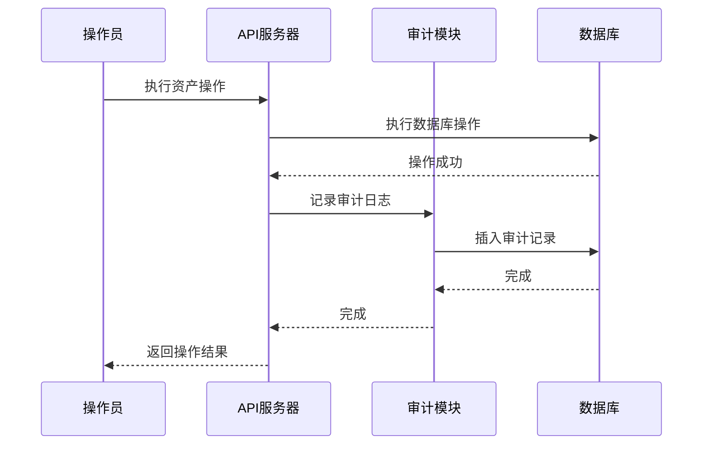
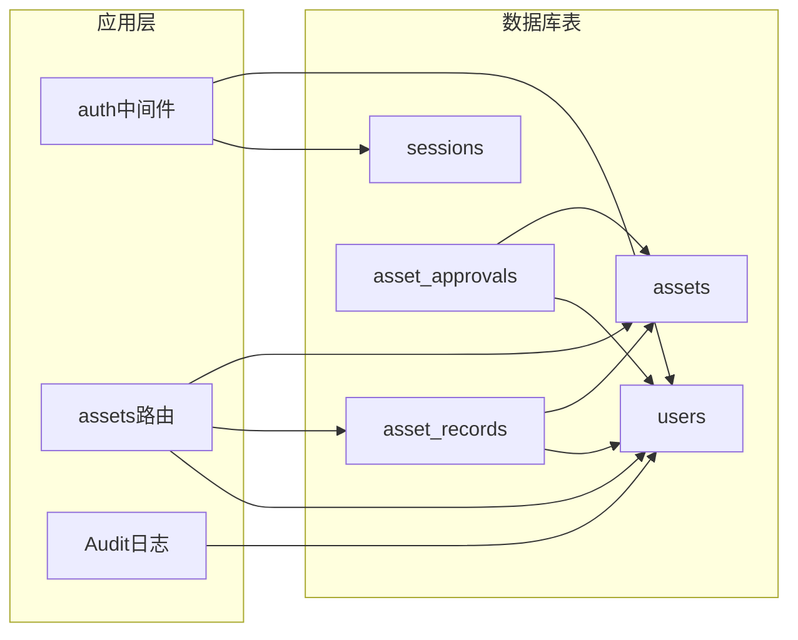

# 资产操作API

<cite>
**本文档引用的文件**
- [assets.ts](file://apps/server/src/routes/assets.ts)
- [schema.ts](file://apps/server/src/db/schema.ts)
- [auth.ts](file://apps/server/src/middleware/auth.ts)
- [audit.ts](file://apps/server/src/middleware/audit.ts)
- [index.ts](file://apps/server/src/db/index.ts)
- [AssetManage.tsx](file://apps/web/src/pages/admin/AssetManage.tsx)
- [api.ts](file://apps/web/src/lib/api.ts)
- [0001_zippy_shadowcat.sql](file://apps/server/drizzle/0001_zippy_shadowcat.sql)
- [0002_special_medusa.sql](file://apps/server/drizzle/0002_special_medusa.sql)
</cite>

## 目录
1. [简介](#简介)
2. [项目结构](#项目结构)
3. [核心组件](#核心组件)
4. [架构概览](#架构概览)
5. [详细组件分析](#详细组件分析)
6. [依赖关系分析](#依赖关系分析)
7. [性能考虑](#性能考虑)
8. [故障排除指南](#故障排除指南)
9. [结论](#结论)
10. [附录](#附录)

## 简介
本文件为ZBH2平台的资产操作API提供详细的接口文档。该系统实现了完整的数字资产管理功能，支持资产的借出(check_out)、归还(check_in)、维修(maintenance)、退回(return)、退役(retire)和报废(scrap)等操作。系统通过状态机管理资产生命周期，并提供完整的历史追踪机制。

## 项目结构
ZBH2平台采用前后端分离架构，资产操作API位于服务器端的Fastify框架中，数据库使用SQLite并通过Drizzle ORM进行管理。

**图表来源**
- [assets.ts:1-165](file://apps/server/src/routes/assets.ts#L1-L165)
- [schema.ts:129-169](file://apps/server/src/db/schema.ts#L129-L169)

**章节来源**
- [assets.ts:1-165](file://apps/server/src/routes/assets.ts#L1-L165)
- [schema.ts:1-330](file://apps/server/src/db/schema.ts#L1-L330)

## 核心组件
资产操作API的核心组件包括：

### 资产操作路由
- `/api/admin/assets/:id/operate` - 资产操作入口
- 支持的操作类型：check_out、check_in、maintenance、return、retire、scrap

### 数据模型
- **assets表**：存储资产基本信息和当前状态
- **asset_records表**：记录所有资产操作历史
- **asset_approvals表**：处理需要审批的资产操作

### 权限控制
- 基于管理员角色的访问控制
- 会话认证机制
- 操作审计日志

**章节来源**
- [assets.ts:72-100](file://apps/server/src/routes/assets.ts#L72-L100)
- [schema.ts:129-169](file://apps/server/src/db/schema.ts#L129-L169)
- [auth.ts:48-55](file://apps/server/src/middleware/auth.ts#L48-L55)

## 架构概览
资产操作API采用RESTful设计模式，结合状态机和审计机制实现完整的资产管理流程。

**图表来源**
- [assets.ts:73-99](file://apps/server/src/routes/assets.ts#L73-L99)
- [audit.ts:3-27](file://apps/server/src/middleware/audit.ts#L3-L27)

## 详细组件分析

### 资产状态机
系统实现了严格的资产状态管理，确保资产在不同操作间的正确转换。

**图表来源**
- [assets.ts:79-82](file://apps/server/src/routes/assets.ts#L79-L82)

#### 状态转换规则
1. **借出(check_out)**：从"库存中"转为"使用中"，必须指定使用者
2. **归还(check_in)**：从"使用中"转为"库存中"，清除使用者信息
3. **维修(maintenance)**：从"使用中"转为"维护中"，不影响使用者
4. **退回(return)**：从"使用中"转为"库存中"，清除使用者信息
5. **退役(retire)**：从"库存中"转为"已退役"
6. **报废(scrap)**：从"库存中"或"已退役"转为"已报废"

**章节来源**
- [assets.ts:79-97](file://apps/server/src/routes/assets.ts#L79-L97)

### 资产操作流程
每个资产操作都遵循统一的处理流程：

**图表来源**
- [assets.ts:73-99](file://apps/server/src/routes/assets.ts#L73-L99)

**章节来源**
- [assets.ts:73-99](file://apps/server/src/routes/assets.ts#L73-L99)

### 数据模型设计
系统采用规范化的关系型数据库设计，确保数据一致性和完整性。

**图表来源**
- [schema.ts:129-169](file://apps/server/src/db/schema.ts#L129-L169)

**章节来源**
- [schema.ts:129-169](file://apps/server/src/db/schema.ts#L129-L169)

### 权限控制机制
系统实现了基于角色的访问控制(RBAC)和会话认证机制：

**图表来源**
- [auth.ts:5-55](file://apps/server/src/middleware/auth.ts#L5-L55)

**章节来源**
- [auth.ts:17-55](file://apps/server/src/middleware/auth.ts#L17-L55)

### 审计日志系统
所有重要的系统操作都会被记录到审计日志中，确保操作的可追溯性。

**图表来源**
- [audit.ts:3-27](file://apps/server/src/middleware/audit.ts#L3-L27)

**章节来源**
- [audit.ts:3-27](file://apps/server/src/middleware/audit.ts#L3-L27)

## 依赖关系分析

### 数据库依赖图

**图表来源**
- [schema.ts:129-169](file://apps/server/src/db/schema.ts#L129-L169)
- [assets.ts:1-165](file://apps/server/src/routes/assets.ts#L1-L165)

### 外部依赖
- **Fastify**: Web框架，提供HTTP服务器功能
- **Drizzle ORM**: 数据库ORM，简化SQL操作
- **better-sqlite3**: SQLite驱动程序
- **Zod**: 数据验证库
- **Axios**: HTTP客户端库

**章节来源**
- [index.ts:1-16](file://apps/server/src/db/index.ts#L1-L16)
- [assets.ts:1-5](file://apps/server/src/routes/assets.ts#L1-L5)

## 性能考虑
1. **数据库优化**：
   - 启用了WAL模式提高并发性能
   - 启用了外键约束保证数据完整性
   - 为常用查询字段建立了索引

2. **缓存策略**：
   - 使用内存中的SQLite数据库减少磁盘I/O
   - 合理的数据结构设计避免N+1查询问题

3. **API性能**：
   - 批量操作支持
   - 分页查询优化
   - 适当的错误处理避免重复查询

## 故障排除指南

### 常见错误及解决方案

#### 404 错误 - 资产不存在
**症状**：尝试操作不存在的资产ID
**解决方法**：确认资产ID正确性，检查资产是否存在

#### 400 错误 - 无效操作
**症状**：提交了不支持的操作类型
**解决方法**：检查操作类型是否在允许列表中

#### 401 错误 - 未认证
**症状**：访问受保护的API端点但未登录
**解决方法**：先执行登录操作获取会话

#### 403 错误 - 权限不足
**症状**：普通用户尝试执行管理员操作
**解决方法**：使用具有管理员权限的账户登录

**章节来源**
- [assets.ts:76-84](file://apps/server/src/routes/assets.ts#L76-L84)
- [auth.ts:42-55](file://apps/server/src/middleware/auth.ts#L42-L55)

### 调试建议
1. 检查网络连接和API端点URL
2. 验证请求参数格式和类型
3. 查看服务器端错误日志
4. 使用浏览器开发者工具检查请求响应

## 结论
ZBH2平台的资产操作API提供了完整的数字资产管理解决方案。系统通过严格的状态机管理、完善的权限控制和审计机制，确保了资产操作的安全性和可追溯性。RESTful API设计使得集成和扩展变得简单，而SQLite数据库的选择则提供了良好的性能和易用性。

## 附录

### API端点规范

#### 资产操作
- **POST** `/api/admin/assets/:id/operate`
- **请求体**：
  - `action`: 操作类型 (check_out, check_in, maintenance, return, retire, scrap)
  - `targetUserId`: 目标用户ID (用于借出操作)
  - `notes`: 备注信息

#### 资产记录查询
- **GET** `/api/admin/asset-records`
- **查询参数**：
  - `assetId`: 资产ID (可选)

#### 资产统计
- **GET** `/api/admin/asset-stats`

### 数据模型字段说明

#### assets表字段
- `assetCode`: 资产编号 (唯一)
- `name`: 资产名称
- `status`: 当前状态 (in_stock, in_use, maintenance, retired, scrapped)
- `assigneeId`: 使用者ID
- `purchasePrice`: 采购价格 (分)
- `location`: 存放位置

#### asset_records表字段
- `assetId`: 资产ID
- `action`: 操作类型
- `operatorId`: 操作员ID
- `targetUserId`: 目标用户ID
- `notes`: 备注

**章节来源**
- [schema.ts:129-169](file://apps/server/src/db/schema.ts#L129-L169)
- [assets.ts:103-114](file://apps/server/src/routes/assets.ts#L103-L114)