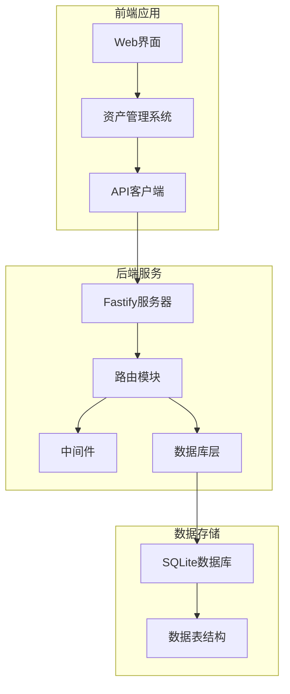
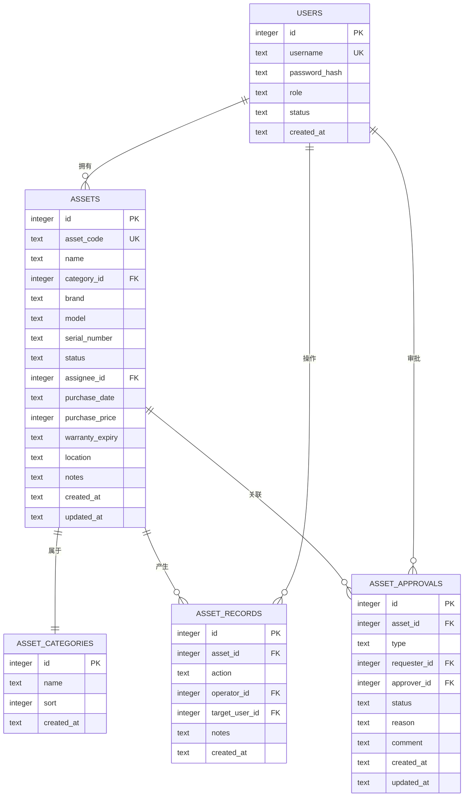
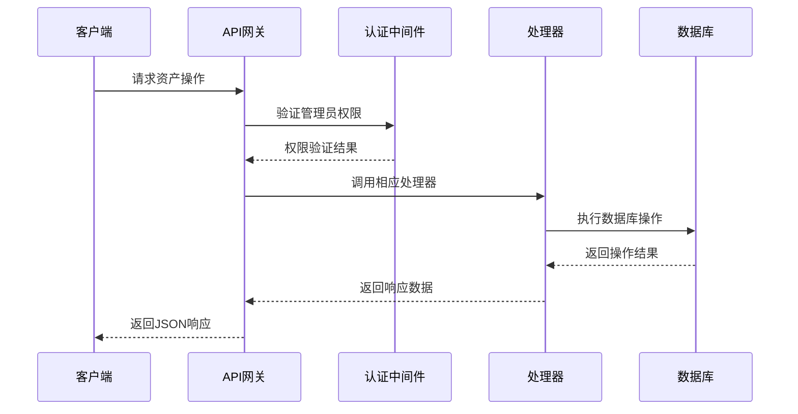
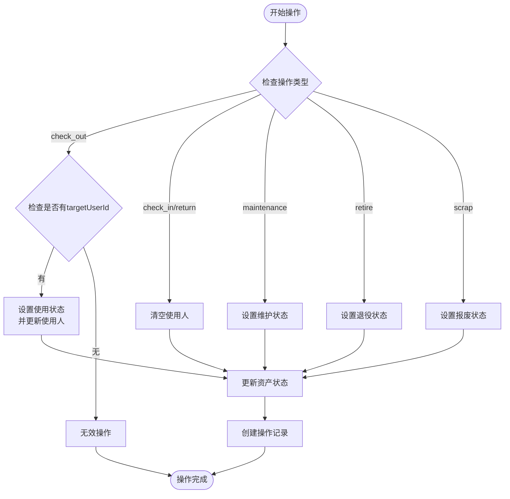
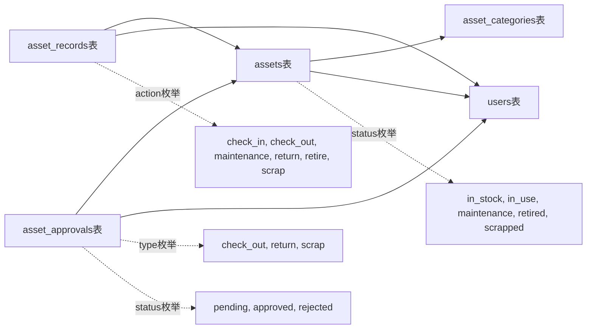
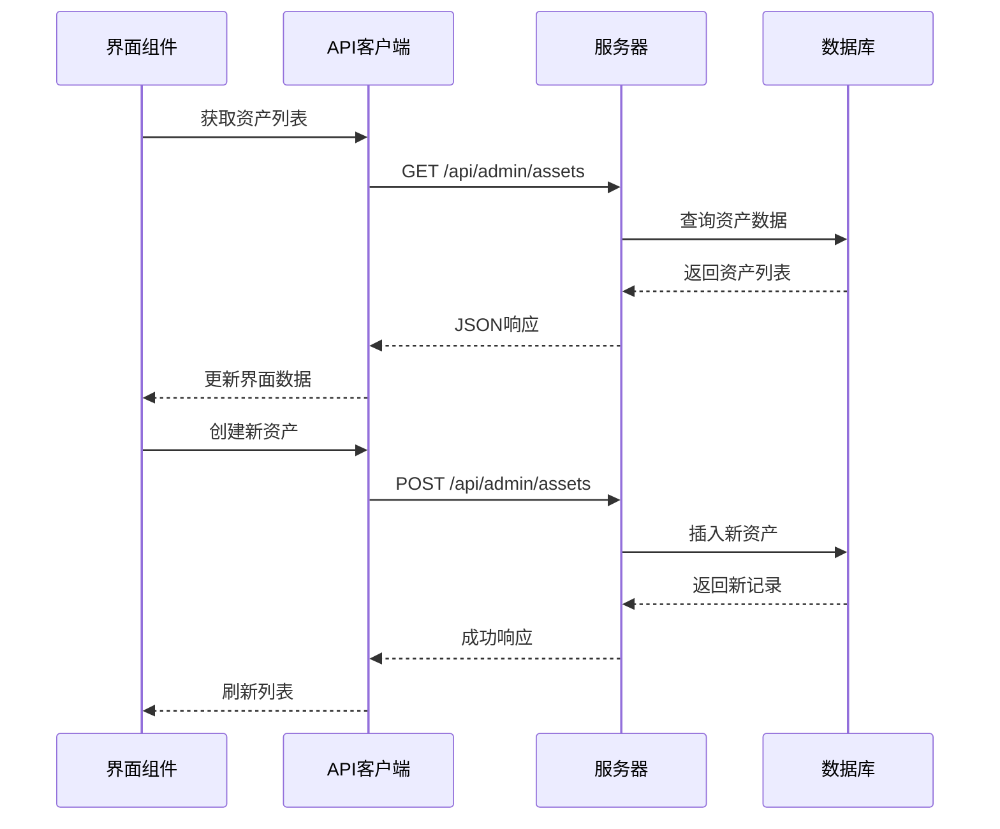

# 资产条目管理API

<cite>
**本文档引用的文件**
- [assets.ts](file://apps/server/src/routes/assets.ts)
- [schema.ts](file://apps/server/src/db/schema.ts)
- [auth.ts](file://apps/server/src/middleware/auth.ts)
- [AssetManage.tsx](file://apps/web/src/pages/admin/AssetManage.tsx)
- [api.ts](file://apps/web/src/lib/api.ts)
- [seed.ts](file://apps/server/src/db/seed.ts)
- [index.ts](file://apps/server/src/db/index.ts)
</cite>

## 目录
1. [简介](#简介)
2. [项目结构](#项目结构)
3. [核心组件](#核心组件)
4. [架构概览](#架构概览)
5. [详细组件分析](#详细组件分析)
6. [依赖关系分析](#依赖关系分析)
7. [性能考虑](#性能考虑)
8. [故障排除指南](#故障排除指南)
9. [结论](#结论)

## 简介

ZBH2平台的资产条目管理API提供了完整的数字资产管理功能，支持资产的全生命周期管理。该系统采用Fastify框架构建，使用Drizzle ORM进行数据库操作，基于SQLite数据库存储资产相关信息。

资产管理系统的核心功能包括：
- 资产条目的完整生命周期管理（创建、查询、更新、删除）
- 资产状态的动态变更（库存、使用、维护、退役、报废）
- 资产分类管理
- 资产操作记录追踪
- 资产审批流程
- 统计报表生成

## 项目结构

ZBH2平台采用前后端分离的架构设计，资产管理系统位于服务器端的路由模块中。



**图表来源**
- [assets.ts:1-165](file://apps/server/src/routes/assets.ts#L1-L165)
- [schema.ts:129-169](file://apps/server/src/db/schema.ts#L129-L169)

**章节来源**
- [assets.ts:1-165](file://apps/server/src/routes/assets.ts#L1-L165)
- [schema.ts:129-169](file://apps/server/src/db/schema.ts#L129-L169)

## 核心组件

### 数据模型

资产管理系统的核心数据模型包括三个主要表：



**图表来源**
- [schema.ts:129-169](file://apps/server/src/db/schema.ts#L129-L169)

### 状态枚举定义

资产状态字段支持以下五种状态：

| 状态值 | 中文含义 | 用途描述 |
|--------|----------|----------|
| in_stock | 库存中 | 资产处于可用状态，可进行分配或借出 |
| in_use | 使用中 | 资产已被分配给用户使用 |
| maintenance | 维护中 | 资产正在维修或保养过程中 |
| retired | 已退役 | 资产达到使用年限，停止使用 |
| scrapped | 已报废 | 资产损坏严重，无法修复 |

**章节来源**
- [schema.ts:137-137](file://apps/server/src/db/schema.ts#L137-L137)
- [assets.ts:79-82](file://apps/server/src/routes/assets.ts#L79-L82)

## 架构概览

资产管理系统采用RESTful API设计，所有接口均需要管理员权限才能访问。



**图表来源**
- [assets.ts:6-7](file://apps/server/src/routes/assets.ts#L6-L7)
- [auth.ts:48-55](file://apps/server/src/middleware/auth.ts#L48-L55)

## 详细组件分析

### 资产CRUD操作

#### 资产创建接口

POST `/api/admin/assets`

请求参数：
- assetCode: 资产编号（必填，唯一）
- name: 资产名称（必填）
- categoryId: 分类ID（可选）
- brand: 品牌（可选，默认空字符串）
- model: 型号（可选，默认空字符串）
- serialNumber: 序列号（可选，默认空字符串）
- status: 状态（可选，默认in_stock）
- purchaseDate: 购买日期（可选）
- purchasePrice: 采购价格（可选，默认0）
- warrantyExpiry: 保修到期日（可选）
- location: 存放位置（可选，默认空字符串）
- notes: 备注（可选，默认空字符串）

响应格式：
```json
{
  "success": true,
  "data": {
    "id": 1,
    "assetCode": "ASSET001",
    "name": "笔记本电脑",
    "status": "in_stock",
    "createdAt": "2024-01-01T00:00:00Z",
    "updatedAt": "2024-01-01T00:00:00Z"
  }
}
```

#### 资产查询接口

GET `/api/admin/assets`

支持的查询参数：
- 无参数：返回所有资产，按创建时间降序排列

响应格式：
```json
{
  "success": true,
  "data": [
    {
      "id": 1,
      "assetCode": "ASSET001",
      "name": "笔记本电脑",
      "status": "in_stock",
      "assigneeId": null,
      "purchasePrice": 0,
      "location": ""
    }
  ]
}
```

#### 资产更新接口

PUT `/api/admin/assets/:id`

支持更新的字段：
- name: 资产名称
- categoryId: 分类ID
- brand: 品牌
- model: 型号
- serialNumber: 序列号
- status: 状态
- assigneeId: 使用人ID
- purchaseDate: 购买日期
- purchasePrice: 采购价格
- warrantyExpiry: 保修到期日
- location: 存放位置
- notes: 备注

#### 资产删除接口

DELETE `/api/admin/assets/:id`

删除指定ID的资产记录。

**章节来源**
- [assets.ts:36-70](file://apps/server/src/routes/assets.ts#L36-L70)

### 资产状态变更操作

#### 资产操作接口

POST `/api/admin/assets/:id/operate`

支持的操作类型：
- check_out: 出库（领用），需要targetUserId参数
- check_in: 入库
- return: 归还
- maintenance: 送修
- retire: 退役
- scrap: 报废

请求参数：
- action: 操作类型（必填）
- targetUserId: 目标用户ID（仅check_out操作需要）
- notes: 备注（可选）

状态变更规则：



**图表来源**
- [assets.ts:73-100](file://apps/server/src/routes/assets.ts#L73-L100)

**章节来源**
- [assets.ts:73-100](file://apps/server/src/routes/assets.ts#L73-L100)

### 资产分类管理

#### 分类查询接口

GET `/api/admin/asset-categories`

返回所有资产分类，按sort字段升序排列。

#### 分类创建接口

POST `/api/admin/asset-categories`

请求参数：
- name: 分类名称（必填）
- sort: 排序值（可选，默认0）

#### 分类更新接口

PUT `/api/admin/asset-categories/:id`

支持更新的字段：
- name: 分类名称
- sort: 排序值

#### 分类删除接口

DELETE `/api/admin/asset-categories/:id`

**章节来源**
- [assets.ts:10-28](file://apps/server/src/routes/assets.ts#L10-L28)

### 资产记录管理

#### 记录查询接口

GET `/api/admin/asset-records`

支持的查询参数：
- assetId: 资产ID（可选）- 如果指定，则只返回该资产的操作记录

响应格式：
```json
{
  "success": true,
  "data": [
    {
      "id": 1,
      "assetId": 1,
      "action": "check_out",
      "operatorId": 1,
      "targetUserId": 2,
      "notes": "员工领用",
      "createdAt": "2024-01-01T00:00:00Z"
    }
  ]
}
```

**章节来源**
- [assets.ts:103-114](file://apps/server/src/routes/assets.ts#L103-L114)

### 资产审批管理

#### 审批查询接口

GET `/api/admin/asset-approvals`

返回所有资产审批记录，按创建时间降序排列。

#### 审批创建接口

POST `/api/admin/asset-approvals`

请求参数：
- assetId: 资产ID（必填）
- type: 审批类型（check_out, return, scrap）
- reason: 申请原因（可选）

#### 审批更新接口

PUT `/api/admin/asset-approvals/:id`

请求参数：
- status: 审批状态（pending, approved, rejected）
- comment: 审批意见（可选）

**章节来源**
- [assets.ts:117-143](file://apps/server/src/routes/assets.ts#L117-L143)

### 资产统计接口

#### 统计查询接口

GET `/api/admin/asset-stats`

返回资产统计信息：
- total: 资产总数
- byStatus: 各状态资产数量
- byCategory: 各分类资产数量
- totalValue: 资产总价值

**章节来源**
- [assets.ts:146-163](file://apps/server/src/routes/assets.ts#L146-L163)

## 依赖关系分析

### 数据库依赖

资产管理系统依赖于以下数据库表结构：



**图表来源**
- [schema.ts:129-169](file://apps/server/src/db/schema.ts#L129-L169)

### 前端集成

前端资产管理界面通过API客户端与后端进行交互：



**图表来源**
- [AssetManage.tsx:25-36](file://apps/web/src/pages/admin/AssetManage.tsx#L25-L36)
- [api.ts:1-16](file://apps/web/src/lib/api.ts#L1-L16)

**章节来源**
- [AssetManage.tsx:1-133](file://apps/web/src/pages/admin/AssetManage.tsx#L1-L133)
- [api.ts:1-16](file://apps/web/src/lib/api.ts#L1-L16)

## 性能考虑

### 数据库优化

1. **索引策略**：资产表的关键字段（asset_code, status, categoryId）应建立适当的索引以提高查询性能。

2. **查询优化**：批量操作时使用事务处理，避免频繁的数据库往返。

3. **缓存策略**：对于不经常变化的配置数据（如资产分类），可以考虑添加缓存层。

### API性能

1. **分页查询**：当前实现返回所有数据，建议在生产环境中添加分页支持。

2. **并发控制**：资产状态变更操作需要考虑并发场景下的数据一致性。

3. **响应优化**：对于大量数据的查询，考虑使用流式处理或分批返回。

## 故障排除指南

### 常见错误及解决方案

#### 权限错误
- **错误**：401 未授权，403 权限不足
- **原因**：用户未登录或非管理员账户
- **解决**：确保用户已正确登录且具有管理员权限

#### 资产不存在
- **错误**：404 资产不存在
- **原因**：操作的资产ID不存在
- **解决**：检查资产ID是否正确

#### 无效操作
- **错误**：400 无效操作
- **原因**：操作类型不在支持范围内
- **解决**：使用支持的操作类型：check_out, check_in, return, maintenance, retire, scrap

#### 数据验证错误
- **错误**：400 参数验证失败
- **原因**：请求参数格式不正确
- **解决**：检查请求参数的格式和类型

**章节来源**
- [assets.ts:77-84](file://apps/server/src/routes/assets.ts#L77-L84)
- [auth.ts:48-55](file://apps/server/src/middleware/auth.ts#L48-L55)

## 结论

ZBH2平台的资产条目管理API提供了完整的数字资产管理解决方案。系统采用清晰的数据模型设计，支持资产的全生命周期管理，包括状态变更、分类管理、操作记录和审批流程等功能。

关键特性包括：
- 完整的CRUD操作支持
- 灵活的状态变更机制
- 详细的操作记录追踪
- 审批流程集成
- 统计报表生成功能

该系统为组织的数字资产管理提供了坚实的技术基础，可以根据具体需求进一步扩展功能，如添加搜索过滤、分页查询和高级排序等功能。