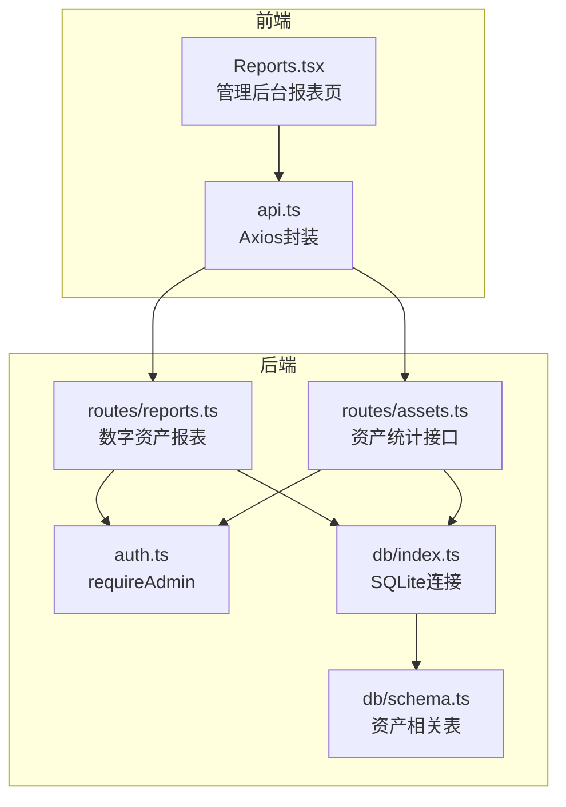
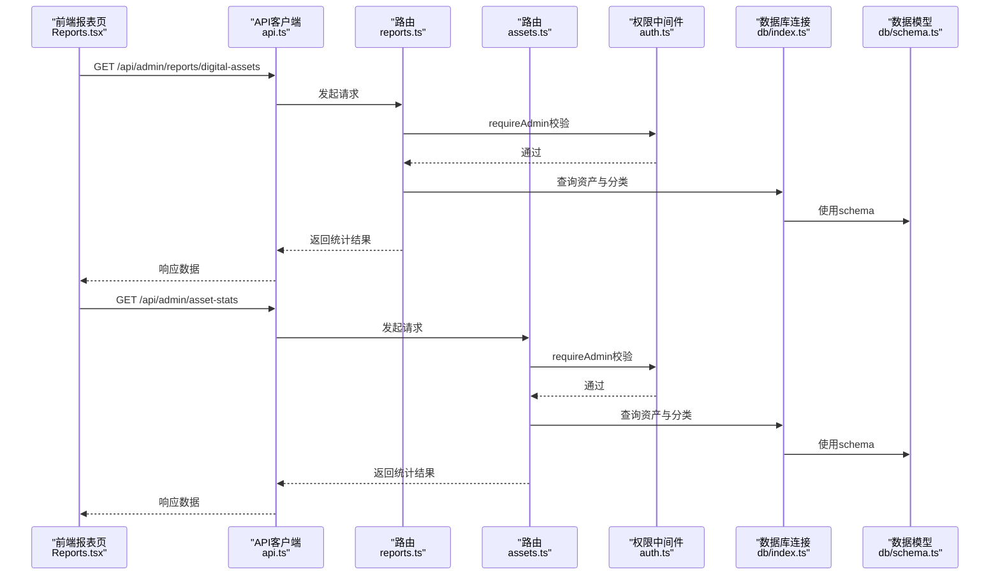
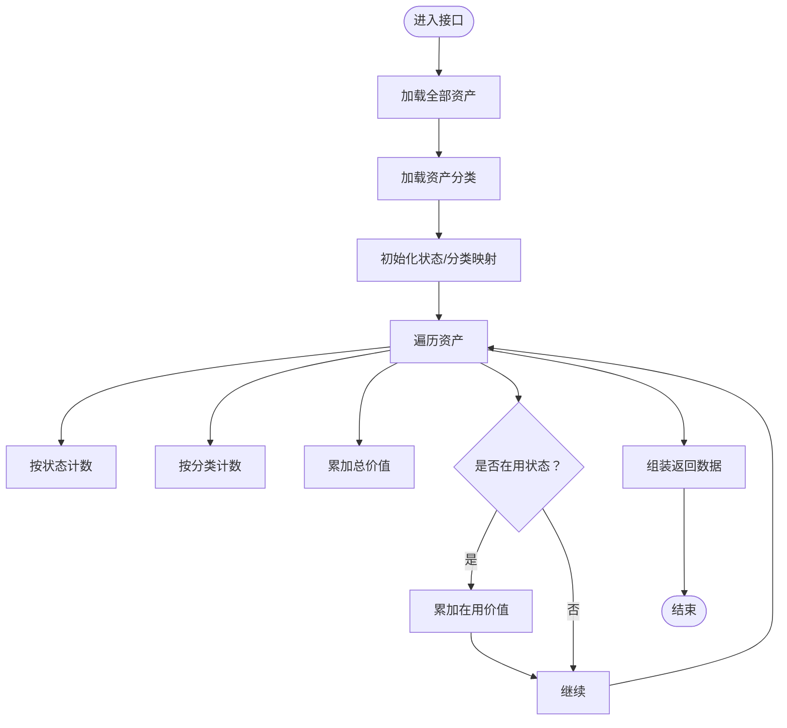
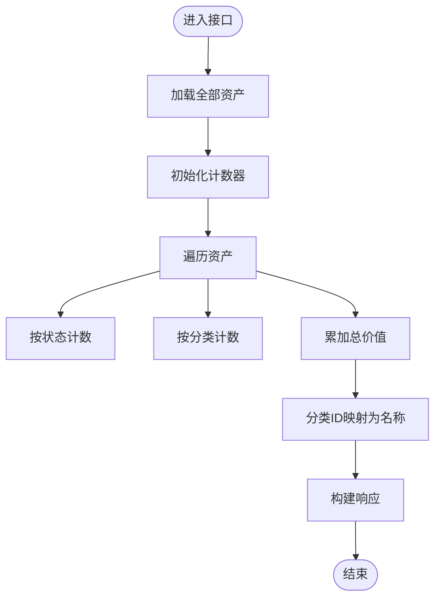
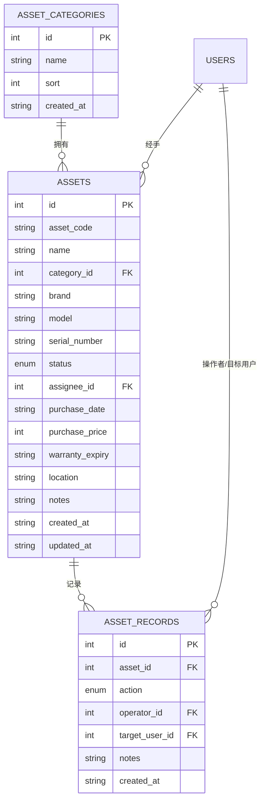
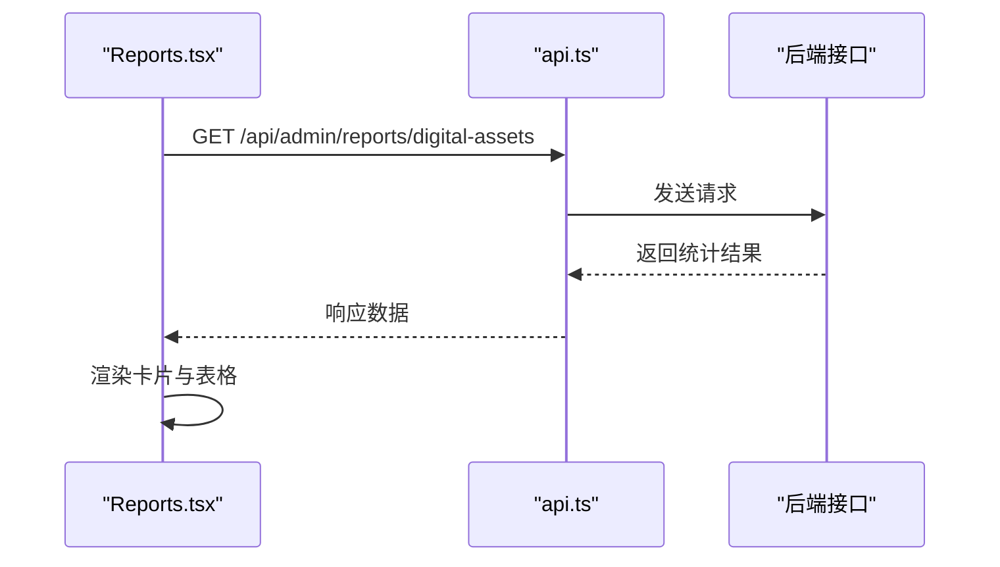
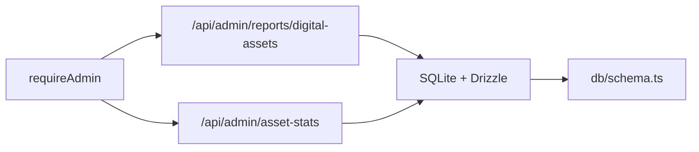

# 资产统计API

<cite>
**本文引用的文件列表**
- [apps/server/src/routes/reports.ts](file://apps/server/src/routes/reports.ts)
- [apps/server/src/routes/assets.ts](file://apps/server/src/routes/assets.ts)
- [apps/server/src/db/schema.ts](file://apps/server/src/db/schema.ts)
- [apps/server/src/db/index.ts](file://apps/server/src/db/index.ts)
- [apps/server/src/middleware/auth.ts](file://apps/server/src/middleware/auth.ts)
- [apps/web/src/pages/admin/Reports.tsx](file://apps/web/src/pages/admin/Reports.tsx)
- [apps/web/src/lib/api.ts](file://apps/web/src/lib/api.ts)
- [README.md](file://README.md)
</cite>

## 目录
1. [简介](#简介)
2. [项目结构](#项目结构)
3. [核心组件](#核心组件)
4. [架构总览](#架构总览)
5. [详细组件分析](#详细组件分析)
6. [依赖关系分析](#依赖关系分析)
7. [性能考量](#性能考量)
8. [故障排查指南](#故障排查指南)
9. [结论](#结论)
10. [附录](#附录)

## 简介
本文件面向ZBH2平台的“资产统计API”，聚焦于数字资产的统计分析能力，包括：
- 按状态分类的资产数量统计
- 按分类维度的资产分布统计
- 资产总价值与在用资产价值计算
- 统计数据的聚合算法与性能优化策略
- 实时统计数据更新机制与缓存策略说明
- 统计结果的解读指南与前端展示建议

该接口服务于管理后台，帮助管理员快速掌握资产规模、分布与价值状况，并为后续的可视化图表提供数据基础。

## 项目结构
围绕资产统计API的关键文件与职责如下：
- 后端路由与业务逻辑：apps/server/src/routes/reports.ts、apps/server/src/routes/assets.ts
- 数据模型与表结构：apps/server/src/db/schema.ts
- 数据库连接与ORM：apps/server/src/db/index.ts
- 权限中间件：apps/server/src/middleware/auth.ts
- 前端页面与调用：apps/web/src/pages/admin/Reports.tsx、apps/web/src/lib/api.ts
- 项目背景与技术栈：README.md

图示来源
- [apps/web/src/pages/admin/Reports.tsx:105-137](file://apps/web/src/pages/admin/Reports.tsx#L105-L137)
- [apps/web/src/lib/api.ts:1-16](file://apps/web/src/lib/api.ts#L1-L16)
- [apps/server/src/routes/reports.ts:76-111](file://apps/server/src/routes/reports.ts#L76-L111)
- [apps/server/src/routes/assets.ts:145-163](file://apps/server/src/routes/assets.ts#L145-L163)
- [apps/server/src/db/index.ts:1-16](file://apps/server/src/db/index.ts#L1-L16)
- [apps/server/src/db/schema.ts:121-169](file://apps/server/src/db/schema.ts#L121-L169)
- [apps/server/src/middleware/auth.ts:48-55](file://apps/server/src/middleware/auth.ts#L48-L55)

章节来源
- [README.md:47-68](file://README.md#L47-L68)

## 核心组件
- 数字资产报表接口：提供按状态与分类的资产统计、总价值与在用价值等聚合结果。
- 资产统计接口：提供简化的资产统计聚合结果，便于快速概览。
- 数据模型：资产表、资产分类表、资产流水记录表等。
- 权限控制：仅管理员可访问统计接口。
- 前端展示：管理后台报表页展示统计卡片与表格。

章节来源
- [apps/server/src/routes/reports.ts:76-111](file://apps/server/src/routes/reports.ts#L76-L111)
- [apps/server/src/routes/assets.ts:145-163](file://apps/server/src/routes/assets.ts#L145-L163)
- [apps/server/src/db/schema.ts:121-169](file://apps/server/src/db/schema.ts#L121-L169)
- [apps/server/src/middleware/auth.ts:48-55](file://apps/server/src/middleware/auth.ts#L48-L55)
- [apps/web/src/pages/admin/Reports.tsx:105-137](file://apps/web/src/pages/admin/Reports.tsx#L105-L137)

## 架构总览
资产统计API的请求-响应流程如下：
- 前端通过api.ts发起请求到后端
- 后端路由根据请求路径选择对应统计接口
- 接口读取数据库中的资产与分类数据，进行聚合计算
- 返回标准响应结构，包含成功标志、数据体与生成时间戳

图示来源
- [apps/web/src/pages/admin/Reports.tsx:105-137](file://apps/web/src/pages/admin/Reports.tsx#L105-L137)
- [apps/web/src/lib/api.ts:1-16](file://apps/web/src/lib/api.ts#L1-L16)
- [apps/server/src/routes/reports.ts:76-111](file://apps/server/src/routes/reports.ts#L76-L111)
- [apps/server/src/routes/assets.ts:145-163](file://apps/server/src/routes/assets.ts#L145-L163)
- [apps/server/src/middleware/auth.ts:48-55](file://apps/server/src/middleware/auth.ts#L48-L55)
- [apps/server/src/db/index.ts:1-16](file://apps/server/src/db/index.ts#L1-L16)
- [apps/server/src/db/schema.ts:121-169](file://apps/server/src/db/schema.ts#L121-L169)

## 详细组件分析

### 数字资产报表接口（/api/admin/reports/digital-assets）
- 接口目标：提供完整的数字资产统计视图，包含按状态与分类的分布、总价值与在用价值。
- 认证要求：管理员权限。
- 数据来源：资产表与资产分类表。
- 聚合逻辑：
  - 遍历所有资产，按状态与分类进行计数
  - 累加购买价格得到资产总价值
  - 将状态映射为中文标签，便于前端展示
  - 仅对“库存中”、“使用中”、“维护中”的资产计入在用价值
- 返回字段：
  - totalAssets：资产总数
  - byStatus：状态分布（中文标签）
  - byCategory：分类分布
  - totalValue：资产总价值（分）
  - activeValue：在用资产价值（分）
  - generatedAt：生成时间（ISO 8601）

图示来源
- [apps/server/src/routes/reports.ts:76-111](file://apps/server/src/routes/reports.ts#L76-L111)

章节来源
- [apps/server/src/routes/reports.ts:76-111](file://apps/server/src/routes/reports.ts#L76-L111)

### 资产统计接口（/api/admin/asset-stats）
- 接口目标：提供简化的资产统计聚合，便于快速概览。
- 认证要求：管理员权限。
- 数据来源：资产表与资产分类表。
- 聚合逻辑：
  - 遍历所有资产，按状态与分类进行计数
  - 累加购买价格得到资产总价值
  - 将分类ID映射为分类名称
- 返回字段：
  - total：资产总数
  - byStatus：状态分布
  - byCategory：分类分布（名称）
  - totalValue：资产总价值（分）

图示来源
- [apps/server/src/routes/assets.ts:145-163](file://apps/server/src/routes/assets.ts#L145-L163)

章节来源
- [apps/server/src/routes/assets.ts:145-163](file://apps/server/src/routes/assets.ts#L145-L163)

### 数据模型与表结构
- 资产表（assets）：包含资产编码、名称、分类、品牌、型号、序列号、状态、经手人、采购日期、采购价格、质保期、位置、备注等字段。
- 资产分类表（assetCategories）：用于对资产进行分类管理。
- 资产流水记录表（assetRecords）：记录资产的操作历史（如借出、归还、维修、退役、报废等）。
- 数据库连接采用SQLite（better-sqlite3）与Drizzle ORM，开启WAL模式与外键约束。

图示来源
- [apps/server/src/db/schema.ts:121-169](file://apps/server/src/db/schema.ts#L121-L169)
- [apps/server/src/db/index.ts:1-16](file://apps/server/src/db/index.ts#L1-L16)

章节来源
- [apps/server/src/db/schema.ts:121-169](file://apps/server/src/db/schema.ts#L121-L169)
- [apps/server/src/db/index.ts:1-16](file://apps/server/src/db/index.ts#L1-L16)

### 前端展示与交互
- 前端报表页通过api.ts封装的Axios实例调用后端接口。
- 返回数据在前端以卡片与表格形式展示，包含资产总数、总价值、在用价值、按状态统计、按分类统计等。
- 前端负责将返回的数值转换为合适的货币单位与显示样式。

图示来源
- [apps/web/src/pages/admin/Reports.tsx:105-137](file://apps/web/src/pages/admin/Reports.tsx#L105-L137)
- [apps/web/src/lib/api.ts:1-16](file://apps/web/src/lib/api.ts#L1-L16)

章节来源
- [apps/web/src/pages/admin/Reports.tsx:105-137](file://apps/web/src/pages/admin/Reports.tsx#L105-L137)
- [apps/web/src/lib/api.ts:1-16](file://apps/web/src/lib/api.ts#L1-L16)

## 依赖关系分析
- 权限依赖：两个统计接口均使用requireAdmin中间件，确保仅管理员可访问。
- 数据依赖：统计接口依赖资产表与资产分类表；数字资产报表额外进行状态标签映射与在用价值计算。
- 外部依赖：后端使用Fastify框架与Drizzle ORM，数据库为SQLite；前端使用Ant Design组件库进行展示。

图示来源
- [apps/server/src/middleware/auth.ts:48-55](file://apps/server/src/middleware/auth.ts#L48-L55)
- [apps/server/src/routes/reports.ts:76-111](file://apps/server/src/routes/reports.ts#L76-L111)
- [apps/server/src/routes/assets.ts:145-163](file://apps/server/src/routes/assets.ts#L145-L163)
- [apps/server/src/db/schema.ts:121-169](file://apps/server/src/db/schema.ts#L121-L169)

章节来源
- [apps/server/src/middleware/auth.ts:48-55](file://apps/server/src/middleware/auth.ts#L48-L55)
- [apps/server/src/routes/reports.ts:76-111](file://apps/server/src/routes/reports.ts#L76-L111)
- [apps/server/src/routes/assets.ts:145-163](file://apps/server/src/routes/assets.ts#L145-L163)
- [apps/server/src/db/schema.ts:121-169](file://apps/server/src/db/schema.ts#L121-L169)

## 性能考量
- 当前实现为全表扫描与一次遍历聚合，时间复杂度为O(n)，n为资产总数。
- 适用场景：中小规模资产数据（例如数千级资产）。
- 优化建议（可选）：
  - 引入索引：为资产表的状态与分类字段建立索引，加速分组统计。
  - 分页与缓存：对高频查询引入Redis缓存，设置合理TTL；对大表统计采用分页或增量更新策略。
  - 数据库参数：保持SQLite WAL模式与外键约束，提升并发写入与一致性。
  - 前端节流：避免频繁触发统计请求，合并请求或使用轮询+缓存策略。
- 注意：以上为通用优化建议，具体实施需结合实际数据规模与访问频率评估。

[本节为通用性能讨论，不直接分析特定文件]

## 故障排查指南
- 权限错误
  - 现象：返回401或403
  - 原因：未登录或非管理员用户访问
  - 处理：确保登录且具备管理员角色
- 数据异常
  - 现象：统计结果与预期不符
  - 原因：资产状态映射或分类映射逻辑问题
  - 处理：检查资产状态枚举与分类映射，确认数据完整性
- 接口不可达
  - 现象：前端无法获取统计结果
  - 原因：后端未启动、路由未注册或数据库连接失败
  - 处理：确认后端服务运行、数据库文件存在且可访问

章节来源
- [apps/server/src/middleware/auth.ts:48-55](file://apps/server/src/middleware/auth.ts#L48-L55)
- [apps/server/src/routes/reports.ts:76-111](file://apps/server/src/routes/reports.ts#L76-L111)
- [apps/server/src/routes/assets.ts:145-163](file://apps/server/src/routes/assets.ts#L145-L163)
- [apps/server/src/db/index.ts:1-16](file://apps/server/src/db/index.ts#L1-L16)

## 结论
资产统计API提供了两类统计视图：简化的资产统计接口与完整的数字资产报表接口。前者适合快速概览，后者提供更丰富的维度与价值统计。当前实现简洁高效，适用于中小规模数据；对于大规模数据与高并发场景，建议引入缓存与索引优化。前端通过报表页直观展示统计结果，便于管理员决策。

[本节为总结性内容，不直接分析特定文件]

## 附录

### 接口定义与返回格式

- 数字资产报表接口
  - 方法与路径：GET /api/admin/reports/digital-assets
  - 认证：管理员
  - 成功响应字段：
    - success: boolean
    - data: object
      - totalAssets: number
      - byStatus: Record<string, number>
      - byCategory: Record<string, number>
      - totalValue: number
      - activeValue: number
      - generatedAt: string (ISO 8601)
  - 示例路径参考：[apps/server/src/routes/reports.ts:76-111](file://apps/server/src/routes/reports.ts#L76-L111)

- 资产统计接口
  - 方法与路径：GET /api/admin/asset-stats
  - 认证：管理员
  - 成功响应字段：
    - success: boolean
    - data: object
      - total: number
      - byStatus: Record<string, number>
      - byCategory: Record<string, number>
      - totalValue: number
  - 示例路径参考：[apps/server/src/routes/assets.ts:145-163](file://apps/server/src/routes/assets.ts#L145-L163)

章节来源
- [apps/server/src/routes/reports.ts:76-111](file://apps/server/src/routes/reports.ts#L76-L111)
- [apps/server/src/routes/assets.ts:145-163](file://apps/server/src/routes/assets.ts#L145-L163)

### 统计数据解读指南
- 资产总数：反映平台资产规模
- 按状态统计：了解资产所处阶段（库存中、使用中、维护中、退役、报废）
- 按分类统计：识别资产分布情况，辅助资源规划
- 资产总价值：反映资产投入成本
- 在用资产价值：反映当前正在使用的资产价值，便于预算与折旧评估

[本节为概念性解读，不直接分析特定文件]

### 前端展示建议
- 卡片式概览：使用Ant Design的Statistic组件展示关键指标
- 表格展示：使用Table组件展示按状态与分类的分布
- 图表联动：可将表格数据转为柱状图或饼图，增强可视化效果
- 货币单位：前端将返回的“分”转换为“元”，并保留两位小数

章节来源
- [apps/web/src/pages/admin/Reports.tsx:105-137](file://apps/web/src/pages/admin/Reports.tsx#L105-L137)