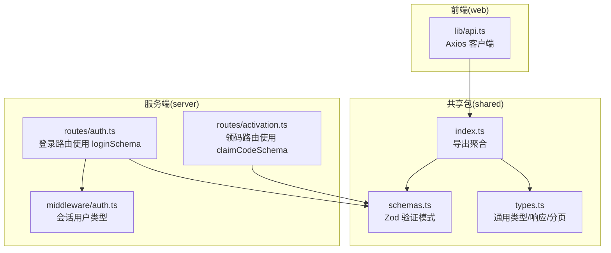
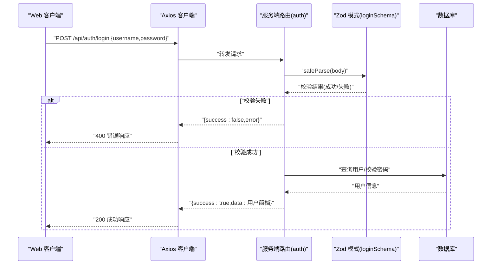
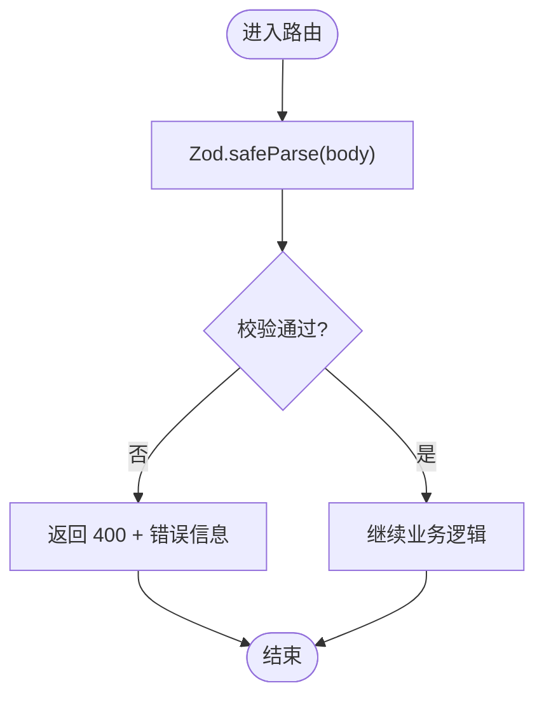
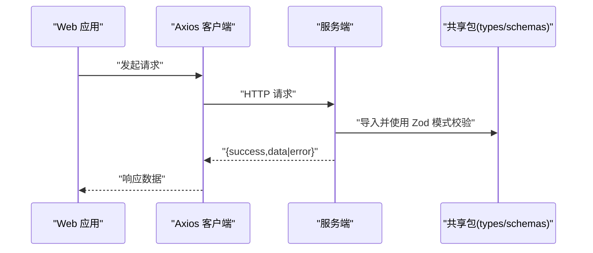
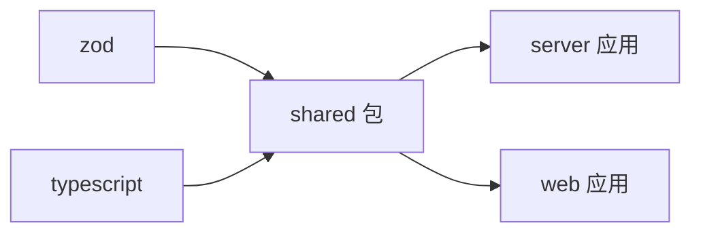

# 共享包和类型定义

<cite>
**本文引用的文件**
- [packages/shared/src/index.ts](file://packages/shared/src/index.ts)
- [packages/shared/src/types.ts](file://packages/shared/src/types.ts)
- [packages/shared/src/schemas.ts](file://packages/shared/src/schemas.ts)
- [packages/shared/package.json](file://packages/shared/package.json)
- [packages/shared/tsconfig.json](file://packages/shared/tsconfig.json)
- [apps/server/src/routes/auth.ts](file://apps/server/src/routes/auth.ts)
- [apps/server/src/routes/activation.ts](file://apps/server/src/routes/activation.ts)
- [apps/server/src/middleware/auth.ts](file://apps/server/src/middleware/auth.ts)
- [apps/web/src/lib/api.ts](file://apps/web/src/lib/api.ts)
- [package.json](file://package.json)
- [pnpm-workspace.yaml](file://pnpm-workspace.yaml)
</cite>

## 目录
1. [简介](#简介)
2. [项目结构](#项目结构)
3. [核心组件](#核心组件)
4. [架构总览](#架构总览)
5. [详细组件分析](#详细组件分析)
6. [依赖分析](#依赖分析)
7. [性能考量](#性能考量)
8. [故障排查指南](#故障排查指南)
9. [结论](#结论)
10. [附录](#附录)

## 简介
本文件系统化梳理 ZBH2 项目中的共享包 packages/shared 的设计与实现，目标是为前后端提供统一的 TypeScript 类型定义与 Zod 验证模式，确保 API 响应格式一致、输入输出校验严谨，并通过类型安全的客户端实现提升开发效率与可维护性。文档覆盖类型组织、验证规则、错误处理、版本管理与更新注意事项、使用示例与最佳实践，以及维护策略与向后兼容性建议。

## 项目结构
共享包位于 packages/shared，采用“导出聚合”的入口设计，将类型与验证模式集中暴露，便于在前后端按需导入。工作区采用 pnpm monorepo 结构，共享包作为独立包被服务端与 Web 前端共同消费。



图表来源
- [packages/shared/src/index.ts:1-3](file://packages/shared/src/index.ts#L1-L3)
- [packages/shared/src/types.ts:1-18](file://packages/shared/src/types.ts#L1-L18)
- [packages/shared/src/schemas.ts:1-51](file://packages/shared/src/schemas.ts#L1-L51)
- [apps/server/src/routes/auth.ts:1-51](file://apps/server/src/routes/auth.ts#L1-L51)
- [apps/server/src/routes/activation.ts:1-95](file://apps/server/src/routes/activation.ts#L1-L95)
- [apps/server/src/middleware/auth.ts:1-56](file://apps/server/src/middleware/auth.ts#L1-L56)
- [apps/web/src/lib/api.ts:1-16](file://apps/web/src/lib/api.ts#L1-L16)

章节来源
- [packages/shared/src/index.ts:1-3](file://packages/shared/src/index.ts#L1-L3)
- [packages/shared/src/types.ts:1-18](file://packages/shared/src/types.ts#L1-L18)
- [packages/shared/src/schemas.ts:1-51](file://packages/shared/src/schemas.ts#L1-L51)
- [pnpm-workspace.yaml:1-5](file://pnpm-workspace.yaml#L1-L5)

## 核心组件
- 类型定义模块：提供角色、状态枚举与统一响应、分页接口，保证前后端对返回结构的一致理解。
- Zod 验证模块：针对登录、用户创建、软件/帮助内容、激活产品与领码等场景定义强约束规则，确保输入合法性与默认值一致性。
- 导出聚合：通过 index.ts 将类型与验证模式统一导出，简化导入路径。

章节来源
- [packages/shared/src/types.ts:1-18](file://packages/shared/src/types.ts#L1-L18)
- [packages/shared/src/schemas.ts:1-51](file://packages/shared/src/schemas.ts#L1-L51)
- [packages/shared/src/index.ts:1-3](file://packages/shared/src/index.ts#L1-L3)

## 架构总览
共享包在系统中的定位是“契约层”：服务端用它进行请求体校验与响应结构化；前端用它进行类型推断与客户端封装。下图展示典型登录流程的调用链与数据流。



图表来源
- [apps/server/src/routes/auth.ts:9-33](file://apps/server/src/routes/auth.ts#L9-L33)
- [packages/shared/src/schemas.ts:3-6](file://packages/shared/src/schemas.ts#L3-L6)
- [apps/web/src/lib/api.ts:1-16](file://apps/web/src/lib/api.ts#L1-L16)

## 详细组件分析

### 类型定义与接口
- 角色与状态枚举：用于用户、内容、激活码等领域的状态统一表达，避免魔法字符串。
- 统一响应接口：约定 success、data、error 字段，便于前端统一处理。
- 分页接口：约定 items、total、page、pageSize，便于列表型数据的前后端协作。

```mermaid
classDiagram
class ApiResponse {
+boolean success
+T data
+string error
}
class PaginatedResponse {
+T[] items
+number total
+number page
+number pageSize
}
class UserRole {
<<enumeration>>
"admin"
"user"
}
class UserStatus {
<<enumeration>>
"active"
"disabled"
}
class ContentStatus {
<<enumeration>>
"draft"
"published"
"archived"
}
class ActivationCodeStatus {
<<enumeration>>
"available"
"granted"
"revoked"
}
```

图表来源
- [packages/shared/src/types.ts:6-17](file://packages/shared/src/types.ts#L6-L17)

章节来源
- [packages/shared/src/types.ts:1-18](file://packages/shared/src/types.ts#L1-L18)

### Zod 验证模式与规则
- 登录模式：限定用户名长度与密码长度范围，确保最小强度与合理上限。
- 用户创建模式：用户名与密码长度约束，默认角色为普通用户。
- 软件分类/帮助分类：名称长度限制与排序字段整数默认值。
- 软件条目/帮助文档：标题长度限制、描述默认空串、分类 ID 正整数、版本字符串默认空、排序整数默认值、状态枚举默认草稿。
- 激活产品：产品编码与名称长度限制、下载地址 URL 或空字符串、默认空。
- 领码请求：产品 ID 正整数。



图表来源
- [apps/server/src/routes/auth.ts:10-13](file://apps/server/src/routes/auth.ts#L10-L13)
- [apps/server/src/routes/activation.ts:9-12](file://apps/server/src/routes/activation.ts#L9-L12)
- [packages/shared/src/schemas.ts:3-6](file://packages/shared/src/schemas.ts#L3-L6)
- [packages/shared/src/schemas.ts:48-50](file://packages/shared/src/schemas.ts#L48-L50)

章节来源
- [packages/shared/src/schemas.ts:1-51](file://packages/shared/src/schemas.ts#L1-L51)
- [apps/server/src/routes/auth.ts:1-51](file://apps/server/src/routes/auth.ts#L1-L51)
- [apps/server/src/routes/activation.ts:1-95](file://apps/server/src/routes/activation.ts#L1-L95)

### 类型安全的 API 客户端
- 前端 Axios 客户端：统一基地址与凭据传递，拦截器中处理 401 等异常，结合共享类型可实现更严格的响应类型推断。
- 后端路由：通过导入共享的 Zod 模式进行请求体校验，返回统一响应结构，确保前后端契约一致。



图表来源
- [apps/web/src/lib/api.ts:1-16](file://apps/web/src/lib/api.ts#L1-L16)
- [apps/server/src/routes/auth.ts:6-6](file://apps/server/src/routes/auth.ts#L6-L6)
- [apps/server/src/routes/activation.ts:5-5](file://apps/server/src/routes/activation.ts#L5-L5)
- [packages/shared/src/index.ts:1-3](file://packages/shared/src/index.ts#L1-L3)

章节来源
- [apps/web/src/lib/api.ts:1-16](file://apps/web/src/lib/api.ts#L1-L16)
- [apps/server/src/routes/auth.ts:1-51](file://apps/server/src/routes/auth.ts#L1-L51)
- [apps/server/src/routes/activation.ts:1-95](file://apps/server/src/routes/activation.ts#L1-L95)

### 使用示例与最佳实践
- 在服务端路由中导入共享的 Zod 模式，先 safeParse 再执行业务逻辑，失败时返回统一错误结构。
- 在前端使用共享类型定义响应与表单数据结构，结合 Axios 客户端进行类型安全的请求与解析。
- 对于分页列表，统一使用共享的分页接口，避免前后端字段不一致导致的解析问题。
- 对于枚举类状态，优先使用共享枚举，减少映射歧义与维护成本。

章节来源
- [apps/server/src/routes/auth.ts:9-33](file://apps/server/src/routes/auth.ts#L9-L33)
- [apps/server/src/routes/activation.ts:8-75](file://apps/server/src/routes/activation.ts#L8-L75)
- [packages/shared/src/types.ts:6-17](file://packages/shared/src/types.ts#L6-L17)

## 依赖分析
- 共享包依赖：zod（运行时验证）、TypeScript（类型声明）。
- 工作区配置：pnpm monorepo，共享包与应用通过 workspace 管理。
- 构建脚本：根目录构建脚本先构建共享包，再构建服务端与前端。



图表来源
- [packages/shared/package.json:17-22](file://packages/shared/package.json#L17-L22)
- [pnpm-workspace.yaml:1-5](file://pnpm-workspace.yaml#L1-L5)
- [package.json:8-8](file://package.json#L8-L8)

章节来源
- [packages/shared/package.json:1-24](file://packages/shared/package.json#L1-L24)
- [pnpm-workspace.yaml:1-5](file://pnpm-workspace.yaml#L1-L5)
- [package.json:1-20](file://package.json#L1-L20)

## 性能考量
- Zod 校验开销：在高频接口上，建议仅对关键字段进行严格校验，避免过度验证带来的 CPU 压力。
- 类型声明：保持类型定义简洁明确，减少泛型层级过深导致的编译与检查成本。
- 分页与列表：服务端分页查询应配合索引与 LIMIT，前端仅请求必要字段，降低网络与内存压力。

## 故障排查指南
- 400 错误：通常由 Zod 校验失败引起，检查请求体是否符合共享模式定义。
- 401/403：认证中间件未通过，确认会话 Cookie 与用户状态。
- 统一响应结构：前后端均应遵循 success/data/error 的约定，便于快速定位问题。

章节来源
- [apps/server/src/routes/auth.ts:10-22](file://apps/server/src/routes/auth.ts#L10-L22)
- [apps/server/src/middleware/auth.ts:42-55](file://apps/server/src/middleware/auth.ts#L42-L55)

## 结论
共享包通过统一的类型与 Zod 验证模式，为前后端提供了清晰的契约边界，显著提升了系统的类型安全性与可维护性。建议在新增接口时同步完善共享类型与验证模式，并在升级时遵循语义化版本策略，确保向后兼容。

## 附录

### 版本管理与更新注意事项
- 当前共享包版本：见 [packages/shared/package.json:3-3](file://packages/shared/package.json#L3-L3)。
- 更新策略建议：
  - 修复类变更：小版本号递增（PATCH）。
  - 新增非破坏性功能：次版本号递增（MINOR）。
  - 破坏性变更：主版本号递增（MAJOR），并配套迁移指南。
- 发布流程：先在共享包内完成变更与测试，再在根目录构建脚本中统一构建，最后在各应用中更新依赖并回归测试。

章节来源
- [packages/shared/package.json:1-24](file://packages/shared/package.json#L1-L24)
- [package.json:8-8](file://package.json#L8-L8)

### 类型与验证清单
- 类型：角色、状态枚举、统一响应、分页接口。
- 验证：登录、用户创建、分类、条目、激活产品、领码。
- 建议扩展：根据业务增长逐步补充更多领域模型的类型与验证模式。

章节来源
- [packages/shared/src/types.ts:1-18](file://packages/shared/src/types.ts#L1-L18)
- [packages/shared/src/schemas.ts:1-51](file://packages/shared/src/schemas.ts#L1-L51)