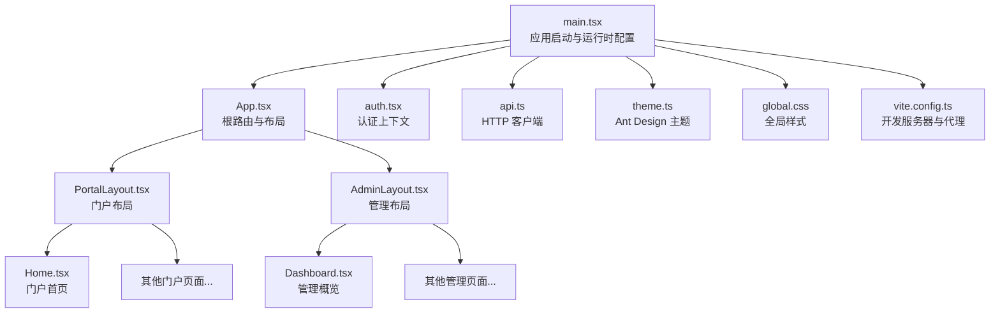
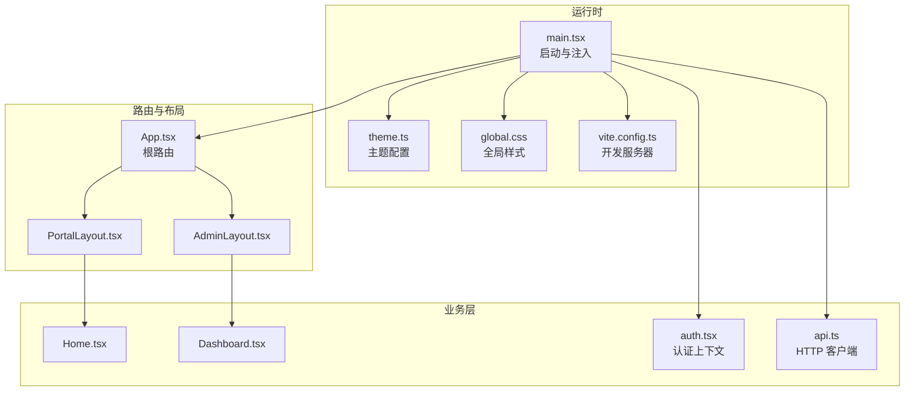
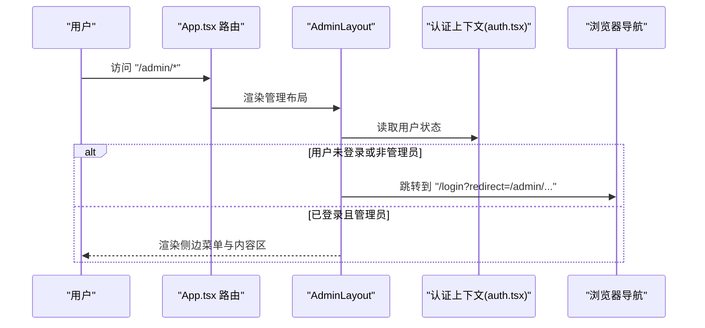
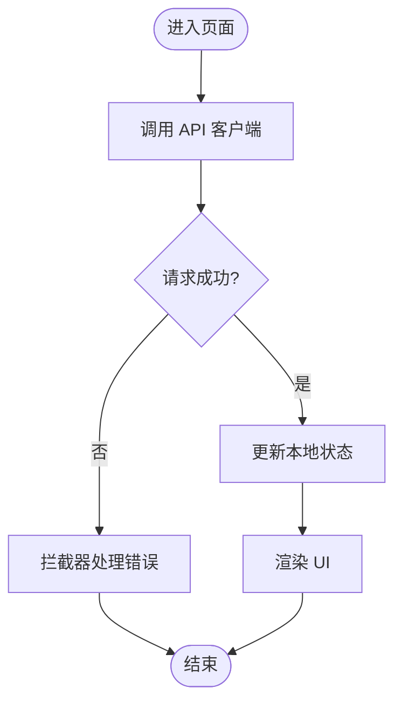
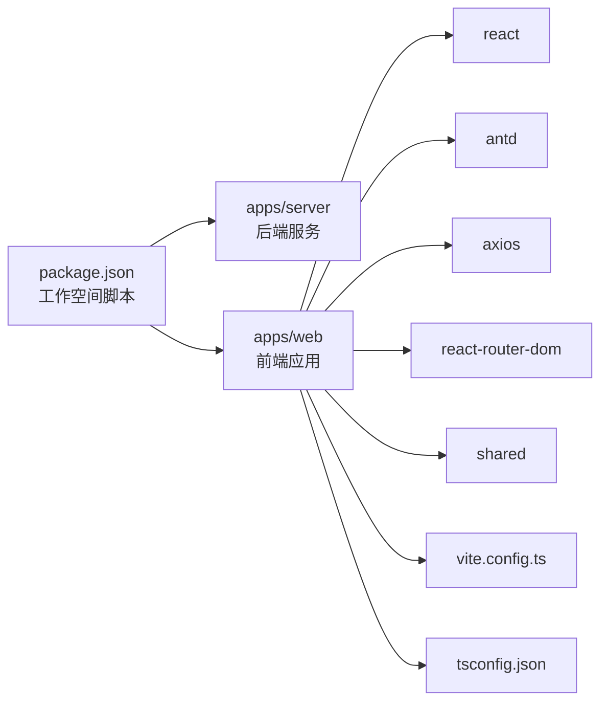

# 前端应用架构

<cite>
**本文引用的文件**
- [apps/web/src/main.tsx](file://apps/web/src/main.tsx)
- [apps/web/src/App.tsx](file://apps/web/src/App.tsx)
- [apps/web/src/layouts/PortalLayout.tsx](file://apps/web/src/layouts/PortalLayout.tsx)
- [apps/web/src/layouts/AdminLayout.tsx](file://apps/web/src/layouts/AdminLayout.tsx)
- [apps/web/src/lib/auth.tsx](file://apps/web/src/lib/auth.tsx)
- [apps/web/src/lib/api.ts](file://apps/web/src/lib/api.ts)
- [apps/web/src/theme.ts](file://apps/web/src/theme.ts)
- [apps/web/src/global.css](file://apps/web/src/global.css)
- [apps/web/vite.config.ts](file://apps/web/vite.config.ts)
- [apps/web/package.json](file://apps/web/package.json)
- [apps/web/tsconfig.json](file://apps/web/tsconfig.json)
- [apps/web/src/pages/Home.tsx](file://apps/web/src/pages/Home.tsx)
- [apps/web/src/pages/admin/Dashboard.tsx](file://apps/web/src/pages/admin/Dashboard.tsx)
- [package.json](file://package.json)
</cite>

## 目录
1. [引言](#引言)
2. [项目结构](#项目结构)
3. [核心组件](#核心组件)
4. [架构总览](#架构总览)
5. [详细组件分析](#详细组件分析)
6. [依赖关系分析](#依赖关系分析)
7. [性能考虑](#性能考虑)
8. [故障排查指南](#故障排查指南)
9. [结论](#结论)
10. [附录](#附录)

## 引言
本文件为 ZBH2 前端应用的架构文档，聚焦于基于 React 18 的单页应用（SPA）整体设计与实现。内容涵盖组件层次、状态管理、路由体系、布局设计、Ant Design 5 使用与主题定制、权限控制、组件开发规范、性能优化策略以及开发与测试相关建议。文档以实际源码为依据，避免臆测，力求帮助不同背景的读者快速理解并高效参与开发。

## 项目结构
- 应用入口与运行时配置
  - 入口文件负责挂载根组件、注入国际化与主题、提供认证上下文与路由容器。
  - Vite 开发服务器与代理配置，本地联调后端接口。
- 路由与布局
  - 根路由集中定义门户与管理后台两类布局下的页面映射，支持嵌套路由与动态路由参数。
- 布局层
  - PortalLayout：面向普通用户的门户级导航与头部交互。
  - AdminLayout：面向管理员的侧边菜单与权限拦截。
- 页面与业务组件
  - 门户页面与管理后台页面分别位于 pages 与 pages/admin 下，采用函数式组件与 Hooks。
- 共享与工具
  - 认证上下文、API 客户端、全局样式与 Ant Design 主题配置。

图表来源
- [apps/web/src/main.tsx:1-22](file://apps/web/src/main.tsx#L1-L22)
- [apps/web/src/App.tsx:38-79](file://apps/web/src/App.tsx#L38-L79)
- [apps/web/src/layouts/PortalLayout.tsx:20-75](file://apps/web/src/layouts/PortalLayout.tsx#L20-L75)
- [apps/web/src/layouts/AdminLayout.tsx:88-126](file://apps/web/src/layouts/AdminLayout.tsx#L88-L126)
- [apps/web/src/pages/Home.tsx:30-164](file://apps/web/src/pages/Home.tsx#L30-L164)
- [apps/web/src/pages/admin/Dashboard.tsx:8-46](file://apps/web/src/pages/admin/Dashboard.tsx#L8-L46)
- [apps/web/src/lib/auth.tsx:20-54](file://apps/web/src/lib/auth.tsx#L20-L54)
- [apps/web/src/lib/api.ts:1-16](file://apps/web/src/lib/api.ts#L1-L16)
- [apps/web/src/theme.ts:1-23](file://apps/web/src/theme.ts#L1-L23)
- [apps/web/src/global.css:1-44](file://apps/web/src/global.css#L1-L44)
- [apps/web/vite.config.ts:1-13](file://apps/web/vite.config.ts#L1-L13)

章节来源
- [apps/web/src/main.tsx:1-22](file://apps/web/src/main.tsx#L1-L22)
- [apps/web/src/App.tsx:38-79](file://apps/web/src/App.tsx#L38-L79)
- [apps/web/vite.config.ts:1-13](file://apps/web/vite.config.ts#L1-L13)
- [apps/web/package.json:1-29](file://apps/web/package.json#L1-L29)
- [apps/web/tsconfig.json:1-16](file://apps/web/tsconfig.json#L1-L16)
- [package.json:1-20](file://package.json#L1-L20)

## 核心组件
- 应用根组件与路由
  - 根组件集中声明两类布局：PortalLayout 与 AdminLayout，并在各自布局下注册子路由，形成清晰的嵌套路由结构。
  - 动态路由参数通过路径占位符定义，例如帮助详情页的 id 参数。
- 布局组件
  - PortalLayout：提供顶部导航菜单、用户下拉菜单、登录/登出入口与页脚；根据当前路径高亮选中项。
  - AdminLayout：提供侧边栏菜单、顶部用户信息与返回门户链接；内置管理员角色校验与未授权跳转逻辑。
- 认证上下文
  - 提供用户信息、登录、登出、刷新能力；在应用启动时自动尝试刷新用户状态，保证页面重载后的状态一致性。
- API 客户端
  - 统一的 axios 实例，设置基础路径与凭据携带；响应拦截器处理通用错误场景（如 401）。
- Ant Design 5 配置
  - 在入口处通过 ConfigProvider 注入中文语言包与自定义主题；主题通过 token 与组件级覆盖实现品牌统一。
- 全局样式
  - 定义 CSS 变量与门户首页的卡片网格等样式，确保基础视觉一致。

章节来源
- [apps/web/src/App.tsx:38-79](file://apps/web/src/App.tsx#L38-L79)
- [apps/web/src/layouts/PortalLayout.tsx:20-75](file://apps/web/src/layouts/PortalLayout.tsx#L20-L75)
- [apps/web/src/layouts/AdminLayout.tsx:88-126](file://apps/web/src/layouts/AdminLayout.tsx#L88-L126)
- [apps/web/src/lib/auth.tsx:20-54](file://apps/web/src/lib/auth.tsx#L20-L54)
- [apps/web/src/lib/api.ts:1-16](file://apps/web/src/lib/api.ts#L1-L16)
- [apps/web/src/theme.ts:1-23](file://apps/web/src/theme.ts#L1-L23)
- [apps/web/src/global.css:1-44](file://apps/web/src/global.css#L1-L44)

## 架构总览
应用采用“布局 + 页面”的分层组织，路由系统以布局为单位划分功能域，页面内部通过 Hooks 与 API 客户端进行数据交互。认证上下文贯穿全局，为权限控制与用户态展示提供支撑。

图表来源
- [apps/web/src/main.tsx:1-22](file://apps/web/src/main.tsx#L1-L22)
- [apps/web/src/App.tsx:38-79](file://apps/web/src/App.tsx#L38-L79)
- [apps/web/src/layouts/PortalLayout.tsx:20-75](file://apps/web/src/layouts/PortalLayout.tsx#L20-L75)
- [apps/web/src/layouts/AdminLayout.tsx:88-126](file://apps/web/src/layouts/AdminLayout.tsx#L88-L126)
- [apps/web/src/pages/Home.tsx:30-164](file://apps/web/src/pages/Home.tsx#L30-L164)
- [apps/web/src/pages/admin/Dashboard.tsx:8-46](file://apps/web/src/pages/admin/Dashboard.tsx#L8-L46)
- [apps/web/src/lib/auth.tsx:20-54](file://apps/web/src/lib/auth.tsx#L20-L54)
- [apps/web/src/lib/api.ts:1-16](file://apps/web/src/lib/api.ts#L1-L16)
- [apps/web/src/theme.ts:1-23](file://apps/web/src/theme.ts#L1-L23)
- [apps/web/src/global.css:1-44](file://apps/web/src/global.css#L1-L44)
- [apps/web/vite.config.ts:1-13](file://apps/web/vite.config.ts#L1-L13)

## 详细组件分析

### 路由系统与权限控制
- 路由设计
  - 门户路由组：以 PortalLayout 包裹，包含首页、软件下载、帮助文档、激活、云服务、AI 聊天、登录等页面。
  - 管理后台路由组：以 AdminLayout 包裹，包含仪表盘与多类管理页面，支持嵌套路由与子路径。
  - 动态路由：帮助详情页使用路径参数 id。
- 权限控制
  - AdminLayout 内部在渲染前检查用户角色，非管理员或加载中则跳转到登录页并携带重定向地址。
- 数据流
  - 页面通过 API 客户端发起请求，认证上下文提供用户信息与登录/登出能力。

图表来源
- [apps/web/src/App.tsx:53-76](file://apps/web/src/App.tsx#L53-L76)
- [apps/web/src/layouts/AdminLayout.tsx:88-126](file://apps/web/src/layouts/AdminLayout.tsx#L88-L126)
- [apps/web/src/lib/auth.tsx:20-54](file://apps/web/src/lib/auth.tsx#L20-L54)

章节来源
- [apps/web/src/App.tsx:38-79](file://apps/web/src/App.tsx#L38-L79)
- [apps/web/src/layouts/AdminLayout.tsx:88-126](file://apps/web/src/layouts/AdminLayout.tsx#L88-L126)
- [apps/web/src/lib/auth.tsx:20-54](file://apps/web/src/lib/auth.tsx#L20-L54)

### PortalLayout 设计理念与适用场景
- 设计理念
  - 顶部横向导航菜单，右侧用户下拉菜单，支持管理员入口、我的激活码、我的工单与退出登录。
  - 选中状态基于当前路径的主路径段进行匹配，提升导航体验。
- 适用场景
  - 面向普通用户的门户页面，强调易用性与品牌一致性。
- 与认证上下文协作
  - 根据登录状态显示登录按钮或用户下拉菜单；管理员可直达管理后台。

章节来源
- [apps/web/src/layouts/PortalLayout.tsx:20-75](file://apps/web/src/layouts/PortalLayout.tsx#L20-L75)
- [apps/web/src/lib/auth.tsx:20-54](file://apps/web/src/lib/auth.tsx#L20-L54)

### AdminLayout 设计理念与适用场景
- 设计理念
  - 侧边栏菜单分级展示，支持多级子菜单；顶部显示欢迎语与返回门户链接。
  - 默认展开多个常用分组，便于管理员快速定位功能。
- 适用场景
  - 后台管理界面，承载大量配置与数据管理页面。
- 权限拦截
  - 在渲染前进行角色校验，非管理员强制跳转至登录页。

章节来源
- [apps/web/src/layouts/AdminLayout.tsx:88-126](file://apps/web/src/layouts/AdminLayout.tsx#L88-L126)

### Ant Design 5 使用与主题定制
- 使用方式
  - 在入口通过 ConfigProvider 注入中文语言包与主题配置，确保全局组件语言与风格一致。
- 主题定制
  - 通过 token 与组件级覆盖实现品牌色、圆角、字体与布局/菜单背景等统一风格。
- 样式覆盖
  - 全局 CSS 文件提供变量与门户首页样式，补充 Ant Design 组件未覆盖的细节。

章节来源
- [apps/web/src/main.tsx:14-18](file://apps/web/src/main.tsx#L14-L18)
- [apps/web/src/theme.ts:1-23](file://apps/web/src/theme.ts#L1-L23)
- [apps/web/src/global.css:1-44](file://apps/web/src/global.css#L1-L44)

### 组件开发规范
- 函数式组件与 Hooks
  - 页面普遍采用函数式组件与 useEffect/useState/useCallback 等 Hooks 进行状态与副作用管理。
  - 示例：门户首页在挂载时并行请求多项数据，最终统一更新状态。
- Props 传递
  - 布局组件通过 Outlet 渲染子页面，子页面通过 Link/导航钩子进行页面内跳转。
- 类型安全
  - TypeScript 编译选项启用严格模式与 JSX 支持，确保类型安全。

章节来源
- [apps/web/src/pages/Home.tsx:30-164](file://apps/web/src/pages/Home.tsx#L30-L164)
- [apps/web/src/App.tsx:38-79](file://apps/web/src/App.tsx#L38-L79)
- [apps/web/tsconfig.json:1-16](file://apps/web/tsconfig.json#L1-L16)

### 状态管理策略与数据流
- Context API
  - 认证上下文提供用户信息与登录/登出能力，所有页面均可通过 useAuth 获取。
- 数据流
  - 页面通过 API 客户端发起请求，响应结果更新本地状态；登录/登出会同步更新上下文状态。
- 错误处理
  - API 客户端拦截器对 401 等错误进行统一处理，避免重复逻辑。

图表来源
- [apps/web/src/lib/api.ts:1-16](file://apps/web/src/lib/api.ts#L1-L16)
- [apps/web/src/lib/auth.tsx:20-54](file://apps/web/src/lib/auth.tsx#L20-L54)

章节来源
- [apps/web/src/lib/auth.tsx:20-54](file://apps/web/src/lib/auth.tsx#L20-L54)
- [apps/web/src/lib/api.ts:1-16](file://apps/web/src/lib/api.ts#L1-L16)

### 性能优化建议
- 懒加载与代码分割
  - 将大型页面按需导入，减少首屏体积与初次渲染时间。
- 缓存策略
  - 对静态数据与不频繁变更的数据进行本地缓存，降低重复请求。
- 图片与资源
  - 对图片与静态资源进行压缩与懒加载，优化网络传输。
- 依赖与构建
  - 使用现代打包工具与合适的模块解析策略，避免重复依赖与循环依赖。

[本节为通用性能建议，无需特定文件引用]

### 故障排查指南
- 登录/权限问题
  - 若访问管理后台被重定向到登录页，请确认已登录且角色为管理员。
- 接口异常
  - 检查代理配置是否正确指向后端服务，确认凭据与跨域设置。
- 样式异常
  - 确认主题配置与全局样式未被覆盖冲突；Ant Design 组件语言包已正确注入。

章节来源
- [apps/web/src/layouts/AdminLayout.tsx:93-97](file://apps/web/src/layouts/AdminLayout.tsx#L93-L97)
- [apps/web/vite.config.ts:6-11](file://apps/web/vite.config.ts#L6-L11)
- [apps/web/src/main.tsx:14-18](file://apps/web/src/main.tsx#L14-L18)

## 依赖关系分析
- 运行时依赖
  - React 18、Ant Design 5、Axios、React Router DOM、共享包 shared。
- 构建与开发
  - Vite、@vitejs/plugin-react、TypeScript。
- 工作空间脚本
  - 提供并行开发与构建脚本，便于前后端协同。

图表来源
- [package.json:1-20](file://package.json#L1-L20)
- [apps/web/package.json:1-29](file://apps/web/package.json#L1-L29)
- [apps/web/vite.config.ts:1-13](file://apps/web/vite.config.ts#L1-L13)
- [apps/web/tsconfig.json:1-16](file://apps/web/tsconfig.json#L1-L16)

章节来源
- [apps/web/package.json:1-29](file://apps/web/package.json#L1-L29)
- [package.json:1-20](file://package.json#L1-L20)

## 性能考虑
- 首屏优化
  - 将非关键页面组件进行懒加载，减少初始包体。
- 并行加载
  - 页面内并行请求多个数据源，缩短等待时间。
- 组件复用
  - 复用 Ant Design 组件与通用布局，减少重复实现。
- 打包与缓存
  - 利用现代打包工具的代码分割与长效缓存策略，提升二次加载速度。

[本节为通用性能建议，无需特定文件引用]

## 故障排查指南
- 登录/权限问题
  - 若访问管理后台被重定向到登录页，请确认已登录且角色为管理员。
- 接口异常
  - 检查代理配置是否正确指向后端服务，确认凭据与跨域设置。
- 样式异常
  - 确认主题配置与全局样式未被覆盖冲突；Ant Design 组件语言包已正确注入。

章节来源
- [apps/web/src/layouts/AdminLayout.tsx:93-97](file://apps/web/src/layouts/AdminLayout.tsx#L93-L97)
- [apps/web/vite.config.ts:6-11](file://apps/web/vite.config.ts#L6-L11)
- [apps/web/src/main.tsx:14-18](file://apps/web/src/main.tsx#L14-L18)

## 结论
ZBH2 前端应用以清晰的布局与路由分层为基础，结合 Ant Design 5 的主题体系与 Context API 的认证上下文，实现了门户与管理后台的差异化体验。通过合理的组件开发规范、数据流设计与性能优化策略，应用具备良好的可维护性与扩展性。后续可在懒加载、缓存与测试方面进一步完善，以提升用户体验与开发效率。

## 附录
- 开发与构建
  - 本地开发：同时启动前端与后端服务，或单独启动前端。
  - 构建产物：先构建共享包，再构建后端与前端。
- 数据模型与页面职责
  - 门户首页聚合统计与热门内容，管理后台首页展示关键指标。

章节来源
- [package.json:4-11](file://package.json#L4-L11)
- [apps/web/src/pages/Home.tsx:30-164](file://apps/web/src/pages/Home.tsx#L30-L164)
- [apps/web/src/pages/admin/Dashboard.tsx:8-46](file://apps/web/src/pages/admin/Dashboard.tsx#L8-L46)