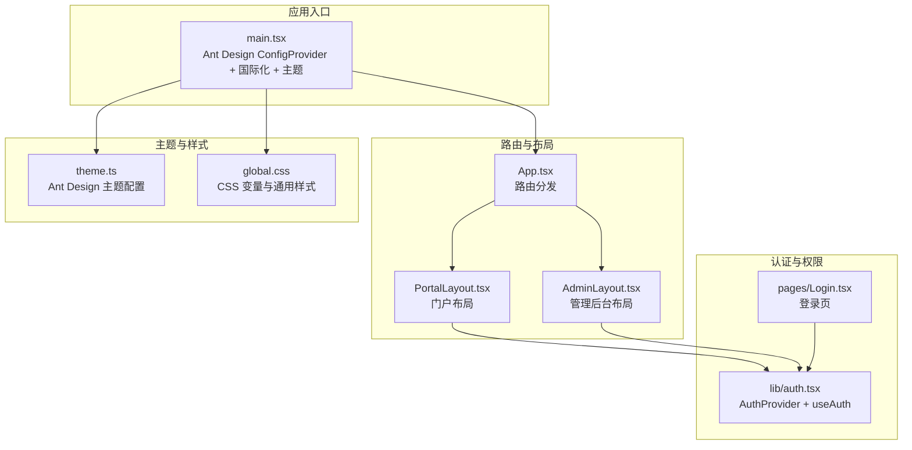
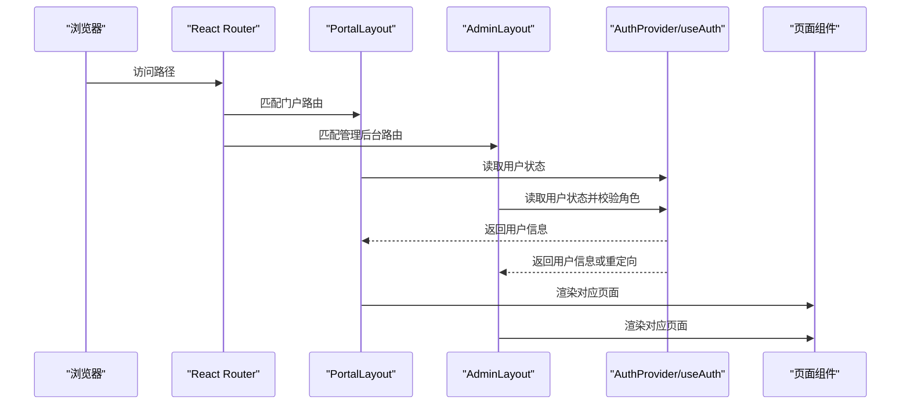
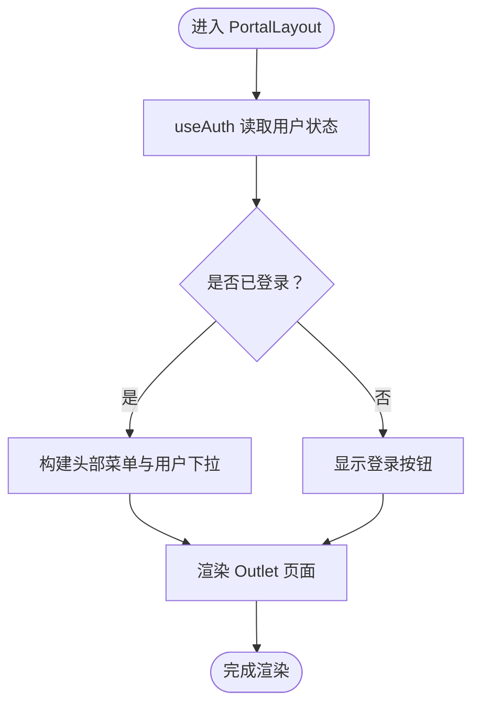
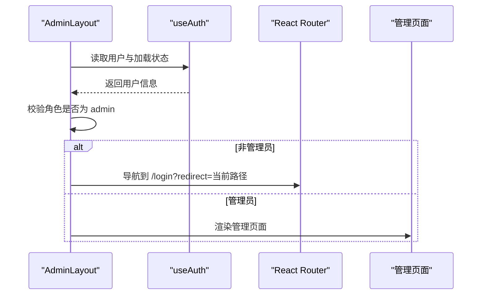
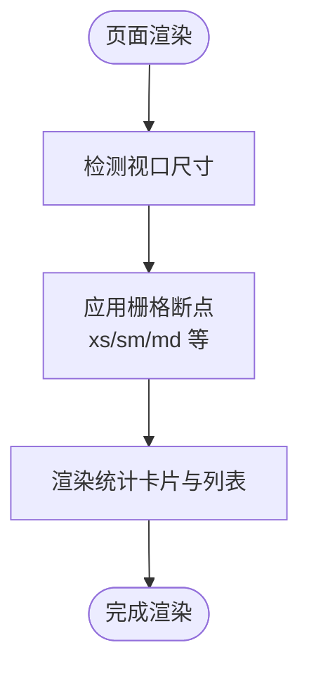
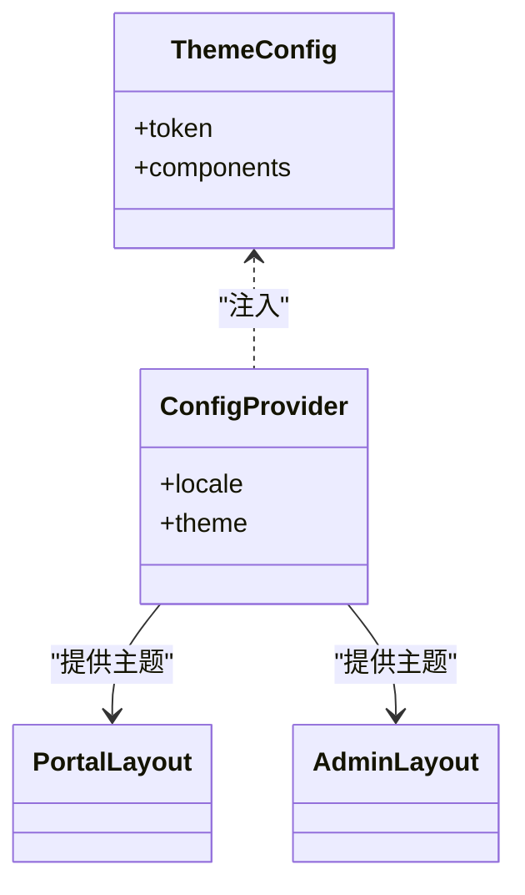
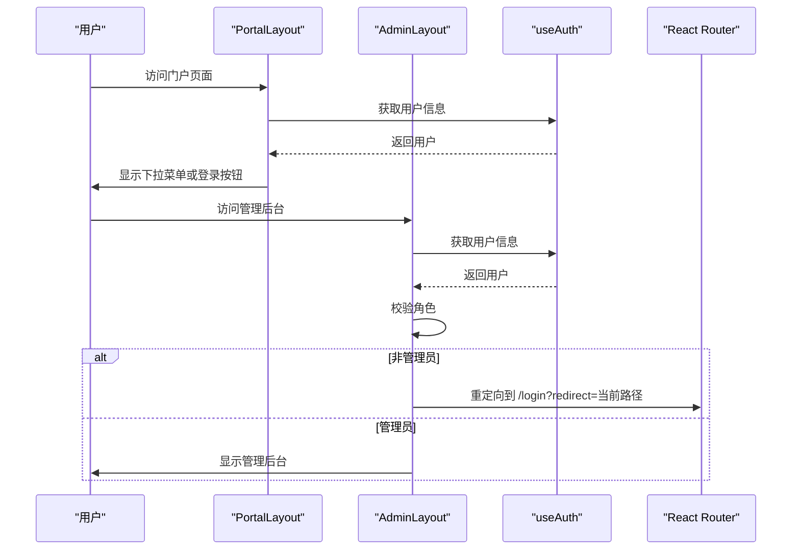
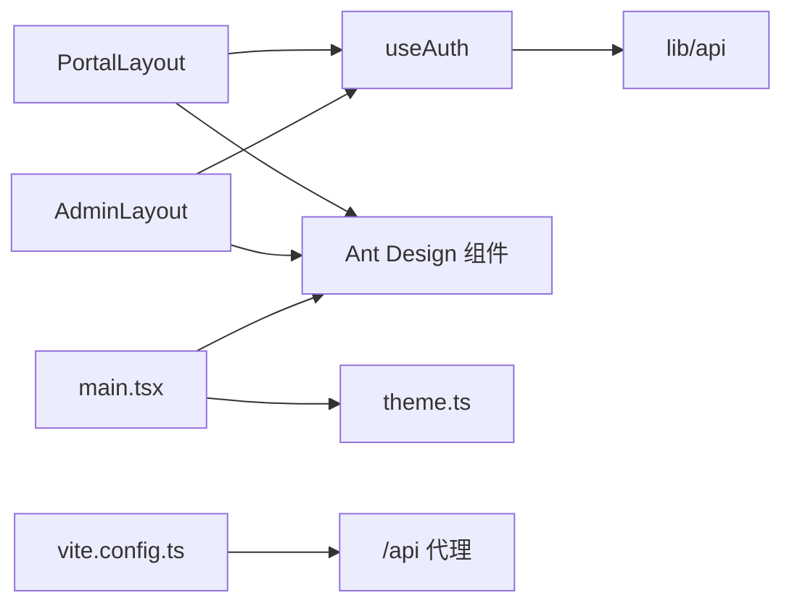

# 布局系统设计

<cite>
**本文引用的文件**
- [apps/web/src/layouts/PortalLayout.tsx](file://apps/web/src/layouts/PortalLayout.tsx)
- [apps/web/src/layouts/AdminLayout.tsx](file://apps/web/src/layouts/AdminLayout.tsx)
- [apps/web/src/theme.ts](file://apps/web/src/theme.ts)
- [apps/web/src/global.css](file://apps/web/src/global.css)
- [apps/web/src/App.tsx](file://apps/web/src/App.tsx)
- [apps/web/src/lib/auth.tsx](file://apps/web/src/lib/auth.tsx)
- [apps/web/src/main.tsx](file://apps/web/src/main.tsx)
- [apps/web/src/pages/Home.tsx](file://apps/web/src/pages/Home.tsx)
- [apps/web/src/pages/admin/Dashboard.tsx](file://apps/web/src/pages/admin/Dashboard.tsx)
- [apps/web/src/pages/Login.tsx](file://apps/web/src/pages/Login.tsx)
- [apps/web/src/lib/api.ts](file://apps/web/src/lib/api.ts)
- [apps/web/vite.config.ts](file://apps/web/vite.config.ts)
- [apps/web/package.json](file://apps/web/package.json)
</cite>

## 目录
1. [引言](#引言)
2. [项目结构](#项目结构)
3. [核心组件](#核心组件)
4. [架构总览](#架构总览)
5. [详细组件分析](#详细组件分析)
6. [依赖关系分析](#依赖关系分析)
7. [性能考虑](#性能考虑)
8. [故障排查指南](#故障排查指南)
9. [结论](#结论)
10. [附录](#附录)

## 引言
本文件面向ZBH2前端布局系统，聚焦PortalLayout与AdminLayout两种布局的设计理念与实现原理，系统阐述头部导航、侧边菜单、主内容区与底部信息的布局策略；解释响应式设计在页面组件中的落地方式；说明Ant Design主题系统的定制方法（颜色、字体与组件样式）；给出布局切换机制（权限控制与用户偏好）与性能优化建议。文档同时提供可视化图示，帮助不同技术背景的读者快速理解与应用。

## 项目结构
Web端采用React + Vite + Ant Design技术栈，路由通过React Router组织，布局层位于apps/web/src/layouts，全局样式与主题位于apps/web/src/theme.ts与apps/web/src/global.css，入口在apps/web/src/main.tsx中注入Ant Design ConfigProvider与国际化配置，并通过apps/web/src/App.tsx进行路由分发。

图表来源
- [apps/web/src/main.tsx:1-22](file://apps/web/src/main.tsx#L1-L22)
- [apps/web/src/App.tsx:1-80](file://apps/web/src/App.tsx#L1-L80)
- [apps/web/src/layouts/PortalLayout.tsx:1-76](file://apps/web/src/layouts/PortalLayout.tsx#L1-L76)
- [apps/web/src/layouts/AdminLayout.tsx:1-127](file://apps/web/src/layouts/AdminLayout.tsx#L1-L127)
- [apps/web/src/theme.ts:1-23](file://apps/web/src/theme.ts#L1-L23)
- [apps/web/src/global.css:1-44](file://apps/web/src/global.css#L1-L44)
- [apps/web/src/lib/auth.tsx:1-55](file://apps/web/src/lib/auth.tsx#L1-L55)
- [apps/web/src/pages/Login.tsx:1-47](file://apps/web/src/pages/Login.tsx#L1-L47)

章节来源
- [apps/web/src/main.tsx:1-22](file://apps/web/src/main.tsx#L1-L22)
- [apps/web/src/App.tsx:1-80](file://apps/web/src/App.tsx#L1-L80)

## 核心组件
- PortalLayout：门户布局，采用Ant Design Layout的Header/Content/Footer三段式，顶部横向导航菜单，右侧用户下拉菜单或登录按钮；内容区由Outlet承载；底部展示版权信息。
- AdminLayout：管理后台布局，采用Sider/Content/Header组合，左侧内嵌菜单，支持多级子菜单；顶部显示欢迎语与返回门户链接；内容区承载管理页面。
- 主题系统：通过Ant Design ThemeConfig统一定义主色、容器背景、圆角与字体；通过ConfigProvider注入到全局。
- 全局样式：通过CSS变量统一品牌色，基础盒模型与页面最小高度，部分页面特定样式类（如门户首页hero）。

章节来源
- [apps/web/src/layouts/PortalLayout.tsx:20-76](file://apps/web/src/layouts/PortalLayout.tsx#L20-L76)
- [apps/web/src/layouts/AdminLayout.tsx:88-127](file://apps/web/src/layouts/AdminLayout.tsx#L88-L127)
- [apps/web/src/theme.ts:3-20](file://apps/web/src/theme.ts#L3-L20)
- [apps/web/src/global.css:1-44](file://apps/web/src/global.css#L1-L44)

## 架构总览
PortalLayout与AdminLayout分别作为路由的顶级布局，内部通过Outlet渲染具体页面组件。认证上下文提供用户状态与登录/登出能力，用于控制头部菜单与跳转逻辑。Ant Design主题通过ConfigProvider集中注入，确保全局一致的视觉风格。

图表来源
- [apps/web/src/App.tsx:38-79](file://apps/web/src/App.tsx#L38-L79)
- [apps/web/src/layouts/PortalLayout.tsx:20-76](file://apps/web/src/layouts/PortalLayout.tsx#L20-L76)
- [apps/web/src/layouts/AdminLayout.tsx:88-127](file://apps/web/src/layouts/AdminLayout.tsx#L88-L127)
- [apps/web/src/lib/auth.tsx:20-55](file://apps/web/src/lib/auth.tsx#L20-L55)

## 详细组件分析

### PortalLayout 设计与实现
- 结构设计
  - 头部Header：包含Logo、横向菜单、用户下拉菜单或登录按钮。
  - 内容区Content：通过Outlet承载当前路由页面。
  - 底部Footer：展示版权信息。
- 菜单与选中态
  - 横向菜单项基于路径前缀计算选中键，确保导航高亮与URL同步。
- 用户交互
  - 登录后根据角色显示“管理后台”入口；支持“我的激活码”、“我的工单”等快捷跳转；退出登录后回到首页。
- 样式与主题
  - 使用Ant Design内置颜色与透明背景，配合全局CSS变量保证品牌一致性。

图表来源
- [apps/web/src/layouts/PortalLayout.tsx:20-76](file://apps/web/src/layouts/PortalLayout.tsx#L20-L76)
- [apps/web/src/lib/auth.tsx:20-55](file://apps/web/src/lib/auth.tsx#L20-L55)

章节来源
- [apps/web/src/layouts/PortalLayout.tsx:20-76](file://apps/web/src/layouts/PortalLayout.tsx#L20-L76)

### AdminLayout 设计与实现
- 结构设计
  - 左侧Sider：内嵌菜单，支持多级子菜单，默认展开软件、文档、激活、资产、监控等分组。
  - 右侧主区域：Header显示欢迎语与返回门户链接；Content承载管理页面。
- 权限控制
  - 通过useAuth在挂载时检查用户角色，非管理员自动重定向至登录页（携带redirect参数）。
- 交互与导航
  - 顶部返回门户链接便于快速切换；菜单项与路由路径一一对应，选中态基于当前路径。

图表来源
- [apps/web/src/layouts/AdminLayout.tsx:88-127](file://apps/web/src/layouts/AdminLayout.tsx#L88-L127)
- [apps/web/src/lib/auth.tsx:20-55](file://apps/web/src/lib/auth.tsx#L20-L55)

章节来源
- [apps/web/src/layouts/AdminLayout.tsx:88-127](file://apps/web/src/layouts/AdminLayout.tsx#L88-L127)

### 响应式设计与移动端适配
- 页面组件层面的响应式
  - Home页面：统计卡片与热门软件/最新文档两列布局，使用栅格系统在不同断点下调整列宽（例如xs全宽、sm分栏），提升移动端可读性。
  - Dashboard页面：统计卡片在小屏设备上半宽显示，在中屏及以上设备上四列布局，保证信息密度与可操作性。
- CSS网格与最大宽度
  - 全局CSS提供卡片网格类，使用CSS Grid与minmax实现自适应列数，配合最大宽度限制，确保在大屏下的观感不铺张。
- 移动端体验
  - 通过Ant Design组件的默认响应行为与栅格断点，结合页面组件的列配置，自然适配手机与平板设备。

图表来源
- [apps/web/src/pages/Home.tsx:60-165](file://apps/web/src/pages/Home.tsx#L60-L165)
- [apps/web/src/pages/admin/Dashboard.tsx:27-47](file://apps/web/src/pages/admin/Dashboard.tsx#L27-L47)
- [apps/web/src/global.css:36-43](file://apps/web/src/global.css#L36-L43)

章节来源
- [apps/web/src/pages/Home.tsx:60-165](file://apps/web/src/pages/Home.tsx#L60-L165)
- [apps/web/src/pages/admin/Dashboard.tsx:27-47](file://apps/web/src/pages/admin/Dashboard.tsx#L27-L47)
- [apps/web/src/global.css:36-43](file://apps/web/src/global.css#L36-L43)

### Ant Design 主题系统定制
- 主题配置
  - 通过ThemeConfig定义主色、容器背景、圆角与字体族，确保全局视觉一致性。
  - 组件级覆盖：为Layout与Menu设置header与sider背景、菜单项背景等，避免重复内联样式。
- 入口注入
  - 在main.tsx中通过ConfigProvider注入zhCN语言包与主题配置，使所有AntD组件遵循统一风格。
- 品牌色统一
  - CSS变量定义品牌主色、浅色与深色，用于页面局部装饰与强调，与AntD主题形成互补。

图表来源
- [apps/web/src/theme.ts:3-20](file://apps/web/src/theme.ts#L3-L20)
- [apps/web/src/main.tsx:11-21](file://apps/web/src/main.tsx#L11-L21)
- [apps/web/src/layouts/PortalLayout.tsx:36-76](file://apps/web/src/layouts/PortalLayout.tsx#L36-L76)
- [apps/web/src/layouts/AdminLayout.tsx:101-127](file://apps/web/src/layouts/AdminLayout.tsx#L101-L127)

章节来源
- [apps/web/src/theme.ts:3-20](file://apps/web/src/theme.ts#L3-L20)
- [apps/web/src/main.tsx:11-21](file://apps/web/src/main.tsx#L11-L21)
- [apps/web/src/global.css:1-6](file://apps/web/src/global.css#L1-L6)

### 布局切换机制与权限控制
- 切换机制
  - PortalLayout：根据用户登录状态决定显示用户下拉菜单或登录按钮；下拉菜单包含“管理后台”入口（仅管理员可见）、个人相关功能与退出登录。
  - AdminLayout：在挂载时检查用户角色，若非管理员则重定向至登录页，并携带当前路径以便登录后返回。
- 用户偏好
  - 当前实现未显式存储用户偏好的布局模式；可在useAuth上下文中扩展偏好字段并在布局组件中读取以实现动态切换。
- 登录与重定向
  - 登录成功后根据URL参数redirect跳转，避免硬编码路径。

图表来源
- [apps/web/src/layouts/PortalLayout.tsx:50-65](file://apps/web/src/layouts/PortalLayout.tsx#L50-L65)
- [apps/web/src/layouts/AdminLayout.tsx:93-97](file://apps/web/src/layouts/AdminLayout.tsx#L93-L97)
- [apps/web/src/lib/auth.tsx:20-55](file://apps/web/src/lib/auth.tsx#L20-L55)
- [apps/web/src/pages/Login.tsx:13-24](file://apps/web/src/pages/Login.tsx#L13-L24)

章节来源
- [apps/web/src/layouts/PortalLayout.tsx:50-65](file://apps/web/src/layouts/PortalLayout.tsx#L50-L65)
- [apps/web/src/layouts/AdminLayout.tsx:93-97](file://apps/web/src/layouts/AdminLayout.tsx#L93-L97)
- [apps/web/src/lib/auth.tsx:20-55](file://apps/web/src/lib/auth.tsx#L20-L55)
- [apps/web/src/pages/Login.tsx:13-24](file://apps/web/src/pages/Login.tsx#L13-L24)

## 依赖关系分析
- 组件耦合
  - PortalLayout与AdminLayout均依赖useAuth上下文，体现布局与认证的弱耦合。
  - 布局组件不直接依赖业务页面，而是通过Outlet与路由约定进行解耦。
- 外部依赖
  - Ant Design提供布局、菜单、图标与表单等UI能力；Axios负责API请求与拦截器处理。
- 构建与代理
  - Vite开发服务器配置了本地代理，将/api前缀转发至后端服务端口，便于前后端联调。

图表来源
- [apps/web/src/layouts/PortalLayout.tsx:16](file://apps/web/src/layouts/PortalLayout.tsx#L16)
- [apps/web/src/layouts/AdminLayout.tsx:24](file://apps/web/src/layouts/AdminLayout.tsx#L24)
- [apps/web/src/lib/auth.tsx:20-55](file://apps/web/src/lib/auth.tsx#L20-L55)
- [apps/web/src/lib/api.ts:1-16](file://apps/web/src/lib/api.ts#L1-L16)
- [apps/web/src/main.tsx:11-21](file://apps/web/src/main.tsx#L11-L21)
- [apps/web/vite.config.ts:4-12](file://apps/web/vite.config.ts#L4-L12)

章节来源
- [apps/web/src/lib/api.ts:1-16](file://apps/web/src/lib/api.ts#L1-L16)
- [apps/web/vite.config.ts:4-12](file://apps/web/vite.config.ts#L4-L12)
- [apps/web/package.json:11-29](file://apps/web/package.json#L11-L29)

## 性能考虑
- 布局渲染
  - PortalLayout与AdminLayout均采用最小化状态与副作用，避免不必要的重渲染。
- 菜单与选中态
  - 通过路径前缀计算选中键，减少复杂逻辑判断；AdminLayout默认展开多个分组，建议在大数据量场景下按需展开以降低初始渲染压力。
- 图标与样式
  - Ant Design图标按需引入，避免打包冗余；主题配置集中于ThemeConfig，减少重复内联样式的开销。
- 响应式性能
  - 页面组件使用栅格断点与CSS Grid，避免复杂JS计算；卡片网格类提供合理的最大宽度，减少大屏下的过度渲染。
- 请求与拦截
  - API拦截器仅处理401错误，避免对正常响应造成额外处理；登录成功后根据redirect参数跳转，减少二次渲染。

[本节为通用性能建议，无需特定文件引用]

## 故障排查指南
- 登录后无法进入管理后台
  - 检查useAuth是否正确返回用户角色；确认AdminLayout挂载时的角色校验逻辑与重定向参数。
- 门户头部菜单选中异常
  - 检查路径前缀计算逻辑与菜单key的一致性；确认selectedKeys与当前路径匹配。
- 主题不生效
  - 确认ConfigProvider已在main.tsx中注入主题与语言包；检查theme.ts中的token与components配置是否正确。
- 响应式布局异常
  - 检查页面组件的栅格断点配置与CSS Grid类；确认全局CSS变量与页面局部样式未相互冲突。
- 开发代理问题
  - 确认vite.config.ts中代理配置指向正确的后端地址；检查CORS与鉴权头设置。

章节来源
- [apps/web/src/layouts/AdminLayout.tsx:93-97](file://apps/web/src/layouts/AdminLayout.tsx#L93-L97)
- [apps/web/src/layouts/PortalLayout.tsx:34](file://apps/web/src/layouts/PortalLayout.tsx#L34)
- [apps/web/src/main.tsx:11-21](file://apps/web/src/main.tsx#L11-L21)
- [apps/web/src/theme.ts:3-20](file://apps/web/src/theme.ts#L3-L20)
- [apps/web/src/pages/Home.tsx:69-81](file://apps/web/src/pages/Home.tsx#L69-L81)
- [apps/web/vite.config.ts:6-11](file://apps/web/vite.config.ts#L6-L11)

## 结论
PortalLayout与AdminLayout分别服务于门户与管理后台两大场景，通过Ant Design提供的布局组件与主题系统，实现了清晰的结构划分与一致的视觉风格。认证上下文贯穿布局与页面，保障了权限控制与用户体验的连贯性。页面组件层面的响应式设计提升了移动端适配质量。建议在后续迭代中引入用户偏好设置以支持布局模式切换，并在大数据量场景下优化菜单展开策略与数据加载策略，进一步提升性能与可维护性。

[本节为总结性内容，无需特定文件引用]

## 附录
- 关键实现路径参考
  - PortalLayout头部与菜单：[apps/web/src/layouts/PortalLayout.tsx:36-66](file://apps/web/src/layouts/PortalLayout.tsx#L36-L66)
  - AdminLayout侧边菜单与权限校验：[apps/web/src/layouts/AdminLayout.tsx:101-127](file://apps/web/src/layouts/AdminLayout.tsx#L101-L127)
  - 主题配置与注入：[apps/web/src/theme.ts:3-20](file://apps/web/src/theme.ts#L3-L20)、[apps/web/src/main.tsx:11-21](file://apps/web/src/main.tsx#L11-L21)
  - 响应式页面组件示例：[apps/web/src/pages/Home.tsx:69-165](file://apps/web/src/pages/Home.tsx#L69-L165)、[apps/web/src/pages/admin/Dashboard.tsx:27-47](file://apps/web/src/pages/admin/Dashboard.tsx#L27-L47)
  - 认证上下文与登录流程：[apps/web/src/lib/auth.tsx:20-55](file://apps/web/src/lib/auth.tsx#L20-L55)、[apps/web/src/pages/Login.tsx:13-24](file://apps/web/src/pages/Login.tsx#L13-L24)
  - 开发代理与依赖：[apps/web/vite.config.ts:4-12](file://apps/web/vite.config.ts#L4-L12)、[apps/web/package.json:11-29](file://apps/web/package.json#L11-L29)

[本节为补充信息，无需特定文件引用]