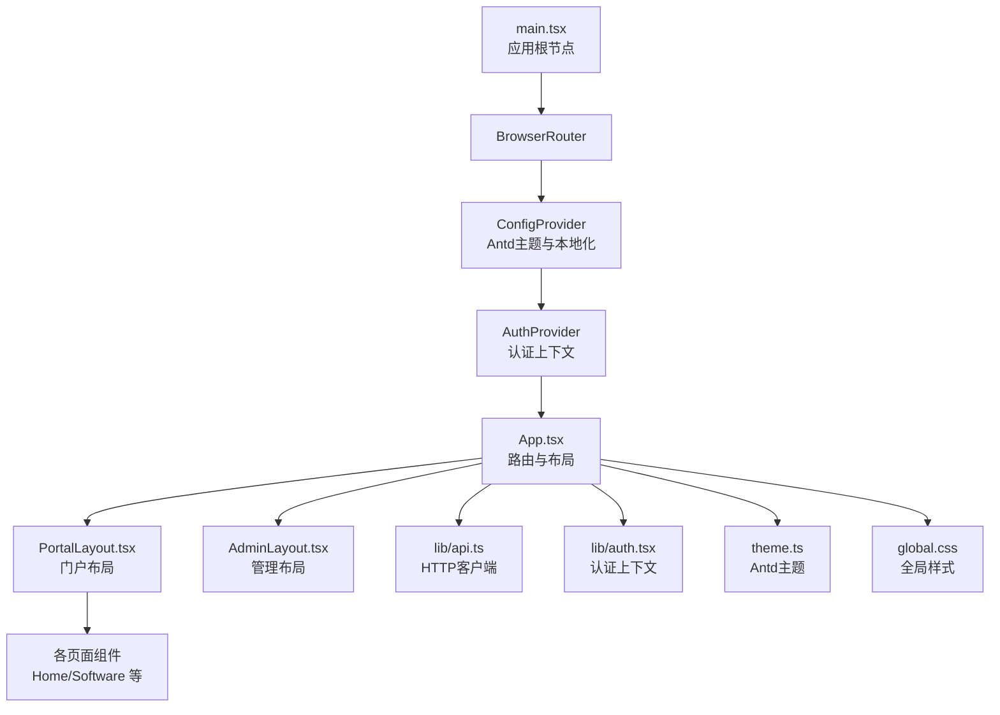
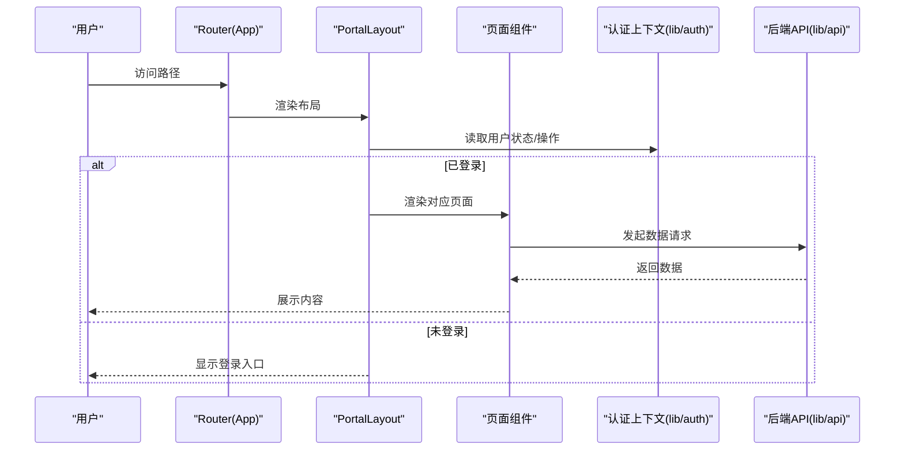
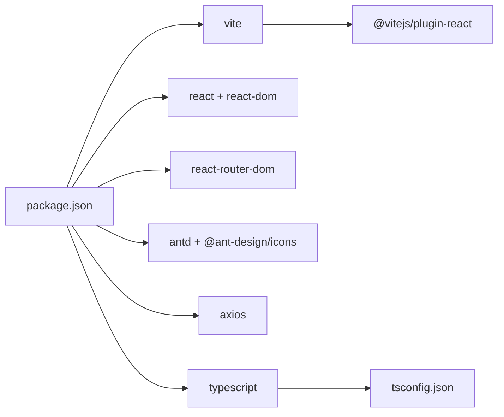

# 性能优化与最佳实践

<cite>
**本文引用的文件**
- [apps/web/vite.config.ts](file://apps/web/vite.config.ts)
- [apps/web/package.json](file://apps/web/package.json)
- [apps/web/tsconfig.json](file://apps/web/tsconfig.json)
- [apps/web/src/main.tsx](file://apps/web/src/main.tsx)
- [apps/web/src/App.tsx](file://apps/web/src/App.tsx)
- [apps/web/src/lib/auth.tsx](file://apps/web/src/lib/auth.tsx)
- [apps/web/src/lib/api.ts](file://apps/web/src/lib/api.ts)
- [apps/web/src/theme.ts](file://apps/web/src/theme.ts)
- [apps/web/src/global.css](file://apps/web/src/global.css)
- [apps/web/src/layouts/PortalLayout.tsx](file://apps/web/src/layouts/PortalLayout.tsx)
- [apps/web/src/pages/Home.tsx](file://apps/web/src/pages/Home.tsx)
- [apps/web/src/pages/Software.tsx](file://apps/web/src/pages/Software.tsx)
- [apps/web/src/pages/admin/Dashboard.tsx](file://apps/web/src/pages/admin/Dashboard.tsx)
</cite>

## 目录
1. [简介](#简介)
2. [项目结构](#项目结构)
3. [核心组件](#核心组件)
4. [架构总览](#架构总览)
5. [详细组件分析](#详细组件分析)
6. [依赖分析](#依赖分析)
7. [性能考虑](#性能考虑)
8. [故障排查指南](#故障排查指南)
9. [结论](#结论)
10. [附录](#附录)

## 简介
本文件面向ZBH2前端（apps/web）的性能优化与最佳实践，围绕以下目标展开：  
- Vite构建工具的配置现状与可优化点（打包策略、代码分割、资源压缩）。  
- React性能优化技术（memo、useMemo、useCallback的使用场景与影响）。  
- 懒加载与代码分割（动态import与路由级代码分割）。  
- 组件渲染优化（虚拟滚动、防抖节流、批量更新）。  
- 内存管理最佳实践（事件监听器清理、定时器管理、循环引用避免）。  
- 性能监控与分析工具（React DevTools、Lighthouse、Web Vitals）。

## 项目结构
apps/web采用Vite + React + TypeScript + Ant Design的组合，入口在main.tsx中挂载BrowserRouter、ConfigProvider、AuthProvider等上下文，App.tsx集中定义路由与布局。页面组件按功能分层，公共逻辑集中在lib目录（如api、auth），样式通过global.css与Ant Design主题theme.ts统一管理。

图表来源
- [apps/web/src/main.tsx:1-22](file://apps/web/src/main.tsx#L1-L22)
- [apps/web/src/App.tsx:1-80](file://apps/web/src/App.tsx#L1-L80)
- [apps/web/src/layouts/PortalLayout.tsx:1-76](file://apps/web/src/layouts/PortalLayout.tsx#L1-L76)
- [apps/web/src/lib/api.ts:1-16](file://apps/web/src/lib/api.ts#L1-L16)
- [apps/web/src/lib/auth.tsx:1-55](file://apps/web/src/lib/auth.tsx#L1-L55)
- [apps/web/src/theme.ts:1-23](file://apps/web/src/theme.ts#L1-L23)
- [apps/web/src/global.css:1-44](file://apps/web/src/global.css#L1-L44)

章节来源
- [apps/web/src/main.tsx:1-22](file://apps/web/src/main.tsx#L1-L22)
- [apps/web/src/App.tsx:1-80](file://apps/web/src/App.tsx#L1-L80)

## 核心组件
- 应用根节点与上下文：main.tsx负责StrictMode包裹、路由、主题与认证上下文注入。  
- 路由与布局：App.tsx集中声明路由与Portal/Admin双布局；PortalLayout.tsx提供导航菜单、用户状态与跳转。  
- 认证上下文：lib/auth.tsx提供用户信息、登录/登出、刷新逻辑，使用useCallback稳定回调以减少重渲染。  
- HTTP客户端：lib/api.ts基于axios创建带withCredentials的实例，并统一响应拦截处理。  
- 主题与样式：theme.ts统一Antd主题；global.css提供基础排版与卡片网格样式。

章节来源
- [apps/web/src/main.tsx:1-22](file://apps/web/src/main.tsx#L1-L22)
- [apps/web/src/App.tsx:1-80](file://apps/web/src/App.tsx#L1-L80)
- [apps/web/src/layouts/PortalLayout.tsx:1-76](file://apps/web/src/layouts/PortalLayout.tsx#L1-L76)
- [apps/web/src/lib/auth.tsx:1-55](file://apps/web/src/lib/auth.tsx#L1-L55)
- [apps/web/src/lib/api.ts:1-16](file://apps/web/src/lib/api.ts#L1-L16)
- [apps/web/src/theme.ts:1-23](file://apps/web/src/theme.ts#L1-L23)
- [apps/web/src/global.css:1-44](file://apps/web/src/global.css#L1-L44)

## 架构总览
应用采用“路由驱动”的页面组织方式，页面组件通过useEffect发起数据请求，列表类组件使用Spin进行加载态展示。认证上下文在PortalLayout中被消费，用于控制菜单项与跳转行为。

图表来源
- [apps/web/src/App.tsx:1-80](file://apps/web/src/App.tsx#L1-L80)
- [apps/web/src/layouts/PortalLayout.tsx:1-76](file://apps/web/src/layouts/PortalLayout.tsx#L1-L76)
- [apps/web/src/lib/auth.tsx:1-55](file://apps/web/src/lib/auth.tsx#L1-L55)
- [apps/web/src/lib/api.ts:1-16](file://apps/web/src/lib/api.ts#L1-L16)

## 详细组件分析

### Vite 构建与打包优化
当前配置要点：
- 使用@vitejs/plugin-react插件，启用React开发体验与预构建。  
- 开发服务器端口与代理：将/api前缀代理到后端服务，便于前后端联调。  
- TypeScript编译目标为ES2020，模块解析采用bundler，利于现代打包器做tree-shaking与代码分割。

建议优化方向（基于现有配置的增强建议）：
- 打包策略：启用rollupOptions.output.manualChunks进行第三方库与业务代码分离，提升缓存命中率。  
- 代码分割：结合路由级代码分割（见后续章节），拆分大体积页面或组件，降低首屏JS体积。  
- 资源压缩：生产环境默认启用terser压缩JS、CSSnano压缩CSS；可进一步开启压缩级别与资源内联策略（谨慎使用）。  
- 预加载策略：对关键路由或首屏依赖的模块使用<link rel="prefetch">或<link rel="modulepreload">（视浏览器支持情况）。  

章节来源
- [apps/web/vite.config.ts:1-13](file://apps/web/vite.config.ts#L1-L13)
- [apps/web/package.json:1-29](file://apps/web/package.json#L1-L29)
- [apps/web/tsconfig.json:1-16](file://apps/web/tsconfig.json#L1-L16)

### React 性能优化：memo、useMemo、useCallback
- memo：适用于纯展示型组件，避免因父组件重渲染导致的重复渲染。例如PortalLayout中的菜单项、按钮等可配合memo使用。  
- useMemo：用于缓存昂贵计算结果（如列表扁平化、统计聚合），避免每次渲染都重新计算。例如Home组件中对软件分类与文档数量的统计，可使用useMemo稳定输入后复用结果。  
- useCallback：用于稳定函数引用，防止子组件因函数引用变化而重渲染。例如PortalLayout中下拉菜单项的onClick回调，应使用useCallback确保引用稳定。  

章节来源
- [apps/web/src/layouts/PortalLayout.tsx:1-76](file://apps/web/src/layouts/PortalLayout.tsx#L1-L76)
- [apps/web/src/pages/Home.tsx:1-165](file://apps/web/src/pages/Home.tsx#L1-L165)
- [apps/web/src/lib/auth.tsx:1-55](file://apps/web/src/lib/auth.tsx#L1-L55)

### 懒加载与代码分割
- 动态import：将大型页面或组件通过动态import按需加载，减少初始包体。例如将Admin相关的页面组件改为动态导入，仅在进入/admin路径时加载。  
- 路由级代码分割：在App.tsx中对/admin下的路由使用动态导入，实现按需加载管理端页面，显著降低门户页首屏体积。  
- 结合Suspense：若采用React.lazy，可在路由层包裹Suspense以提供加载占位，改善用户体验。  

章节来源
- [apps/web/src/App.tsx:1-80](file://apps/web/src/App.tsx#L1-L80)

### 组件渲染优化
- 虚拟滚动：对于长列表（如软件列表、帮助文档列表），采用虚拟滚动组件（如react-window或@react-aria/selection）仅渲染可视区域，极大降低DOM节点数量。  
- 防抖节流：对高频事件（搜索、滚动、窗口resize）使用防抖/节流，减少请求与重排次数。  
- 批量更新：合并多次状态更新，避免逐次setState导致的多次重渲染；在事件处理中尽量减少不必要的状态变更。  

章节来源
- [apps/web/src/pages/Software.tsx:1-71](file://apps/web/src/pages/Software.tsx#L1-L71)
- [apps/web/src/pages/Home.tsx:1-165](file://apps/web/src/pages/Home.tsx#L1-L165)

### 内存管理最佳实践
- 事件监听器清理：在useEffect返回值中移除事件监听器，避免泄漏；对window/document事件尤其注意。  
- 定时器管理：使用clearTimeout/clearInterval清理定时任务；在组件卸载时统一清理。  
- 循环引用避免：避免DOM节点持有React组件实例的强引用；清理闭包中对DOM或组件实例的长期引用。  
- 大对象释放：及时释放大数组、Map/Set或图片资源，避免长时间驻留内存。  

（本节为通用指导，不直接分析具体文件）

### 性能监控与分析工具
- React DevTools：使用Profiler测量组件渲染时间与重渲染频率，定位过度渲染的组件与原因。  
- Lighthouse：定期运行页面审计，关注首次内容绘制（FCP）、最大内容绘制（LCP）、无交互时间（TBT）、累积布局偏移（CLS）等指标。  
- Web Vitals：集成Web Vitals上报，持续监控真实用户性能表现，建立阈值告警。  

（本节为通用指导，不直接分析具体文件）

## 依赖分析
- 运行时依赖：React、ReactDOM、react-router-dom、antd、axios、@ant-design/icons、shared等。  
- 开发依赖：@vitejs/plugin-react、vite、TypeScript及相关类型声明。  
- 类型与编译：tsconfig.json设置ES2020与bundler解析，有利于现代打包器进行tree-shaking与代码分割。  

图表来源
- [apps/web/package.json:1-29](file://apps/web/package.json#L1-L29)
- [apps/web/tsconfig.json:1-16](file://apps/web/tsconfig.json#L1-L16)

章节来源
- [apps/web/package.json:1-29](file://apps/web/package.json#L1-L29)
- [apps/web/tsconfig.json:1-16](file://apps/web/tsconfig.json#L1-L16)

## 性能考虑
- 首屏优化：通过路由级代码分割与动态import降低首屏JS体积；对非关键资源延迟加载。  
- 缓存策略：利用浏览器缓存与HTTP缓存头，合理设置静态资源版本号；对第三方库使用CDN加速。  
- 网络优化：合并请求（如Promise.all）减少往返；对图片与字体资源进行压缩与格式优化。  
- 渲染优化：结合memo/useMemo/useCallback减少重渲染；对长列表使用虚拟滚动；对高频事件使用防抖/节流。  
- 内存优化：及时清理事件监听器与定时器；避免闭包与DOM的长期持有；大对象及时释放。  

（本节为通用指导，不直接分析具体文件）

## 故障排查指南
- 登录/鉴权问题：检查认证上下文是否正确注入，useEffect依赖是否完整，登录/登出流程是否触发状态更新。  
- 请求失败：确认API拦截器是否正确处理401状态，避免在公共页面误触发跳转；检查withCredentials与CORS配置。  
- 页面空白或白屏：检查StrictMode下的副作用与无限重渲染；确认Suspense边界与错误边界配置。  
- 样式异常：核对Antd主题与ConfigProvider配置，确认locale与theme传递链路。  

章节来源
- [apps/web/src/lib/auth.tsx:1-55](file://apps/web/src/lib/auth.tsx#L1-L55)
- [apps/web/src/lib/api.ts:1-16](file://apps/web/src/lib/api.ts#L1-L16)
- [apps/web/src/theme.ts:1-23](file://apps/web/src/theme.ts#L1-L23)
- [apps/web/src/global.css:1-44](file://apps/web/src/global.css#L1-L44)

## 结论
ZBH2前端已具备良好的工程化基础（Vite+React+TS+Antd），建议在现有基础上推进路由级代码分割、useMemo/useCallback稳定化、虚拟滚动与防抖节流等渲染优化，并完善性能监控体系，以获得更优的首屏性能与用户体验。

## 附录
- 代码分割与路由优化建议：将/admin路径下的页面组件改为动态导入，仅在访问时加载。  
- 渲染优化建议：在Home/Software等列表组件中引入useMemo稳定计算结果，在PortalLayout中使用useCallback稳定菜单项回调。  
- 监控落地：在CI中集成Lighthouse审计，在生产环境接入Web Vitals上报，结合React Profiler进行热点组件分析。