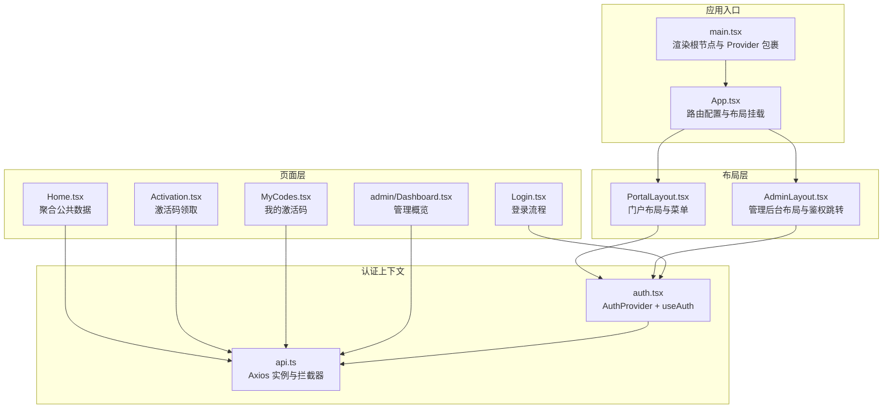
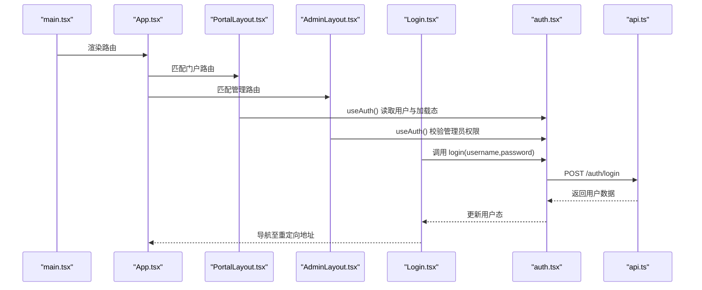
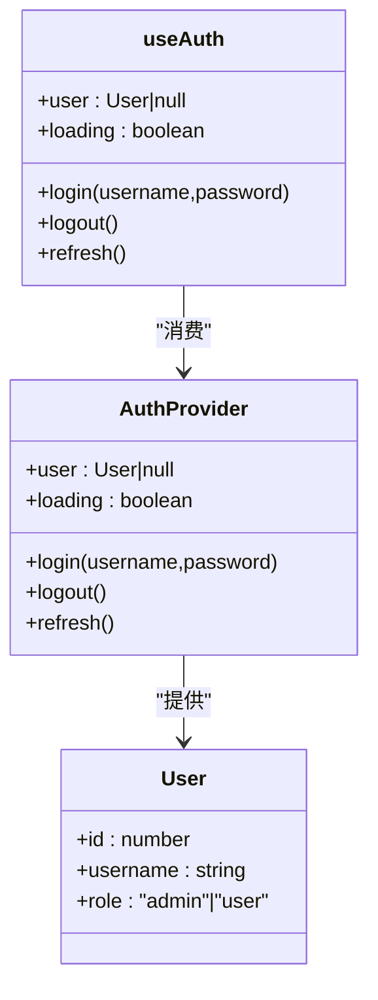
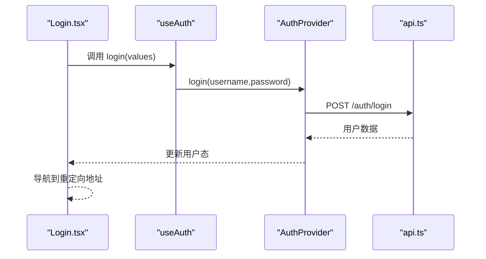
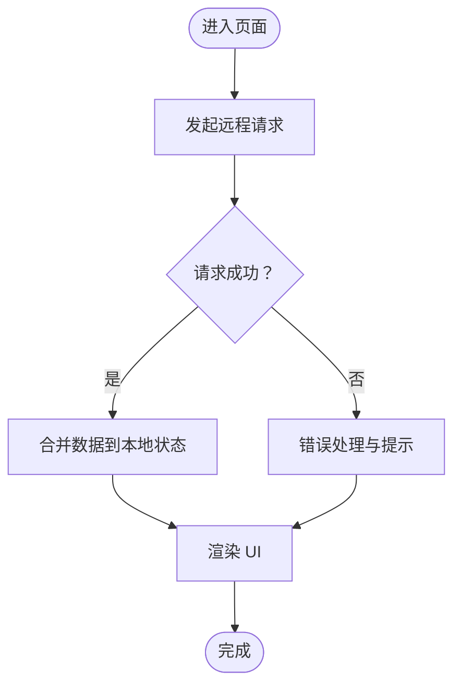
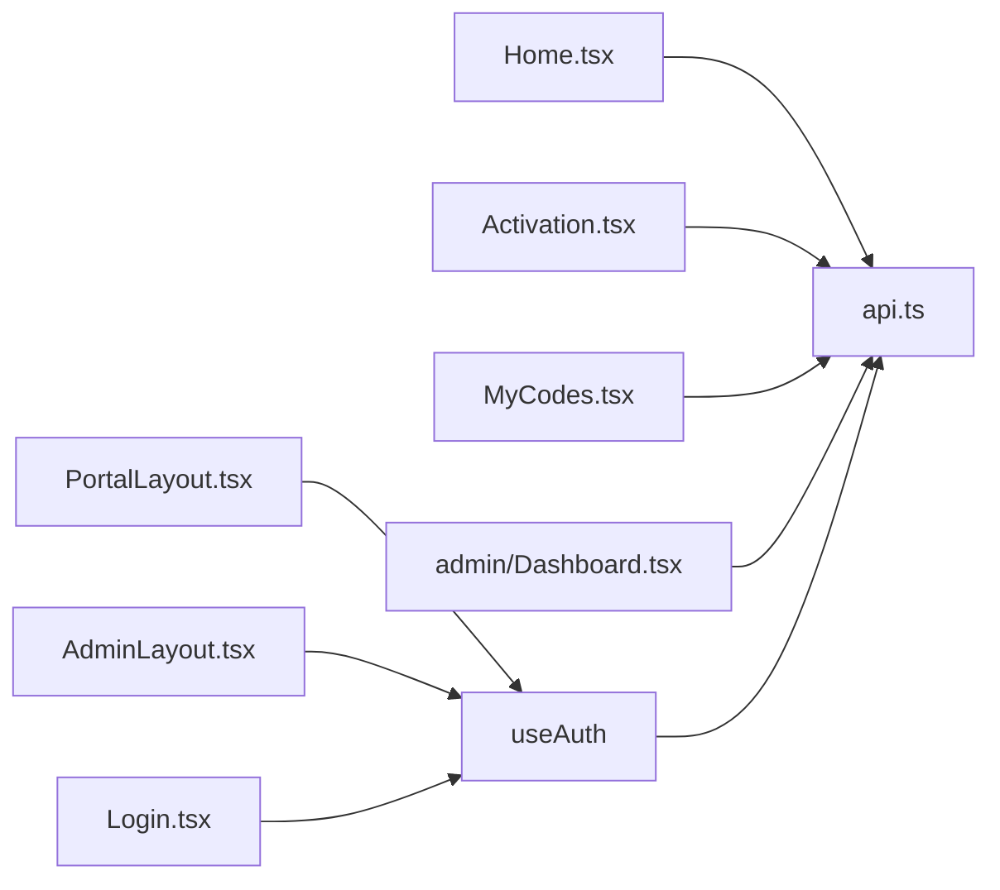

# 状态管理策略

<cite>
**本文引用的文件**
- [apps/web/src/main.tsx](file://apps/web/src/main.tsx)
- [apps/web/src/App.tsx](file://apps/web/src/App.tsx)
- [apps/web/src/lib/auth.tsx](file://apps/web/src/lib/auth.tsx)
- [apps/web/src/lib/api.ts](file://apps/web/src/lib/api.ts)
- [apps/web/src/layouts/PortalLayout.tsx](file://apps/web/src/layouts/PortalLayout.tsx)
- [apps/web/src/layouts/AdminLayout.tsx](file://apps/web/src/layouts/AdminLayout.tsx)
- [apps/web/src/pages/Login.tsx](file://apps/web/src/pages/Login.tsx)
- [apps/web/src/pages/Home.tsx](file://apps/web/src/pages/Home.tsx)
- [apps/web/src/pages/Activation.tsx](file://apps/web/src/pages/Activation.tsx)
- [apps/web/src/pages/MyCodes.tsx](file://apps/web/src/pages/MyCodes.tsx)
- [apps/web/src/pages/admin/Dashboard.tsx](file://apps/web/src/pages/admin/Dashboard.tsx)
</cite>

## 目录
1. [引言](#引言)
2. [项目结构](#项目结构)
3. [核心组件](#核心组件)
4. [架构总览](#架构总览)
5. [详细组件分析](#详细组件分析)
6. [依赖关系分析](#依赖关系分析)
7. [性能考量](#性能考量)
8. [故障排查指南](#故障排查指南)
9. [结论](#结论)
10. [附录](#附录)

## 引言
本文件系统性梳理 ZBH2 前端的状态管理策略，重点覆盖以下方面：
- Context API 的使用策略：全局状态设计、状态提升与状态隔离
- 自定义 Hook 的状态管理实现：useAuth、useApi（概念性）等设计模式
- 本地状态与远程状态的管理策略：数据同步、缓存更新、错误处理
- 状态持久化方案：localStorage、sessionStorage 的使用场景
- 最佳实践：状态结构设计、更新策略、性能优化
- 调试工具与开发辅助：如何在现有代码中扩展与验证

## 项目结构
ZBH2 前端采用 React + Ant Design 架构，状态管理以 Context API 为核心，结合自定义 Hook 和页面级本地状态实现“全局共享 + 局部优化”的混合策略。

图表来源
- [apps/web/src/main.tsx:11-21](file://apps/web/src/main.tsx#L11-L21)
- [apps/web/src/App.tsx:38-79](file://apps/web/src/App.tsx#L38-L79)
- [apps/web/src/lib/auth.tsx:20-54](file://apps/web/src/lib/auth.tsx#L20-L54)
- [apps/web/src/lib/api.ts:1-16](file://apps/web/src/lib/api.ts#L1-L16)
- [apps/web/src/layouts/PortalLayout.tsx:20-76](file://apps/web/src/layouts/PortalLayout.tsx#L20-L76)
- [apps/web/src/layouts/AdminLayout.tsx:88-127](file://apps/web/src/layouts/AdminLayout.tsx#L88-L127)
- [apps/web/src/pages/Home.tsx:30-57](file://apps/web/src/pages/Home.tsx#L30-L57)
- [apps/web/src/pages/Login.tsx:7-24](file://apps/web/src/pages/Login.tsx#L7-L24)
- [apps/web/src/pages/Activation.tsx:24-46](file://apps/web/src/pages/Activation.tsx#L24-L46)
- [apps/web/src/pages/MyCodes.tsx:10-24](file://apps/web/src/pages/MyCodes.tsx#L10-L24)
- [apps/web/src/pages/admin/Dashboard.tsx:8-25](file://apps/web/src/pages/admin/Dashboard.tsx#L8-L25)

章节来源
- [apps/web/src/main.tsx:11-21](file://apps/web/src/main.tsx#L11-L21)
- [apps/web/src/App.tsx:38-79](file://apps/web/src/App.tsx#L38-L79)

## 核心组件
- 认证上下文与 Hook
  - 提供 user、loading、login、logout、refresh 等能力，通过 AuthProvider 注入到应用树中，useAuth 在各组件中消费。
  - 登录成功后设置用户态；登出时调用后端接口并清空用户态；启动时尝试刷新当前用户信息。
- API 客户端
  - Axios 实例，统一前缀与凭据携带；响应拦截器用于处理 401 场景（可按需扩展为统一错误提示或跳转）。
- 布局与页面
  - PortalLayout/AdminLayout 通过 useAuth 控制导航与权限跳转；页面组件通过本地状态管理 UI 加载态与业务数据。

章节来源
- [apps/web/src/lib/auth.tsx:10-55](file://apps/web/src/lib/auth.tsx#L10-L55)
- [apps/web/src/lib/api.ts:1-16](file://apps/web/src/lib/api.ts#L1-L16)
- [apps/web/src/layouts/PortalLayout.tsx:20-76](file://apps/web/src/layouts/PortalLayout.tsx#L20-L76)
- [apps/web/src/layouts/AdminLayout.tsx:88-127](file://apps/web/src/layouts/AdminLayout.tsx#L88-L127)

## 架构总览
下图展示从入口到页面的数据流与状态交互路径，体现 Context API 的使用与页面本地状态的配合。

图表来源
- [apps/web/src/main.tsx:11-21](file://apps/web/src/main.tsx#L11-L21)
- [apps/web/src/App.tsx:38-79](file://apps/web/src/App.tsx#L38-L79)
- [apps/web/src/layouts/PortalLayout.tsx:20-76](file://apps/web/src/layouts/PortalLayout.tsx#L20-L76)
- [apps/web/src/layouts/AdminLayout.tsx:88-127](file://apps/web/src/layouts/AdminLayout.tsx#L88-L127)
- [apps/web/src/pages/Login.tsx:7-24](file://apps/web/src/pages/Login.tsx#L7-L24)
- [apps/web/src/lib/auth.tsx:20-54](file://apps/web/src/lib/auth.tsx#L20-L54)
- [apps/web/src/lib/api.ts:1-16](file://apps/web/src/lib/api.ts#L1-L16)

## 详细组件分析

### 认证上下文与 useAuth Hook
- 设计要点
  - 全局状态：user、loading
  - 行为方法：login、logout、refresh
  - 初始化：启动时自动 refresh，避免白屏期未就绪
  - 权限控制：AdminLayout 基于 user.role 进行跳转
- 使用模式
  - 页面直接调用 login，无需关心底层存储
  - 布局层读取 user/role 决策 UI 与导航
  - 组件内组合 useAuth 与本地状态，实现“局部状态 + 全局上下文”的分层

图表来源
- [apps/web/src/lib/auth.tsx:10-55](file://apps/web/src/lib/auth.tsx#L10-L55)

章节来源
- [apps/web/src/lib/auth.tsx:20-54](file://apps/web/src/lib/auth.tsx#L20-L54)
- [apps/web/src/layouts/AdminLayout.tsx:88-97](file://apps/web/src/layouts/AdminLayout.tsx#L88-L97)

### 登录流程与状态提升
- 流程说明
  - Login 组件收集表单数据，调用 useAuth.login
  - AuthProvider.login 发起请求并设置用户态
  - 成功后根据查询参数进行重定向
- 状态提升策略
  - 将“登录”动作提升到 Provider，确保跨组件一致性
  - 页面仅负责 UI 与副作用，不持有持久化逻辑

图表来源
- [apps/web/src/pages/Login.tsx:7-24](file://apps/web/src/pages/Login.tsx#L7-L24)
- [apps/web/src/lib/auth.tsx:37-45](file://apps/web/src/lib/auth.tsx#L37-L45)
- [apps/web/src/lib/api.ts:1-16](file://apps/web/src/lib/api.ts#L1-L16)

章节来源
- [apps/web/src/pages/Login.tsx:7-24](file://apps/web/src/pages/Login.tsx#L7-L24)
- [apps/web/src/lib/auth.tsx:37-45](file://apps/web/src/lib/auth.tsx#L37-L45)

### 本地状态与远程状态的协同
- 本地状态
  - 页面组件使用 useState 管理 UI 加载态、表格数据、弹窗状态等
  - 示例：Home/Activation/MyCodes/Dashboard 等页面均采用本地状态驱动 UI
- 远程状态
  - 通过 api.ts 发起请求，将响应数据写入本地状态
  - AdminLayout 在加载态与角色不满足时进行跳转，体现“远程状态影响本地行为”
- 同步策略
  - 首屏：先加载远程数据，再渲染 UI
  - 交互：提交后刷新本地状态或触发重新拉取

图表来源
- [apps/web/src/pages/Home.tsx:37-57](file://apps/web/src/pages/Home.tsx#L37-L57)
- [apps/web/src/pages/Activation.tsx:31-46](file://apps/web/src/pages/Activation.tsx#L31-L46)
- [apps/web/src/pages/MyCodes.tsx:16-24](file://apps/web/src/pages/MyCodes.tsx#L16-L24)
- [apps/web/src/pages/admin/Dashboard.tsx:11-25](file://apps/web/src/pages/admin/Dashboard.tsx#L11-L25)

章节来源
- [apps/web/src/pages/Home.tsx:30-57](file://apps/web/src/pages/Home.tsx#L30-L57)
- [apps/web/src/pages/Activation.tsx:24-46](file://apps/web/src/pages/Activation.tsx#L24-L46)
- [apps/web/src/pages/MyCodes.tsx:10-24](file://apps/web/src/pages/MyCodes.tsx#L10-L24)
- [apps/web/src/pages/admin/Dashboard.tsx:8-25](file://apps/web/src/pages/admin/Dashboard.tsx#L8-L25)

### 状态隔离与作用域划分
- 门户与管理后台
  - PortalLayout/AdminLayout 分别承载不同权限域的导航与菜单
  - AdminLayout 通过 useAuth 对非管理员进行跳转，形成“状态隔离”的边界
- 页面内部
  - 每个页面维护自身所需的数据子集，避免跨页面污染

章节来源
- [apps/web/src/layouts/PortalLayout.tsx:20-76](file://apps/web/src/layouts/PortalLayout.tsx#L20-L76)
- [apps/web/src/layouts/AdminLayout.tsx:88-97](file://apps/web/src/layouts/AdminLayout.tsx#L88-L97)

### 状态持久化方案
- 当前实现
  - 通过 withCredentials 保持会话，登录态由服务端 Cookie 维持
  - 未见 localStorage/sessionStorage 的显式使用
- 建议场景
  - 本地偏好设置：如主题、语言、列表分页参数等，适合 localStorage
  - 临时会话数据：如草稿、表单步骤，适合 sessionStorage
- 注意事项
  - 严格区分“会话态”与“本地偏好”，避免将敏感信息持久化
  - 对于 localStorage，建议增加版本字段与迁移策略

章节来源
- [apps/web/src/lib/api.ts:3](file://apps/web/src/lib/api.ts#L3)
- [apps/web/src/lib/auth.tsx:24-33](file://apps/web/src/lib/auth.tsx#L24-L33)

### 自定义 Hook 的设计模式（useAuth、useApi）
- useAuth
  - 聚合认证相关状态与操作，向上提供 login/logout/refresh
  - 与布局层协作实现权限控制
- useApi（概念性）
  - 可抽象为“远程状态 Hook”，封装请求、缓存、错误与重试
  - 与本地状态 Hook 组合，实现“远程数据 + 本地 UI 态”的解耦

章节来源
- [apps/web/src/lib/auth.tsx:10-55](file://apps/web/src/lib/auth.tsx#L10-L55)

## 依赖关系分析
- 组件耦合
  - PortalLayout/AdminLayout 依赖 useAuth，形成“布局层依赖上下文”的稳定耦合
  - 页面组件依赖 api.ts 与 useAuth，形成“页面层依赖服务与上下文”的双向依赖
- 外部依赖
  - axios 作为网络层，集中处理 baseURL 与拦截器
- 循环依赖
  - 当前结构未发现循环依赖风险

图表来源
- [apps/web/src/layouts/PortalLayout.tsx:16](file://apps/web/src/layouts/PortalLayout.tsx#L16)
- [apps/web/src/layouts/AdminLayout.tsx:24](file://apps/web/src/layouts/AdminLayout.tsx#L24)
- [apps/web/src/pages/Login.tsx:5](file://apps/web/src/pages/Login.tsx#L5)
- [apps/web/src/pages/Home.tsx:5](file://apps/web/src/pages/Home.tsx#L5)
- [apps/web/src/pages/Activation.tsx:6](file://apps/web/src/pages/Activation.tsx#L6)
- [apps/web/src/pages/MyCodes.tsx:6](file://apps/web/src/pages/MyCodes.tsx#L6)
- [apps/web/src/pages/admin/Dashboard.tsx:4](file://apps/web/src/pages/admin/Dashboard.tsx#L4)
- [apps/web/src/lib/auth.tsx:2](file://apps/web/src/lib/auth.tsx#L2)
- [apps/web/src/lib/api.ts:1](file://apps/web/src/lib/api.ts#L1)

章节来源
- [apps/web/src/lib/auth.tsx:10-55](file://apps/web/src/lib/auth.tsx#L10-L55)
- [apps/web/src/lib/api.ts:1-16](file://apps/web/src/lib/api.ts#L1-L16)

## 性能考量
- 请求批量化
  - Home 页面使用 Promise.all 并行拉取多个资源，减少首屏等待
- 渲染优化
  - 列表项与卡片组件按需渲染，避免不必要的重排
- 状态粒度
  - 将页面级状态拆分为最小必要单元，降低重渲染范围
- 缓存策略
  - 建议引入轻量缓存（内存/弱引用）以复用最近数据，减少重复请求
- 错误与加载
  - 优先展示骨架屏/加载指示，改善感知性能

章节来源
- [apps/web/src/pages/Home.tsx:37-57](file://apps/web/src/pages/Home.tsx#L37-L57)

## 故障排查指南
- 登录失败
  - 检查 useAuth.login 的调用链与响应错误消息
  - 查看 api.ts 拦截器是否正确透传错误
- 401 未授权
  - 确认 withCredentials 是否生效，检查服务端跨域与 Cookie 设置
- 权限跳转异常
  - AdminLayout 在 loading 期间返回空，确保在加载完成后进行校验
- 数据未更新
  - 确认页面是否在 mount 后重新拉取数据，或在用户态变化时触发刷新

章节来源
- [apps/web/src/pages/Login.tsx:13-24](file://apps/web/src/pages/Login.tsx#L13-L24)
- [apps/web/src/lib/api.ts:5-13](file://apps/web/src/lib/api.ts#L5-L13)
- [apps/web/src/layouts/AdminLayout.tsx:93-97](file://apps/web/src/layouts/AdminLayout.tsx#L93-L97)

## 结论
ZBH2 前端采用“Context API + 自定义 Hook + 页面本地状态”的混合状态管理模式：
- 全局：认证上下文统一管理用户态与权限
- 局部：页面组件管理 UI 与业务数据，保证职责清晰
- 协同：通过 API 客户端与拦截器实现一致的远程状态访问
- 建议：在现有基础上引入 useApi 抽象、轻量缓存与本地偏好持久化，进一步提升可维护性与用户体验

## 附录
- 开发辅助
  - 在开发环境可打印 useAuth 的 user/loading 变化，便于定位权限与加载问题
  - 在页面组件中为关键请求添加日志，记录请求参数与响应状态