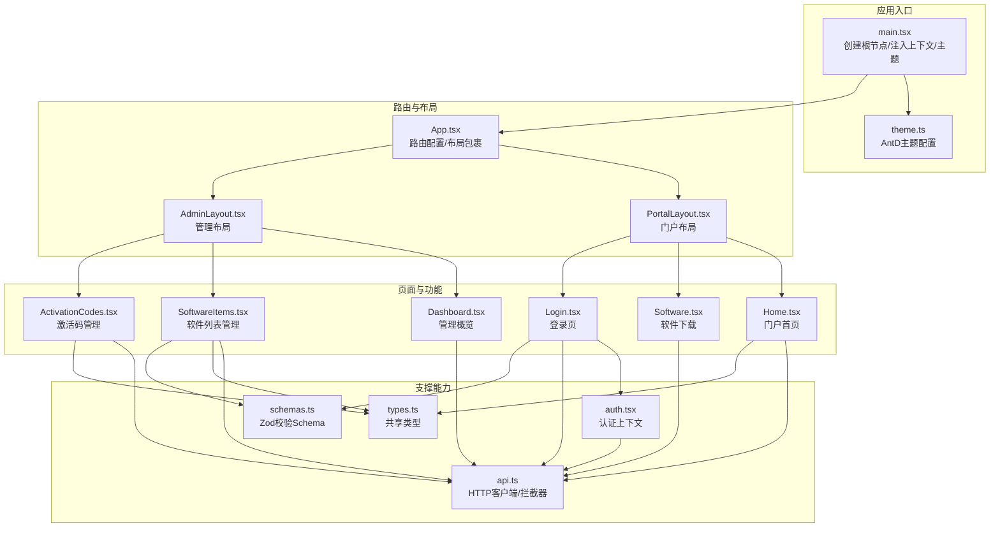
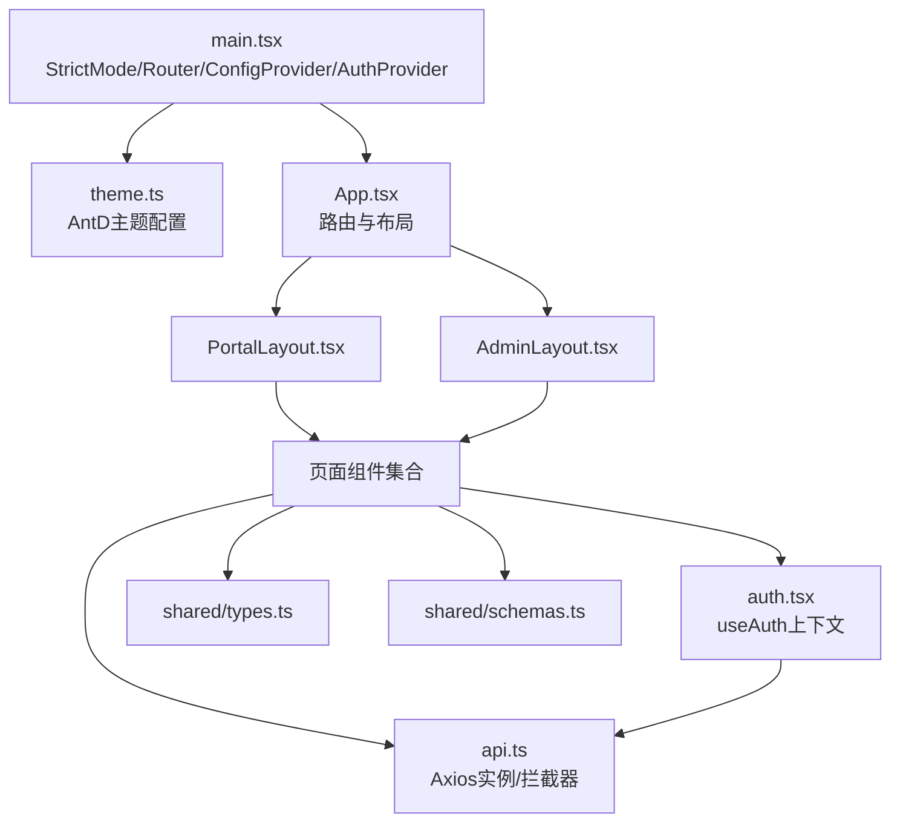
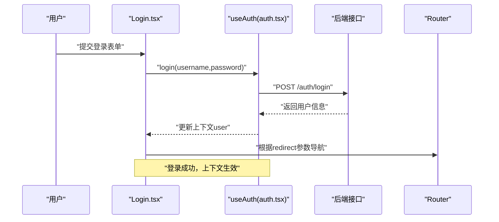
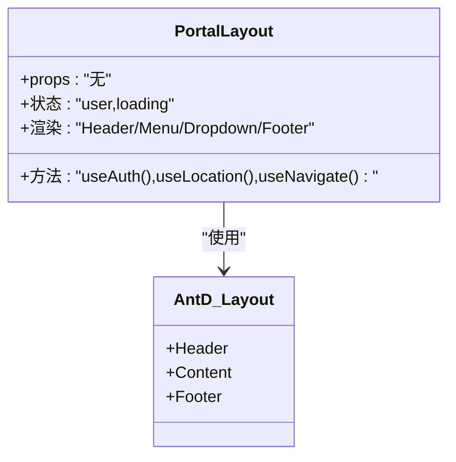
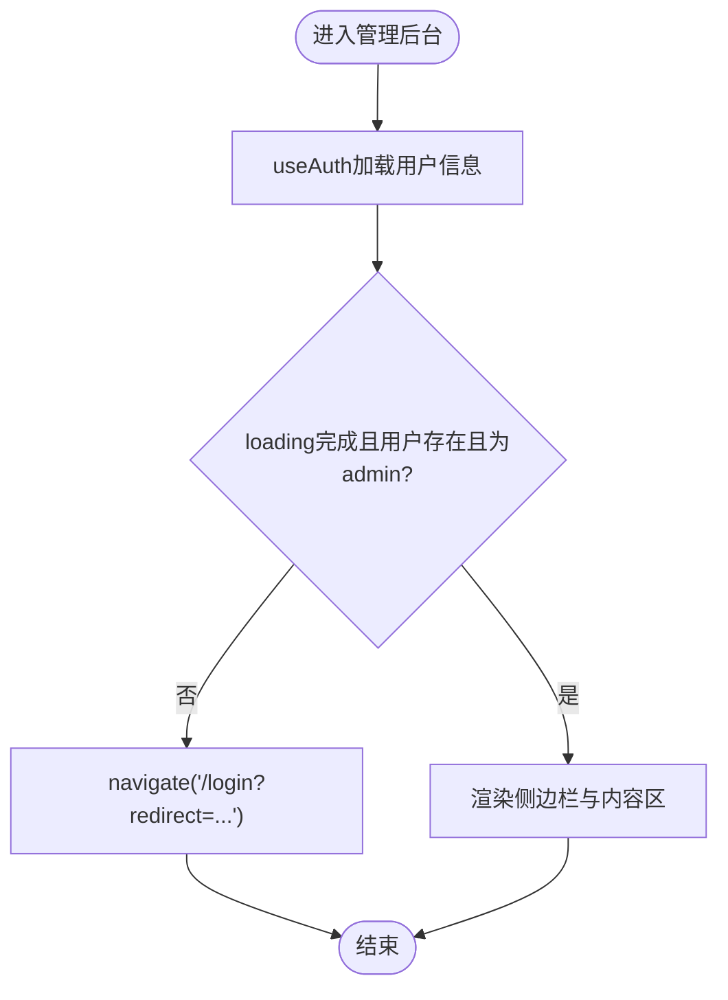
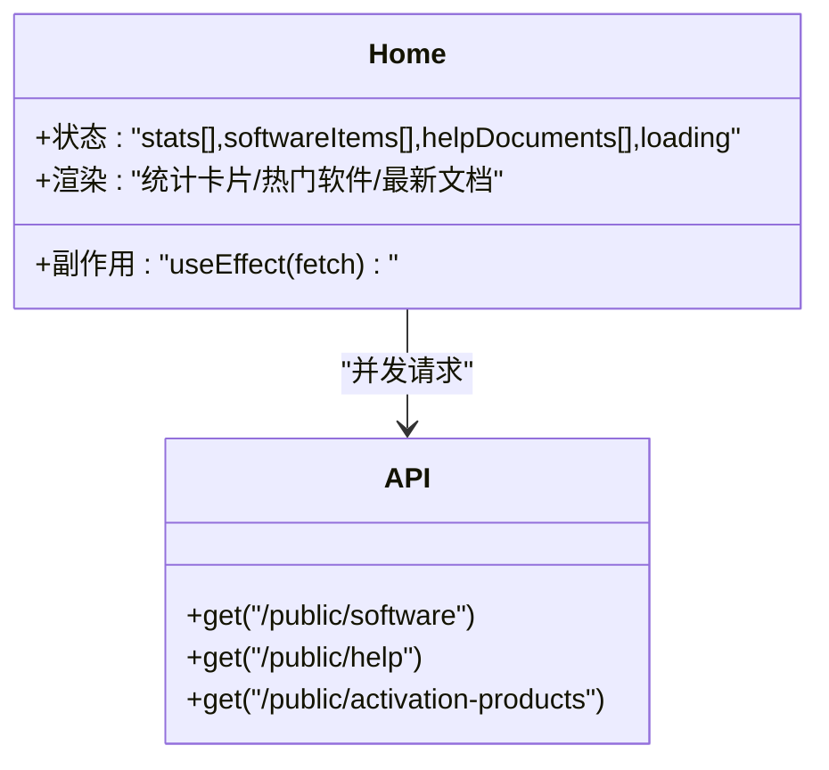
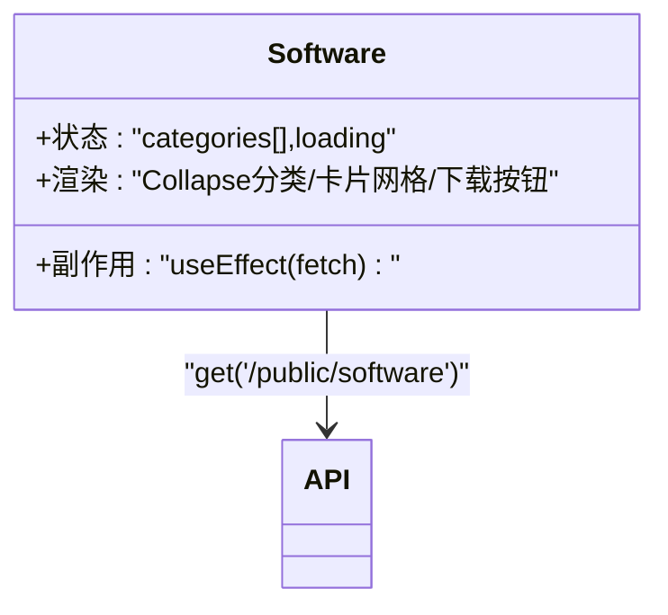
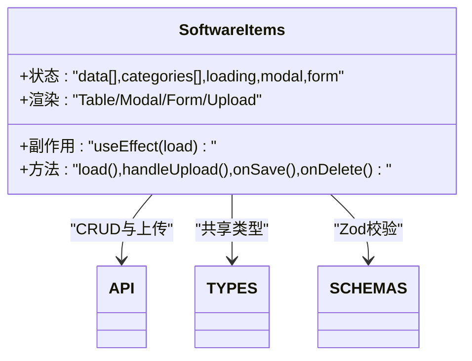
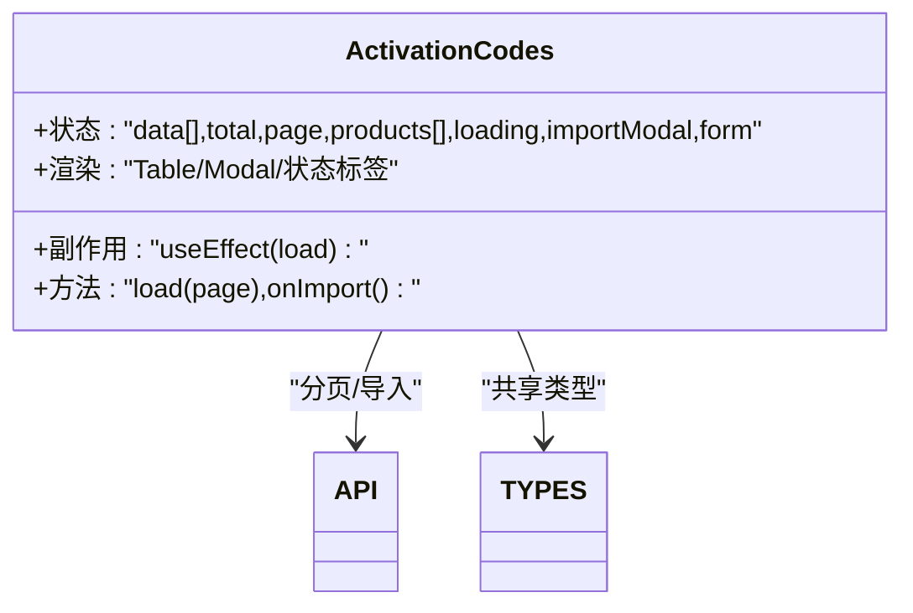
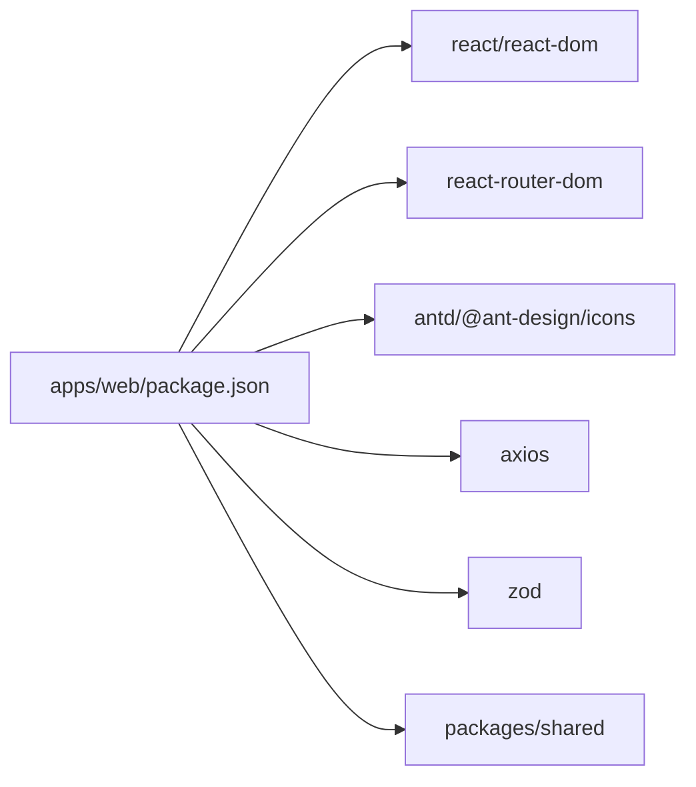

# 组件设计与开发规范

<cite>
**本文引用的文件**
- [apps/web/src/App.tsx](file://apps/web/src/App.tsx)
- [apps/web/src/main.tsx](file://apps/web/src/main.tsx)
- [apps/web/src/theme.ts](file://apps/web/src/theme.ts)
- [apps/web/src/layouts/PortalLayout.tsx](file://apps/web/src/layouts/PortalLayout.tsx)
- [apps/web/src/layouts/AdminLayout.tsx](file://apps/web/src/layouts/AdminLayout.tsx)
- [apps/web/src/lib/auth.tsx](file://apps/web/src/lib/auth.tsx)
- [apps/web/src/lib/api.ts](file://apps/web/src/lib/api.ts)
- [apps/web/src/pages/Home.tsx](file://apps/web/src/pages/Home.tsx)
- [apps/web/src/pages/Login.tsx](file://apps/web/src/pages/Login.tsx)
- [apps/web/src/pages/Software.tsx](file://apps/web/src/pages/Software.tsx)
- [apps/web/src/pages/admin/Dashboard.tsx](file://apps/web/src/pages/admin/Dashboard.tsx)
- [apps/web/src/pages/admin/SoftwareItems.tsx](file://apps/web/src/pages/admin/SoftwareItems.tsx)
- [apps/web/src/pages/admin/ActivationCodes.tsx](file://apps/web/src/pages/admin/ActivationCodes.tsx)
- [packages/shared/src/types.ts](file://packages/shared/src/types.ts)
- [packages/shared/src/schemas.ts](file://packages/shared/src/schemas.ts)
- [apps/web/package.json](file://apps/web/package.json)
</cite>

## 目录
1. [引言](#引言)
2. [项目结构](#项目结构)
3. [核心组件](#核心组件)
4. [架构总览](#架构总览)
5. [详细组件分析](#详细组件分析)
6. [依赖关系分析](#依赖关系分析)
7. [性能考量](#性能考量)
8. [故障排查指南](#故障排查指南)
9. [结论](#结论)
10. [附录](#附录)

## 引言
本文件面向ZBH2前端团队，系统梳理组件设计与开发规范，覆盖函数式组件设计原则、React Hooks最佳实践、Props设计模式、组件复用策略、命名与组织规范、组件间通信机制以及测试与调试建议。内容基于仓库现有代码进行提炼与总结，旨在提升可维护性、一致性和协作效率。

## 项目结构
前端应用采用分层与按功能模块组织的方式：
- 应用入口与主题配置：在入口文件中注入路由、国际化、主题与全局认证上下文；主题通过Ant Design主题配置集中管理。
- 布局层：PortalLayout与AdminLayout分别承载门户与管理后台的通用UI骨架与导航。
- 页面层：按业务域划分页面组件，如门户首页、软件下载、登录页及管理后台各子页面。
- 业务支撑：认证上下文、API封装、共享类型与校验Schema。



图表来源
- [apps/web/src/main.tsx:1-22](file://apps/web/src/main.tsx#L1-L22)
- [apps/web/src/theme.ts:1-23](file://apps/web/src/theme.ts#L1-L23)
- [apps/web/src/App.tsx:1-80](file://apps/web/src/App.tsx#L1-L80)
- [apps/web/src/layouts/PortalLayout.tsx:1-76](file://apps/web/src/layouts/PortalLayout.tsx#L1-L76)
- [apps/web/src/layouts/AdminLayout.tsx:1-127](file://apps/web/src/layouts/AdminLayout.tsx#L1-L127)
- [apps/web/src/lib/auth.tsx:1-55](file://apps/web/src/lib/auth.tsx#L1-L55)
- [apps/web/src/lib/api.ts:1-16](file://apps/web/src/lib/api.ts#L1-L16)
- [apps/web/src/pages/Home.tsx:1-165](file://apps/web/src/pages/Home.tsx#L1-L165)
- [apps/web/src/pages/Software.tsx:1-71](file://apps/web/src/pages/Software.tsx#L1-L71)
- [apps/web/src/pages/Login.tsx:1-47](file://apps/web/src/pages/Login.tsx#L1-L47)
- [apps/web/src/pages/admin/Dashboard.tsx:1-47](file://apps/web/src/pages/admin/Dashboard.tsx#L1-L47)
- [apps/web/src/pages/admin/SoftwareItems.tsx:1-118](file://apps/web/src/pages/admin/SoftwareItems.tsx#L1-L118)
- [apps/web/src/pages/admin/ActivationCodes.tsx:1-74](file://apps/web/src/pages/admin/ActivationCodes.tsx#L1-L74)
- [packages/shared/src/types.ts:1-18](file://packages/shared/src/types.ts#L1-L18)
- [packages/shared/src/schemas.ts:1-51](file://packages/shared/src/schemas.ts#L1-L51)

章节来源
- [apps/web/src/main.tsx:1-22](file://apps/web/src/main.tsx#L1-L22)
- [apps/web/src/App.tsx:1-80](file://apps/web/src/App.tsx#L1-L80)

## 核心组件
- 函数式组件设计原则
  - 无状态组件：以纯渲染为主，接收Props并输出UI，避免副作用。示例：门户布局、管理布局中的静态菜单与图标展示。
  - 有状态组件：需要本地状态或生命周期逻辑，使用Hooks管理状态与副作用。示例：门户首页、软件列表、登录页、管理后台仪表盘等。
- React Hooks最佳实践
  - useState：用于本地UI状态，如加载态、表单字段、模态框开关等。
  - useEffect：用于副作用，如数据拉取、权限校验、导航跳转等。
  - useContext/useAuth：在认证上下文中读取用户信息与方法，避免逐层传递。
- Props设计模式
  - 类型定义：优先使用共享类型（packages/shared），确保前后端一致。
  - 默认值与可选性：合理使用可选属性与默认值，避免运行时错误。
  - 验证规则：结合Zod Schema对表单输入进行强约束，减少后端错误。
- 组件复用策略
  - HOC：当前未见显式HOC实现，推荐通过组合与自定义Hook实现横切关注点（如鉴权、加载态）。
  - Render Props：当前未见Render Props实现，推荐以Children作为插槽扩展组件行为。
- 命名与文件组织
  - 文件命名：采用PascalCase，页面组件以名词短语命名，布局组件以Layout结尾。
  - 目录组织：按功能域分层（layouts/pages/lib/components），共享类型与Schema置于packages/shared。
- 组件间通信
  - 父子组件：Props向下传递，回调向上返回。
  - 兄弟组件：通过共同父组件传递状态或事件。
  - 跨层级：通过Context（useAuth）或全局状态方案（建议引入）。

章节来源
- [apps/web/src/layouts/PortalLayout.tsx:1-76](file://apps/web/src/layouts/PortalLayout.tsx#L1-L76)
- [apps/web/src/layouts/AdminLayout.tsx:1-127](file://apps/web/src/layouts/AdminLayout.tsx#L1-L127)
- [apps/web/src/pages/Home.tsx:1-165](file://apps/web/src/pages/Home.tsx#L1-L165)
- [apps/web/src/pages/Software.tsx:1-71](file://apps/web/src/pages/Software.tsx#L1-L71)
- [apps/web/src/pages/Login.tsx:1-47](file://apps/web/src/pages/Login.tsx#L1-L47)
- [apps/web/src/lib/auth.tsx:1-55](file://apps/web/src/lib/auth.tsx#L1-L55)
- [packages/shared/src/types.ts:1-18](file://packages/shared/src/types.ts#L1-L18)
- [packages/shared/src/schemas.ts:1-51](file://packages/shared/src/schemas.ts#L1-L51)

## 架构总览
应用采用“入口注入上下文 -> 路由分发 -> 布局容器 -> 页面组件”的层次化架构。认证上下文贯穿全局，API封装统一处理请求与响应拦截，共享类型与Schema保障数据一致性。



图表来源
- [apps/web/src/main.tsx:1-22](file://apps/web/src/main.tsx#L1-L22)
- [apps/web/src/theme.ts:1-23](file://apps/web/src/theme.ts#L1-L23)
- [apps/web/src/App.tsx:1-80](file://apps/web/src/App.tsx#L1-L80)
- [apps/web/src/layouts/PortalLayout.tsx:1-76](file://apps/web/src/layouts/PortalLayout.tsx#L1-L76)
- [apps/web/src/layouts/AdminLayout.tsx:1-127](file://apps/web/src/layouts/AdminLayout.tsx#L1-L127)
- [apps/web/src/lib/auth.tsx:1-55](file://apps/web/src/lib/auth.tsx#L1-L55)
- [apps/web/src/lib/api.ts:1-16](file://apps/web/src/lib/api.ts#L1-L16)
- [packages/shared/src/types.ts:1-18](file://packages/shared/src/types.ts#L1-L18)
- [packages/shared/src/schemas.ts:1-51](file://packages/shared/src/schemas.ts#L1-L51)

## 详细组件分析

### 认证上下文与登录流程
- 设计要点
  - 使用Context暴露user、loading、login、logout、refresh等能力，避免多级传递。
  - 在登录页通过useAuth调用login，并根据查询参数重定向。
  - 登录成功后刷新用户信息，后续页面通过useAuth读取状态。
- 流程图



图表来源
- [apps/web/src/pages/Login.tsx:1-47](file://apps/web/src/pages/Login.tsx#L1-L47)
- [apps/web/src/lib/auth.tsx:1-55](file://apps/web/src/lib/auth.tsx#L1-L55)

章节来源
- [apps/web/src/pages/Login.tsx:1-47](file://apps/web/src/pages/Login.tsx#L1-L47)
- [apps/web/src/lib/auth.tsx:1-55](file://apps/web/src/lib/auth.tsx#L1-L55)

### 门户布局与导航
- 设计要点
  - 使用Ant Design Layout/Header/Content/Footer构建骨架。
  - 通过useLocation与useNavigate实现菜单选中态与跳转。
  - 根据用户角色显示管理后台入口与个人相关菜单。
- 类图



图表来源
- [apps/web/src/layouts/PortalLayout.tsx:1-76](file://apps/web/src/layouts/PortalLayout.tsx#L1-L76)

章节来源
- [apps/web/src/layouts/PortalLayout.tsx:1-76](file://apps/web/src/layouts/PortalLayout.tsx#L1-L76)

### 管理后台布局与权限校验
- 设计要点
  - 通过useAuth判断用户角色，非管理员自动跳转登录页。
  - 使用useEffect在首次加载后执行权限校验。
  - 内置侧边栏菜单，支持分组与子菜单。
- 流程图



图表来源
- [apps/web/src/layouts/AdminLayout.tsx:1-127](file://apps/web/src/layouts/AdminLayout.tsx#L1-L127)
- [apps/web/src/lib/auth.tsx:1-55](file://apps/web/src/lib/auth.tsx#L1-L55)

章节来源
- [apps/web/src/layouts/AdminLayout.tsx:1-127](file://apps/web/src/layouts/AdminLayout.tsx#L1-L127)
- [apps/web/src/lib/auth.tsx:1-55](file://apps/web/src/lib/auth.tsx#L1-L55)

### 门户首页与数据聚合
- 设计要点
  - 使用Promise.all并发拉取多个数据源，提升首屏性能。
  - 将分类数据扁平化，生成统计卡片与热门条目。
  - 使用Loading与Empty优化用户体验。
- 类图



图表来源
- [apps/web/src/pages/Home.tsx:1-165](file://apps/web/src/pages/Home.tsx#L1-L165)
- [apps/web/src/lib/api.ts:1-16](file://apps/web/src/lib/api.ts#L1-L16)

章节来源
- [apps/web/src/pages/Home.tsx:1-165](file://apps/web/src/pages/Home.tsx#L1-L165)
- [apps/web/src/lib/api.ts:1-16](file://apps/web/src/lib/api.ts#L1-L16)

### 软件列表与分类展示
- 设计要点
  - 通过Collapse展开分类，每个分类内渲染卡片网格。
  - 支持下载链接与版本标签，增强信息密度。
- 类图



图表来源
- [apps/web/src/pages/Software.tsx:1-71](file://apps/web/src/pages/Software.tsx#L1-L71)
- [apps/web/src/lib/api.ts:1-16](file://apps/web/src/lib/api.ts#L1-L16)

章节来源
- [apps/web/src/pages/Software.tsx:1-71](file://apps/web/src/pages/Software.tsx#L1-L71)
- [apps/web/src/lib/api.ts:1-16](file://apps/web/src/lib/api.ts#L1-L16)

### 管理后台仪表盘
- 设计要点
  - 并发请求多项统计数据，渲染统计卡片。
  - 使用AntD Statistic组件直观展示指标。
- 类图

```mermaid
classDiagram
class Dashboard {
+状态 : "stats{software,docs,codes,users}"
+副作用 : "useEffect(fetch)"
+渲染 : "四列统计卡片"
}
Dashboard --> API : "并发请求"
```

图表来源
- [apps/web/src/pages/admin/Dashboard.tsx:1-47](file://apps/web/src/pages/admin/Dashboard.tsx#L1-L47)
- [apps/web/src/lib/api.ts:1-16](file://apps/web/src/lib/api.ts#L1-L16)

章节来源
- [apps/web/src/pages/admin/Dashboard.tsx:1-47](file://apps/web/src/pages/admin/Dashboard.tsx#L1-L47)
- [apps/web/src/lib/api.ts:1-16](file://apps/web/src/lib/api.ts#L1-L16)

### 软件列表管理（表格、表单、上传）
- 设计要点
  - 使用AntD Table展示数据，配合Form进行增删改查。
  - 自定义Upload的customRequest实现文件上传。
  - 使用Form.useForm与validateFields保证表单校验。
- 类图



图表来源
- [apps/web/src/pages/admin/SoftwareItems.tsx:1-118](file://apps/web/src/pages/admin/SoftwareItems.tsx#L1-L118)
- [apps/web/src/lib/api.ts:1-16](file://apps/web/src/lib/api.ts#L1-L16)
- [packages/shared/src/types.ts:1-18](file://packages/shared/src/types.ts#L1-L18)
- [packages/shared/src/schemas.ts:1-51](file://packages/shared/src/schemas.ts#L1-L51)

章节来源
- [apps/web/src/pages/admin/SoftwareItems.tsx:1-118](file://apps/web/src/pages/admin/SoftwareItems.tsx#L1-L118)
- [packages/shared/src/types.ts:1-18](file://packages/shared/src/types.ts#L1-L18)
- [packages/shared/src/schemas.ts:1-51](file://packages/shared/src/schemas.ts#L1-L51)

### 激活码管理（分页、导入、状态标签）
- 设计要点
  - 分页加载与状态映射（颜色与文案）。
  - 批量导入通过文本解析与后端导入接口。
- 类图



图表来源
- [apps/web/src/pages/admin/ActivationCodes.tsx:1-74](file://apps/web/src/pages/admin/ActivationCodes.tsx#L1-L74)
- [apps/web/src/lib/api.ts:1-16](file://apps/web/src/lib/api.ts#L1-L16)
- [packages/shared/src/types.ts:1-18](file://packages/shared/src/types.ts#L1-L18)

章节来源
- [apps/web/src/pages/admin/ActivationCodes.tsx:1-74](file://apps/web/src/pages/admin/ActivationCodes.tsx#L1-L74)
- [packages/shared/src/types.ts:1-18](file://packages/shared/src/types.ts#L1-L18)

## 依赖关系分析
- 外部依赖
  - React生态：react、react-dom、react-router-dom。
  - UI框架：antd及其icons。
  - 工具：axios、react-markdown、Zod。
- 内部依赖
  - shared包提供类型与Schema，被页面与表单广泛使用。
  - API封装统一处理基础URL与响应拦截。
  - 认证上下文贯穿登录与受保护页面。



图表来源
- [apps/web/package.json:1-29](file://apps/web/package.json#L1-L29)

章节来源
- [apps/web/package.json:1-29](file://apps/web/package.json#L1-L29)

## 性能考量
- 并发请求：门户首页与仪表盘使用Promise.all减少等待时间。
- 列表分页：激活码管理采用分页加载，降低单次传输压力。
- 上传优化：自定义Upload请求，避免大文件阻塞主线程。
- 主题与国际化：在入口集中配置，减少重复渲染成本。
- 建议
  - 对高频渲染组件启用memo（如卡片、列表项）。
  - 对长列表使用虚拟滚动（AntD Table已内置部分优化）。
  - 对图片与文件资源启用CDN与懒加载策略。

## 故障排查指南
- 登录失败
  - 检查useAuth.login返回的错误消息与状态码。
  - 确认后端登录接口与Cookie/Session配置。
- 401未授权
  - API拦截器对401进行统一处理，检查是否处于公共页面或需要登录。
- 数据为空
  - 首屏Empty占位需与loading状态配合，确认数据拉取顺序。
- 表单校验
  - 结合Zod Schema与AntD Form rules，确保前后端一致。
- 权限跳转
  - 管理后台Layout在loading完成后进行角色校验，避免空白页。

章节来源
- [apps/web/src/pages/Login.tsx:1-47](file://apps/web/src/pages/Login.tsx#L1-L47)
- [apps/web/src/lib/api.ts:1-16](file://apps/web/src/lib/api.ts#L1-L16)
- [apps/web/src/layouts/AdminLayout.tsx:1-127](file://apps/web/src/layouts/AdminLayout.tsx#L1-L127)

## 结论
本规范以现有代码为基础，总结了ZBH2前端的组件设计与开发实践。通过明确函数式组件原则、Hooks最佳实践、Props与Schema设计、复用策略与命名规范，以及清晰的组件间通信与故障排查路径，有助于团队在保持一致性的同时提升开发效率与系统稳定性。

## 附录
- 组件命名规范
  - 布局组件：PortalLayout、AdminLayout
  - 页面组件：Home、Software、Login、Dashboard、SoftwareItems、ActivationCodes
  - 文件命名：PascalCase，目录按功能域划分
- 测试策略建议
  - 单元测试：针对Hooks逻辑（如useAuth）、工具函数与纯函数。
  - 组件测试：使用React Testing Library断言渲染结果与交互行为。
  - E2E测试：Cypress或Playwright覆盖关键流程（登录、数据加载、表单提交）。
- 调试技巧
  - 使用React DevTools Profiler定位渲染热点。
  - 在API层打印请求/响应，快速定位网络问题。
  - 对复杂表单使用console.log验证Schema校验结果。