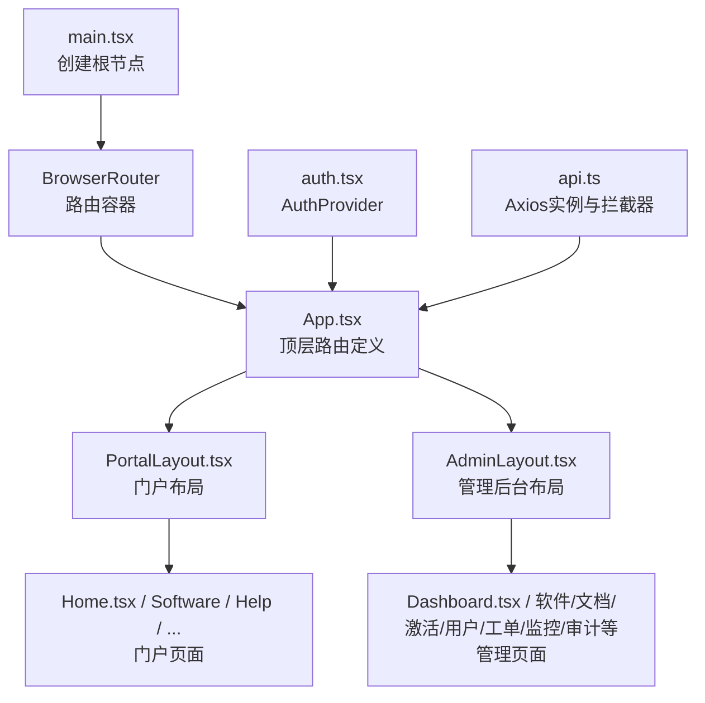
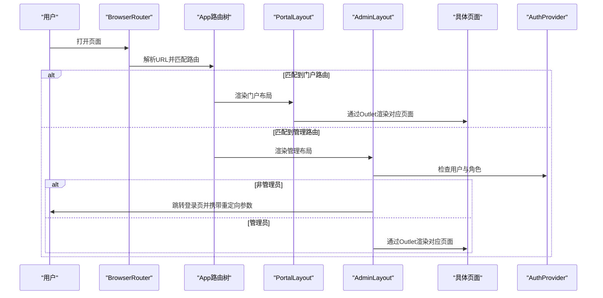
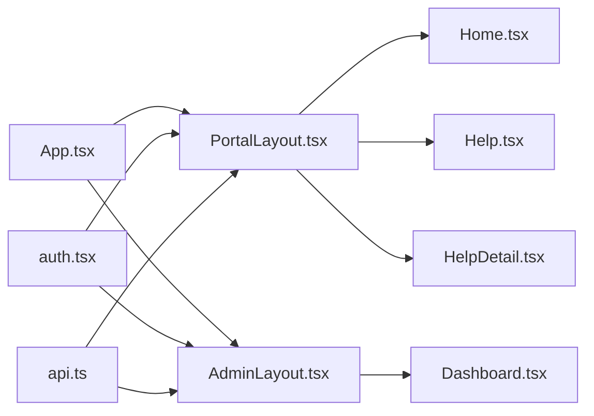

# 路由与导航系统

<cite>
**本文档引用的文件**
- [apps/web/src/App.tsx](file://apps/web/src/App.tsx)
- [apps/web/src/main.tsx](file://apps/web/src/main.tsx)
- [apps/web/src/lib/auth.tsx](file://apps/web/src/lib/auth.tsx)
- [apps/web/src/lib/api.ts](file://apps/web/src/lib/api.ts)
- [apps/web/src/layouts/PortalLayout.tsx](file://apps/web/src/layouts/PortalLayout.tsx)
- [apps/web/src/layouts/AdminLayout.tsx](file://apps/web/src/layouts/AdminLayout.tsx)
- [apps/web/src/pages/Login.tsx](file://apps/web/src/pages/Login.tsx)
- [apps/web/src/pages/Home.tsx](file://apps/web/src/pages/Home.tsx)
- [apps/web/src/pages/Help.tsx](file://apps/web/src/pages/Help.tsx)
- [apps/web/src/pages/HelpDetail.tsx](file://apps/web/src/pages/HelpDetail.tsx)
- [apps/web/src/pages/MyCodes.tsx](file://apps/web/src/pages/MyCodes.tsx)
- [apps/web/src/pages/admin/Dashboard.tsx](file://apps/web/src/pages/admin/Dashboard.tsx)
- [apps/web/vite.config.ts](file://apps/web/vite.config.ts)
</cite>

## 目录
1. [简介](#简介)
2. [项目结构](#项目结构)
3. [核心组件](#核心组件)
4. [架构总览](#架构总览)
5. [详细组件分析](#详细组件分析)
6. [依赖关系分析](#依赖关系分析)
7. [性能考虑](#性能考虑)
8. [故障排除指南](#故障排除指南)
9. [结论](#结论)
10. [附录](#附录)

## 简介
本文件系统性梳理 ZBH2 前端路由与导航体系，基于 React Router 6 的 Routes、Route、Outlet、Navigate 等核心能力，结合嵌套路由、动态参数、查询参数、权限守卫、布局联动与导航组件实现，形成一套完整的门户与管理后台路由方案。同时给出性能优化建议（代码分割、懒加载、预加载）与常见问题排查思路。

## 项目结构
前端应用采用单页应用（SPA）架构，根组件通过 BrowserRouter 包裹，顶层路由在 App 中集中声明，按功能划分为门户布局与管理后台布局两大区域，分别承载不同权限与业务域的页面。

图表来源
- [apps/web/src/main.tsx:11-21](file://apps/web/src/main.tsx#L11-L21)
- [apps/web/src/App.tsx:38-79](file://apps/web/src/App.tsx#L38-L79)
- [apps/web/src/layouts/PortalLayout.tsx:20-75](file://apps/web/src/layouts/PortalLayout.tsx#L20-L75)
- [apps/web/src/layouts/AdminLayout.tsx:88-126](file://apps/web/src/layouts/AdminLayout.tsx#L88-L126)

章节来源
- [apps/web/src/main.tsx:11-21](file://apps/web/src/main.tsx#L11-L21)
- [apps/web/src/App.tsx:38-79](file://apps/web/src/App.tsx#L38-L79)

## 核心组件
- 路由容器与入口
  - 在入口文件中以 BrowserRouter 包裹应用，确保所有路由组件可用。
  - 入口文件还注入 Ant Design 国际化与主题、全局认证上下文 Provider，为路由守卫与导航联动提供基础。
- 顶层路由与嵌套路由
  - App 组件内使用 Routes 定义两套路由树：门户路由与管理后台路由。
  - 门户路由以 PortalLayout 为父级，管理后台路由以 AdminLayout 为父级；两者均通过 Outlet 渲染子路由内容。
- 权限上下文与守卫
  - 认证上下文提供用户信息、登录/登出、刷新能力；管理后台布局在挂载时进行角色校验，非管理员自动跳转登录页并携带重定向地址。
- 导航与布局
  - 门户布局提供顶部横向菜单与用户下拉菜单；管理后台布局提供左侧菜单与顶部信息区，二者均与 Outlet 协同渲染当前页面。

章节来源
- [apps/web/src/main.tsx:11-21](file://apps/web/src/main.tsx#L11-L21)
- [apps/web/src/App.tsx:38-79](file://apps/web/src/App.tsx#L38-L79)
- [apps/web/src/layouts/PortalLayout.tsx:20-75](file://apps/web/src/layouts/PortalLayout.tsx#L20-L75)
- [apps/web/src/layouts/AdminLayout.tsx:88-126](file://apps/web/src/layouts/AdminLayout.tsx#L88-L126)
- [apps/web/src/lib/auth.tsx:20-54](file://apps/web/src/lib/auth.tsx#L20-L54)

## 架构总览
下图展示从浏览器到页面渲染的关键流程，包括路由匹配、布局选择、权限校验与页面渲染。

图表来源
- [apps/web/src/main.tsx:11-21](file://apps/web/src/main.tsx#L11-L21)
- [apps/web/src/App.tsx:38-79](file://apps/web/src/App.tsx#L38-L79)
- [apps/web/src/layouts/AdminLayout.tsx:88-126](file://apps/web/src/layouts/AdminLayout.tsx#L88-L126)
- [apps/web/src/lib/auth.tsx:20-54](file://apps/web/src/lib/auth.tsx#L20-L54)

## 详细组件分析

### 顶层路由与嵌套路由
- 门户路由树
  - 以 PortalLayout 为根，包含首页、软件下载、帮助文档、激活、云服务、AI客服、登录等页面。
  - 子路由支持动态参数（如帮助详情的 id），用于详情页渲染。
- 管理后台路由树
  - 以 AdminLayout 为根，包含仪表盘、软件/文档/激活/资产/工单/报表/FAQ/监控/审计等子路由。
  - 使用相对路径（不带斜杠）声明子路由，遵循 React Router 6 的路径继承规则，父级前缀为 /admin。
- 路由索引
  - 管理后台首页使用 index 属性指向 Dashboard，作为 /admin 的默认页面。

章节来源
- [apps/web/src/App.tsx:38-79](file://apps/web/src/App.tsx#L38-L79)

### 动态路由参数与查询参数
- 动态参数
  - 帮助详情路由使用路径参数 id，页面通过 useParams 获取并发起数据请求。
- 查询参数
  - 登录页通过 useSearchParams 获取 redirect 参数，在登录成功后根据该参数进行重定向。
- 路由守卫
  - 管理后台布局在挂载时读取用户状态与角色，若非管理员则跳转登录页并携带当前路径作为重定向参数。

章节来源
- [apps/web/src/pages/HelpDetail.tsx:10-18](file://apps/web/src/pages/HelpDetail.tsx#L10-L18)
- [apps/web/src/pages/Login.tsx:7-24](file://apps/web/src/pages/Login.tsx#L7-L24)
- [apps/web/src/layouts/AdminLayout.tsx:88-97](file://apps/web/src/layouts/AdminLayout.tsx#L88-L97)

### 权限控制与导航联动
- 登录验证
  - 认证上下文在应用启动时尝试刷新用户信息；登录页提交凭据后写入用户状态。
- 角色权限检查
  - 管理后台布局在 useEffect 中判断用户角色，非管理员统一跳转登录页。
- 访问控制
  - 门户侧“我的激活码”页面在挂载时检测用户状态，未登录则跳转登录页并携带重定向参数。
- 导航联动
  - 门户布局顶部菜单根据当前路径高亮；用户下拉菜单根据角色显示“管理后台”入口。
  - 管理后台左侧菜单根据当前路径高亮，且部分菜单项支持分组展开。

章节来源
- [apps/web/src/lib/auth.tsx:20-54](file://apps/web/src/lib/auth.tsx#L20-L54)
- [apps/web/src/pages/Login.tsx:7-24](file://apps/web/src/pages/Login.tsx#L7-L24)
- [apps/web/src/layouts/AdminLayout.tsx:88-126](file://apps/web/src/layouts/AdminLayout.tsx#L88-L126)
- [apps/web/src/layouts/PortalLayout.tsx:20-75](file://apps/web/src/layouts/PortalLayout.tsx#L20-L75)
- [apps/web/src/pages/MyCodes.tsx:10-24](file://apps/web/src/pages/MyCodes.tsx#L10-L24)

### 导航组件实现
- 门户顶部导航
  - 水平菜单项与当前路径匹配，用户登录后显示下拉菜单，包含“我的激活码”、“我的工单”、“管理后台”（管理员可见）、“退出登录”。
- 管理后台侧边菜单
  - 内置多级菜单，按模块分组（软件管理、文档管理、激活管理、数字资产、云服务、工单管理、AI知识库、资产报表、用户管理、运维监控、审计日志）。
  - 默认展开指定分组，选中当前路径对应的菜单项。
- 面包屑导航
  - 当前代码未实现专用面包屑组件，但可通过菜单项与路径映射关系在需要时扩展。

章节来源
- [apps/web/src/layouts/PortalLayout.tsx:20-75](file://apps/web/src/layouts/PortalLayout.tsx#L20-L75)
- [apps/web/src/layouts/AdminLayout.tsx:28-86](file://apps/web/src/layouts/AdminLayout.tsx#L28-L86)

### 页面示例与数据流
- 门户首页
  - 并行请求多个接口聚合统计数据与热门内容，点击卡片或列表项触发路由跳转。
- 管理后台仪表盘
  - 并行请求多个统计接口，汇总软件、文档、激活码、用户数量。
- 帮助文档与详情
  - 列表页按分类聚合文档，点击进入详情页；详情页通过动态参数获取文档内容。

章节来源
- [apps/web/src/pages/Home.tsx:30-57](file://apps/web/src/pages/Home.tsx#L30-L57)
- [apps/web/src/pages/admin/Dashboard.tsx:8-25](file://apps/web/src/pages/admin/Dashboard.tsx#L8-L25)
- [apps/web/src/pages/Help.tsx:25-60](file://apps/web/src/pages/Help.tsx#L25-L60)
- [apps/web/src/pages/HelpDetail.tsx:10-18](file://apps/web/src/pages/HelpDetail.tsx#L10-L18)

## 依赖关系分析
- 组件耦合
  - App 仅负责路由树定义，不直接耦合页面逻辑；页面通过布局组件与导航组件间接依赖认证上下文。
- 外部依赖
  - React Router 6：提供路由声明、嵌套、参数、导航能力。
  - Ant Design：提供布局、菜单、下拉、按钮、图标等 UI 组件。
  - Axios：封装 API 请求与 401 统一处理。
- 可能的循环依赖
  - 当前结构清晰，路由树在顶层集中声明，避免了页面对路由的直接依赖，降低循环依赖风险。

图表来源
- [apps/web/src/App.tsx:38-79](file://apps/web/src/App.tsx#L38-L79)
- [apps/web/src/layouts/PortalLayout.tsx:20-75](file://apps/web/src/layouts/PortalLayout.tsx#L20-L75)
- [apps/web/src/layouts/AdminLayout.tsx:88-126](file://apps/web/src/layouts/AdminLayout.tsx#L88-L126)
- [apps/web/src/lib/auth.tsx:20-54](file://apps/web/src/lib/auth.tsx#L20-L54)
- [apps/web/src/lib/api.ts:1-16](file://apps/web/src/lib/api.ts#L1-L16)

章节来源
- [apps/web/src/App.tsx:38-79](file://apps/web/src/App.tsx#L38-L79)
- [apps/web/src/lib/auth.tsx:20-54](file://apps/web/src/lib/auth.tsx#L20-L54)
- [apps/web/src/lib/api.ts:1-16](file://apps/web/src/lib/api.ts#L1-L16)

## 性能考虑
- 代码分割与懒加载
  - 建议将大型页面或管理后台子路由按需加载，减少首屏体积。可使用 React.lazy 与 Suspense 实现路由级懒加载。
- 预加载策略
  - 对用户高频访问的页面（如门户首页、帮助列表）可在路由切换前进行预加载，提升交互流畅度。
- 资源代理与开发体验
  - Vite 已配置本地代理至后端服务，便于开发调试；生产环境需确保静态资源与 API 代理正确部署。
- 并行请求优化
  - 首页与仪表盘已采用 Promise.all 并行请求，建议在其他页面复用该模式，缩短首屏等待时间。

章节来源
- [apps/web/vite.config.ts:4-12](file://apps/web/vite.config.ts#L4-L12)
- [apps/web/src/pages/Home.tsx:37-57](file://apps/web/src/pages/Home.tsx#L37-L57)
- [apps/web/src/pages/admin/Dashboard.tsx:11-25](file://apps/web/src/pages/admin/Dashboard.tsx#L11-L25)

## 故障排除指南
- 登录后未回到原页面
  - 检查登录页是否正确读取并使用 redirect 查询参数进行重定向。
- 管理后台无法进入
  - 确认认证上下文是否正确刷新用户信息；检查后端 /auth/me 是否返回用户角色。
- 401 未触发跳转
  - Axios 拦截器对 401 的处理逻辑需与路由守卫配合，确保非登录页的 401 不被静默处理。
- 菜单高亮异常
  - 门户布局根据路径前缀高亮；管理后台根据完整路径高亮。确认路径拼接与菜单项 key 一致。

章节来源
- [apps/web/src/pages/Login.tsx:7-24](file://apps/web/src/pages/Login.tsx#L7-L24)
- [apps/web/src/lib/auth.tsx:20-54](file://apps/web/src/lib/auth.tsx#L20-L54)
- [apps/web/src/lib/api.ts:5-13](file://apps/web/src/lib/api.ts#L5-L13)
- [apps/web/src/layouts/PortalLayout.tsx:34](file://apps/web/src/layouts/PortalLayout.tsx#L34)
- [apps/web/src/layouts/AdminLayout.tsx:109](file://apps/web/src/layouts/AdminLayout.tsx#L109)

## 结论
本路由与导航系统以 React Router 6 为核心，结合自研认证上下文与 Ant Design 布局组件，实现了门户与管理后台的清晰分离、完善的权限控制与良好的导航体验。通过并行请求与后续的懒加载策略，可进一步优化首屏性能与交互体验。建议在后续迭代中补充面包屑导航与更细粒度的权限细化（如页面级权限），以满足更复杂的业务场景。

## 附录
- 快速定位
  - 顶层路由树：[apps/web/src/App.tsx:38-79](file://apps/web/src/App.tsx#L38-L79)
  - 门户布局与导航：[apps/web/src/layouts/PortalLayout.tsx:20-75](file://apps/web/src/layouts/PortalLayout.tsx#L20-L75)
  - 管理后台布局与守卫：[apps/web/src/layouts/AdminLayout.tsx:88-126](file://apps/web/src/layouts/AdminLayout.tsx#L88-L126)
  - 登录与重定向：[apps/web/src/pages/Login.tsx:7-24](file://apps/web/src/pages/Login.tsx#L7-L24)
  - 动态参数与详情页：[apps/web/src/pages/HelpDetail.tsx:10-18](file://apps/web/src/pages/HelpDetail.tsx#L10-L18)
  - 首页与并行请求：[apps/web/src/pages/Home.tsx:30-57](file://apps/web/src/pages/Home.tsx#L30-L57)
  - 仪表盘统计：[apps/web/src/pages/admin/Dashboard.tsx:8-25](file://apps/web/src/pages/admin/Dashboard.tsx#L8-L25)
  - 认证上下文：[apps/web/src/lib/auth.tsx:20-54](file://apps/web/src/lib/auth.tsx#L20-L54)
  - API 封装与拦截器：[apps/web/src/lib/api.ts:1-16](file://apps/web/src/lib/api.ts#L1-L16)
  - 开发代理配置：[apps/web/vite.config.ts:4-12](file://apps/web/vite.config.ts#L4-L12)