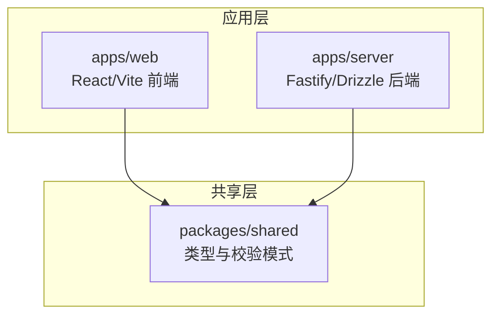
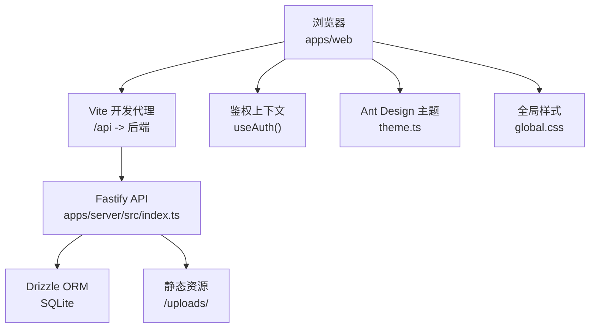
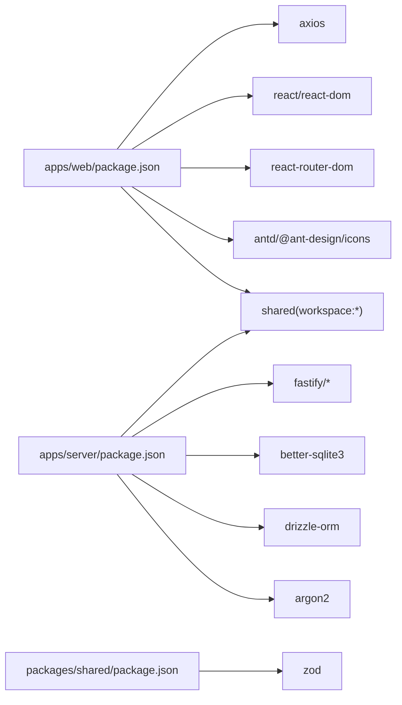

# 代码规范与最佳实践

<cite>
**本文引用的文件**
- [README.md](file://README.md)
- [package.json](file://package.json)
- [pnpm-workspace.yaml](file://pnpm-workspace.yaml)
- [apps/web/package.json](file://apps/web/package.json)
- [apps/server/package.json](file://apps/server/package.json)
- [packages/shared/package.json](file://packages/shared/package.json)
- [apps/web/src/App.tsx](file://apps/web/src/App.tsx)
- [apps/web/src/main.tsx](file://apps/web/src/main.tsx)
- [apps/web/src/lib/api.ts](file://apps/web/src/lib/api.ts)
- [apps/web/src/lib/auth.tsx](file://apps/web/src/lib/auth.tsx)
- [apps/web/src/layouts/PortalLayout.tsx](file://apps/web/src/layouts/PortalLayout.tsx)
- [apps/web/src/pages/Home.tsx](file://apps/web/src/pages/Home.tsx)
- [apps/web/src/theme.ts](file://apps/web/src/theme.ts)
- [apps/web/src/global.css](file://apps/web/src/global.css)
- [apps/server/src/index.ts](file://apps/server/src/index.ts)
- [apps/server/drizzle.config.ts](file://apps/server/drizzle.config.ts)
- [packages/shared/src/types.ts](file://packages/shared/src/types.ts)
- [packages/shared/src/schemas.ts](file://packages/shared/src/schemas.ts)
</cite>

## 目录
1. [引言](#引言)
2. [项目结构](#项目结构)
3. [核心组件](#核心组件)
4. [架构总览](#架构总览)
5. [详细组件分析](#详细组件分析)
6. [依赖关系分析](#依赖关系分析)
7. [性能考虑](#性能考虑)
8. [故障排查指南](#故障排查指南)
9. [结论](#结论)
10. [附录](#附录)

## 引言
本文件为 ZBH2 项目的代码规范与最佳实践指南，覆盖 TypeScript 编码标准、React 组件开发规范、Drizzle ORM 使用规范、Git 提交规范、CSS/SCSS 样式规范、Monorepo 代码组织与模块导入规范。内容以仓库现有实现为依据，结合可操作建议，帮助团队统一风格、提升质量与可维护性。

## 项目结构
ZBH2 采用 pnpm workspaces 的 Monorepo 结构，分为应用层与共享包层：
- 应用层
  - apps/web：React + Vite 前端应用
  - apps/server：Fastify + Drizzle ORM 后端 API
- 共享层
  - packages/shared：前后端共享的类型与 Zod 校验模式

图表来源
- [pnpm-workspace.yaml:1-5](file://pnpm-workspace.yaml#L1-L5)
- [apps/web/package.json:1-29](file://apps/web/package.json#L1-L29)
- [apps/server/package.json:1-37](file://apps/server/package.json#L1-L37)
- [packages/shared/package.json:1-24](file://packages/shared/package.json#L1-L24)

章节来源
- [README.md:47-68](file://README.md#L47-L68)
- [pnpm-workspace.yaml:1-5](file://pnpm-workspace.yaml#L1-L5)
- [package.json:1-20](file://package.json#L1-L20)

## 核心组件
- 前端入口与全局配置
  - 应用根节点、国际化与主题注入、全局样式引入
- 前端路由与布局
  - 路由注册、门户布局与用户菜单、权限入口
- 前端状态与鉴权
  - Context 鉴权上下文、登录/登出/刷新流程
- 前端网络层
  - Axios 实例、基础 URL 与凭据、响应拦截器
- 后端入口与中间件
  - 安全头、CORS、Cookie、限流、静态资源、多部分上传
- 数据库与 ORM
  - Drizzle 配置、SQLite 连接、迁移与种子脚本
- 共享类型与校验
  - 角色/状态枚举、通用响应结构、分页结构
  - Zod 校验模式：登录、用户创建、软件/帮助分类与条目、激活产品、激活申请等

章节来源
- [apps/web/src/main.tsx:1-22](file://apps/web/src/main.tsx#L1-L22)
- [apps/web/src/App.tsx:1-80](file://apps/web/src/App.tsx#L1-L80)
- [apps/web/src/layouts/PortalLayout.tsx:1-76](file://apps/web/src/layouts/PortalLayout.tsx#L1-L76)
- [apps/web/src/lib/auth.tsx:1-55](file://apps/web/src/lib/auth.tsx#L1-L55)
- [apps/web/src/lib/api.ts:1-16](file://apps/web/src/lib/api.ts#L1-L16)
- [apps/server/src/index.ts:1-60](file://apps/server/src/index.ts#L1-L60)
- [apps/server/drizzle.config.ts:1-11](file://apps/server/drizzle.config.ts#L1-L11)
- [packages/shared/src/types.ts:1-18](file://packages/shared/src/types.ts#L1-L18)
- [packages/shared/src/schemas.ts:1-51](file://packages/shared/src/schemas.ts#L1-L51)

## 架构总览
系统采用前端 SPA + 后端 API 的分层架构，前端通过 Axios 发起 /api 前缀请求，开发环境由 Vite 代理转发至后端；后端使用 Fastify 注册安全与业务中间件，Drizzle 管理 SQLite 数据。

图表来源
- [apps/web/src/main.tsx:1-22](file://apps/web/src/main.tsx#L1-L22)
- [apps/web/src/lib/api.ts:1-16](file://apps/web/src/lib/api.ts#L1-L16)
- [apps/server/src/index.ts:1-60](file://apps/server/src/index.ts#L1-L60)
- [apps/server/drizzle.config.ts:1-11](file://apps/server/drizzle.config.ts#L1-L11)
- [apps/web/src/theme.ts:1-23](file://apps/web/src/theme.ts#L1-L23)
- [apps/web/src/global.css:1-44](file://apps/web/src/global.css#L1-L44)

## 详细组件分析

### TypeScript 编码标准
- 命名约定
  - 类型别名与接口使用帕斯卡命名，如 UserRole、ApiResponse、PaginatedResponse
  - 枚举值使用小写短横线风格，如 draft/published/archived
- 类型定义规范
  - 明确区分“运行时值”与“类型”，优先使用 Zod 校验进行输入验证
  - 通用响应结构统一包含 success/data/error 字段，便于前端一致处理
- 接口设计原则
  - 将共享类型集中于 packages/shared，避免重复与不一致
  - 保持接口最小可用，字段必填/可选明确标注
- 错误处理模式
  - 后端统一返回结构化响应；前端 Axios 拦截器对 401 场景做条件处理
  - 组件内使用 useState/ useEffect 管理加载态与错误态，避免未捕获异常

章节来源
- [packages/shared/src/types.ts:1-18](file://packages/shared/src/types.ts#L1-L18)
- [packages/shared/src/schemas.ts:1-51](file://packages/shared/src/schemas.ts#L1-L51)
- [apps/web/src/lib/api.ts:1-16](file://apps/web/src/lib/api.ts#L1-L16)

### React 组件开发规范
- 函数组件模式
  - 优先使用函数组件与 Hooks，避免类组件
  - 页面组件导出默认函数，布局组件负责结构与导航
- Hook 使用规范
  - 将副作用逻辑封装为自定义 Hook 或在组件内部合理拆分
  - 使用 useCallback 包裹回调，减少子组件重渲染
- 状态管理最佳实践
  - 全局用户态通过 Context 管理，避免跨层级传递地狱
  - 组件内部局部状态与全局状态分离，明确职责边界
- 性能优化技巧
  - 列表渲染使用稳定 key，避免不必要的重新挂载
  - 使用 React.Suspense 与懒加载（如需）提升首屏性能
  - 合理拆分组件，减少无关 props 传递

章节来源
- [apps/web/src/App.tsx:1-80](file://apps/web/src/App.tsx#L1-L80)
- [apps/web/src/layouts/PortalLayout.tsx:1-76](file://apps/web/src/layouts/PortalLayout.tsx#L1-L76)
- [apps/web/src/lib/auth.tsx:1-55](file://apps/web/src/lib/auth.tsx#L1-L55)
- [apps/web/src/pages/Home.tsx:1-165](file://apps/web/src/pages/Home.tsx#L1-L165)

### Drizzle ORM 使用规范
- 数据模型设计
  - 使用 Zod 校验确保入参合法性，ORM 层仅处理结构化数据
  - 通过 drizzle.config.ts 指定 schema 与输出目录，统一方言与连接字符串
- 查询优化
  - 优先使用索引列进行过滤与排序，避免全表扫描
  - 大结果集分页查询，结合分页结构统一返回
- 事务处理
  - 对于多步写入（如创建用户+初始化资料），使用事务保证一致性
  - 事务失败回滚，避免部分更新导致的数据不一致

章节来源
- [apps/server/drizzle.config.ts:1-11](file://apps/server/drizzle.config.ts#L1-L11)
- [packages/shared/src/schemas.ts:1-51](file://packages/shared/src/schemas.ts#L1-L51)
- [packages/shared/src/types.ts:1-18](file://packages/shared/src/types.ts#L1-L18)

### Git 提交规范
- 提交信息格式
  - 类型: 简要描述（不超过 50 字）
  - 类型建议：feat、fix、docs、style、refactor、test、chore、perf、ci
  - 详细说明可另起一行，必要时给出动机与影响
- 分支命名规则
  - 功能分支：feature/xxx
  - 修复分支：fix/xxx
  - 文档分支：docs/xxx
  - 预发布分支：release/x.y.z
- 代码审查标准
  - 单元测试与集成测试覆盖率达标
  - 代码风格与规范检查通过
  - 变更影响面清晰，有必要的注释与变更日志

（本节为通用规范说明，不直接分析具体文件）

### CSS/SCSS 样式规范
- 命名与组织
  - 使用语义化类名，避免过度依赖 ID
  - 组件样式局部化，避免全局污染
- 设计系统
  - 基于 Ant Design 主题变量定制，统一主色、背景与圆角
  - 全局 CSS 变量集中管理，便于主题切换与维护
- 组件设计原则
  - 响应式优先，移动端优先
  - 交互反馈明确，状态变化可感知

章节来源
- [apps/web/src/theme.ts:1-23](file://apps/web/src/theme.ts#L1-L23)
- [apps/web/src/global.css:1-44](file://apps/web/src/global.css#L1-L44)

### Monorepo 代码组织与模块导入规范
- 工作区配置
  - 使用 pnpm-workspace.yaml 声明工作区包，统一构建与脚本
- 模块导入
  - 应用间共享代码通过 workspace:* 导入，避免复制粘贴
  - packages/shared 作为唯一真实来源，其他包仅消费
- 脚本与工具链
  - 顶层 package.json 提供统一开发/构建命令
  - 应用内独立的 tsconfig 与构建配置，避免相互干扰

章节来源
- [pnpm-workspace.yaml:1-5](file://pnpm-workspace.yaml#L1-L5)
- [package.json:1-20](file://package.json#L1-L20)
- [apps/web/package.json:1-29](file://apps/web/package.json#L1-L29)
- [apps/server/package.json:1-37](file://apps/server/package.json#L1-L37)
- [packages/shared/package.json:1-24](file://packages/shared/package.json#L1-L24)

## 依赖关系分析
- 前端依赖
  - React、Ant Design、React Router、Axios、shared
- 后端依赖
  - Fastify 生态（cookie、cors、helmet、multipart、rate-limit、static）、argon2、better-sqlite3、drizzle-orm、shared、zod
- 共享依赖
  - zod 用于输入校验，统一前后端约束

图表来源
- [apps/web/package.json:1-29](file://apps/web/package.json#L1-L29)
- [apps/server/package.json:1-37](file://apps/server/package.json#L1-L37)
- [packages/shared/package.json:1-24](file://packages/shared/package.json#L1-L24)

章节来源
- [apps/web/package.json:1-29](file://apps/web/package.json#L1-L29)
- [apps/server/package.json:1-37](file://apps/server/package.json#L1-L37)
- [packages/shared/package.json:1-24](file://packages/shared/package.json#L1-L24)

## 性能考虑
- 前端
  - 合理使用 Suspense 与懒加载，减少首屏体积
  - 列表虚拟化（如大数据集场景）降低 DOM 节点数量
  - 图片与静态资源 CDN 化，减少带宽占用
- 后端
  - 限制上传文件大小，避免内存压力
  - 合理设置限流策略，保护系统资源
  - 数据库查询加索引，避免 N+1 查询
- 共享层
  - 将公共校验与类型下沉到 shared，减少重复计算与传输

（本节为通用指导，不直接分析具体文件）

## 故障排查指南
- 常见问题定位
  - 端口占用：确认 PORT 环境变量与防火墙设置
  - 数据库连接：检查 DATABASE_URL 与 SQLite 文件权限
  - 静态资源访问：确认 uploads 目录存在且权限正确
- 日志与监控
  - 启动日志中关注 CORS、Cookie、Rate Limit 注册是否成功
  - 前端 401 重定向：检查鉴权上下文与路由守卫
- 回滚与恢复
  - 数据库迁移失败：回退到上一快照，修正 schema 后再迁移
  - 配置错误：临时降级到默认配置，逐步排查

章节来源
- [apps/server/src/index.ts:1-60](file://apps/server/src/index.ts#L1-L60)
- [apps/web/src/lib/api.ts:1-16](file://apps/web/src/lib/api.ts#L1-L16)

## 结论
本规范以现有代码实现为基础，结合工程化最佳实践，形成统一的 TypeScript、React、ORM、Git、样式与 Monorepo 规范。建议团队在日常开发中严格遵循，并持续完善测试与文档，保障系统的稳定性与可演进性。

## 附录
- 快速开始与默认账号
  - 环境要求、安装步骤、默认管理员账号与 CI 行为详见项目说明

章节来源
- [README.md:1-121](file://README.md#L1-L121)