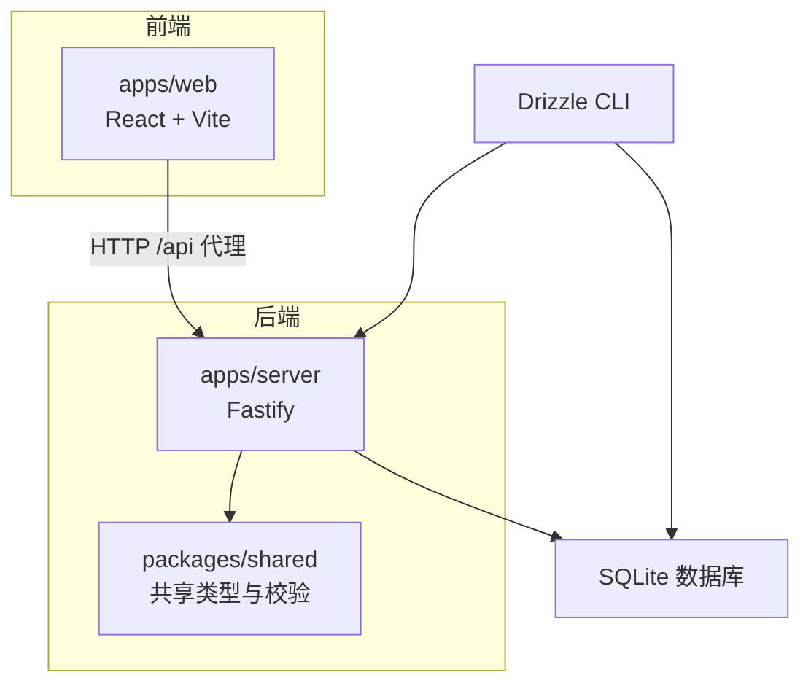
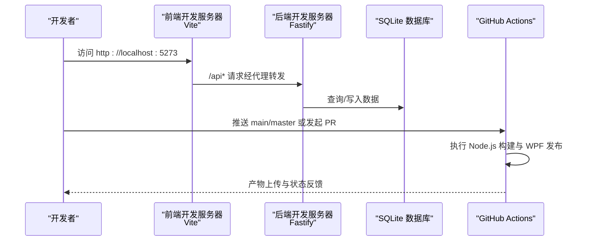
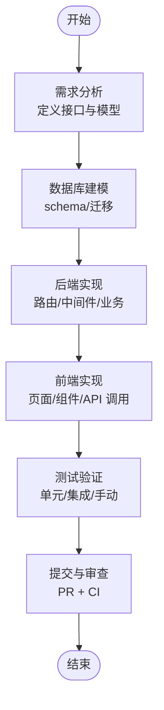
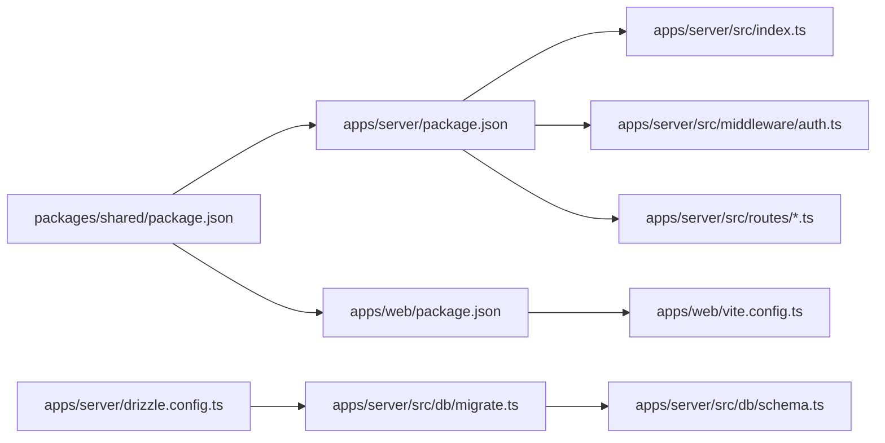

# 开发工作流程

<cite>
**本文引用的文件**
- [README.md](file://README.md)
- [.github/workflows/build.yml](file://.github/workflows/build.yml)
- [package.json](file://package.json)
- [pnpm-workspace.yaml](file://pnpm-workspace.yaml)
- [apps/server/package.json](file://apps/server/package.json)
- [apps/web/package.json](file://apps/web/package.json)
- [packages/shared/package.json](file://packages/shared/package.json)
- [apps/server/drizzle.config.ts](file://apps/server/drizzle.config.ts)
- [apps/server/src/db/migrate.ts](file://apps/server/src/db/migrate.ts)
- [apps/server/src/db/schema.ts](file://apps/server/src/db/schema.ts)
- [apps/web/vite.config.ts](file://apps/web/vite.config.ts)
- [apps/server/src/index.ts](file://apps/server/src/index.ts)
- [apps/server/src/middleware/auth.ts](file://apps/server/src/middleware/auth.ts)
- [apps/server/src/routes/auth.ts](file://apps/server/src/routes/auth.ts)
- [apps/server/src/routes/public.ts](file://apps/server/src/routes/public.ts)
</cite>

## 目录
1. [简介](#简介)
2. [项目结构](#项目结构)
3. [核心组件](#核心组件)
4. [架构总览](#架构总览)
5. [详细组件分析](#详细组件分析)
6. [依赖关系分析](#依赖关系分析)
7. [性能考虑](#性能考虑)
8. [故障排查指南](#故障排查指南)
9. [结论](#结论)
10. [附录](#附录)

## 简介
本文件面向ZBH2项目的开发者，提供一套完整的开发工作流程规范，涵盖分支管理、Pull Request流程、本地开发环境设置、功能开发流程、版本发布流程以及问题跟踪与任务管理最佳实践。内容基于仓库现有配置与源码进行总结提炼，确保新老成员快速上手并保持团队协作一致性。

## 项目结构
ZBH2采用 pnpm monorepo 结构，包含后端服务、前端门户、共享包与工具模块：
- apps/server：基于 Fastify 的后端 API，提供认证、公共接口、管理后台、文件上传、激活码、工单、资产管理、SaaS、AI FAQ、运维监控等路由。
- apps/web：基于 React + Vite 的前端门户，通过代理访问后端 API。
- packages/shared：前后端共享的 Zod 校验模式与类型定义。
- tools/ActivationClientWpf：Windows 平台的 WPF 演示激活客户端（用于CI构建）。
- 数据库：SQLite（better-sqlite3），使用 Drizzle ORM + Drizzle Kit 进行 schema 定义与迁移。

图表来源
- [apps/server/src/index.ts:1-60](file://apps/server/src/index.ts#L1-L60)
- [apps/web/vite.config.ts:1-13](file://apps/web/vite.config.ts#L1-L13)
- [apps/server/drizzle.config.ts:1-11](file://apps/server/drizzle.config.ts#L1-L11)
- [apps/server/src/db/schema.ts:1-330](file://apps/server/src/db/schema.ts#L1-L330)

章节来源
- [README.md:47-68](file://README.md#L47-L68)
- [pnpm-workspace.yaml:1-5](file://pnpm-workspace.yaml#L1-L5)

## 核心组件
- 后端入口与中间件
  - 入口文件注册安全、跨域、静态资源、限流、Cookie、多部分上传等插件，并加载会话中间件与各路由模块。
  - 认证中间件负责从 Cookie 解析会话，注入请求上下文；并提供鉴权与管理员权限校验方法。
- 数据库与迁移
  - Drizzle 配置指向 SQLite，支持 schema 生成与迁移执行；迁移脚本确保 WAL 模式与外键约束开启。
- 前端开发服务器
  - Vite 开发服务器默认端口为 5273，并将 /api 前缀代理到后端 7500 端口。
- 共享包
  - 提供前后端共用的 Zod 校验模式与类型导出，保证请求/响应结构一致。

章节来源
- [apps/server/src/index.ts:1-60](file://apps/server/src/index.ts#L1-L60)
- [apps/server/src/middleware/auth.ts:1-56](file://apps/server/src/middleware/auth.ts#L1-L56)
- [apps/server/drizzle.config.ts:1-11](file://apps/server/drizzle.config.ts#L1-L11)
- [apps/server/src/db/migrate.ts:1-18](file://apps/server/src/db/migrate.ts#L1-L18)
- [apps/web/vite.config.ts:1-13](file://apps/web/vite.config.ts#L1-L13)
- [packages/shared/package.json:1-24](file://packages/shared/package.json#L1-L24)

## 架构总览
下图展示了本地开发与CI构建的关键交互：

图表来源
- [apps/web/vite.config.ts:6-11](file://apps/web/vite.config.ts#L6-L11)
- [apps/server/src/index.ts:27-54](file://apps/server/src/index.ts#L27-L54)
- [.github/workflows/build.yml:14-52](file://.github/workflows/build.yml#L14-L52)

## 详细组件分析

### 分支管理策略
- 主分支保护
  - CI 在 main/master 分支触发构建与测试，建议在仓库设置中启用“保护分支”，要求至少一个审查批准且禁止强制推送。
- 功能分支
  - 建议以 feature/xxx 命名前缀创建功能分支，变更尽量小而聚焦，避免跨功能耦合。
- 合并流程
  - 合并前必须通过 CI 构建与产物上传；合并后清理功能分支，保持历史清晰。

章节来源
- [.github/workflows/build.yml:3-8](file://.github/workflows/build.yml#L3-L8)

### Pull Request 流程
- PR 模板
  - 建议在 .github/PULL_REQUEST_TEMPLATE.md 中定义模板，包含：变更摘要、影响范围、测试验证、风险评估、回滚预案等字段。
- 代码审查标准
  - 逻辑正确性、边界条件处理、安全性（SQL注入、XSS、CSRF）、性能与可维护性、命名与注释质量。
  - 引入新依赖需评估许可证与安全扫描结果。
- CI/CD 集成
  - 推送 main/master 或 PR 时自动触发 Node.js 构建与 WPF 自包含发布；产物分别上传为 web-dist 与 server-dist，以及 ActivationClientDemo-win-x64.zip。

章节来源
- [.github/workflows/build.yml:1-87](file://.github/workflows/build.yml#L1-L87)
- [README.md:40-46](file://README.md#L40-L46)

### 本地开发环境设置
- 环境要求
  - Node.js >= 18，pnpm >= 8。
- 依赖安装
  - 使用 pnpm workspaces 一次性安装所有包依赖。
- 环境变量
  - PORT：后端监听端口，默认 7500。
  - DATABASE_URL：SQLite 文件路径，默认 ../../data/app.sqlite。
- 数据库初始化
  - 执行数据库迁移与种子数据，生成表结构与初始数据。
- 启动开发服务器
  - 同时启动前端与后端开发服务器；前端代理将 /api 请求转发至后端。

章节来源
- [README.md:7-31](file://README.md#L7-L31)
- [README.md:97-103](file://README.md#L97-L103)
- [package.json:4-12](file://package.json#L4-L12)
- [apps/server/drizzle.config.ts:7-9](file://apps/server/drizzle.config.ts#L7-L9)
- [apps/server/src/db/migrate.ts:7-15](file://apps/server/src/db/migrate.ts#L7-L15)
- [apps/web/vite.config.ts:6-11](file://apps/web/vite.config.ts#L6-L11)

### 功能开发流程
- 需求分析
  - 明确用户故事、接口契约与数据模型；必要时更新共享包中的 Zod 模式。
- 设计与建模
  - 若涉及新增表或字段，先在 schema 中定义，再生成迁移文件并提交。
- 实现
  - 后端：新增路由与业务逻辑，必要时扩展中间件；使用共享包提供的校验模式。
  - 前端：新增页面或组件，调用后端 /api 接口；注意代理配置与错误处理。
- 测试验证
  - 单元/集成测试覆盖关键路径；手动验证代理、会话、权限控制与数据库操作。
- 提交与审查
  - 提交前运行构建脚本，确保产物可生成；发起 PR 并通过 CI 检查。

章节来源
- [packages/shared/package.json:6-11](file://packages/shared/package.json#L6-L11)
- [apps/server/src/db/schema.ts:1-330](file://apps/server/src/db/schema.ts#L1-L330)
- [apps/server/src/routes/auth.ts:1-51](file://apps/server/src/routes/auth.ts#L1-L51)
- [apps/server/src/routes/public.ts:1-52](file://apps/server/src/routes/public.ts#L1-L52)

### 版本发布流程
- 版本号管理
  - 当前各包版本为 0.0.1，建议遵循语义化版本（SemVer）。重大变更升级主版本，新增不破坏兼容功能升次版本，修复补丁。
- 变更日志维护
  - 建议在根目录维护 CHANGELOG.md，记录每次发布的主要变更、修复与已知问题。
- 发布准备
  - 本地构建通过后，创建带版本标签的 Git Tag（如 v0.1.0），触发 CI 产出发布制品。
- 制品分发
  - CI 将 web-dist、server-dist 与 ActivationClientDemo-win-x64.zip 作为构建产物上传。

章节来源
- [apps/server/package.json:2-4](file://apps/server/package.json#L2-L4)
- [apps/web/package.json:2-4](file://apps/web/package.json#L2-L4)
- [packages/shared/package.json:2-4](file://packages/shared/package.json#L2-L4)
- [.github/workflows/build.yml:39-51](file://.github/workflows/build.yml#L39-L51)

### 问题跟踪与任务管理最佳实践
- Issue 规范
  - 模板包含：标题、重现步骤、期望/实际行为、环境信息、严重程度分级。
- 任务拆分
  - 将大功能拆分为多个小任务，每个任务对应单一 PR，降低审查成本。
- 关联与追踪
  - PR 描述中关联相关 Issue；在提交信息中使用 fix/close 关联修复。
- 回归测试
  - 重要修复需补充回归用例或在测试清单中标注验证项。

## 依赖关系分析

图表来源
- [apps/server/package.json:1-37](file://apps/server/package.json#L1-L37)
- [apps/web/package.json:1-29](file://apps/web/package.json#L1-L29)
- [packages/shared/package.json:1-24](file://packages/shared/package.json#L1-L24)
- [apps/server/src/index.ts:1-60](file://apps/server/src/index.ts#L1-L60)
- [apps/server/src/middleware/auth.ts:1-56](file://apps/server/src/middleware/auth.ts#L1-L56)
- [apps/server/drizzle.config.ts:1-11](file://apps/server/drizzle.config.ts#L1-L11)
- [apps/server/src/db/migrate.ts:1-18](file://apps/server/src/db/migrate.ts#L1-L18)
- [apps/server/src/db/schema.ts:1-330](file://apps/server/src/db/schema.ts#L1-L330)
- [apps/web/vite.config.ts:1-13](file://apps/web/vite.config.ts#L1-L13)

章节来源
- [pnpm-workspace.yaml:1-5](file://pnpm-workspace.yaml#L1-L5)
- [package.json:1-20](file://package.json#L1-L20)

## 性能考虑
- 限流与安全
  - 后端启用速率限制与安全头，减少滥用与攻击面。
- 数据库优化
  - 迁移脚本启用 WAL 模式与外键约束，提升并发与一致性。
- 前端代理
  - Vite 代理简化开发阶段跨域问题，避免生产环境额外网关开销。
- 构建缓存
  - CI 使用 pnpm 缓存 Node.js 版本与依赖，缩短构建时间。

章节来源
- [apps/server/src/index.ts:30-35](file://apps/server/src/index.ts#L30-L35)
- [apps/server/src/db/migrate.ts:10-12](file://apps/server/src/db/migrate.ts#L10-L12)
- [apps/web/vite.config.ts:6-11](file://apps/web/vite.config.ts#L6-L11)
- [.github/workflows/build.yml:22-34](file://.github/workflows/build.yml#L22-L34)

## 故障排查指南
- 无法连接数据库
  - 检查 DATABASE_URL 是否可达，确认 data 目录存在且可写；运行迁移脚本初始化表结构。
- 前端无法访问 /api
  - 确认 Vite 代理配置与后端端口一致；检查浏览器网络面板与后端日志。
- 登录失败或会话异常
  - 检查 Cookie 设置、会话有效期与数据库中 sessions 表状态；确认中间件是否正确注入 sessionUser。
- CI 构建失败
  - 查看构建日志中 Node.js 与 pnpm 版本、依赖安装与构建命令输出；确认产物上传步骤是否成功。

章节来源
- [apps/server/drizzle.config.ts:7-9](file://apps/server/drizzle.config.ts#L7-L9)
- [apps/server/src/db/migrate.ts:7-15](file://apps/server/src/db/migrate.ts#L7-L15)
- [apps/web/vite.config.ts:6-11](file://apps/web/vite.config.ts#L6-L11)
- [apps/server/src/middleware/auth.ts:17-40](file://apps/server/src/middleware/auth.ts#L17-L40)
- [.github/workflows/build.yml:14-52](file://.github/workflows/build.yml#L14-L52)

## 结论
本文档基于仓库现有配置与源码，给出了从分支策略、PR 流程、本地开发到发布与问题管理的全流程规范。建议团队在实践中持续完善模板与检查清单，确保交付质量与协作效率。

## 附录
- 快速参考
  - 本地开发：安装依赖 → 数据库迁移与种子 → 启动 dev 脚本 → 访问前端与后端地址。
  - CI 触发：推送到 main/master 或发起 PR。
  - 数据库：Drizzle 配置与迁移脚本位于 apps/server 下。

章节来源
- [README.md:12-31](file://README.md#L12-L31)
- [.github/workflows/build.yml:3-8](file://.github/workflows/build.yml#L3-L8)
- [apps/server/drizzle.config.ts:1-11](file://apps/server/drizzle.config.ts#L1-L11)
- [apps/server/src/db/migrate.ts:1-18](file://apps/server/src/db/migrate.ts#L1-L18)