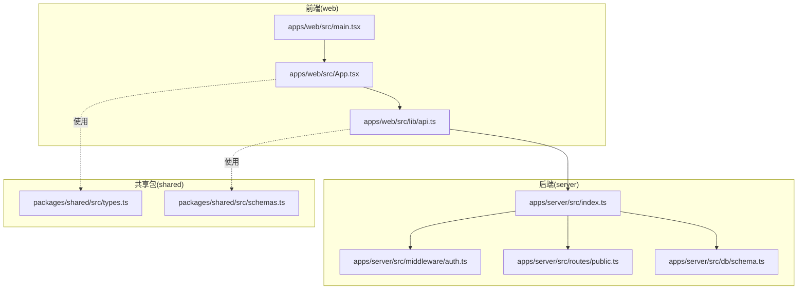
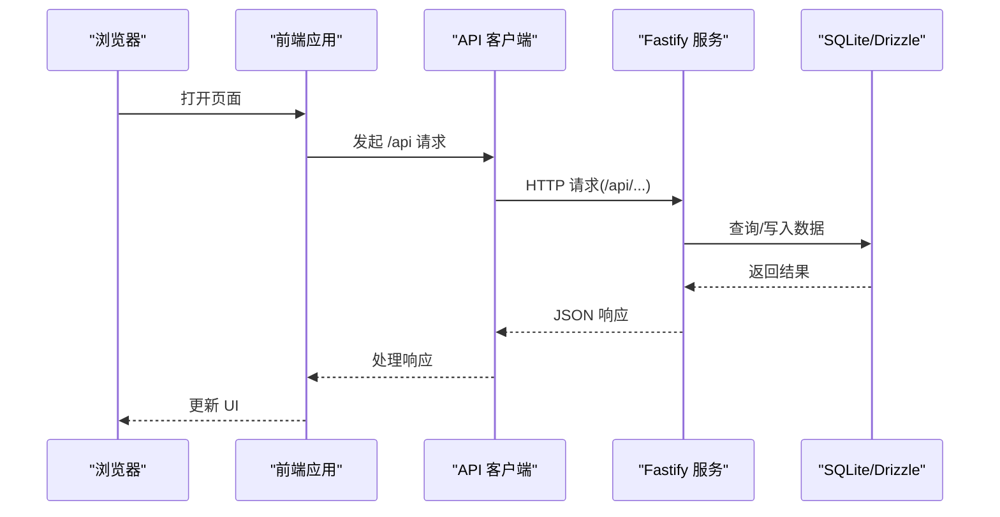
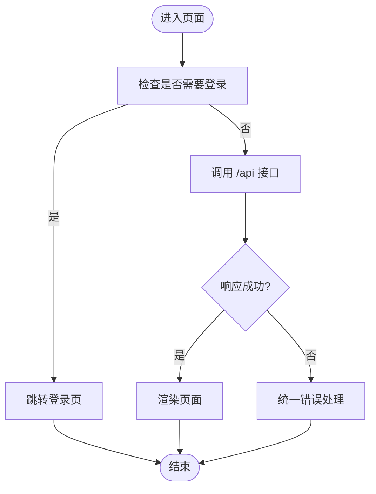
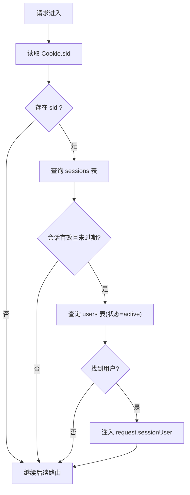
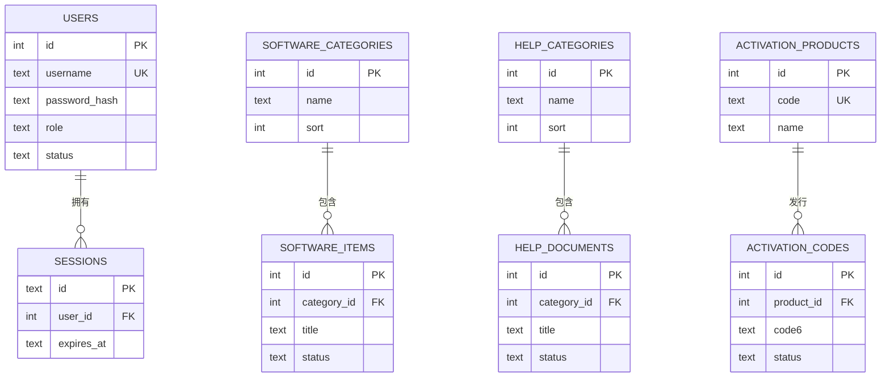
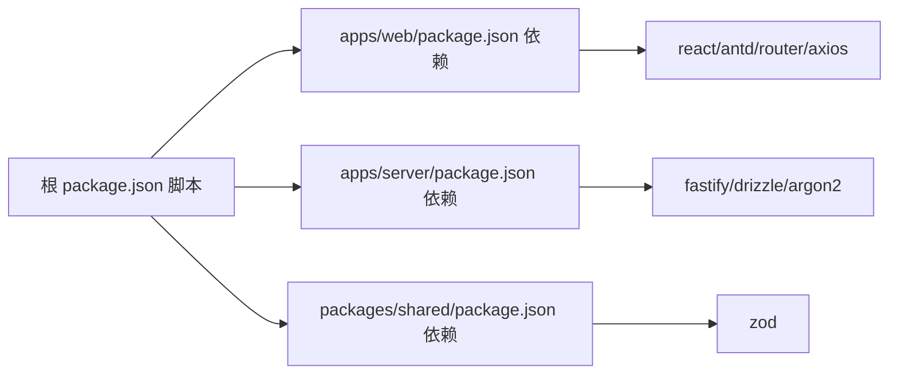

# 开发者指南

<cite>
**本文引用的文件**
- [README.md](file://README.md)
- [package.json](file://package.json)
- [pnpm-workspace.yaml](file://pnpm-workspace.yaml)
- [apps/web/package.json](file://apps/web/package.json)
- [apps/server/package.json](file://apps/server/package.json)
- [packages/shared/package.json](file://packages/shared/package.json)
- [apps/web/vite.config.ts](file://apps/web/vite.config.ts)
- [apps/web/tsconfig.json](file://apps/web/tsconfig.json)
- [apps/server/tsconfig.json](file://apps/server/tsconfig.json)
- [apps/web/src/App.tsx](file://apps/web/src/App.tsx)
- [apps/web/src/main.tsx](file://apps/web/src/main.tsx)
- [apps/web/src/lib/api.ts](file://apps/web/src/lib/api.ts)
- [apps/server/src/index.ts](file://apps/server/src/index.ts)
- [apps/server/src/middleware/auth.ts](file://apps/server/src/middleware/auth.ts)
- [apps/server/src/routes/public.ts](file://apps/server/src/routes/public.ts)
- [apps/server/src/db/schema.ts](file://apps/server/src/db/schema.ts)
- [packages/shared/src/types.ts](file://packages/shared/src/types.ts)
- [packages/shared/src/schemas.ts](file://packages/shared/src/schemas.ts)
- [.github/workflows/build.yml](file://.github/workflows/build.yml)
</cite>

## 目录
1. [简介](#简介)
2. [项目结构](#项目结构)
3. [核心组件](#核心组件)
4. [架构总览](#架构总览)
5. [详细组件分析](#详细组件分析)
6. [依赖分析](#依赖分析)
7. [性能考虑](#性能考虑)
8. [故障排查指南](#故障排查指南)
9. [结论](#结论)
10. [附录](#附录)

## 简介
本指南面向ZBH2项目的开发者，提供从代码规范、开发流程、测试策略到调试与性能优化的完整实践说明。项目采用 pnpm monorepo，前端为 React + Vite，后端为 Fastify + Drizzle ORM + SQLite，提供软件分发、帮助文档、激活码发放与管理后台等能力。

## 项目结构
项目采用多包工作区组织方式，核心目录与职责如下：
- apps/server：Fastify 后端 API，包含路由、中间件、数据库迁移与 Drizzle Schema
- apps/web：React 前端应用，包含页面、布局、API 客户端与主题
- packages/shared：前后端共享的 Zod 校验与类型定义
- tools/ActivationClientWpf：Windows 平台演示激活客户端（WPF）
- .github/workflows：CI 构建与发布流程

**图表来源**
- [apps/web/src/main.tsx:1-22](file://apps/web/src/main.tsx#L1-L22)
- [apps/web/src/App.tsx:1-80](file://apps/web/src/App.tsx#L1-L80)
- [apps/web/src/lib/api.ts:1-16](file://apps/web/src/lib/api.ts#L1-L16)
- [apps/server/src/index.ts:1-60](file://apps/server/src/index.ts#L1-L60)
- [apps/server/src/middleware/auth.ts:1-56](file://apps/server/src/middleware/auth.ts#L1-L56)
- [apps/server/src/routes/public.ts:1-52](file://apps/server/src/routes/public.ts#L1-L52)
- [apps/server/src/db/schema.ts:1-330](file://apps/server/src/db/schema.ts#L1-L330)
- [packages/shared/src/types.ts:1-18](file://packages/shared/src/types.ts#L1-L18)
- [packages/shared/src/schemas.ts:1-51](file://packages/shared/src/schemas.ts#L1-L51)

**章节来源**
- [README.md:47-68](file://README.md#L47-L68)
- [package.json:1-20](file://package.json#L1-L20)
- [pnpm-workspace.yaml:1-5](file://pnpm-workspace.yaml#L1-L5)

## 核心组件
- 前端入口与路由
  - 入口文件负责初始化路由、国际化、主题与全局 Provider，并挂载应用
  - 应用路由区分门户与管理后台两套布局与页面集合
- 后端入口与中间件
  - 启动 Fastify，注册安全、CORS、Cookie、限流、静态资源与多部分上传插件
  - 注册鉴权中间件与各业务路由模块
- 数据模型与校验
  - Drizzle SQLite Schema 定义了用户、会话、软件、帮助、激活、工单、资产、SaaS、监控、审计等表
  - 共享包提供统一的响应体与 Zod 校验模型

**章节来源**
- [apps/web/src/main.tsx:1-22](file://apps/web/src/main.tsx#L1-L22)
- [apps/web/src/App.tsx:1-80](file://apps/web/src/App.tsx#L1-L80)
- [apps/server/src/index.ts:1-60](file://apps/server/src/index.ts#L1-L60)
- [apps/server/src/middleware/auth.ts:1-56](file://apps/server/src/middleware/auth.ts#L1-L56)
- [apps/server/src/db/schema.ts:1-330](file://apps/server/src/db/schema.ts#L1-L330)
- [packages/shared/src/types.ts:1-18](file://packages/shared/src/types.ts#L1-L18)
- [packages/shared/src/schemas.ts:1-51](file://packages/shared/src/schemas.ts#L1-L51)

## 架构总览
前后端通过 /api 前缀通信，前端以 axios 发起请求，后端以 Fastify 提供 REST 接口，数据持久化使用 SQLite + Drizzle ORM。

**图表来源**
- [apps/web/src/lib/api.ts:1-16](file://apps/web/src/lib/api.ts#L1-L16)
- [apps/server/src/index.ts:1-60](file://apps/server/src/index.ts#L1-L60)
- [apps/server/src/db/schema.ts:1-330](file://apps/server/src/db/schema.ts#L1-L330)

## 详细组件分析

### 前端组件与路由规范
- 组件组织
  - 页面组件位于 pages 下，按功能域划分（如 admin、portal）
  - 布局组件用于门户与管理后台的容器样式与导航
  - 全局样式与主题集中于 theme.ts 与 global.css
- 路由与导航
  - 使用 React Router v6 的 Routes/Route 结构组织页面
  - 门户与管理后台分别挂载不同布局
- API 客户端
  - axios 实例以 /api 为 baseURL，开启 withCredentials
  - 统一拦截器处理 401 等错误，避免对公开页面造成干扰

**图表来源**
- [apps/web/src/App.tsx:1-80](file://apps/web/src/App.tsx#L1-L80)
- [apps/web/src/lib/api.ts:1-16](file://apps/web/src/lib/api.ts#L1-L16)

**章节来源**
- [apps/web/src/App.tsx:1-80](file://apps/web/src/App.tsx#L1-L80)
- [apps/web/src/main.tsx:1-22](file://apps/web/src/main.tsx#L1-L22)
- [apps/web/src/lib/api.ts:1-16](file://apps/web/src/lib/api.ts#L1-L16)

### 后端中间件与鉴权
- 会话加载
  - 从 Cookie 读取 sid，查询有效会话与用户，注入 request.sessionUser
- 权限控制
  - requireAuth：未登录返回 401
  - requireAdmin：非管理员返回 403

**图表来源**
- [apps/server/src/middleware/auth.ts:17-40](file://apps/server/src/middleware/auth.ts#L17-L40)

**章节来源**
- [apps/server/src/middleware/auth.ts:1-56](file://apps/server/src/middleware/auth.ts#L1-L56)

### 公共接口与数据访问
- 公共接口
  - 软件分类与条目、帮助分类与文档、激活产品等公开查询接口
  - 对未发布的条目返回 404
- 数据模型
  - 使用 Drizzle SQLite Table 定义表结构，含枚举字段与外键约束
  - 包含激活码、工单、资产、SaaS、监控、审计等业务表

**图表来源**
- [apps/server/src/db/schema.ts:1-330](file://apps/server/src/db/schema.ts#L1-L330)

**章节来源**
- [apps/server/src/routes/public.ts:1-52](file://apps/server/src/routes/public.ts#L1-L52)
- [apps/server/src/db/schema.ts:1-330](file://apps/server/src/db/schema.ts#L1-L330)

### 共享类型与校验
- 类型
  - 统一的用户角色、状态、分页响应等类型定义
- 校验
  - 使用 Zod 定义登录、创建用户、软件条目、帮助文档、激活产品等输入校验规则

**章节来源**
- [packages/shared/src/types.ts:1-18](file://packages/shared/src/types.ts#L1-L18)
- [packages/shared/src/schemas.ts:1-51](file://packages/shared/src/schemas.ts#L1-L51)

## 依赖分析
- 工作区与脚本
  - pnpm-workspace 定义 apps 与 packages 子包；根 package.json 提供 dev、build、db 相关脚本
- 前端依赖
  - React、Ant Design、React Router、Axios、Vite、TypeScript
- 后端依赖
  - Fastify 生态、Drizzle ORM、argon2、better-sqlite3、nanoid、zod
- 共享依赖
  - zod 用于前后端一致的输入校验

**图表来源**
- [package.json:1-20](file://package.json#L1-L20)
- [apps/web/package.json:1-29](file://apps/web/package.json#L1-L29)
- [apps/server/package.json:1-37](file://apps/server/package.json#L1-L37)
- [packages/shared/package.json:1-24](file://packages/shared/package.json#L1-L24)

**章节来源**
- [package.json:1-20](file://package.json#L1-L20)
- [pnpm-workspace.yaml:1-5](file://pnpm-workspace.yaml#L1-L5)
- [apps/web/package.json:1-29](file://apps/web/package.json#L1-L29)
- [apps/server/package.json:1-37](file://apps/server/package.json#L1-L37)
- [packages/shared/package.json:1-24](file://packages/shared/package.json#L1-L24)

## 性能考虑
- 前端构建与打包
  - 使用 Vite 构建，建议开启压缩与分包策略；关注路由懒加载与按需引入第三方库
- 后端性能
  - 合理设置限流参数，避免突发流量导致拒绝服务
  - 对大文件上传限制与缓存策略进行评估
- 数据库优化
  - 为常用查询字段建立索引（如软件条目的 status、分类 sort）
  - 控制一次性查询的数据量，使用分页与条件过滤
  - 定期清理过期会话与无用文件，保持数据库体积可控

[本节为通用性能建议，不直接分析具体文件，故无“章节来源”]

## 故障排查指南
- 启动与环境
  - 确认 Node.js 与 pnpm 版本满足要求；首次运行需执行数据库迁移与种子填充
- 路由与代理
  - 前端开发服务器已配置 /api 代理到后端端口；若 404，请确认路由前缀与后端接口一致
- 鉴权问题
  - 未登录访问受保护接口会返回 401；检查 Cookie 是否携带 sid 且未过期
- 数据库
  - 若迁移失败，检查 SQLite 文件路径与权限；确认 Drizzle 迁移脚本可正常执行
- CI 构建
  - GitHub Actions 会在推送主分支或发起 PR 时触发；构建产物包含 web-dist 与 server-dist

**章节来源**
- [README.md:7-24](file://README.md#L7-L24)
- [apps/web/vite.config.ts:1-13](file://apps/web/vite.config.ts#L1-L13)
- [apps/server/src/index.ts:27-54](file://apps/server/src/index.ts#L27-L54)
- [apps/server/src/middleware/auth.ts:42-55](file://apps/server/src/middleware/auth.ts#L42-L55)
- [.github/workflows/build.yml](file://.github/workflows/build.yml)

## 结论
本指南提供了从项目结构、核心组件到开发流程、测试策略、调试与性能优化的系统性建议。建议团队在日常开发中遵循统一的 TypeScript 与 React 编码规范，严格执行分支与 PR 流程，并持续完善测试覆盖与性能监控。

[本节为总结性内容，不直接分析具体文件，故无“章节来源”]

## 附录

### 代码规范与最佳实践
- TypeScript 编码标准
  - 使用严格模式与 ESNext 模块解析；统一导出入口与类型声明
  - 优先使用 Zod 校验输入，确保前后端一致性
- React 组件开发规范
  - 页面组件按功能域拆分，避免单文件过大；合理使用 hooks 与上下文
  - 路由与布局分离，公共逻辑抽离为自定义 Hook 或工具函数
- Git 提交规范
  - 提交信息采用清晰语义（feat/fix/docs/chore），配合简短描述与必要说明
  - 小步提交，频繁同步，减少合并冲突

**章节来源**
- [apps/web/tsconfig.json:1-16](file://apps/web/tsconfig.json#L1-L16)
- [apps/server/tsconfig.json:1-16](file://apps/server/tsconfig.json#L1-L16)
- [packages/shared/src/schemas.ts:1-51](file://packages/shared/src/schemas.ts#L1-L51)

### 开发工作流程
- 分支管理
  - 主分支仅允许通过 PR 合并；特性分支以 feat/、fix/ 命名
- Pull Request 流程
  - 提交 PR 前确保本地测试通过；至少一名审阅者批准后方可合并
- 代码审查标准
  - 关注安全性（鉴权、输入校验）、可维护性（命名、复杂度）、性能（查询、渲染）

**章节来源**
- [README.md:40-46](file://README.md#L40-L46)

### 测试策略指南
- 单元测试
  - 对纯函数与工具函数进行断言；使用最小化依赖模拟
- 集成测试
  - 覆盖关键路由与数据库操作；使用内存数据库或临时文件
- 端到端测试
  - 使用自动化测试框架验证用户路径（登录、发布内容、下载文件等）

[本节为通用测试建议，不直接分析具体文件，故无“章节来源”]

### 调试技巧与开发工具
- 浏览器调试
  - 使用 React DevTools 与网络面板定位接口异常；检查 Cookie 与跨域头
- Node.js 调试
  - 使用 tsx watch 启动后端，结合日志与断点定位问题
- 数据库查询优化
  - 使用 EXPLAIN 分析慢查询；为高频字段加索引；避免 N+1 查询

**章节来源**
- [apps/server/src/index.ts:7-12](file://apps/server/src/index.ts#L7-L12)

### 扩展开发指导
- 新增功能模块
  - 在 shared 中补充类型与校验；在 server 新增路由与数据模型；在 web 新增页面与 API 调用
- 集成第三方服务
  - 通过中间件或插件形式接入；注意鉴权与错误处理

**章节来源**
- [packages/shared/src/types.ts:1-18](file://packages/shared/src/types.ts#L1-L18)
- [packages/shared/src/schemas.ts:1-51](file://packages/shared/src/schemas.ts#L1-L51)
- [apps/server/src/db/schema.ts:1-330](file://apps/server/src/db/schema.ts#L1-L330)

### 项目维护策略
- 依赖更新
  - 定期更新 pnpm 与 Node.js；对安全漏洞及时修复
- 安全补丁
  - 关注 Fastify、Drizzle、argon2 等依赖的安全公告
- 版本管理
  - 使用语义化版本；变更日志记录重大改动

**章节来源**
- [README.md:97-121](file://README.md#L97-L121)