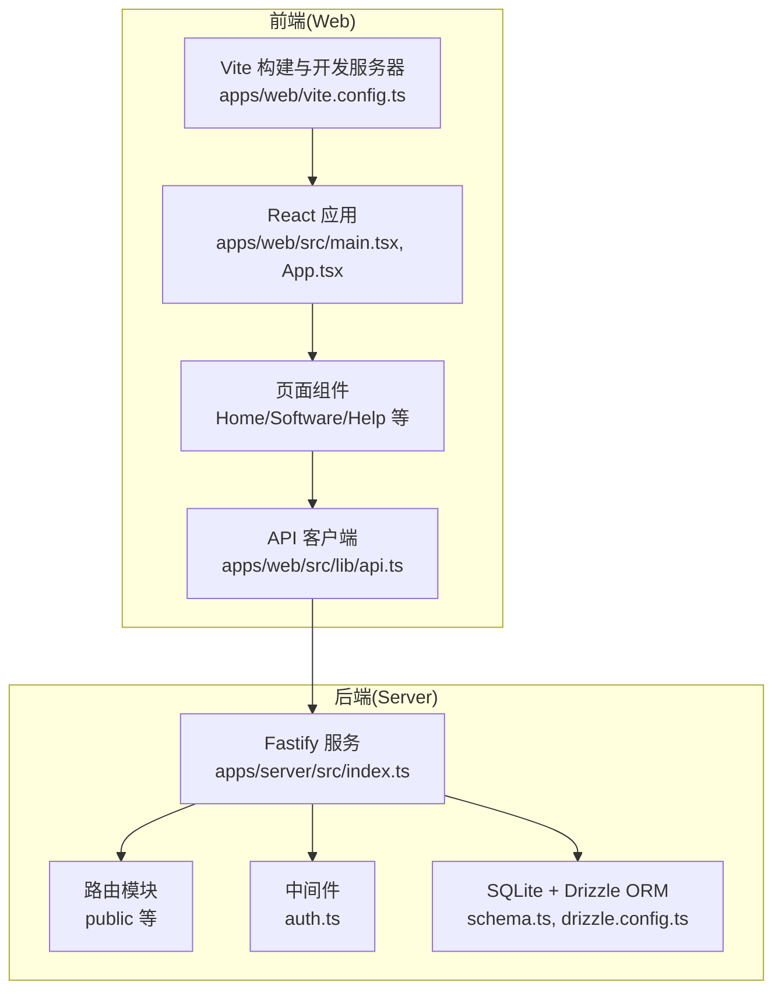
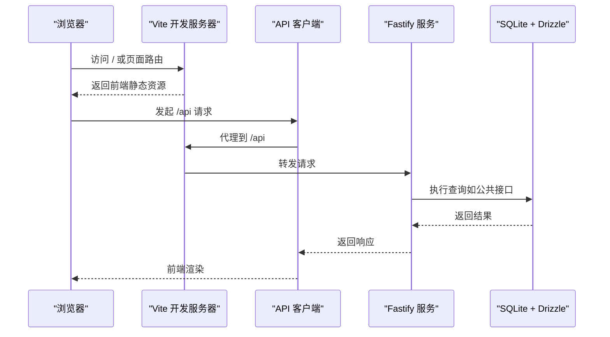
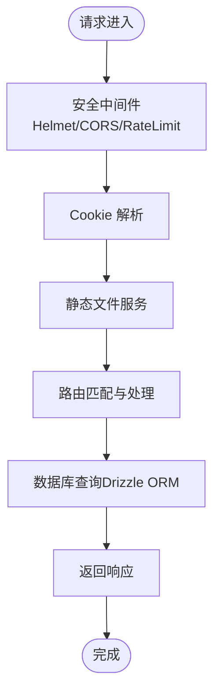
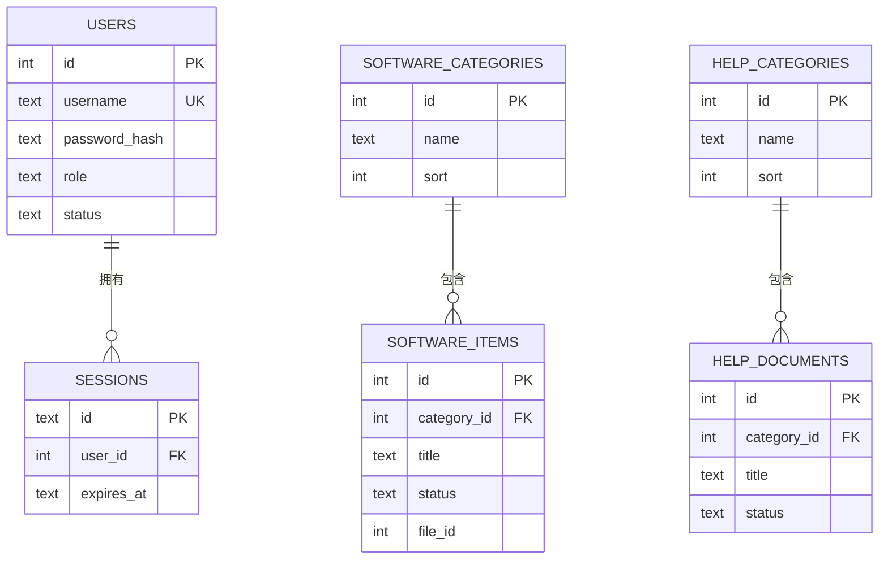
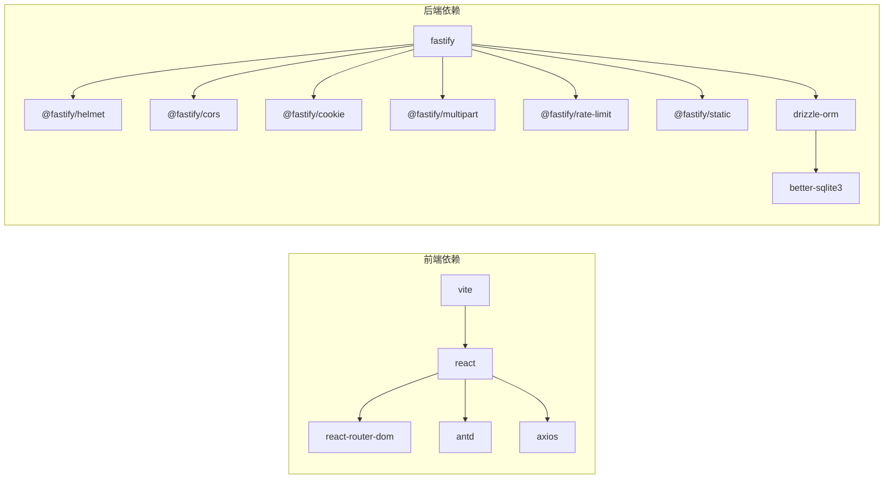

# 性能优化指南

<cite>
**本文引用的文件**
- [apps/web/vite.config.ts](file://apps/web/vite.config.ts)
- [apps/server/package.json](file://apps/server/package.json)
- [apps/web/package.json](file://apps/web/package.json)
- [apps/server/src/index.ts](file://apps/server/src/index.ts)
- [apps/server/drizzle.config.ts](file://apps/server/drizzle.config.ts)
- [apps/server/src/db/schema.ts](file://apps/server/src/db/schema.ts)
- [apps/server/src/middleware/auth.ts](file://apps/server/src/middleware/auth.ts)
- [apps/server/src/routes/public.ts](file://apps/server/src/routes/public.ts)
- [apps/web/src/main.tsx](file://apps/web/src/main.tsx)
- [apps/web/src/App.tsx](file://apps/web/src/App.tsx)
- [apps/web/src/lib/api.ts](file://apps/web/src/lib/api.ts)
- [apps/web/src/lib/auth.tsx](file://apps/web/src/lib/auth.tsx)
- [apps/web/src/pages/Home.tsx](file://apps/web/src/pages/Home.tsx)
- [apps/web/src/pages/Software.tsx](file://apps/web/src/pages/Software.tsx)
- [apps/web/src/pages/Help.tsx](file://apps/web/src/pages/Help.tsx)
</cite>

## 目录
1. [简介](#简介)
2. [项目结构](#项目结构)
3. [核心组件](#核心组件)
4. [架构总览](#架构总览)
5. [详细组件分析](#详细组件分析)
6. [依赖关系分析](#依赖关系分析)
7. [性能注意事项](#性能注意事项)
8. [故障排查指南](#故障排查指南)
9. [结论](#结论)
10. [附录](#附录)

## 简介
本指南面向ZBH2项目的性能优化，覆盖前端与后端两大部分：前端侧重Bundle分析、代码分割、懒加载与资源压缩；后端聚焦Fastify中间件优化、数据库查询与缓存策略；同时给出内存管理、网络性能（HTTP缓存、CDN、请求合并）、数据库性能（索引、查询、连接池）以及监控与基准测试建议。

## 项目结构
- 前端应用位于 apps/web，基于Vite构建，使用React 18与Ant Design。
- 后端应用位于 apps/server，基于Fastify，Drizzle ORM + SQLite。
- 通过Vite代理将前端对 /api 的请求转发至后端服务端口。

图表来源
- [apps/web/vite.config.ts:1-13](file://apps/web/vite.config.ts#L1-L13)
- [apps/web/src/main.tsx:1-22](file://apps/web/src/main.tsx#L1-L22)
- [apps/web/src/App.tsx:1-80](file://apps/web/src/App.tsx#L1-L80)
- [apps/web/src/lib/api.ts:1-16](file://apps/web/src/lib/api.ts#L1-L16)
- [apps/server/src/index.ts:1-60](file://apps/server/src/index.ts#L1-L60)
- [apps/server/src/db/schema.ts:1-330](file://apps/server/src/db/schema.ts#L1-L330)
- [apps/server/drizzle.config.ts:1-11](file://apps/server/drizzle.config.ts#L1-L11)

章节来源
- [apps/web/vite.config.ts:1-13](file://apps/web/vite.config.ts#L1-L13)
- [apps/web/src/main.tsx:1-22](file://apps/web/src/main.tsx#L1-L22)
- [apps/web/src/App.tsx:1-80](file://apps/web/src/App.tsx#L1-L80)
- [apps/server/src/index.ts:1-60](file://apps/server/src/index.ts#L1-L60)
- [apps/server/drizzle.config.ts:1-11](file://apps/server/drizzle.config.ts#L1-L11)

## 核心组件
- 前端构建与开发服务器：Vite配置定义了开发端口与 /api 代理，便于前后联调。
- 前端应用入口与路由：React应用在入口中注册路由、主题与国际化，并通过路由组织页面。
- API客户端：统一的axios实例，设置基础URL与凭据传递，拦截器处理401等错误。
- 后端服务：Fastify注册安全、CORS、Cookie、限流、静态文件等插件，按模块注册路由。
- 数据层：Drizzle ORM + SQLite，定义多表模型与关系，支持迁移与种子数据。

章节来源
- [apps/web/vite.config.ts:1-13](file://apps/web/vite.config.ts#L1-L13)
- [apps/web/src/main.tsx:1-22](file://apps/web/src/main.tsx#L1-L22)
- [apps/web/src/App.tsx:1-80](file://apps/web/src/App.tsx#L1-L80)
- [apps/web/src/lib/api.ts:1-16](file://apps/web/src/lib/api.ts#L1-L16)
- [apps/server/src/index.ts:1-60](file://apps/server/src/index.ts#L1-L60)
- [apps/server/src/db/schema.ts:1-330](file://apps/server/src/db/schema.ts#L1-L330)

## 架构总览
前端通过Vite代理访问后端API，后端以模块化方式注册路由，认证中间件在请求前加载会话信息，公共接口返回聚合数据供首页与列表页使用。

图表来源
- [apps/web/vite.config.ts:6-12](file://apps/web/vite.config.ts#L6-L12)
- [apps/web/src/lib/api.ts:3](file://apps/web/src/lib/api.ts#L3)
- [apps/server/src/index.ts:39-49](file://apps/server/src/index.ts#L39-L49)
- [apps/server/src/routes/public.ts:1-52](file://apps/server/src/routes/public.ts#L1-L52)

## 详细组件分析

### 前端性能优化
- Bundle分析与体积控制
  - 使用Vite内置的分析工具或第三方可视化工具进行Bundle分析，识别大依赖与重复模块。
  - 针对Ant Design与图标包，采用按需引入与样式按需加载，避免整包引入。
  - 对第三方库进行Tree Shaking，确保未使用的代码不被打包。
- 代码分割与懒加载
  - 将大型页面或路由级组件进行动态导入，减少首屏加载体积。
  - 列表页与详情页可拆分，仅在进入时加载对应模块。
- 资源压缩与缓存
  - 生产构建启用Gzip/Brotli压缩，合理设置静态资源缓存策略。
  - 对图片、字体等静态资源进行压缩与格式优化。
- 网络与渲染优化
  - 合理使用Suspense与React.lazy，配合骨架屏提升感知性能。
  - 避免不必要的重渲染，使用memo、useMemo、useCallback等。

章节来源
- [apps/web/vite.config.ts:1-13](file://apps/web/vite.config.ts#L1-L13)
- [apps/web/src/App.tsx:1-80](file://apps/web/src/App.tsx#L1-L80)
- [apps/web/src/pages/Home.tsx:37-57](file://apps/web/src/pages/Home.tsx#L37-L57)
- [apps/web/src/pages/Software.tsx:27-31](file://apps/web/src/pages/Software.tsx#L27-L31)
- [apps/web/src/pages/Help.tsx:25-27](file://apps/web/src/pages/Help.tsx#L25-L27)

### 后端性能优化（Fastify）
- 中间件与安全
  - 已启用Helmet、CORS、Cookie、Multipart与限流中间件，建议根据生产环境调整限流阈值与CORS范围。
  - 静态文件服务已开启，注意上传目录权限与路径安全。
- 路由与控制器
  - 公共接口返回聚合数据，建议对热点接口增加缓存层（见“缓存策略”）。
  - 对于需要鉴权的接口，确保在中间件中尽早校验并短路返回。
- 数据库与ORM
  - 使用Drizzle ORM + SQLite，适合中小规模数据与单机部署。
  - 查询应尽量使用索引列过滤，避免全表扫描；批量操作使用事务。

图表来源
- [apps/server/src/index.ts:30-35](file://apps/server/src/index.ts#L30-L35)
- [apps/server/src/index.ts:39-49](file://apps/server/src/index.ts#L39-L49)
- [apps/server/src/middleware/auth.ts:17-40](file://apps/server/src/middleware/auth.ts#L17-L40)

章节来源
- [apps/server/src/index.ts:1-60](file://apps/server/src/index.ts#L1-L60)
- [apps/server/src/middleware/auth.ts:1-56](file://apps/server/src/middleware/auth.ts#L1-L56)

### 数据库性能优化
- 索引设计
  - 对常用过滤字段建立索引，如用户状态、会话过期时间、软件状态、文档状态等。
  - 复合索引用于常见查询组合，避免回表。
- 查询优化
  - 减少N+1查询，优先使用JOIN或批量查询。
  - 对聚合查询使用LIMIT与分页，避免一次性返回大量数据。
- 连接池与事务
  - SQLite在单机场景下并发有限，建议使用只读查询走独立连接，写操作使用事务批处理。
  - 控制查询超时与重试策略，避免阻塞。

图表来源
- [apps/server/src/db/schema.ts:1-330](file://apps/server/src/db/schema.ts#L1-L330)

章节来源
- [apps/server/src/db/schema.ts:1-330](file://apps/server/src/db/schema.ts#L1-L330)

### 缓存策略（建议）
- 应用层缓存
  - 对公共接口（如软件分类与发布项、帮助分类与发布文档）增加短期缓存，降低数据库压力。
  - 使用内存缓存（如LRU）或Redis缓存，结合ETag或Last-Modified实现条件请求。
- CDN与静态资源
  - 将静态资源与上传文件托管至CDN，设置合理的缓存头与版本化策略。
- 浏览器缓存
  - 对不常变更的资源设置长缓存，对HTML与API使用协商缓存。

章节来源
- [apps/server/src/routes/public.ts:1-52](file://apps/server/src/routes/public.ts#L1-L52)
- [apps/server/src/index.ts:35](file://apps/server/src/index.ts#L35)

### 内存管理最佳实践
- 前端
  - 及时清理事件监听、定时器与订阅，避免闭包持有导致的内存泄漏。
  - 图片与Canvas使用完成后及时释放引用。
- 后端
  - Fastify插件与全局状态尽量轻量，避免在请求上下文外持有大对象。
  - SQLite连接数与事务大小控制，防止内存累积。

章节来源
- [apps/web/src/lib/auth.tsx:20-52](file://apps/web/src/lib/auth.tsx#L20-L52)
- [apps/server/src/index.ts:27-54](file://apps/server/src/index.ts#L27-L54)

### 网络性能优化
- HTTP缓存
  - 对静态资源与API响应设置Cache-Control与ETag，减少带宽消耗。
- CDN配置
  - 将上传文件与公共资源分发至CDN，缩短边缘节点延迟。
- 请求合并
  - 首屏关键数据尽量合并为一次请求，减少往返次数（参考首页聚合请求）。

章节来源
- [apps/web/src/pages/Home.tsx:37-57](file://apps/web/src/pages/Home.tsx#L37-L57)
- [apps/server/src/index.ts:35](file://apps/server/src/index.ts#L35)

## 依赖关系分析
- 前端依赖
  - React、React Router、Ant Design、Axios等，构建工具为Vite。
- 后端依赖
  - Fastify生态插件（Helmet、CORS、Cookie、Multipart、RateLimit、Static），数据库驱动与ORM（better-sqlite3、drizzle-orm）。

图表来源
- [apps/web/package.json:11-20](file://apps/web/package.json#L11-L20)
- [apps/web/package.json:21-27](file://apps/web/package.json#L21-L27)
- [apps/server/package.json:14-27](file://apps/server/package.json#L14-L27)
- [apps/server/package.json:29-35](file://apps/server/package.json#L29-L35)

章节来源
- [apps/web/package.json:1-29](file://apps/web/package.json#L1-L29)
- [apps/server/package.json:1-37](file://apps/server/package.json#L1-L37)

## 性能注意事项
- 前端
  - 首屏加载：减少初始包体积，使用懒加载与骨架屏。
  - 渲染性能：避免深层嵌套与频繁重渲染，合理使用并发与并发限制。
- 后端
  - 并发与限流：根据硬件能力调整限流参数，避免过载。
  - 数据库：关注慢查询日志，定期分析执行计划，必要时添加索引。
- 网络
  - 代理与跨域：确保代理配置正确，避免额外跳转与CORS失败。
  - 缓存：合理设置缓存策略，平衡新鲜度与性能。

## 故障排查指南
- 常见问题定位
  - 前端：检查Vite代理是否指向正确的后端端口，确认 /api 响应状态码。
  - 后端：检查日志输出与中间件注册顺序，确认静态文件根目录存在且可读。
- 错误处理
  - 前端：统一拦截401错误并引导登录，避免静默失败。
  - 后端：对数据库异常与会话失效进行明确返回，便于前端处理。

章节来源
- [apps/web/vite.config.ts:6-12](file://apps/web/vite.config.ts#L6-L12)
- [apps/web/src/lib/api.ts:5-13](file://apps/web/src/lib/api.ts#L5-L13)
- [apps/server/src/index.ts:27-54](file://apps/server/src/index.ts#L27-L54)

## 结论
通过前端的代码分割与资源优化、后端的中间件与数据库优化、以及完善的缓存与网络策略，ZBH2可在中小规模场景下获得稳定且良好的性能表现。建议在上线前完成基准测试与容量评估，并持续监控关键指标以指导迭代优化。

## 附录
- 监控指标建议
  - 前端：首屏渲染时间、TTFB、资源体积、错误率、交互延迟。
  - 后端：请求QPS、P95/P99延迟、数据库查询耗时、连接数、GC频率。
- 基准测试方法
  - 使用压测工具对关键接口进行并发与容量测试，记录吞吐与延迟曲线，识别瓶颈点。