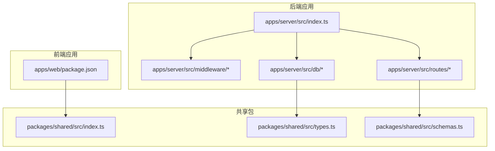
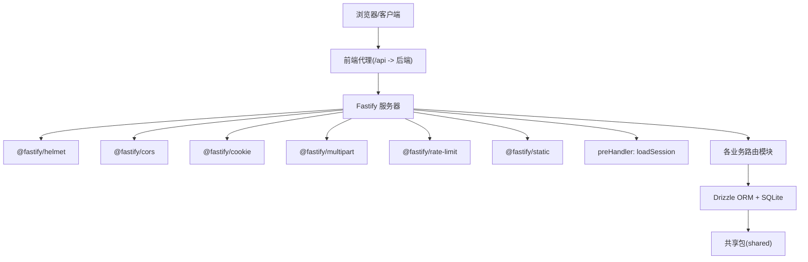
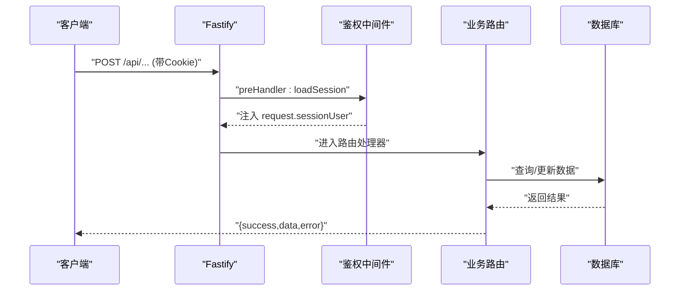
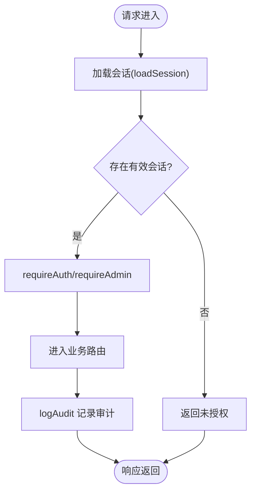
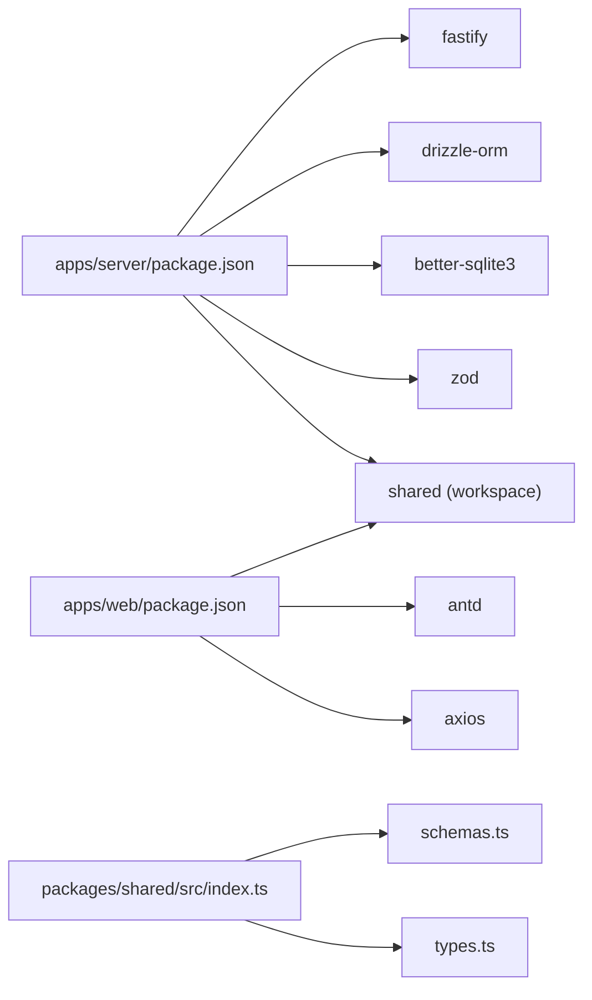

# 扩展开发与集成

<cite>
**本文引用的文件**
- [README.md](file://README.md)
- [package.json](file://package.json)
- [pnpm-workspace.yaml](file://pnpm-workspace.yaml)
- [apps/server/src/index.ts](file://apps/server/src/index.ts)
- [apps/server/src/middleware/auth.ts](file://apps/server/src/middleware/auth.ts)
- [apps/server/src/middleware/audit.ts](file://apps/server/src/middleware/audit.ts)
- [apps/server/src/routes/auth.ts](file://apps/server/src/routes/auth.ts)
- [apps/server/src/routes/activation.ts](file://apps/server/src/routes/activation.ts)
- [apps/server/src/routes/admin.ts](file://apps/server/src/routes/admin.ts)
- [apps/server/src/db/index.ts](file://apps/server/src/db/index.ts)
- [apps/server/src/db/schema.ts](file://apps/server/src/db/schema.ts)
- [apps/server/package.json](file://apps/server/package.json)
- [apps/web/package.json](file://apps/web/package.json)
- [packages/shared/src/index.ts](file://packages/shared/src/index.ts)
- [packages/shared/src/types.ts](file://packages/shared/src/types.ts)
- [packages/shared/src/schemas.ts](file://packages/shared/src/schemas.ts)
</cite>

## 目录
1. [简介](#简介)
2. [项目结构](#项目结构)
3. [核心组件](#核心组件)
4. [架构总览](#架构总览)
5. [详细组件分析](#详细组件分析)
6. [依赖关系分析](#依赖关系分析)
7. [性能考量](#性能考量)
8. [故障排查指南](#故障排查指南)
9. [结论](#结论)
10. [附录](#附录)

## 简介
本文件面向扩展开发者，系统性说明如何在ZBH2项目中添加新功能模块（路由扩展、组件开发、API接口实现）、集成第三方服务（支付网关、监控服务、云存储）、开发插件系统（中间件扩展、钩子系统、事件处理）、维护共享包（类型定义更新、Schema扩展、通用组件开发）、扩展配置系统（环境变量管理、动态配置支持），并给出向后兼容性与版本升级策略建议。

## 项目结构
ZBH2采用monorepo结构，分为后端应用、前端应用与共享包三部分：
- apps/server：Fastify后端API，包含中间件、路由、数据库访问与Drizzle ORM。
- apps/web：React前端，使用Ant Design与Vite构建。
- packages/shared：前后端共享的Zod Schema与类型定义。

**图表来源**
- [apps/server/src/index.ts:1-60](file://apps/server/src/index.ts#L1-L60)
- [apps/server/src/middleware/auth.ts:1-56](file://apps/server/src/middleware/auth.ts#L1-L56)
- [apps/server/src/routes/auth.ts:1-51](file://apps/server/src/routes/auth.ts#L1-L51)
- [apps/server/src/db/schema.ts:1-330](file://apps/server/src/db/schema.ts#L1-L330)
- [apps/web/package.json:1-29](file://apps/web/package.json#L1-L29)
- [packages/shared/src/index.ts:1-3](file://packages/shared/src/index.ts#L1-L3)

**章节来源**
- [README.md:47-68](file://README.md#L47-L68)
- [pnpm-workspace.yaml:1-5](file://pnpm-workspace.yaml#L1-L5)
- [package.json:1-20](file://package.json#L1-L20)

## 核心组件
- 应用入口与中间件注册：后端通过入口文件注册安全、跨域、静态资源、限流等插件，并挂载鉴权中间件与各路由模块。
- 鉴权中间件：加载会话、校验用户状态，提供requireAuth与requireAdmin守卫。
- 审计日志中间件：统一记录操作行为，便于合规与追踪。
- 数据库与Schema：基于Drizzle ORM与SQLite，集中定义实体关系与枚举字段。
- 共享包：统一暴露Zod Schema与类型，确保前后端一致的数据契约。

**章节来源**
- [apps/server/src/index.ts:1-60](file://apps/server/src/index.ts#L1-L60)
- [apps/server/src/middleware/auth.ts:1-56](file://apps/server/src/middleware/auth.ts#L1-L56)
- [apps/server/src/middleware/audit.ts:1-28](file://apps/server/src/middleware/audit.ts#L1-L28)
- [apps/server/src/db/schema.ts:1-330](file://apps/server/src/db/schema.ts#L1-L330)
- [packages/shared/src/index.ts:1-3](file://packages/shared/src/index.ts#L1-L3)

## 架构总览
后端以Fastify为核心，通过中间件链路完成安全与会话加载，再分发到各业务路由；前端通过Axios调用后端API，页面组件通过共享包的Schema进行数据校验与类型约束。

**图表来源**
- [apps/server/src/index.ts:1-60](file://apps/server/src/index.ts#L1-L60)
- [apps/server/src/middleware/auth.ts:17-40](file://apps/server/src/middleware/auth.ts#L17-L40)
- [apps/server/src/db/index.ts:1-16](file://apps/server/src/db/index.ts#L1-L16)
- [apps/server/src/db/schema.ts:1-330](file://apps/server/src/db/schema.ts#L1-L330)
- [packages/shared/src/index.ts:1-3](file://packages/shared/src/index.ts#L1-L3)

## 详细组件分析

### 路由扩展指南
- 新增路由模块步骤
  1) 在后端路由目录新增模块文件，导出函数式注册器，内部使用app.post/get/put/delete等注册端点。
  2) 在应用入口中引入该模块并注册。
  3) 如需鉴权，使用requireAuth或requireAdmin作为preHandler。
  4) 使用共享包中的Schema进行请求体校验，响应统一为{ success, data?, error? }。
- 示例参考
  - 鉴权路由：[apps/server/src/routes/auth.ts:1-51](file://apps/server/src/routes/auth.ts#L1-L51)
  - 管理后台路由：[apps/server/src/routes/admin.ts:1-279](file://apps/server/src/routes/admin.ts#L1-L279)
  - 激活码路由：[apps/server/src/routes/activation.ts:1-95](file://apps/server/src/routes/activation.ts#L1-L95)

**图表来源**
- [apps/server/src/index.ts:37-49](file://apps/server/src/index.ts#L37-L49)
- [apps/server/src/middleware/auth.ts:17-56](file://apps/server/src/middleware/auth.ts#L17-L56)
- [apps/server/src/routes/auth.ts:8-50](file://apps/server/src/routes/auth.ts#L8-L50)

**章节来源**
- [apps/server/src/routes/auth.ts:1-51](file://apps/server/src/routes/auth.ts#L1-L51)
- [apps/server/src/routes/admin.ts:1-279](file://apps/server/src/routes/admin.ts#L1-L279)
- [apps/server/src/routes/activation.ts:1-95](file://apps/server/src/routes/activation.ts#L1-L95)

### 组件开发与API接口实现
- 前端组件开发
  - 页面组件位于apps/web/src/pages，布局位于layouts，通用组件位于components。
  - API客户端封装于lib/api.ts，认证上下文封装于lib/auth.tsx。
  - 使用共享包的Schema进行表单校验与类型约束。
- API接口实现
  - 后端路由统一返回{ success, data?, error? }，前端据此处理UI反馈。
  - 对外暴露REST风格端点，遵循HTTP动词与状态码约定。

**章节来源**
- [apps/web/package.json:11-20](file://apps/web/package.json#L11-L20)
- [packages/shared/src/schemas.ts:1-51](file://packages/shared/src/schemas.ts#L1-L51)

### 第三方服务集成

#### 支付网关集成
- 推荐流程
  1) 在共享包新增支付相关Schema与类型，确保前后端一致。
  2) 在后端新增支付路由模块，接入第三方SDK，完成下单、回调通知、对账。
  3) 在前端页面发起支付请求，监听回调并提示结果。
- 注意事项
  - 回调签名验证与幂等处理。
  - 审计日志记录关键动作与失败原因。

#### 监控服务集成
- 当前已有运维监控模块（监控目标、指标、阈值、告警、报表、平台），可作为扩展基线。
- 扩展建议
  - 新增监控平台类型（如Webhook/API/Agent），完善同步配置与状态。
  - 引入外部监控SDK，将采集数据写入monitorRecords与触发monitorAlerts。
- 参考
  - 监控相关Schema与实体：[apps/server/src/db/schema.ts:216-329](file://apps/server/src/db/schema.ts#L216-L329)

#### 云存储集成
- 存储策略
  - 使用files表记录文件元信息，上传目录位于data/uploads，静态资源通过@fastify/static暴露。
- 扩展步骤
  1) 在共享包新增文件上传相关Schema与类型。
  2) 在后端路由中接入云存储SDK，完成上传、签名URL生成、删除。
  3) 前端上传组件调用后端接口，回显文件列表与下载链接。

**章节来源**
- [apps/server/src/index.ts:24-35](file://apps/server/src/index.ts#L24-L35)
- [apps/server/src/db/schema.ts:26-35](file://apps/server/src/db/schema.ts#L26-L35)

### 插件系统开发指南

#### 中间件扩展
- 会话加载与鉴权
  - 通过loadSession中间件从数据库加载会话并注入到请求对象。
  - requireAuth与requireAdmin提供基础权限控制。
- 审计日志
  - 通过logAudit统一记录用户行为，支持成功/失败标记与详情JSON序列化。

**图表来源**
- [apps/server/src/middleware/auth.ts:17-56](file://apps/server/src/middleware/auth.ts#L17-L56)
- [apps/server/src/middleware/audit.ts:3-27](file://apps/server/src/middleware/audit.ts#L3-L27)

**章节来源**
- [apps/server/src/middleware/auth.ts:1-56](file://apps/server/src/middleware/auth.ts#L1-L56)
- [apps/server/src/middleware/audit.ts:1-28](file://apps/server/src/middleware/audit.ts#L1-L28)

#### 钩子系统与事件处理
- 建议模式
  - 在共享包定义事件类型与负载结构，后端在关键节点触发事件（如用户创建、激活码发放、文件上传）。
  - 前端订阅事件（通过WebSocket或轮询），实现实时通知。
- 实施要点
  - 事件命名规范、幂等性、失败重试与死信队列。

### 共享包开发

#### 类型定义更新
- 更新packages/shared/src/types.ts，新增或调整枚举与通用接口。
- 保持与数据库Schema中的枚举值一致，避免运行期不匹配。

**章节来源**
- [packages/shared/src/types.ts:1-18](file://packages/shared/src/types.ts#L1-L18)
- [apps/server/src/db/schema.ts:3-10](file://apps/server/src/db/schema.ts#L3-L10)

#### Schema扩展
- 在packages/shared/src/schemas.ts中新增Zod Schema，用于请求参数与响应数据的运行时校验。
- 路由层使用safeParse进行校验，失败时返回标准化错误。

**章节来源**
- [packages/shared/src/schemas.ts:1-51](file://packages/shared/src/schemas.ts#L1-L51)
- [apps/server/src/routes/admin.ts:6-13](file://apps/server/src/routes/admin.ts#L6-L13)

#### 通用组件开发
- 前端通用组件建议放置于apps/web/src/components，复用共享包的Schema与类型，提升一致性与可维护性。

**章节来源**
- [apps/web/package.json:11-20](file://apps/web/package.json#L11-L20)
- [packages/shared/src/index.ts:1-3](file://packages/shared/src/index.ts#L1-L3)

### 配置系统扩展与环境变量管理

#### 环境变量
- 默认端口与数据库路径
  - PORT：后端监听端口，默认7500。
  - DATABASE_URL：SQLite文件路径，默认指向data/app.sqlite。
- 建议新增
  - 文件上传大小限制、CORS白名单、第三方服务密钥等。

**章节来源**
- [README.md:97-103](file://README.md#L97-L103)
- [apps/server/src/index.ts:51-53](file://apps/server/src/index.ts#L51-L53)
- [apps/server/src/db/index.ts:7-8](file://apps/server/src/db/index.ts#L7-L8)

#### 动态配置支持
- 建议在数据库中新增配置表，后端启动时加载，运行时可通过管理端更新。
- 前端读取配置并渲染相应UI开关或文案。

### 向后兼容性与版本升级策略
- 版本语义化
  - 主版本号：破坏性变更；次版本号：新增功能且兼容；修订版本号：修复且兼容。
- 升级策略
  - Schema变更：使用Drizzle迁移脚本，保持历史数据兼容。
  - 类型变更：先在共享包添加兼容字段，逐步替换旧字段。
  - 路由变更：保留旧端点一段时间并标注废弃，引导客户端迁移。
- 发布流程
  - 通过CI自动构建与测试，确保前后端与共享包版本一致。

**章节来源**
- [README.md:40-46](file://README.md#L40-L46)
- [apps/server/package.json:14-27](file://apps/server/package.json#L14-L27)
- [apps/web/package.json:11-19](file://apps/web/package.json#L11-L19)

## 依赖关系分析

**图表来源**
- [apps/server/package.json:14-27](file://apps/server/package.json#L14-L27)
- [apps/web/package.json:11-19](file://apps/web/package.json#L11-L19)
- [packages/shared/src/index.ts:1-3](file://packages/shared/src/index.ts#L1-L3)

**章节来源**
- [apps/server/package.json:1-37](file://apps/server/package.json#L1-L37)
- [apps/web/package.json:1-29](file://apps/web/package.json#L1-L29)
- [packages/shared/src/index.ts:1-3](file://packages/shared/src/index.ts#L1-L3)

## 性能考量
- 数据库优化
  - 使用WAL模式与外键约束，合理建立索引（如关联字段、时间字段）。
  - 大查询分页与条件过滤，避免全表扫描。
- 限流与安全
  - 已内置@fastify/rate-limit，可根据业务调整阈值。
  - @fastify/helmet与CORS配置需结合生产环境严格化。
- 文件上传
  - 限制文件大小与类型，使用流式处理降低内存占用。

[本节为通用指导，无需特定文件引用]

## 故障排查指南
- 常见问题定位
  - 会话无效：检查Cookie是否携带sid，会话是否过期。
  - 权限不足：确认用户角色与路由守卫。
  - 数据校验失败：核对请求体与共享Schema定义。
- 审计日志
  - 通过审计日志定位操作人、目标与结果，辅助排障。

**章节来源**
- [apps/server/src/middleware/auth.ts:17-56](file://apps/server/src/middleware/auth.ts#L17-L56)
- [apps/server/src/middleware/audit.ts:3-27](file://apps/server/src/middleware/audit.ts#L3-L27)

## 结论
通过明确的路由扩展流程、完善的中间件与审计机制、统一的共享包Schema与类型、以及可扩展的数据库Schema，ZBH2为二次开发提供了清晰的路径。集成第三方服务时，建议优先在共享包沉淀Schema与类型，再在后端路由与前端组件中复用，确保一致性与可维护性。配合CI与迁移脚本，可保障升级过程的稳定性与向后兼容。

## 附录
- 快速开始与默认账号
  - 参考README中的快速开始与默认管理员账号说明。
- OIDC扩展点
  - 参考README中的OIDC对接扩展点，可在middleware与路由中增加OIDC适配层。

**章节来源**
- [README.md:12-38](file://README.md#L12-L38)
- [README.md:113-121](file://README.md#L113-L121)