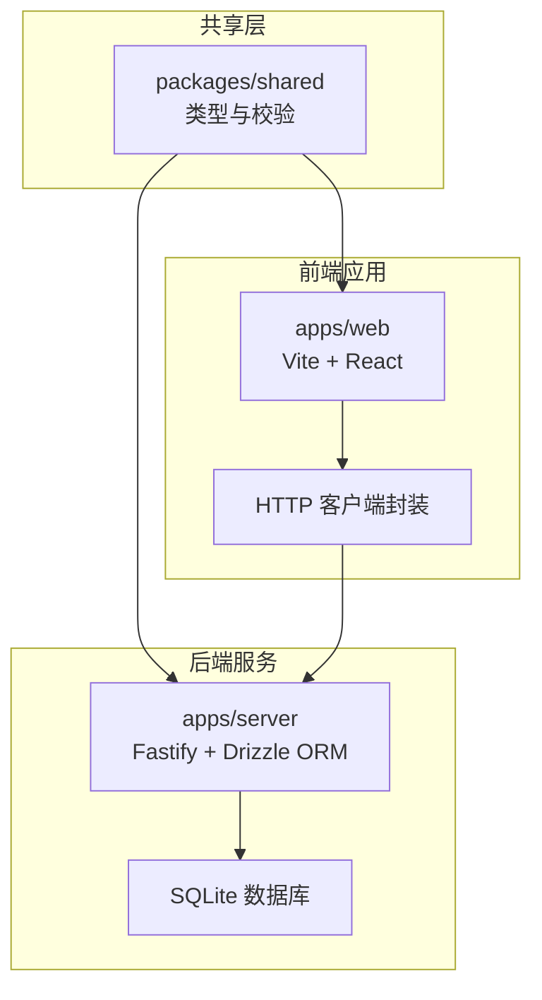
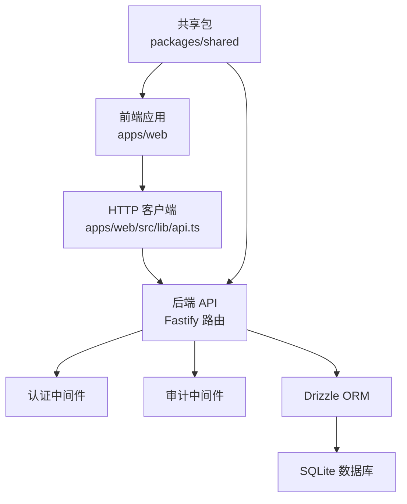
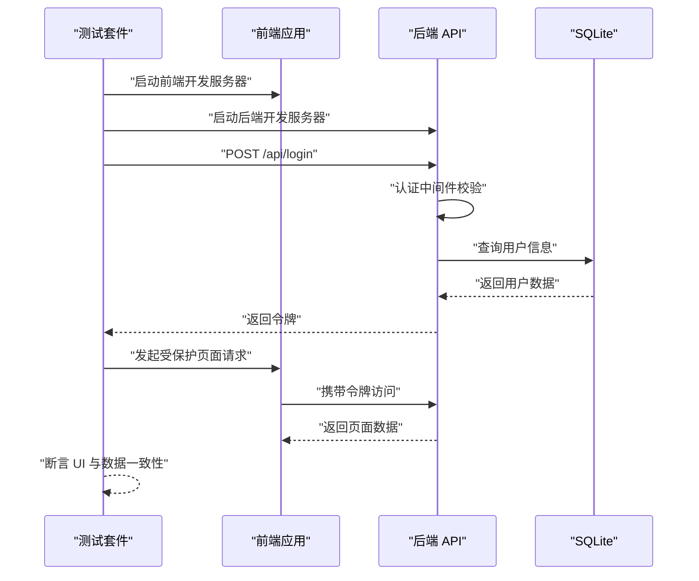
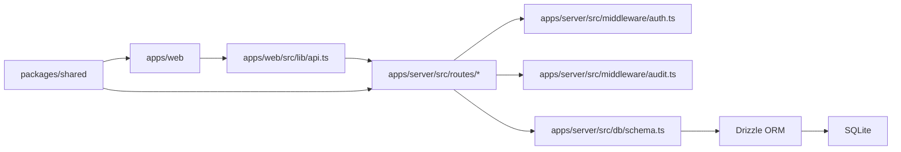

# 测试策略与实施

<cite>
**本文引用的文件**
- [package.json](file://package.json)
- [.github/workflows/build.yml](file://.github/workflows/build.yml)
- [apps/server/package.json](file://apps/server/package.json)
- [apps/server/tsconfig.json](file://apps/server/tsconfig.json)
- [apps/server/drizzle.config.ts](file://apps/server/drizzle.config.ts)
- [apps/server/src/db/schema.ts](file://apps/server/src/db/schema.ts)
- [apps/server/src/db/migrate.ts](file://apps/server/src/db/migrate.ts)
- [apps/server/src/db/seed.ts](file://apps/server/src/db/seed.ts)
- [apps/server/src/db/seed-demo.ts](file://apps/server/src/db/seed-demo.ts)
- [apps/server/src/routes/auth.ts](file://apps/server/src/routes/auth.ts)
- [apps/server/src/routes/activation.ts](file://apps/server/src/routes/activation.ts)
- [apps/server/src/routes/admin.ts](file://apps/server/src/routes/admin.ts)
- [apps/server/src/routes/tickets.ts](file://apps/server/src/routes/tickets.ts)
- [apps/server/src/middleware/auth.ts](file://apps/server/src/middleware/auth.ts)
- [apps/server/src/middleware/audit.ts](file://apps/server/src/middleware/audit.ts)
- [apps/web/package.json](file://apps/web/package.json)
- [apps/web/tsconfig.json](file://apps/web/tsconfig.json)
- [apps/web/vite.config.ts](file://apps/web/vite.config.ts)
- [apps/web/src/lib/api.ts](file://apps/web/src/lib/api.ts)
- [apps/web/src/lib/auth.tsx](file://apps/web/src/lib/auth.tsx)
- [apps/web/src/App.tsx](file://apps/web/src/App.tsx)
- [apps/web/src/pages/Login.tsx](file://apps/web/src/pages/Login.tsx)
- [apps/web/src/pages/Home.tsx](file://apps/web/src/pages/Home.tsx)
- [packages/shared/package.json](file://packages/shared/package.json)
- [packages/shared/src/schemas.ts](file://packages/shared/src/schemas.ts)
- [packages/shared/src/types.ts](file://packages/shared/src/types.ts)
</cite>

## 目录
1. [引言](#引言)
2. [项目结构](#项目结构)
3. [核心组件](#核心组件)
4. [架构总览](#架构总览)
5. [详细组件分析](#详细组件分析)
6. [依赖分析](#依赖分析)
7. [性能考虑](#性能考虑)
8. [故障排查指南](#故障排查指南)
9. [结论](#结论)
10. [附录](#附录)

## 引言
本文件为 ZBH2 项目的测试策略与实施文档，目标是建立覆盖单元测试、集成测试（含 API、数据库、端到端）、前端组件与用户交互测试、性能测试的完整测试体系，并明确测试覆盖率与质量门禁标准、测试数据管理、测试环境配置以及在持续集成中执行测试的流程。当前仓库未包含任何测试框架或测试脚本配置，因此本文件基于现有代码结构与技术栈，提出可落地的测试方案与最佳实践。

## 项目结构
ZBH2 采用 monorepo 结构，包含以下主要子项目：
- 共享包：packages/shared，提供共享类型与校验模式
- 后端服务：apps/server，基于 Fastify 的 API 服务，使用 Drizzle ORM 进行数据库建模与迁移
- 前端应用：apps/web，基于 Vite + React 的单页应用
- 工具：tools/ActivationClientWpf（非本次测试范围）

图表来源
- [apps/server/package.json:14-35](file://apps/server/package.json#L14-L35)
- [apps/web/package.json:11-27](file://apps/web/package.json#L11-L27)
- [packages/shared/package.json:17-22](file://packages/shared/package.json#L17-L22)

章节来源
- [package.json:4-11](file://package.json#L4-L11)
- [apps/server/package.json:14-35](file://apps/server/package.json#L14-L35)
- [apps/web/package.json:11-27](file://apps/web/package.json#L11-L27)
- [packages/shared/package.json:17-22](file://packages/shared/package.json#L17-L22)

## 核心组件
- 路由与业务逻辑：位于 apps/server/src/routes 下，包含认证、激活码、管理员、工单等路由模块
- 中间件：认证中间件与审计中间件用于请求拦截与日志记录
- 数据层：Drizzle ORM 配置与迁移脚本，SQLite 作为默认存储
- 前端：React 组件与页面，通过 api.ts 封装 HTTP 请求，auth.tsx 管理认证状态
- 共享层：共享类型与 Zod 校验模式，确保前后端一致的数据契约

章节来源
- [apps/server/src/routes/auth.ts](file://apps/server/src/routes/auth.ts)
- [apps/server/src/routes/activation.ts](file://apps/server/src/routes/activation.ts)
- [apps/server/src/routes/admin.ts](file://apps/server/src/routes/admin.ts)
- [apps/server/src/routes/tickets.ts](file://apps/server/src/routes/tickets.ts)
- [apps/server/src/middleware/auth.ts](file://apps/server/src/middleware/auth.ts)
- [apps/server/src/middleware/audit.ts](file://apps/server/src/middleware/audit.ts)
- [apps/server/drizzle.config.ts](file://apps/server/drizzle.config.ts)
- [apps/server/src/db/schema.ts](file://apps/server/src/db/schema.ts)
- [apps/server/src/db/migrate.ts](file://apps/server/src/db/migrate.ts)
- [apps/server/src/db/seed.ts](file://apps/server/src/db/seed.ts)
- [apps/server/src/db/seed-demo.ts](file://apps/server/src/db/seed-demo.ts)
- [apps/web/src/lib/api.ts](file://apps/web/src/lib/api.ts)
- [apps/web/src/lib/auth.tsx](file://apps/web/src/lib/auth.tsx)
- [packages/shared/src/schemas.ts](file://packages/shared/src/schemas.ts)
- [packages/shared/src/types.ts](file://packages/shared/src/types.ts)

## 架构总览
下图展示测试视角下的系统交互：前端通过 HTTP 客户端调用后端 API；后端路由处理请求，经中间件进行认证与审计；数据访问通过 Drizzle ORM 访问 SQLite；共享包提供统一的类型与校验。

图表来源
- [apps/web/src/lib/api.ts](file://apps/web/src/lib/api.ts)
- [apps/server/src/middleware/auth.ts](file://apps/server/src/middleware/auth.ts)
- [apps/server/src/middleware/audit.ts](file://apps/server/src/middleware/audit.ts)
- [apps/server/src/db/schema.ts](file://apps/server/src/db/schema.ts)
- [apps/server/drizzle.config.ts](file://apps/server/drizzle.config.ts)
- [packages/shared/src/types.ts](file://packages/shared/src/types.ts)

## 详细组件分析

### 单元测试策略
- 测试框架选择
  - 后端：建议使用 Vitest（与 Vite 生态兼容）或 Jest，结合 tsconfig 的 ESNext 模块解析以支持 bundler 模式
  - 前端：推荐 Vitest + React Testing Library，便于 DOM 与组件测试
  - 共享包：可直接使用 Vitest 或 Jest，无需 DOM 环境
- 测试文件组织
  - 后端：按功能模块分层，如 apps/server/src/routes/__tests__/auth.test.ts
  - 前端：apps/web/src/components/__tests__ 与 apps/web/src/pages/__tests__
  - 共享包：packages/shared/__tests__
- Mock 策略
  - 后端：对 Drizzle ORM 使用内存数据库（如 better-sqlite3 的内存模式）或 Mock；对外部服务（如第三方认证）使用函数级 Mock
  - 前端：对 HTTP 客户端使用 Mock Adapter；对全局状态（如认证）使用 Provider 包装
  - 共享包：对 Zod 校验与工具函数进行纯函数测试，避免外部依赖
- 复杂度与性能
  - 单元测试应保持快速与稳定，避免 IO 与网络依赖
  - 对于路由与中间件，建议使用轻量级测试服务器或 Fastify 的测试工具

章节来源
- [apps/server/tsconfig.json:2-13](file://apps/server/tsconfig.json#L2-L13)
- [apps/web/tsconfig.json:2-13](file://apps/web/tsconfig.json#L2-L13)
- [apps/server/package.json:29-35](file://apps/server/package.json#L29-L35)
- [apps/web/package.json:21-27](file://apps/web/package.json#L21-L27)

### 集成测试实施
- API 测试
  - 目标：验证路由行为、参数校验、中间件拦截、响应格式一致性
  - 方法：启动 Fastify 实例，使用 http 请求库（如 axios 或内置 http）发送请求，断言状态码与响应体
  - 关键点：对认证中间件注入模拟令牌；对审计中间件验证日志字段
- 数据库测试
  - 目标：验证迁移、种子数据、Schema 正确性与事务行为
  - 方法：在测试前执行迁移与种子，使用内存数据库或临时数据库；断言查询结果与约束
  - 关键点：drizzle.config.ts 与 migrate.ts 提供迁移入口；schema.ts 描述表结构
- 端到端测试
  - 目标：覆盖真实用户路径（如登录、查看首页）
  - 方法：启动前端与后端服务，使用浏览器自动化工具（如 Playwright/Cypress），模拟用户操作并断言 UI 与 API 行为
  - 关键点：使用独立测试数据库与静态资源目录，确保可重复性

图表来源
- [apps/server/src/middleware/auth.ts](file://apps/server/src/middleware/auth.ts)
- [apps/server/src/routes/auth.ts](file://apps/server/src/routes/auth.ts)
- [apps/web/src/lib/api.ts](file://apps/web/src/lib/api.ts)
- [apps/web/src/pages/Login.tsx](file://apps/web/src/pages/Login.tsx)
- [apps/web/src/pages/Home.tsx](file://apps/web/src/pages/Home.tsx)

章节来源
- [apps/server/src/db/migrate.ts](file://apps/server/src/db/migrate.ts)
- [apps/server/src/db/seed.ts](file://apps/server/src/db/seed.ts)
- [apps/server/src/db/seed-demo.ts](file://apps/server/src/db/seed-demo.ts)
- [apps/server/drizzle.config.ts](file://apps/server/drizzle.config.ts)
- [apps/server/src/db/schema.ts](file://apps/server/src/db/schema.ts)

### 前端测试指南
- 组件测试
  - 使用 React Testing Library 渲染组件，断言渲染内容与事件触发
  - 对需要认证状态的组件，使用 Provider 注入 mock 认证上下文
- 用户交互测试
  - 使用 Playwright 或 Cypress 录制/编写交互脚本，覆盖登录、导航、表单提交等关键路径
- 性能测试
  - 使用 Lighthouse 或 Web Vitals 工具评估首屏加载、交互延迟与稳定性
  - 在 CI 中设置阈值，失败即阻断发布

章节来源
- [apps/web/src/lib/auth.tsx](file://apps/web/src/lib/auth.tsx)
- [apps/web/src/App.tsx](file://apps/web/src/App.tsx)
- [apps/web/vite.config.ts](file://apps/web/vite.config.ts)

### 测试覆盖率与质量门禁
- 覆盖率要求（建议）
  - 共享包：语句/分支/函数/行 ≥ 90%
  - 后端：语句/分支/函数/行 ≥ 85%
  - 前端：语句/分支/函数/行 ≥ 80%
- 质量门禁
  - 代码变更必须通过单元测试与集成测试
  - 覆盖率低于阈值时，构建失败
  - E2E 测试通过后方可合并 PR

### 测试数据管理
- 开发/测试数据库：使用临时数据库或 Docker 容器，确保隔离与可重置
- 种子数据：通过 seed.ts 与 seed-demo.ts 提供最小可用数据集，便于快速初始化
- 数据清理：每个测试用例结束后回滚或删除相关记录，避免副作用

章节来源
- [apps/server/src/db/seed.ts](file://apps/server/src/db/seed.ts)
- [apps/server/src/db/seed-demo.ts](file://apps/server/src/db/seed-demo.ts)

### 测试环境配置
- 环境变量
  - NODE_ENV=testing
  - DATABASE_URL 指向测试数据库
  - JWT_SECRET 与认证相关密钥使用测试专用值
- 构建与运行
  - 前端：Vite 测试配置启用 DOM 环境与 React 支持
  - 后端：Vitest/Jest 配置启用 TypeScript 与 ESNext 模块解析

章节来源
- [apps/web/tsconfig.json:2-13](file://apps/web/tsconfig.json#L2-L13)
- [apps/server/tsconfig.json:2-13](file://apps/server/tsconfig.json#L2-L13)

### 持续集成中的测试执行
- 当前工作流
  - .github/workflows/build.yml 仅执行构建与制品上传，未包含测试步骤
- 建议扩展
  - 在构建步骤之后增加测试步骤：安装依赖 → 运行测试 → 生成覆盖率报告 → 上传测试结果
  - 对前端与后端分别执行测试，共享包在构建阶段完成验证
  - 将覆盖率阈值纳入质量门禁，失败则阻止后续部署

章节来源
- [.github/workflows/build.yml:14-52](file://.github/workflows/build.yml#L14-L52)

### 测试自动化与回归测试
- 自动化
  - 将测试脚本加入 pnpm scripts，例如在 apps/server 与 apps/web 中添加 test 脚本
  - 在 CI 中自动触发测试，确保每次 PR 与主分支推送均执行
- 回归测试
  - 对关键路由（如 /auth/login、/admin/*、/tickets/*）建立回归用例
  - 对共享类型与校验逻辑进行回归，防止契约变更导致的不兼容

章节来源
- [apps/server/package.json:6-12](file://apps/server/package.json#L6-L12)
- [apps/web/package.json:6-10](file://apps/web/package.json#L6-L10)
- [packages/shared/src/schemas.ts](file://packages/shared/src/schemas.ts)
- [packages/shared/src/types.ts](file://packages/shared/src/types.ts)

## 依赖分析
- 组件耦合
  - 前端通过 api.ts 与后端路由解耦；共享包提供契约定义，降低前后端耦合
  - 中间件与路由存在强耦合（认证与审计），需在测试中分别验证
- 外部依赖
  - 后端：Fastify、Drizzle ORM、better-sqlite3、argon2
  - 前端：React、Ant Design、Axios、React Router
- 循环依赖
  - 当前结构未见循环依赖迹象；建议在新增模块时保持单向依赖

图表来源
- [apps/web/src/lib/api.ts](file://apps/web/src/lib/api.ts)
- [apps/server/src/routes/auth.ts](file://apps/server/src/routes/auth.ts)
- [apps/server/src/middleware/auth.ts](file://apps/server/src/middleware/auth.ts)
- [apps/server/src/middleware/audit.ts](file://apps/server/src/middleware/audit.ts)
- [apps/server/src/db/schema.ts](file://apps/server/src/db/schema.ts)
- [packages/shared/src/types.ts](file://packages/shared/src/types.ts)

章节来源
- [apps/server/package.json:14-35](file://apps/server/package.json#L14-L35)
- [apps/web/package.json:11-27](file://apps/web/package.json#L11-L27)
- [packages/shared/package.json:17-22](file://packages/shared/package.json#L17-L22)

## 性能考虑
- 测试执行速度
  - 优先使用内存数据库与 Mock，减少 IO 与网络延迟
  - 并行执行无状态测试，串行执行依赖数据库或外部服务的测试
- 覆盖率收集
  - 在 CI 中开启覆盖率收集，避免过度采样导致的性能下降
- 前端性能
  - 在 E2E 中集成性能指标采集，识别慢路由与大组件

## 故障排查指南
- 测试无法启动
  - 检查 tsconfig 的 moduleResolution 与 bundler 设置是否匹配测试框架
  - 确认环境变量（DATABASE_URL、JWT_SECRET）正确
- 数据库相关错误
  - 确保迁移脚本在测试前执行；检查 schema 是否与迁移一致
- 前端测试失败
  - 检查 React 版本与测试库版本兼容性；确认 DOM 环境已启用
- CI 失败
  - 查看测试输出与覆盖率报告；根据阈值调整测试用例或放宽阈值

章节来源
- [apps/server/tsconfig.json:2-13](file://apps/server/tsconfig.json#L2-L13)
- [apps/web/tsconfig.json:2-13](file://apps/web/tsconfig.json#L2-L13)
- [.github/workflows/build.yml:33-37](file://.github/workflows/build.yml#L33-L37)

## 结论
本文件为 ZBH2 项目提供了从单元测试到端到端测试的完整策略与实施建议。当前仓库尚未包含测试配置，建议尽快引入 Vitest/Jest、Playwright/Cypress 与覆盖率工具，并在 CI 中增加测试步骤与质量门禁，以保障代码质量与交付稳定性。

## 附录
- 快速落地清单
  - 在 apps/server 与 apps/web 添加 test 脚本与测试配置
  - 编写共享包的类型与校验测试
  - 为关键路由与中间件编写集成测试
  - 为前端页面与组件编写单元与交互测试
  - 在 CI 中增加测试与覆盖率步骤
  - 设定覆盖率阈值并纳入质量门禁