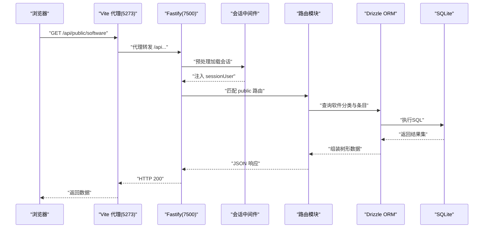
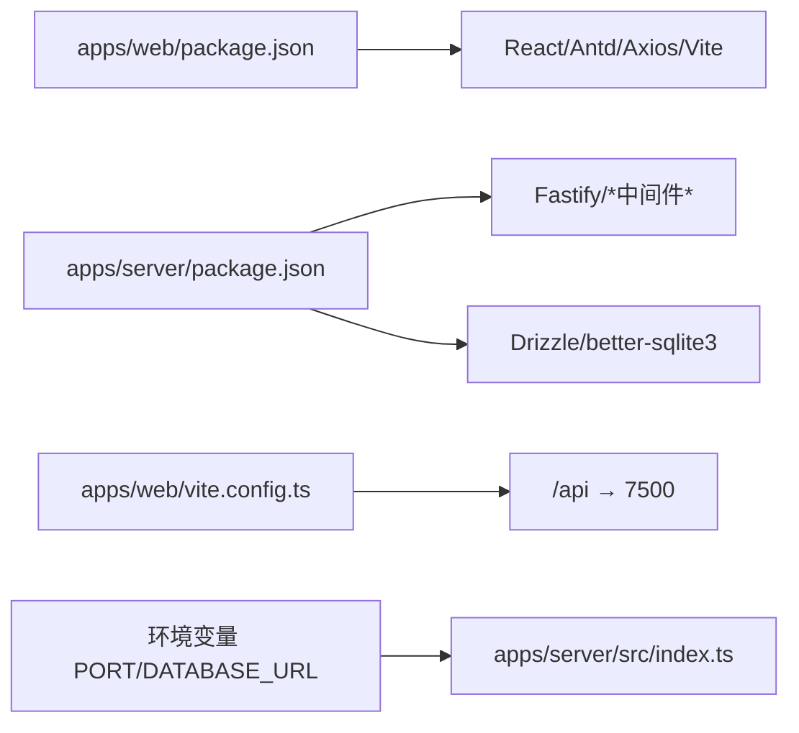

# 调试技巧与开发工具

<cite>
**本文引用的文件**
- [README.md](file://README.md)
- [package.json](file://package.json)
- [apps/server/package.json](file://apps/server/package.json)
- [apps/web/package.json](file://apps/web/package.json)
- [apps/web/vite.config.ts](file://apps/web/vite.config.ts)
- [apps/server/src/index.ts](file://apps/server/src/index.ts)
- [apps/server/drizzle.config.ts](file://apps/server/drizzle.config.ts)
- [apps/server/src/db/schema.ts](file://apps/server/src/db/schema.ts)
- [apps/server/src/db/migrate.ts](file://apps/server/src/db/migrate.ts)
- [apps/server/src/middleware/auth.ts](file://apps/server/src/middleware/auth.ts)
- [apps/server/src/middleware/audit.ts](file://apps/server/src/middleware/audit.ts)
- [apps/server/src/routes/public.ts](file://apps/server/src/routes/public.ts)
- [apps/web/src/lib/api.ts](file://apps/web/src/lib/api.ts)
- [apps/web/src/App.tsx](file://apps/web/src/App.tsx)
- [apps/web/src/main.tsx](file://apps/web/src/main.tsx)
</cite>

## 目录
1. [简介](#简介)
2. [项目结构](#项目结构)
3. [核心组件](#核心组件)
4. [架构总览](#架构总览)
5. [详细组件分析](#详细组件分析)
6. [依赖关系分析](#依赖关系分析)
7. [性能考量](#性能考量)
8. [故障排查指南](#故障排查指南)
9. [结论](#结论)
10. [附录](#附录)

## 简介
本文件面向ZBH2项目的开发者与运维人员，提供从浏览器到后端、从数据库到监控的全链路调试与开发工具实践指南。内容覆盖：
- 前端调试：浏览器开发者工具、React DevTools、网络请求与代理调试
- 后端调试：Node.js调试器、日志配置、性能分析
- 数据库调试：SQL迁移与模式、慢查询与一致性检查
- 开发工具：IDE与插件、命令行工具、脚本与工作流
- 远程调试与生产问题排查：日志聚合、可观测性与性能瓶颈定位
- 监控与可观测性：审计日志、静态资源托管、速率限制与安全头

## 项目结构
ZBH2采用monorepo结构，前后端分离，后端基于Fastify + Drizzle ORM + SQLite，前端基于React + Vite，通过Vite代理将/api前缀转发至后端。

```mermaid
graph TB
subgraph "前端(Web)"
Vite["Vite 开发服务器<br/>端口 5273"]
React["React 应用<br/>Axios 客户端"]
end
subgraph "后端(Server)"
Fastify["Fastify 服务<br/>日志开启"]
Drizzle["Drizzle ORM"]
SQLite["SQLite 数据库<br/>better-sqlite3"]
end
subgraph "数据库"
Migrations["迁移脚本<br/>drizzle"]
Schema["Schema 定义"]
end
Vite --> |"代理 /api →"| Fastify
React --> |"HTTP 请求 baseURL=/api"| Vite
Fastify --> Drizzle --> SQLite
Drizzle <- --> Migrations
Drizzle <- --> Schema
```

图表来源
- [apps/web/vite.config.ts:1-13](file://apps/web/vite.config.ts#L1-L13)
- [apps/server/src/index.ts:1-60](file://apps/server/src/index.ts#L1-L60)
- [apps/server/src/db/schema.ts:1-330](file://apps/server/src/db/schema.ts#L1-L330)
- [apps/server/drizzle.config.ts:1-11](file://apps/server/drizzle.config.ts#L1-L11)

章节来源
- [README.md:47-68](file://README.md#L47-L68)
- [apps/web/vite.config.ts:1-13](file://apps/web/vite.config.ts#L1-L13)
- [apps/server/src/index.ts:1-60](file://apps/server/src/index.ts#L1-L60)

## 核心组件
- 前端开发服务器与代理：Vite开发服务器监听5273端口，并将/api前缀请求转发至后端7500端口，便于前后端联调。
- 后端服务：Fastify注册安全头、CORS、Cookie、多部分上传、速率限制与静态文件托管；统一注入会话中间件；按模块注册路由。
- 数据库：Drizzle配置指向SQLite文件，迁移脚本应用迁移，Schema集中定义所有实体。
- 前端API客户端：Axios实例以withCredentials方式访问，统一拦截器处理401等响应。
- 认证与审计：会话加载中间件负责校验sid与过期时间，审计中间件记录操作日志。

章节来源
- [apps/web/vite.config.ts:1-13](file://apps/web/vite.config.ts#L1-L13)
- [apps/server/src/index.ts:1-60](file://apps/server/src/index.ts#L1-L60)
- [apps/server/src/db/migrate.ts:1-18](file://apps/server/src/db/migrate.ts#L1-L18)
- [apps/server/src/db/schema.ts:1-330](file://apps/server/src/db/schema.ts#L1-L330)
- [apps/web/src/lib/api.ts:1-16](file://apps/web/src/lib/api.ts#L1-L16)
- [apps/server/src/middleware/auth.ts:1-56](file://apps/server/src/middleware/auth.ts#L1-L56)
- [apps/server/src/middleware/audit.ts:1-28](file://apps/server/src/middleware/audit.ts#L1-L28)

## 架构总览
下图展示了从浏览器到后端再到数据库的完整链路，以及关键中间件与模块的交互。



图表来源
- [apps/web/vite.config.ts:6-12](file://apps/web/vite.config.ts#L6-L12)
- [apps/server/src/index.ts:27-54](file://apps/server/src/index.ts#L27-L54)
- [apps/server/src/middleware/auth.ts:17-40](file://apps/server/src/middleware/auth.ts#L17-L40)
- [apps/server/src/routes/public.ts:5-52](file://apps/server/src/routes/public.ts#L5-L52)
- [apps/server/src/db/schema.ts:1-330](file://apps/server/src/db/schema.ts#L1-L330)

## 详细组件分析

### 前端调试：浏览器与React DevTools
- 浏览器开发者工具
  - 网络面板：观察/api前缀请求是否被正确代理、响应状态码、Headers与Body；关注CORS与Cookie是否携带。
  - 应用面板：查看Storage中的sid Cookie是否随请求发送；检查静态资源加载情况。
  - 性能面板：录制交互，定位重渲染热点、长任务与内存增长。
- React DevTools
  - 使用StrictMode与Profiler定位不必要的重渲染；结合React DevTools Profiler识别耗时组件。
  - 在主入口中确认ConfigProvider与AuthProvider包裹顺序，避免上下文丢失导致的重复渲染。
- Axios客户端与路由
  - baseURL=/api与withCredentials确保跨域场景下的会话保持；响应拦截器可用于统一错误处理与登录态失效跳转。

章节来源
- [apps/web/src/lib/api.ts:1-16](file://apps/web/src/lib/api.ts#L1-L16)
- [apps/web/src/main.tsx:1-22](file://apps/web/src/main.tsx#L1-L22)
- [apps/web/src/App.tsx:1-80](file://apps/web/src/App.tsx#L1-L80)

### 后端调试：Node.js调试器、日志与性能
- 启动与热重载
  - 后端使用tsx watch进行开发，支持断点调试；建议在IDE中配置Node调试任务，附加到tsx进程。
- 日志与中间件
  - Fastify构造函数开启logger，便于查看请求生命周期；CORS、Helmet、Cookie、Multipart、RateLimit等中间件均注册，有助于定位跨域、安全头、限流等问题。
  - 会话中间件loadSession从Cookie读取sid并校验过期与用户状态，失败时无注入sessionUser，后续路由可据此判断鉴权。
- 路由与审计
  - 公共路由示例用于验证数据库查询与序列化逻辑；审计中间件logAudit可记录关键操作，便于回溯。
- 静态资源与上传
  - fastify-static托管上传目录，便于直接访问文件；注意生产环境的安全暴露策略。

章节来源
- [apps/server/src/index.ts:1-60](file://apps/server/src/index.ts#L1-L60)
- [apps/server/src/middleware/auth.ts:17-40](file://apps/server/src/middleware/auth.ts#L17-L40)
- [apps/server/src/middleware/audit.ts:1-28](file://apps/server/src/middleware/audit.ts#L1-L28)
- [apps/server/src/routes/public.ts:5-52](file://apps/server/src/routes/public.ts#L5-L52)

### 数据库调试：迁移、模式与一致性
- 迁移与初始化
  - 迁移脚本设置WAL与外键约束，应用drizzle迁移目录中的SQL；首次运行需执行数据库初始化脚本。
- Schema与实体
  - Schema集中定义了用户、会话、软件、帮助、激活、工单、资产、SaaS、监控、审计等实体及关系；便于理解数据模型与关联查询。
- 一致性检查
  - 利用Schema与ORM查询验证外键约束、唯一索引与枚举字段；对关键业务流程（如激活码发放、工单流转）进行事务性测试。
- 慢查询与优化
  - 结合数据库PRAGMA与EXPLAIN QUERY PLAN分析复杂查询；为高频查询建立必要索引（如枚举字段、时间戳、关联键）。

章节来源
- [apps/server/src/db/migrate.ts:1-18](file://apps/server/src/db/migrate.ts#L1-L18)
- [apps/server/drizzle.config.ts:1-11](file://apps/server/drizzle.config.ts#L1-L11)
- [apps/server/src/db/schema.ts:1-330](file://apps/server/src/db/schema.ts#L1-L330)

### 开发工具推荐
- IDE与插件
  - VS Code：ESLint、Prettier、TypeScript TSServer、Tailwind/UnoCSS、REST Client。
  - React DevTools：检查组件树、Props/State、Profiler。
- 命令行工具
  - pnpm：统一管理monorepo；使用脚本别名快速启动前后端与数据库任务。
  - sqlite3：直接连接SQLite文件进行查询与分析。
- 脚本与工作流
  - 通过根脚本一键启动dev，或分别进入apps/server与apps/web目录执行各自dev脚本。

章节来源
- [package.json:1-20](file://package.json#L1-L20)
- [apps/server/package.json:1-37](file://apps/server/package.json#L1-L37)
- [apps/web/package.json:1-29](file://apps/web/package.json#L1-L29)

### 远程调试与生产问题排查
- 远程调试
  - 后端可通过Node调试器附加到进程；生产环境建议开启更细粒度的日志与采样探针。
- 生产问题排查
  - 关注429/401/403等状态码与审计日志；结合浏览器网络面板与后端日志交叉定位。
  - 上传文件无法访问时，检查静态托管路径与权限；确认代理规则与CORS配置。
- 性能瓶颈定位
  - 前端：Profiler识别重渲染热点；网络面板观察阻塞与缓存命中。
  - 后端：CPU与堆快照定位高占用路由；Drizzle查询日志与数据库慢查询日志辅助分析。

## 依赖关系分析
- 前端依赖React、Ant Design、Axios与Vite；路由与主题在入口处统一配置。
- 后端依赖Fastify生态与Drizzle ORM；通过better-sqlite3访问SQLite。
- 代理与端口：前端Vite代理到后端7500端口；环境变量控制后端监听端口。



图表来源
- [apps/web/package.json:1-29](file://apps/web/package.json#L1-L29)
- [apps/server/package.json:1-37](file://apps/server/package.json#L1-L37)
- [apps/web/vite.config.ts:6-12](file://apps/web/vite.config.ts#L6-L12)
- [apps/server/src/index.ts:51-53](file://apps/server/src/index.ts#L51-L53)

章节来源
- [apps/web/package.json:1-29](file://apps/web/package.json#L1-L29)
- [apps/server/package.json:1-37](file://apps/server/package.json#L1-L37)
- [apps/web/vite.config.ts:1-13](file://apps/web/vite.config.ts#L1-L13)
- [apps/server/src/index.ts:51-53](file://apps/server/src/index.ts#L51-L53)

## 性能考量
- 前端
  - 合理拆分路由与懒加载；减少不必要的全局状态更新；使用React Profiler识别重渲染热点。
- 后端
  - 适度放宽上传大小限制；合理设置速率限制阈值；对高频查询使用Drizzle原生查询或索引优化。
- 数据库
  - 使用WAL模式提升并发写入；为常用过滤字段建立索引；定期分析慢查询日志并调整Schema或查询。

## 故障排查指南
- 常见问题与定位步骤
  - 无法访问后端API：检查Vite代理配置与端口；确认CORS与Cookie是否正确携带。
  - 登录后仍提示未登录：检查会话中间件是否注入sessionUser；确认sid Cookie有效且未过期。
  - 上传文件无法访问：检查静态托管路径与权限；确认上传目录存在且可读。
  - 数据库迁移失败：确认DATABASE_URL指向的SQLite文件可写；检查迁移目录与版本号。
- 日志与审计
  - 后端开启logger后，结合审计日志表定位具体操作与异常；对外部接口调用记录IP与UA便于追踪。
- 代理与端口
  - 前端默认5273，后端默认7500；如端口冲突，可在环境变量中调整。

章节来源
- [apps/web/vite.config.ts:6-12](file://apps/web/vite.config.ts#L6-L12)
- [apps/server/src/index.ts:27-54](file://apps/server/src/index.ts#L27-L54)
- [apps/server/src/middleware/auth.ts:17-40](file://apps/server/src/middleware/auth.ts#L17-L40)
- [apps/server/src/middleware/audit.ts:14-27](file://apps/server/src/middleware/audit.ts#L14-L27)
- [apps/server/src/db/migrate.ts:7-17](file://apps/server/src/db/migrate.ts#L7-L17)

## 结论
通过明确的代理规则、完善的中间件与审计机制、清晰的Monorepo结构，ZBH2提供了良好的开发与调试基础。建议在日常开发中配合React DevTools、Node调试器与SQLite分析工具，形成从前端到后端再到数据库的闭环调试能力，并在生产环境中持续完善日志与可观测性建设。

## 附录
- 快速启动与数据库初始化
  - 安装依赖后执行数据库迁移与种子脚本，再启动前后端开发服务器。
- 环境变量
  - PORT：后端监听端口；DATABASE_URL：SQLite文件路径。

章节来源
- [README.md:12-24](file://README.md#L12-L24)
- [README.md:97-103](file://README.md#L97-L103)