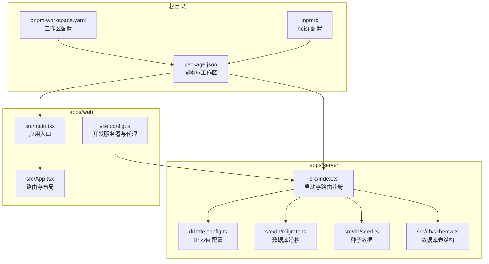
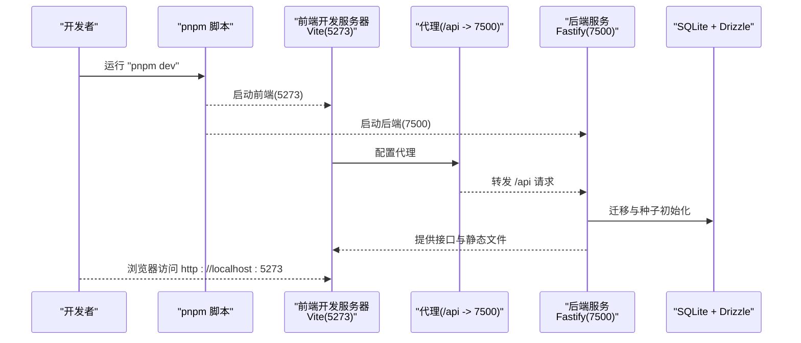
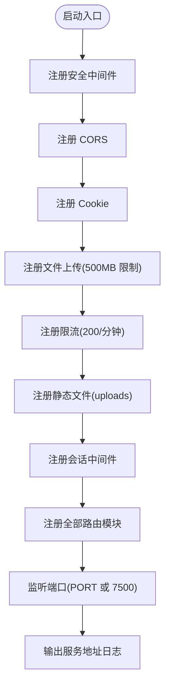
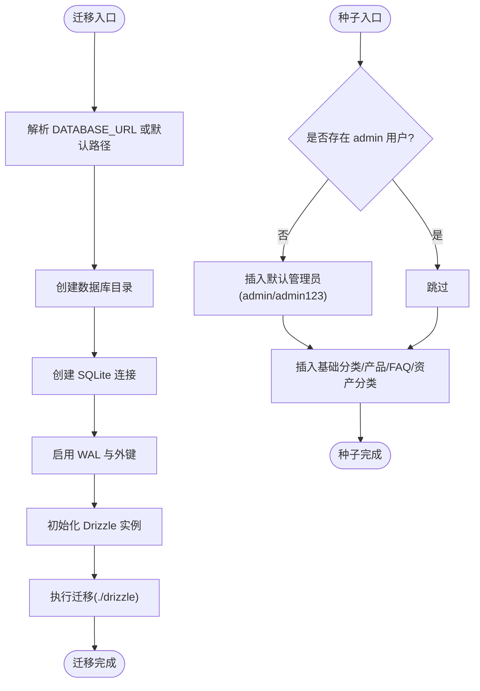
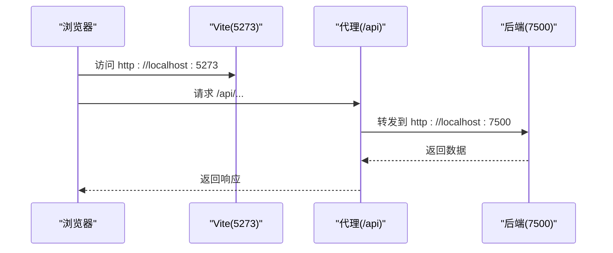
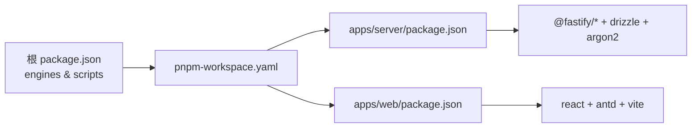

# 快速开始

<cite>
**本文引用的文件**
- [README.md](file://README.md)
- [package.json](file://package.json)
- [pnpm-workspace.yaml](file://pnpm-workspace.yaml)
- [apps/server/package.json](file://apps/server/package.json)
- [apps/web/package.json](file://apps/web/package.json)
- [apps/server/src/index.ts](file://apps/server/src/index.ts)
- [apps/web/vite.config.ts](file://apps/web/vite.config.ts)
- [apps/server/drizzle.config.ts](file://apps/server/drizzle.config.ts)
- [apps/server/src/db/schema.ts](file://apps/server/src/db/schema.ts)
- [apps/server/src/db/migrate.ts](file://apps/server/src/db/migrate.ts)
- [apps/server/src/db/seed.ts](file://apps/server/src/db/seed.ts)
- [apps/web/src/main.tsx](file://apps/web/src/main.tsx)
- [apps/web/src/App.tsx](file://apps/web/src/App.tsx)
- [global.json](file://global.json)
- [.npmrc](file://.npmrc)
</cite>

## 目录
1. [简介](#简介)
2. [项目结构](#项目结构)
3. [核心组件](#核心组件)
4. [架构总览](#架构总览)
5. [详细组件分析](#详细组件分析)
6. [依赖分析](#依赖分析)
7. [性能考虑](#性能考虑)
8. [故障排查指南](#故障排查指南)
9. [结论](#结论)
10. [附录](#附录)

## 简介
本指南面向新开发者，帮助你在最短时间内成功运行 ZBH2 项目。你将了解环境要求、安装步骤、数据库初始化、开发服务器启动流程，以及默认管理员账号与安全建议。项目采用 pnpm monorepo 结构，后端基于 Fastify + Drizzle ORM + SQLite，前端基于 React + Vite。

## 项目结构
ZBH2 采用 pnpm workspace 的 monorepo 结构，主要目录如下：
- apps/server：后端 API（Fastify），包含数据库迁移、种子数据、路由与中间件
- apps/web：前端门户（React + Vite），包含页面、布局、API 客户端与认证上下文
- packages/shared：前后端共享的类型与校验模型
- tools/ActivationClientWpf：Windows 平台的激活客户端演示（WPF）

图表来源
- [apps/server/src/index.ts:1-60](file://apps/server/src/index.ts#L1-L60)
- [apps/server/drizzle.config.ts:1-11](file://apps/server/drizzle.config.ts#L1-L11)
- [apps/server/src/db/migrate.ts:1-18](file://apps/server/src/db/migrate.ts#L1-L18)
- [apps/server/src/db/seed.ts:1-98](file://apps/server/src/db/seed.ts#L1-L98)
- [apps/server/src/db/schema.ts:1-330](file://apps/server/src/db/schema.ts#L1-L330)
- [apps/web/src/main.tsx:1-22](file://apps/web/src/main.tsx#L1-L22)
- [apps/web/src/App.tsx:1-80](file://apps/web/src/App.tsx#L1-L80)
- [apps/web/vite.config.ts:1-13](file://apps/web/vite.config.ts#L1-L13)
- [package.json:1-20](file://package.json#L1-L20)
- [pnpm-workspace.yaml:1-5](file://pnpm-workspace.yaml#L1-L5)
- [.npmrc:1-2](file://.npmrc#L1-L2)

章节来源
- [README.md:47-68](file://README.md#L47-L68)
- [package.json:1-20](file://package.json#L1-L20)
- [pnpm-workspace.yaml:1-5](file://pnpm-workspace.yaml#L1-L5)

## 核心组件
- 后端服务（Fastify）
  - 启动入口负责注册安全、CORS、Cookie、限流、静态文件与各路由模块，并监听端口
  - 环境变量 PORT 控制监听端口，默认 7500；DATABASE_URL 指向 SQLite 文件
- 前端开发服务器（Vite）
  - 开发端口 5273，代理将 /api 请求转发至后端 7500
- 数据库（SQLite + Drizzle）
  - 迁移脚本根据 drizzle 配置生成并执行迁移
  - 种子脚本初始化默认管理员账号与基础数据
- 前端应用（React）
  - 应用入口注入路由、国际化与主题，路由覆盖门户与管理后台

章节来源
- [apps/server/src/index.ts:29-54](file://apps/server/src/index.ts#L29-L54)
- [apps/web/vite.config.ts:6-12](file://apps/web/vite.config.ts#L6-L12)
- [apps/server/drizzle.config.ts:3-10](file://apps/server/drizzle.config.ts#L3-L10)
- [apps/server/src/db/migrate.ts:7-15](file://apps/server/src/db/migrate.ts#L7-L15)
- [apps/server/src/db/seed.ts:5-18](file://apps/server/src/db/seed.ts#L5-L18)
- [apps/web/src/main.tsx:11-21](file://apps/web/src/main.tsx#L11-L21)
- [apps/web/src/App.tsx:38-79](file://apps/web/src/App.tsx#L38-L79)

## 架构总览
下图展示了启动流程与服务交互关系：前端开发服务器在本地 5273，代理转发 /api 到后端 7500；后端启动后加载数据库迁移与种子数据，提供 REST 接口与静态文件服务。

图表来源
- [package.json:4-11](file://package.json#L4-L11)
- [apps/web/vite.config.ts:6-12](file://apps/web/vite.config.ts#L6-L12)
- [apps/server/src/index.ts:29-54](file://apps/server/src/index.ts#L29-L54)
- [apps/server/src/db/migrate.ts:7-15](file://apps/server/src/db/migrate.ts#L7-L15)
- [apps/server/src/db/seed.ts:5-18](file://apps/server/src/db/seed.ts#L5-L18)

## 详细组件分析

### 后端启动流程与端口配置
- 启动入口注册安全中间件、CORS、Cookie、限流与静态文件服务
- 注册所有业务路由模块
- 读取环境变量 PORT（默认 7500），绑定 0.0.0.0 监听
- 上传目录位于 data/uploads，启动时自动创建

图表来源
- [apps/server/src/index.ts:29-54](file://apps/server/src/index.ts#L29-L54)

章节来源
- [apps/server/src/index.ts:27-54](file://apps/server/src/index.ts#L27-L54)

### 数据库初始化（迁移与种子）
- 迁移配置指向 drizzle 目录与 SQLite 文件路径（默认 ../../data/app.sqlite）
- 迁移脚本创建数据库目录并启用 WAL 与外键约束，执行迁移
- 种子脚本插入默认管理员账号（admin/admin123），并初始化软件分类、帮助分类、激活产品、FAQ 与资产分类等基础数据

图表来源
- [apps/server/drizzle.config.ts:3-10](file://apps/server/drizzle.config.ts#L3-L10)
- [apps/server/src/db/migrate.ts:7-15](file://apps/server/src/db/migrate.ts#L7-L15)
- [apps/server/src/db/seed.ts:5-18](file://apps/server/src/db/seed.ts#L5-L18)

章节来源
- [apps/server/drizzle.config.ts:1-11](file://apps/server/drizzle.config.ts#L1-L11)
- [apps/server/src/db/migrate.ts:1-18](file://apps/server/src/db/migrate.ts#L1-L18)
- [apps/server/src/db/seed.ts:1-98](file://apps/server/src/db/seed.ts#L1-L98)

### 前端开发服务器与代理
- Vite 开发服务器端口 5273
- 代理规则将 /api 前缀请求转发到 http://localhost:7500
- 应用入口注入路由、Ant Design 国际化与主题，并包裹认证上下文

图表来源
- [apps/web/vite.config.ts:6-12](file://apps/web/vite.config.ts#L6-L12)
- [apps/web/src/main.tsx:11-21](file://apps/web/src/main.tsx#L11-L21)

章节来源
- [apps/web/vite.config.ts:1-13](file://apps/web/vite.config.ts#L1-L13)
- [apps/web/src/main.tsx:1-22](file://apps/web/src/main.tsx#L1-L22)
- [apps/web/src/App.tsx:1-80](file://apps/web/src/App.tsx#L1-L80)

### 默认管理员账号与安全建议
- 默认管理员账号：admin/admin123
- 首次部署后请立即修改默认密码，避免安全风险

章节来源
- [README.md:32-38](file://README.md#L32-L38)
- [apps/server/src/db/seed.ts:8-14](file://apps/server/src/db/seed.ts#L8-L14)

## 依赖分析
- 环境要求
  - Node.js >= 18（根目录 engines 指定）
  - pnpm >= 8（README 指定）
- 工作区与构建
  - pnpm workspace 配置 apps/* 与 packages/*
  - 根脚本提供 dev、build、db:* 等命令
- 后端依赖
  - Fastify 生态（cookie、cors、helmet、multipart、rate-limit、static）
  - Drizzle ORM + better-sqlite3
  - argon2 用于密码哈希
- 前端依赖
  - React 18、Ant Design 5、React Router 6、Vite
  - axios、react-markdown 等

图表来源
- [package.json:1-20](file://package.json#L1-L20)
- [pnpm-workspace.yaml:1-5](file://pnpm-workspace.yaml#L1-L5)
- [apps/server/package.json:14-36](file://apps/server/package.json#L14-L36)
- [apps/web/package.json:11-28](file://apps/web/package.json#L11-L28)

章节来源
- [README.md:7-10](file://README.md#L7-L10)
- [package.json:13-15](file://package.json#L13-L15)
- [apps/server/package.json:14-36](file://apps/server/package.json#L14-L36)
- [apps/web/package.json:11-28](file://apps/web/package.json#L11-L28)

## 性能考虑
- 限流与安全中间件降低滥用风险
- SQLite 适合开发与小规模生产，若并发较高建议评估迁移至更健壮的数据库
- 上传文件大小限制为 500MB，可根据实际需求调整
- 前端代理仅用于开发阶段，生产环境建议通过反向代理统一处理

## 故障排查指南
- 端口冲突
  - 后端默认 7500，前端 5273；若被占用请调整 PORT 或停止占用进程
- 数据库文件权限
  - 确保运行用户对 data/ 目录具有读写权限
- 代理无效
  - 确认 Vite 代理配置已启用，且浏览器访问的是 http://localhost:5273
- 迁移失败
  - 检查 DATABASE_URL 是否可写，确认 drizzle 目录存在且可读
- 种子未生效
  - 确认已执行种子脚本，且数据库中不存在同名用户
- Node.js 或 pnpm 版本过低
  - 升级 Node.js 至 >= 18，pnpm 至 >= 8

章节来源
- [apps/server/src/index.ts:51-53](file://apps/server/src/index.ts#L51-L53)
- [apps/web/vite.config.ts:6-12](file://apps/web/vite.config.ts#L6-L12)
- [apps/server/drizzle.config.ts:7-9](file://apps/server/drizzle.config.ts#L7-L9)
- [apps/server/src/db/migrate.ts:7-15](file://apps/server/src/db/migrate.ts#L7-L15)
- [apps/server/src/db/seed.ts:5-18](file://apps/server/src/db/seed.ts#L5-L18)
- [README.md:7-10](file://README.md#L7-L10)

## 结论
按照本指南完成环境准备、依赖安装、数据库迁移与种子初始化，并通过 pnpm dev 启动前后端开发服务器，你可以在本地快速运行 ZBH2。首次登录后请立即修改默认管理员密码，确保系统安全。

## 附录

### 环境要求与安装步骤
- 环境要求
  - Node.js >= 18
  - pnpm >= 8
- 安装与启动
  - 安装依赖：pnpm install
  - 初始化数据库：pnpm db:migrate；pnpm db:seed
  - 同时启动前后端：pnpm dev
- 启动后访问
  - 前端门户：http://localhost:5273
  - 后端 API：http://localhost:7500
  - 前端代理：/api 请求自动转发到后端

章节来源
- [README.md:5-31](file://README.md#L5-L31)
- [package.json:4-11](file://package.json#L4-L11)

### 环境变量与数据目录
- 环境变量
  - PORT：后端监听端口，默认 7500
  - DATABASE_URL：SQLite 文件路径，默认 ../../data/app.sqlite
- 数据目录
  - data/app.sqlite：数据库文件
  - data/uploads：上传的软件包与文件

章节来源
- [README.md:97-111](file://README.md#L97-L111)
- [apps/server/drizzle.config.ts:7-9](file://apps/server/drizzle.config.ts#L7-L9)
- [apps/server/src/index.ts:24-25](file://apps/server/src/index.ts#L24-L25)