# Drizzle ORM集成

<cite>
**本文档引用的文件**
- [apps/server/drizzle.config.ts](file://apps/server/drizzle.config.ts)
- [apps/server/src/db/index.ts](file://apps/server/src/db/index.ts)
- [apps/server/src/db/schema.ts](file://apps/server/src/db/schema.ts)
- [apps/server/src/db/migrate.ts](file://apps/server/src/db/migrate.ts)
- [apps/server/src/db/seed.ts](file://apps/server/src/db/seed.ts)
- [apps/server/src/db/seed-demo.ts](file://apps/server/src/db/seed-demo.ts)
- [apps/server/src/middleware/auth.ts](file://apps/server/src/middleware/auth.ts)
- [apps/server/src/routes/auth.ts](file://apps/server/src/routes/auth.ts)
- [apps/server/src/routes/activation.ts](file://apps/server/src/routes/activation.ts)
- [apps/server/src/routes/admin.ts](file://apps/server/src/routes/admin.ts)
- [apps/server/package.json](file://apps/server/package.json)
- [apps/server/tsconfig.json](file://apps/server/tsconfig.json)
- [packages/shared/src/types.ts](file://packages/shared/src/types.ts)
- [packages/shared/src/schemas.ts](file://packages/shared/src/schemas.ts)
</cite>

## 目录
1. [简介](#简介)
2. [项目结构](#项目结构)
3. [核心组件](#核心组件)
4. [架构总览](#架构总览)
5. [详细组件分析](#详细组件分析)
6. [依赖关系分析](#依赖关系分析)
7. [性能考虑](#性能考虑)
8. [故障排除指南](#故障排除指南)
9. [结论](#结论)
10. [附录](#附录)

## 简介
本文件系统性阐述ZBH2项目中Drizzle ORM的集成方式与配置策略，覆盖类型安全查询模式、SQL构建器使用、编译时类型检查、数据库连接与迁移、事务与并发控制、API使用示例（CRUD、复杂查询、批量与聚合）、ORM映射策略、查询优化与性能调优、错误处理与调试、以及与TypeScript类型的无缝集成。目标是在保证零运行时开销的前提下，实现强类型、可维护、高性能的数据库层。

## 项目结构
ZBH2的数据库层位于apps/server/src/db目录，采用Drizzle ORM + better-sqlite3的组合，配合drizzle-kit进行迁移与模式生成。共享类型与校验逻辑位于packages/shared，前端通过API与后端交互。

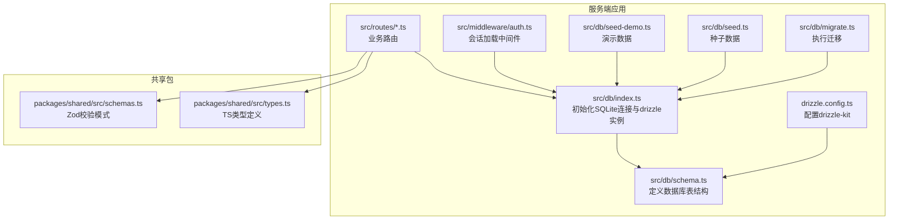

**图表来源**
- [apps/server/drizzle.config.ts:1-11](file://apps/server/drizzle.config.ts#L1-L11)
- [apps/server/src/db/index.ts:1-16](file://apps/server/src/db/index.ts#L1-L16)
- [apps/server/src/db/schema.ts:1-330](file://apps/server/src/db/schema.ts#L1-L330)
- [apps/server/src/db/migrate.ts:1-18](file://apps/server/src/db/migrate.ts#L1-L18)
- [apps/server/src/db/seed.ts:1-98](file://apps/server/src/db/seed.ts#L1-L98)
- [apps/server/src/db/seed-demo.ts:1-800](file://apps/server/src/db/seed-demo.ts#L1-L800)
- [apps/server/src/middleware/auth.ts:1-56](file://apps/server/src/middleware/auth.ts#L1-L56)
- [apps/server/src/routes/auth.ts:1-51](file://apps/server/src/routes/auth.ts#L1-L51)
- [apps/server/src/routes/activation.ts:1-95](file://apps/server/src/routes/activation.ts#L1-L95)
- [apps/server/src/routes/admin.ts:1-279](file://apps/server/src/routes/admin.ts#L1-L279)
- [packages/shared/src/schemas.ts:1-51](file://packages/shared/src/schemas.ts#L1-L51)
- [packages/shared/src/types.ts:1-18](file://packages/shared/src/types.ts#L1-L18)

**章节来源**
- [apps/server/drizzle.config.ts:1-11](file://apps/server/drizzle.config.ts#L1-L11)
- [apps/server/src/db/index.ts:1-16](file://apps/server/src/db/index.ts#L1-L16)
- [apps/server/src/db/schema.ts:1-330](file://apps/server/src/db/schema.ts#L1-L330)
- [apps/server/src/db/migrate.ts:1-18](file://apps/server/src/db/migrate.ts#L1-L18)
- [apps/server/src/db/seed.ts:1-98](file://apps/server/src/db/seed.ts#L1-L98)
- [apps/server/src/db/seed-demo.ts:1-800](file://apps/server/src/db/seed-demo.ts#L1-L800)
- [apps/server/src/middleware/auth.ts:1-56](file://apps/server/src/middleware/auth.ts#L1-L56)
- [apps/server/src/routes/auth.ts:1-51](file://apps/server/src/routes/auth.ts#L1-L51)
- [apps/server/src/routes/activation.ts:1-95](file://apps/server/src/routes/activation.ts#L1-L95)
- [apps/server/src/routes/admin.ts:1-279](file://apps/server/src/routes/admin.ts#L1-L279)
- [apps/server/package.json:1-37](file://apps/server/package.json#L1-L37)
- [apps/server/tsconfig.json:1-16](file://apps/server/tsconfig.json#L1-L16)
- [packages/shared/src/schemas.ts:1-51](file://packages/shared/src/schemas.ts#L1-L51)
- [packages/shared/src/types.ts:1-18](file://packages/shared/src/types.ts#L1-L18)

## 核心组件
- 数据库连接与初始化：通过better-sqlite3创建SQLite连接，启用WAL与外键约束，再用drizzle绑定schema。
- 模式定义：使用sqliteTable与字段类型定义表结构，包含枚举、外键、默认值与时间戳。
- 迁移与生成：drizzle-kit根据schema生成迁移文件；migrate脚本执行迁移。
- 种子数据：提供基础用户、分类、FAQ与演示数据，便于开发与测试。
- 中间件与路由：会话加载中间件结合drizzle查询实现鉴权；各业务路由展示CRUD与联表查询。
- 类型系统：共享包提供Zod校验与TS类型，配合drizzle返回类型实现编译时类型安全。

**章节来源**
- [apps/server/src/db/index.ts:1-16](file://apps/server/src/db/index.ts#L1-L16)
- [apps/server/src/db/schema.ts:1-330](file://apps/server/src/db/schema.ts#L1-L330)
- [apps/server/drizzle.config.ts:1-11](file://apps/server/drizzle.config.ts#L1-L11)
- [apps/server/src/db/migrate.ts:1-18](file://apps/server/src/db/migrate.ts#L1-L18)
- [apps/server/src/db/seed.ts:1-98](file://apps/server/src/db/seed.ts#L1-L98)
- [apps/server/src/middleware/auth.ts:1-56](file://apps/server/src/middleware/auth.ts#L1-L56)
- [apps/server/src/routes/auth.ts:1-51](file://apps/server/src/routes/auth.ts#L1-L51)
- [packages/shared/src/schemas.ts:1-51](file://packages/shared/src/schemas.ts#L1-L51)
- [packages/shared/src/types.ts:1-18](file://packages/shared/src/types.ts#L1-L18)

## 架构总览
下图展示了Drizzle ORM在ZBH2中的整体架构：从配置到连接、模式、迁移与种子数据，再到中间件与路由层的调用链。

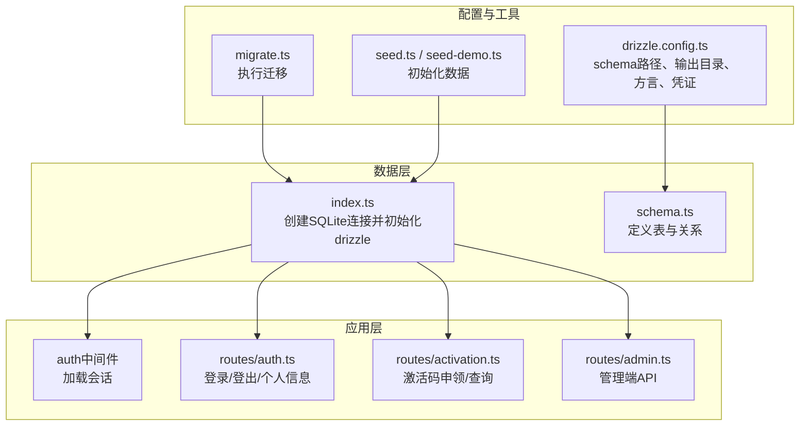

**图表来源**
- [apps/server/drizzle.config.ts:1-11](file://apps/server/drizzle.config.ts#L1-L11)
- [apps/server/src/db/migrate.ts:1-18](file://apps/server/src/db/migrate.ts#L1-L18)
- [apps/server/src/db/seed.ts:1-98](file://apps/server/src/db/seed.ts#L1-L98)
- [apps/server/src/db/seed-demo.ts:1-800](file://apps/server/src/db/seed-demo.ts#L1-L800)
- [apps/server/src/db/index.ts:1-16](file://apps/server/src/db/index.ts#L1-L16)
- [apps/server/src/db/schema.ts:1-330](file://apps/server/src/db/schema.ts#L1-L330)
- [apps/server/src/middleware/auth.ts:1-56](file://apps/server/src/middleware/auth.ts#L1-L56)
- [apps/server/src/routes/auth.ts:1-51](file://apps/server/src/routes/auth.ts#L1-L51)
- [apps/server/src/routes/activation.ts:1-95](file://apps/server/src/routes/activation.ts#L1-L95)
- [apps/server/src/routes/admin.ts:1-279](file://apps/server/src/routes/admin.ts#L1-L279)

## 详细组件分析

### 数据库连接与初始化
- 使用better-sqlite3创建SQLite连接，设置WAL模式与外键约束，确保并发与一致性。
- 通过drizzle(sqlite, { schema })绑定schema，实现类型安全的查询。
- 支持DATABASE_URL环境变量，便于不同环境配置。

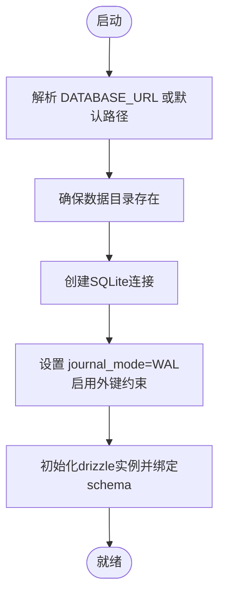

**图表来源**
- [apps/server/src/db/index.ts:7-14](file://apps/server/src/db/index.ts#L7-L14)

**章节来源**
- [apps/server/src/db/index.ts:1-16](file://apps/server/src/db/index.ts#L1-L16)

### 模式定义与类型安全
- 使用sqliteTable定义表，字段类型涵盖主键、唯一、枚举、外键、默认值与时间戳。
- 通过schema对象导出，路由与中间件直接引用，实现编译时类型推断。
- 示例表：users、sessions、softwareCategories、files、softwareItems、helpCategories、helpDocuments、activationProducts、activationCodes、activationCodeGrants、tickets、ticketReplies、assets、assetCategories、assetRecords、assetApprovals、saasServices、saasPlans、saasAccounts、faqEntries、monitorTargets、monitorItems、monitorThresholds、monitorRecords、monitorAlerts、monitorReportTemplates、monitorReports、auditLogs、monitorPlatforms。

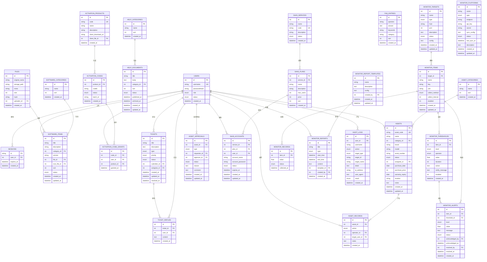

**图表来源**
- [apps/server/src/db/schema.ts:1-330](file://apps/server/src/db/schema.ts#L1-L330)

**章节来源**
- [apps/server/src/db/schema.ts:1-330](file://apps/server/src/db/schema.ts#L1-L330)

### 迁移与种子数据
- drizzle.config.ts定义schema路径、输出目录、方言与数据库凭证。
- migrate.ts读取迁移目录并应用，确保数据库结构与schema一致。
- seed.ts与seed-demo.ts分别提供基础数据与演示数据，便于开发与测试。

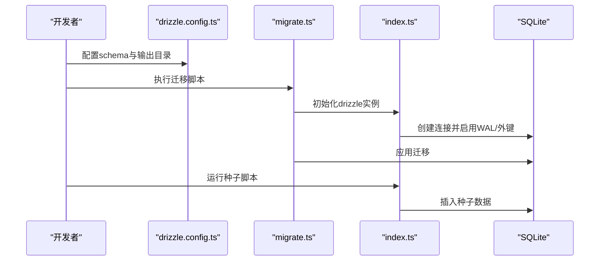

**图表来源**
- [apps/server/drizzle.config.ts:1-11](file://apps/server/drizzle.config.ts#L1-L11)
- [apps/server/src/db/migrate.ts:1-18](file://apps/server/src/db/migrate.ts#L1-L18)
- [apps/server/src/db/index.ts:1-16](file://apps/server/src/db/index.ts#L1-L16)
- [apps/server/src/db/seed.ts:1-98](file://apps/server/src/db/seed.ts#L1-L98)
- [apps/server/src/db/seed-demo.ts:1-800](file://apps/server/src/db/seed-demo.ts#L1-L800)

**章节来源**
- [apps/server/drizzle.config.ts:1-11](file://apps/server/drizzle.config.ts#L1-L11)
- [apps/server/src/db/migrate.ts:1-18](file://apps/server/src/db/migrate.ts#L1-L18)
- [apps/server/src/db/seed.ts:1-98](file://apps/server/src/db/seed.ts#L1-L98)
- [apps/server/src/db/seed-demo.ts:1-800](file://apps/server/src/db/seed-demo.ts#L1-L800)

### 类型安全的查询模式与SQL构建器
- 查询构建器：使用select、insert、update、delete与where、leftJoin、orderBy、limit等，返回类型由schema推断。
- 编译时类型检查：drizzle与schema绑定后，查询结果类型与表结构严格对应，避免运行时类型错误。
- 复杂查询：联表查询、条件过滤、排序与分页在路由中广泛使用。

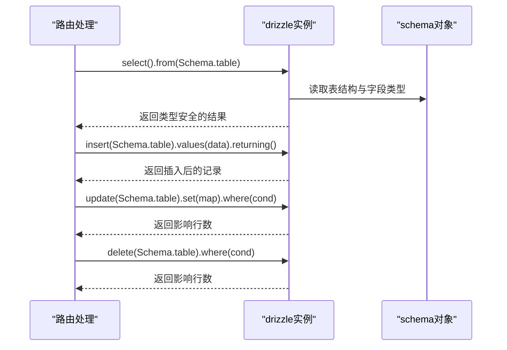

**图表来源**
- [apps/server/src/db/index.ts:14-15](file://apps/server/src/db/index.ts#L14-L15)
- [apps/server/src/db/schema.ts:1-330](file://apps/server/src/db/schema.ts#L1-L330)
- [apps/server/src/routes/admin.ts:24-43](file://apps/server/src/routes/admin.ts#L24-L43)
- [apps/server/src/routes/admin.ts:51-73](file://apps/server/src/routes/admin.ts#L51-L73)

**章节来源**
- [apps/server/src/db/index.ts:14-15](file://apps/server/src/db/index.ts#L14-L15)
- [apps/server/src/db/schema.ts:1-330](file://apps/server/src/db/schema.ts#L1-L330)
- [apps/server/src/routes/admin.ts:24-43](file://apps/server/src/routes/admin.ts#L24-L43)
- [apps/server/src/routes/admin.ts:51-73](file://apps/server/src/routes/admin.ts#L51-L73)

### 事务管理与并发控制
- SQLite WAL模式：提升读写并发能力，减少锁竞争。
- 外键约束：通过PRAGMA启用外键，确保参照完整性。
- 会话与并发：中间件按会话ID与过期时间查询，避免并发会话冲突；路由层对关键操作（如激活码发放）采用联表查询与原子更新，保证幂等性。

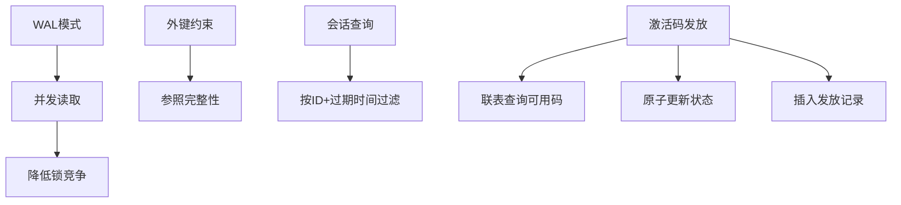

**图表来源**
- [apps/server/src/db/index.ts:11-12](file://apps/server/src/db/index.ts#L11-L12)
- [apps/server/src/middleware/auth.ts:17-40](file://apps/server/src/middleware/auth.ts#L17-L40)
- [apps/server/src/routes/activation.ts:44-75](file://apps/server/src/routes/activation.ts#L44-L75)

**章节来源**
- [apps/server/src/db/index.ts:11-12](file://apps/server/src/db/index.ts#L11-L12)
- [apps/server/src/middleware/auth.ts:17-40](file://apps/server/src/middleware/auth.ts#L17-L40)
- [apps/server/src/routes/activation.ts:44-75](file://apps/server/src/routes/activation.ts#L44-L75)

### API使用示例

#### 登录与会话
- 登录接口：Zod校验用户名与密码，查询用户并验证密码哈希，创建会话并设置Cookie。
- 会话加载：中间件根据sid查询有效会话与用户，注入到请求上下文。

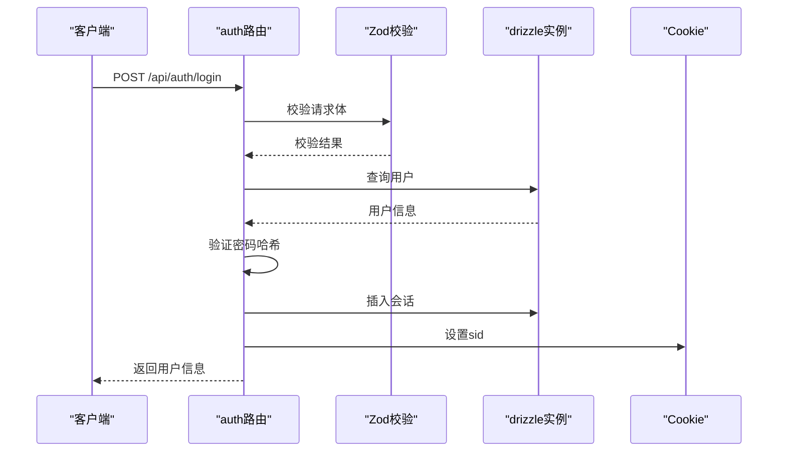

**图表来源**
- [apps/server/src/routes/auth.ts:9-33](file://apps/server/src/routes/auth.ts#L9-L33)
- [apps/server/src/middleware/auth.ts:17-40](file://apps/server/src/middleware/auth.ts#L17-L40)
- [packages/shared/src/schemas.ts:3-6](file://packages/shared/src/schemas.ts#L3-L6)

**章节来源**
- [apps/server/src/routes/auth.ts:1-51](file://apps/server/src/routes/auth.ts#L1-L51)
- [apps/server/src/middleware/auth.ts:1-56](file://apps/server/src/middleware/auth.ts#L1-L56)
- [packages/shared/src/schemas.ts:1-51](file://packages/shared/src/schemas.ts#L1-L51)

#### 激活码申领与查询
- 申领：幂等检查用户是否已有该产品的发放记录；查找可用激活码并原子更新状态，插入发放记录。
- 查询：联表查询用户的所有发放记录，包含产品名称与发放时间。

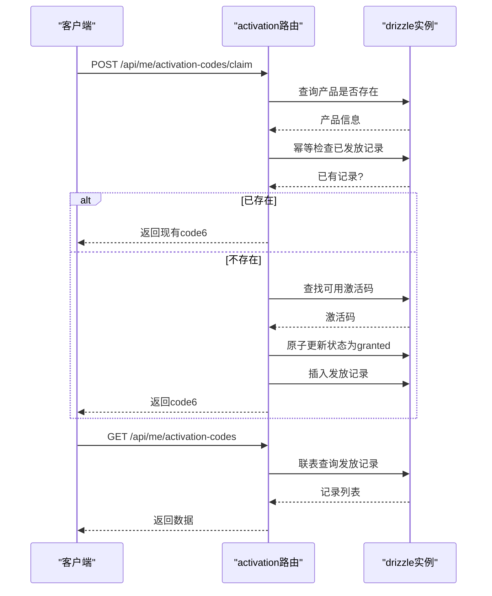

**图表来源**
- [apps/server/src/routes/activation.ts:8-75](file://apps/server/src/routes/activation.ts#L8-L75)
- [apps/server/src/db/schema.ts:71-96](file://apps/server/src/db/schema.ts#L71-L96)

**章节来源**
- [apps/server/src/routes/activation.ts:1-95](file://apps/server/src/routes/activation.ts#L1-L95)
- [apps/server/src/db/schema.ts:71-96](file://apps/server/src/db/schema.ts#L71-L96)

#### 管理端CRUD与复杂查询
- 软件分类/条目/帮助分类/文档/激活产品/用户等CRUD接口，均使用drizzle的insert、update、delete与returning返回刚插入的记录。
- 复杂查询：联表查询、条件过滤、排序与分页；批量导入激活码时逐条插入并返回批次ID。

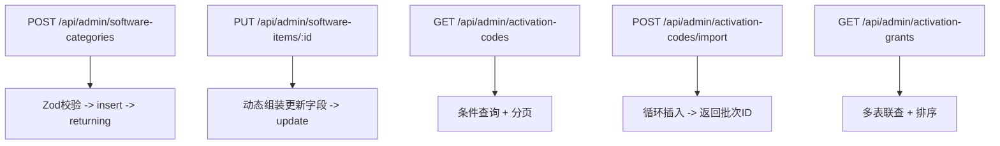

**图表来源**
- [apps/server/src/routes/admin.ts:24-43](file://apps/server/src/routes/admin.ts#L24-L43)
- [apps/server/src/routes/admin.ts:51-73](file://apps/server/src/routes/admin.ts#L51-L73)
- [apps/server/src/routes/admin.ts:161-176](file://apps/server/src/routes/admin.ts#L161-L176)
- [apps/server/src/routes/admin.ts:178-197](file://apps/server/src/routes/admin.ts#L178-L197)
- [apps/server/src/routes/admin.ts:199-219](file://apps/server/src/routes/admin.ts#L199-L219)

**章节来源**
- [apps/server/src/routes/admin.ts:1-279](file://apps/server/src/routes/admin.ts#L1-L279)

### ORM映射策略与查询优化
- 映射策略：每个表对应schema中的一个对象，字段类型与枚举值在编译期确定，查询结果类型与表结构一一对应。
- 查询优化：使用索引友好的where条件（如主键、唯一键、外键），避免SELECT *，按需投影字段；对大表使用limit与分页；联表查询时明确on条件，减少笛卡尔积。
- 性能调优：启用WAL模式提升并发；合理使用事务（尽管SQLite简单事务开销小）；避免在热路径上进行昂贵的全文检索或正则匹配。

**章节来源**
- [apps/server/src/db/schema.ts:1-330](file://apps/server/src/db/schema.ts#L1-L330)
- [apps/server/src/db/index.ts:11-12](file://apps/server/src/db/index.ts#L11-L12)
- [apps/server/src/routes/admin.ts:161-176](file://apps/server/src/routes/admin.ts#L161-L176)

### 错误处理机制与调试
- 请求参数校验：使用Zod在路由层进行输入校验，返回结构化错误。
- 数据访问异常：drizzle查询异常会抛出，建议在路由层捕获并返回统一格式。
- 日志与审计：审计日志表记录用户操作，便于问题追踪与回溯。
- 调试建议：开启WAL模式、使用分页与投影、在开发环境打印SQL（drizzle支持）、利用迁移与种子数据快速复现问题。

**章节来源**
- [apps/server/src/routes/auth.ts:10-13](file://apps/server/src/routes/auth.ts#L10-L13)
- [apps/server/src/routes/admin.ts:237-249](file://apps/server/src/routes/admin.ts#L237-L249)
- [apps/server/src/db/schema.ts:301-314](file://apps/server/src/db/schema.ts#L301-L314)

## 依赖关系分析
- drizzle-orm与better-sqlite3：核心数据库ORM与SQLite驱动。
- drizzle-kit：模式生成与迁移工具。
- argon2：密码哈希。
- shared包：提供Zod校验与TS类型，供前后端共享。

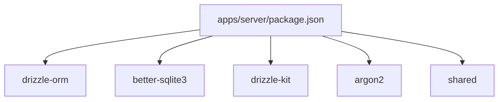

**图表来源**
- [apps/server/package.json:14-36](file://apps/server/package.json#L14-L36)

**章节来源**
- [apps/server/package.json:1-37](file://apps/server/package.json#L1-L37)

## 性能考虑
- 存储引擎：SQLite适合中小规模应用；若业务增长，可评估迁移到PostgreSQL/MySQL并保持相同查询API。
- 并发：WAL模式显著提升并发读取性能；外键约束带来一致性但可能增加写入开销，需在业务上规避不必要的级联写入。
- 查询：优先使用索引字段过滤，避免全表扫描；对高频查询建立合适索引（如激活码状态、用户状态、产品ID）。
- 批量：批量导入使用循环插入，建议在更高并发场景下考虑批量API或事务包裹。
- 缓存：对只读数据（如分类、FAQ）可引入内存缓存，减少数据库压力。

## 故障排除指南
- 迁移失败：检查drizzle配置与迁移目录路径，确认数据库文件可写。
- 连接异常：确认DATABASE_URL或默认路径存在，数据目录已创建。
- 查询类型错误：检查schema定义与查询字段是否匹配，确保使用schema导出的对象。
- 并发冲突：确认WAL模式与外键约束已启用；对关键流程使用原子更新与幂等检查。
- 开发环境：使用种子数据快速恢复初始状态；通过分页与投影缩小问题范围。

**章节来源**
- [apps/server/src/db/migrate.ts:1-18](file://apps/server/src/db/migrate.ts#L1-L18)
- [apps/server/src/db/index.ts:7-14](file://apps/server/src/db/index.ts#L7-L14)
- [apps/server/src/db/schema.ts:1-330](file://apps/server/src/db/schema.ts#L1-L330)
- [apps/server/src/db/seed.ts:1-98](file://apps/server/src/db/seed.ts#L1-L98)

## 结论
ZBH2项目通过Drizzle ORM与better-sqlite3实现了类型安全、可维护、高性能的数据库层。借助drizzle-kit的迁移与模式生成、严格的schema定义与Zod校验，项目在开发效率与运行时稳定性之间取得良好平衡。未来可根据业务规模演进，平滑过渡到更强大的数据库引擎，同时保持查询API的一致性。

## 附录
- 开发脚本：db:generate、db:migrate、db:seed。
- TypeScript配置：严格模式、ES模块、声明生成与JSON解析。

**章节来源**
- [apps/server/package.json:6-12](file://apps/server/package.json#L6-L12)
- [apps/server/tsconfig.json:2-13](file://apps/server/tsconfig.json#L2-L13)