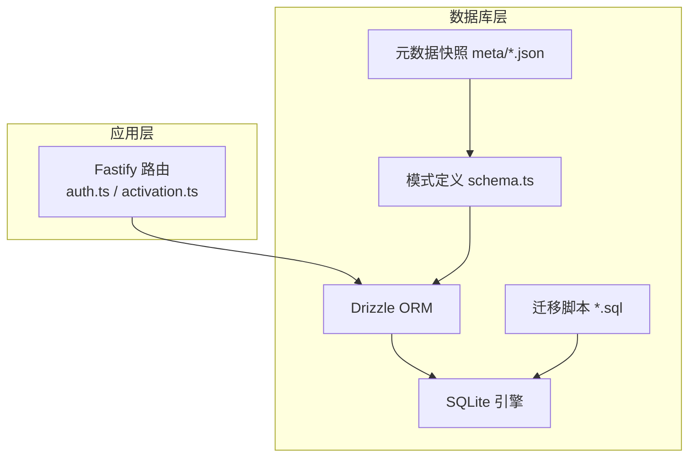
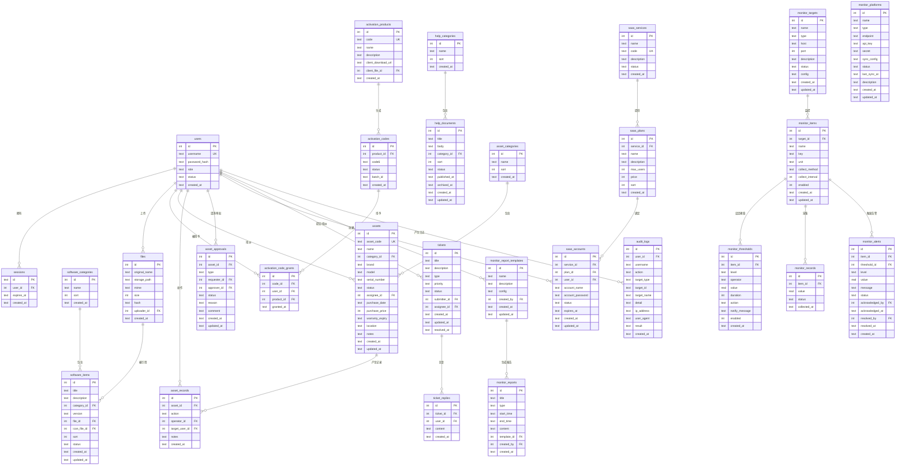
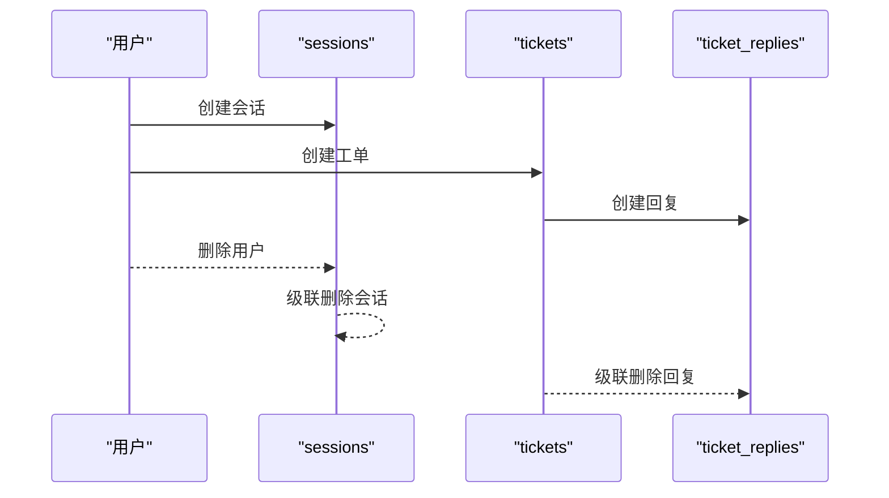
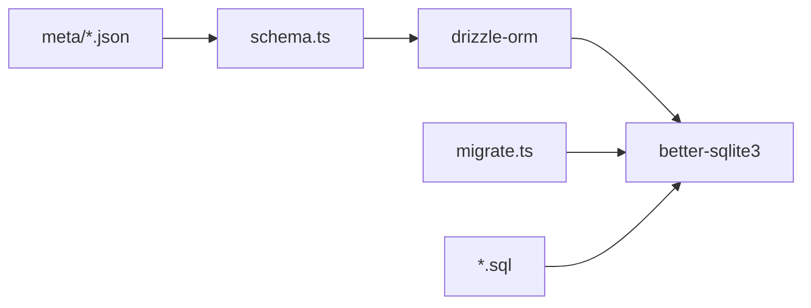

# 关系与约束设计

<cite>
**本文引用的文件**
- [apps/server/src/db/schema.ts](file://apps/server/src/db/schema.ts)
- [apps/server/src/db/index.ts](file://apps/server/src/db/index.ts)
- [apps/server/src/db/migrate.ts](file://apps/server/src/db/migrate.ts)
- [apps/server/drizzle/0000_absurd_liz_osborn.sql](file://apps/server/drizzle/0000_absurd_liz_osborn.sql)
- [apps/server/drizzle/0001_zippy_shadowcat.sql](file://apps/server/drizzle/0001_zippy_shadowcat.sql)
- [apps/server/drizzle/0002_special_medusa.sql](file://apps/server/drizzle/0002_special_medusa.sql)
- [apps/server/drizzle/meta/0000_snapshot.json](file://apps/server/drizzle/meta/0000_snapshot.json)
- [apps/server/drizzle/meta/0001_snapshot.json](file://apps/server/drizzle/meta/0001_snapshot.json)
- [apps/server/drizzle/meta/0002_snapshot.json](file://apps/server/drizzle/meta/0002_snapshot.json)
- [apps/server/src/routes/auth.ts](file://apps/server/src/routes/auth.ts)
- [apps/server/src/routes/activation.ts](file://apps/server/src/routes/activation.ts)
- [apps/server/src/db/seed.ts](file://apps/server/src/db/seed.ts)
- [apps/server/src/db/seed-demo.ts](file://apps/server/src/db/seed-demo.ts)
</cite>

## 目录
1. [简介](#简介)
2. [项目结构](#项目结构)
3. [核心组件](#核心组件)
4. [架构总览](#架构总览)
5. [详细组件分析](#详细组件分析)
6. [依赖分析](#依赖分析)
7. [性能考量](#性能考量)
8. [故障排查指南](#故障排查指南)
9. [结论](#结论)
10. [附录](#附录)

## 简介
本文件聚焦于数据库关系与约束设计，结合代码库中的 Drizzle ORM 模式定义与迁移脚本，系统阐述：
- 外键约束与级联策略（删除级联、更新级联）的设计原则与应用场景
- 唯一约束、非空约束、检查约束的作用与实现方式
- 索引设计策略（主键、唯一、复合索引）与选择原则
- 实体关系图（ER 图）与多对一、一对多、多对多关系映射
- 约束对性能的影响与优化策略
- 数据完整性保障机制与业务规则的数据库层面实现

## 项目结构
数据库层采用 Drizzle ORM + SQLite，模式定义集中在 schema.ts，迁移脚本位于 drizzle 目录，元数据快照保存在 meta 目录。应用启动时启用 WAL 模式与外键校验。

图表来源
- [apps/server/src/db/schema.ts:1-330](file://apps/server/src/db/schema.ts#L1-L330)
- [apps/server/src/db/index.ts:1-16](file://apps/server/src/db/index.ts#L1-L16)
- [apps/server/drizzle/0000_absurd_liz_osborn.sql:1-108](file://apps/server/drizzle/0000_absurd_liz_osborn.sql#L1-L108)

章节来源
- [apps/server/src/db/index.ts:1-16](file://apps/server/src/db/index.ts#L1-L16)
- [apps/server/src/db/migrate.ts:1-18](file://apps/server/src/db/migrate.ts#L1-L18)

## 核心组件
- 模式定义：users、sessions、software_*、help_*、activation_*、assets_*、saas_*、faq_entries、monitor_*、audit_logs 等
- 约束与索引：主键、唯一、外键、非空、默认值、枚举约束、索引（唯一索引）
- 迁移与快照：多版本迁移脚本与对应元数据快照，确保模式演进可追踪

章节来源
- [apps/server/src/db/schema.ts:1-330](file://apps/server/src/db/schema.ts#L1-L330)
- [apps/server/drizzle/0000_absurd_liz_osborn.sql:1-108](file://apps/server/drizzle/0000_absurd_liz_osborn.sql#L1-L108)
- [apps/server/drizzle/0001_zippy_shadowcat.sql:1-132](file://apps/server/drizzle/0001_zippy_shadowcat.sql#L1-L132)
- [apps/server/drizzle/0002_special_medusa.sql:1-125](file://apps/server/drizzle/0002_special_medusa.sql#L1-L125)
- [apps/server/drizzle/meta/0000_snapshot.json:1-757](file://apps/server/drizzle/meta/0000_snapshot.json#L1-L757)
- [apps/server/drizzle/meta/0001_snapshot.json:1-800](file://apps/server/drizzle/meta/0001_snapshot.json#L1-L800)
- [apps/server/drizzle/meta/0002_snapshot.json:1-800](file://apps/server/drizzle/meta/0002_snapshot.json#L1-L800)

## 架构总览
下图展示数据库层的实体关系与约束分布，涵盖用户体系、会话、软件与帮助文档、激活系统、资产管理、SaaS 服务、监控系统与审计日志等模块。

图表来源
- [apps/server/src/db/schema.ts:1-330](file://apps/server/src/db/schema.ts#L1-L330)
- [apps/server/drizzle/0000_absurd_liz_osborn.sql:1-108](file://apps/server/drizzle/0000_absurd_liz_osborn.sql#L1-L108)
- [apps/server/drizzle/0001_zippy_shadowcat.sql:1-132](file://apps/server/drizzle/0001_zippy_shadowcat.sql#L1-L132)
- [apps/server/drizzle/0002_special_medusa.sql:1-125](file://apps/server/drizzle/0002_special_medusa.sql#L1-L125)

## 详细组件分析

### 外键约束与级联策略
- 删除级联（onDelete=cascade）
  - sessions.user_id：用户删除时，会话级联删除，保障会话表的引用完整性
  - ticket_replies.ticket_id：工单删除时，回复级联删除，避免孤儿数据
  - monitor_items.target_id：监控目标删除时，指标级联删除
  - monitor_records.item_id：监控指标删除时，记录级联删除
  - monitor_thresholds.item_id：监控指标删除时，阈值级联删除
- 更新级联（onUpdate=no action）：多数外键保持“no action”，避免级联更新带来的复杂一致性问题；部分场景（如用户主键变更）需谨慎评估

图表来源
- [apps/server/src/db/schema.ts:12-17](file://apps/server/src/db/schema.ts#L12-L17)
- [apps/server/src/db/schema.ts#L99-L119)
- [apps/server/drizzle/0000_absurd_liz_osborn.sql:67-73](file://apps/server/drizzle/0000_absurd_liz_osborn.sql#L67-L73)
- [apps/server/drizzle/0001_zippy_shadowcat.sql:107-115](file://apps/server/drizzle/0001_zippy_shadowcat.sql#L107-L115)
- [apps/server/drizzle/0002_special_medusa.sql:36-48](file://apps/server/drizzle/0002_special_medusa.sql#L36-L48)

章节来源
- [apps/server/src/db/schema.ts:12-17](file://apps/server/src/db/schema.ts#L12-L17)
- [apps/server/src/db/schema.ts:99-119](file://apps/server/src/db/schema.ts#L99-L119)
- [apps/server/drizzle/0000_absurd_liz_osborn.sql:67-73](file://apps/server/drizzle/0000_absurd_liz_osborn.sql#L67-L73)
- [apps/server/drizzle/0001_zippy_shadowcat.sql:107-115](file://apps/server/drizzle/0001_zippy_shadowcat.sql#L107-L115)
- [apps/server/drizzle/0002_special_medusa.sql:36-48](file://apps/server/drizzle/0002_special_medusa.sql#L36-L48)

### 唯一约束与非空约束
- 唯一约束
  - users.username：保证用户名唯一
  - activation_products.code：产品编码唯一
  - assets.asset_code：资产编号唯一
  - saas_services.code：SaaS 服务编码唯一
- 非空约束
  - 多数字段通过 notNull() 定义，如 users.username、activation_codes.code6、assets.name 等
- 实现方式
  - Drizzle ORM 中通过 .unique()、.notNull()、默认值 .default(...) 等声明
  - 迁移脚本中体现为 CREATE TABLE 与 UNIQUE INDEX

章节来源
- [apps/server/src/db/schema.ts:3-10](file://apps/server/src/db/schema.ts#L3-L10)
- [apps/server/src/db/schema.ts:71-79](file://apps/server/src/db/schema.ts#L71-L79)
- [apps/server/src/db/schema.ts:129-146](file://apps/server/src/db/schema.ts#L129-L146)
- [apps/server/src/db/schema.ts:172-179](file://apps/server/src/db/schema.ts#L172-L179)
- [apps/server/drizzle/0000_absurd_liz_osborn.sql:108-108](file://apps/server/drizzle/0000_absurd_liz_osborn.sql#L108-L108)
- [apps/server/drizzle/0000_absurd_liz_osborn.sql:33-33](file://apps/server/drizzle/0000_absurd_liz_osborn.sql#L33-L33)
- [apps/server/drizzle/0001_zippy_shadowcat.sql:58-58](file://apps/server/drizzle/0001_zippy_shadowcat.sql#L58-L58)
- [apps/server/drizzle/0001_zippy_shadowcat.sql:105-105](file://apps/server/drizzle/0001_zippy_shadowcat.sql#L105-L105)

### 检查约束与枚举约束
- 枚举约束（enum）
  - users.role、users.status、help_documents.status、assets.status、tickets.status 等
  - 通过 text(..., { enum: [...] }) 定义，数据库层限制取值范围
- 检查约束（checkConstraints）
  - 当前快照中未发现显式 checkConstraints 字段，业务规则主要通过枚举与外键约束保障

章节来源
- [apps/server/src/db/schema.ts:7-8](file://apps/server/src/db/schema.ts#L7-L8)
- [apps/server/src/db/schema.ts](file://apps/server/src/db/schema.ts#L64)
- [apps/server/src/db/schema.ts](file://apps/server/src/db/schema.ts#L137)
- [apps/server/src/db/schema.ts](file://apps/server/src/db/schema.ts#L105)
- [apps/server/drizzle/meta/0000_snapshot.json:1-757](file://apps/server/drizzle/meta/0000_snapshot.json#L1-L757)
- [apps/server/drizzle/meta/0001_snapshot.json:1-800](file://apps/server/drizzle/meta/0001_snapshot.json#L1-L800)
- [apps/server/drizzle/meta/0002_snapshot.json:1-800](file://apps/server/drizzle/meta/0002_snapshot.json#L1-L800)

### 索引设计策略
- 主键索引：所有表的主键列自动建立主键索引（PRIMARY KEY）
- 唯一索引：users.username、activation_products.code、assets.asset_code、saas_services.code 等
- 复合索引：当前快照未发现复合索引定义；可根据查询模式（如 activation_code_grants(code_id,user_id)）考虑增加复合索引以优化联合过滤与连接
- 选择原则
  - 高选择性列优先（如 code、asset_code）
  - 频繁出现在 WHERE/JOIN/ORDER BY 的列
  - 与外键列一致的索引策略，减少连接成本

章节来源
- [apps/server/drizzle/0000_absurd_liz_osborn.sql:108-108](file://apps/server/drizzle/0000_absurd_liz_osborn.sql#L108-L108)
- [apps/server/drizzle/0000_absurd_liz_osborn.sql:33-33](file://apps/server/drizzle/0000_absurd_liz_osborn.sql#L33-L33)
- [apps/server/drizzle/0001_zippy_shadowcat.sql:58-58](file://apps/server/drizzle/0001_zippy_shadowcat.sql#L58-L58)
- [apps/server/drizzle/0001_zippy_shadowcat.sql:105-105](file://apps/server/drizzle/0001_zippy_shadowcat.sql#L105-L105)
- [apps/server/drizzle/meta/0000_snapshot.json:1-757](file://apps/server/drizzle/meta/0000_snapshot.json#L1-L757)
- [apps/server/drizzle/meta/0001_snapshot.json:1-800](file://apps/server/drizzle/meta/0001_snapshot.json#L1-L800)
- [apps/server/drizzle/meta/0002_snapshot.json:1-800](file://apps/server/drizzle/meta/0002_snapshot.json#L1-L800)

### 实体关系与业务映射
- 多对一/一对多
  - users → sessions：一对多
  - users → files：一对多（上传者）
  - software_categories → software_items：一对多
  - help_categories → help_documents：一对多
  - activation_products → activation_codes：一对多
  - activation_codes → activation_code_grants：一对多
  - asset_categories → assets：一对多
  - users → assets（assignee_id）：一对多
  - monitor_targets → monitor_items：一对多
  - monitor_items → monitor_thresholds/records/alerts：一对多
  - monitor_report_templates → monitor_reports：一对多
  - users → audit_logs：一对多
- 多对多
  - 通过中间表实现：activation_code_grants（连接 users 与 activation_codes）、asset_records（连接 assets 与 users）、ticket_replies（连接 tickets 与 users）

章节来源
- [apps/server/src/db/schema.ts:1-330](file://apps/server/src/db/schema.ts#L1-L330)
- [apps/server/drizzle/0000_absurd_liz_osborn.sql:1-108](file://apps/server/drizzle/0000_absurd_liz_osborn.sql#L1-L108)
- [apps/server/drizzle/0001_zippy_shadowcat.sql:1-132](file://apps/server/drizzle/0001_zippy_shadowcat.sql#L1-L132)
- [apps/server/drizzle/0002_special_medusa.sql:1-125](file://apps/server/drizzle/0002_special_medusa.sql#L1-L125)

### 业务规则的数据库层面实现
- 登录与会话
  - 用户存在且状态为 active 才能登录
  - 会话过期时间与删除级联保障清理
- 激活码发放
  - 同一用户对同一产品的幂等发放（避免重复）
  - 从 available 状态的激活码中选取并更新为 granted
- 审计日志
  - 记录用户操作、目标类型、结果等，便于合规与追踪

章节来源
- [apps/server/src/routes/auth.ts:8-50](file://apps/server/src/routes/auth.ts#L8-L50)
- [apps/server/src/routes/activation.ts:8-95](file://apps/server/src/routes/activation.ts#L8-L95)
- [apps/server/src/db/schema.ts:301-314](file://apps/server/src/db/schema.ts#L301-L314)

## 依赖分析
- 模式定义依赖 Drizzle ORM 的 sqliteTable、text、integer 等类型构造函数
- 运行时依赖 SQLite 引擎与 WAL 模式、外键校验
- 迁移脚本与元数据快照共同维护模式演进

图表来源
- [apps/server/src/db/schema.ts:1-330](file://apps/server/src/db/schema.ts#L1-L330)
- [apps/server/src/db/index.ts:1-16](file://apps/server/src/db/index.ts#L1-L16)
- [apps/server/src/db/migrate.ts:1-18](file://apps/server/src/db/migrate.ts#L1-L18)
- [apps/server/drizzle/0000_absurd_liz_osborn.sql:1-108](file://apps/server/drizzle/0000_absurd_liz_osborn.sql#L1-L108)

章节来源
- [apps/server/src/db/schema.ts:1-330](file://apps/server/src/db/schema.ts#L1-L330)
- [apps/server/src/db/index.ts:1-16](file://apps/server/src/db/index.ts#L1-L16)
- [apps/server/src/db/migrate.ts:1-18](file://apps/server/src/db/migrate.ts#L1-L18)

## 性能考量
- WAL 模式与外键校验
  - WAL 提升并发读写性能；外键校验保障一致性但带来一定写入开销
- 索引策略
  - 为高频过滤与连接列建立索引（如 code、asset_code、username）
  - 谨慎增加复合索引，平衡写入与查询成本
- 级联删除
  - 在删除父记录时，级联删除子记录会带来额外写放大，建议在批量删除场景使用事务与分批处理
- 查询优化
  - 使用 Drizzle ORM 的 select/leftJoin 等组合查询，避免 N+1 查询
  - 对热点表（如 sessions、audit_logs）考虑缓存与只读副本

[本节为通用指导，无需特定文件引用]

## 故障排查指南
- 外键约束冲突
  - 现象：插入/更新时报外键错误
  - 排查：确认关联主键是否存在、级联策略是否符合预期
- 唯一约束冲突
  - 现象：重复用户名/产品编码/资产编号
  - 排查：检查业务幂等逻辑与去重策略
- 级联删除异常
  - 现象：删除用户后会话未清理
  - 排查：确认 sessions.user_id 的 onDelete=cascade 是否生效
- 登录失败
  - 现象：用户名或密码错误
  - 排查：确认用户状态为 active，密码哈希验证通过

章节来源
- [apps/server/src/routes/auth.ts:8-50](file://apps/server/src/routes/auth.ts#L8-L50)
- [apps/server/src/db/schema.ts:12-17](file://apps/server/src/db/schema.ts#L12-L17)

## 结论
本项目通过 Drizzle ORM 将数据库关系与约束以强类型方式表达，并配合迁移脚本与元数据快照实现可追踪的模式演进。外键与级联策略在保障数据完整性的同时，需结合业务场景权衡性能与一致性；唯一、非空、枚举约束有效限制了非法数据进入系统；索引策略应围绕热点查询进行优化。整体设计清晰地体现了数据库层面的业务规则落地与数据完整性保障。

[本节为总结，无需特定文件引用]

## 附录
- 快照与迁移对照
  - 0000：用户、会话、软件、帮助、激活、文件等基础表
  - 0001：资产管理、SaaS 服务、工单系统等扩展表
  - 0002：监控系统、审计日志等运维相关表

章节来源
- [apps/server/drizzle/meta/0000_snapshot.json:1-757](file://apps/server/drizzle/meta/0000_snapshot.json#L1-L757)
- [apps/server/drizzle/meta/0001_snapshot.json:1-800](file://apps/server/drizzle/meta/0001_snapshot.json#L1-L800)
- [apps/server/drizzle/meta/0002_snapshot.json:1-800](file://apps/server/drizzle/meta/0002_snapshot.json#L1-L800)