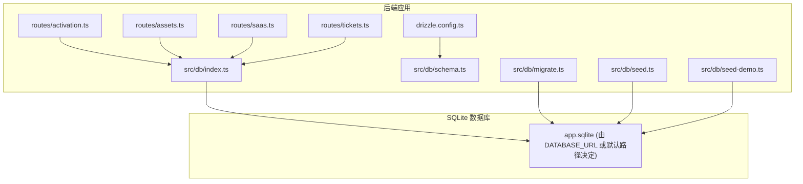
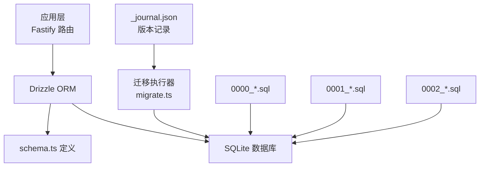
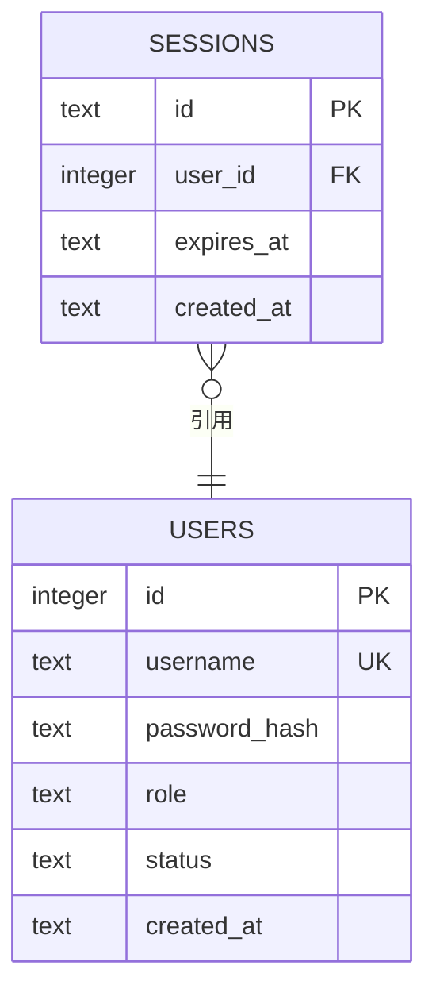
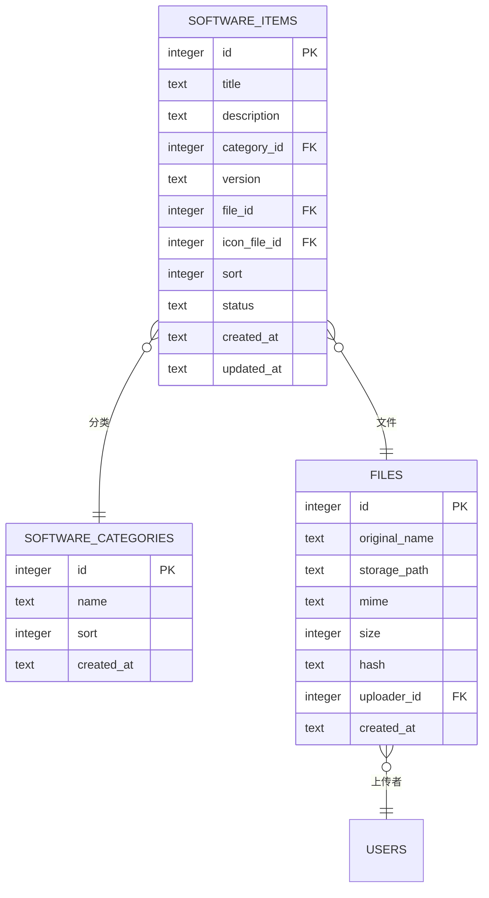
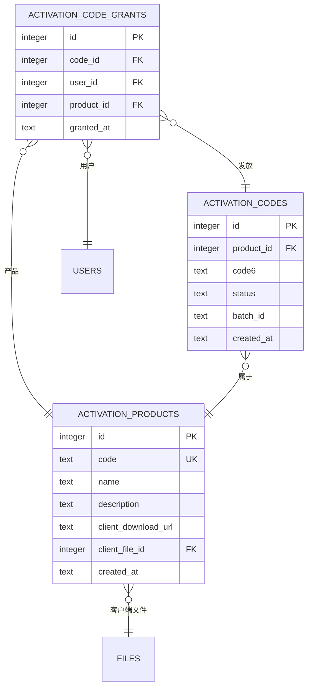
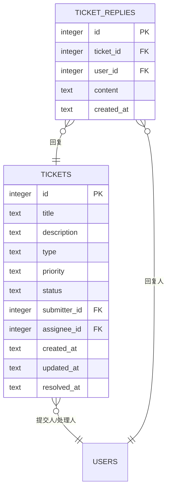
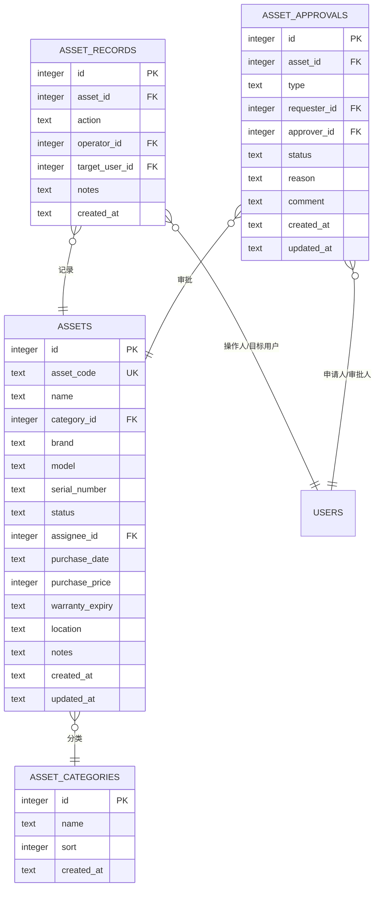
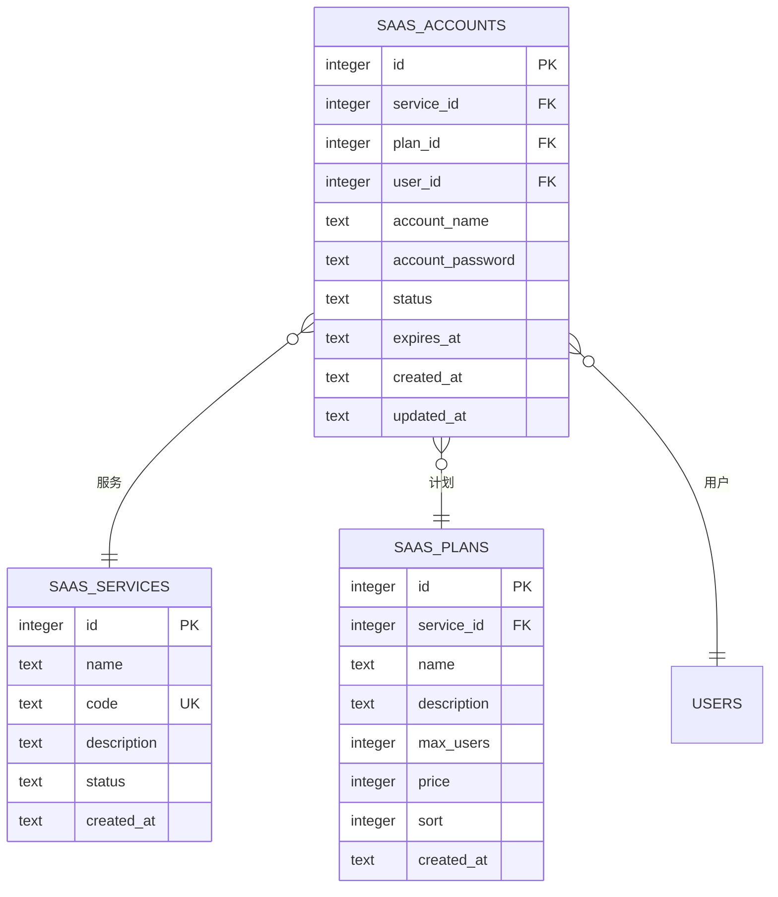
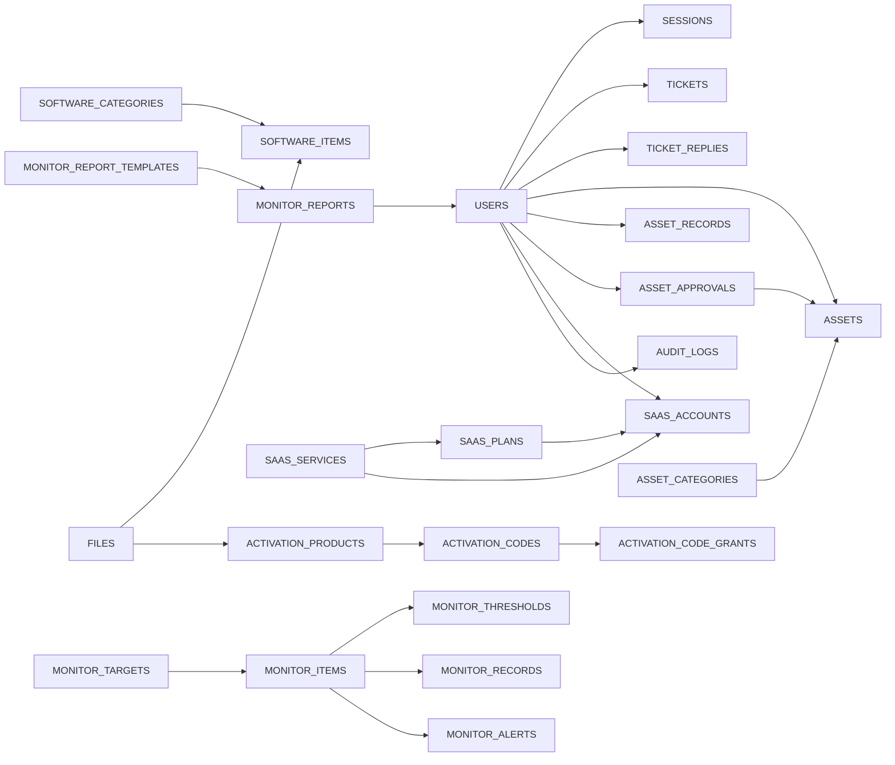
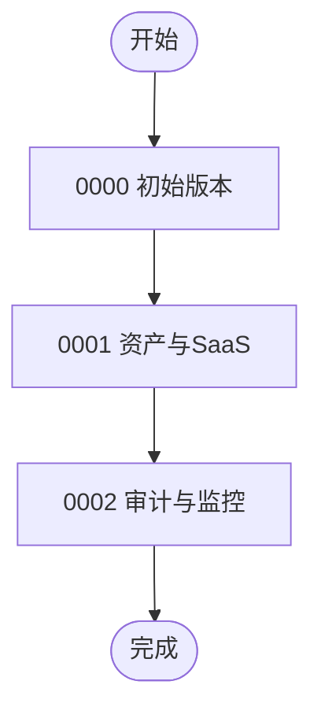

# 数据库设计

<cite>
**本文引用的文件**
- [apps/server/drizzle.config.ts](file://apps/server/drizzle.config.ts)
- [apps/server/src/db/schema.ts](file://apps/server/src/db/schema.ts)
- [apps/server/src/db/index.ts](file://apps/server/src/db/index.ts)
- [apps/server/src/db/migrate.ts](file://apps/server/src/db/migrate.ts)
- [apps/server/src/db/seed.ts](file://apps/server/src/db/seed.ts)
- [apps/server/src/db/seed-demo.ts](file://apps/server/src/db/seed-demo.ts)
- [apps/server/drizzle/meta/0000_snapshot.json](file://apps/server/drizzle/meta/0000_snapshot.json)
- [apps/server/drizzle/meta/0001_snapshot.json](file://apps/server/drizzle/meta/0001_snapshot.json)
- [apps/server/drizzle/meta/0002_snapshot.json](file://apps/server/drizzle/meta/0002_snapshot.json)
- [apps/server/drizzle/meta/_journal.json](file://apps/server/drizzle/meta/_journal.json)
- [apps/server/drizzle/0000_absurd_liz_osborn.sql](file://apps/server/drizzle/0000_absurd_liz_osborn.sql)
- [apps/server/drizzle/0001_zippy_shadowcat.sql](file://apps/server/drizzle/0001_zippy_shadowcat.sql)
- [apps/server/drizzle/0002_special_medusa.sql](file://apps/server/drizzle/0002_special_medusa.sql)
- [apps/server/src/routes/activation.ts](file://apps/server/src/routes/activation.ts)
- [apps/server/src/routes/assets.ts](file://apps/server/src/routes/assets.ts)
- [apps/server/src/routes/saas.ts](file://apps/server/src/routes/saas.ts)
- [apps/server/src/routes/tickets.ts](file://apps/server/src/routes/tickets.ts)
</cite>

## 目录
1. [简介](#简介)
2. [项目结构](#项目结构)
3. [核心组件](#核心组件)
4. [架构总览](#架构总览)
5. [详细组件分析](#详细组件分析)
6. [依赖分析](#依赖分析)
7. [性能考量](#性能考量)
8. [故障排查指南](#故障排查指南)
9. [结论](#结论)
10. [附录](#附录)

## 简介
本文件为 ZBH2 平台的数据库设计文档，聚焦核心数据模型（用户、软件、激活、工单、资产、SaaS 等）的实体关系设计，详述主键、外键、索引与约束的作用；给出完整的 ER 图与数据模型图；说明 Drizzle ORM 的类型安全查询与迁移管理策略；梳理从 0000 到 0002 的版本演进；并覆盖数据验证规则、业务约束、数据完整性保障、数据访问模式、缓存策略、性能优化、数据生命周期与备份恢复、安全考虑等内容。

## 项目结构
ZBH2 的数据库层位于后端应用 apps/server 中，采用 Drizzle ORM + SQLite 的组合：
- 配置：drizzle.config.ts 指定 schema.ts 为模型入口、输出目录与 SQLite 数据库路径
- 模型：schema.ts 定义全部实体与字段约束
- 连接：index.ts 初始化 better-sqlite3 连接并导出 drizzle 实例
- 迁移：migrate.ts 通过 _journal.json 与各版本 SQL 文件执行迁移
- 种子数据：seed.ts 与 seed-demo.ts 提供初始化与演示数据

图表来源
- [apps/server/drizzle.config.ts:1-11](file://apps/server/drizzle.config.ts#L1-L11)
- [apps/server/src/db/index.ts:1-16](file://apps/server/src/db/index.ts#L1-L16)
- [apps/server/src/db/migrate.ts:1-18](file://apps/server/src/db/migrate.ts#L1-L18)
- [apps/server/src/db/schema.ts:1-330](file://apps/server/src/db/schema.ts#L1-L330)

章节来源
- [apps/server/drizzle.config.ts:1-11](file://apps/server/drizzle.config.ts#L1-L11)
- [apps/server/src/db/index.ts:1-16](file://apps/server/src/db/index.ts#L1-L16)
- [apps/server/src/db/migrate.ts:1-18](file://apps/server/src/db/migrate.ts#L1-L18)

## 核心组件
本节概述数据库的核心实体及其职责边界，并说明主键、外键、索引与约束的设计意图。

- 用户 users
  - 主键：id（自增）
  - 约束：username 唯一、role/status 枚举、createdAt 默认值
  - 作用：认证与授权主体

- 会话 sessions
  - 主键：id（字符串）
  - 外键：user_id 引用 users.id（级联删除）
  - 作用：登录态管理

- 软件分类 software_categories
  - 主键：id（自增）
  - 字段：sort、createdAt
  - 作用：软件条目分类

- 文件 files
  - 主键：id（自增）
  - 外键：uploader_id 引用 users.id
  - 作用：软件与客户端文件存储元数据

- 软件条目 software_items
  - 主键：id（自增）
  - 外键：category_id 引用 software_categories.id；file_id/icon_file_id 引用 files.id
  - 约束：status 枚举、version/description 默认值
  - 作用：软件下载与展示

- 帮助分类 help_categories 与帮助文档 help_documents
  - 主键：id（自增）
  - 外键：category_id 引用 help_categories.id
  - 约束：status 枚举、publishedAt/archivedAt 时间戳
  - 作用：知识库与帮助文档

- 激活产品 activation_products
  - 主键：id（自增）
  - 约束：code 唯一、client_download_url 默认值、client_file_id 引用 files.id
  - 作用：定义可激活的产品与客户端下载

- 激活码 activation_codes
  - 主键：id（自增）
  - 外键：product_id 引用 activation_products.id
  - 约束：status 枚举、code6、batch_id、created_at
  - 作用：具体激活码

- 激活码发放 activation_code_grants
  - 主键：id（自增）
  - 外键：code_id 引用 activation_codes.id；user_id 引用 users.id；product_id 引用 activation_products.id
  - 作用：记录用户与激活码的绑定关系

- 工单 tickets 与回复 ticket_replies
  - 主键：id（自增）
  - 外键：submitter_id/assignee_id 引用 users.id；ticket_id 引用 tickets.id（回复级联删除）
  - 约束：type/priority/status 枚举、resolvedAt
  - 作用：问题反馈与处理追踪

- 资产分类 asset_categories、资产 assets、资产记录 asset_records、资产审批 asset_approvals
  - 主键：id（自增）
  - 外键：category_id 引用 asset_categories.id；assignee_id 引用 users.id；requester_id/approver_id 引用 users.id
  - 约束：status 枚举、asset_code 唯一
  - 作用：数字资产管理与流转

- SaaS 服务 saas_services、计划 saas_plans、账号 saas_accounts
  - 主键：id（自增）
  - 外键：service_id 引用 saas_services.id；plan_id 引用 saas_plans.id；user_id 引用 users.id
  - 约束：code 唯一、status 枚举、expiresAt
  - 作用：云服务账号生命周期管理

- 审计日志 audit_logs
  - 主键：id（自增）
  - 外键：user_id 引用 users.id
  - 作用：操作审计与合规

- 运维监控 monitor_targets、monitor_items、monitor_thresholds、monitor_records、monitor_alerts、monitor_report_templates、monitor_reports、monitor_platforms
  - 主键：id（自增）
  - 外键：target_id 引用 monitor_targets.id（级联删除）；item_id 引用 monitor_items.id（级联删除）；threshold_id 引用 monitor_thresholds.id；created_by 引用 users.id
  - 作用：监控采集、阈值告警与报表

章节来源
- [apps/server/src/db/schema.ts:1-330](file://apps/server/src/db/schema.ts#L1-L330)

## 架构总览
下图展示数据库层与应用层的交互关系，以及 Drizzle ORM 的连接与迁移机制。

图表来源
- [apps/server/src/db/migrate.ts:1-18](file://apps/server/src/db/migrate.ts#L1-L18)
- [apps/server/drizzle/meta/_journal.json:1-27](file://apps/server/drizzle/meta/_journal.json#L1-L27)
- [apps/server/drizzle/0000_absurd_liz_osborn.sql:1-108](file://apps/server/drizzle/0000_absurd_liz_osborn.sql#L1-L108)
- [apps/server/drizzle/0001_zippy_shadowcat.sql:1-132](file://apps/server/drizzle/0001_zippy_shadowcat.sql#L1-L132)
- [apps/server/drizzle/0002_special_medusa.sql:1-125](file://apps/server/drizzle/0002_special_medusa.sql#L1-L125)

## 详细组件分析

### 用户与会话
- 设计要点
  - users.username 唯一，避免重复登录名
  - sessions.user_id 外键并级联删除，清理会话与用户关联
  - createdAt 默认值确保时间一致性
- 查询模式
  - 登录后创建会话，查询用户角色与状态进行鉴权
  - 会话过期时间由 expires_at 控制

图表来源
- [apps/server/src/db/schema.ts:3-17](file://apps/server/src/db/schema.ts#L3-L17)

章节来源
- [apps/server/src/db/schema.ts:3-17](file://apps/server/src/db/schema.ts#L3-L17)

### 软件与文件
- 设计要点
  - software_items.category_id 引用 software_categories
  - file_id/icon_file_id 引用 files，支持图标与安装包分离
  - files.uploader_id 引用 users，便于溯源
- 查询模式
  - 列表页按 sort/createdAt 排序
  - 发布状态字段控制可见性

图表来源
- [apps/server/src/db/schema.ts:19-49](file://apps/server/src/db/schema.ts#L19-L49)
- [apps/server/src/db/schema.ts:26-35](file://apps/server/src/db/schema.ts#L26-L35)

章节来源
- [apps/server/src/db/schema.ts:19-49](file://apps/server/src/db/schema.ts#L19-L49)
- [apps/server/src/db/schema.ts:26-35](file://apps/server/src/db/schema.ts#L26-L35)

### 激活系统（产品、码、发放）
- 设计要点
  - activation_products.code 唯一，便于产品识别
  - activation_codes.status 枚举控制可用性，batch_id 支持批处理
  - activation_code_grants 建立用户与激活码的幂等绑定
- 查询模式
  - 用户领取时先查是否存在已发放记录，再查找可用码并原子更新状态与插入发放记录

图表来源
- [apps/server/src/db/schema.ts:71-96](file://apps/server/src/db/schema.ts#L71-L96)
- [apps/server/src/db/schema.ts:26-35](file://apps/server/src/db/schema.ts#L26-L35)

章节来源
- [apps/server/src/db/schema.ts:71-96](file://apps/server/src/db/schema.ts#L71-L96)
- [apps/server/src/routes/activation.ts:1-95](file://apps/server/src/routes/activation.ts#L1-L95)

### 工单系统
- 设计要点
  - tickets.submitter_id/assignee_id 引用 users
  - ticket_replies.ticket_id 引用 tickets（级联删除），确保工单删除时回复一并清理
  - status/type/priority 枚举规范状态流转
- 查询模式
  - 用户仅能查看自己的工单与回复
  - 管理员可查看全部并变更状态与指派

图表来源
- [apps/server/src/db/schema.ts:99-119](file://apps/server/src/db/schema.ts#L99-L119)

章节来源
- [apps/server/src/db/schema.ts:99-119](file://apps/server/src/db/schema.ts#L99-L119)
- [apps/server/src/routes/tickets.ts:1-137](file://apps/server/src/routes/tickets.ts#L1-L137)

### 资产管理
- 设计要点
  - assets.asset_code 唯一，便于资产识别
  - 资产状态枚举与 assigneeId 管理流转
  - asset_records 记录每次操作，配合资产状态更新
  - asset_approvals 支持审批流程
- 查询模式
  - 管理员 CRUD 资产；支持按资产 ID 查询记录
  - 统计接口聚合状态与类别分布

图表来源
- [apps/server/src/db/schema.ts:122-169](file://apps/server/src/db/schema.ts#L122-L169)

章节来源
- [apps/server/src/db/schema.ts:122-169](file://apps/server/src/db/schema.ts#L122-L169)
- [apps/server/src/routes/assets.ts:1-165](file://apps/server/src/routes/assets.ts#L1-L165)

### SaaS 云服务管理
- 设计要点
  - saas_services.code 唯一，便于服务识别
  - saas_accounts.user_id 引用 users，支持按用户查询
  - planId 可为空，表示基础账号
- 查询模式
  - 管理员维护服务与计划；用户申请账号并返回生成的密码

图表来源
- [apps/server/src/db/schema.ts:172-203](file://apps/server/src/db/schema.ts#L172-L203)

章节来源
- [apps/server/src/db/schema.ts:172-203](file://apps/server/src/db/schema.ts#L172-L203)
- [apps/server/src/routes/saas.ts:1-160](file://apps/server/src/routes/saas.ts#L1-L160)

### 审计日志与运维监控
- 审计日志 audit_logs
  - 记录用户行为、目标类型与结果，便于合规审计
- 运维监控 monitor_* 系列
  - 目标、指标、阈值、记录、告警、报表、平台等完整闭环
  - 多处外键级联删除保证数据一致性

章节来源
- [apps/server/src/db/schema.ts:301-330](file://apps/server/src/db/schema.ts#L301-L330)

## 依赖分析
- 组件耦合
  - 所有实体通过外键与 users 强关联，体现“用户为中心”的设计
  - 软件与文件、激活产品与文件、资产与分类等存在一对多/多对一关系
- 外键与级联
  - sessions.user_id 级联删除，确保用户注销后会话清理
  - monitor_items/monitor_records/monitor_thresholds 的 target_id 级联删除，保证监控数据完整性
- 循环依赖
  - 未发现直接循环依赖；若业务扩展需谨慎引入双向外键

图表来源
- [apps/server/src/db/schema.ts:1-330](file://apps/server/src/db/schema.ts#L1-L330)

章节来源
- [apps/server/src/db/schema.ts:1-330](file://apps/server/src/db/schema.ts#L1-L330)

## 性能考量
- 索引与唯一约束
  - users.username 唯一索引，加速登录与去重
  - activation_products.code 唯一索引，加速产品检索
  - assets.asset_code 唯一索引，加速资产识别
- 查询优化建议
  - 对高频过滤字段（如 status、createdAt、userId）建立复合索引
  - 分页查询时优先使用 createdAt/id 排序，减少排序成本
  - 大字段（如 help_documents.body、assets/note）尽量延迟加载
- 连接与事务
  - 使用事务包裹发放激活码、资产状态变更等原子操作
  - 合理使用 LEFT JOIN 与 LIMIT，避免 N+1 查询
- 缓存策略
  - 对静态配置（软件分类、帮助分类、SaaS 服务与计划）进行短期缓存
  - 对热点报表（资产统计）进行定时缓存与失效策略
- 存储与 IO
  - SQLite 适合中小规模数据；若并发高，建议评估分库或迁移到 PostgreSQL

## 故障排查指南
- 迁移失败
  - 检查 _journal.json 是否与 SQL 版本一致
  - 确认 drizzle.config.ts 的 schema 与输出路径正确
  - 使用 migrate.ts 手动执行迁移并观察报错
- 数据异常
  - 激活码重复发放：检查 activation_code_grants 的幂等逻辑
  - 资产状态不一致：核对 asset_records 与资产状态映射
- 审计缺失
  - 确认 audit_logs 的触发点是否覆盖关键操作
  - 检查外键 user_id 是否正确写入

章节来源
- [apps/server/src/db/migrate.ts:1-18](file://apps/server/src/db/migrate.ts#L1-L18)
- [apps/server/src/db/schema.ts:301-330](file://apps/server/src/db/schema.ts#L301-L330)
- [apps/server/src/routes/activation.ts:1-95](file://apps/server/src/routes/activation.ts#L1-L95)
- [apps/server/src/routes/assets.ts:1-165](file://apps/server/src/routes/assets.ts#L1-L165)

## 结论
本设计以 Drizzle ORM + SQLite 为基础，围绕用户、软件、激活、工单、资产、SaaS 等核心业务构建了清晰的实体关系与约束体系。通过迁移版本控制与种子数据，实现了可追溯、可复现的数据库演进。结合类型安全的查询模式与合理的索引/缓存策略，能够在中小规模场景下提供稳定、可维护的数据库支撑。建议在业务增长期评估 PostgreSQL 以提升并发与扩展能力。

## 附录

### 数据库迁移版本演进（0000 → 0002）
- 0000：初始版本，包含用户、会话、软件、帮助、激活产品与文件等核心表
- 0001：新增资产与 SaaS 相关表（资产分类、资产、资产记录、资产审批、SaaS 服务、计划、账号）
- 0002：新增审计日志与运维监控相关表（监控目标、指标、阈值、记录、告警、报表模板、报表、平台）

图表来源
- [apps/server/drizzle/meta/_journal.json:1-27](file://apps/server/drizzle/meta/_journal.json#L1-L27)
- [apps/server/drizzle/0000_absurd_liz_osborn.sql:1-108](file://apps/server/drizzle/0000_absurd_liz_osborn.sql#L1-L108)
- [apps/server/drizzle/0001_zippy_shadowcat.sql:1-132](file://apps/server/drizzle/0001_zippy_shadowcat.sql#L1-L132)
- [apps/server/drizzle/0002_special_medusa.sql:1-125](file://apps/server/drizzle/0002_special_medusa.sql#L1-L125)

章节来源
- [apps/server/drizzle/meta/_journal.json:1-27](file://apps/server/drizzle/meta/_journal.json#L1-L27)
- [apps/server/drizzle/meta/0000_snapshot.json:1-757](file://apps/server/drizzle/meta/0000_snapshot.json#L1-L757)
- [apps/server/drizzle/meta/0001_snapshot.json:1-800](file://apps/server/drizzle/meta/0001_snapshot.json#L1-L800)
- [apps/server/drizzle/meta/0002_snapshot.json:1-800](file://apps/server/drizzle/meta/0002_snapshot.json#L1-L800)

### Drizzle ORM 使用与迁移管理
- 配置
  - drizzle.config.ts 指定 schema.ts、输出目录与 SQLite 路径
- 连接
  - index.ts 初始化 better-sqlite3，启用 WAL 与外键检查，注入 schema
- 迁移
  - migrate.ts 读取 drizzle 目录的 SQL 文件并执行
  - _journal.json 记录已应用版本，避免重复执行
- 类型安全查询
  - 通过 schema.* 导出的表对象进行编译期类型检查
  - 使用 eq/and 等条件构造器，避免手写 SQL 字符串

章节来源
- [apps/server/drizzle.config.ts:1-11](file://apps/server/drizzle.config.ts#L1-L11)
- [apps/server/src/db/index.ts:1-16](file://apps/server/src/db/index.ts#L1-L16)
- [apps/server/src/db/migrate.ts:1-18](file://apps/server/src/db/migrate.ts#L1-L18)

### 数据访问模式与业务规则
- 激活码领取
  - 幂等检查：同一用户对同一产品只允许一次已发放记录
  - 原子操作：查询可用码 → 更新状态 → 插入发放记录
- 资产操作
  - 操作类型映射到资产状态；记录操作流水；必要时更新经办人
- 工单流转
  - 用户仅可查看与回复自己的工单；管理员可变更状态与指派
- SaaS 申请
  - 用户对同一服务只能拥有一份账号；管理员可生成随机密码并下发

章节来源
- [apps/server/src/routes/activation.ts:1-95](file://apps/server/src/routes/activation.ts#L1-L95)
- [apps/server/src/routes/assets.ts:1-165](file://apps/server/src/routes/assets.ts#L1-L165)
- [apps/server/src/routes/tickets.ts:1-137](file://apps/server/src/routes/tickets.ts#L1-L137)
- [apps/server/src/routes/saas.ts:1-160](file://apps/server/src/routes/saas.ts#L1-L160)

### 数据完整性与安全
- 完整性
  - 外键约束与级联删除保证引用完整性
  - 唯一约束（username/code/asset_code）避免重复
  - 枚举字段限制状态范围，减少脏数据
- 安全
  - 用户密码以哈希存储，登录时比对
  - 审计日志记录关键操作，便于追溯
  - 会话过期时间与级联删除降低会话滥用风险

章节来源
- [apps/server/src/db/schema.ts:3-17](file://apps/server/src/db/schema.ts#L3-L17)
- [apps/server/src/db/seed.ts:1-98](file://apps/server/src/db/seed.ts#L1-L98)