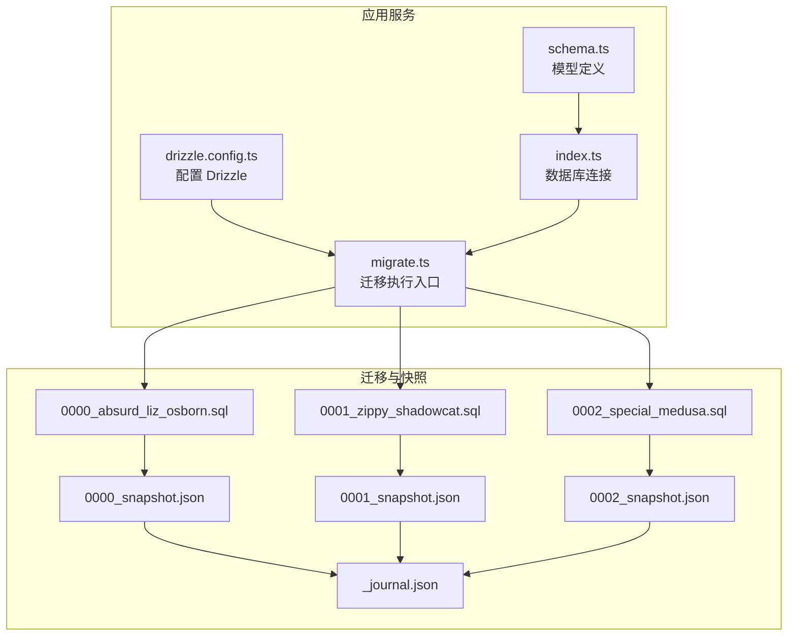
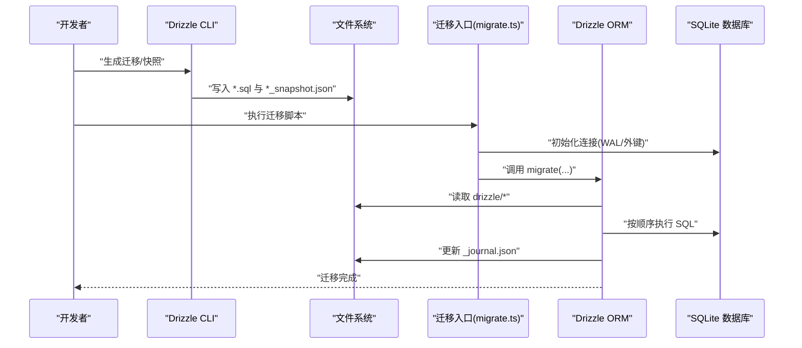
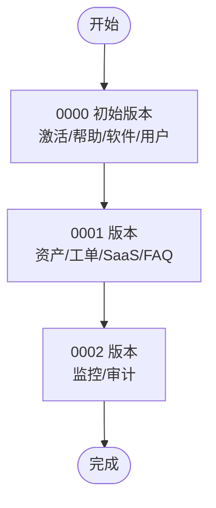
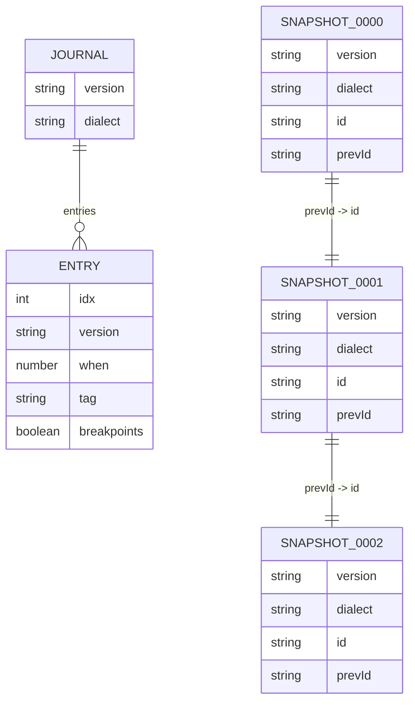
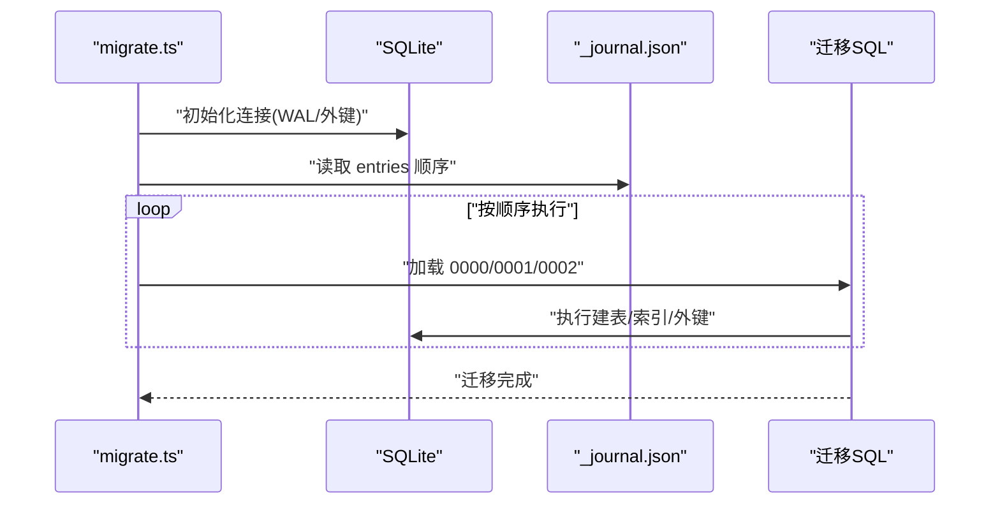
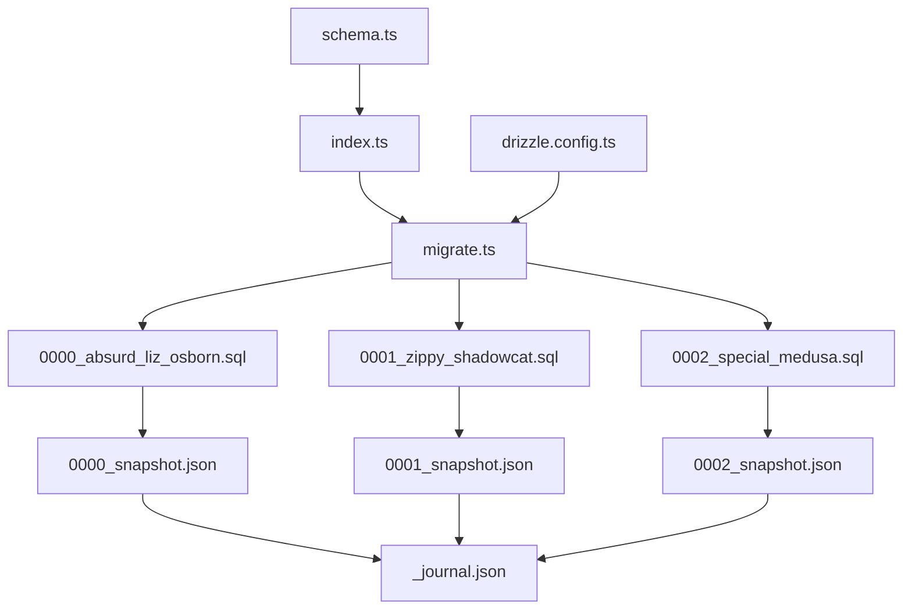

# 数据库迁移管理

<cite>
**本文档引用的文件**
- [drizzle.config.ts](file://apps/server/drizzle.config.ts)
- [migrate.ts](file://apps/server/src/db/migrate.ts)
- [_journal.json](file://apps/server/drizzle/meta/_journal.json)
- [0000_snapshot.json](file://apps/server/drizzle/meta/0000_snapshot.json)
- [0001_snapshot.json](file://apps/server/drizzle/meta/0001_snapshot.json)
- [0002_snapshot.json](file://apps/server/drizzle/meta/0002_snapshot.json)
- [0000_absurd_liz_osborn.sql](file://apps/server/drizzle/0000_absurd_liz_osborn.sql)
- [0001_zippy_shadowcat.sql](file://apps/server/drizzle/0001_zippy_shadowcat.sql)
- [0002_special_medusa.sql](file://apps/server/drizzle/0002_special_medusa.sql)
- [schema.ts](file://apps/server/src/db/schema.ts)
- [index.ts](file://apps/server/src/db/index.ts)
- [seed.ts](file://apps/server/src/db/seed.ts)
- [seed-demo.ts](file://apps/server/src/db/seed-demo.ts)
</cite>

## 目录
1. [引言](#引言)
2. [项目结构](#项目结构)
3. [核心组件](#核心组件)
4. [架构总览](#架构总览)
5. [详细组件分析](#详细组件分析)
6. [依赖关系分析](#依赖关系分析)
7. [性能考量](#性能考量)
8. [故障排查指南](#故障排查指南)
9. [结论](#结论)
10. [附录](#附录)

## 引言
本文件系统性阐述本项目的数据库迁移管理机制，基于 Drizzle ORM 的 SQLite 迁移体系，覆盖从 0000 到 0002 的完整演进历程。重点包括：
- 迁移文件命名规范与版本号管理
- 快照文件（snapshot）与元数据（_journal.json）的职责与作用
- 迁移执行顺序与历史记录
- 最佳实践：回滚策略、数据备份、生产部署注意事项
- 迁移脚本编写规范与测试策略
- 破坏性变更与向后兼容处理

## 项目结构
项目采用“按功能域”组织的多包结构，数据库迁移相关的核心位置如下：
- 配置与入口
  - Drizzle 配置：apps/server/drizzle.config.ts
  - 迁移执行入口：apps/server/src/db/migrate.ts
- 迁移与快照
  - 迁移 SQL：apps/server/drizzle/0000_absurd_liz_osborn.sql 等
  - 快照元数据：apps/server/drizzle/meta/0000_snapshot.json 等
  - 日志元数据：apps/server/drizzle/meta/_journal.json
- 模型定义
  - Drizzle 模式定义：apps/server/src/db/schema.ts
  - 数据库连接与初始化：apps/server/src/db/index.ts

图表来源
- [drizzle.config.ts:1-11](file://apps/server/drizzle.config.ts#L1-L11)
- [migrate.ts:1-18](file://apps/server/src/db/migrate.ts#L1-L18)
- [schema.ts:1-330](file://apps/server/src/db/schema.ts#L1-L330)
- [index.ts:1-16](file://apps/server/src/db/index.ts#L1-L16)
- [0000_absurd_liz_osborn.sql:1-108](file://apps/server/drizzle/0000_absurd_liz_osborn.sql#L1-L108)
- [0001_zippy_shadowcat.sql:1-132](file://apps/server/drizzle/0001_zippy_shadowcat.sql#L1-L132)
- [0002_special_medusa.sql:1-125](file://apps/server/drizzle/0002_special_medusa.sql#L1-L125)
- [0000_snapshot.json:1-757](file://apps/server/drizzle/meta/0000_snapshot.json#L1-L757)
- [0001_snapshot.json:1-800](file://apps/server/drizzle/meta/0001_snapshot.json#L1-L800)
- [0002_snapshot.json:1-800](file://apps/server/drizzle/meta/0002_snapshot.json#L1-L800)
- [_journal.json:1-27](file://apps/server/drizzle/meta/_journal.json#L1-L27)

章节来源
- [drizzle.config.ts:1-11](file://apps/server/drizzle.config.ts#L1-L11)
- [migrate.ts:1-18](file://apps/server/src/db/migrate.ts#L1-L18)
- [schema.ts:1-330](file://apps/server/src/db/schema.ts#L1-L330)
- [index.ts:1-16](file://apps/server/src/db/index.ts#L1-L16)

## 核心组件
- Drizzle 配置
  - 定义 schema.ts 为模型源，输出目录为 ./drizzle，SQLite 方言，数据库凭据来自环境变量 DATABASE_URL 或默认路径。
- 迁移执行入口
  - 初始化 SQLite 数据库，启用 WAL 模式与外键约束，调用 drizzle-orm/better-sqlite3/migrator 执行迁移。
- 快照与日志
  - 每个迁移生成对应的 snapshot.json，记录该版本的数据库结构；_journal.json 记录迁移执行历史与时间戳。

章节来源
- [drizzle.config.ts:1-11](file://apps/server/drizzle.config.ts#L1-L11)
- [migrate.ts:1-18](file://apps/server/src/db/migrate.ts#L1-L18)
- [_journal.json:1-27](file://apps/server/drizzle/meta/_journal.json#L1-L27)

## 架构总览
下图展示了从迁移文件到快照与日志的完整生命周期，以及迁移执行入口如何与 Drizzle 模型交互。

图表来源
- [migrate.ts:1-18](file://apps/server/src/db/migrate.ts#L1-L18)
- [0000_absurd_liz_osborn.sql:1-108](file://apps/server/drizzle/0000_absurd_liz_osborn.sql#L1-L108)
- [0001_zippy_shadowcat.sql:1-132](file://apps/server/drizzle/0001_zippy_shadowcat.sql#L1-L132)
- [0002_special_medusa.sql:1-125](file://apps/server/drizzle/0002_special_medusa.sql#L1-L125)
- [_journal.json:1-27](file://apps/server/drizzle/meta/_journal.json#L1-L27)

## 详细组件分析

### 迁移文件与快照：从 0000 到 0002 的演进
- 0000_absurd_liz_osborn.sql
  - 创建激活系统与帮助文档相关表，包含 activation_*、help_*、software_*、users、sessions 等。
  - 对应快照 0000_snapshot.json，记录初始数据库结构。
- 0001_zippy_shadowcat.sql
  - 新增资产管理与工单系统相关表：assets、asset_approvals、asset_records、asset_categories、faq_entries、tickets、ticket_replies 等。
  - 新增 saas_* 与 files 外键关联。
  - 对应快照 0001_snapshot.json。
- 0002_special_medusa.sql
  - 新增运维监控系统与审计日志：audit_logs、monitor_* 等表。
  - 对应快照 0002_snapshot.json。

图表来源
- [0000_absurd_liz_osborn.sql:1-108](file://apps/server/drizzle/0000_absurd_liz_osborn.sql#L1-L108)
- [0001_zippy_shadowcat.sql:1-132](file://apps/server/drizzle/0001_zippy_shadowcat.sql#L1-L132)
- [0002_special_medusa.sql:1-125](file://apps/server/drizzle/0002_special_medusa.sql#L1-L125)

章节来源
- [0000_absurd_liz_osborn.sql:1-108](file://apps/server/drizzle/0000_absurd_liz_osborn.sql#L1-L108)
- [0001_zippy_shadowcat.sql:1-132](file://apps/server/drizzle/0001_zippy_shadowcat.sql#L1-L132)
- [0002_special_medusa.sql:1-125](file://apps/server/drizzle/0002_special_medusa.sql#L1-L125)
- [0000_snapshot.json:1-757](file://apps/server/drizzle/meta/0000_snapshot.json#L1-L757)
- [0001_snapshot.json:1-800](file://apps/server/drizzle/meta/0001_snapshot.json#L1-L800)
- [0002_snapshot.json:1-800](file://apps/server/drizzle/meta/0002_snapshot.json#L1-L800)

### 快照文件与元数据管理
- 快照（*_snapshot.json）
  - 记录每个迁移版本的数据库结构（表、列、索引、外键、唯一约束等），用于生成迁移 SQL 与校验一致性。
  - 三个快照分别对应 0000、0001、0002 版本。
- 元数据（_journal.json）
  - 记录迁移执行历史：版本号、时间戳、标签（tag）、断点标记等。
  - entries 数组按顺序记录每次迁移的 idx、version、when、tag。

图表来源
- [_journal.json:1-27](file://apps/server/drizzle/meta/_journal.json#L1-L27)
- [0000_snapshot.json:1-757](file://apps/server/drizzle/meta/0000_snapshot.json#L1-L757)
- [0001_snapshot.json:1-800](file://apps/server/drizzle/meta/0001_snapshot.json#L1-L800)
- [0002_snapshot.json:1-800](file://apps/server/drizzle/meta/0002_snapshot.json#L1-L800)

章节来源
- [_journal.json:1-27](file://apps/server/drizzle/meta/_journal.json#L1-L27)
- [0000_snapshot.json:1-757](file://apps/server/drizzle/meta/0000_snapshot.json#L1-L757)
- [0001_snapshot.json:1-800](file://apps/server/drizzle/meta/0001_snapshot.json#L1-L800)
- [0002_snapshot.json:1-800](file://apps/server/drizzle/meta/0002_snapshot.json#L1-L800)

### 迁移执行流程与顺序
- 执行入口
  - migrate.ts 初始化 SQLite，启用 WAL 与外键，随后调用 migrate(db, { migrationsFolder })。
- 执行顺序
  - Drizzle 依据 _journal.json 中 entries 的顺序执行迁移，确保幂等与一致性。
- 顺序验证
  - 0000 → 0001 → 0002 的顺序在 _journal.json 中明确体现。

图表来源
- [migrate.ts:1-18](file://apps/server/src/db/migrate.ts#L1-L18)
- [_journal.json:1-27](file://apps/server/drizzle/meta/_journal.json#L1-L27)
- [0000_absurd_liz_osborn.sql:1-108](file://apps/server/drizzle/0000_absurd_liz_osborn.sql#L1-L108)
- [0001_zippy_shadowcat.sql:1-132](file://apps/server/drizzle/0001_zippy_shadowcat.sql#L1-L132)
- [0002_special_medusa.sql:1-125](file://apps/server/drizzle/0002_special_medusa.sql#L1-L125)

章节来源
- [migrate.ts:1-18](file://apps/server/src/db/migrate.ts#L1-L18)
- [_journal.json:1-27](file://apps/server/drizzle/meta/_journal.json#L1-L27)

### 迁移历史记录与版本演进轨迹
- 历史记录
  - _journal.json 的 entries 数组记录了三次迁移的执行时间戳与标签，形成可追溯的历史。
- 版本演进
  - 0000：基础激活与帮助系统
  - 0001：引入资产与工单、SaaS、FAQ
  - 0002：引入监控与审计

图表来源
- [_journal.json:1-27](file://apps/server/drizzle/meta/_journal.json#L1-L27)

章节来源
- [_journal.json:1-27](file://apps/server/drizzle/meta/_journal.json#L1-L27)

### 迁移脚本编写规范与测试策略
- 编写规范
  - 命名规范：四位版本号 + 下划线 + 标识词.sql（如 0000_absurd_liz_osborn.sql）。
  - 快照生成：每次修改 schema.ts 后，使用 Drizzle CLI 生成迁移与快照。
  - 幂等性：确保重复执行不会产生副作用。
  - 破坏性变更：优先使用 ALTER TABLE 与索引/约束重建，避免 DROP/RECREATE。
- 测试策略
  - 单元测试：对 schema.ts 的模型定义进行单元测试，验证字段、约束与枚举。
  - 集成测试：在临时数据库中执行迁移，验证表结构与外键关系。
  - 回归测试：在每次迁移后运行种子脚本，确保业务数据可用。

章节来源
- [schema.ts:1-330](file://apps/server/src/db/schema.ts#L1-L330)
- [seed.ts:1-98](file://apps/server/src/db/seed.ts#L1-L98)
- [seed-demo.ts:1-800](file://apps/server/src/db/seed-demo.ts#L1-L800)

### 破坏性变更与向后兼容
- 破坏性变更处理
  - 字段删除/重命名：先新增字段，迁移数据，再删除旧字段。
  - 索引/唯一约束：先删除旧约束，再创建新约束，避免锁表时间过长。
  - 大表重构：分批处理，使用事务包裹，必要时拆分为多个小迁移。
- 向后兼容
  - 枚举值扩展：新增值不影响现有数据。
  - 默认值变更：仅影响新插入记录，已有数据保持不变。

## 依赖关系分析
- 组件耦合
  - schema.ts 与 index.ts 通过 drizzle 初始化连接，供迁移与业务逻辑共享。
  - migrate.ts 依赖 drizzle-orm/better-sqlite3/migrator 执行迁移。
  - 迁移 SQL 与快照相互依赖，_journal.json 记录执行顺序。
- 外部依赖
  - better-sqlite3：SQLite 驱动与 WAL/外键配置。
  - drizzle-orm：ORM 与迁移工具链。

图表来源
- [schema.ts:1-330](file://apps/server/src/db/schema.ts#L1-L330)
- [index.ts:1-16](file://apps/server/src/db/index.ts#L1-L16)
- [migrate.ts:1-18](file://apps/server/src/db/migrate.ts#L1-L18)
- [drizzle.config.ts:1-11](file://apps/server/drizzle.config.ts#L1-L11)
- [0000_absurd_liz_osborn.sql:1-108](file://apps/server/drizzle/0000_absurd_liz_osborn.sql#L1-L108)
- [0001_zippy_shadowcat.sql:1-132](file://apps/server/drizzle/0001_zippy_shadowcat.sql#L1-L132)
- [0002_special_medusa.sql:1-125](file://apps/server/drizzle/0002_special_medusa.sql#L1-L125)
- [0000_snapshot.json:1-757](file://apps/server/drizzle/meta/0000_snapshot.json#L1-L757)
- [0001_snapshot.json:1-800](file://apps/server/drizzle/meta/0001_snapshot.json#L1-L800)
- [0002_snapshot.json:1-800](file://apps/server/drizzle/meta/0002_snapshot.json#L1-L800)
- [_journal.json:1-27](file://apps/server/drizzle/meta/_journal.json#L1-L27)

章节来源
- [schema.ts:1-330](file://apps/server/src/db/schema.ts#L1-L330)
- [index.ts:1-16](file://apps/server/src/db/index.ts#L1-L16)
- [migrate.ts:1-18](file://apps/server/src/db/migrate.ts#L1-L18)
- [drizzle.config.ts:1-11](file://apps/server/drizzle.config.ts#L1-L11)

## 性能考量
- WAL 模式
  - 启用 WAL 提升并发读性能，减少锁竞争。
- 外键约束
  - 开启外键约束保证数据一致性，但会增加写入成本。
- 迁移执行
  - 大表迁移建议分批、分阶段，避免长时间锁表。
- 快照与日志
  - 快照用于生成 SQL，日志用于追踪执行历史，二者均需纳入版本控制。

## 故障排查指南
- 迁移失败
  - 检查 _journal.json 是否记录了中断点，确认最后一次成功迁移的 idx。
  - 对比对应快照与 SQL，确认结构差异。
- 数据不一致
  - 使用 seed.ts 或 seed-demo.ts 重建最小可用数据集，验证迁移后的数据完整性。
- 生产回滚
  - 由于 SQLite 的限制，建议通过备份恢复到迁移前的状态，或在迁移前导出 schema 与数据。

章节来源
- [_journal.json:1-27](file://apps/server/drizzle/meta/_journal.json#L1-L27)
- [seed.ts:1-98](file://apps/server/src/db/seed.ts#L1-L98)
- [seed-demo.ts:1-800](file://apps/server/src/db/seed-demo.ts#L1-L800)

## 结论
本项目基于 Drizzle ORM 的 SQLite 迁移体系，实现了从 0000 到 0002 的平滑演进。通过规范化的命名、严格的快照与日志管理、以及幂等的迁移执行，确保了数据库结构的可控演进与可追溯性。建议在生产环境中严格遵循备份与回滚策略，并在每次迁移前后进行充分测试。

## 附录
- 命名规范
  - 迁移文件：四位版本号 + 下划线 + 标识词.sql（如 0000_absurd_liz_osborn.sql）
  - 快照文件：四位版本号 + _snapshot.json（如 0000_snapshot.json）
  - 日志文件：_journal.json
- 最佳实践清单
  - 迁移前备份数据库
  - 使用幂等 SQL，避免破坏性变更
  - 在测试环境先行验证
  - 将快照与日志纳入版本控制
  - 生产部署前进行回滚演练