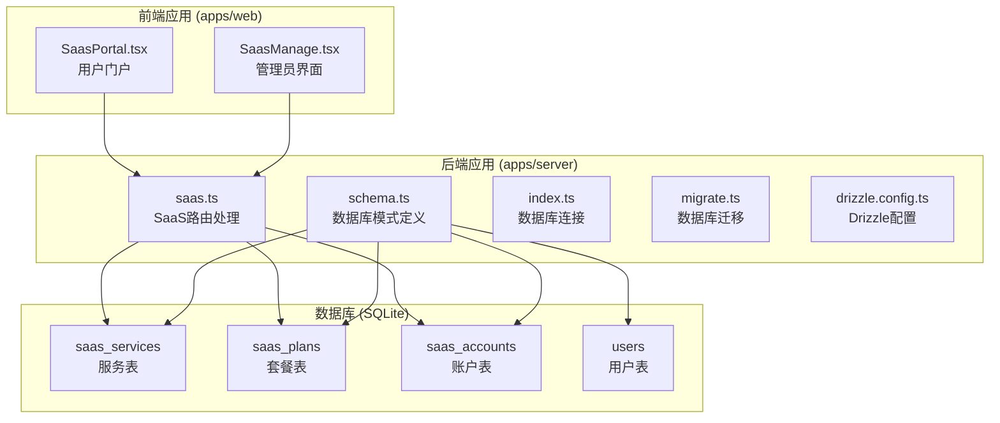
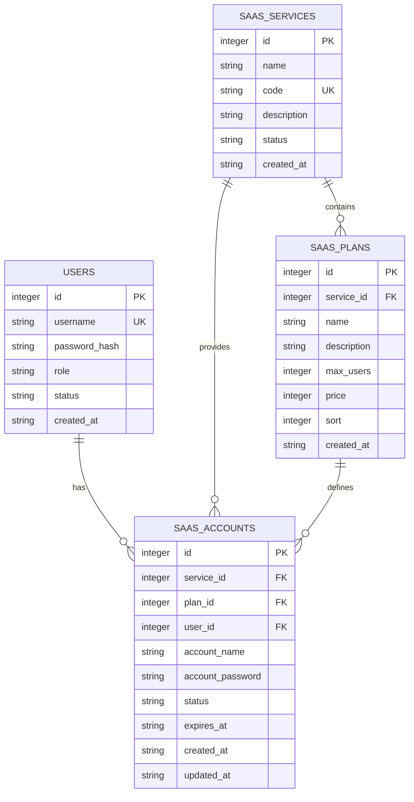
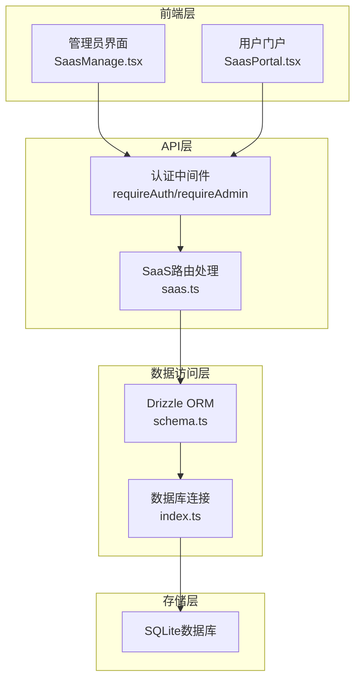
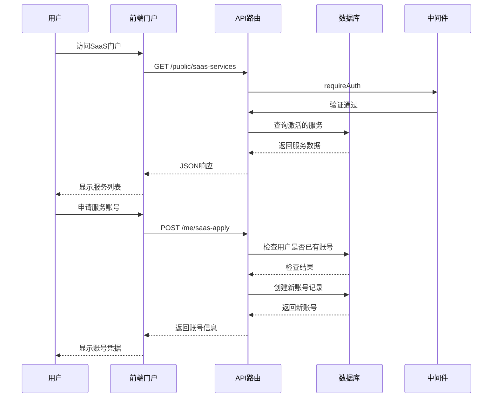
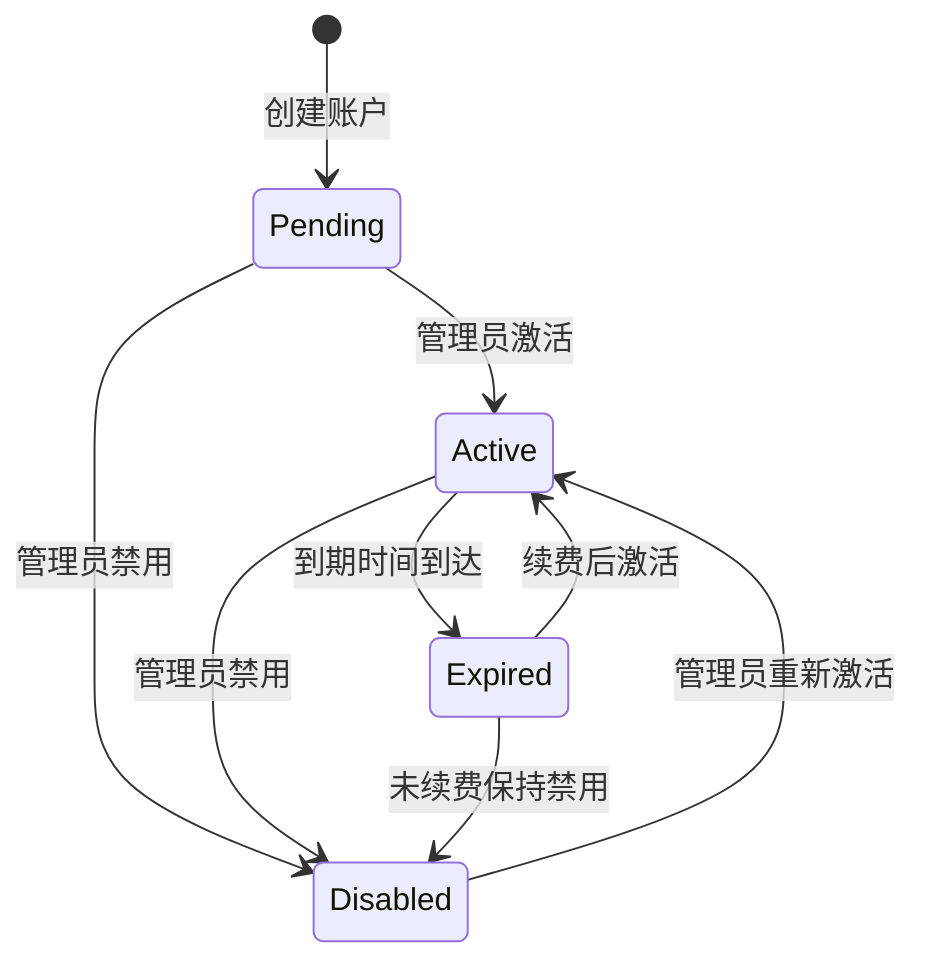
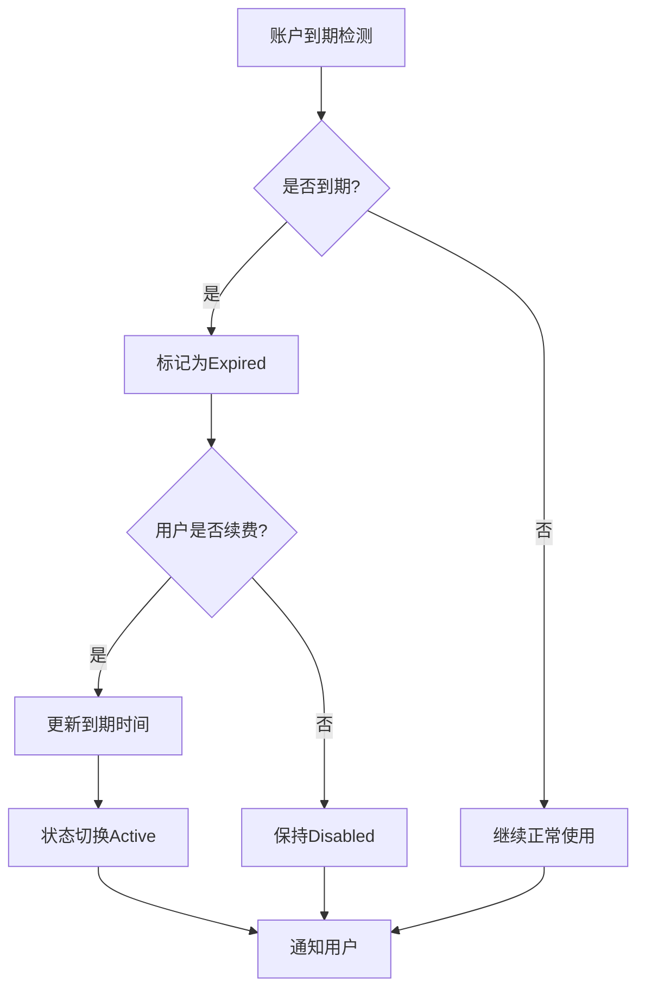
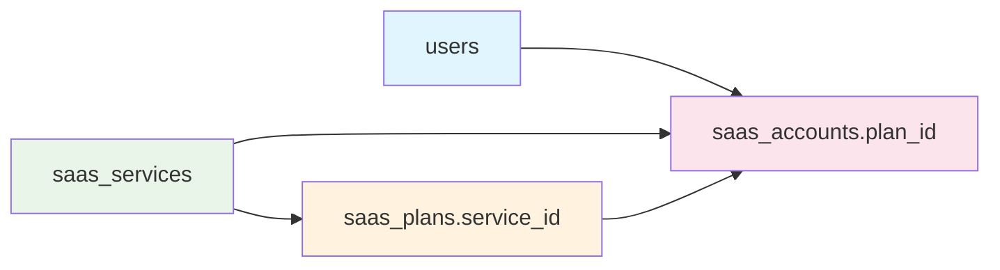

# SaaS管理模型

<cite>
**本文档引用的文件**
- [schema.ts](file://apps/server/src/db/schema.ts)
- [saas.ts](file://apps/server/src/routes/saas.ts)
- [SaasManage.tsx](file://apps/web/src/pages/admin/SaasManage.tsx)
- [SaasPortal.tsx](file://apps/web/src/pages/SaasPortal.tsx)
- [index.ts](file://apps/server/src/db/index.ts)
- [drizzle.config.ts](file://apps/server/drizzle.config.ts)
- [migrate.ts](file://apps/server/src/db/migrate.ts)
- [seed.ts](file://apps/server/src/db/seed.ts)
</cite>

## 目录
1. [简介](#简介)
2. [项目结构](#项目结构)
3. [核心组件](#核心组件)
4. [架构概览](#架构概览)
5. [详细组件分析](#详细组件分析)
6. [依赖关系分析](#依赖关系分析)
7. [性能考虑](#性能考虑)
8. [故障排除指南](#故障排除指南)
9. [结论](#结论)

## 简介

本文件详细阐述了SaaS管理系统的数据模型设计，重点分析了三个核心表：`saasServices`服务表、`saasPlans`套餐表和`saasAccounts`账户表。该系统实现了完整的SaaS服务生命周期管理，包括服务状态管理、套餐配置、用户账户管理和订阅计费等功能。

系统采用SQLite作为数据库存储，使用Drizzle ORM进行数据建模，并通过Fastify框架提供RESTful API接口。前端采用React + Ant Design构建管理界面和用户门户。

## 项目结构

SaaS管理系统位于`apps/server`和`apps/web`目录中，采用前后端分离的架构设计：



**图表来源**
- [schema.ts:171-203](file://apps/server/src/db/schema.ts#L171-L203)
- [saas.ts:14-160](file://apps/server/src/routes/saas.ts#L14-L160)

**章节来源**
- [schema.ts:1-330](file://apps/server/src/db/schema.ts#L1-L330)
- [drizzle.config.ts:1-11](file://apps/server/drizzle.config.ts#L1-L11)

## 核心组件

### 数据库模式设计

系统采用三层数据模型设计，通过外键关系实现数据完整性：



**图表来源**
- [schema.ts:3-10](file://apps/server/src/db/schema.ts#L3-L10)
- [schema.ts:171-203](file://apps/server/src/db/schema.ts#L171-L203)

### 关键字段说明

| 表名 | 字段名 | 类型 | 约束 | 描述 |
|------|--------|------|------|------|
| saasServices | id | integer | 主键, 自增 | 服务唯一标识 |
| saasServices | code | string | 唯一索引 | 服务编码 |
| saasServices | status | enum | 默认active | 服务状态(active/disabled) |
| saasPlans | maxUsers | integer | 默认0 | 最大用户数限制 |
| saasPlans | price | integer | 默认0 | 价格(分) |
| saasPlans | sort | integer | 默认0 | 排序权重 |
| saasAccounts | status | enum | 默认pending | 账户状态 |
| saasAccounts | expiresAt | datetime | 可空 | 到期时间 |

**章节来源**
- [schema.ts:171-203](file://apps/server/src/db/schema.ts#L171-L203)

## 架构概览

### 系统架构图



**图表来源**
- [saas.ts:14-160](file://apps/server/src/routes/saas.ts#L14-L160)
- [index.ts:1-16](file://apps/server/src/db/index.ts#L1-L16)

### 数据流处理



**图表来源**
- [saas.ts:123-146](file://apps/server/src/routes/saas.ts#L123-L146)
- [SaasPortal.tsx:31-40](file://apps/web/src/pages/SaasPortal.tsx#L31-L40)

## 详细组件分析

### SaaS服务表 (saasServices)

#### 设计原理

`saasServices`表是整个SaaS系统的核心，用于管理可提供的云服务。每个服务都有唯一的编码(code)，便于系统内部识别和外部集成。

#### 状态管理

服务状态采用枚举类型，支持两种状态：
- `active`: 服务可用，用户可在门户看到并申请
- `disabled`: 服务不可用，用户无法申请

#### 业务用途

- 作为套餐和账户的父级实体
- 控制服务的可见性和可用性
- 支持多服务并存的场景

**章节来源**
- [schema.ts:171-179](file://apps/server/src/db/schema.ts#L171-L179)
- [saas.ts:16-43](file://apps/server/src/routes/saas.ts#L16-L43)

### SaaS套餐表 (saasPlans)

#### 设计原理

`saasPlans`表为服务提供具体的定价和容量方案。每个套餐都与特定服务关联，形成一对多的关系。

#### 关键配置参数

| 参数 | 类型 | 默认值 | 说明 |
|------|------|--------|------|
| maxUsers | integer | 0 | 最大用户数限制，0表示无限制 |
| price | integer | 0 | 价格，单位为分 |
| sort | integer | 0 | 排序权重，数值越大排序越靠前 |

#### 排序机制

套餐按`sort`字段升序排列，实现灵活的展示顺序控制。管理员可以调整`sort`值来改变用户界面中的显示顺序。

#### 价格设置

价格以"分"为单位存储，支持整数金额设置。这种设计避免了浮点数精度问题，适合金融计算场景。

**章节来源**
- [schema.ts:181-190](file://apps/server/src/db/schema.ts#L181-L190)
- [saas.ts:46-71](file://apps/server/src/routes/saas.ts#L46-L71)

### SaaS账户表 (saasAccounts)

#### 设计原理

`saasAccounts`表管理用户与服务的具体关联关系，实现细粒度的权限和资源控制。

#### 状态管理

账户状态采用四状态模型：
- `pending`: 待激活，初始状态
- `active`: 活跃状态，正常使用
- `disabled`: 已禁用，管理员可临时阻止使用
- `expired`: 已过期，需要续费或重新激活

#### 到期时间控制

`expiresAt`字段支持可空设计，允许：
- 无限期有效：`expiresAt`为null
- 有限期有效：设置具体到期时间
- 动态管理：管理员可随时修改到期时间

#### 用户与账户关联

通过`userId`外键与用户表关联，实现一对一或多对一的账户管理模式。

**章节来源**
- [schema.ts:192-203](file://apps/server/src/db/schema.ts#L192-L203)
- [saas.ts:74-120](file://apps/server/src/routes/saas.ts#L74-L120)

### 订阅管理与计费流程

#### 订阅生命周期



#### 计费周期管理

系统支持灵活的计费周期设置：
- **一次性付费**: 设置`expiresAt`为未来某个时间点
- **周期性付费**: 通过外部支付系统处理续费
- **免费试用**: 设置短期试用期，到期后自动转为禁用

#### 续费流程



**图表来源**
- [schema.ts:199](file://apps/server/src/db/schema.ts#L199)
- [saas.ts:112-120](file://apps/server/src/routes/saas.ts#L112-L120)

## 依赖关系分析

### 外键约束关系



**图表来源**
- [schema.ts:171-203](file://apps/server/src/db/schema.ts#L171-L203)

### API路由依赖

| 路由 | 方法 | 权限 | 功能 |
|------|------|------|------|
| /api/admin/saas-services | GET | requireAdmin | 获取所有服务 |
| /api/admin/saas-services | POST | requireAdmin | 创建服务 |
| /api/admin/saas-services/:id | PUT | requireAdmin | 更新服务 |
| /api/admin/saas-plans | POST | requireAdmin | 创建套餐 |
| /api/admin/saas-plans/:id | PUT/DELETE | requireAdmin | 更新/删除套餐 |
| /api/admin/saas-accounts | GET | requireAdmin | 管理员查看账户 |
| /api/admin/saas-accounts | POST | requireAdmin | 手动开通账户 |
| /api/me/saas-apply | POST | requireAuth | 用户申请账户 |
| /api/me/saas-accounts | GET | requireAuth | 查看个人账户 |

**章节来源**
- [saas.ts:14-160](file://apps/server/src/routes/saas.ts#L14-L160)

## 性能考虑

### 数据库优化策略

1. **索引设计**
   - `saasServices.code`: 唯一索引，支持快速查找
   - `saasAccounts.userId`: 外键索引，加速用户查询
   - `saasAccounts.serviceId`: 外键索引，加速服务查询

2. **查询优化**
   - 使用JOIN查询减少往返次数
   - 合理使用WHERE条件过滤数据
   - 避免SELECT *，只选择必要字段

3. **缓存策略**
   - 活跃服务列表可缓存
   - 套餐配置可缓存
   - 用户账户信息可短期缓存

### 扩展性考虑

1. **水平扩展**
   - SQLite适合中小规模部署
   - 可迁移到PostgreSQL支持更大规模
   - 支持读写分离架构

2. **功能扩展**
   - 支持多租户模式
   - 添加订阅计划表
   - 实现自动续费机制
   - 集成第三方支付系统

3. **监控指标**
   - 账户状态统计
   - 服务使用率监控
   - 收入统计报表

## 故障排除指南

### 常见问题诊断

1. **服务不可见**
   - 检查`saasServices.status`是否为`active`
   - 验证`saasServices.code`是否唯一
   - 确认用户是否有相应权限

2. **账户申请失败**
   - 检查用户是否存在且状态正常
   - 验证是否已存在相同服务的账户
   - 确认套餐配置是否正确

3. **密码重置问题**
   - 检查生成的密码是否正确存储
   - 验证前端是否正确显示密码
   - 确认数据库连接正常

### 调试建议

1. **数据库层面**
   ```sql
   -- 检查服务状态
   SELECT * FROM saas_services WHERE status = 'active';
   
   -- 检查用户账户
   SELECT * FROM saas_accounts WHERE user_id = ?;
   
   -- 检查套餐配置
   SELECT * FROM saas_plans ORDER BY sort;
   ```

2. **API层面**
   - 启用详细日志记录
   - 检查请求参数验证
   - 验证响应格式一致性

**章节来源**
- [saas.ts:88-100](file://apps/server/src/routes/saas.ts#L88-L100)
- [saas.ts:132-146](file://apps/server/src/routes/saas.ts#L132-L146)

## 结论

SaaS管理系统采用了清晰的数据模型设计，通过三层表结构实现了服务、套餐和账户的有效管理。系统具备以下优势：

1. **设计简洁**: 三表模型满足大多数SaaS场景需求
2. **状态完整**: 支持完整的生命周期管理
3. **扩展性强**: 易于添加新的功能特性
4. **性能良好**: 合理的索引和查询优化

对于生产环境，建议进一步完善以下方面：
- 添加审计日志功能
- 实现自动到期检测机制
- 集成专业的支付系统
- 增加监控和告警功能
- 支持多租户架构

该系统为后续的功能扩展奠定了良好的基础，能够满足从简单到复杂的各种SaaS管理需求。