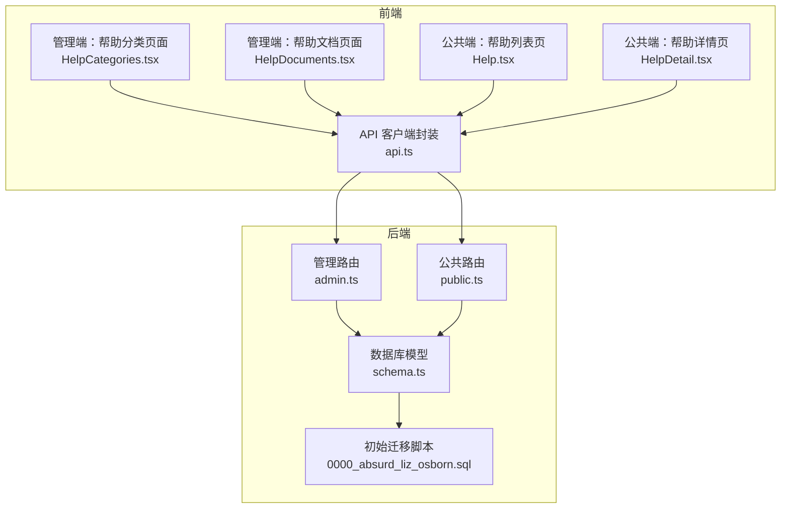
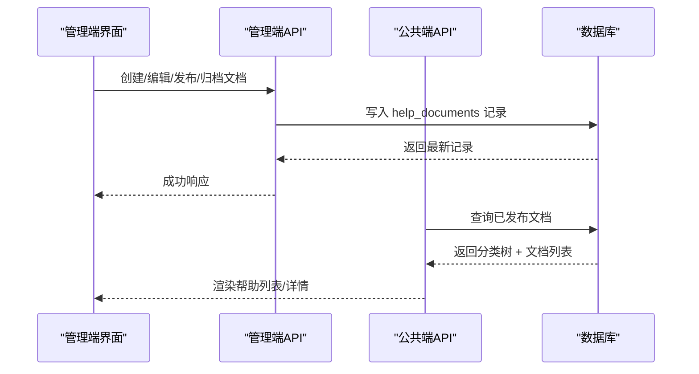
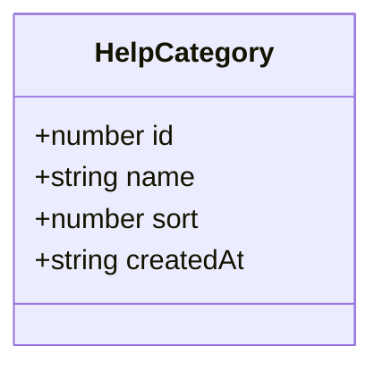
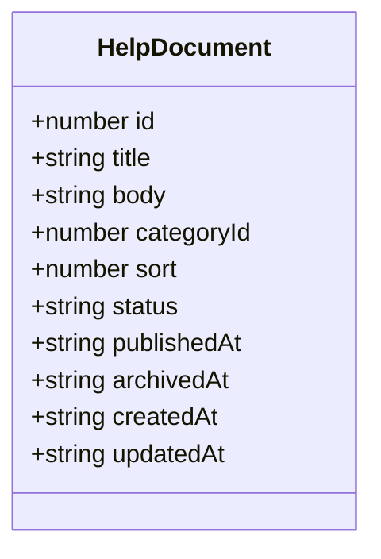
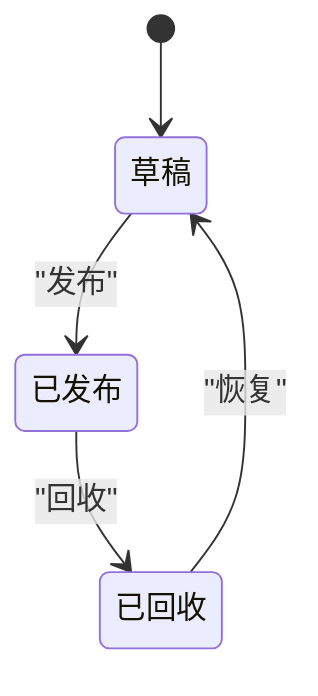
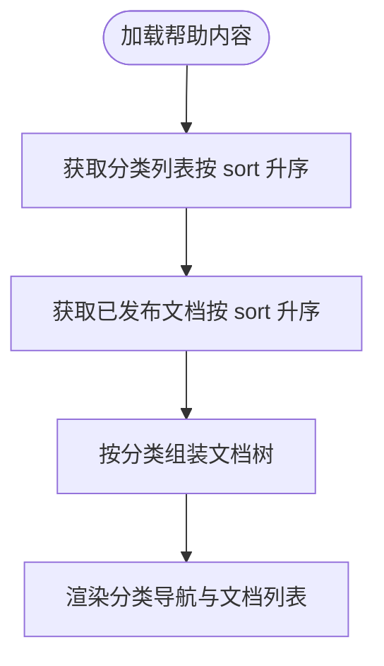
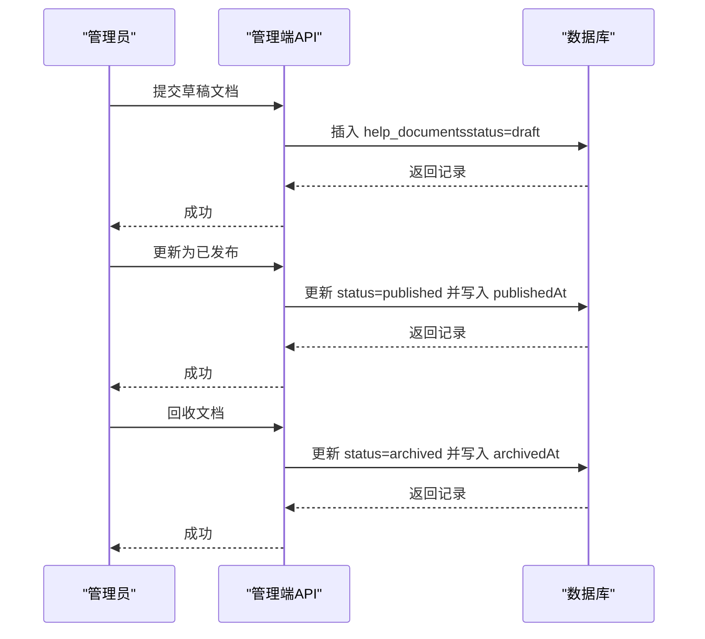
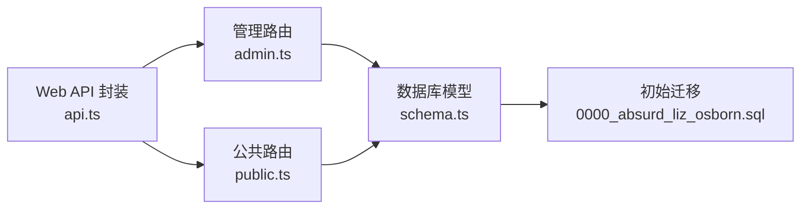
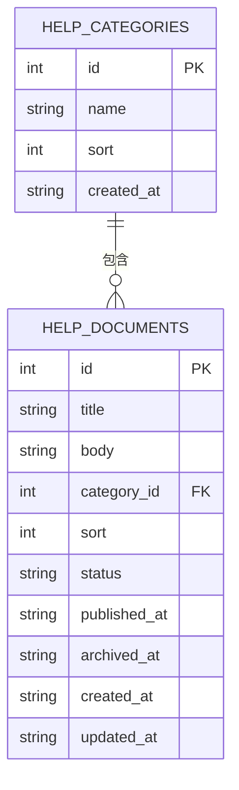

# 内容管理模型

<cite>
**本文引用的文件**
- [schema.ts](file://apps/server/src/db/schema.ts)
- [0000_absurd_liz_osborn.sql](file://apps/server/drizzle/0000_absurd_liz_osborn.sql)
- [_journal.json](file://apps/server/drizzle/meta/_journal.json)
- [admin.ts](file://apps/server/src/routes/admin.ts)
- [public.ts](file://apps/server/src/routes/public.ts)
- [HelpCategories.tsx](file://apps/web/src/pages/admin/HelpCategories.tsx)
- [HelpDocuments.tsx](file://apps/web/src/pages/admin/HelpDocuments.tsx)
- [Help.tsx](file://apps/web/src/pages/Help.tsx)
- [HelpDetail.tsx](file://apps/web/src/pages/HelpDetail.tsx)
- [api.ts](file://apps/web/src/lib/api.ts)
- [schemas.ts](file://packages/shared/src/schemas.ts)
- [types.ts](file://packages/shared/src/types.ts)
</cite>

## 目录
1. [简介](#简介)
2. [项目结构](#项目结构)
3. [核心组件](#核心组件)
4. [架构总览](#架构总览)
5. [详细组件分析](#详细组件分析)
6. [依赖关系分析](#依赖关系分析)
7. [性能考量](#性能考量)
8. [故障排查指南](#故障排查指南)
9. [结论](#结论)
10. [附录](#附录)

## 简介
本文件聚焦于内容管理系统中的“帮助分类”与“帮助文档”两大数据模型，系统性阐述其设计原理、业务用途、排序机制、状态管理、发布控制以及前端展示与交互。同时给出搜索优化、关键词管理与分类导航的设计建议，并提供从创建到归档的完整工作流程示例。

## 项目结构
后端采用 SQLite + Drizzle ORM，前端使用 Ant Design + React，通过 REST 接口进行数据交互。帮助系统分为两类接口：
- 管理端接口：仅管理员可访问，用于维护分类与文档
- 公共接口：面向最终用户，用于浏览已发布帮助内容

图表来源
- [HelpCategories.tsx:1-70](file://apps/web/src/pages/admin/HelpCategories.tsx#L1-L70)
- [HelpDocuments.tsx:1-112](file://apps/web/src/pages/admin/HelpDocuments.tsx#L1-L112)
- [Help.tsx:1-61](file://apps/web/src/pages/Help.tsx#L1-L61)
- [HelpDetail.tsx:1-38](file://apps/web/src/pages/HelpDetail.tsx#L1-L38)
- [api.ts:1-16](file://apps/web/src/lib/api.ts#L1-L16)
- [admin.ts:75-134](file://apps/server/src/routes/admin.ts#L75-L134)
- [public.ts:26-44](file://apps/server/src/routes/public.ts#L26-L44)
- [schema.ts:51-69](file://apps/server/src/db/schema.ts#L51-L69)
- [0000_absurd_liz_osborn.sql:46-65](file://apps/server/drizzle/0000_absurd_liz_osborn.sql#L46-L65)

章节来源
- [admin.ts:75-134](file://apps/server/src/routes/admin.ts#L75-L134)
- [public.ts:26-44](file://apps/server/src/routes/public.ts#L26-L44)
- [schema.ts:51-69](file://apps/server/src/db/schema.ts#L51-L69)
- [0000_absurd_liz_osborn.sql:46-65](file://apps/server/drizzle/0000_absurd_liz_osborn.sql#L46-L65)

## 核心组件
- 帮助分类表（helpCategories）
  - 字段：自增 ID、名称、排序字段、创建时间
  - 排序：按 sort 升序排列，支持拖拽或手动调整顺序
  - 作用：对帮助文档进行分组，便于导航与检索
- 帮助文档表（helpDocuments）
  - 字段：自增 ID、标题、正文、所属分类、排序、状态、发布时间、归档时间、创建/更新时间
  - 关键约束：categoryId 外键关联 helpCategories；状态为 draft/published/archived 枚举
  - 发布控制：状态为 published 的文档才会在公共端显示

章节来源
- [schema.ts:51-69](file://apps/server/src/db/schema.ts#L51-L69)
- [0000_absurd_liz_osborn.sql:46-65](file://apps/server/drizzle/0000_absurd_liz_osborn.sql#L46-L65)
- [admin.ts:75-134](file://apps/server/src/routes/admin.ts#L75-L134)
- [public.ts:26-44](file://apps/server/src/routes/public.ts#L26-L44)

## 架构总览
帮助系统遵循“管理端写入 + 公共端只读”的设计原则：
- 管理端负责创建/编辑/发布/归档文档，维护分类与排序
- 公共端仅查询已发布文档，按分类聚合展示
- 数据一致性由后端路由层保证，前端仅负责 UI 展示与交互

图表来源
- [admin.ts:102-134](file://apps/server/src/routes/admin.ts#L102-L134)
- [public.ts:26-44](file://apps/server/src/routes/public.ts#L26-L44)
- [schema.ts:58-69](file://apps/server/src/db/schema.ts#L58-L69)

## 详细组件分析

### 帮助分类表（helpCategories）
- 设计要点
  - 名称唯一性：前端表单校验要求必填且长度限制，后端 Zod 模式进一步约束
  - 排序字段：整型 sort，默认 0，升序排列，支持拖拽或数值调整
  - 时间戳：createdAt 自动填充
- 管理功能
  - 新增/编辑：表单提交至 /api/admin/help-categories
  - 删除：调用删除接口，级联删除对应文档（需注意外键约束）
- 前端实现
  - 列表展示：ID、名称、排序、操作（编辑/删除）
  - 表单：名称必填，排序默认 0，支持输入数字

图表来源
- [schema.ts:51-56](file://apps/server/src/db/schema.ts#L51-L56)
- [HelpCategories.tsx:12-34](file://apps/web/src/pages/admin/HelpCategories.tsx#L12-L34)

章节来源
- [schema.ts:51-56](file://apps/server/src/db/schema.ts#L51-L56)
- [HelpCategories.tsx:12-34](file://apps/web/src/pages/admin/HelpCategories.tsx#L12-L34)
- [admin.ts:75-100](file://apps/server/src/routes/admin.ts#L75-L100)

### 帮助文档表（helpDocuments）
- 设计要点
  - 标题与正文：标题必填，正文支持 Markdown
  - 分类关联：categoryId 外键，确保文档归属有效分类
  - 排序字段：整型 sort，默认 0，升序排列
  - 状态管理：draft（草稿）、published（已发布）、archived（已回收）
  - 时间控制：createdAt/updatedAt 自动更新；publishedAt/archivedAt 在状态变更时写入
- 管理功能
  - 新增/编辑：表单提交至 /api/admin/help-documents
  - 状态切换：草稿 -> 发布；发布 -> 回收；回收 -> 草稿
  - 删除：调用删除接口
- 公共端展示
  - 列表：按分类聚合，仅显示状态为 published 的文档
  - 详情：按 ID 获取，仅当状态为 published 才返回

图表来源
- [schema.ts:58-69](file://apps/server/src/db/schema.ts#L58-L69)
- [HelpDocuments.tsx:12-53](file://apps/web/src/pages/admin/HelpDocuments.tsx#L12-L53)
- [public.ts:26-44](file://apps/server/src/routes/public.ts#L26-L44)

章节来源
- [schema.ts:58-69](file://apps/server/src/db/schema.ts#L58-L69)
- [HelpDocuments.tsx:12-53](file://apps/web/src/pages/admin/HelpDocuments.tsx#L12-L53)
- [admin.ts:102-134](file://apps/server/src/routes/admin.ts#L102-L134)
- [public.ts:26-44](file://apps/server/src/routes/public.ts#L26-L44)

### 状态枚举与工作流
- 状态定义
  - draft：草稿，不对外展示
  - published：已发布，公共端可见
  - archived：已回收，不对外展示
- 工作流
  - 创建文档：默认 draft
  - 发布：将状态改为 published，并写入 publishedAt
  - 回收：将状态改为 archived，并写入 archivedAt
  - 恢复：将状态改为 draft
- 审批机制
  - 当前实现未见显式的审批流程（如多级审核），状态切换由管理员直接操作
  - 如需引入审批，可在状态变更处增加审批请求与审批结果回写逻辑

图表来源
- [admin.ts:117-128](file://apps/server/src/routes/admin.ts#L117-L128)
- [HelpDocuments.tsx:49-53](file://apps/web/src/pages/admin/HelpDocuments.tsx#L49-L53)

章节来源
- [admin.ts:117-128](file://apps/server/src/routes/admin.ts#L117-L128)
- [HelpDocuments.tsx:49-53](file://apps/web/src/pages/admin/HelpDocuments.tsx#L49-L53)

### 排序机制与分类管理
- 分类排序
  - 后端按 sort 升序返回分类列表
  - 前端表单允许设置 sort 值，支持数值调整
- 文档排序
  - 后端按 sort 升序返回文档列表
  - 支持在管理端调整排序值
- 分类导航
  - 公共端按分类聚合文档，点击进入详情页

图表来源
- [public.ts:26-44](file://apps/server/src/routes/public.ts#L26-L44)
- [Help.tsx:21-57](file://apps/web/src/pages/Help.tsx#L21-L57)

章节来源
- [public.ts:26-44](file://apps/server/src/routes/public.ts#L26-L44)
- [Help.tsx:21-57](file://apps/web/src/pages/Help.tsx#L21-L57)

### 搜索优化、关键词管理与分类导航设计
- 搜索优化建议
  - 建议在 helpDocuments 中增加 keywords 字段（逗号分隔关键词），便于全文检索
  - 公共端提供搜索框，按标题/关键词/分类过滤
- 关键词管理
  - 可参考 FAQ 模块的 keywords 字段设计，统一关键词格式与索引策略
- 分类导航
  - 保持分类树形结构，支持折叠/展开
  - 文档列表按 sort 升序，避免随机顺序影响用户体验

章节来源
- [faqEntries:206-214](file://apps/server/src/db/schema.ts#L206-L214)
- [Help.tsx:21-57](file://apps/web/src/pages/Help.tsx#L21-L57)

### 完整工作流程示例
- 创建新文档
  - 管理端：填写标题、选择分类、输入正文、设置排序、选择状态为草稿
  - 提交后写入数据库，状态为 draft
- 编辑与预览
  - 修改标题/正文/排序，状态仍为 draft
  - 预览仅在管理端生效
- 发布
  - 将状态改为 published，写入 publishedAt
  - 公共端立即可见
- 归档
  - 将状态改为 archived，写入 archivedAt
  - 公共端不再显示
- 恢复
  - 将状态改回 draft，重新编辑后再发布

图表来源
- [admin.ts:108-128](file://apps/server/src/routes/admin.ts#L108-L128)
- [HelpDocuments.tsx:31-53](file://apps/web/src/pages/admin/HelpDocuments.tsx#L31-L53)

章节来源
- [admin.ts:108-128](file://apps/server/src/routes/admin.ts#L108-L128)
- [HelpDocuments.tsx:31-53](file://apps/web/src/pages/admin/HelpDocuments.tsx#L31-L53)

## 依赖关系分析
- 前端依赖
  - API 客户端封装：统一 baseURL 与凭证传递
  - Ant Design 组件：表格、表单、模态框、标签等
- 后端依赖
  - Drizzle ORM：SQLite 模型定义与查询
  - Zod 模式：请求体参数校验
  - 路由钩子：requireAdmin 保护管理端接口
- 数据库依赖
  - 外键约束：help_documents.categoryId -> help_categories.id
  - 索引：users.username 唯一索引（其他表可按需添加）

图表来源
- [api.ts:1-16](file://apps/web/src/lib/api.ts#L1-L16)
- [admin.ts:1-16](file://apps/server/src/routes/admin.ts#L1-L16)
- [public.ts:1-5](file://apps/server/src/routes/public.ts#L1-L5)
- [schema.ts:51-69](file://apps/server/src/db/schema.ts#L51-L69)
- [0000_absurd_liz_osborn.sql:46-65](file://apps/server/drizzle/0000_absurd_liz_osborn.sql#L46-L65)

章节来源
- [api.ts:1-16](file://apps/web/src/lib/api.ts#L1-L16)
- [admin.ts:1-16](file://apps/server/src/routes/admin.ts#L1-L16)
- [public.ts:1-5](file://apps/server/src/routes/public.ts#L1-L5)
- [schema.ts:51-69](file://apps/server/src/db/schema.ts#L51-L69)
- [_journal.json:1-27](file://apps/server/drizzle/meta/_journal.json#L1-L27)

## 性能考量
- 查询优化
  - 分类与文档均按 sort 升序返回，减少前端排序开销
  - 公共端仅查询状态为 published 的文档，降低无效数据传输
- 存储与索引
  - 建议为 help_documents.status、help_documents.categoryId 添加索引以提升查询效率
- 前端渲染
  - 使用虚拟滚动或分页（当前文档列表已分页）减少 DOM 压力
- 缓存策略
  - 对公共端帮助列表可考虑短期缓存，降低数据库压力

## 故障排查指南
- 管理端无法访问
  - 确认已登录且角色为 admin
  - 检查 /api/admin/* 路由是否正确配置
- 文档状态异常
  - 检查状态变更是否触发了 publishedAt/archivedAt 的写入
  - 确认公共端查询条件为 status=published
- 分类/文档排序错乱
  - 管理端重新设置 sort 值并保存
  - 确认后端按 sort 升序返回
- 外键约束错误
  - 删除分类前需先处理其下的文档，避免违反外键约束

章节来源
- [auth.ts:42-55](file://apps/server/src/middleware/auth.ts#L42-L55)
- [admin.ts:108-128](file://apps/server/src/routes/admin.ts#L108-L128)
- [public.ts:26-44](file://apps/server/src/routes/public.ts#L26-L44)

## 结论
帮助分类与帮助文档模型以清晰的字段设计与严格的管理流程支撑起完整的知识管理体系。通过状态枚举与时间戳控制，实现了从草稿到发布的可控流转；通过排序字段与分类聚合，提供了良好的导航体验。建议后续引入关键词检索与审批流程，以进一步提升系统的可用性与安全性。

## 附录
- 数据模型概览（ER 图）

图表来源
- [schema.ts:51-69](file://apps/server/src/db/schema.ts#L51-L69)
- [0000_absurd_liz_osborn.sql:46-65](file://apps/server/drizzle/0000_absurd_liz_osborn.sql#L46-L65)