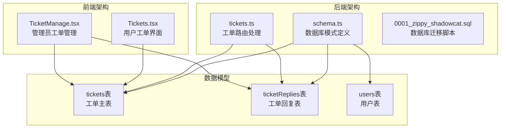
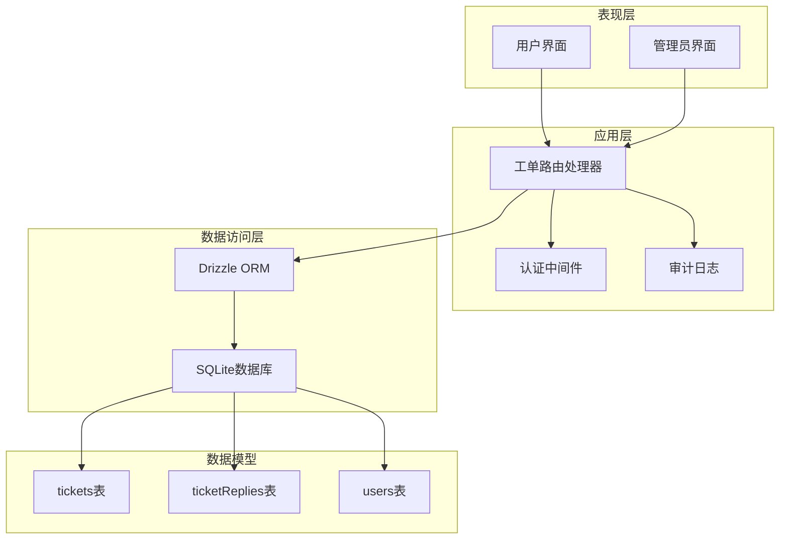
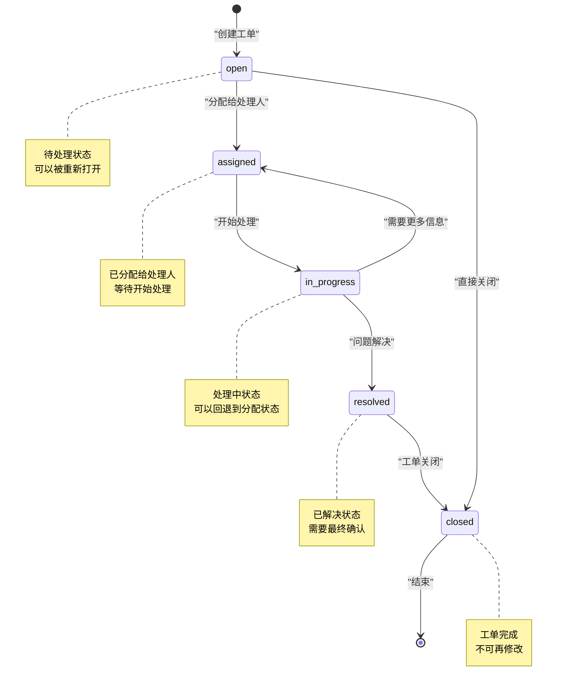
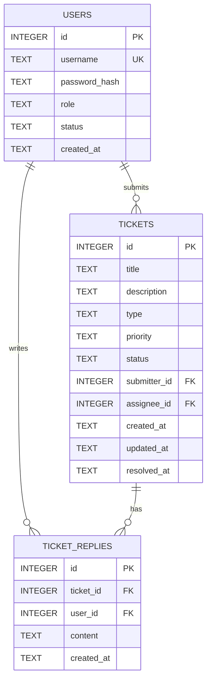
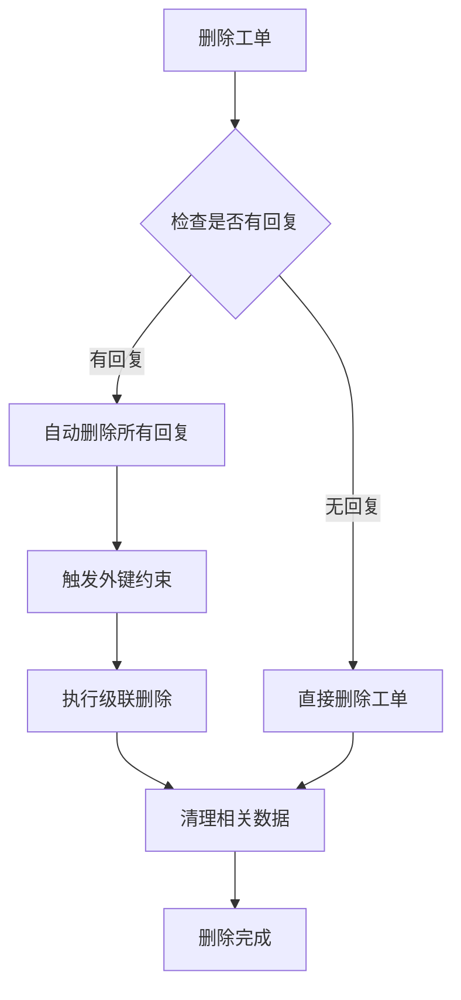
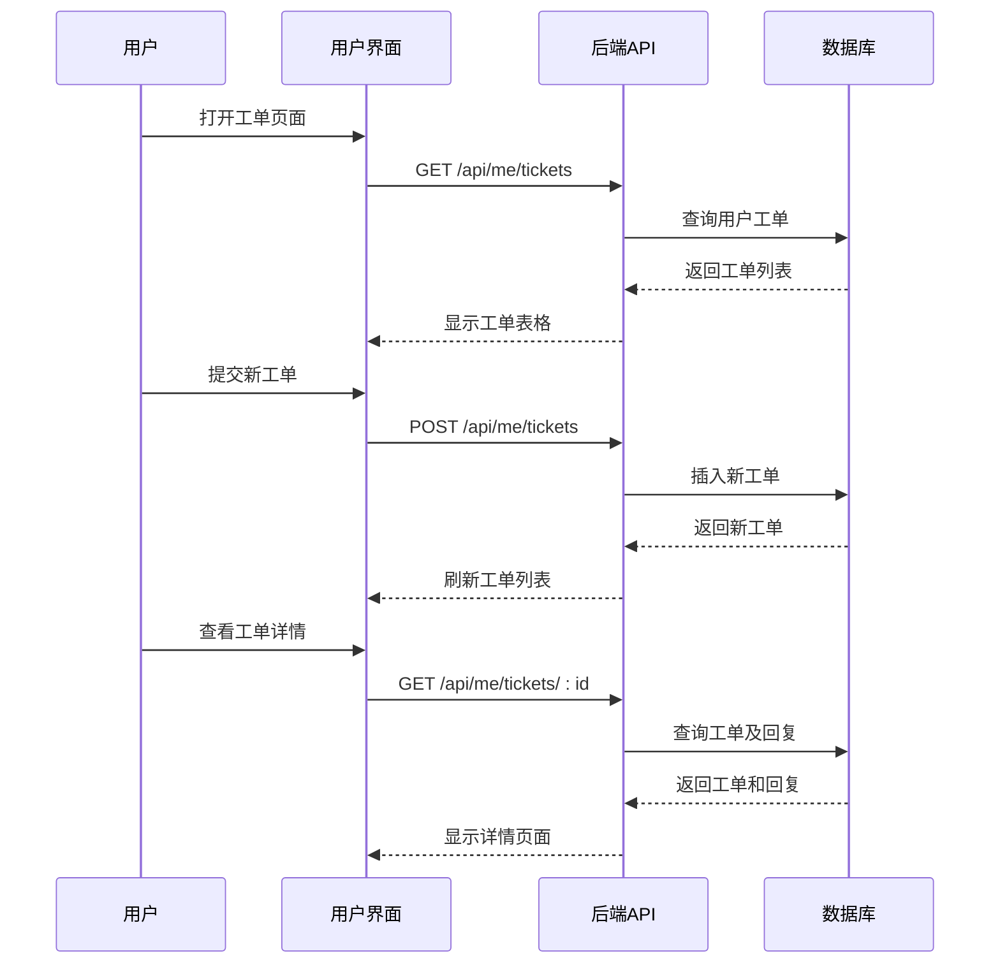
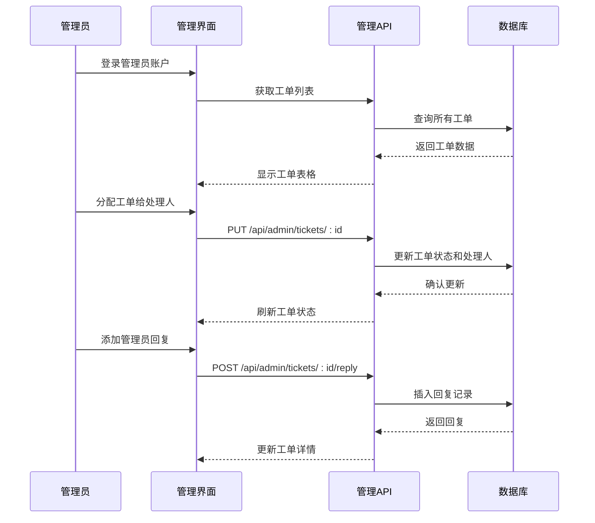
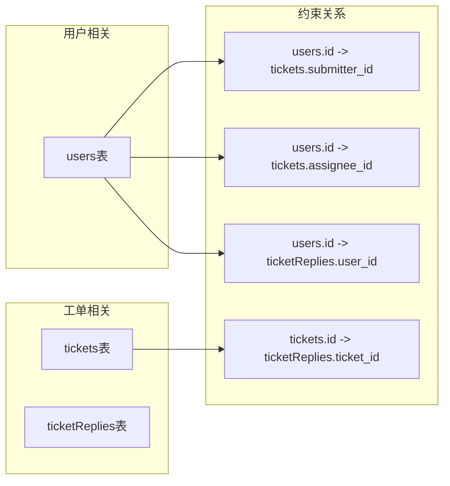
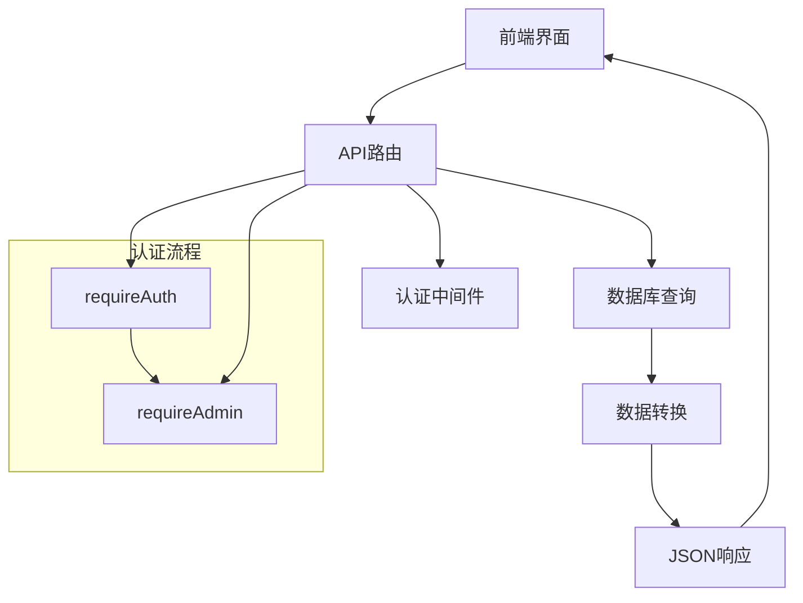

# 工单管理模型

<cite>
**本文档引用的文件**
- [schema.ts](file://apps/server/src/db/schema.ts)
- [tickets.ts](file://apps/server/src/routes/tickets.ts)
- [Tickets.tsx](file://apps/web/src/pages/Tickets.tsx)
- [TicketManage.tsx](file://apps/web/src/pages/admin/TicketManage.tsx)
- [0001_zippy_shadowcat.sql](file://apps/server/drizzle/0001_zippy_shadowcat.sql)
</cite>

## 目录
1. [简介](#简介)
2. [项目结构](#项目结构)
3. [核心组件](#核心组件)
4. [架构概览](#架构概览)
5. [详细组件分析](#详细组件分析)
6. [依赖关系分析](#依赖关系分析)
7. [性能考虑](#性能考虑)
8. [故障排除指南](#故障排除指南)
9. [结论](#结论)

## 简介

工单管理系统是企业资源管理平台的核心功能模块，用于跟踪和管理用户提交的问题、请求和咨询。该系统提供了完整的工单生命周期管理，包括工单创建、分配、处理、回复和解决等全流程功能。

本系统采用前后端分离架构，后端使用Fastify框架和Drizzle ORM进行数据持久化，前端使用React和Ant Design构建用户界面。系统支持多用户协作，允许用户和管理员共同参与工单处理过程。

## 项目结构

工单管理功能分布在以下关键文件中：

**图表来源**
- [schema.ts:98-119](file://apps/server/src/db/schema.ts#L98-L119)
- [tickets.ts:6-136](file://apps/server/src/routes/tickets.ts#L6-L136)

**章节来源**
- [schema.ts:1-330](file://apps/server/src/db/schema.ts#L1-L330)
- [tickets.ts:1-137](file://apps/server/src/routes/tickets.ts#L1-L137)

## 核心组件

### 数据模型设计

工单管理系统的数据模型由三个核心表组成：

#### 用户表 (users)
- 主键：自增ID
- 字段：用户名、密码哈希、角色、状态、创建时间
- 角色枚举：admin、user
- 状态枚举：active、disabled

#### 工单表 (tickets)
- 主键：自增ID
- 核心字段：标题、描述、类型、优先级、状态
- 关联字段：提交人ID、处理人ID
- 时间戳：创建时间、更新时间、解决时间

#### 工单回复表 (ticketReplies)
- 主键：自增ID
- 核心字段：工单ID、用户ID、回复内容
- 时间戳：创建时间

**章节来源**
- [schema.ts:3-10](file://apps/server/src/db/schema.ts#L3-L10)
- [schema.ts:98-119](file://apps/server/src/db/schema.ts#L98-L119)

## 架构概览

系统采用分层架构设计，实现了清晰的职责分离：

**图表来源**
- [tickets.ts:1-137](file://apps/server/src/routes/tickets.ts#L1-L137)
- [schema.ts:98-119](file://apps/server/src/db/schema.ts#L98-L119)

## 详细组件分析

### 工单类型枚举

系统支持四种工单类型，每种类型都有特定的业务含义和处理流程：

| 类型 | 描述 | 典型场景 |
|------|------|----------|
| bug | 系统故障或错误报告 | 软件崩溃、功能异常、性能问题 |
| request | 新功能需求或改进建议 | 功能增强、界面优化、流程改进 |
| question | 咨询或疑问 | 使用指导、技术咨询、政策询问 |
| other | 其他类型工单 | 无法归类到上述类型的特殊需求 |

**章节来源**
- [schema.ts:103](file://apps/server/src/db/schema.ts#L103)

### 优先级管理体系

优先级系统采用四等级分类，从低到高依次为：

| 优先级 | 颜色标识 | 含义 | 处理要求 |
|--------|----------|------|----------|
| low | 默认灰色 | 一般性问题 | 正常工作时间内处理 |
| medium | 蓝色 | 普通问题 | 1-2个工作日内响应 |
| high | 橙色 | 重要问题 | 24小时内响应 |
| urgent | 红色 | 紧急问题 | 4小时内响应 |

**章节来源**
- [schema.ts:104](file://apps/server/src/db/schema.ts#L104)

### 状态流转机制

工单状态采用有限状态机设计，支持完整的生命周期管理：

**图表来源**
- [schema.ts:105](file://apps/server/src/db/schema.ts#L105)

**章节来源**
- [schema.ts:105](file://apps/server/src/db/schema.ts#L105)

### 工单表设计详解

#### 核心字段分析

| 字段名 | 类型 | 约束 | 说明 |
|--------|------|------|------|
| id | INTEGER | PRIMARY KEY, AUTOINCREMENT | 工单唯一标识符 |
| title | TEXT | NOT NULL | 工单标题，必填字段 |
| description | TEXT | DEFAULT '' | 详细描述，支持空值 |
| type | TEXT | ENUM, DEFAULT 'question' | 工单类型，默认咨询 |
| priority | TEXT | ENUM, DEFAULT 'medium' | 优先级，默认中等 |
| status | TEXT | ENUM, DEFAULT 'open' | 状态，默认待处理 |
| submitterId | INTEGER | NOT NULL, FOREIGN KEY | 提交人ID，必填 |
| assigneeId | INTEGER | FOREIGN KEY | 处理人ID，可选 |
| createdAt | TEXT | NOT NULL, DEFAULT NOW() | 创建时间戳 |
| updatedAt | TEXT | NOT NULL, DEFAULT NOW() | 更新时间戳 |
| resolvedAt | TEXT | NULL | 解决时间戳 |

#### 外键约束关系

**图表来源**
- [schema.ts:98-119](file://apps/server/src/db/schema.ts#L98-L119)

**章节来源**
- [schema.ts:98-111](file://apps/server/src/db/schema.ts#L98-L111)

### 工单回复表设计

#### 表结构分析

| 字段名 | 类型 | 约束 | 说明 |
|--------|------|------|------|
| id | INTEGER | PRIMARY KEY, AUTOINCREMENT | 回复唯一标识符 |
| ticketId | INTEGER | NOT NULL, FOREIGN KEY | 关联工单ID |
| userId | INTEGER | NOT NULL, FOREIGN KEY | 回复用户ID |
| content | TEXT | NOT NULL | 回复内容，必填 |
| createdAt | TEXT | NOT NULL, DEFAULT NOW() | 创建时间戳 |

#### 级联删除机制

工单回复表实现了智能的级联删除策略：

**图表来源**
- [schema.ts:113-119](file://apps/server/src/db/schema.ts#L113-L119)
- [0001_zippy_shadowcat.sql:107-115](file://apps/server/drizzle/0001_zippy_shadowcat.sql#L107-L115)

**章节来源**
- [schema.ts:113-119](file://apps/server/src/db/schema.ts#L113-L119)

### 前端用户界面设计

#### 用户工单界面 (Tickets.tsx)

用户界面提供了完整的工单管理功能：

**图表来源**
- [Tickets.tsx:24-66](file://apps/web/src/pages/Tickets.tsx#L24-L66)
- [tickets.ts:8-46](file://apps/server/src/routes/tickets.ts#L8-L46)

#### 管理员工单管理界面 (TicketManage.tsx)

管理员界面提供了更全面的工单管理能力：

**图表来源**
- [TicketManage.tsx:18-57](file://apps/web/src/pages/admin/TicketManage.tsx#L18-L57)
- [tickets.ts:64-136](file://apps/server/src/routes/tickets.ts#L64-L136)

**章节来源**
- [Tickets.tsx:24-132](file://apps/web/src/pages/Tickets.tsx#L24-L132)
- [TicketManage.tsx:18-120](file://apps/web/src/pages/admin/TicketManage.tsx#L18-L120)

## 依赖关系分析

### 数据库依赖关系

系统通过外键约束建立了清晰的数据依赖关系：

**图表来源**
- [schema.ts:106-116](file://apps/server/src/db/schema.ts#L106-L116)

### 前后端交互依赖

**图表来源**
- [tickets.ts:2-4](file://apps/server/src/routes/tickets.ts#L2-L4)

**章节来源**
- [schema.ts:106-116](file://apps/server/src/db/schema.ts#L106-L116)
- [tickets.ts:2-4](file://apps/server/src/routes/tickets.ts#L2-L4)

## 性能考虑

### 数据库优化策略

1. **索引优化**：在常用查询字段上建立索引
2. **查询优化**：使用JOIN操作减少查询次数
3. **缓存策略**：对频繁访问的数据进行缓存
4. **分页处理**：大数据量时使用分页查询

### 前端性能优化

1. **虚拟滚动**：大量数据时使用虚拟滚动
2. **懒加载**：按需加载工单详情
3. **防抖处理**：输入验证和搜索操作
4. **状态管理**：合理管理组件状态

## 故障排除指南

### 常见问题及解决方案

#### 工单状态更新失败
- 检查用户权限是否足够
- 验证状态转换是否符合业务规则
- 确认数据库连接正常

#### 工单回复丢失
- 检查级联删除配置
- 验证外键约束设置
- 确认事务处理正确性

#### 性能问题
- 分析慢查询语句
- 检查数据库索引
- 优化前端渲染逻辑

**章节来源**
- [tickets.ts:112-121](file://apps/server/src/routes/tickets.ts#L112-L121)

## 结论

工单管理系统通过精心设计的数据模型和清晰的业务流程，为企业提供了完整的工单管理解决方案。系统的主要优势包括：

1. **完整的生命周期管理**：从创建到关闭的全链路支持
2. **灵活的状态控制**：支持复杂的业务状态流转
3. **强大的协作功能**：支持多用户参与和协作
4. **完善的审计机制**：完整的操作记录和追踪
5. **良好的扩展性**：模块化设计便于功能扩展

该系统为企业的IT支持、客户服务和项目管理提供了坚实的技术基础，能够有效提升工作效率和服务质量。