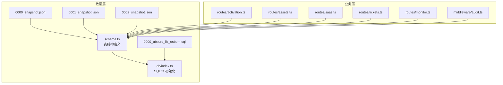
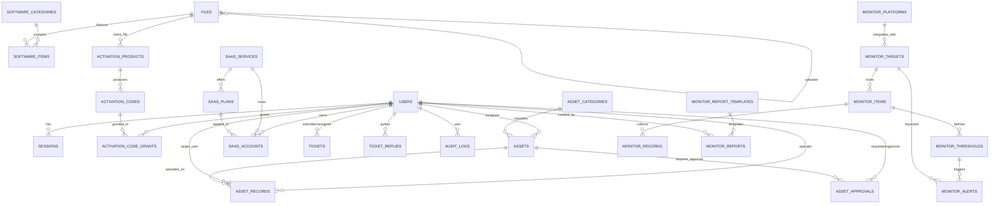
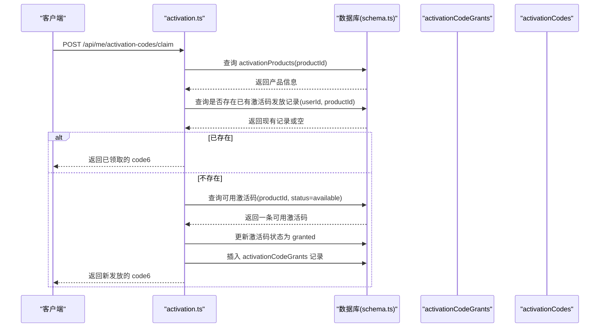
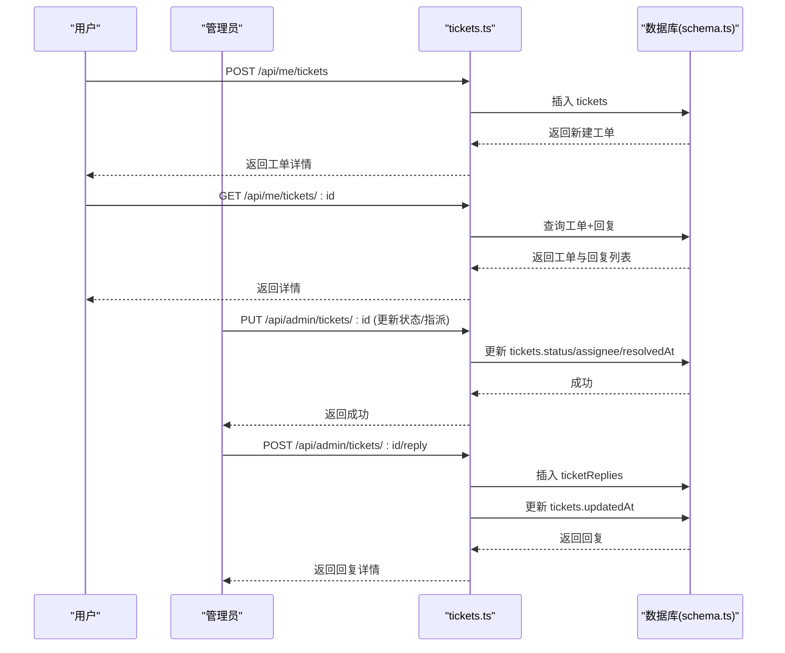
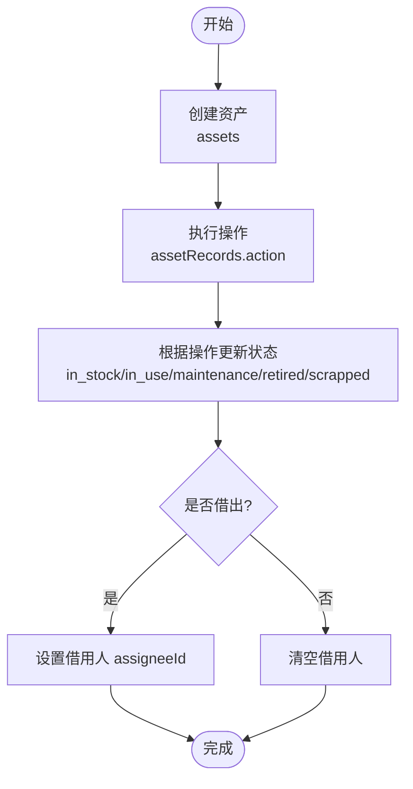
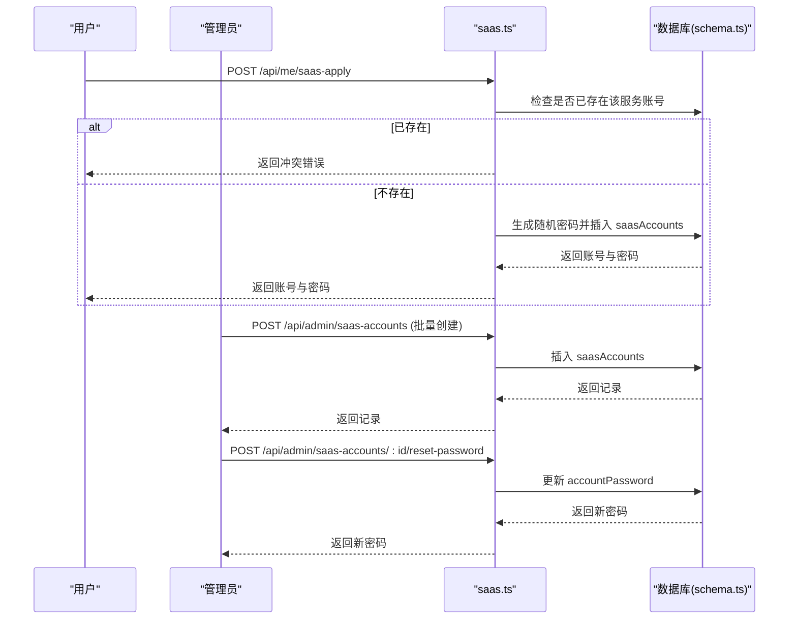
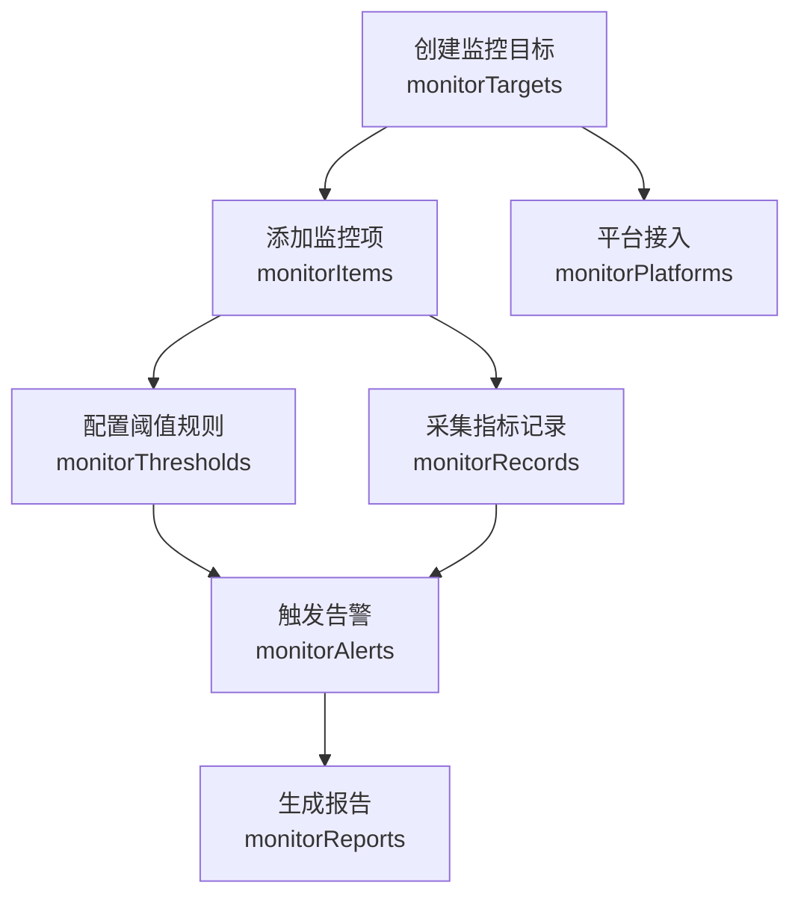
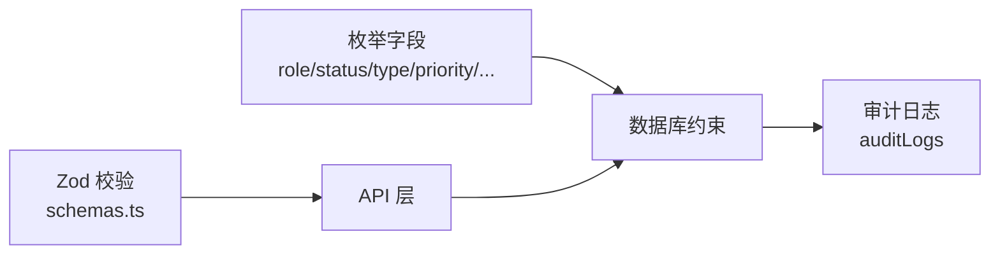

# 核心数据模型

<cite>
**本文档引用的文件**
- [apps/server/src/db/schema.ts](file://apps/server/src/db/schema.ts)
- [apps/server/src/db/index.ts](file://apps/server/src/db/index.ts)
- [apps/server/drizzle/meta/0000_snapshot.json](file://apps/server/drizzle/meta/0000_snapshot.json)
- [apps/server/drizzle/meta/0001_snapshot.json](file://apps/server/drizzle/meta/0001_snapshot.json)
- [apps/server/drizzle/meta/0002_snapshot.json](file://apps/server/drizzle/meta/0002_snapshot.json)
- [apps/server/drizzle/0000_absurd_liz_osborn.sql](file://apps/server/drizzle/0000_absurd_liz_osborn.sql)
- [apps/server/src/routes/activation.ts](file://apps/server/src/routes/activation.ts)
- [apps/server/src/routes/assets.ts](file://apps/server/src/routes/assets.ts)
- [apps/server/src/routes/saas.ts](file://apps/server/src/routes/saas.ts)
- [apps/server/src/routes/tickets.ts](file://apps/server/src/routes/tickets.ts)
- [apps/server/src/routes/monitor.ts](file://apps/server/src/routes/monitor.ts)
- [packages/shared/src/schemas.ts](file://packages/shared/src/schemas.ts)
- [packages/shared/src/types.ts](file://packages/shared/src/types.ts)
- [apps/server/src/middleware/audit.ts](file://apps/server/src/middleware/audit.ts)
</cite>

## 目录
1. [简介](#简介)
2. [项目结构](#项目结构)
3. [核心组件](#核心组件)
4. [架构总览](#架构总览)
5. [详细组件分析](#详细组件分析)
6. [依赖分析](#依赖分析)
7. [性能考虑](#性能考虑)
8. [故障排除指南](#故障排除指南)
9. [结论](#结论)
10. [附录](#附录)

## 简介
本文件系统化梳理 ZBH2 平台的核心数据模型，聚焦以下关键实体表：users 用户表、softwareItems 软件表、activationCodes 激活码表、tickets 工单表、assets 资产表、saasAccounts SaaS 账户表、monitorTargets 监控目标表等。文档从表结构、字段语义、约束与默认值、主外键关系、业务规则与验证、以及扩展性设计等方面进行深入解析，并通过 ER 图与流程图直观展示实体间的关系与典型业务流程。

## 项目结构
- 数据层采用 Drizzle ORM + SQLite，数据库初始化时启用外键约束与 WAL 模式，确保一致性与并发写入性能。
- 表结构定义集中在 schema.ts 中，配合迁移快照文件（meta snapshots）与初始 SQL 文件，形成可追溯的演进历史。
- 业务路由层对各实体进行 CRUD 与业务流程编排，审计中间件统一记录审计日志。

图表来源
- [apps/server/src/db/schema.ts:1-330](file://apps/server/src/db/schema.ts#L1-L330)
- [apps/server/src/db/index.ts:1-16](file://apps/server/src/db/index.ts#L1-L16)
- [apps/server/drizzle/meta/0000_snapshot.json:1-757](file://apps/server/drizzle/meta/0000_snapshot.json#L1-L757)
- [apps/server/drizzle/meta/0001_snapshot.json:1-800](file://apps/server/drizzle/meta/0001_snapshot.json#L1-L800)
- [apps/server/drizzle/meta/0002_snapshot.json:1-800](file://apps/server/drizzle/meta/0002_snapshot.json#L1-L800)
- [apps/server/drizzle/0000_absurd_liz_osborn.sql:1-108](file://apps/server/drizzle/0000_absurd_liz_osborn.sql#L1-L108)
- [apps/server/src/routes/activation.ts:1-95](file://apps/server/src/routes/activation.ts#L1-L95)
- [apps/server/src/routes/assets.ts:1-165](file://apps/server/src/routes/assets.ts#L1-L165)
- [apps/server/src/routes/saas.ts:1-160](file://apps/server/src/routes/saas.ts#L1-L160)
- [apps/server/src/routes/tickets.ts:1-137](file://apps/server/src/routes/tickets.ts#L1-L137)
- [apps/server/src/routes/monitor.ts:1-595](file://apps/server/src/routes/monitor.ts#L1-L595)
- [apps/server/src/middleware/audit.ts:1-28](file://apps/server/src/middleware/audit.ts#L1-L28)

章节来源
- [apps/server/src/db/index.ts:1-16](file://apps/server/src/db/index.ts#L1-L16)
- [apps/server/src/db/schema.ts:1-330](file://apps/server/src/db/schema.ts#L1-L330)

## 核心组件
本节按实体维度逐一说明字段、约束、默认值、业务含义、主外键关系与典型用法。

- users 用户表
  - 字段与约束
    - id: 整型，自增主键
    - username: 文本，非空且唯一
    - passwordHash: 文本，非空
    - role: 文本枚举，取值 'admin' | 'user'，默认 'user'
    - status: 文本枚举，取值 'active' | 'disabled'，默认 'active'
    - createdAt: 文本，非空，默认当前时间 ISO 字符串
  - 外键关系
    - 无外键
  - 业务用途
    - 系统认证主体；会话表通过 userId 关联
  - 验证规则
    - 共享类型定义中包含用户角色与状态枚举
  - 章节来源
    - [apps/server/src/db/schema.ts:3-10](file://apps/server/src/db/schema.ts#L3-L10)
    - [apps/server/drizzle/meta/0000_snapshot.json:684-745](file://apps/server/drizzle/meta/0000_snapshot.json#L684-L745)
    - [packages/shared/src/types.ts:1-2](file://packages/shared/src/types.ts#L1-L2)

- sessions 会话表
  - 字段与约束
    - id: 文本，主键
    - userId: 整型，非空；引用 users.id，删除级联（cascade）
    - expiresAt: 文本，非空
    - createdAt: 文本，非空，默认当前时间
  - 外键关系
    - userId → users(id) ON DELETE CASCADE
  - 业务用途
    - 存储用户登录会话，支持会话过期控制
  - 章节来源
    - [apps/server/src/db/schema.ts:12-17](file://apps/server/src/db/schema.ts#L12-L17)
    - [apps/server/drizzle/meta/0000_snapshot.json:462-512](file://apps/server/drizzle/meta/0000_snapshot.json#L462-L512)

- softwareCategories 软件分类表
  - 字段与约束
    - id: 自增主键
    - name: 非空
    - sort: 非空，默认 0
    - createdAt: 非空，默认当前时间
  - 外键关系
    - 无
  - 业务用途
    - 为 softwareItems 提供分类归属
  - 章节来源
    - [apps/server/src/db/schema.ts:19-24](file://apps/server/src/db/schema.ts#L19-L24)
    - [apps/server/drizzle/meta/0000_snapshot.json:514-551](file://apps/server/drizzle/meta/0000_snapshot.json#L514-L551)

- files 文件表
  - 字段与约束
    - id: 自增主键
    - originalName: 非空
    - storagePath: 非空
    - mime: 非空，默认 application/octet-stream
    - size: 非空，默认 0
    - hash: 可空，默认 ''
    - uploaderId: 可空；引用 users.id
    - createdAt: 非空，默认当前时间
  - 外键关系
    - uploaderId → users(id)
  - 业务用途
    - 存储上传文件元数据与存储路径
  - 章节来源
    - [apps/server/src/db/schema.ts:26-35](file://apps/server/src/db/schema.ts#L26-L35)
    - [apps/server/drizzle/meta/0000_snapshot.json:243-324](file://apps/server/drizzle/meta/0000_snapshot.json#L243-L324)

- softwareItems 软件项表
  - 字段与约束
    - id: 自增主键
    - title: 非空
    - description: 默认空字符串
    - categoryId: 非空；引用 softwareCategories.id
    - version: 默认空字符串
    - fileId: 可空；引用 files.id
    - iconFileId: 可空；引用 files.id
    - sort: 非空，默认 0
    - status: 枚举 draft | published，默认 draft
    - createdAt/updatedAt: 非空，默认当前时间
  - 外键关系
    - categoryId → softwareCategories(id)
    - fileId → files(id)
    - iconFileId → files(id)
  - 业务用途
    - 软件发布与版本管理
  - 章节来源
    - [apps/server/src/db/schema.ts:37-49](file://apps/server/src/db/schema.ts#L37-L49)
    - [apps/server/drizzle/meta/0000_snapshot.json:553-682](file://apps/server/drizzle/meta/0000_snapshot.json#L553-L682)

- activationProducts 激活产品表
  - 字段与约束
    - id: 自增主键
    - code: 非空且唯一
    - name: 非空
    - description: 默认空字符串
    - clientDownloadUrl: 默认空字符串
    - clientFileId: 可空；引用 files.id
    - createdAt: 非空，默认当前时间
  - 外键关系
    - clientFileId → files(id)
  - 业务用途
    - 定义可激活的产品与客户端下载资源
  - 章节来源
    - [apps/server/src/db/schema.ts:71-79](file://apps/server/src/db/schema.ts#L71-L79)
    - [apps/server/drizzle/meta/0000_snapshot.json:160-241](file://apps/server/drizzle/meta/0000_snapshot.json#L160-L241)

- activationCodes 激活码表
  - 字段与约束
    - id: 自增主键
    - productId: 非空；引用 activationProducts.id
    - code6: 非空
    - status: 枚举 available | granted | revoked，默认 available
    - batchId: 非空，默认空字符串
    - createdAt: 非空，默认当前时间
  - 外键关系
    - productId → activationProducts(id)
  - 业务用途
    - 存储可用/已发放/已撤销的激活码
  - 章节来源
    - [apps/server/src/db/schema.ts:81-88](file://apps/server/src/db/schema.ts#L81-L88)
    - [apps/server/drizzle/meta/0000_snapshot.json:92-158](file://apps/server/drizzle/meta/0000_snapshot.json#L92-L158)

- activationCodeGrants 激活码发放记录表
  - 字段与约束
    - id: 自增主键
    - codeId: 非空；引用 activationCodes.id
    - userId: 非空；引用 users.id
    - productId: 非空；引用 activationProducts.id
    - grantedAt: 非空，默认当前时间
  - 外键关系
    - codeId → activationCodes(id)
    - userId → users(id)
    - productId → activationProducts(id)
  - 业务用途
    - 记录用户获得某产品的激活码
  - 章节来源
    - [apps/server/src/db/schema.ts:90-96](file://apps/server/src/db/schema.ts#L90-L96)
    - [apps/server/drizzle/meta/0000_snapshot.json:7-90](file://apps/server/drizzle/meta/0000_snapshot.json#L7-L90)

- tickets 工单表
  - 字段与约束
    - id: 自增主键
    - title: 非空
    - description: 默认空字符串
    - type: 枚举 bug | request | question | other，默认 question
    - priority: 枚举 low | medium | high | urgent，默认 medium
    - status: 枚举 open | assigned | in_progress | resolved | closed，默认 open
    - submitterId: 非空；引用 users.id
    - assigneeId: 可空；引用 users.id
    - createdAt/updatedAt: 非空，默认当前时间
    - resolvedAt: 可空
  - 外键关系
    - submitterId → users(id)
    - assigneeId → users(id)
  - 业务用途
    - 用户提交工单与管理员处理流程
  - 章节来源
    - [apps/server/src/db/schema.ts:99-111](file://apps/server/src/db/schema.ts#L99-L111)
    - [apps/server/drizzle/meta/0000_snapshot.json:1-757](file://apps/server/drizzle/meta/0000_snapshot.json#L1-L757)

- ticketReplies 工单回复表
  - 字段与约束
    - id: 自增主键
    - ticketId: 非空；引用 tickets.id，删除级联
    - userId: 非空；引用 users.id
    - content: 非空
    - createdAt: 非空，默认当前时间
  - 外键关系
    - ticketId → tickets(id) ON DELETE CASCADE
    - userId → users(id)
  - 业务用途
    - 记录工单的回复内容与时间线
  - 章节来源
    - [apps/server/src/db/schema.ts:113-119](file://apps/server/src/db/schema.ts#L113-L119)
    - [apps/server/drizzle/meta/0000_snapshot.json:1-757](file://apps/server/drizzle/meta/0000_snapshot.json#L1-L757)

- assetCategories 资产分类表
  - 字段与约束
    - id: 自增主键
    - name: 非空
    - sort: 非空，默认 0
    - createdAt: 非空，默认当前时间
  - 外键关系
    - 无
  - 业务用途
    - 为资产提供分类
  - 章节来源
    - [apps/server/src/db/schema.ts:122-127](file://apps/server/src/db/schema.ts#L122-L127)
    - [apps/server/drizzle/meta/0001_snapshot.json:366-403](file://apps/server/drizzle/meta/0001_snapshot.json#L366-L403)

- assets 资产表
  - 字段与约束
    - id: 自增主键
    - assetCode: 非空且唯一
    - name: 非空
    - categoryId: 可空；引用 assetCategories.id
    - brand/model/serialNumber: 默认空字符串
    - status: 枚举 in_stock | in_use | maintenance | retired | scrapped，默认 in_stock
    - assigneeId: 可空；引用 users.id
    - purchaseDate/purchasePrice/warrantyExpiry/location/notes: 各自默认值
    - createdAt/updatedAt: 非空，默认当前时间
  - 外键关系
    - categoryId → assetCategories(id)
    - assigneeId → users(id)
  - 业务用途
    - 数字资产管理与流转
  - 章节来源
    - [apps/server/src/db/schema.ts:129-146](file://apps/server/src/db/schema.ts#L129-L146)
    - [apps/server/drizzle/meta/0001_snapshot.json:505-667](file://apps/server/drizzle/meta/0001_snapshot.json#L505-L667)

- assetRecords 资产操作记录表
  - 字段与约束
    - id: 自增主键
    - assetId: 非空；引用 assets.id
    - action: 枚举 check_in | check_out | maintenance | return | retire | scrap
    - operatorId: 非空；引用 users.id
    - targetUserId: 可空；引用 users.id
    - notes: 默认空字符串
    - createdAt: 非空，默认当前时间
  - 外键关系
    - assetId → assets(id)
    - operatorId → users(id)
    - targetUserId → users(id)
  - 业务用途
    - 记录资产的借还、维护、报废等动作
  - 章节来源
    - [apps/server/src/db/schema.ts:148-156](file://apps/server/src/db/schema.ts#L148-L156)
    - [apps/server/drizzle/meta/0001_snapshot.json:405-503](file://apps/server/drizzle/meta/0001_snapshot.json#L405-L503)

- assetApprovals 资产审批表
  - 字段与约束
    - id: 自增主键
    - assetId: 非空；引用 assets.id
    - type: 枚举 check_out | return | scrap
    - requesterId: 非空；引用 users.id
    - approverId: 可空；引用 users.id
    - status: 枚举 pending | approved | rejected，默认 pending
    - reason/comment: 默认空字符串
    - createdAt/updatedAt: 非空，默认当前时间
  - 外键关系
    - assetId → assets(id)
    - requesterId → users(id)
    - approverId → users(id)
  - 业务用途
    - 资产相关操作的审批流
  - 章节来源
    - [apps/server/src/db/schema.ts:158-169](file://apps/server/src/db/schema.ts#L158-L169)
    - [apps/server/drizzle/meta/0001_snapshot.json:243-364](file://apps/server/drizzle/meta/0001_snapshot.json#L243-L364)

- saasServices SaaS 服务表
  - 字段与约束
    - id: 自增主键
    - name/code: 非空且 code 唯一
    - description: 默认空字符串
    - status: 枚举 active | disabled，默认 active
    - createdAt: 非空，默认当前时间
  - 外键关系
    - 无
  - 业务用途
    - 定义可用的 SaaS 服务及其状态
  - 章节来源
    - [apps/server/src/db/schema.ts:172-179](file://apps/server/src/db/schema.ts#L172-L179)
    - [apps/server/drizzle/meta/0001_snapshot.json:1-800](file://apps/server/drizzle/meta/0001_snapshot.json#L1-L800)

- saasPlans SaaS 套餐表
  - 字段与约束
    - id: 自增主键
    - serviceId: 非空；引用 saasServices.id
    - name/description: 非空/默认空字符串
    - maxUsers/price/sort: 默认 0
    - createdAt: 非空，默认当前时间
  - 外键关系
    - serviceId → saasServices(id)
  - 业务用途
    - 服务下的套餐配置
  - 章节来源
    - [apps/server/src/db/schema.ts:181-190](file://apps/server/src/db/schema.ts#L181-L190)
    - [apps/server/drizzle/meta/0001_snapshot.json:1-800](file://apps/server/drizzle/meta/0001_snapshot.json#L1-L800)

- saasAccounts SaaS 账号表
  - 字段与约束
    - id: 自增主键
    - serviceId: 非空；引用 saasServices.id
    - planId: 可空；引用 saasPlans.id
    - userId: 非空；引用 users.id
    - accountName/accountPassword: 非空
    - status: 枚举 pending | active | disabled | expired，默认 pending
    - expiresAt: 可空
    - createdAt/updatedAt: 非空，默认当前时间
  - 外键关系
    - serviceId → saasServices(id)
    - planId → saasPlans(id)
    - userId → users(id)
  - 业务用途
    - 用户在各 SaaS 服务下的账户与状态
  - 章节来源
    - [apps/server/src/db/schema.ts:192-203](file://apps/server/src/db/schema.ts#L192-L203)
    - [apps/server/drizzle/meta/0001_snapshot.json:1-800](file://apps/server/drizzle/meta/0001_snapshot.json#L1-L800)

- monitorTargets 监控目标表
  - 字段与约束
    - id: 自增主键
    - name: 非空
    - type: 枚举 device | system | database | service
    - host/port/description/status/config: 各自默认值或可空
    - createdAt/updatedAt: 非空，默认当前时间
  - 外键关系
    - 无
  - 业务用途
    - 定义被监控的对象（主机、系统、数据库、服务）
  - 章节来源
    - [apps/server/src/db/schema.ts:217-228](file://apps/server/src/db/schema.ts#L217-L228)
    - [apps/server/drizzle/meta/0002_snapshot.json:1-800](file://apps/server/drizzle/meta/0002_snapshot.json#L1-L800)

- monitorItems 监控项表
  - 字段与约束
    - id: 自增主键
    - targetId: 非空；引用 monitorTargets.id，删除级联
    - name/key: 非空
    - unit: 可空
    - collectMethod: 枚举 auto | manual | api，默认 auto
    - collectInterval: 非空，默认 60
    - enabled: 非空，默认 1
    - createdAt/updatedAt: 非空，默认当前时间
  - 外键关系
    - targetId → monitorTargets(id) ON DELETE CASCADE
  - 业务用途
    - 定义针对监控目标的具体指标采集项
  - 章节来源
    - [apps/server/src/db/schema.ts:230-241](file://apps/server/src/db/schema.ts#L230-L241)
    - [apps/server/drizzle/meta/0002_snapshot.json:1-800](file://apps/server/drizzle/meta/0002_snapshot.json#L1-L800)

- monitorThresholds 阈值规则表
  - 字段与约束
    - id: 自增主键
    - itemId: 非空；引用 monitorItems.id，删除级联
    - level: 枚举 warning | critical
    - operator: 枚举 gt | lt | eq | gte | lte
    - value: 实数，非空
    - duration: 可空
    - action/notifyMessage/enabled: 各自默认值或可空
    - createdAt: 非空，默认当前时间
  - 外键关系
    - itemId → monitorItems(id) ON DELETE CASCADE
  - 业务用途
    - 定义触发告警的阈值条件
  - 章节来源
    - [apps/server/src/db/schema.ts:243-254](file://apps/server/src/db/schema.ts#L243-L254)
    - [apps/server/drizzle/meta/0002_snapshot.json:1-800](file://apps/server/drizzle/meta/0002_snapshot.json#L1-L800)

- monitorRecords 监控记录表
  - 字段与约束
    - id: 自增主键
    - itemId: 非空；引用 monitorItems.id，删除级联
    - value: 实数，非空
    - status: 枚举 normal | warning | critical，默认 normal
    - collectedAt: 非空
  - 外键关系
    - itemId → monitorItems(id) ON DELETE CASCADE
  - 业务用途
    - 存放采集到的指标数值与状态
  - 章节来源
    - [apps/server/src/db/schema.ts:256-262](file://apps/server/src/db/schema.ts#L256-L262)
    - [apps/server/drizzle/meta/0002_snapshot.json:1-800](file://apps/server/drizzle/meta/0002_snapshot.json#L1-L800)

- monitorAlerts 告警表
  - 字段与约束
    - id: 自增主键
    - itemId: 非空；引用 monitorItems.id
    - thresholdId: 可空；引用 monitorThresholds.id
    - level: 枚举 warning | critical
    - value: 实数，非空
    - message: 非空
    - status: 枚举 pending | acknowledged | resolved，默认 pending
    - acknowledgedBy/resolvedBy: 可空；引用 users.id
    - acknowledgedAt/resolvedAt: 可空
    - createdAt: 非空，默认当前时间
  - 外键关系
    - itemId → monitorItems(id)
    - thresholdId → monitorThresholds(id)
    - acknowledgedBy → users(id)
    - resolvedBy → users(id)
  - 业务用途
    - 记录并跟踪告警状态与处置
  - 章节来源
    - [apps/server/src/db/schema.ts:264-277](file://apps/server/src/db/schema.ts#L264-L277)
    - [apps/server/drizzle/meta/0002_snapshot.json:1-800](file://apps/server/drizzle/meta/0002_snapshot.json#L1-L800)

- monitorReportTemplates 报告模板表
  - 字段与约束
    - id: 自增主键
    - name/description: 非空/可空
    - config: 非空，JSON 字符串
    - createdBy: 非空；引用 users.id
    - createdAt/updatedAt: 非空，默认当前时间
  - 外键关系
    - createdBy → users(id)
  - 业务用途
    - 定义监控报告的模板配置
  - 章节来源
    - [apps/server/src/db/schema.ts:279-287](file://apps/server/src/db/schema.ts#L279-L287)
    - [apps/server/drizzle/meta/0002_snapshot.json:1-800](file://apps/server/drizzle/meta/0002_snapshot.json#L1-L800)

- monitorReports 报告表
  - 字段与约束
    - id: 自增主键
    - title: 非空
    - type: 枚举 daily | weekly | monthly | custom
    - startTime/endTime: 非空
    - content: 非空，JSON 字符串
    - templateId: 可空；引用 monitorReportTemplates.id
    - createdBy: 非空；引用 users.id
    - createdAt: 非空，默认当前时间
  - 外键关系
    - templateId → monitorReportTemplates(id)
    - createdBy → users(id)
  - 业务用途
    - 存放生成的监控报告
  - 章节来源
    - [apps/server/src/db/schema.ts:289-299](file://apps/server/src/db/schema.ts#L289-L299)
    - [apps/server/drizzle/meta/0002_snapshot.json:1-800](file://apps/server/drizzle/meta/0002_snapshot.json#L1-L800)

- auditLogs 审计日志表
  - 字段与约束
    - id: 自增主键
    - userId: 可空；引用 users.id
    - username: 非空
    - action: 枚举 login | logout | create | update | delete | view | export | config
    - targetType: 枚举 user | software | document | activation | asset | ticket | saas | faq | system | database | device | monitor
    - targetId/targetName/detail: 可空/默认空字符串
    - ipAddress/userAgent/result: 可空/默认 success
    - createdAt: 非空，默认当前时间
  - 外键关系
    - userId → users(id)
  - 业务用途
    - 统一记录用户行为与系统事件
  - 章节来源
    - [apps/server/src/db/schema.ts:301-314](file://apps/server/src/db/schema.ts#L301-L314)
    - [apps/server/drizzle/meta/0002_snapshot.json:669-776](file://apps/server/drizzle/meta/0002_snapshot.json#L669-L776)

- monitorPlatforms 平台接入表
  - 字段与约束
    - id: 自增主键
    - name: 非空
    - type: 枚举 webhook | api | agent，默认 webhook
    - endpoint: 非空
    - apiKey/secret/syncConfig: 可空
    - status: 枚举 active | disabled | testing，默认 active
    - lastSyncAt/description: 可空
    - createdAt/updatedAt: 非空，默认当前时间
  - 外键关系
    - 无
  - 业务用途
    - 定义外部监控平台的接入参数与状态
  - 章节来源
    - [apps/server/src/db/schema.ts:316-329](file://apps/server/src/db/schema.ts#L316-L329)
    - [apps/server/drizzle/meta/0002_snapshot.json:1-800](file://apps/server/drizzle/meta/0002_snapshot.json#L1-L800)

## 架构总览
下图展示核心实体间的主外键关系与依赖结构，帮助理解数据流向与业务耦合度。

图表来源
- [apps/server/src/db/schema.ts:1-330](file://apps/server/src/db/schema.ts#L1-L330)
- [apps/server/drizzle/meta/0000_snapshot.json:1-757](file://apps/server/drizzle/meta/0000_snapshot.json#L1-L757)
- [apps/server/drizzle/meta/0001_snapshot.json:1-800](file://apps/server/drizzle/meta/0001_snapshot.json#L1-L800)
- [apps/server/drizzle/meta/0002_snapshot.json:1-800](file://apps/server/drizzle/meta/0002_snapshot.json#L1-L800)

## 详细组件分析

### 激活码申请流程（activationCodes 与 activationCodeGrants）
该流程确保用户对同一产品的激活码幂等领取，避免重复发放。

图表来源
- [apps/server/src/routes/activation.ts:7-75](file://apps/server/src/routes/activation.ts#L7-L75)
- [apps/server/src/db/schema.ts:71-96](file://apps/server/src/db/schema.ts#L71-L96)

章节来源
- [apps/server/src/routes/activation.ts:1-95](file://apps/server/src/routes/activation.ts#L1-L95)
- [apps/server/src/db/schema.ts:81-96](file://apps/server/src/db/schema.ts#L81-L96)

### 工单系统（tickets 与 ticketReplies）
工单系统支持用户提交、查询、回复，以及管理员分配、处理与关闭。

图表来源
- [apps/server/src/routes/tickets.ts:7-135](file://apps/server/src/routes/tickets.ts#L7-L135)
- [apps/server/src/db/schema.ts:99-119](file://apps/server/src/db/schema.ts#L99-L119)

章节来源
- [apps/server/src/routes/tickets.ts:1-137](file://apps/server/src/routes/tickets.ts#L1-L137)
- [apps/server/src/db/schema.ts:99-119](file://apps/server/src/db/schema.ts#L99-L119)

### 资产管理（assets、assetRecords、assetApprovals）
资产管理覆盖资产登记、借还、维护、报废全流程，并支持审批流与操作记录。

图表来源
- [apps/server/src/routes/assets.ts:73-100](file://apps/server/src/routes/assets.ts#L73-L100)
- [apps/server/src/db/schema.ts:129-156](file://apps/server/src/db/schema.ts#L129-L156)

章节来源
- [apps/server/src/routes/assets.ts:1-165](file://apps/server/src/routes/assets.ts#L1-L165)
- [apps/server/src/db/schema.ts:129-169](file://apps/server/src/db/schema.ts#L129-L169)

### SaaS 账户申请与管理（saasAccounts）
用户可申请服务账号，管理员可批量创建与重置密码，支持计划变更与状态管理。

图表来源
- [apps/server/src/routes/saas.ts:132-146](file://apps/server/src/routes/saas.ts#L132-L146)
- [apps/server/src/routes/saas.ts:88-120](file://apps/server/src/routes/saas.ts#L88-L120)
- [apps/server/src/db/schema.ts:192-203](file://apps/server/src/db/schema.ts#L192-L203)

章节来源
- [apps/server/src/routes/saas.ts:1-160](file://apps/server/src/routes/saas.ts#L1-L160)
- [apps/server/src/db/schema.ts:172-203](file://apps/server/src/db/schema.ts#L172-L203)

### 监控目标与告警（monitorTargets、monitorItems、monitorThresholds、monitorRecords、monitorAlerts）
监控体系从目标、指标、阈值到记录与告警形成闭环，支持报告生成与平台对接。

图表来源
- [apps/server/src/routes/monitor.ts:17-32](file://apps/server/src/routes/monitor.ts#L17-L32)
- [apps/server/src/routes/monitor.ts:126-164](file://apps/server/src/routes/monitor.ts#L126-L164)
- [apps/server/src/routes/monitor.ts:175-214](file://apps/server/src/routes/monitor.ts#L175-L214)
- [apps/server/src/routes/monitor.ts:217-240](file://apps/server/src/routes/monitor.ts#L217-L240)
- [apps/server/src/routes/monitor.ts:243-288](file://apps/server/src/routes/monitor.ts#L243-L288)
- [apps/server/src/routes/monitor.ts:332-391](file://apps/server/src/routes/monitor.ts#L332-L391)
- [apps/server/src/db/schema.ts:217-277](file://apps/server/src/db/schema.ts#L217-L277)

章节来源
- [apps/server/src/routes/monitor.ts:1-595](file://apps/server/src/routes/monitor.ts#L1-L595)
- [apps/server/src/db/schema.ts:217-299](file://apps/server/src/db/schema.ts#L217-L299)

## 依赖分析
- 外键约束与删除策略
  - sessions.user_id 删除级联（cascade），确保用户删除后会话清理
  - ticketReplies.ticket_id 删除级联，保证工单删除时回复一并清理
  - monitorItems、monitorThresholds、monitorRecords 的删除级联，保障监控数据完整性
- 枚举与默认值
  - 大量字段采用枚举与合理默认值，减少业务层判断分支，提升一致性
- 数据验证
  - 共享包中的 Zod 模式用于输入校验（如登录、创建用户、软件项、激活产品、激活码申领等），与数据库约束共同保证数据质量
- 审计日志
  - 审计中间件统一记录用户行为，便于追踪与合规

图表来源
- [packages/shared/src/schemas.ts:1-51](file://packages/shared/src/schemas.ts#L1-L51)
- [packages/shared/src/types.ts:1-18](file://packages/shared/src/types.ts#L1-L18)
- [apps/server/src/middleware/audit.ts:1-28](file://apps/server/src/middleware/audit.ts#L1-L28)
- [apps/server/src/db/schema.ts:1-330](file://apps/server/src/db/schema.ts#L1-L330)

章节来源
- [packages/shared/src/schemas.ts:1-51](file://packages/shared/src/schemas.ts#L1-L51)
- [packages/shared/src/types.ts:1-18](file://packages/shared/src/types.ts#L1-L18)
- [apps/server/src/middleware/audit.ts:1-28](file://apps/server/src/middleware/audit.ts#L1-L28)
- [apps/server/src/db/schema.ts:1-330](file://apps/server/src/db/schema.ts#L1-L330)

## 性能考虑
- SQLite WAL 模式与外键开启已在初始化阶段配置，有助于并发写入与数据一致性
- 对高频查询字段（如 createdAt、status、targetId、itemId 等）建议结合索引优化（当前快照未显示额外索引，可根据实际查询热点评估）
- 分页接口（如监控报表、审计日志、监控记录）采用分页函数，避免一次性加载大量数据
- 监控记录与阈值规则数量可能较大，建议按时间范围过滤与分页查询

## 故障排除指南
- 常见错误场景
  - 激活码申请：当产品不存在或无可用激活码时返回相应错误
  - 工单操作：用户只能访问自己的工单；管理员可查看全部并修改状态/指派
  - 资产操作：无效操作类型会返回错误；借出/归还会同步更新借用人与状态
  - SaaS 申请：用户已拥有该服务账号时禁止重复申请
  - 监控目标：必填字段缺失会触发参数校验错误
- 审计与追踪
  - 所有关键操作均记录审计日志，可通过审计接口筛选定位问题

章节来源
- [apps/server/src/routes/activation.ts:8-75](file://apps/server/src/routes/activation.ts#L8-L75)
- [apps/server/src/routes/tickets.ts:30-121](file://apps/server/src/routes/tickets.ts#L30-L121)
- [apps/server/src/routes/assets.ts:73-100](file://apps/server/src/routes/assets.ts#L73-L100)
- [apps/server/src/routes/saas.ts:132-146](file://apps/server/src/routes/saas.ts#L132-L146)
- [apps/server/src/routes/monitor.ts:34-58](file://apps/server/src/routes/monitor.ts#L34-L58)
- [apps/server/src/middleware/audit.ts:1-28](file://apps/server/src/middleware/audit.ts#L1-L28)

## 结论
ZBH2 的核心数据模型围绕用户、软件、激活、工单、资产、SaaS、监控与审计等模块构建，采用 Drizzle ORM + SQLite 的轻量方案实现高内聚、低耦合的数据层。通过明确的主外键关系、合理的枚举与默认值、完善的输入校验与审计机制，系统在保证一致性的同时具备良好的可扩展性。后续可在热点查询字段上补充索引、完善分页与缓存策略，并持续优化监控数据的存储与检索效率。

## 附录
- 字段命名规范
  - 采用 snake_case 命名，保持与 Drizzle ORM 默认风格一致
  - 时间戳字段统一使用 created_at/updated_at，部分表使用专用字段如 published_at/archived_at/resolved_at
- 扩展性设计
  - 新增枚举值需同时更新数据库与代码层
  - 外键约束与删除策略应与业务流程匹配，避免误删
  - 审计日志字段可扩展 detail 字段承载更丰富的上下文信息