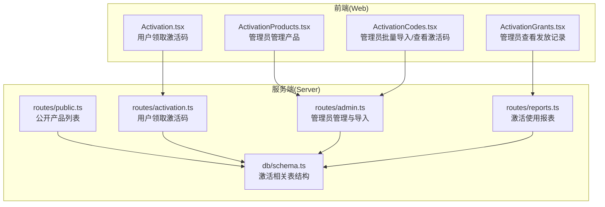
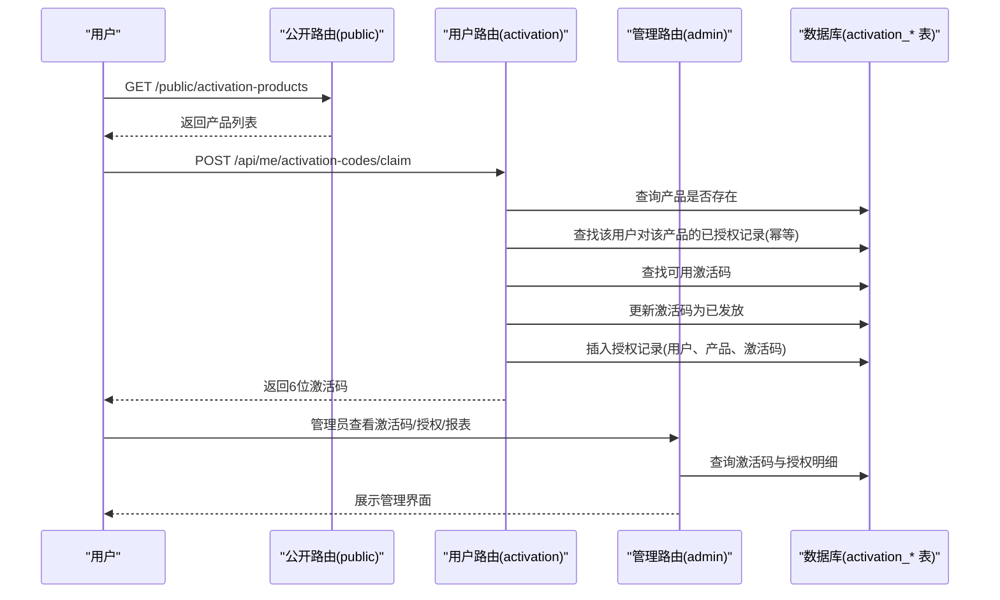
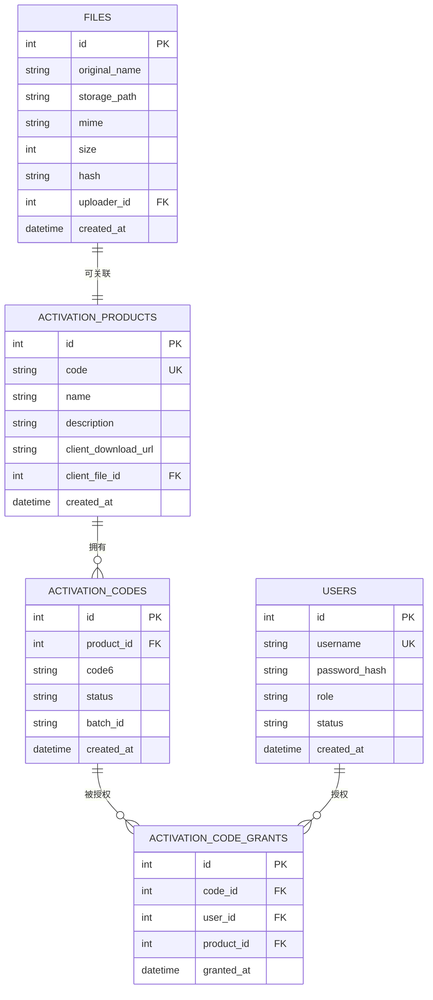
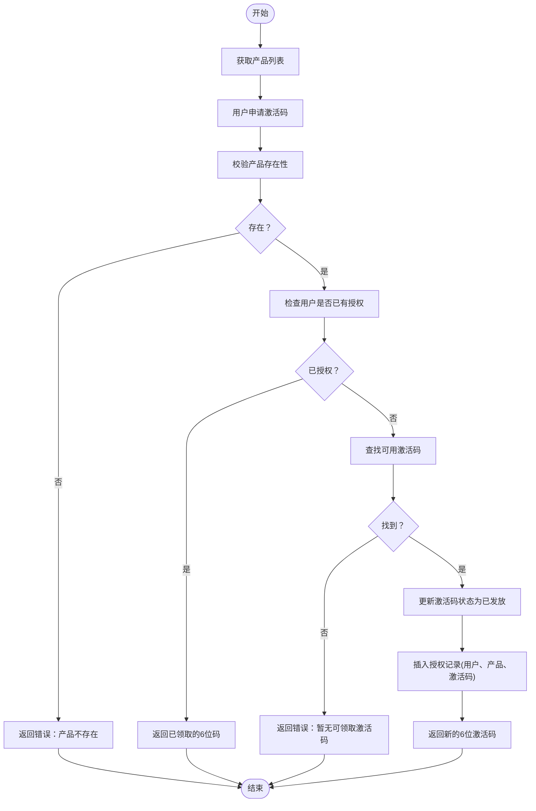
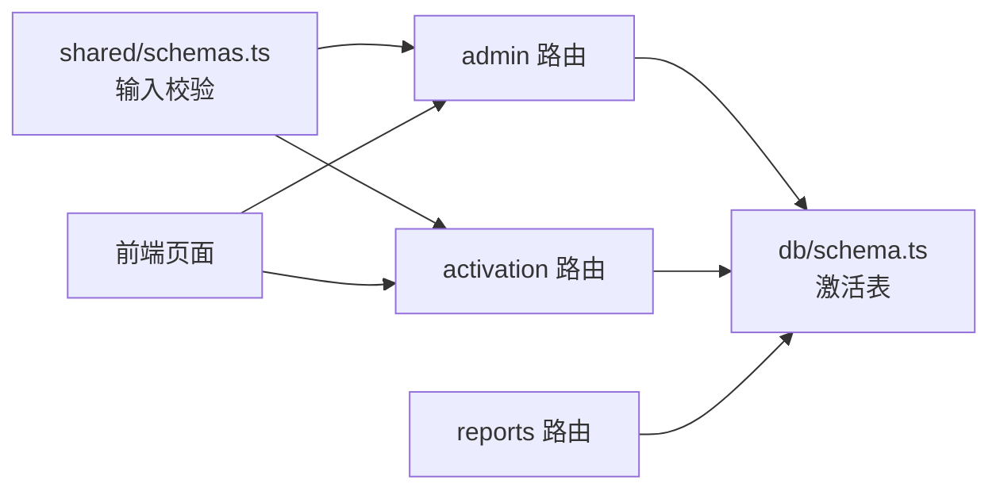

# 激活管理模型

<cite>
**本文引用的文件**
- [apps/server/src/db/schema.ts](file://apps/server/src/db/schema.ts)
- [apps/server/src/routes/activation.ts](file://apps/server/src/routes/activation.ts)
- [apps/server/src/routes/admin.ts](file://apps/server/src/routes/admin.ts)
- [apps/server/src/routes/public.ts](file://apps/server/src/routes/public.ts)
- [apps/server/src/routes/reports.ts](file://apps/server/src/routes/reports.ts)
- [packages/shared/src/schemas.ts](file://packages/shared/src/schemas.ts)
- [apps/web/src/pages/Activation.tsx](file://apps/web/src/pages/Activation.tsx)
- [apps/web/src/pages/admin/ActivationProducts.tsx](file://apps/web/src/pages/admin/ActivationProducts.tsx)
- [apps/web/src/pages/admin/ActivationCodes.tsx](file://apps/web/src/pages/admin/ActivationCodes.tsx)
- [apps/web/src/pages/admin/ActivationGrants.tsx](file://apps/web/src/pages/admin/ActivationGrants.tsx)
</cite>

## 目录
1. [简介](#简介)
2. [项目结构](#项目结构)
3. [核心组件](#核心组件)
4. [架构总览](#架构总览)
5. [详细组件分析](#详细组件分析)
6. [依赖关系分析](#依赖关系分析)
7. [性能考量](#性能考量)
8. [故障排查指南](#故障排查指南)
9. [结论](#结论)
10. [附录](#附录)

## 简介
本文件聚焦于激活管理相关的数据模型与业务流程，围绕以下三张核心表展开：activationProducts（激活产品）、activationCodes（激活码）、activationCodeGrants（激活授权）。内容涵盖：
- 激活产品的客户端下载链接管理、文件关联与产品生命周期
- 激活码的状态管理（available、granted、revoked）与批次管理
- 授权表中的用户授权追踪与时间记录
- 从产品创建、码生成与分发、到用户领取与授权的完整数据流
- 实际应用场景与安全注意事项

## 项目结构
激活管理功能由“服务端数据库模型 + 路由接口 + 前端页面”构成，前后端通过REST API交互。

图表来源
- [apps/web/src/pages/Activation.tsx:1-98](file://apps/web/src/pages/Activation.tsx#L1-L98)
- [apps/web/src/pages/admin/ActivationProducts.tsx:1-66](file://apps/web/src/pages/admin/ActivationProducts.tsx#L1-L66)
- [apps/web/src/pages/admin/ActivationCodes.tsx:1-74](file://apps/web/src/pages/admin/ActivationCodes.tsx#L1-L74)
- [apps/web/src/pages/admin/ActivationGrants.tsx:1-27](file://apps/web/src/pages/admin/ActivationGrants.tsx#L1-L27)
- [apps/server/src/routes/public.ts](file://apps/server/src/routes/public.ts)
- [apps/server/src/routes/activation.ts:1-95](file://apps/server/src/routes/activation.ts#L1-L95)
- [apps/server/src/routes/admin.ts:1-279](file://apps/server/src/routes/admin.ts#L1-L279)
- [apps/server/src/routes/reports.ts:1-146](file://apps/server/src/routes/reports.ts#L1-L146)
- [apps/server/src/db/schema.ts:71-96](file://apps/server/src/db/schema.ts#L71-L96)

章节来源
- [apps/server/src/db/schema.ts:71-96](file://apps/server/src/db/schema.ts#L71-L96)
- [apps/server/src/routes/activation.ts:1-95](file://apps/server/src/routes/activation.ts#L1-L95)
- [apps/server/src/routes/admin.ts:136-219](file://apps/server/src/routes/admin.ts#L136-L219)
- [apps/server/src/routes/public.ts](file://apps/server/src/routes/public.ts)
- [apps/server/src/routes/reports.ts:36-74](file://apps/server/src/routes/reports.ts#L36-L74)
- [packages/shared/src/schemas.ts:41-51](file://packages/shared/src/schemas.ts#L41-L51)
- [apps/web/src/pages/Activation.tsx:1-98](file://apps/web/src/pages/Activation.tsx#L1-L98)
- [apps/web/src/pages/admin/ActivationProducts.tsx:1-66](file://apps/web/src/pages/admin/ActivationProducts.tsx#L1-L66)
- [apps/web/src/pages/admin/ActivationCodes.tsx:1-74](file://apps/web/src/pages/admin/ActivationCodes.tsx#L1-L74)
- [apps/web/src/pages/admin/ActivationGrants.tsx:1-27](file://apps/web/src/pages/admin/ActivationGrants.tsx#L1-L27)

## 核心组件
- 激活产品 activationProducts
  - 字段要点：唯一编码、名称、描述、客户端下载URL、与文件表的外键关联（用于产品配套文件）
  - 生命周期：创建后可被管理员编辑；支持设置下载链接或指向文件ID
- 激活码 activationCodes
  - 字段要点：所属产品、6位激活码、状态（available/granted/revoked）、批次ID、创建时间
  - 批次管理：导入时生成批次ID，便于后续追踪与审计
- 激活授权 activationCodeGrants
  - 字段要点：关联激活码、用户、产品、授权时间
  - 作用：记录用户领取与授权的历史轨迹，支持报表统计

章节来源
- [apps/server/src/db/schema.ts:71-96](file://apps/server/src/db/schema.ts#L71-L96)
- [apps/server/src/routes/admin.ts:178-197](file://apps/server/src/routes/admin.ts#L178-L197)
- [apps/server/src/routes/activation.ts:8-75](file://apps/server/src/routes/activation.ts#L8-L75)
- [apps/server/src/routes/reports.ts:36-74](file://apps/server/src/routes/reports.ts#L36-L74)

## 架构总览
激活管理的数据流自上而下分为三层：
- 公开层：产品列表供用户查看
- 用户层：用户登录后申请激活码，系统返回6位激活码并记录授权
- 管理层：管理员创建产品、批量导入激活码、查看发放记录与使用报表

图表来源
- [apps/server/src/routes/public.ts](file://apps/server/src/routes/public.ts)
- [apps/server/src/routes/activation.ts:8-75](file://apps/server/src/routes/activation.ts#L8-L75)
- [apps/server/src/routes/admin.ts:136-219](file://apps/server/src/routes/admin.ts#L136-L219)
- [apps/server/src/db/schema.ts:71-96](file://apps/server/src/db/schema.ts#L71-L96)

## 详细组件分析

### 数据模型设计与关系
激活管理采用三表关联设计，确保产品、激活码与授权记录之间的清晰映射。

图表来源
- [apps/server/src/db/schema.ts:26-35](file://apps/server/src/db/schema.ts#L26-L35)
- [apps/server/src/db/schema.ts:71-96](file://apps/server/src/db/schema.ts#L71-L96)

章节来源
- [apps/server/src/db/schema.ts:26-35](file://apps/server/src/db/schema.ts#L26-L35)
- [apps/server/src/db/schema.ts:71-96](file://apps/server/src/db/schema.ts#L71-L96)

### 激活产品表（activationProducts）
- 设计理念
  - 唯一编码用于外部识别与管理
  - 支持直接填写客户端下载链接，或通过文件ID关联到系统文件资源
  - 创建时间字段用于审计与排序
- 业务用途
  - 管理不同产品的激活策略与客户端下载入口
  - 与激活码形成一对多关系，便于按产品维度进行统计与管控
- 生命周期
  - 创建：管理员录入基础信息
  - 更新：可变更名称、描述、下载链接或文件ID
  - 删除：不直接删除，通过状态或归档策略配合其他模块处理

章节来源
- [apps/server/src/db/schema.ts:71-79](file://apps/server/src/db/schema.ts#L71-L79)
- [apps/server/src/routes/admin.ts:136-158](file://apps/server/src/routes/admin.ts#L136-L158)
- [apps/web/src/pages/admin/ActivationProducts.tsx:1-66](file://apps/web/src/pages/admin/ActivationProducts.tsx#L1-L66)

### 激活码表（activationCodes）
- 设计理念
  - 6位激活码作为用户侧可见的凭证
  - 状态字段控制激活码的可用性与流转
  - 批次ID用于导入与审计追踪
- 状态管理
  - available：初始可用状态，可被用户领取
  - granted：已被用户领取并授权
  - revoked：作废状态，不可再使用
- 批次管理
  - 导入时生成批次ID，便于后续查询与审计
  - 可按产品筛选与分页展示
- 生命周期
  - 创建：管理员批量导入（6位字符校验）
  - 使用：用户领取后状态变更为已发放
  - 终止：管理员可将状态改为已作废

章节来源
- [apps/server/src/db/schema.ts:81-88](file://apps/server/src/db/schema.ts#L81-L88)
- [apps/server/src/routes/admin.ts:160-197](file://apps/server/src/routes/admin.ts#L160-L197)
- [apps/web/src/pages/admin/ActivationCodes.tsx:1-74](file://apps/web/src/pages/admin/ActivationCodes.tsx#L1-L74)

### 激活授权表（activationCodeGrants）
- 设计理念
  - 记录“用户-激活码-产品”的授权历史
  - 授权时间用于统计与报表
- 业务用途
  - 审计用户领取行为
  - 生成激活使用报表与趋势分析
- 生命周期
  - 创建：用户成功领取激活码后写入
  - 查询：管理员可查看所有授权明细

章节来源
- [apps/server/src/db/schema.ts:90-96](file://apps/server/src/db/schema.ts#L90-L96)
- [apps/server/src/routes/admin.ts:199-219](file://apps/server/src/routes/admin.ts#L199-L219)
- [apps/web/src/pages/admin/ActivationGrants.tsx:1-27](file://apps/web/src/pages/admin/ActivationGrants.tsx#L1-L27)

### 前端页面与交互
- 用户端激活页（Activation.tsx）
  - 展示产品列表与下载链接
  - 登录后调用领取接口，弹窗显示6位激活码
- 管理端产品页（ActivationProducts.tsx）
  - 新增/编辑产品，支持设置下载链接
- 管理端激活码页（ActivationCodes.tsx）
  - 批量导入6位激活码，按产品筛选与分页展示
  - 状态标签化显示（可用/已发放/已作废）
- 管理端授权页（ActivationGrants.tsx）
  - 展示用户、产品、激活码与授权时间

章节来源
- [apps/web/src/pages/Activation.tsx:1-98](file://apps/web/src/pages/Activation.tsx#L1-L98)
- [apps/web/src/pages/admin/ActivationProducts.tsx:1-66](file://apps/web/src/pages/admin/ActivationProducts.tsx#L1-L66)
- [apps/web/src/pages/admin/ActivationCodes.tsx:1-74](file://apps/web/src/pages/admin/ActivationCodes.tsx#L1-L74)
- [apps/web/src/pages/admin/ActivationGrants.tsx:1-27](file://apps/web/src/pages/admin/ActivationGrants.tsx#L1-L27)

### 激活流程数据流（从产品到授权）

图表来源
- [apps/server/src/routes/activation.ts:8-75](file://apps/server/src/routes/activation.ts#L8-L75)
- [packages/shared/src/schemas.ts:48-51](file://packages/shared/src/schemas.ts#L48-L51)

## 依赖关系分析
- 模块耦合
  - activationCodes 依赖 activationProducts（外键）
  - activationCodeGrants 依赖 activationCodes 与 users（外键）
  - 文件表（FILES）与激活产品可建立关联，用于产品配套资源管理
- 外部依赖
  - 共享Schema（shared）定义了产品与领取请求的输入校验规则
  - 前端通过API与服务端交互，遵循REST约定

图表来源
- [packages/shared/src/schemas.ts:41-51](file://packages/shared/src/schemas.ts#L41-L51)
- [apps/server/src/routes/admin.ts:136-219](file://apps/server/src/routes/admin.ts#L136-L219)
- [apps/server/src/routes/activation.ts:1-95](file://apps/server/src/routes/activation.ts#L1-L95)
- [apps/server/src/routes/reports.ts:36-74](file://apps/server/src/routes/reports.ts#L36-L74)
- [apps/web/src/pages/Activation.tsx:1-98](file://apps/web/src/pages/Activation.tsx#L1-L98)
- [apps/web/src/pages/admin/ActivationProducts.tsx:1-66](file://apps/web/src/pages/admin/ActivationProducts.tsx#L1-L66)
- [apps/web/src/pages/admin/ActivationCodes.tsx:1-74](file://apps/web/src/pages/admin/ActivationCodes.tsx#L1-L74)
- [apps/web/src/pages/admin/ActivationGrants.tsx:1-27](file://apps/web/src/pages/admin/ActivationGrants.tsx#L1-L27)

## 性能考量
- 查询优化
  - 激活码查询优先按产品与状态过滤，减少扫描范围
  - 授权查询使用LEFT JOIN聚合用户、产品与激活码信息
- 分页与筛选
  - 管理端激活码列表支持按产品筛选与分页，避免一次性加载过多数据
- 批量导入
  - 导入时统一生成批次ID，便于后续审计与统计

章节来源
- [apps/server/src/routes/admin.ts:160-197](file://apps/server/src/routes/admin.ts#L160-L197)
- [apps/server/src/routes/activation.ts:44-75](file://apps/server/src/routes/activation.ts#L44-L75)

## 故障排查指南
- 常见问题与定位
  - 产品不存在：检查产品ID是否正确，确认activationProducts中是否存在
  - 无可领取激活码：检查activationCodes中是否存在status=available且属于该产品的记录
  - 重复领取：系统具备幂等逻辑，若用户已对某产品有授权，将直接返回已领取的激活码
  - 导入失败：确认激活码为6位字符，且产品ID有效
- 审计与追踪
  - 通过activationCodeGrants查看授权明细
  - 通过activationCodes查看状态与批次信息
  - 通过报表接口获取使用率与月度趋势

章节来源
- [apps/server/src/routes/activation.ts:8-75](file://apps/server/src/routes/activation.ts#L8-L75)
- [apps/server/src/routes/admin.ts:160-219](file://apps/server/src/routes/admin.ts#L160-L219)
- [apps/server/src/routes/reports.ts:36-74](file://apps/server/src/routes/reports.ts#L36-L74)

## 结论
激活管理模型以三表为核心，清晰地分离了产品、激活码与授权记录，满足从产品管理、码池管理到用户授权与审计统计的全链路需求。通过批次管理与状态机设计，系统具备良好的可追溯性与可维护性。结合前端页面与报表能力，能够支撑日常的激活码发放、使用统计与合规审计。

## 附录

### API与数据模型对照
- 公开产品列表
  - 路由：GET /public/activation-products
  - 作用：向用户展示可激活的产品列表
- 用户领取激活码
  - 路由：POST /api/me/activation-codes/claim
  - 输入：productId（正整数）
  - 输出：code6（6位激活码），alreadyClaimed（是否已领取）
- 管理员管理产品
  - 路由：GET/POST/PUT /api/admin/activation-products
  - 作用：创建/编辑激活产品，支持设置下载链接或文件ID
- 管理员导入激活码
  - 路由：POST /api/admin/activation-codes/import
  - 输入：productId、codes（字符串数组，每个元素为6位）
  - 输出：imported（导入数量）、batchId（批次ID）
- 管理员查看激活码
  - 路由：GET /api/admin/activation-codes
  - 参数：productId、page、pageSize
- 管理员查看授权记录
  - 路由：GET /api/admin/activation-grants
- 激活使用报表
  - 路由：GET /api/admin/reports/activation
  - 输出：各产品激活总数、可用数、已发放数、作废数、使用率与月度趋势

章节来源
- [apps/server/src/routes/public.ts](file://apps/server/src/routes/public.ts)
- [apps/server/src/routes/activation.ts:8-75](file://apps/server/src/routes/activation.ts#L8-L75)
- [apps/server/src/routes/admin.ts:136-219](file://apps/server/src/routes/admin.ts#L136-L219)
- [apps/server/src/routes/reports.ts:36-74](file://apps/server/src/routes/reports.ts#L36-L74)
- [packages/shared/src/schemas.ts:41-51](file://packages/shared/src/schemas.ts#L41-L51)