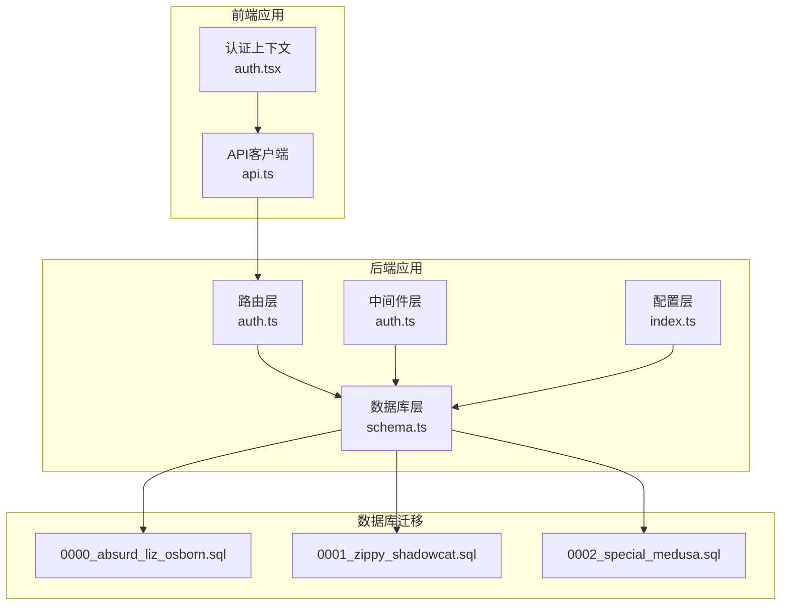
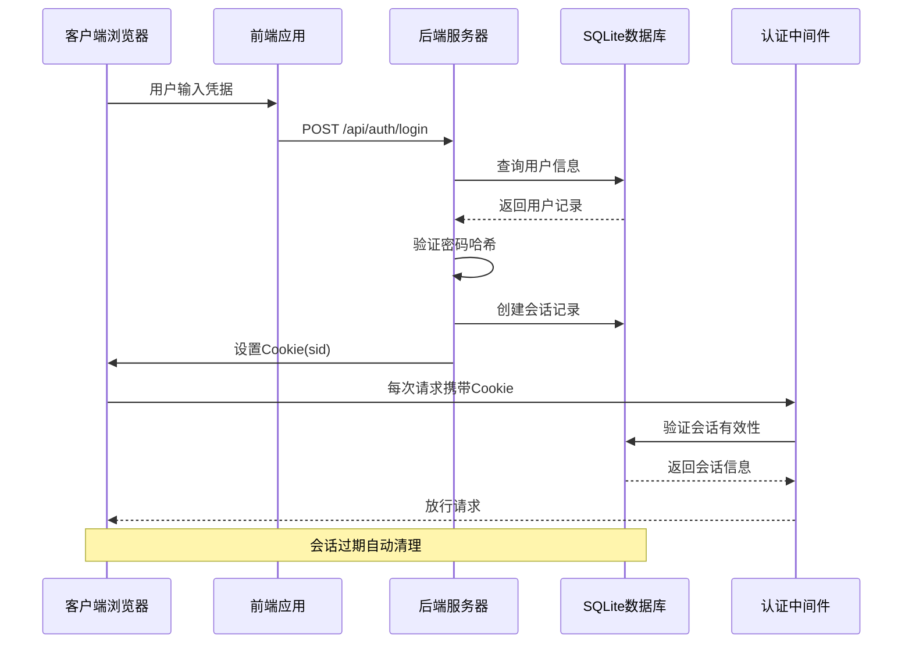
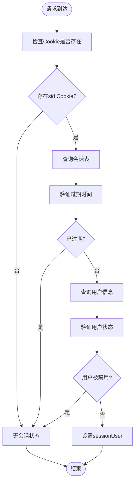
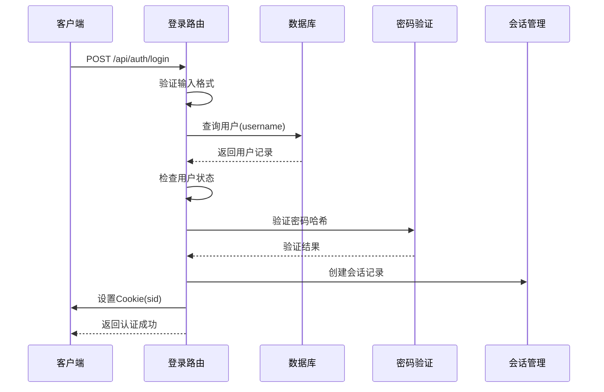
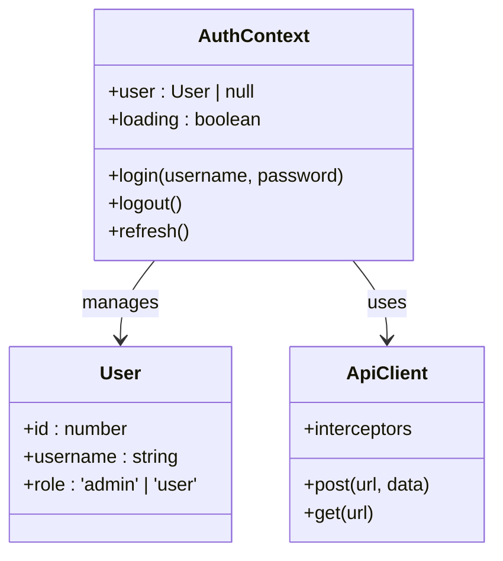
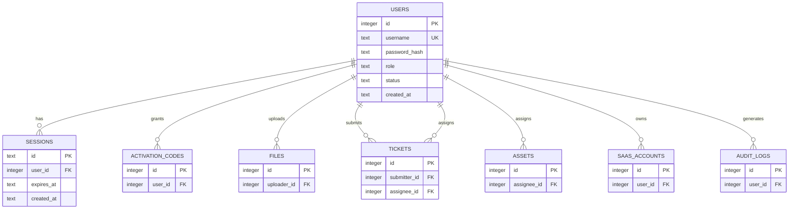

# 用户认证模型

<cite>
**本文档引用的文件**
- [schema.ts](file://apps/server/src/db/schema.ts)
- [auth.ts](file://apps/server/src/middleware/auth.ts)
- [auth.ts](file://apps/server/src/routes/auth.ts)
- [index.ts](file://apps/server/src/db/index.ts)
- [0000_absurd_liz_osborn.sql](file://apps/server/drizzle/0000_absurd_liz_osborn.sql)
- [0001_zippy_shadowcat.sql](file://apps/server/drizzle/0001_zippy_shadowcat.sql)
- [0002_special_medusa.sql](file://apps/server/drizzle/0002_special_medusa.sql)
- [0000_snapshot.json](file://apps/server/drizzle/meta/0000_snapshot.json)
- [auth.tsx](file://apps/web/src/lib/auth.tsx)
- [api.ts](file://apps/web/src/lib/api.ts)
</cite>

## 目录
1. [简介](#简介)
2. [项目结构](#项目结构)
3. [核心组件](#核心组件)
4. [架构概览](#架构概览)
5. [详细组件分析](#详细组件分析)
6. [依赖分析](#依赖分析)
7. [性能考虑](#性能考虑)
8. [故障排除指南](#故障排除指南)
9. [结论](#结论)

## 简介

本文档深入解析了该系统的用户认证相关数据模型设计，重点涵盖users用户表和sessions会话表的设计原理、业务用途以及安全考虑。文档详细说明了用户表中的id、username、passwordHash、role、status等字段的数据类型、约束条件和业务含义，解释了会话表中userId外键关联、expiresAt过期时间管理和自动级联删除机制。同时包含了用户角色枚举（admin、user）和状态枚举（active、disabled）的设计考虑，提供了用户认证流程中的数据流转示例，说明JWT令牌与会话表的关联关系，并讨论了密码哈希存储的安全考虑和会话生命周期管理。

## 项目结构

该项目采用分层架构设计，认证相关的代码分布在以下关键位置：

**图表来源**
- [schema.ts:1-330](file://apps/server/src/db/schema.ts#L1-L330)
- [auth.ts:1-56](file://apps/server/src/middleware/auth.ts#L1-L56)
- [auth.ts:1-51](file://apps/server/src/routes/auth.ts#L1-L51)

**章节来源**
- [schema.ts:1-330](file://apps/server/src/db/schema.ts#L1-L330)
- [auth.ts:1-56](file://apps/server/src/middleware/auth.ts#L1-L56)
- [auth.ts:1-51](file://apps/server/src/routes/auth.ts#L1-L51)

## 核心组件

### 数据模型概述

系统采用Drizzle ORM进行数据库建模，核心认证数据模型由两个主要表组成：

1. **users用户表**：存储用户基本信息和认证凭据
2. **sessions会话表**：管理用户会话状态和生命周期

### 数据库连接配置

数据库连接通过Better SQLite3实现，具备以下特性：
- WAL模式优化并发写入
- 外键约束启用确保数据完整性
- 自动目录创建确保数据库文件存在

**章节来源**
- [index.ts:1-16](file://apps/server/src/db/index.ts#L1-L16)

## 架构概览

系统采用基于会话的认证架构，结合前端Cookie管理和后端数据库存储：

**图表来源**
- [auth.ts:9-33](file://apps/server/src/routes/auth.ts#L9-L33)
- [auth.ts:17-40](file://apps/server/src/middleware/auth.ts#L17-L40)

## 详细组件分析

### users用户表设计

#### 字段定义与约束

| 字段名 | 数据类型 | 约束条件 | 业务含义 |
|--------|----------|----------|----------|
| id | integer | 主键, 自增 | 用户唯一标识符 |
| username | text | 非空, 唯一 | 用户登录名 |
| passwordHash | text | 非空 | 密码哈希值 |
| role | text enum | 非空, 默认'user' | 用户角色(admin, user) |
| status | text enum | 非空, 默认'active' | 用户状态(active, disabled) |
| createdAt | text | 非空, 默认当前时间 | 账户创建时间 |

#### 角色枚举设计

系统支持两种用户角色：
- **admin**: 系统管理员，拥有最高权限
- **user**: 普通用户，基础访问权限

角色设计考虑了最小权限原则，通过中间件实现权限控制。

#### 状态枚举设计

用户状态管理：
- **active**: 正常激活状态，可正常登录
- **disabled**: 被禁用状态，禁止登录

状态机制为账户安全提供了灵活的控制手段。

**章节来源**
- [schema.ts:3-10](file://apps/server/src/db/schema.ts#L3-L10)
- [0000_absurd_liz_osborn.sql:99-106](file://apps/server/drizzle/0000_absurd_liz_osborn.sql#L99-L106)

### sessions会话表设计

#### 字段定义与约束

| 字段名 | 数据类型 | 约束条件 | 业务含义 |
|--------|----------|----------|----------|
| id | text | 主键 | 会话唯一标识符 |
| userId | integer | 非空, 外键(users.id) | 关联用户ID |
| expiresAt | text | 非空 | 会话过期时间 |
| createdAt | text | 非空, 默认当前时间 | 会话创建时间 |

#### 外键关联机制

会话表通过userId字段与users表建立外键关系，采用级联删除策略：
- 当用户被删除时，其所有会话记录自动清理
- 确保数据一致性，防止悬挂引用

#### 过期时间管理

会话过期采用绝对时间戳存储：
- 过期时间计算：当前时间 + 7天
- 存储格式：ISO 8601字符串
- 验证逻辑：比较expiresAt与当前时间

**章节来源**
- [schema.ts:12-17](file://apps/server/src/db/schema.ts#L12-L17)
- [0000_absurd_liz_osborn.sql:67-73](file://apps/server/drizzle/0000_absurd_liz_osborn.sql#L67-L73)

### 认证中间件实现

#### 会话加载机制

中间件负责在每个请求到达时验证会话有效性：

**图表来源**
- [auth.ts:17-40](file://apps/server/src/middleware/auth.ts#L17-L40)

#### 权限控制机制

系统提供两级权限控制：
- **requireAuth**: 基础认证检查
- **requireAdmin**: 管理员权限检查

权限检查失败返回相应的HTTP状态码和错误信息。

**章节来源**
- [auth.ts:42-56](file://apps/server/src/middleware/auth.ts#L42-L56)

### 认证路由实现

#### 登录流程

登录过程包含完整的安全验证：

**图表来源**
- [auth.ts:9-33](file://apps/server/src/routes/auth.ts#L9-L33)

#### 会话生命周期

会话管理包括创建、验证和清理三个阶段：
- **创建**: 生成随机会话ID，设置7天有效期
- **验证**: 每次请求检查会话有效性和用户状态
- **清理**: 自动过期清理和手动登出

**章节来源**
- [auth.ts:35-50](file://apps/server/src/routes/auth.ts#L35-L50)

### 前端认证集成

#### 认证上下文设计

前端使用React Context管理认证状态：

**图表来源**
- [auth.tsx:4-16](file://apps/web/src/lib/auth.tsx#L4-L16)

#### API客户端配置

API客户端具备以下特性：
- 使用withCredentials保持Cookie会话
- 统一的错误处理机制
- 自动重定向到登录页面

**章节来源**
- [api.ts:1-16](file://apps/web/src/lib/api.ts#L1-L16)

## 依赖分析

### 数据库依赖关系

**图表来源**
- [schema.ts:1-330](file://apps/server/src/db/schema.ts#L1-L330)

### 外键约束分析

系统通过外键约束确保数据完整性：
- **会话表**: 级联删除用户时自动清理会话
- **激活码表**: 关联用户授予记录
- **文件表**: 记录文件上传者
- **工单系统**: 关联提交人和处理人
- **资产管理**: 关联资产负责人
- **SaaS账户**: 关联服务使用者

**章节来源**
- [0000_absurd_liz_osborn.sql:67-73](file://apps/server/drizzle/0000_absurd_liz_osborn.sql#L67-L73)
- [0001_zippy_shadowcat.sql:1-132](file://apps/server/drizzle/0001_zippy_shadowcat.sql#L1-L132)
- [0002_special_medusa.sql:1-125](file://apps/server/drizzle/0002_special_medusa.sql#L1-L125)

## 性能考虑

### 数据库性能优化

1. **索引策略**
   - 用户名字段建立唯一索引，支持快速查找
   - 会话ID作为主键，查询效率高

2. **查询优化**
   - 使用参数化查询防止SQL注入
   - 合理的WHERE条件减少扫描范围

3. **内存管理**
   - Better SQLite3内存映射提高I/O性能
   - WAL模式支持并发读写

### 认证性能考量

1. **密码验证成本**
   - Argon2算法提供安全但耗时的密码验证
   - 建议在生产环境调整参数平衡安全与性能

2. **会话缓存**
   - 可考虑在应用层添加会话缓存减少数据库查询
   - 缓存失效策略需要与数据库状态同步

3. **Cookie优化**
   - HttpOnly Cookie防止XSS攻击
   - SameSite属性防范CSRF攻击

## 故障排除指南

### 常见认证问题

#### 登录失败排查

1. **用户名不存在**
   - 检查用户是否被禁用(status='disabled')
   - 验证用户名大小写敏感性

2. **密码错误**
   - 确认密码哈希验证流程
   - 检查Argon2库版本兼容性

3. **会话创建失败**
   - 验证数据库连接状态
   - 检查会话表外键约束

#### 会话验证失败

1. **Cookie丢失**
   - 检查Cookie设置标志位
   - 验证SameSite属性配置

2. **会话过期**
   - 检查expiresAt字段值
   - 验证系统时间同步

3. **用户状态变更**
   - 确认用户状态从active变为disabled
   - 检查权限中间件逻辑

**章节来源**
- [auth.ts:17-40](file://apps/server/src/middleware/auth.ts#L17-L40)
- [auth.ts:9-33](file://apps/server/src/routes/auth.ts#L9-L33)

### 数据库迁移问题

#### 迁移脚本分析

系统使用Drizzle进行数据库迁移，包含三个主要迁移：

1. **初始迁移(0000)**: 创建核心表结构
2. **扩展迁移(0001)**: 添加资产管理相关表
3. **监控迁移(0002)**: 添加运维监控相关表

#### 迁移执行顺序

迁移按时间戳顺序执行，确保数据库结构演进：
- 0000_absurd_liz_osborn.sql: 2026-05-17
- 0001_zippy_shadowcat.sql: 2026-05-17  
- 0002_special_medusa.sql: 2026-05-24

**章节来源**
- [0000_snapshot.json:1-757](file://apps/server/drizzle/meta/0000_snapshot.json#L1-L757)
- [_journal.json:1-27](file://apps/server/drizzle/meta/_journal.json#L1-L27)

## 结论

该用户认证系统采用了成熟的安全设计模式，通过以下关键特性确保系统的安全性与可靠性：

### 安全特性

1. **密码安全**: 使用Argon2算法进行密码哈希存储，提供抗暴力破解能力
2. **会话管理**: 基于Cookie的会话机制，支持自动过期和级联删除
3. **权限控制**: 中间件级别的权限验证，支持管理员和普通用户区分
4. **数据完整性**: 外键约束确保引用完整性，防止数据不一致

### 设计优势

1. **模块化架构**: 清晰的分层设计便于维护和扩展
2. **类型安全**: TypeScript提供编译时类型检查
3. **前后端分离**: 前后端职责明确，接口清晰
4. **数据库抽象**: Drizzle ORM提供跨数据库兼容性

### 改进建议

1. **会话持久化**: 考虑添加会话刷新机制避免频繁重新登录
2. **多设备支持**: 实现同一用户多设备登录管理
3. **审计日志**: 扩展认证相关的审计记录
4. **安全监控**: 添加异常登录检测和防护机制

该认证模型为整个系统的安全基础设施奠定了坚实基础，通过合理的数据设计和严格的访问控制，为后续功能扩展提供了可靠保障。