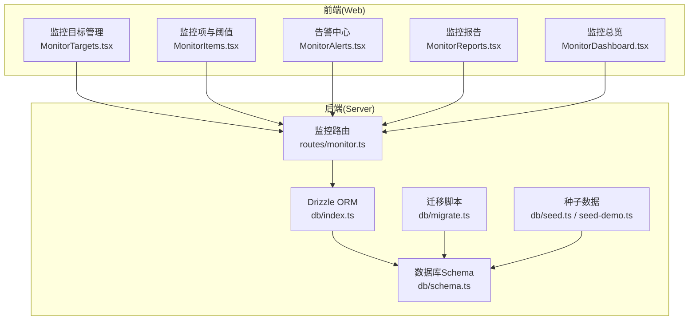
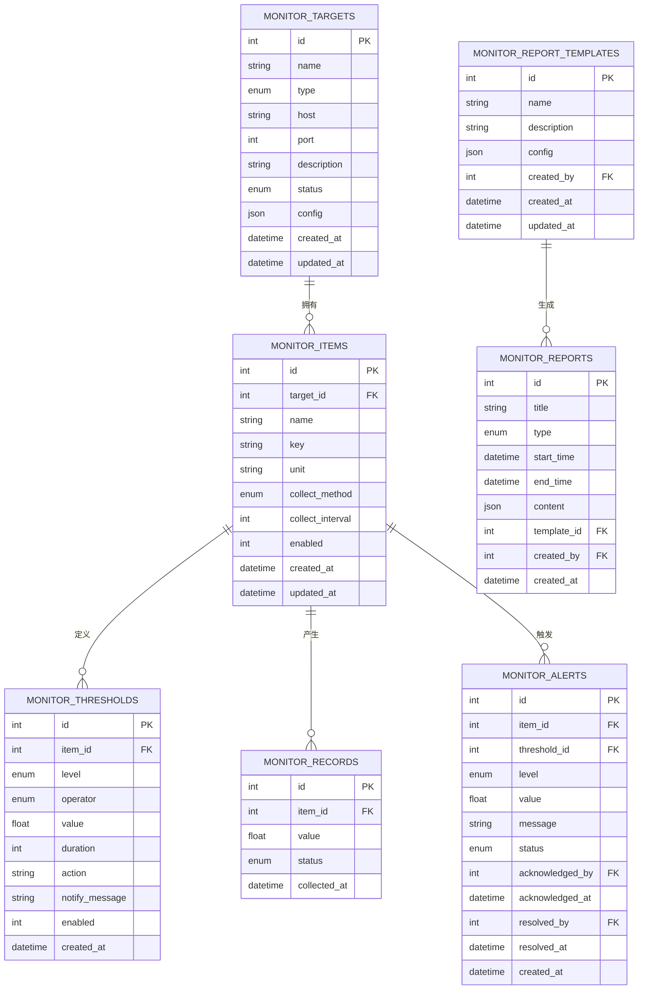
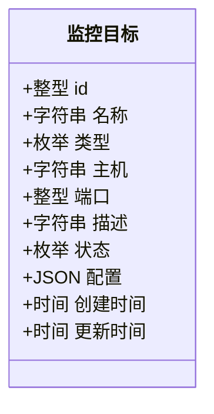
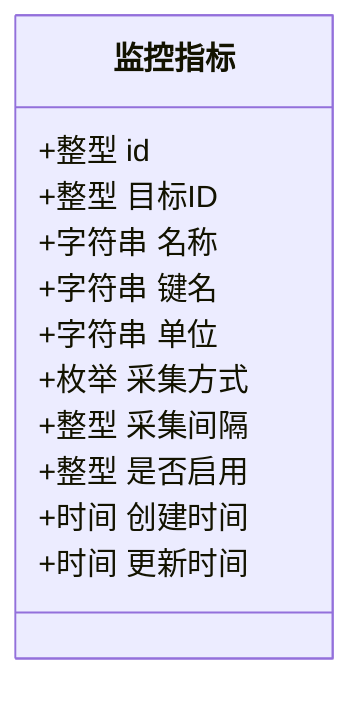
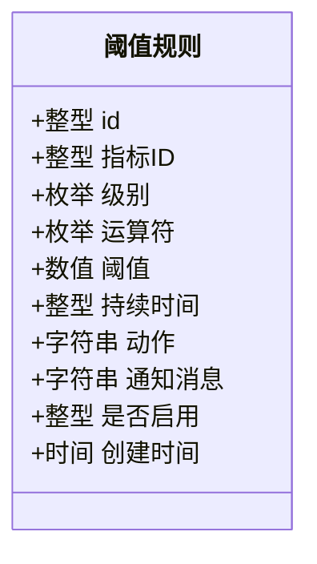
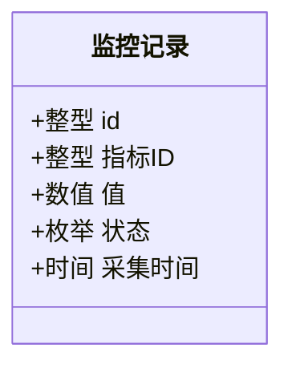
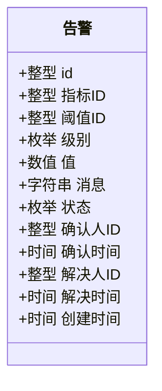
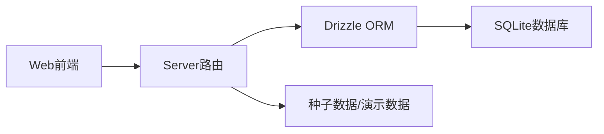

# 监控系统模型

<cite>
**本文档引用的文件**
- [apps/server/src/db/schema.ts](file://apps/server/src/db/schema.ts)
- [apps/server/src/routes/monitor.ts](file://apps/server/src/routes/monitor.ts)
- [apps/web/src/pages/admin/MonitorTargets.tsx](file://apps/web/src/pages/admin/MonitorTargets.tsx)
- [apps/web/src/pages/admin/MonitorItems.tsx](file://apps/web/src/pages/admin/MonitorItems.tsx)
- [apps/web/src/pages/admin/MonitorAlerts.tsx](file://apps/web/src/pages/admin/MonitorAlerts.tsx)
- [apps/web/src/pages/admin/MonitorReports.tsx](file://apps/web/src/pages/admin/MonitorReports.tsx)
- [apps/web/src/pages/admin/MonitorDashboard.tsx](file://apps/web/src/pages/admin/MonitorDashboard.tsx)
- [apps/server/src/db/index.ts](file://apps/server/src/db/index.ts)
- [apps/server/src/db/migrate.ts](file://apps/server/src/db/migrate.ts)
- [apps/server/src/db/seed.ts](file://apps/server/src/db/seed.ts)
- [apps/server/src/db/seed-demo.ts](file://apps/server/src/db/seed-demo.ts)
</cite>

## 目录
1. [简介](#简介)
2. [项目结构](#项目结构)
3. [核心组件](#核心组件)
4. [架构总览](#架构总览)
5. [详细组件分析](#详细组件分析)
6. [依赖关系分析](#依赖关系分析)
7. [性能考量](#性能考量)
8. [故障排查指南](#故障排查指南)
9. [结论](#结论)
10. [附录](#附录)

## 简介
本文件系统性梳理监控系统的核心数据模型与业务流程，覆盖监控目标、监控指标、阈值规则、监控记录、告警、报告模板与报告等关键表的设计理念与用途。同时结合前后端实现，说明监控目标的类型分类与状态管理、指标采集方法与间隔配置、阈值规则的运算符与告警级别、告警的确认与解决流程、监控记录的实时存储与历史分析，以及报告生成与模板管理的完整体系。

## 项目结构
监控系统采用分层设计：
- 数据层：基于 SQLite 的 Drizzle ORM 模式定义，集中于 schema.ts 中。
- 接口层：Fastify 路由提供 REST API，负责监控目标、指标、阈值、记录、告警、报告与模板的增删改查。
- 前端层：Ant Design 组件封装监控仪表盘、目标管理、指标与阈值管理、告警中心、报告与模板管理等页面。



图表来源
- [apps/server/src/routes/monitor.ts](file://apps/server/src/routes/monitor.ts)
- [apps/server/src/db/schema.ts](file://apps/server/src/db/schema.ts)
- [apps/server/src/db/index.ts](file://apps/server/src/db/index.ts)
- [apps/server/src/db/migrate.ts](file://apps/server/src/db/migrate.ts)
- [apps/server/src/db/seed.ts](file://apps/server/src/db/seed.ts)
- [apps/server/src/db/seed-demo.ts](file://apps/server/src/db/seed-demo.ts)
- [apps/web/src/pages/admin/MonitorTargets.tsx](file://apps/web/src/pages/admin/MonitorTargets.tsx)
- [apps/web/src/pages/admin/MonitorItems.tsx](file://apps/web/src/pages/admin/MonitorItems.tsx)
- [apps/web/src/pages/admin/MonitorAlerts.tsx](file://apps/web/src/pages/admin/MonitorAlerts.tsx)
- [apps/web/src/pages/admin/MonitorReports.tsx](file://apps/web/src/pages/admin/MonitorReports.tsx)
- [apps/web/src/pages/admin/MonitorDashboard.tsx](file://apps/web/src/pages/admin/MonitorDashboard.tsx)

章节来源
- [apps/server/src/db/schema.ts](file://apps/server/src/db/schema.ts)
- [apps/server/src/routes/monitor.ts](file://apps/server/src/routes/monitor.ts)
- [apps/server/src/db/index.ts](file://apps/server/src/db/index.ts)
- [apps/server/src/db/migrate.ts](file://apps/server/src/db/migrate.ts)
- [apps/server/src/db/seed.ts](file://apps/server/src/db/seed.ts)
- [apps/server/src/db/seed-demo.ts](file://apps/server/src/db/seed-demo.ts)

## 核心组件
- 监控目标表（monitorTargets）：定义被监控对象，支持类型分类与状态管理。
- 监控指标表（monitorItems）：定义具体监控项，绑定目标、采集方式与采集间隔。
- 阈值表（monitorThresholds）：定义阈值规则，含运算符、级别、持续时间与通知模板。
- 监控记录表（monitorRecords）：存储实时采集值与状态，用于历史分析。
- 告警表（monitorAlerts）：记录触发的告警，支持确认与解决流程。
- 报告模板表（monitorReportTemplates）：定义报告模板配置。
- 报告表（monitorReports）：按模板生成并存储报告内容。

章节来源
- [apps/server/src/db/schema.ts](file://apps/server/src/db/schema.ts)

## 架构总览
监控系统围绕“目标—指标—阈值—记录—告警—报告”的闭环构建，前端通过 API 获取数据并展示，后端通过 Drizzle ORM 持久化到 SQLite，并提供审计日志与平台接入能力。



图表来源
- [apps/server/src/db/schema.ts](file://apps/server/src/db/schema.ts)

## 详细组件分析

### 监控目标表（monitorTargets）
- 设计要点
  - 类型字段枚举支持 device、system、database、service 等，便于分类管理与后续扩展。
  - 状态字段枚举支持 online、offline、warning、critical，用于统一状态治理。
  - 支持配置字段存储目标特定参数（如认证信息、探测参数等）。
- 业务用途
  - 作为监控指标的归属对象，支撑跨层级的监控视图与统计。
- 前端映射
  - 后端接口支持按类型过滤与分页；前端页面提供新增、编辑、删除与状态查看。



图表来源
- [apps/server/src/db/schema.ts](file://apps/server/src/db/schema.ts)

章节来源
- [apps/server/src/db/schema.ts](file://apps/server/src/db/schema.ts)
- [apps/web/src/pages/admin/MonitorTargets.tsx](file://apps/web/src/pages/admin/MonitorTargets.tsx)
- [apps/server/src/routes/monitor.ts](file://apps/server/src/routes/monitor.ts)

### 监控指标表（monitorItems）
- 设计要点
  - 关联监控目标，保证指标的归属清晰。
  - 采集方式支持多种（如 agent、snmp、http、icmp、script、wmi），满足不同场景。
  - 采集间隔可配置，默认 60 秒，支持启用/禁用。
- 业务用途
  - 定义具体的监控项（如 CPU 使用率、内存空闲、磁盘 IO 等），承载阈值规则与采集任务。
- 前端映射
  - 新增/编辑时需选择目标、填写键名与单位、设置采集方式与间隔；支持批量打开阈值规则抽屉进行配置。



图表来源
- [apps/server/src/db/schema.ts](file://apps/server/src/db/schema.ts)

章节来源
- [apps/server/src/db/schema.ts](file://apps/server/src/db/schema.ts)
- [apps/web/src/pages/admin/MonitorItems.tsx](file://apps/web/src/pages/admin/MonitorItems.tsx)
- [apps/server/src/routes/monitor.ts](file://apps/server/src/routes/monitor.ts)

### 阈值表（monitorThresholds）
- 设计要点
  - 关联监控指标，形成“指标—阈值”一对多关系。
  - 级别支持 warning、critical；运算符支持 gt、lt、eq、gte、lte。
  - 支持持续时间（秒），用于防抖与稳定性判断；支持动作与通知消息模板。
- 业务用途
  - 将阈值规则与告警联动，实现自动化告警与通知。
- 前端映射
  - 在指标详情抽屉中管理阈值规则，支持新增、编辑、删除与启用控制。



图表来源
- [apps/server/src/db/schema.ts](file://apps/server/src/db/schema.ts)

章节来源
- [apps/server/src/db/schema.ts](file://apps/server/src/db/schema.ts)
- [apps/web/src/pages/admin/MonitorItems.tsx](file://apps/web/src/pages/admin/MonitorItems.tsx)
- [apps/server/src/routes/monitor.ts](file://apps/server/src/routes/monitor.ts)

### 监控记录表（monitorRecords）
- 设计要点
  - 记录每次采集的值与状态（normal、warning、critical），按采集时间排序。
  - 为历史数据分析与报告生成提供基础数据。
- 业务用途
  - 实时存储采集结果，支持按时间范围筛选与聚合统计。
- 前端映射
  - 后端提供按指标与时间范围查询接口，支持分页与排序。



图表来源
- [apps/server/src/db/schema.ts](file://apps/server/src/db/schema.ts)

章节来源
- [apps/server/src/db/schema.ts](file://apps/server/src/db/schema.ts)
- [apps/server/src/routes/monitor.ts](file://apps/server/src/routes/monitor.ts)

### 告警表（monitorAlerts）
- 设计要点
  - 关联指标与阈值，记录触发告警的级别、值与消息。
  - 状态支持 pending、acknowledged、resolved，支持确认人与解决人的审计追踪。
- 业务用途
  - 承载告警生命周期管理，支持确认与解决流程。
- 前端映射
  - 告警中心支持按级别与状态筛选，提供确认与解决操作。



图表来源
- [apps/server/src/db/schema.ts](file://apps/server/src/db/schema.ts)

章节来源
- [apps/server/src/db/schema.ts](file://apps/server/src/db/schema.ts)
- [apps/web/src/pages/admin/MonitorAlerts.tsx](file://apps/web/src/pages/admin/MonitorAlerts.tsx)
- [apps/server/src/routes/monitor.ts](file://apps/server/src/routes/monitor.ts)

### 报告模板表（monitorReportTemplates）与报告表（monitorReports）
- 设计要点
  - 模板表存储模板名称、描述与配置（JSON），支持复用与定制。
  - 报告表存储标题、类型（daily、weekly、monthly、custom）、时间范围、内容（JSON）与模板引用。
- 业务用途
  - 通过模板生成标准化报告，支持历史趋势分析与合规汇报。
- 前端映射
  - 报告页面支持生成报告、查看详情、删除报告与管理模板。

```mermaid
classDiagram
class 报告模板 {
+整型 id
+字符串 名称
+字符串 描述
+JSON 配置
+整型 创建人ID
+时间 创建时间
+时间 更新时间
}
class 报告 {
+整型 id
+字符串 标题
+枚举 类型
+时间 开始时间
+时间 结束时间
+JSON 内容
+整型 模板ID
+整型 创建人ID
+时间 创建时间
}
报告模板 ||--o{ 报告 : "生成"
```

图表来源
- [apps/server/src/db/schema.ts](file://apps/server/src/db/schema.ts)

章节来源
- [apps/server/src/db/schema.ts](file://apps/server/src/db/schema.ts)
- [apps/web/src/pages/admin/MonitorReports.tsx](file://apps/web/src/pages/admin/MonitorReports.tsx)
- [apps/server/src/routes/monitor.ts](file://apps/server/src/routes/monitor.ts)

## 依赖关系分析
- 外部依赖
  - SQLite：轻量级嵌入式数据库，适合中小规模部署与演示。
  - Drizzle ORM：提供类型安全的 SQL 构建与迁移工具。
  - Fastify：高性能 Web 框架，提供 REST API。
  - Ant Design：前端 UI 组件库，提供丰富的表格、表单与可视化组件。
- 内部耦合
  - 路由层依赖数据库层的 Schema 定义，确保 CRUD 行为与数据结构一致。
  - 前端页面通过 API 与后端交互，保持界面与逻辑解耦。
- 循环依赖
  - 当前结构未发现循环依赖，模块职责清晰。



图表来源
- [apps/server/src/db/index.ts](file://apps/server/src/db/index.ts)
- [apps/server/src/db/migrate.ts](file://apps/server/src/db/migrate.ts)
- [apps/server/src/db/seed.ts](file://apps/server/src/db/seed.ts)
- [apps/server/src/db/seed-demo.ts](file://apps/server/src/db/seed-demo.ts)

章节来源
- [apps/server/src/db/index.ts](file://apps/server/src/db/index.ts)
- [apps/server/src/db/migrate.ts](file://apps/server/src/db/migrate.ts)
- [apps/server/src/db/seed.ts](file://apps/server/src/db/seed.ts)
- [apps/server/src/db/seed-demo.ts](file://apps/server/src/db/seed-demo.ts)

## 性能考量
- 存储与索引
  - SQLite 默认 WAL 模式提升并发读写性能；建议在高频查询字段（如 collected_at、created_at）上建立索引以优化分页与筛选。
- 查询优化
  - 分页参数限制（最大每页 100 条）避免大结果集返回；按时间范围过滤减少扫描。
- 数据量控制
  - 建议定期归档历史监控记录，保留必要的分析周期（如 90 天），降低查询压力。
- 采集频率
  - 合理设置指标采集间隔，避免过于频繁导致数据库写入压力过大。

## 故障排查指南
- 常见问题
  - 监控目标状态异常：检查目标配置与连通性，核对类型与端口是否正确。
  - 阈值不生效：确认指标启用状态、阈值规则启用状态与运算符设置。
  - 告警未确认/解决：检查用户权限与流程，确认确认/解决接口调用是否成功。
  - 报告生成失败：核对时间范围与模板配置，检查内容序列化格式。
- 审计与日志
  - 后端提供审计日志接口，可用于追踪操作行为与异常事件。
- 数据一致性
  - 使用事务与外键约束保障级联删除与引用完整性；迁移脚本确保数据库结构演进可控。

章节来源
- [apps/server/src/routes/monitor.ts](file://apps/server/src/routes/monitor.ts)

## 结论
监控系统通过明确的数据模型与清晰的业务流程，实现了从目标管理、指标配置、阈值规则、实时记录到告警与报告的全链路闭环。前端以直观的方式呈现监控总览与告警动态，后端以稳定的数据层支撑高可用的运维监控能力。建议在生产环境中结合索引优化、数据归档与合理的采集策略，持续提升系统性能与可维护性。

## 附录

### 监控目标类型与状态对照
- 类型：device、system、database、service（前端页面支持 server、network、application、database、container、other 等选项）
- 状态：online、offline、warning、critical

章节来源
- [apps/server/src/db/schema.ts](file://apps/server/src/db/schema.ts)
- [apps/web/src/pages/admin/MonitorTargets.tsx](file://apps/web/src/pages/admin/MonitorTargets.tsx)

### 指标采集方式与间隔配置
- 采集方式：agent、snmp、http、icmp、script、wmi
- 采集间隔：秒级配置，默认 60 秒

章节来源
- [apps/server/src/db/schema.ts](file://apps/server/src/db/schema.ts)
- [apps/web/src/pages/admin/MonitorItems.tsx](file://apps/web/src/pages/admin/MonitorItems.tsx)

### 阈值规则运算符与告警级别
- 运算符：gt、lt、eq、gte、lte
- 级别：warning、critical
- 持续时间：秒（0 表示立即触发）

章节来源
- [apps/server/src/db/schema.ts](file://apps/server/src/db/schema.ts)
- [apps/web/src/pages/admin/MonitorItems.tsx](file://apps/web/src/pages/admin/MonitorItems.tsx)

### 告警确认与解决流程
- 流程：待处理 → 已确认 → 已解决
- 支持操作：确认、解决
- 审计：记录确认人与解决人

章节来源
- [apps/server/src/db/schema.ts](file://apps/server/src/db/schema.ts)
- [apps/web/src/pages/admin/MonitorAlerts.tsx](file://apps/web/src/pages/admin/MonitorAlerts.tsx)

### 监控记录与历史分析
- 字段：值、状态、采集时间
- 查询：按指标与时间范围过滤，支持分页与排序

章节来源
- [apps/server/src/db/schema.ts](file://apps/server/src/db/schema.ts)
- [apps/server/src/routes/monitor.ts](file://apps/server/src/routes/monitor.ts)

### 报告生成与模板管理
- 报告类型：daily、weekly、monthly、custom
- 模板配置：JSON 结构，支持复用与定制
- 生成流程：选择模板与时间范围，聚合统计并生成报告

章节来源
- [apps/server/src/db/schema.ts](file://apps/server/src/db/schema.ts)
- [apps/web/src/pages/admin/MonitorReports.tsx](file://apps/web/src/pages/admin/MonitorReports.tsx)
- [apps/server/src/routes/monitor.ts](file://apps/server/src/routes/monitor.ts)