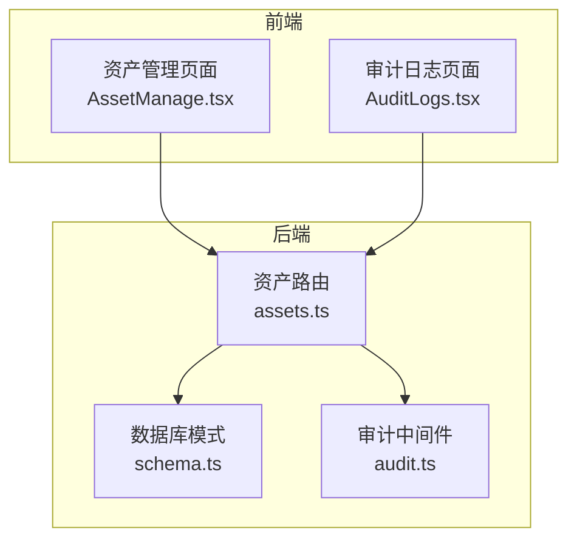
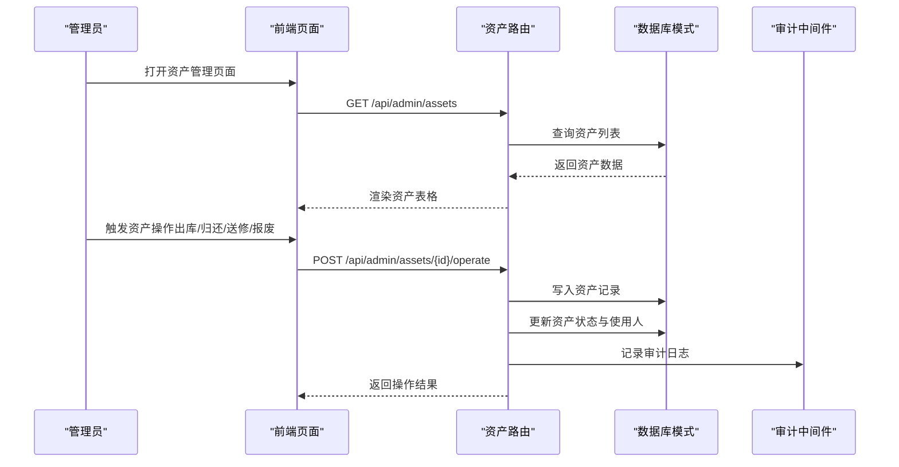
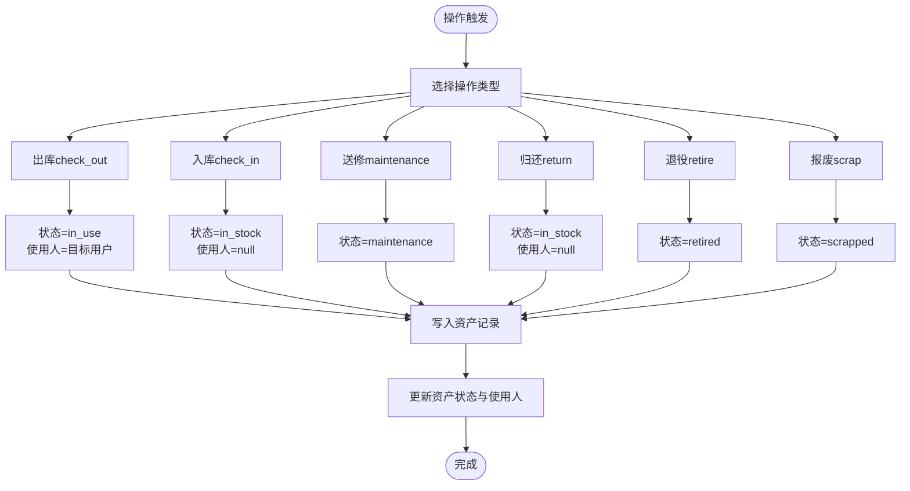
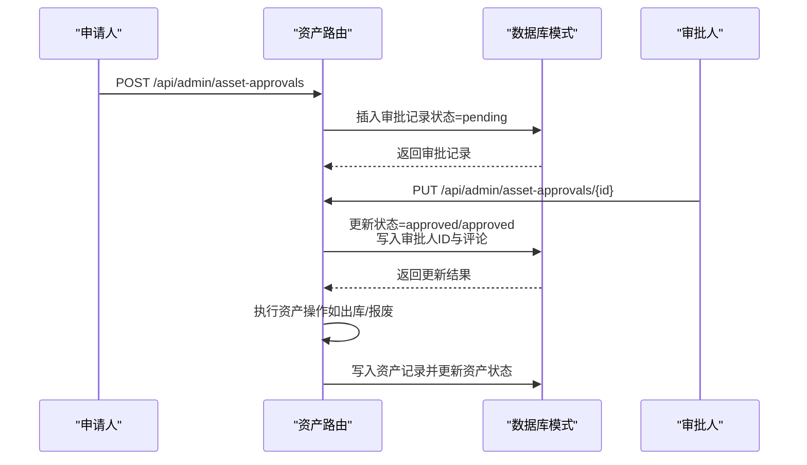
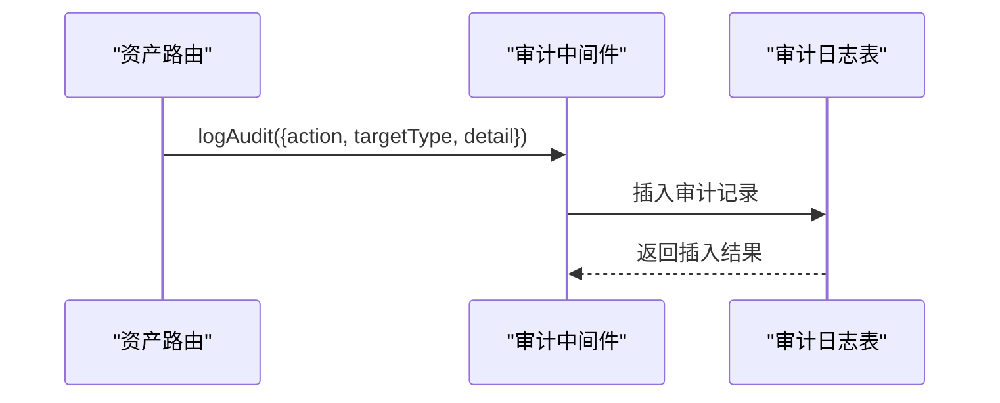
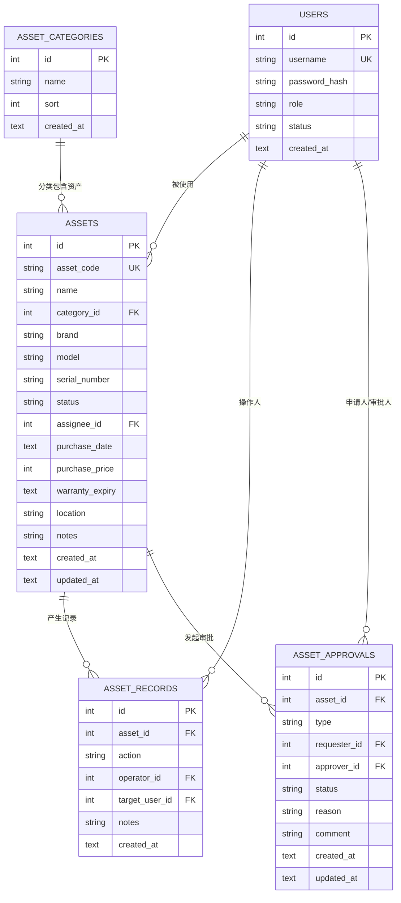

# 资产管理模型

<cite>
**本文引用的文件**
- [schema.ts](file://apps/server/src/db/schema.ts)
- [assets.ts](file://apps/server/src/routes/assets.ts)
- [AssetManage.tsx](file://apps/web/src/pages/admin/AssetManage.tsx)
- [audit.ts](file://apps/server/src/middleware/audit.ts)
- [AuditLogs.tsx](file://apps/web/src/pages/admin/AuditLogs.tsx)
- [seed.ts](file://apps/server/src/db/seed.ts)
- [seed-demo.ts](file://apps/server/src/db/seed-demo.ts)
</cite>

## 目录
1. [简介](#简介)
2. [项目结构](#项目结构)
3. [核心组件](#核心组件)
4. [架构总览](#架构总览)
5. [详细组件分析](#详细组件分析)
6. [依赖关系分析](#依赖关系分析)
7. [性能考量](#性能考量)
8. [故障排查指南](#故障排查指南)
9. [结论](#结论)
10. [附录](#附录)

## 简介
本文件系统性阐述资产管理相关的数据模型与业务流程，覆盖资产分类、资产条目、资产记录与资产审批四个核心表的设计理念与业务用途；详解资产状态管理（库存、使用、维护、退役、报废）与流转记录追踪；解释资产审批流程中的申请、审批与执行机制，以及多用户协作的审批权限设计；并提供资产盘点、借用归还、维修报废等业务场景的数据模型设计思路与审计追踪的实际应用示例。

## 项目结构
资产管理模块位于后端服务的数据库层与路由层，并通过前端页面提供可视化管理入口。整体结构如下：
- 数据库层：定义资产相关表结构与约束
- 路由层：提供资产分类、资产条目、资产操作与审批的 API
- 前端页面：资产列表、操作弹窗、统计与审计日志展示
- 审计中间件：统一记录关键操作的审计日志

图表来源
- [assets.ts:1-165](file://apps/server/src/routes/assets.ts#L1-L165)
- [schema.ts:122-169](file://apps/server/src/db/schema.ts#L122-L169)
- [audit.ts:1-28](file://apps/server/src/middleware/audit.ts#L1-L28)
- [AssetManage.tsx:1-133](file://apps/web/src/pages/admin/AssetManage.tsx#L1-L133)
- [AuditLogs.tsx:1-102](file://apps/web/src/pages/admin/AuditLogs.tsx#L1-L102)

章节来源
- [assets.ts:1-165](file://apps/server/src/routes/assets.ts#L1-L165)
- [schema.ts:122-169](file://apps/server/src/db/schema.ts#L122-L169)
- [AssetManage.tsx:1-133](file://apps/web/src/pages/admin/AssetManage.tsx#L1-L133)
- [AuditLogs.tsx:1-102](file://apps/web/src/pages/admin/AuditLogs.tsx#L1-L102)
- [audit.ts:1-28](file://apps/server/src/middleware/audit.ts#L1-L28)

## 核心组件
- 资产分类表（assetCategories）：用于对资产进行分类管理，支持排序与创建时间记录。
- 资产条目表（assets）：记录具体资产的属性、状态、归属与价值信息，支持与用户、分类的关联。
- 资产记录表（assetRecords）：记录资产的状态变更与操作历史，支撑审计与追踪。
- 资产审批表（assetApprovals）：记录资产相关审批请求、审批状态与评论，支撑多用户协作与权限控制。

章节来源
- [schema.ts:122-169](file://apps/server/src/db/schema.ts#L122-L169)

## 架构总览
资产管理的业务流围绕“资产条目”展开：通过路由层实现资产增删改查、状态变更操作与审批流程；每一步操作均生成资产记录与审计日志，形成闭环的审计追踪。

图表来源
- [assets.ts:72-100](file://apps/server/src/routes/assets.ts#L72-L100)
- [schema.ts:129-156](file://apps/server/src/db/schema.ts#L129-L156)
- [audit.ts:3-27](file://apps/server/src/middleware/audit.ts#L3-L27)
- [AssetManage.tsx:56-62](file://apps/web/src/pages/admin/AssetManage.tsx#L56-L62)

章节来源
- [assets.ts:72-100](file://apps/server/src/routes/assets.ts#L72-L100)
- [schema.ts:129-156](file://apps/server/src/db/schema.ts#L129-L156)
- [audit.ts:3-27](file://apps/server/src/middleware/audit.ts#L3-L27)
- [AssetManage.tsx:56-62](file://apps/web/src/pages/admin/AssetManage.tsx#L56-L62)

## 详细组件分析

### 资产分类表（assetCategories）
- 设计要点
  - 主键自增 id
  - 名称唯一性约束（通过前端/后端逻辑保障）
  - 排序字段与创建时间
- 业务用途
  - 为资产条目提供分类维度，便于统计与筛选
  - 支持多级分类的扩展（通过排序字段实现层级排序）

章节来源
- [schema.ts:122-127](file://apps/server/src/db/schema.ts#L122-L127)

### 资产条目表（assets）
- 设计要点
  - 资产编码唯一，便于资产识别与盘点
  - 状态枚举：in_stock、in_use、maintenance、retired、scrapped
  - 关联字段：分类、使用人（assigneeId）、购买日期、价格、质保到期、位置、备注
  - 创建与更新时间自动维护
- 业务用途
  - 存储资产的静态属性与动态状态
  - 作为资产记录与审批的主对象

章节来源
- [schema.ts:129-146](file://apps/server/src/db/schema.ts#L129-L146)

### 资产记录表（assetRecords）
- 设计要点
  - 关联资产条目
  - 操作类型枚举：check_in、check_out、maintenance、return、retire、scrap
  - 记录操作人、目标用户（出库时）与备注
  - 创建时间自动维护
- 业务用途
  - 追踪资产状态变化与流转历史
  - 作为审计证据与报表统计的基础

章节来源
- [schema.ts:148-156](file://apps/server/src/db/schema.ts#L148-L156)

### 资产审批表（assetApprovals）
- 设计要点
  - 关联资产条目
  - 审批类型枚举：check_out、return、scrap
  - 申请人与审批人、状态枚举：pending、approved、rejected
  - 原因与评论字段，便于审计与追溯
  - 创建与更新时间自动维护
- 业务用途
  - 支撑多用户协作的审批流程
  - 为资产状态变更提供合规依据

章节来源
- [schema.ts:158-169](file://apps/server/src/db/schema.ts#L158-L169)

### 资产状态管理与流转记录追踪
- 状态枚举与映射
  - in_stock：库存中
  - in_use：使用中
  - maintenance：维护中
  - retired：已退役
  - scrapped：已报废
- 流转映射（操作到状态）
  - 出库（check_out）→ in_use；同时更新使用人
  - 归还（return）→ in_stock；清空使用人
  - 入库（check_in）→ in_stock；清空使用人
  - 送修（maintenance）→ maintenance
  - 退役（retire）→ retired
  - 报废（scrap）→ scrapped
- 记录生成
  - 每次状态变更均插入一条资产记录，包含操作类型、操作人、目标用户与备注
  - 该记录可用于审计与报表统计

图表来源
- [assets.ts:79-97](file://apps/server/src/routes/assets.ts#L79-L97)
- [schema.ts:129-156](file://apps/server/src/db/schema.ts#L129-L156)

章节来源
- [assets.ts:79-97](file://apps/server/src/routes/assets.ts#L79-L97)
- [schema.ts:129-156](file://apps/server/src/db/schema.ts#L129-L156)

### 资产审批流程（申请、审批与执行）
- 申请阶段
  - 申请人提交审批申请，指定资产与类型（出库、归还、报废）
  - 状态为 pending
- 审批阶段
  - 审批人更新审批状态（approved/rejected），记录审批意见
- 执行阶段
  - 审批通过后，执行相应资产操作（如出库、报废），并生成资产记录
- 权限设计
  - 审批人字段允许为空，审批状态更新时写入审批人 ID，体现多用户协作

图表来源
- [assets.ts:122-143](file://apps/server/src/routes/assets.ts#L122-L143)
- [schema.ts:158-169](file://apps/server/src/db/schema.ts#L158-L169)

章节来源
- [assets.ts:122-143](file://apps/server/src/routes/assets.ts#L122-L143)
- [schema.ts:158-169](file://apps/server/src/db/schema.ts#L158-L169)

### 多用户协作与权限设计
- 用户角色
  - 系统内置用户表，支持 admin 与 user 角色
  - 资产审批涉及申请人与审批人，均通过用户 ID 关联
- 权限边界
  - 审批权限由业务角色决定，系统通过审批人字段与状态更新接口实现协作
  - 审计日志记录操作人、目标类型与结果，便于追溯

章节来源
- [schema.ts:3-17](file://apps/server/src/db/schema.ts#L3-L17)
- [assets.ts:133-142](file://apps/server/src/routes/assets.ts#L133-L142)
- [audit.ts:3-27](file://apps/server/src/middleware/audit.ts#L3-L27)

### 业务场景的数据模型设计

#### 资产盘点
- 数据模型
  - 通过资产记录表的汇总统计与资产状态分布，实现盘点结果的可视化
- 实施建议
  - 结合资产状态与分类维度进行统计
  - 与前端资产统计接口配合，输出盘点报表

章节来源
- [assets.ts:146-163](file://apps/server/src/routes/assets.ts#L146-L163)
- [seed.ts:79-92](file://apps/server/src/db/seed.ts#L79-L92)

#### 借用归还
- 数据模型
  - 出库（check_out）更新资产状态为 in_use，并设置使用人
  - 归还（return）更新资产状态为 in_stock，并清空使用人
- 实施建议
  - 借用时选择目标用户，归还时清空使用人
  - 通过资产记录表追踪借还历史

章节来源
- [assets.ts:79-97](file://apps/server/src/routes/assets.ts#L79-L97)
- [schema.ts:129-156](file://apps/server/src/db/schema.ts#L129-L156)

#### 维修报废
- 数据模型
  - 送修（maintenance）将资产状态置为 maintenance
  - 报废（scrap）将资产状态置为 scrapped，并生成相应记录
- 实施建议
  - 维修完成后可恢复为 in_stock 或根据实际处置更新状态
  - 报废流程需结合审批表进行合规控制

章节来源
- [assets.ts:79-97](file://apps/server/src/routes/assets.ts#L79-L97)
- [schema.ts:129-156](file://apps/server/src/db/schema.ts#L129-L156)

### 审计追踪与前端展示
- 审计日志
  - 审计中间件统一记录用户、动作、目标类型、结果与详情
  - 资产相关操作（创建、更新、删除、操作）均可被审计
- 前端展示
  - 审计日志页面支持按时间范围、操作类型、目标类型筛选
  - 便于追溯资产状态变更与审批流程

图表来源
- [audit.ts:3-27](file://apps/server/src/middleware/audit.ts#L3-L27)
- [schema.ts:301-314](file://apps/server/src/db/schema.ts#L301-L314)

章节来源
- [audit.ts:3-27](file://apps/server/src/middleware/audit.ts#L3-L27)
- [AuditLogs.tsx:28-101](file://apps/web/src/pages/admin/AuditLogs.tsx#L28-L101)
- [schema.ts:301-314](file://apps/server/src/db/schema.ts#L301-L314)

## 依赖关系分析
- 资产条目与资产记录：一对多关系，资产记录通过外键关联资产条目
- 资产条目与资产审批：一对多关系，审批记录通过外键关联资产条目
- 资产条目与用户：使用人字段与用户表关联
- 资产分类与资产条目：一对一关系，资产条目通过分类字段关联

图表来源
- [schema.ts:122-169](file://apps/server/src/db/schema.ts#L122-L169)

章节来源
- [schema.ts:122-169](file://apps/server/src/db/schema.ts#L122-L169)

## 性能考量
- 查询优化
  - 资产记录按创建时间倒序查询，建议在资产 ID 上建立索引以加速按资产过滤
  - 审计日志按时间范围与目标类型筛选，建议在相关字段建立索引
- 写入优化
  - 资产状态变更与记录写入在同一事务中，保证一致性
  - 审计日志异步写入，避免阻塞主流程
- 统计与报表
  - 资产统计接口遍历资产表，建议在状态与分类字段建立索引以提升统计效率

## 故障排查指南
- 常见问题
  - 资产状态异常：检查资产记录表中最近的操作记录，确认操作类型与状态映射是否正确
  - 审批流程卡住：检查审批表状态是否为 pending，确认审批人是否已处理
  - 审计日志缺失：确认审计中间件是否被调用，检查日志表字段是否正确
- 建议措施
  - 对关键操作增加前置校验（如资产是否存在、操作类型是否合法）
  - 对审批流程增加通知机制，避免审批超时
  - 对高频统计接口增加缓存策略，降低数据库压力

章节来源
- [assets.ts:76-84](file://apps/server/src/routes/assets.ts#L76-L84)
- [audit.ts:3-27](file://apps/server/src/middleware/audit.ts#L3-L27)

## 结论
资产管理模型通过资产分类、资产条目、资产记录与资产审批四个表实现了资产全生命周期的数字化管理。状态枚举与操作映射清晰地描述了资产流转规则；审批表支撑多用户协作与合规控制；审计日志提供完整的审计追踪能力。结合前端页面与统计接口，可满足资产盘点、借用归还、维修报废等典型业务场景，并为后续扩展（如资产折旧、供应商管理等）奠定坚实基础。

## 附录
- 种子数据
  - 资产分类种子：软件许可、计算设备、外设配件、网络设备
  - 管理员用户：admin/admin123
- 前端页面
  - 资产管理页面：支持资产增删改查、状态变更与操作记录查看
  - 审计日志页面：支持按条件筛选与分页查看

章节来源
- [seed.ts:79-92](file://apps/server/src/db/seed.ts#L79-L92)
- [seed.ts:5-18](file://apps/server/src/db/seed.ts#L5-L18)
- [AssetManage.tsx:15-133](file://apps/web/src/pages/admin/AssetManage.tsx#L15-L133)
- [AuditLogs.tsx:28-101](file://apps/web/src/pages/admin/AuditLogs.tsx#L28-L101)