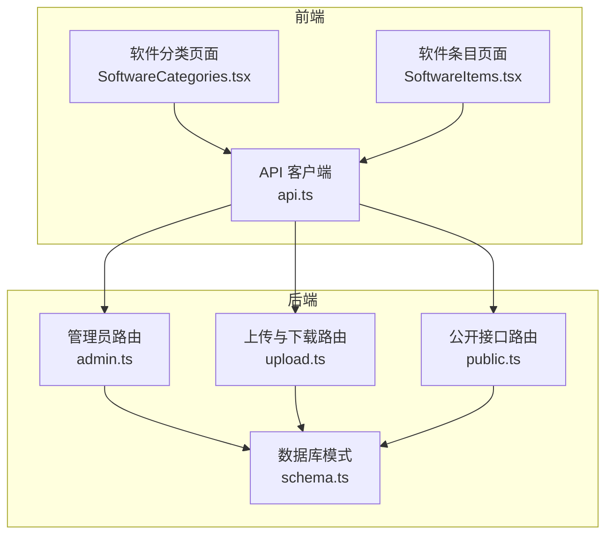
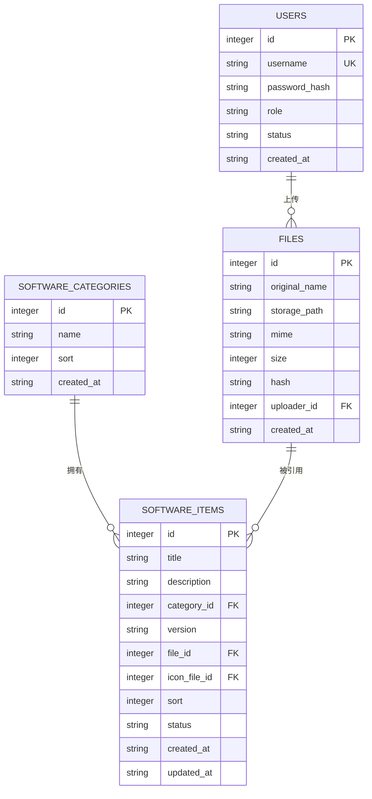
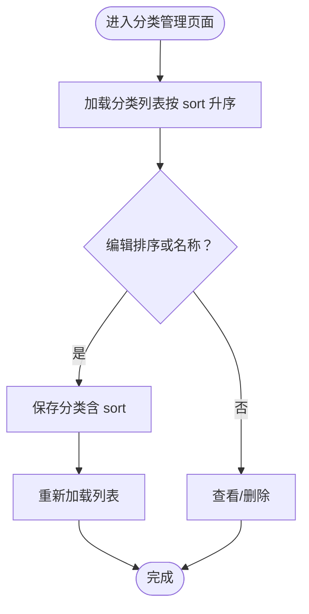
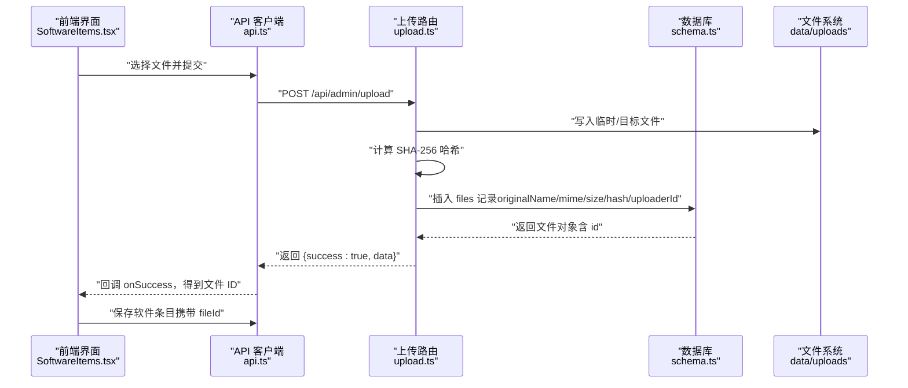
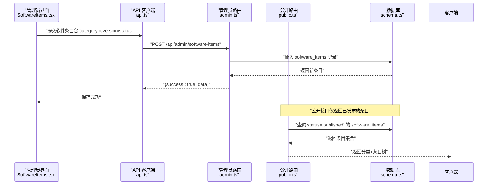
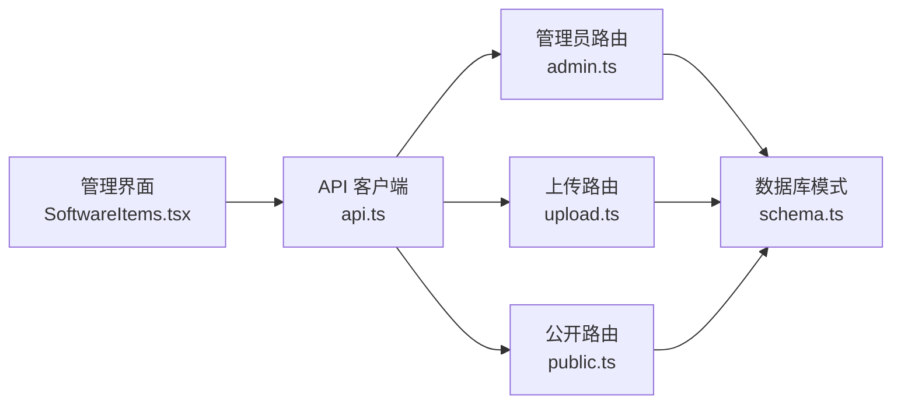

# 软件管理模型

<cite>
**本文引用的文件**
- [apps/server/src/db/schema.ts](file://apps/server/src/db/schema.ts)
- [apps/server/drizzle/0000_absurd_liz_osborn.sql](file://apps/server/drizzle/0000_absurd_liz_osborn.sql)
- [apps/server/src/routes/admin.ts](file://apps/server/src/routes/admin.ts)
- [apps/server/src/routes/upload.ts](file://apps/server/src/routes/upload.ts)
- [apps/server/src/routes/public.ts](file://apps/server/src/routes/public.ts)
- [apps/web/src/pages/admin/SoftwareCategories.tsx](file://apps/web/src/pages/admin/SoftwareCategories.tsx)
- [apps/web/src/pages/admin/SoftwareItems.tsx](file://apps/web/src/pages/admin/SoftwareItems.tsx)
- [packages/shared/src/schemas.ts](file://packages/shared/src/schemas.ts)
- [apps/web/src/lib/api.ts](file://apps/web/src/lib/api.ts)
</cite>

## 目录
1. [引言](#引言)
2. [项目结构](#项目结构)
3. [核心组件](#核心组件)
4. [架构总览](#架构总览)
5. [详细组件分析](#详细组件分析)
6. [依赖分析](#依赖分析)
7. [性能考虑](#性能考虑)
8. [故障排查指南](#故障排查指南)
9. [结论](#结论)
10. [附录](#附录)

## 引言
本文件聚焦于软件管理相关的数据模型与业务流程，系统性阐述以下三张核心表：softwareCategories（软件分类）、files（文件）与softwareItems（软件条目）。内容涵盖：
- 分类表的层级结构与排序机制
- 文件表的存储路径、哈希校验与元数据管理
- 条目表与分类、文件的外键关联、版本管理与发布状态控制
- 下载流程中的数据流转与上传完整性验证
- 实际应用场景与最佳实践建议

## 项目结构
该仓库采用前后端分离架构，软件管理功能由后端数据库与API、前端管理界面共同实现。数据库模式通过 Drizzle ORM 定义，迁移脚本确保数据库结构演进；前端使用 Ant Design 组件实现分类与软件条目的增删改查。

图表来源
- [apps/web/src/pages/admin/SoftwareCategories.tsx:1-70](file://apps/web/src/pages/admin/SoftwareCategories.tsx#L1-L70)
- [apps/web/src/pages/admin/SoftwareItems.tsx:1-118](file://apps/web/src/pages/admin/SoftwareItems.tsx#L1-L118)
- [apps/web/src/lib/api.ts:1-16](file://apps/web/src/lib/api.ts#L1-L16)
- [apps/server/src/routes/admin.ts:1-279](file://apps/server/src/routes/admin.ts#L1-L279)
- [apps/server/src/routes/upload.ts:1-63](file://apps/server/src/routes/upload.ts#L1-L63)
- [apps/server/src/routes/public.ts:1-52](file://apps/server/src/routes/public.ts#L1-L52)
- [apps/server/src/db/schema.ts:1-330](file://apps/server/src/db/schema.ts#L1-L330)

章节来源
- [apps/server/src/db/schema.ts:19-49](file://apps/server/src/db/schema.ts#L19-L49)
- [apps/server/src/routes/admin.ts:18-73](file://apps/server/src/routes/admin.ts#L18-L73)
- [apps/server/src/routes/upload.ts:14-62](file://apps/server/src/routes/upload.ts#L14-L62)
- [apps/server/src/routes/public.ts:5-24](file://apps/server/src/routes/public.ts#L5-L24)
- [apps/web/src/pages/admin/SoftwareCategories.tsx:1-70](file://apps/web/src/pages/admin/SoftwareCategories.tsx#L1-L70)
- [apps/web/src/pages/admin/SoftwareItems.tsx:1-118](file://apps/web/src/pages/admin/SoftwareItems.tsx#L1-L118)
- [apps/web/src/lib/api.ts:1-16](file://apps/web/src/lib/api.ts#L1-L16)

## 核心组件
本节对三张表进行逐项解析，明确字段含义、约束与业务用途。

- 软件分类表（softwareCategories）
  - 主键：自增 id
  - 名称：name（非空）
  - 排序：sort（整数，默认 0），用于界面展示顺序
  - 时间戳：createdAt（默认当前时间）
  - 用途：对软件条目进行分组与层级化展示

- 文件表（files）
  - 主键：自增 id
  - 元数据：originalName（原始文件名）、mime（MIME 类型，默认二进制流）、size（字节数，默认 0）
  - 哈希：hash（十六进制字符串，默认空）
  - 上传者：uploaderId（外键指向 users）
  - 存储：storagePath（存储文件名，实际物理路径在服务端 data/uploads）
  - 时间戳：createdAt
  - 用途：统一管理上传文件的元信息与存储位置，并提供下载能力

- 软件条目表（softwareItems）
  - 主键：自增 id
  - 基本信息：title（标题）、description（描述，默认空）
  - 关联：categoryId（外键指向 softwareCategories）、fileId/iconFileId（外键指向 files）
  - 版本：version（字符串，默认空）
  - 排序：sort（整数，默认 0）
  - 状态：status（枚举 draft/published，默认 draft）
  - 时间戳：createdAt/updatedAt
  - 用途：记录可下载软件的元数据、版本与发布状态，并与文件表建立关联

章节来源
- [apps/server/src/db/schema.ts:19-49](file://apps/server/src/db/schema.ts#L19-L49)
- [apps/server/drizzle/0000_absurd_liz_osborn.sql:75-97](file://apps/server/drizzle/0000_absurd_liz_osborn.sql#L75-L97)

## 架构总览
下图展示了软件管理模型在系统中的交互关系：前端通过 API 访问后端，后端读写数据库，文件上传落地到服务端目录并通过文件表记录元数据；公开接口按发布状态返回分类与条目树。

图表来源
- [apps/server/src/db/schema.ts:3-49](file://apps/server/src/db/schema.ts#L3-L49)
- [apps/server/drizzle/0000_absurd_liz_osborn.sql:34-97](file://apps/server/drizzle/0000_absurd_liz_osborn.sql#L34-L97)

## 详细组件分析

### 软件分类表（softwareCategories）
- 设计理念
  - 使用 sort 字段控制展示顺序，避免复杂层级结构，简化前端渲染与维护成本
  - 支持多分类并存，便于后续扩展为树形结构（若需要）
- 排序机制
  - 后端查询时按 sort 升序排列，保证稳定展示顺序
  - 前端编辑时可直接修改 sort 值以调整顺序
- 外键关系
  - softwareItems.categoryId 引用 softwareCategories.id，形成一对多关系

图表来源
- [apps/server/src/routes/admin.ts:19-43](file://apps/server/src/routes/admin.ts#L19-L43)
- [apps/web/src/pages/admin/SoftwareCategories.tsx:12-34](file://apps/web/src/pages/admin/SoftwareCategories.tsx#L12-L34)

章节来源
- [apps/server/src/db/schema.ts:19-24](file://apps/server/src/db/schema.ts#L19-L24)
- [apps/server/src/routes/admin.ts:19-43](file://apps/server/src/routes/admin.ts#L19-L43)
- [apps/web/src/pages/admin/SoftwareCategories.tsx:12-66](file://apps/web/src/pages/admin/SoftwareCategories.tsx#L12-L66)

### 文件表（files）与上传/下载流程
- 存储路径管理
  - 服务端固定上传目录：data/uploads（相对项目根目录）
  - storagePath 仅存储文件名，避免泄露真实路径
- 哈希校验与元数据
  - 上传时计算 SHA-256 哈希，写入 hash 字段，用于完整性校验
  - 记录 originalName、mime、size 等元数据
- 上传完整性验证
  - 流式处理上传数据，边写入边计算哈希，确保数据一致性
  - 将文件信息写入 files 表，返回文件 ID 供条目关联
- 下载流程
  - 公开下载接口根据 fileId 查询文件元数据，设置 Content-Disposition 与 MIME 类型，直接返回文件

图表来源
- [apps/web/src/pages/admin/SoftwareItems.tsx:25-53](file://apps/web/src/pages/admin/SoftwareItems.tsx#L25-L53)
- [apps/server/src/routes/upload.ts:15-49](file://apps/server/src/routes/upload.ts#L15-L49)
- [apps/server/src/db/schema.ts:26-35](file://apps/server/src/db/schema.ts#L26-L35)

章节来源
- [apps/server/src/routes/upload.ts:15-62](file://apps/server/src/routes/upload.ts#L15-L62)
- [apps/server/src/db/schema.ts:26-35](file://apps/server/src/db/schema.ts#L26-L35)
- [apps/web/src/pages/admin/SoftwareItems.tsx:25-53](file://apps/web/src/pages/admin/SoftwareItems.tsx#L25-L53)

### 软件条目表（softwareItems）与关联关系
- 外键关联
  - categoryId → softwareCategories.id（一对多）
  - fileId/iconFileId → files.id（可选，一对多）
- 版本管理
  - version 字段用于标识软件版本号，便于用户识别与更新
- 发布状态控制
  - status 枚举 draft/published 控制是否对外可见
  - 公共接口仅返回 status=published 的条目
- 排序与时间戳
  - sort 控制展示顺序
  - createdAt/updatedAt 自动维护

图表来源
- [apps/web/src/pages/admin/SoftwareItems.tsx:38-53](file://apps/web/src/pages/admin/SoftwareItems.tsx#L38-L53)
- [apps/server/src/routes/admin.ts:51-73](file://apps/server/src/routes/admin.ts#L51-L73)
- [apps/server/src/routes/public.ts:7-24](file://apps/server/src/routes/public.ts#L7-L24)
- [apps/server/src/db/schema.ts:37-49](file://apps/server/src/db/schema.ts#L37-L49)

章节来源
- [apps/server/src/db/schema.ts:37-49](file://apps/server/src/db/schema.ts#L37-L49)
- [apps/server/src/routes/admin.ts:46-73](file://apps/server/src/routes/admin.ts#L46-L73)
- [apps/server/src/routes/public.ts:7-24](file://apps/server/src/routes/public.ts#L7-L24)
- [apps/web/src/pages/admin/SoftwareItems.tsx:63-114](file://apps/web/src/pages/admin/SoftwareItems.tsx#L63-L114)

## 依赖分析
- 组件耦合
  - softwareItems 依赖 softwareCategories（分类）与 files（文件）
  - files 依赖 users（上传人）
- 外部依赖
  - 前端通过 api.ts 统一访问 /api 前缀的后端接口
  - 后端使用 Drizzle ORM 与 SQLite 进行数据持久化
- 可能的循环依赖
  - 当前文件间无循环导入；路由层仅通过 schema 引用表定义

图表来源
- [apps/web/src/pages/admin/SoftwareItems.tsx:1-118](file://apps/web/src/pages/admin/SoftwareItems.tsx#L1-L118)
- [apps/web/src/lib/api.ts:1-16](file://apps/web/src/lib/api.ts#L1-L16)
- [apps/server/src/routes/admin.ts:1-279](file://apps/server/src/routes/admin.ts#L1-L279)
- [apps/server/src/routes/upload.ts:1-63](file://apps/server/src/routes/upload.ts#L1-L63)
- [apps/server/src/routes/public.ts:1-52](file://apps/server/src/routes/public.ts#L1-L52)
- [apps/server/src/db/schema.ts:1-330](file://apps/server/src/db/schema.ts#L1-L330)

章节来源
- [apps/server/src/db/schema.ts:1-330](file://apps/server/src/db/schema.ts#L1-L330)
- [apps/server/src/routes/admin.ts:1-279](file://apps/server/src/routes/admin.ts#L1-L279)
- [apps/server/src/routes/upload.ts:1-63](file://apps/server/src/routes/upload.ts#L1-L63)
- [apps/server/src/routes/public.ts:1-52](file://apps/server/src/routes/public.ts#L1-L52)
- [apps/web/src/lib/api.ts:1-16](file://apps/web/src/lib/api.ts#L1-L16)

## 性能考虑
- 查询排序
  - 分类与条目均按 sort 字段排序，建议在该列建立索引以提升查询效率（当前模式未显式声明索引）
- 文件存储
  - 上传时边流式写入边计算哈希，避免一次性加载至内存；建议限制单文件大小并配置超时
- 公开接口
  - 公开软件列表聚合了分类与条目，建议对条目 status 建立索引以加速过滤
- 前端渲染
  - 条目表格分页（pageSize=15）减少一次性传输数据量

## 故障排查指南
- 上传失败
  - 现象：/api/admin/upload 返回错误
  - 排查：检查请求体是否包含文件、服务端 data/uploads 是否可写、磁盘空间
  - 参考：[apps/server/src/routes/upload.ts:15-49](file://apps/server/src/routes/upload.ts#L15-L49)
- 下载失败
  - 现象：/api/public/download/:fileId 返回 404 或无法下载
  - 排查：确认 fileId 对应记录存在、storagePath 对应文件存在于 data/uploads
  - 参考：[apps/server/src/routes/upload.ts:51-61](file://apps/server/src/routes/upload.ts#L51-L61)
- 条目不可见
  - 现象：/api/public/software 未显示某条目
  - 排查：确认 softwareItems.status 为 published，且 categoryId 正确
  - 参考：[apps/server/src/routes/public.ts:7-24](file://apps/server/src/routes/public.ts#L7-L24)
- 分类排序异常
  - 现象：分类顺序不正确
  - 排查：检查 softwareCategories.sort 字段值，确认后端按升序查询
  - 参考：[apps/server/src/routes/admin.ts:19-22](file://apps/server/src/routes/admin.ts#L19-L22)

章节来源
- [apps/server/src/routes/upload.ts:15-62](file://apps/server/src/routes/upload.ts#L15-L62)
- [apps/server/src/routes/public.ts:7-24](file://apps/server/src/routes/public.ts#L7-L24)
- [apps/server/src/routes/admin.ts:19-22](file://apps/server/src/routes/admin.ts#L19-L22)

## 结论
本软件管理模型通过三张表清晰地实现了“分类—条目—文件”的解耦设计：分类负责展示顺序与分组，条目承载元数据与发布状态并与文件建立弱关联，文件统一管理存储与校验。配合前后端 API 与前端管理界面，能够高效支撑软件发布、版本管理与下载分发场景。

## 附录

### 数据模型字段速览
- softwareCategories
  - id、name、sort、created_at
- files
  - id、originalName、storagePath、mime、size、hash、uploaderId、createdAt
- softwareItems
  - id、title、description、categoryId、version、fileId、iconFileId、sort、status、createdAt、updatedAt

章节来源
- [apps/server/src/db/schema.ts:19-49](file://apps/server/src/db/schema.ts#L19-L49)

### 最佳实践
- 分类管理
  - 使用 sort 字段控制顺序，避免在前端做复杂排序逻辑
  - 保持分类名称唯一性，便于维护与检索
- 文件上传
  - 严格校验文件大小与类型，结合哈希进行完整性核验
  - 定期清理 data/uploads 中的临时文件与无效记录
- 条目管理
  - 发布前确保 categoryId、fileId、version、status 正确
  - 使用草稿状态进行预览，发布后再开放给公开接口
- 公开接口
  - 仅暴露 status=published 的条目，避免泄露未发布内容
  - 对高频查询字段（如 status、sort）建立索引以优化性能