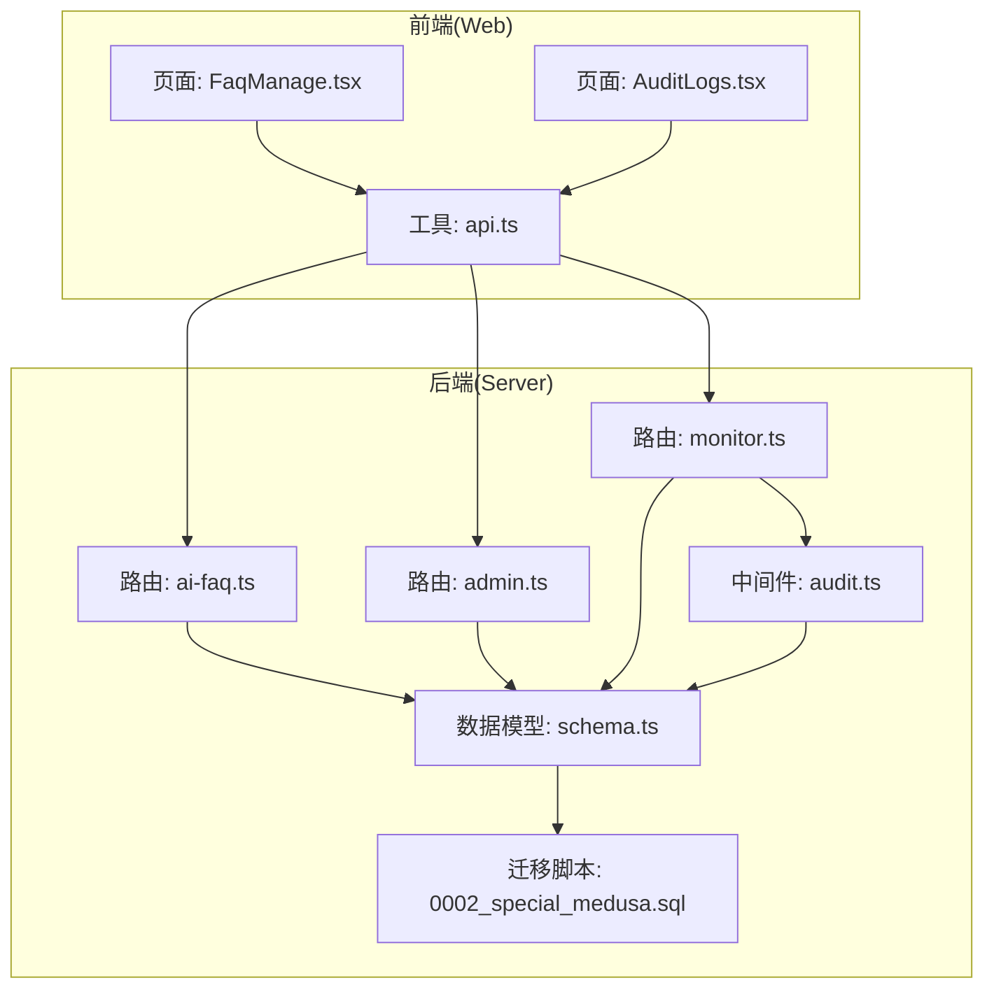
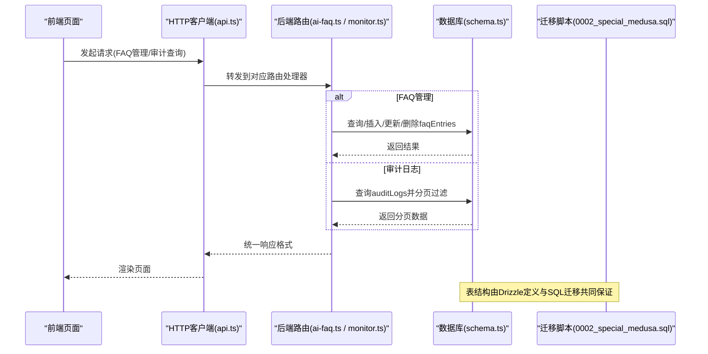
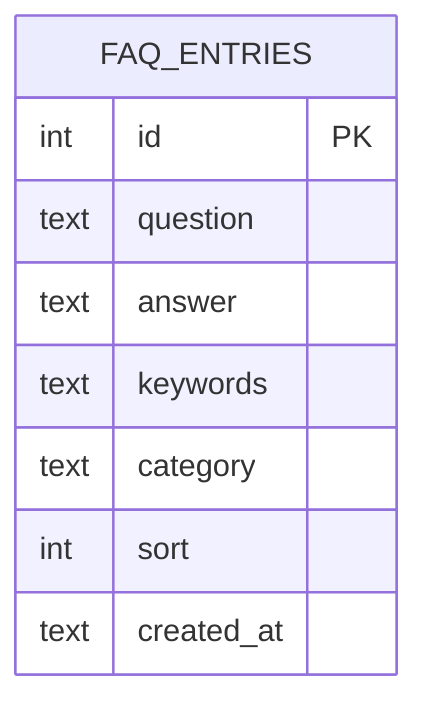
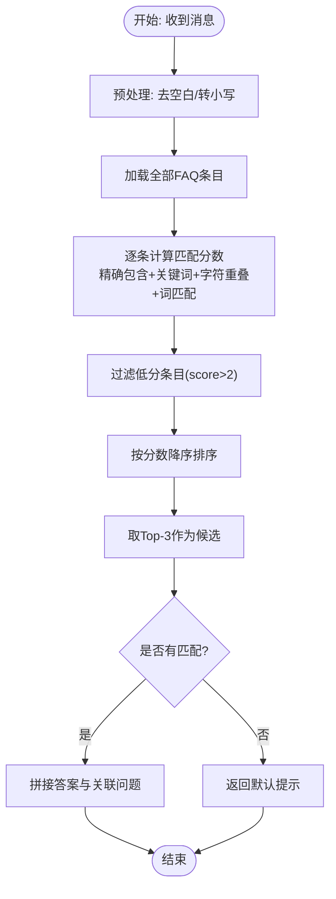
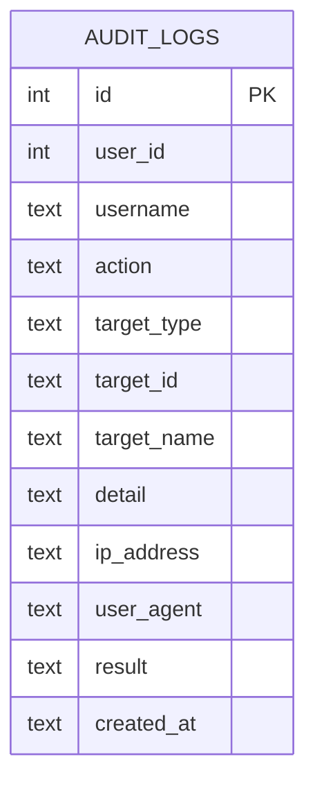
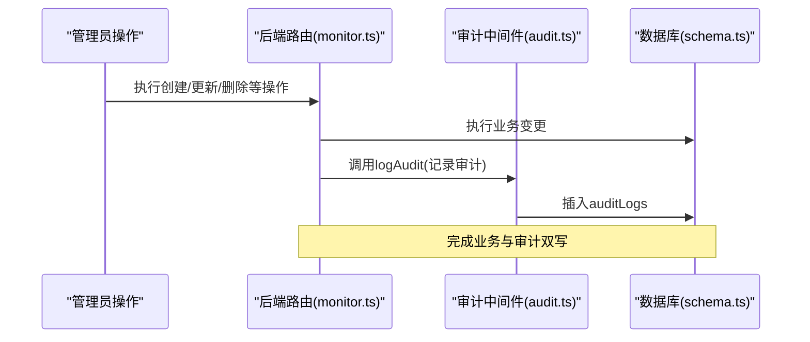
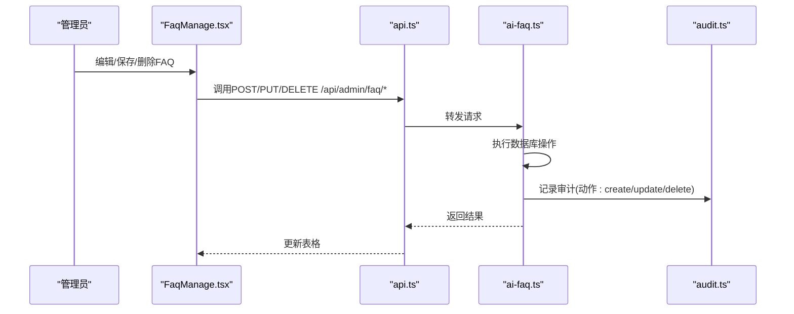
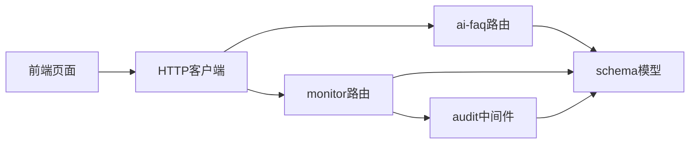

# 辅助功能模型

<cite>
**本文引用的文件**
- [apps/server/src/db/schema.ts](file://apps/server/src/db/schema.ts)
- [apps/server/src/middleware/audit.ts](file://apps/server/src/middleware/audit.ts)
- [apps/server/src/routes/ai-faq.ts](file://apps/server/src/routes/ai-faq.ts)
- [apps/server/src/routes/admin.ts](file://apps/server/src/routes/admin.ts)
- [apps/server/src/routes/monitor.ts](file://apps/server/src/routes/monitor.ts)
- [apps/server/drizzle/0002_special_medusa.sql](file://apps/server/drizzle/0002_special_medusa.sql)
- [apps/web/src/pages/admin/FaqManage.tsx](file://apps/web/src/pages/admin/FaqManage.tsx)
- [apps/web/src/pages/admin/AuditLogs.tsx](file://apps/web/src/pages/admin/AuditLogs.tsx)
- [apps/web/src/lib/api.ts](file://apps/web/src/lib/api.ts)
- [apps/server/src/db/seed-demo.ts](file://apps/server/src/db/seed-demo.ts)
</cite>

## 目录
1. [简介](#简介)
2. [项目结构](#项目结构)
3. [核心组件](#核心组件)
4. [架构总览](#架构总览)
5. [详细组件分析](#详细组件分析)
6. [依赖关系分析](#依赖关系分析)
7. [性能考量](#性能考量)
8. [故障排查指南](#故障排查指南)
9. [结论](#结论)
10. [附录](#附录)

## 简介
本文件聚焦平台“辅助功能”相关的数据模型与实现，围绕两类核心能力展开：
- FAQ知识库：FAQ条目的问答管理、关键词索引与分类组织，以及基于关键词与语义相似度的智能检索机制。
- 审计日志：用户行为追踪、IP地址与User-Agent记录、操作详情与结果记录，覆盖登录、登出、创建、更新、删除、查看、导出、配置等操作类型，并支持按目标类型（用户、软件、文档、激活、资产、工单、SaaS、FAQ、系统、数据库、设备、监控）进行归类。

该文档旨在帮助非技术读者理解模型设计与业务用途，同时为开发者提供实现细节、流程图示与最佳实践参考。

## 项目结构
本项目采用前后端分离架构，前端使用React + Ant Design，后端使用Fastify + Drizzle ORM + SQLite。与辅助功能模型直接相关的模块包括：
- 数据模型定义：SQLite表结构（Drizzle定义与SQL迁移）
- 路由层：FAQ管理与公共AI聊天接口、审计日志查询与统计接口
- 中间件：统一审计日志记录封装
- 前端页面：FAQ管理与审计日志查询界面

图表来源
- [apps/web/src/pages/admin/FaqManage.tsx:1-71](file://apps/web/src/pages/admin/FaqManage.tsx#L1-L71)
- [apps/web/src/pages/admin/AuditLogs.tsx:1-102](file://apps/web/src/pages/admin/AuditLogs.tsx#L1-L102)
- [apps/web/src/lib/api.ts:1-16](file://apps/web/src/lib/api.ts#L1-L16)
- [apps/server/src/routes/ai-faq.ts:1-100](file://apps/server/src/routes/ai-faq.ts#L1-L100)
- [apps/server/src/routes/admin.ts:1-279](file://apps/server/src/routes/admin.ts#L1-L279)
- [apps/server/src/routes/monitor.ts:455-487](file://apps/server/src/routes/monitor.ts#L455-L487)
- [apps/server/src/middleware/audit.ts:1-28](file://apps/server/src/middleware/audit.ts#L1-L28)
- [apps/server/src/db/schema.ts:205-330](file://apps/server/src/db/schema.ts#L205-L330)
- [apps/server/drizzle/0002_special_medusa.sql:1-15](file://apps/server/drizzle/0002_special_medusa.sql#L1-L15)

章节来源
- [apps/web/src/pages/admin/FaqManage.tsx:1-71](file://apps/web/src/pages/admin/FaqManage.tsx#L1-L71)
- [apps/web/src/pages/admin/AuditLogs.tsx:1-102](file://apps/web/src/pages/admin/AuditLogs.tsx#L1-L102)
- [apps/web/src/lib/api.ts:1-16](file://apps/web/src/lib/api.ts#L1-L16)
- [apps/server/src/routes/ai-faq.ts:1-100](file://apps/server/src/routes/ai-faq.ts#L1-L100)
- [apps/server/src/routes/admin.ts:1-279](file://apps/server/src/routes/admin.ts#L1-L279)
- [apps/server/src/routes/monitor.ts:455-487](file://apps/server/src/routes/monitor.ts#L455-L487)
- [apps/server/src/middleware/audit.ts:1-28](file://apps/server/src/middleware/audit.ts#L1-L28)
- [apps/server/src/db/schema.ts:205-330](file://apps/server/src/db/schema.ts#L205-L330)
- [apps/server/drizzle/0002_special_medusa.sql:1-15](file://apps/server/drizzle/0002_special_medusa.sql#L1-L15)

## 核心组件
- FAQ条目表（faqEntries）
  - 字段要点：问题、答案、关键词、分类、排序、创建时间
  - 业务用途：构建AI知识库，支撑智能问答与快速检索
- 审计日志表（auditLogs）
  - 字段要点：用户标识、用户名、操作动作、目标类型、目标ID/名称、详情、IP地址、User-Agent、结果、创建时间
  - 业务用途：合规审计、行为追踪、异常检测与取证

章节来源
- [apps/server/src/db/schema.ts:205-214](file://apps/server/src/db/schema.ts#L205-L214)
- [apps/server/src/db/schema.ts:301-314](file://apps/server/src/db/schema.ts#L301-L314)

## 架构总览
下图展示从前端到后端、再到数据库与迁移脚本的整体交互路径，突出FAQ管理与AI检索、审计日志记录与查询的关键链路。

图表来源
- [apps/web/src/lib/api.ts:1-16](file://apps/web/src/lib/api.ts#L1-L16)
- [apps/server/src/routes/ai-faq.ts:1-100](file://apps/server/src/routes/ai-faq.ts#L1-L100)
- [apps/server/src/routes/monitor.ts:455-487](file://apps/server/src/routes/monitor.ts#L455-L487)
- [apps/server/src/db/schema.ts:205-330](file://apps/server/src/db/schema.ts#L205-L330)
- [apps/server/drizzle/0002_special_medusa.sql:1-15](file://apps/server/drizzle/0002_special_medusa.sql#L1-L15)

## 详细组件分析

### FAQ条目表（faqEntries）
- 设计原则
  - 结构简洁：问题、答案、关键词、分类、排序、创建时间
  - 可扩展性：关键词字段支持多关键词，分类用于内容组织
  - 排序控制：通过sort字段支持人工排序
- 业务用途
  - 管理问答对，支撑公共AI聊天接口的匹配与回复
  - 作为知识库的基础单元，便于后续引入向量索引或全文检索
- 关键字段说明
  - question：问题文本，用于匹配与排序
  - answer：答案文本，作为AI回复的主要来源
  - keywords：关键词集合，逗号/空格/中文标点分隔
  - category：分类，默认“通用”，便于按主题检索
  - sort：排序权重，数值越小越靠前
  - createdAt：创建时间，用于版本与审计追踪

图表来源
- [apps/server/src/db/schema.ts:205-214](file://apps/server/src/db/schema.ts#L205-L214)

章节来源
- [apps/server/src/db/schema.ts:205-214](file://apps/server/src/db/schema.ts#L205-L214)

### AI知识库与智能检索机制
- 检索流程
  - 输入消息经预处理（去空白、转小写）
  - 遍历所有FAQ条目，计算匹配分数
  - 分数规则（加权）：问题精确包含、关键词匹配、字符级重叠、词级部分匹配
  - 过滤低分条目，取Top-N作为候选，生成回复与关联问题列表
- 前端集成
  - 管理端页面支持新增、编辑、删除FAQ条目
  - 公共聊天接口返回匹配结果与建议问题
- 复杂度与优化
  - 当前实现为全表扫描与线性评分，时间复杂度O(N×M)，N为FAQ数量，M为平均关键词/字符比较次数
  - 优化建议：建立关键词倒排索引、向量化嵌入相似度、缓存热门问题与高分候选

图表来源
- [apps/server/src/routes/ai-faq.ts:43-98](file://apps/server/src/routes/ai-faq.ts#L43-L98)

章节来源
- [apps/server/src/routes/ai-faq.ts:1-100](file://apps/server/src/routes/ai-faq.ts#L1-L100)
- [apps/web/src/pages/admin/FaqManage.tsx:1-71](file://apps/web/src/pages/admin/FaqManage.tsx#L1-L71)

### 审计日志表（auditLogs）
- 设计原则
  - 全面记录：用户身份、操作动作、目标类型/ID/名称、详情、IP与UA、结果、时间
  - 细粒度分类：动作类型覆盖登录、登出、创建、更新、删除、查看、导出、配置；目标类型覆盖用户、软件、文档、激活、资产、工单、SaaS、FAQ、系统、数据库、设备、监控
  - 合规友好：可追溯、可统计、可导出
- 关键字段说明
  - action：操作动作枚举
  - targetType：目标类型枚举
  - detail：JSON序列化详情，便于扩展
  - ipAddress/userAgent：行为溯源证据
  - result：success/failure，便于异常检测
- 记录时机
  - 后端路由中在关键操作完成后调用统一审计中间件logAudit进行记录

图表来源
- [apps/server/src/db/schema.ts:301-314](file://apps/server/src/db/schema.ts#L301-L314)
- [apps/server/drizzle/0002_special_medusa.sql:1-15](file://apps/server/drizzle/0002_special_medusa.sql#L1-L15)

章节来源
- [apps/server/src/db/schema.ts:301-314](file://apps/server/src/db/schema.ts#L301-L314)
- [apps/server/drizzle/0002_special_medusa.sql:1-15](file://apps/server/drizzle/0002_special_medusa.sql#L1-L15)

### 审计日志记录与查询
- 记录封装
  - 中间件logAudit负责将参数标准化并写入auditLogs表
- 查询与统计
  - 路由提供分页查询，支持按用户、动作、目标类型、时间范围过滤
  - 提供统计接口，按动作与目标类型聚合计数
- 前端展示
  - 审计日志页面支持筛选与分页，列包含时间、用户、动作、目标类型、目标名称、IP、结果、详情

图表来源
- [apps/server/src/routes/monitor.ts:512-522](file://apps/server/src/routes/monitor.ts#L512-L522)
- [apps/server/src/middleware/audit.ts:3-27](file://apps/server/src/middleware/audit.ts#L3-L27)
- [apps/server/src/db/schema.ts:301-314](file://apps/server/src/db/schema.ts#L301-L314)

章节来源
- [apps/server/src/middleware/audit.ts:1-28](file://apps/server/src/middleware/audit.ts#L1-L28)
- [apps/server/src/routes/monitor.ts:455-487](file://apps/server/src/routes/monitor.ts#L455-L487)
- [apps/web/src/pages/admin/AuditLogs.tsx:1-102](file://apps/web/src/pages/admin/AuditLogs.tsx#L1-L102)

### FAQ管理与审计联动
- 管理端页面
  - 支持新增、编辑、删除FAQ条目，字段包含问题、答案、关键词、分类、排序
  - 通过API与后端路由交互，后端路由完成持久化
- 审计联动
  - 新增/更新/删除FAQ条目属于“配置/维护”范畴，可在相应路由中调用logAudit记录
  - 审计日志页面可筛选目标类型为“faq”，定位具体操作

图表来源
- [apps/web/src/pages/admin/FaqManage.tsx:20-36](file://apps/web/src/pages/admin/FaqManage.tsx#L20-L36)
- [apps/server/src/routes/ai-faq.ts:8-40](file://apps/server/src/routes/ai-faq.ts#L8-L40)
- [apps/server/src/middleware/audit.ts:3-27](file://apps/server/src/middleware/audit.ts#L3-L27)

章节来源
- [apps/web/src/pages/admin/FaqManage.tsx:1-71](file://apps/web/src/pages/admin/FaqManage.tsx#L1-L71)
- [apps/server/src/routes/ai-faq.ts:1-100](file://apps/server/src/routes/ai-faq.ts#L1-L100)

## 依赖关系分析
- 组件耦合
  - 路由层依赖数据模型与中间件；中间件依赖数据模型；前端依赖路由提供的API
- 外部依赖
  - Drizzle ORM驱动SQLite；Ant Design提供UI组件；Axios提供HTTP客户端
- 潜在循环依赖
  - 未发现直接循环依赖；各模块职责清晰（路由/中间件/模型/前端）

图表来源
- [apps/web/src/lib/api.ts:1-16](file://apps/web/src/lib/api.ts#L1-L16)
- [apps/server/src/routes/ai-faq.ts:1-100](file://apps/server/src/routes/ai-faq.ts#L1-L100)
- [apps/server/src/routes/monitor.ts:455-487](file://apps/server/src/routes/monitor.ts#L455-L487)
- [apps/server/src/middleware/audit.ts:1-28](file://apps/server/src/middleware/audit.ts#L1-L28)
- [apps/server/src/db/schema.ts:205-330](file://apps/server/src/db/schema.ts#L205-L330)

章节来源
- [apps/server/src/db/schema.ts:205-330](file://apps/server/src/db/schema.ts#L205-L330)
- [apps/server/src/middleware/audit.ts:1-28](file://apps/server/src/middleware/audit.ts#L1-L28)
- [apps/server/src/routes/ai-faq.ts:1-100](file://apps/server/src/routes/ai-faq.ts#L1-L100)
- [apps/server/src/routes/monitor.ts:455-487](file://apps/server/src/routes/monitor.ts#L455-L487)
- [apps/web/src/lib/api.ts:1-16](file://apps/web/src/lib/api.ts#L1-L16)

## 性能考量
- FAQ检索
  - 当前为全表扫描，建议引入：
    - 关键词倒排索引：加速关键词匹配
    - 向量相似度：基于问题/答案嵌入的近似最近邻搜索
    - 缓存：热门问题与Top-N候选的短期缓存
- 审计日志
  - 查询常按时间倒序与多条件过滤，建议：
    - 在created_at、action、targetType、userId建立索引
    - 对高频查询结果做分页与缓存
- 存储与迁移
  - Drizzle定义与SQL迁移共同保障结构一致性，建议：
    - 为新增字段补充默认值与约束
    - 迁移脚本与模型保持同步演进

[本节为通用性能建议，不直接分析具体文件，故无章节来源]

## 故障排查指南
- 常见问题
  - 审计日志缺失：检查路由是否在关键操作后调用logAudit
  - FAQ检索命中率低：检查关键词格式（逗号/空格/中文标点）、分类设置与排序权重
  - 前端查询无数据：确认API端点、分页参数与过滤条件
- 定位方法
  - 审计日志：在审计日志页面按时间范围、动作、目标类型筛选，核对结果字段
  - FAQ：在FAQ管理页面验证新增/编辑/删除是否成功，核对关键词与分类
- 参考实现
  - 审计日志查询与统计接口、分页逻辑
  - FAQ管理路由的CRUD与AI聊天接口

章节来源
- [apps/server/src/routes/monitor.ts:455-487](file://apps/server/src/routes/monitor.ts#L455-L487)
- [apps/web/src/pages/admin/AuditLogs.tsx:28-101](file://apps/web/src/pages/admin/AuditLogs.tsx#L28-L101)
- [apps/server/src/routes/ai-faq.ts:8-40](file://apps/server/src/routes/ai-faq.ts#L8-L40)
- [apps/web/src/pages/admin/FaqManage.tsx:14-36](file://apps/web/src/pages/admin/FaqManage.tsx#L14-L36)

## 结论
本模型以简洁的表结构与清晰的路由职责，实现了FAQ知识库与审计日志两大辅助功能：
- FAQ条目表支持问答管理与关键词索引，配合AI检索算法提供智能回复与关联推荐
- 审计日志表覆盖全面的操作类型与目标类型，结合IP与UA记录，形成完整的合规审计体系
建议在生产环境中引入索引、缓存与向量化检索，持续提升检索性能与用户体验。

[本节为总结性内容，不直接分析具体文件，故无章节来源]

## 附录

### FAQ知识库与审计合规的应用场景
- 知识管理
  - 新员工入职：通过FAQ快速解答常见问题，减少人工咨询压力
  - 技术支持：在工单系统之外提供自助式知识检索
- 合规审计
  - 登录/登出：记录用户访问轨迹
  - 配置变更：记录系统/软件/文档/FAQ等配置更新
  - 导出与查看：记录敏感数据的访问与导出行为

[本节为概念性说明，不直接分析具体文件，故无章节来源]

### 数据保留策略（建议）
- 审计日志
  - 建议按法规要求设定保留周期（如1年、3年），定期归档与清理
  - 对高风险操作（删除、配置变更）延长保留期
- FAQ知识库
  - 建议保留历史版本与变更记录，便于回溯与审计
  - 对过时FAQ进行归档而非立即删除，保留审计痕迹

[本节为通用建议，不直接分析具体文件，故无章节来源]