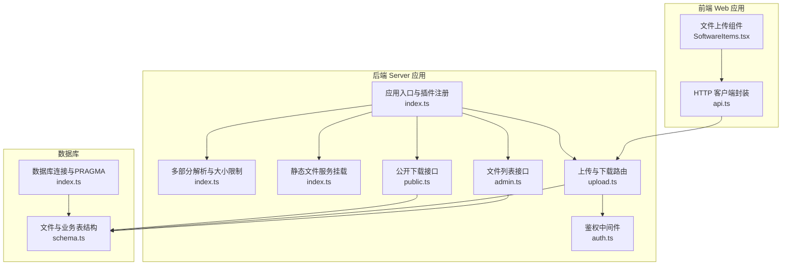
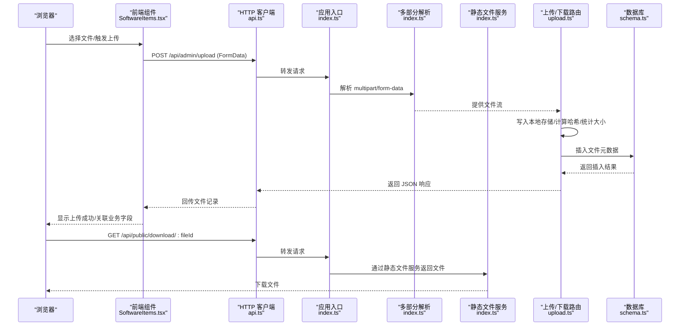
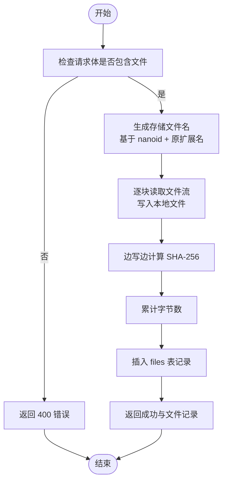
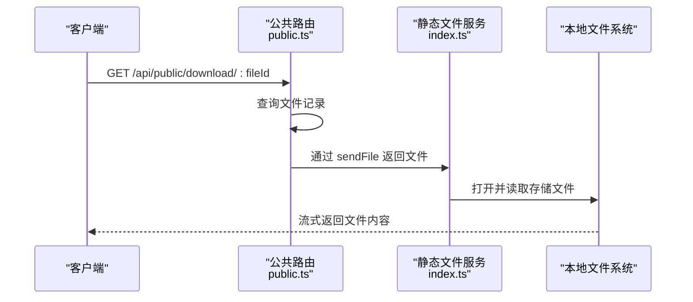
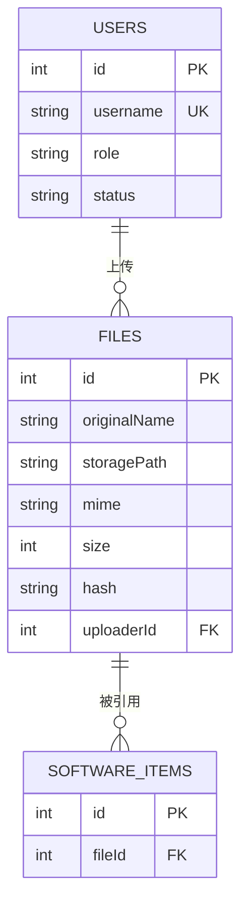
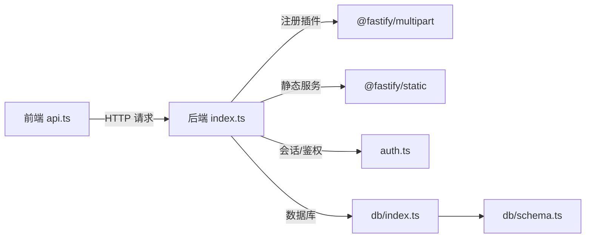

# 文件上传与存储

<cite>
**本文引用的文件**
- [apps/server/src/routes/upload.ts](file://apps/server/src/routes/upload.ts)
- [apps/server/src/index.ts](file://apps/server/src/index.ts)
- [apps/server/src/middleware/auth.ts](file://apps/server/src/middleware/auth.ts)
- [apps/server/src/db/schema.ts](file://apps/server/src/db/schema.ts)
- [apps/server/src/db/index.ts](file://apps/server/src/db/index.ts)
- [apps/web/src/pages/admin/SoftwareItems.tsx](file://apps/web/src/pages/admin/SoftwareItems.tsx)
- [apps/web/src/lib/api.ts](file://apps/web/src/lib/api.ts)
- [apps/server/src/routes/admin.ts](file://apps/server/src/routes/admin.ts)
- [apps/server/src/routes/public.ts](file://apps/server/src/routes/public.ts)
</cite>

## 目录
1. [简介](#简介)
2. [项目结构](#项目结构)
3. [核心组件](#核心组件)
4. [架构总览](#架构总览)
5. [详细组件分析](#详细组件分析)
6. [依赖关系分析](#依赖关系分析)
7. [性能考量](#性能考量)
8. [故障排查指南](#故障排查指南)
9. [结论](#结论)
10. [附录](#附录)

## 简介
本文件上传与存储系统文档面向 ZBH2 平台，聚焦于文件上传与存储的完整链路：从前端文件选择、拖拽上传与进度展示，到后端文件接收、校验与持久化；从文件命名与目录结构、安全策略，到访问控制、删除与更新、版本管理、性能优化（分片/断点续传/CDN）、以及备份与恢复策略。本文以仓库现有代码为依据，结合数据库模型与路由实现，给出可操作的实践建议与最佳实践。

## 项目结构
围绕文件上传与存储的关键模块分布如下：
- 前端（Web 应用）：负责文件选择、上传触发与进度提示，调用后端接口完成上传与后续业务关联。
- 后端（Server 应用）：提供上传接口、下载接口、静态文件服务挂载、会话与鉴权中间件、数据库连接与表结构定义。
- 数据库（SQLite + Drizzle ORM）：记录文件元信息（原始名、存储路径、MIME、大小、哈希、上传者、时间戳等），并与业务实体（如软件项）建立外键关联。

图表来源
- [apps/server/src/index.ts:1-59](file://apps/server/src/index.ts#L1-L59)
- [apps/server/src/routes/upload.ts:1-63](file://apps/server/src/routes/upload.ts#L1-L63)
- [apps/server/src/routes/admin.ts:273-278](file://apps/server/src/routes/admin.ts#L273-L278)
- [apps/server/src/routes/public.ts:1-52](file://apps/server/src/routes/public.ts#L1-L52)
- [apps/server/src/middleware/auth.ts:1-56](file://apps/server/src/middleware/auth.ts#L1-L56)
- [apps/server/src/db/index.ts:1-16](file://apps/server/src/db/index.ts#L1-L16)
- [apps/server/src/db/schema.ts:26-35](file://apps/server/src/db/schema.ts#L26-L35)
- [apps/web/src/pages/admin/SoftwareItems.tsx:1-118](file://apps/web/src/pages/admin/SoftwareItems.tsx#L1-L118)
- [apps/web/src/lib/api.ts:1-16](file://apps/web/src/lib/api.ts#L1-L16)

章节来源
- [apps/server/src/index.ts:1-59](file://apps/server/src/index.ts#L1-L59)
- [apps/server/src/routes/upload.ts:1-63](file://apps/server/src/routes/upload.ts#L1-L63)
- [apps/server/src/db/schema.ts:26-35](file://apps/server/src/db/schema.ts#L26-L35)

## 核心组件
- 上传路由与下载路由：提供管理员上传接口与公开下载接口，负责文件写盘、元数据入库与响应。
- 前端上传组件：基于 Ant Design Upload 组件，自定义上传请求，提交到后端上传接口。
- 静态文件服务：通过 fastify-static 将本地上传目录暴露为静态资源，便于直接下载。
- 鉴权中间件：加载会话、校验登录与管理员权限，确保上传与文件列表接口仅限管理员访问。
- 数据库模型：files 表记录文件元信息；业务实体（如 softwareItems）通过外键关联文件。

章节来源
- [apps/server/src/routes/upload.ts:14-61](file://apps/server/src/routes/upload.ts#L14-L61)
- [apps/web/src/pages/admin/SoftwareItems.tsx:25-36](file://apps/web/src/pages/admin/SoftwareItems.tsx#L25-L36)
- [apps/server/src/index.ts:24-36](file://apps/server/src/index.ts#L24-L36)
- [apps/server/src/middleware/auth.ts:17-55](file://apps/server/src/middleware/auth.ts#L17-L55)
- [apps/server/src/db/schema.ts:26-35](file://apps/server/src/db/schema.ts#L26-L35)

## 架构总览
下图展示了从浏览器到服务器再到存储与数据库的整体流程。

图表来源
- [apps/web/src/pages/admin/SoftwareItems.tsx:25-36](file://apps/web/src/pages/admin/SoftwareItems.tsx#L25-L36)
- [apps/web/src/lib/api.ts:1-16](file://apps/web/src/lib/api.ts#L1-L16)
- [apps/server/src/index.ts:29-36](file://apps/server/src/index.ts#L29-L36)
- [apps/server/src/routes/upload.ts:14-61](file://apps/server/src/routes/upload.ts#L14-L61)
- [apps/server/src/db/schema.ts:26-35](file://apps/server/src/db/schema.ts#L26-L35)

## 详细组件分析

### 上传流程（管理员）
- 前端通过自定义请求函数将文件以 FormData 形式发送至 /api/admin/upload。
- 后端路由接收文件流，逐块读取并写入本地存储，同时计算 SHA-256 哈希、累计大小。
- 将文件元信息写入 files 表，返回插入后的记录给前端。
- 前端收到响应后，可将文件记录与业务实体（如软件项）关联。

图表来源
- [apps/server/src/routes/upload.ts:15-49](file://apps/server/src/routes/upload.ts#L15-L49)

章节来源
- [apps/web/src/pages/admin/SoftwareItems.tsx:25-36](file://apps/web/src/pages/admin/SoftwareItems.tsx#L25-L36)
- [apps/server/src/routes/upload.ts:14-49](file://apps/server/src/routes/upload.ts#L14-L49)

### 下载流程（公开）
- 公开下载接口根据 fileId 查询文件记录，若存在则设置合适的响应头并通过静态文件服务返回文件。
- 该流程未强制鉴权，但实际部署中应结合业务场景决定访问控制策略。

图表来源
- [apps/server/src/routes/public.ts:51-61](file://apps/server/src/routes/public.ts#L51-L61)
- [apps/server/src/index.ts:35-35](file://apps/server/src/index.ts#L35-L35)
- [apps/server/src/db/schema.ts:26-35](file://apps/server/src/db/schema.ts#L26-L35)

章节来源
- [apps/server/src/routes/public.ts:51-61](file://apps/server/src/routes/public.ts#L51-L61)
- [apps/server/src/index.ts:35-35](file://apps/server/src/index.ts#L35-L35)

### 访问控制与鉴权
- 上传接口在路由层使用 requireAdmin 中间件，仅允许管理员访问。
- 会话加载中间件从 Cookie 中提取 sid，查询有效会话与用户状态，注入到请求上下文。
- 建议：公开下载接口默认不强制登录，但可在业务层增加访问控制（如签名链接、白名单、审计日志）。

章节来源
- [apps/server/src/routes/upload.ts:15-15](file://apps/server/src/routes/upload.ts#L15-L15)
- [apps/server/src/middleware/auth.ts:17-55](file://apps/server/src/middleware/auth.ts#L17-L55)

### 数据模型与存储策略
- 文件元信息存储于 files 表，包含原始名、存储路径、MIME、大小、哈希、上传者 ID、创建时间等。
- 业务实体（如 softwareItems）可通过外键关联文件，实现“文件与业务”的解耦。
- 存储策略：
  - 本地文件系统：采用 fastify-static 挂载上传目录，提供静态文件访问。
  - 文件命名：使用随机 ID + 原扩展名，避免冲突与路径穿越风险。
  - 目录结构：统一在 data/uploads 下存储，便于备份与迁移。

图表来源
- [apps/server/src/db/schema.ts:3-10](file://apps/server/src/db/schema.ts#L3-L10)
- [apps/server/src/db/schema.ts:26-35](file://apps/server/src/db/schema.ts#L26-L35)
- [apps/server/src/db/schema.ts:37-49](file://apps/server/src/db/schema.ts#L37-L49)

章节来源
- [apps/server/src/db/schema.ts:26-35](file://apps/server/src/db/schema.ts#L26-L35)

### 删除、更新与版本管理
- 删除：后端未提供删除接口，需在业务侧评估是否需要删除文件与记录。若实现，应先删除文件再删除数据库记录，防止悬挂引用。
- 更新：当前上传接口为一次性写入，未提供覆盖或替换逻辑。若需版本管理，建议引入“文件版本”表或在业务实体中维护最新版本 fileId。
- 版本建议：为每个业务对象保留历史版本 fileId 列，新增版本时插入新记录并更新引用，旧版本可保留用于回滚或审计。

章节来源
- [apps/server/src/routes/upload.ts:14-49](file://apps/server/src/routes/upload.ts#L14-L49)
- [apps/server/src/db/schema.ts:37-49](file://apps/server/src/db/schema.ts#L37-L49)

### 类型限制、大小限制与病毒扫描
- 类型限制：当前未在后端实现 MIME 白名单/黑名单校验，建议在上传路由中增加类型过滤。
- 大小限制：multipart 插件已设置 fileSize 上限（示例为 500MB），超出将被拒绝。
- 病毒扫描：当前未集成病毒扫描，建议在写盘后异步调用第三方扫描服务或本地 AV 工具，扫描通过后再暴露下载。

章节来源
- [apps/server/src/index.ts:33-33](file://apps/server/src/index.ts#L33-L33)
- [apps/server/src/routes/upload.ts:17-19](file://apps/server/src/routes/upload.ts#L17-L19)

### 文件访问控制机制
- 当前公开下载接口未强制登录，建议在业务层增加访问控制：
  - 签名下载链接：生成带时效的签名 URL。
  - 用户授权：在下载前校验用户对目标业务对象的访问权限。
  - 审计日志：记录下载行为，便于追踪与合规。

章节来源
- [apps/server/src/routes/public.ts:51-61](file://apps/server/src/routes/public.ts#L51-L61)

### 性能优化与扩展
- 分片上传与断点续传：当前未实现，建议引入分片上传协议与断点续传机制，结合哈希校验与并发控制。
- CDN 集成：将静态文件服务替换为 CDN，提升全球访问速度与稳定性。
- 并发与限速：已启用速率限制中间件，可根据业务调整阈值。
- 压缩与缓存：对静态资源启用 Gzip/Brotli 压缩与浏览器缓存策略。

章节来源
- [apps/server/src/index.ts:34-34](file://apps/server/src/index.ts#L34-L34)

### 备份与恢复策略
- 本地备份：定期复制 data/uploads 与 SQLite 数据库文件，建议采用 3-2-1 备份原则（多份副本、多种介质、异地备份）。
- 恢复流程：停止服务 -> 恢复数据库与文件 -> 校验文件哈希与数据库一致性 -> 启动服务。
- 增量备份：对频繁变更的文件采用增量备份策略，降低备份窗口与存储成本。

章节来源
- [apps/server/src/db/index.ts:7-12](file://apps/server/src/db/index.ts#L7-L12)

## 依赖关系分析
- 前端依赖 axios 与本地 baseURL，自动携带凭据；错误拦截器处理 401 场景。
- 后端依赖 fastify、@fastify/multipart、@fastify/static、@fastify/cookie、@fastify/helmet、@fastify/rate-limit 等插件。
- 数据库使用 better-sqlite3 与 Drizzle ORM，开启 WAL 与外键约束，保证一致性与并发性能。

图表来源
- [apps/web/src/lib/api.ts:1-16](file://apps/web/src/lib/api.ts#L1-L16)
- [apps/server/src/index.ts:27-49](file://apps/server/src/index.ts#L27-L49)
- [apps/server/src/middleware/auth.ts:17-40](file://apps/server/src/middleware/auth.ts#L17-L40)
- [apps/server/src/db/index.ts:1-16](file://apps/server/src/db/index.ts#L1-L16)
- [apps/server/src/db/schema.ts:26-35](file://apps/server/src/db/schema.ts#L26-L35)

章节来源
- [apps/web/src/lib/api.ts:1-16](file://apps/web/src/lib/api.ts#L1-L16)
- [apps/server/src/index.ts:27-49](file://apps/server/src/index.ts#L27-L49)

## 性能考量
- 上传性能：使用流式写入，避免将整个文件加载到内存；合理设置 multipart fileSize 与并发连接数。
- 下载性能：通过 fastify-static 提供静态文件服务；结合 CDN 与缓存策略提升吞吐。
- 数据库性能：SQLite 在 WAL 模式下具备更好并发表现；对高频查询字段建立索引（如 files.hash、files.uploaderId）。
- 安全与稳定：启用 helmet、CORS、Cookie 安全配置与速率限制，减少攻击面与滥用风险。

章节来源
- [apps/server/src/index.ts:30-34](file://apps/server/src/index.ts#L30-L34)
- [apps/server/src/db/index.ts:10-12](file://apps/server/src/db/index.ts#L10-L12)

## 故障排查指南
- 上传失败（400）：检查请求体是否包含文件；确认前端是否正确构造 FormData。
- 无文件返回：确认 multipart 插件已注册且 fileSize 未超限。
- 下载 404：确认 fileId 是否存在；确认存储文件是否存在且未被删除。
- 权限不足（401/403）：确认登录状态与管理员角色；检查会话是否过期。
- 哈希不一致：若启用病毒扫描或二次校验，需确保写盘完成后才暴露下载。

章节来源
- [apps/server/src/routes/upload.ts:17-19](file://apps/server/src/routes/upload.ts#L17-L19)
- [apps/server/src/routes/public.ts:53-56](file://apps/server/src/routes/public.ts#L53-L56)
- [apps/server/src/middleware/auth.ts:42-55](file://apps/server/src/middleware/auth.ts#L42-L55)

## 结论
ZBH2 的文件上传与存储系统以简洁可靠为核心：前端通过自定义上传组件与后端接口交互，后端采用流式处理与本地静态服务，数据库记录文件元信息并与业务实体解耦。当前实现满足基础需求，建议在类型限制、病毒扫描、访问控制、版本管理与性能优化方面进一步增强，以适配更复杂的业务场景与更高的可靠性要求。

## 附录
- 前端上传组件使用 Ant Design Upload 的 customRequest，将文件直接上传到 /api/admin/upload。
- 文件列表接口位于 /api/admin/files，可用于后台管理与审计。
- 公开下载接口位于 /api/public/download/:fileId，建议结合业务场景增加访问控制。

章节来源
- [apps/web/src/pages/admin/SoftwareItems.tsx:107-112](file://apps/web/src/pages/admin/SoftwareItems.tsx#L107-L112)
- [apps/server/src/routes/admin.ts:274-277](file://apps/server/src/routes/admin.ts#L274-L277)
- [apps/server/src/routes/public.ts:51-61](file://apps/server/src/routes/public.ts#L51-L61)