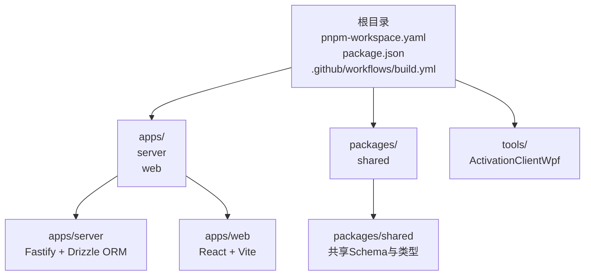
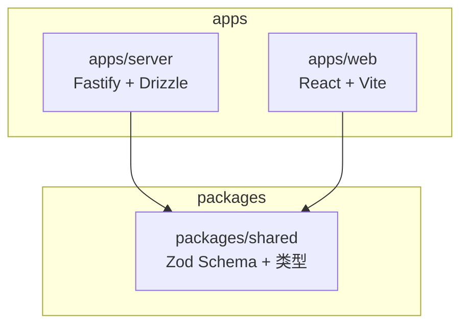
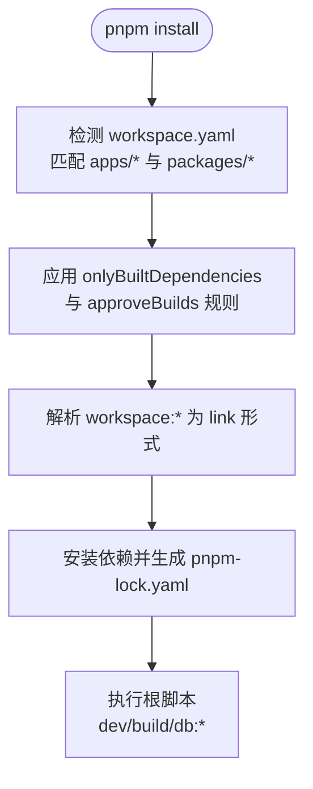
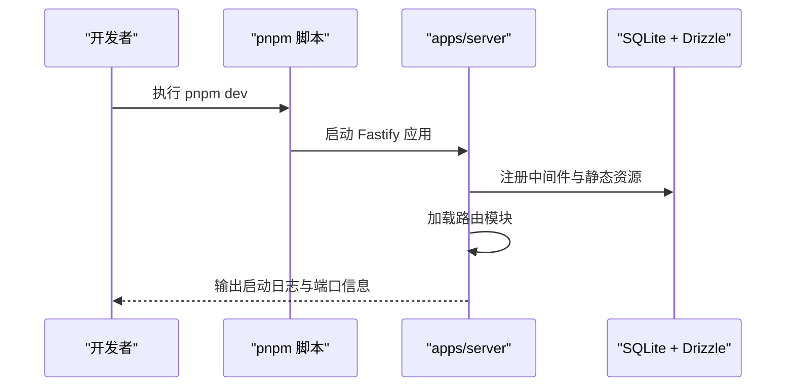
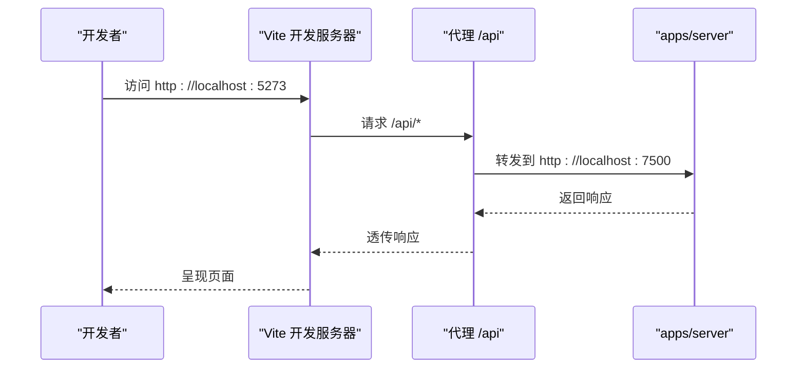
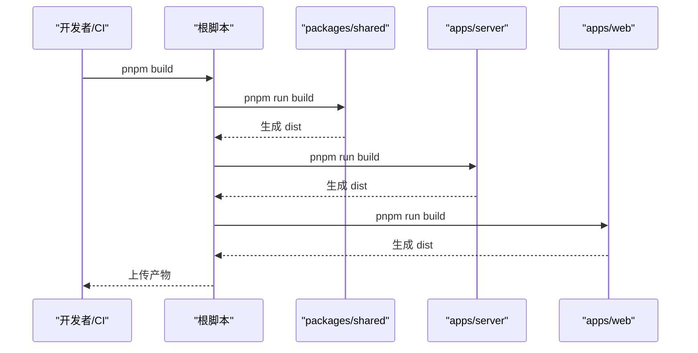
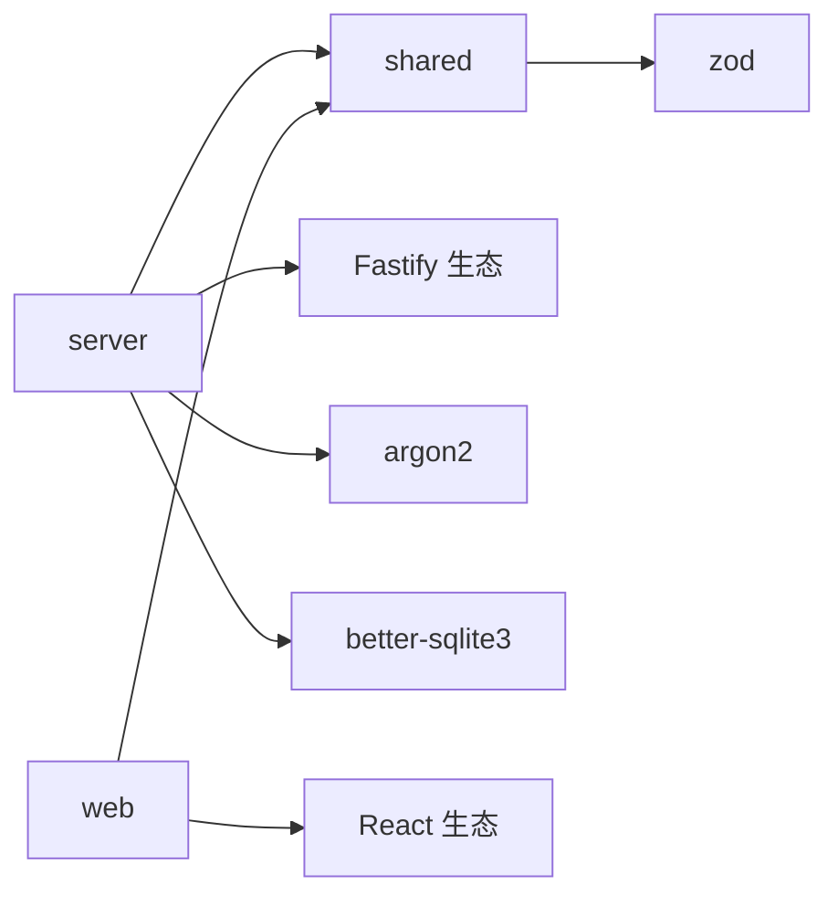

# Monorepo架构设计

<cite>
**本文档引用的文件**
- [pnpm-workspace.yaml](file://pnpm-workspace.yaml)
- [package.json](file://package.json)
- [pnpm-lock.yaml](file://pnpm-lock.yaml)
- [README.md](file://README.md)
- [.github/workflows/build.yml](file://.github/workflows/build.yml)
- [apps/server/package.json](file://apps/server/package.json)
- [apps/server/tsconfig.json](file://apps/server/tsconfig.json)
- [apps/server/drizzle.config.ts](file://apps/server/drizzle.config.ts)
- [apps/server/src/index.ts](file://apps/server/src/index.ts)
- [apps/server/src/db/schema.ts](file://apps/server/src/db/schema.ts)
- [apps/web/package.json](file://apps/web/package.json)
- [apps/web/tsconfig.json](file://apps/web/tsconfig.json)
- [apps/web/vite.config.ts](file://apps/web/vite.config.ts)
- [apps/web/src/App.tsx](file://apps/web/src/App.tsx)
- [packages/shared/package.json](file://packages/shared/package.json)
- [packages/shared/tsconfig.json](file://packages/shared/tsconfig.json)
- [packages/shared/src/index.ts](file://packages/shared/src/index.ts)
</cite>

## 目录
1. [引言](#引言)
2. [项目结构](#项目结构)
3. [核心组件](#核心组件)
4. [架构总览](#架构总览)
5. [详细组件分析](#详细组件分析)
6. [依赖关系分析](#依赖关系分析)
7. [性能考虑](#性能考虑)
8. [故障排查指南](#故障排查指南)
9. [结论](#结论)
10. [附录](#附录)

## 引言
本文件为ZBH2平台的Monorepo架构设计文档，围绕pnpm工作空间配置与管理策略、apps目录下server与web应用的独立性与共享性、packages/shared共享包的作用与版本管理、跨项目的依赖关系、构建与发布流程进行系统化阐述，并总结Monorepo的优势与挑战，提供最佳实践与版本同步机制建议。

## 项目结构
ZBH2采用pnpm工作空间组织多包项目，整体结构清晰地划分为三层：
- 根级：工作空间配置、根脚本与CI配置
- apps：业务应用（server后端API、web前端）
- packages：共享包（shared）



图表来源
- [pnpm-workspace.yaml:1-5](file://pnpm-workspace.yaml#L1-L5)
- [README.md:47-68](file://README.md#L47-L68)

章节来源
- [pnpm-workspace.yaml:1-5](file://pnpm-workspace.yaml#L1-L5)
- [README.md:47-68](file://README.md#L47-L68)

## 核心组件
- pnpm工作空间与脚本
  - 工作空间通过通配符匹配apps与packages目录，确保所有子包被纳入管理。
  - 根脚本提供统一的开发与构建入口，支持并行启动前后端、统一构建顺序与数据库相关任务。
  - 锁定文件中明确显示workspace:*依赖解析为link形式，保证本地开发时的实时同步。
- apps/server
  - 使用Fastify框架，集成安全中间件、CORS、限流、静态资源等；路由模块化组织；Drizzle ORM驱动SQLite。
  - 提供数据库迁移、种子数据与Schema定义，支持本地开发环境初始化。
- apps/web
  - 基于React + Vite，采用Ant Design组件库；路由采用React Router；开发服务器内置/api代理到后端。
- packages/shared
  - 作为前后端共享的Schema与类型中心，导出统一的类型定义，减少重复与不一致风险。
  - 内部依赖Zod用于运行时校验，便于前后端复用。

章节来源
- [package.json:4-18](file://package.json#L4-L18)
- [pnpm-lock.yaml:11-121](file://pnpm-lock.yaml#L11-L121)
- [apps/server/package.json:14-35](file://apps/server/package.json#L14-L35)
- [apps/web/package.json:11-27](file://apps/web/package.json#L11-L27)
- [packages/shared/package.json:6-22](file://packages/shared/package.json#L6-L22)

## 架构总览
ZBH2采用“前后端分离但共享类型”的Monorepo模式：
- 独立性：server与web分别拥有独立的构建工具链、运行时与开发体验；互不直接依赖生产代码。
- 共享性：通过packages/shared提供共享Schema与类型，降低耦合度，提升一致性。
- 依赖关系：server与web均依赖shared；shared不反向依赖其他包，避免循环依赖。



图表来源
- [apps/server/package.json:26](file://apps/server/package.json#L26)
- [apps/web/package.json:19](file://apps/web/package.json#L19)
- [packages/shared/package.json:18](file://packages/shared/package.json#L18)

## 详细组件分析

### pnpm工作空间与管理策略
- workspace.yaml
  - 使用通配符匹配apps/*与packages/*，确保所有子包被纳入工作空间。
  - approveBuilds与onlyBuiltDependencies用于声明需要预构建或仅允许预构建的原生依赖，减少安装与构建失败率。
- 根package.json脚本
  - 提供统一的开发与构建命令，支持并行启动server与web，以及数据库相关任务。
  - engines约束Node版本，确保团队环境一致性。
- 锁定文件
  - 显示workspace:*解析为link:../../packages/shared，体现本地链接与实时同步特性。



图表来源
- [pnpm-workspace.yaml:1-5](file://pnpm-workspace.yaml#L1-L5)
- [package.json:4-18](file://package.json#L4-L18)
- [pnpm-lock.yaml:46-48](file://pnpm-lock.yaml#L46-L48)

章节来源
- [pnpm-workspace.yaml:1-5](file://pnpm-workspace.yaml#L1-L5)
- [package.json:4-18](file://package.json#L4-L18)
- [pnpm-lock.yaml:11-121](file://pnpm-lock.yaml#L11-L121)

### apps/server：后端API与数据库
- 依赖与脚本
  - 依赖Fastify生态与Drizzle ORM，使用argon2与better-sqlite3处理认证与数据库访问。
  - 通过workspace:*依赖shared，复用共享Schema与类型。
- 数据库与迁移
  - drizzle.config.ts定义schema路径、输出目录与SQLite连接参数。
  - schema.ts集中定义所有实体表结构，涵盖用户、会话、软件、帮助文档、激活码、工单、资产、SaaS、AI FAQ、监控、审计日志等。
- 启动流程
  - index.ts注册安全中间件、CORS、Cookie、限流、静态资源与路由模块；监听端口并打印日志。



图表来源
- [apps/server/src/index.ts:27-54](file://apps/server/src/index.ts#L27-L54)
- [apps/server/drizzle.config.ts:1-11](file://apps/server/drizzle.config.ts#L1-L11)
- [apps/server/package.json:14-35](file://apps/server/package.json#L14-L35)

章节来源
- [apps/server/package.json:14-35](file://apps/server/package.json#L14-L35)
- [apps/server/drizzle.config.ts:1-11](file://apps/server/drizzle.config.ts#L1-L11)
- [apps/server/src/index.ts:1-60](file://apps/server/src/index.ts#L1-L60)
- [apps/server/src/db/schema.ts:1-330](file://apps/server/src/db/schema.ts#L1-L330)

### apps/web：前端门户与开发体验
- 依赖与脚本
  - 依赖React、Ant Design、React Router与Axios等；通过workspace:*依赖shared。
- 开发与代理
  - Vite开发服务器端口5273，配置/api代理到后端7500端口，简化联调。
- 路由与页面
  - App.tsx集中定义门户与管理后台路由，覆盖软件、帮助、激活、工单、SaaS、AI聊天、监控、报表、审计等多个页面。



图表来源
- [apps/web/vite.config.ts:6-12](file://apps/web/vite.config.ts#L6-L12)
- [apps/web/src/App.tsx:38-79](file://apps/web/src/App.tsx#L38-L79)
- [apps/web/package.json:11-27](file://apps/web/package.json#L11-L27)

章节来源
- [apps/web/vite.config.ts:1-13](file://apps/web/vite.config.ts#L1-L13)
- [apps/web/src/App.tsx:1-80](file://apps/web/src/App.tsx#L1-L80)
- [apps/web/package.json:11-27](file://apps/web/package.json#L11-L27)

### packages/shared：共享包与版本管理
- 作用
  - 统一前后端Schema与类型定义，减少重复与不一致；通过Zod提供运行时校验能力。
- 构建与导出
  - 通过TypeScript编译生成声明文件；主入口导出schemas与types。
- 版本管理
  - 作为workspace包，版本号与根仓库保持一致；更新时需谨慎评估对server与web的影响，建议配合变更日志与测试。

```mermaid
classDiagram
class SharedPackage {
+导出 : "schemas.ts"
+导出 : "types.ts"
+依赖 : "zod"
+构建 : "tsc"
}
class ServerApp {
+依赖 : "shared (workspace : *)"
}
class WebApp {
+依赖 : "shared (workspace : *)"
}
SharedPackage <.. ServerApp : "workspace : *"
SharedPackage <.. WebApp : "workspace : *"
```

图表来源
- [packages/shared/package.json:6-22](file://packages/shared/package.json#L6-L22)
- [apps/server/package.json:26](file://apps/server/package.json#L26)
- [apps/web/package.json:19](file://apps/web/package.json#L19)

章节来源
- [packages/shared/package.json:1-24](file://packages/shared/package.json#L1-L24)
- [packages/shared/src/index.ts:1-3](file://packages/shared/src/index.ts#L1-L3)

### 跨项目依赖关系与构建发布流程
- 依赖关系
  - server与web均依赖shared；shared不反向依赖其他包，避免循环依赖。
  - 根脚本按顺序先构建shared，再构建server与web，确保类型与Schema可用。
- 构建与发布
  - CI工作流在Ubuntu上安装pnpm与Node，执行pnpm install与pnpm build，分别上传web-dist与server-dist产物。
  - 另有Windows作业构建WPF激活客户端并打包上传。



图表来源
- [package.json:8](file://package.json#L8)
- [packages/shared/package.json:14-16](file://packages/shared/package.json#L14-L16)
- [apps/server/package.json:7-9](file://apps/server/package.json#L7-L9)
- [apps/web/package.json:7-9](file://apps/web/package.json#L7-L9)

章节来源
- [package.json:4-18](file://package.json#L4-L18)
- [.github/workflows/build.yml:14-52](file://.github/workflows/build.yml#L14-L52)

## 依赖关系分析
- 直接依赖
  - server依赖shared与Fastify生态；web依赖shared与React生态。
- 间接依赖
  - shared依赖Zod；server依赖argon2与better-sqlite3（通过onlyBuiltDependencies策略处理）。
- 依赖解析
  - workspace:*在锁定文件中解析为link形式，确保本地开发时的实时同步。



图表来源
- [pnpm-lock.yaml:46-48](file://pnpm-lock.yaml#L46-L48)
- [apps/server/package.json:14-35](file://apps/server/package.json#L14-L35)
- [apps/web/package.json:11-27](file://apps/web/package.json#L11-L27)
- [packages/shared/package.json:18](file://packages/shared/package.json#L18)

章节来源
- [pnpm-lock.yaml:11-121](file://pnpm-lock.yaml#L11-L121)
- [apps/server/package.json:14-35](file://apps/server/package.json#L14-L35)
- [apps/web/package.json:11-27](file://apps/web/package.json#L11-L27)
- [packages/shared/package.json:18](file://packages/shared/package.json#L18)

## 性能考虑
- 依赖安装与构建
  - 使用onlyBuiltDependencies与approveBuilds减少原生依赖的编译开销与失败概率。
  - 通过workspace:*本地链接避免重复安装，缩短安装时间。
- 开发体验
  - Vite代理与并行开发脚本提升调试效率；Fastify中间件按需注册，避免不必要的开销。
- 数据库与ORM
  - Drizzle ORM与SQLite适合中小型项目，注意在高并发场景下的锁竞争与查询优化。

## 故障排查指南
- 依赖安装失败
  - 检查onlyBuiltDependencies与approveBuilds配置是否覆盖了目标原生依赖。
  - 确认Node版本满足engines要求。
- 本地链接异常
  - 确认workspace.yaml中的通配符匹配正确；检查pnpm-lock.yaml中workspace:*是否解析为link。
- 数据库初始化问题
  - 确保DATABASE_URL指向正确的SQLite文件路径；执行db:migrate与db:seed初始化Schema与种子数据。
- 前后端联调
  - 检查Vite代理配置是否指向后端端口；确认CORS与Cookie设置允许跨域与凭证传递。

章节来源
- [package.json:13-18](file://package.json#L13-L18)
- [pnpm-workspace.yaml:1-5](file://pnpm-workspace.yaml#L1-L5)
- [pnpm-lock.yaml:46-48](file://pnpm-lock.yaml#L46-L48)
- [apps/server/drizzle.config.ts:7-9](file://apps/server/drizzle.config.ts#L7-L9)
- [apps/web/vite.config.ts:8-10](file://apps/web/vite.config.ts#L8-L10)

## 结论
ZBH2通过pnpm工作空间实现了清晰的Monorepo组织，apps/server与apps/web在功能与技术栈上保持独立，同时借助packages/shared实现类型与Schema的共享，有效降低了重复与不一致风险。根脚本与CI流水线提供了统一的开发与发布体验。建议在后续迭代中完善版本同步机制与自动化测试，以进一步提升协作效率与质量保障。

## 附录
- 最佳实践
  - 严格控制shared包的变更范围，确保向后兼容或配套升级指引。
  - 使用根脚本统一入口，避免分散的命令与环境差异。
  - 在CI中固定pnpm与Node版本，确保构建一致性。
- 版本同步机制建议
  - 采用语义化版本与变更日志，结合CI触发的发布流程，确保shared更新时server与web同步升级。
  - 对原生依赖使用onlyBuiltDependencies策略，减少安装失败与构建时间。