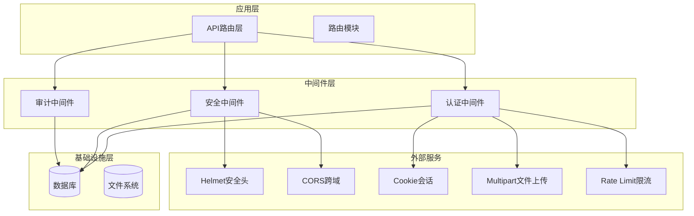
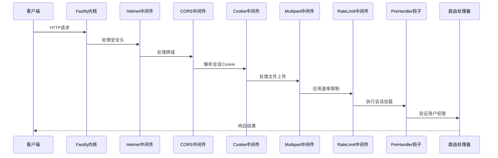
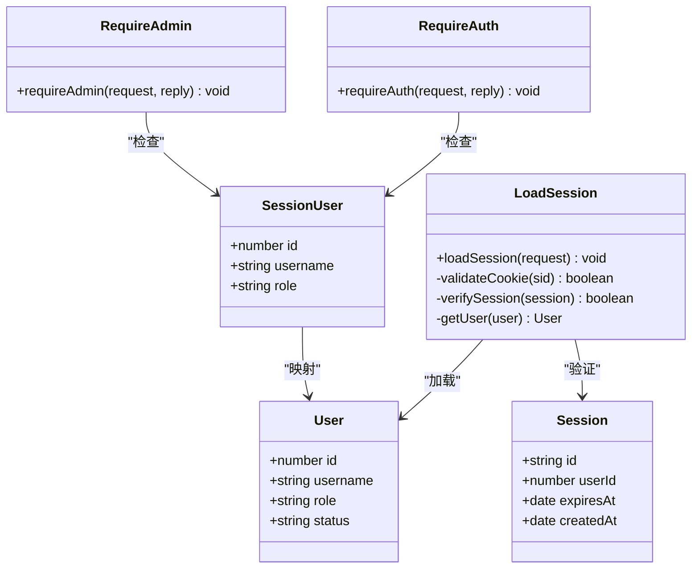
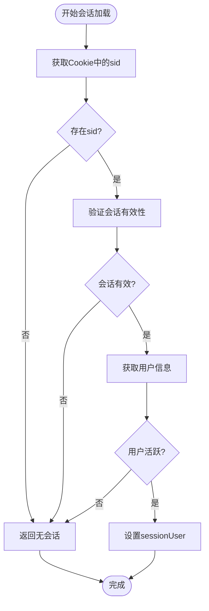
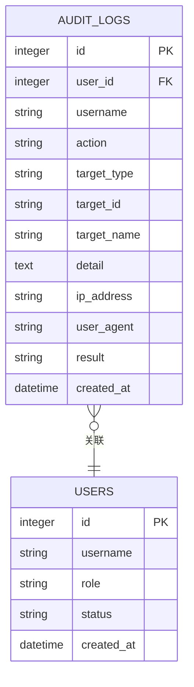
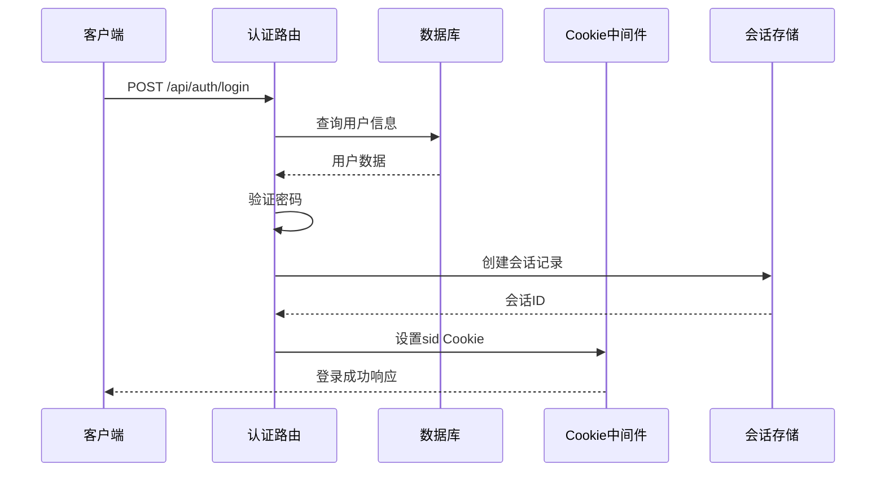
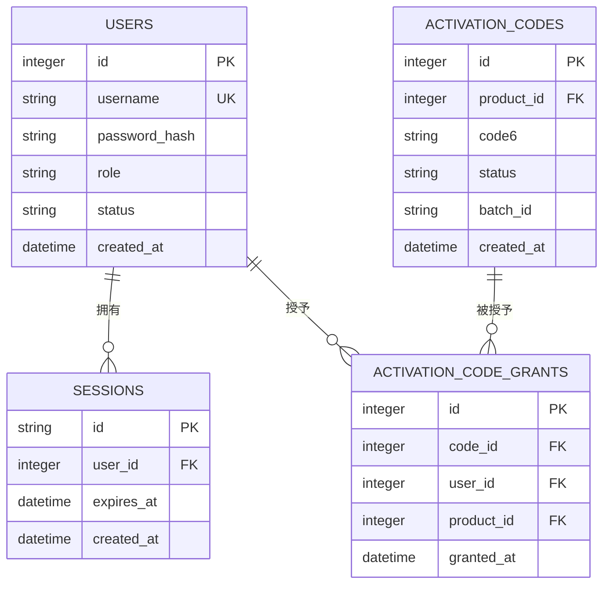

# 中间件模式设计

<cite>
**本文档引用的文件**
- [index.ts](file://apps/server/src/index.ts)
- [auth.ts](file://apps/server/src/middleware/auth.ts)
- [audit.ts](file://apps/server/src/middleware/audit.ts)
- [auth.ts](file://apps/server/src/routes/auth.ts)
- [admin.ts](file://apps/server/src/routes/admin.ts)
- [schema.ts](file://apps/server/src/db/schema.ts)
- [index.ts](file://apps/server/src/db/index.ts)
- [activation.ts](file://apps/server/src/routes/activation.ts)
</cite>

## 目录
1. [简介](#简介)
2. [项目结构](#项目结构)
3. [核心组件](#核心组件)
4. [架构概览](#架构概览)
5. [详细组件分析](#详细组件分析)
6. [依赖关系分析](#依赖关系分析)
7. [性能考虑](#性能考虑)
8. [故障排除指南](#故障排除指南)
9. [结论](#结论)

## 简介

ZBH2平台采用Fastify框架构建，实现了完整的中间件模式设计。该设计通过有序的中间件注册和执行机制，确保了应用的安全性、可维护性和可扩展性。本文档深入分析了Fastify中间件的注册和执行顺序，包括安全头、跨域处理、会话管理、文件上传限制和速率限制等核心中间件的作用和配置，并重点阐述了认证中间件的实现原理、JWT会话管理和用户身份验证流程，以及审计日志中间件的设计和实现。

## 项目结构

ZBH2平台的中间件架构采用模块化设计，主要分为以下几个层次：



**图表来源**
- [index.ts:29-54](file://apps/server/src/index.ts#L29-L54)
- [auth.ts:17-40](file://apps/server/src/middleware/auth.ts#L17-L40)

**章节来源**
- [index.ts:1-60](file://apps/server/src/index.ts#L1-L60)

## 核心组件

### 中间件注册顺序

Fastify中间件按照严格的顺序进行注册和执行，确保每个中间件都能正确处理请求：

1. **安全中间件**：Helmet安全头 → CORS跨域 → Cookie会话
2. **功能中间件**：Multipart文件上传 → RateLimit限流
3. **应用中间件**：PreHandler钩子（会话加载）
4. **路由中间件**：按路由注册顺序执行

### 认证中间件体系

平台实现了完整的认证中间件体系，包括：

- **会话加载**：`loadSession` - 从Cookie中提取会话ID并验证用户状态
- **权限检查**：`requireAuth` - 基础认证检查
- **管理员权限**：`requireAdmin` - 管理员权限验证

**章节来源**
- [auth.ts:17-55](file://apps/server/src/middleware/auth.ts#L17-L55)

## 架构概览

### 中间件执行流程



**图表来源**
- [index.ts:29-37](file://apps/server/src/index.ts#L29-L37)
- [auth.ts:17-40](file://apps/server/src/middleware/auth.ts#L17-L40)

### 会话管理架构



**图表来源**
- [auth.ts:5-15](file://apps/server/src/middleware/auth.ts#L5-L15)
- [auth.ts:17-40](file://apps/server/src/middleware/auth.ts#L17-L40)
- [schema.ts:12-17](file://apps/server/src/db/schema.ts#L12-L17)
- [schema.ts:3-10](file://apps/server/src/db/schema.ts#L3-L10)

## 详细组件分析

### 安全中间件配置

#### Helmet安全头中间件

Helmet中间件提供了标准的安全HTTP头部设置，增强了应用的安全性：

- **内容安全策略禁用**：`contentSecurityPolicy: false`
- **安全头自动设置**：X-Frame-Options、X-XSS-Protection、X-Content-Type-Options等
- **防止点击劫持**：通过frameguard中间件

#### CORS跨域中间件

CORS中间件配置支持跨域资源共享：

- **源域允许**：`origin: true` - 允许任意源域
- **凭证支持**：`credentials: true` - 支持携带认证信息
- **预检请求**：自动处理OPTIONS请求

**章节来源**
- [index.ts:30-31](file://apps/server/src/index.ts#L30-L31)

### 会话管理中间件

#### Cookie会话中间件

Cookie会话中间件负责处理客户端会话Cookie：

- **Cookie解析**：自动解析请求中的Cookie
- **会话标识**：通过sid参数识别用户会话
- **安全设置**：httpOnly、sameSite、maxAge等

#### 会话加载机制



**图表来源**
- [auth.ts:17-40](file://apps/server/src/middleware/auth.ts#L17-L40)

**章节来源**
- [auth.ts:17-40](file://apps/server/src/middleware/auth.ts#L17-L40)

### 文件上传中间件

#### Multipart文件上传

Multipart中间件处理文件上传请求：

- **文件大小限制**：`fileSize: 500 * 1024 * 1024` (500MB)
- **表单字段解析**：自动解析文本和二进制字段
- **内存优化**：大文件自动写入磁盘

#### 静态文件服务

静态文件中间件提供文件下载服务：

- **上传目录**：`../../data/uploads`
- **URL前缀**：`/uploads/`
- **响应装饰**：`decorateReply: true`

**章节来源**
- [index.ts:33-35](file://apps/server/src/index.ts#L33-L35)

### 速率限制中间件

#### RateLimit配置

速率限制中间件保护API免受滥用：

- **请求频率**：每分钟最多200个请求
- **时间窗口**：60秒
- **IP级限制**：基于客户端IP地址进行限制

### 审计日志中间件

#### 审计日志设计

审计日志中间件实现了完整的操作追踪：



**图表来源**
- [audit.ts:3-27](file://apps/server/src/middleware/audit.ts#L3-L27)
- [schema.ts:301-314](file://apps/server/src/db/schema.ts#L301-L314)

#### 数据收集策略

审计日志收集以下关键信息：

- **用户信息**：userId、username
- **操作详情**：action、targetType、targetId、targetName
- **技术信息**：detail（JSON序列化）、ipAddress、userAgent
- **结果记录**：result（success/failure）

**章节来源**
- [audit.ts:3-27](file://apps/server/src/middleware/audit.ts#L3-L27)

### 认证中间件实现

#### 用户身份验证流程



**图表来源**
- [auth.ts:9-33](file://apps/server/src/routes/auth.ts#L9-L33)
- [schema.ts:12-17](file://apps/server/src/db/schema.ts#L12-L17)

#### 权限控制机制

平台实现了多层级的权限控制：

- **基础认证**：`requireAuth` - 检查用户是否已登录
- **管理员权限**：`requireAdmin` - 检查用户角色是否为admin
- **路由级权限**：通过`app.addHook('preHandler', requireAdmin)`实现

**章节来源**
- [auth.ts:42-55](file://apps/server/src/middleware/auth.ts#L42-L55)
- [admin.ts:16](file://apps/server/src/routes/admin.ts#L16)

## 依赖关系分析

### 中间件依赖图

```mermaid
graph TB
subgraph "外部依赖"
Fastify[Fastify核心]
@fastify/helmet[Helmet中间件]
@fastify/cors[CORS中间件]
@fastify/cookie[Cookie中间件]
@fastify/multipart[Multipart中间件]
@fastify/rate-limit[RateLimit中间件]
@fastify/static[Static中间件]
end
subgraph "内部模块"
AuthMiddleware[认证中间件]
AuditMiddleware[审计中间件]
DBModule[数据库模块]
Schema[数据模型]
end
Fastify --> @fastify/helmet
Fastify --> @fastify/cors
Fastify --> @fastify/cookie
Fastify --> @fastify/multipart
Fastify --> @fastify/rate-limit
Fastify --> @fastify/static
AuthMiddleware --> DBModule
AuditMiddleware --> DBModule
DBModule --> Schema
```

**图表来源**
- [index.ts:1-10](file://apps/server/src/index.ts#L1-L10)
- [auth.ts:1-3](file://apps/server/src/middleware/auth.ts#L1-L3)

### 数据库依赖关系



**图表来源**
- [schema.ts:12-17](file://apps/server/src/db/schema.ts#L12-L17)
- [schema.ts:81-96](file://apps/server/src/db/schema.ts#L81-L96)

**章节来源**
- [schema.ts:12-17](file://apps/server/src/db/schema.ts#L12-L17)
- [schema.ts:81-96](file://apps/server/src/db/schema.ts#L81-L96)

## 性能考虑

### 中间件性能优化

1. **执行顺序优化**：将CPU密集型中间件放在前面，I/O密集型中间件放在后面
2. **缓存策略**：会话验证结果可以考虑缓存
3. **连接池管理**：数据库连接池配置优化
4. **文件上传限制**：合理设置文件大小限制，避免内存溢出

### 内存管理

- **Cookie解析**：只解析必要的Cookie字段
- **文件上传**：大文件直接写入磁盘，不占用内存
- **会话存储**：定期清理过期会话

## 故障排除指南

### 常见问题诊断

#### 会话认证失败

**症状**：用户登录后无法访问受保护资源

**排查步骤**：
1. 检查Cookie是否正确设置
2. 验证会话是否过期
3. 确认用户状态是否为active

#### CORS跨域问题

**症状**：前端请求被浏览器阻止

**排查步骤**：
1. 检查CORS配置中的origin设置
2. 验证是否携带了必要的凭证
3. 确认预检请求是否正确处理

#### 速率限制触发

**症状**：API请求被拒绝

**排查步骤**：
1. 检查请求频率是否超过限制
2. 验证IP地址识别是否正确
3. 考虑调整速率限制配置

**章节来源**
- [auth.ts:42-55](file://apps/server/src/middleware/auth.ts#L42-L55)
- [index.ts:30-34](file://apps/server/src/index.ts#L30-L34)

## 结论

ZBH2平台的中间件模式设计体现了现代Web应用的最佳实践。通过精心设计的中间件注册顺序和执行机制，平台实现了：

1. **安全性保障**：多层次的安全防护，包括安全头、跨域处理和会话管理
2. **可维护性**：模块化的中间件架构，便于扩展和维护
3. **性能优化**：合理的中间件执行顺序和资源配置
4. **可观测性**：完整的审计日志系统，提供完整的操作追踪

该设计为未来的功能扩展奠定了坚实的基础，开发者可以基于现有的中间件模式轻松添加新的功能模块，同时保持系统的整体一致性和安全性。