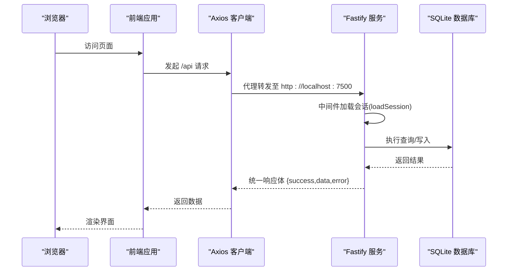
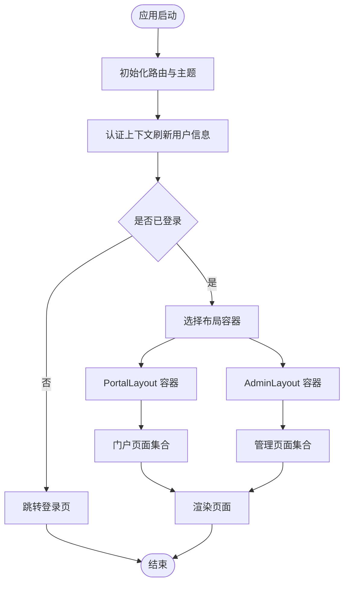
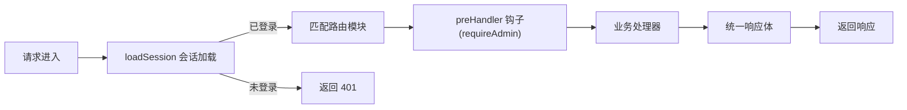
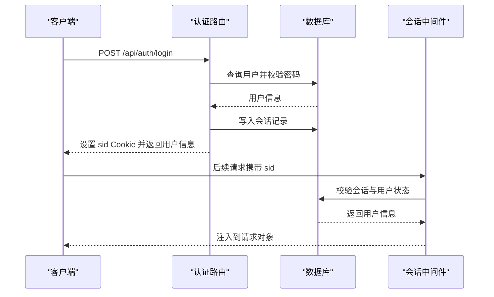
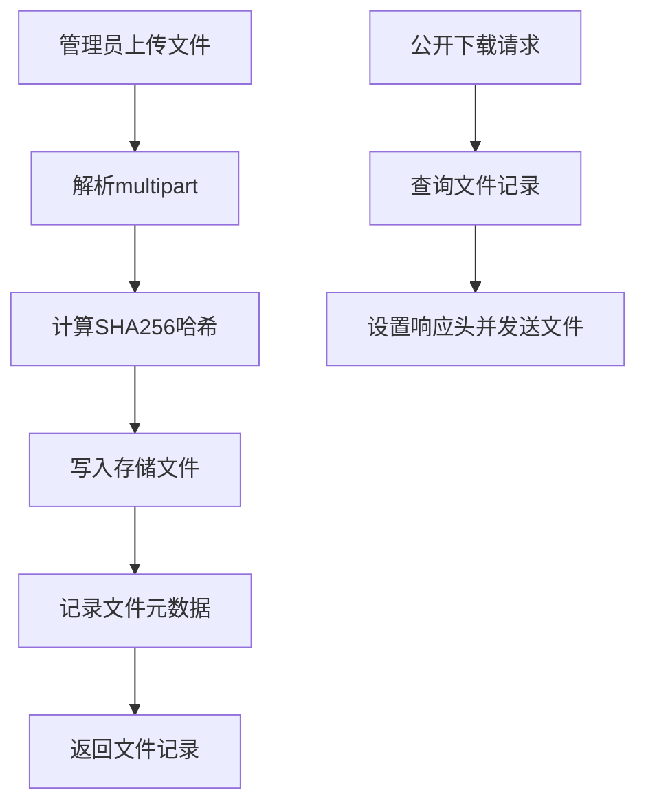
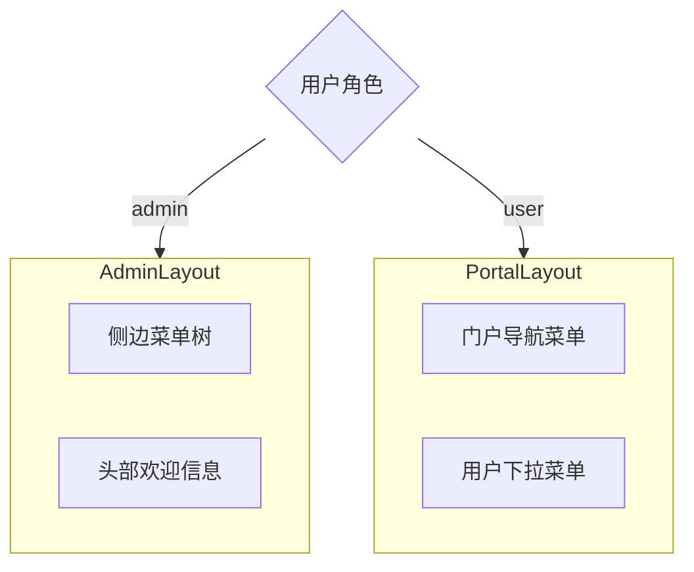
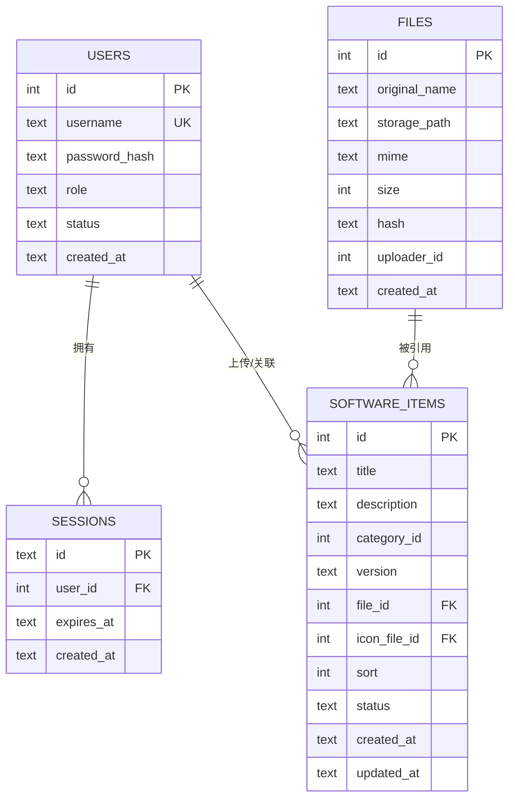
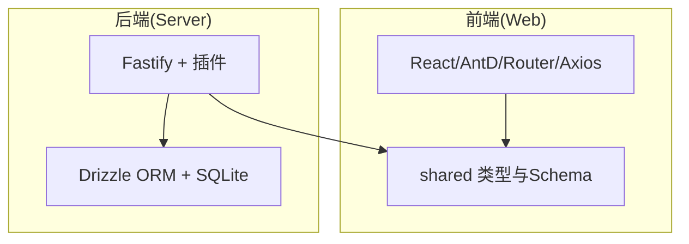

# 前后端分离架构

<cite>
**本文引用的文件**
- [apps/web/package.json](file://apps/web/package.json)
- [apps/server/package.json](file://apps/server/package.json)
- [apps/web/src/main.tsx](file://apps/web/src/main.tsx)
- [apps/web/src/App.tsx](file://apps/web/src/App.tsx)
- [apps/web/src/layouts/PortalLayout.tsx](file://apps/web/src/layouts/PortalLayout.tsx)
- [apps/web/src/layouts/AdminLayout.tsx](file://apps/web/src/layouts/AdminLayout.tsx)
- [apps/web/src/lib/api.ts](file://apps/web/src/lib/api.ts)
- [apps/web/src/lib/auth.tsx](file://apps/web/src/lib/auth.tsx)
- [apps/web/vite.config.ts](file://apps/web/vite.config.ts)
- [apps/server/src/index.ts](file://apps/server/src/index.ts)
- [apps/server/src/middleware/auth.ts](file://apps/server/src/middleware/auth.ts)
- [apps/server/src/middleware/audit.ts](file://apps/server/src/middleware/audit.ts)
- [apps/server/src/routes/auth.ts](file://apps/server/src/routes/auth.ts)
- [apps/server/src/routes/admin.ts](file://apps/server/src/routes/admin.ts)
- [apps/server/src/routes/upload.ts](file://apps/server/src/routes/upload.ts)
- [packages/shared/package.json](file://packages/shared/package.json)
- [packages/shared/src/types.ts](file://packages/shared/src/types.ts)
- [packages/shared/src/schemas.ts](file://packages/shared/src/schemas.ts)
- [apps/server/src/db/schema.ts](file://apps/server/src/db/schema.ts)
</cite>

## 目录
1. [引言](#引言)
2. [项目结构](#项目结构)
3. [核心组件](#核心组件)
4. [架构总览](#架构总览)
5. [详细组件分析](#详细组件分析)
6. [依赖关系分析](#依赖关系分析)
7. [性能考虑](#性能考虑)
8. [故障排查指南](#故障排查指南)
9. [结论](#结论)
10. [附录](#附录)

## 引言
本文件面向ZBH2平台的前后端分离架构，系统性阐述前端React应用与后端Fastify服务的设计与实现要点。内容涵盖前端路由与布局体系、状态管理与组件层次；后端中间件与路由组织、API设计原则；前后端通信机制、HTTP API规范与数据传输格式；双布局系统（PortalLayout与AdminLayout）的设计理念与使用场景；以及跨域处理、静态资源服务与文件上传的实现方案。

## 项目结构
ZBH2采用Monorepo工作区，由三个主要部分组成：
- apps/web：基于Vite与React 18的前端应用，使用Ant Design作为UI框架，通过React Router v6进行路由管理。
- apps/server：基于Fastify的后端服务，集成CORS、Helmet、Cookie、Multipart、Rate Limit、Static等插件，使用Drizzle ORM访问SQLite数据库。
- packages/shared：共享类型与校验Schema，供前后端复用，确保API契约一致。

```mermaid
graph TB
subgraph "前端(Web)"
Vite["Vite 开发服务器<br/>端口: 5273"]
ReactApp["React 应用<br/>路由与布局"]
Axios["Axios 客户端<br/>baseURL: /api"]
end
subgraph "后端(Server)"
Fastify["Fastify 服务<br/>端口: 7500"]
Plugins["中间件与插件<br/>CORS/Helmet/Cookie/Multipart/Static/RateLimit"]
Routes["路由模块<br/>auth/admin/upload/..."]
DB["SQLite 数据库<br/>Drizzle ORM"]
end
Vite --> |"开发代理"/api"| Fastify
ReactApp --> Axios --> Fastify
Fastify --> Plugins
Fastify --> Routes
Routes --> DB
```

图表来源
- [apps/web/vite.config.ts:1-13](file://apps/web/vite.config.ts#L1-L13)
- [apps/web/src/lib/api.ts:1-16](file://apps/web/src/lib/api.ts#L1-L16)
- [apps/server/src/index.ts:1-60](file://apps/server/src/index.ts#L1-L60)

章节来源
- [apps/web/package.json:1-29](file://apps/web/package.json#L1-L29)
- [apps/server/package.json:1-37](file://apps/server/package.json#L1-L37)
- [packages/shared/package.json:1-24](file://packages/shared/package.json#L1-L24)

## 核心组件
- 前端核心入口与上下文
  - 应用根节点在入口文件中配置浏览器路由、主题与国际化，并注入全局认证上下文。
  - 路由系统以PortalLayout与AdminLayout为容器，分别承载门户与管理后台页面。
- 后端核心启动与中间件
  - 服务初始化注册安全、会话、限流、静态资源与多部分上传等插件。
  - 注册各业务路由模块，并在请求进入前加载会话信息。
- 共享契约
  - 使用共享包中的类型与Zod Schema统一前后端数据模型与校验规则。

章节来源
- [apps/web/src/main.tsx:1-22](file://apps/web/src/main.tsx#L1-L22)
- [apps/web/src/App.tsx:1-80](file://apps/web/src/App.tsx#L1-L80)
- [apps/server/src/index.ts:1-60](file://apps/server/src/index.ts#L1-L60)
- [packages/shared/src/types.ts:1-18](file://packages/shared/src/types.ts#L1-L18)
- [packages/shared/src/schemas.ts:1-51](file://packages/shared/src/schemas.ts#L1-L51)

## 架构总览
下图展示从浏览器到后端服务的关键交互路径，包括认证流程、文件上传与静态资源访问。



图表来源
- [apps/web/vite.config.ts:6-11](file://apps/web/vite.config.ts#L6-L11)
- [apps/web/src/lib/api.ts:1-16](file://apps/web/src/lib/api.ts#L1-L16)
- [apps/server/src/index.ts:29-54](file://apps/server/src/index.ts#L29-L54)
- [apps/server/src/middleware/auth.ts:17-40](file://apps/server/src/middleware/auth.ts#L17-L40)

## 详细组件分析

### 前端路由与布局体系
- 路由组织
  - 顶层路由以PortalLayout包裹门户相关页面，AdminLayout包裹管理后台页面。
  - PortalLayout提供顶部导航与用户下拉菜单，支持跳转到门户功能页与登录。
  - AdminLayout提供侧边菜单与头部信息，仅管理员可访问，否则重定向至登录页。
- 状态管理
  - 使用自定义认证上下文提供登录、登出、刷新用户信息能力，并在应用启动时自动尝试刷新当前用户。
- 组件层次
  - PortalLayout/AdminLayout作为页面容器，内部通过Outlet渲染子页面组件，形成清晰的布局-页面层级。



图表来源
- [apps/web/src/App.tsx:38-79](file://apps/web/src/App.tsx#L38-L79)
- [apps/web/src/layouts/PortalLayout.tsx:20-76](file://apps/web/src/layouts/PortalLayout.tsx#L20-L76)
- [apps/web/src/layouts/AdminLayout.tsx:88-127](file://apps/web/src/layouts/AdminLayout.tsx#L88-L127)
- [apps/web/src/lib/auth.tsx:20-55](file://apps/web/src/lib/auth.tsx#L20-L55)

章节来源
- [apps/web/src/App.tsx:1-80](file://apps/web/src/App.tsx#L1-L80)
- [apps/web/src/layouts/PortalLayout.tsx:1-76](file://apps/web/src/layouts/PortalLayout.tsx#L1-L76)
- [apps/web/src/layouts/AdminLayout.tsx:1-127](file://apps/web/src/layouts/AdminLayout.tsx#L1-L127)
- [apps/web/src/lib/auth.tsx:1-55](file://apps/web/src/lib/auth.tsx#L1-L55)

### 后端中间件与路由组织
- 中间件
  - 会话加载：从Cookie读取sid，验证会话有效性与用户状态，注入到请求对象。
  - 权限控制：提供requireAuth与requireAdmin钩子，用于保护管理接口。
  - 审计日志：提供日志记录工具，便于追踪关键操作。
- 路由组织
  - 按领域拆分路由模块：认证、公开、管理、上传、激活、工单、资产、SaaS、报表、AI FAQ、监控等。
  - 统一响应格式：所有接口返回统一结构，包含success、data与可选error字段。
- 插件与安全
  - 注册CORS、Helmet、Cookie、Multipart、Rate Limit、Static等插件，保障跨域、安全头、会话、上传与静态资源服务能力。



图表来源
- [apps/server/src/index.ts:29-54](file://apps/server/src/index.ts#L29-L54)
- [apps/server/src/middleware/auth.ts:17-56](file://apps/server/src/middleware/auth.ts#L17-L56)
- [apps/server/src/middleware/audit.ts:1-28](file://apps/server/src/middleware/audit.ts#L1-L28)

章节来源
- [apps/server/src/middleware/auth.ts:1-56](file://apps/server/src/middleware/auth.ts#L1-L56)
- [apps/server/src/middleware/audit.ts:1-28](file://apps/server/src/middleware/audit.ts#L1-L28)
- [apps/server/src/index.ts:1-60](file://apps/server/src/index.ts#L1-L60)

### 认证与会话机制
- 登录流程
  - 前端提交用户名与密码，后端使用Zod校验，查询用户并验证密码哈希。
  - 成功后生成会话ID并写入数据库，设置HttpOnly Cookie，返回用户信息。
- 会话加载
  - 请求进入时，中间件根据Cookie中的sid查询有效会话与激活用户，注入到请求对象。
- 登出流程
  - 删除对应会话记录并清除Cookie，返回成功状态。



图表来源
- [apps/server/src/routes/auth.ts:8-51](file://apps/server/src/routes/auth.ts#L8-L51)
- [apps/server/src/middleware/auth.ts:17-40](file://apps/server/src/middleware/auth.ts#L17-L40)

章节来源
- [apps/server/src/routes/auth.ts:1-51](file://apps/server/src/routes/auth.ts#L1-L51)
- [apps/server/src/middleware/auth.ts:1-56](file://apps/server/src/middleware/auth.ts#L1-L56)

### 文件上传与静态资源
- 上传流程
  - 管理员通过multipart上传文件，服务端计算SHA256哈希、记录文件元数据并持久化存储。
  - 返回文件记录，供后续业务引用。
- 下载与静态服务
  - 通过静态插件暴露上传目录，提供安全的文件下载链接。
  - 下载接口返回文件并设置合适的Content-Disposition与MIME类型。



图表来源
- [apps/server/src/routes/upload.ts:14-63](file://apps/server/src/routes/upload.ts#L14-L63)
- [apps/server/src/index.ts:35-35](file://apps/server/src/index.ts#L35-L35)

章节来源
- [apps/server/src/routes/upload.ts:1-63](file://apps/server/src/routes/upload.ts#L1-L63)
- [apps/server/src/index.ts:24-35](file://apps/server/src/index.ts#L24-L35)

### 双布局系统设计理念与使用场景
- PortalLayout
  - 面向普通用户的门户导航，提供软件下载、帮助文档、激活、云服务、智能客服等功能入口。
  - 根据用户角色显示管理后台入口与个人中心入口。
- AdminLayout
  - 面向管理员的后台管理，提供软件、文档、激活、资产、SaaS、工单、报表、监控、审计等管理功能。
  - 通过权限拦截确保非管理员无法访问后台路由。



图表来源
- [apps/web/src/layouts/PortalLayout.tsx:20-76](file://apps/web/src/layouts/PortalLayout.tsx#L20-L76)
- [apps/web/src/layouts/AdminLayout.tsx:88-127](file://apps/web/src/layouts/AdminLayout.tsx#L88-L127)

章节来源
- [apps/web/src/layouts/PortalLayout.tsx:1-76](file://apps/web/src/layouts/PortalLayout.tsx#L1-L76)
- [apps/web/src/layouts/AdminLayout.tsx:1-127](file://apps/web/src/layouts/AdminLayout.tsx#L1-L127)

### 前后端通信机制与API设计规范
- 通信机制
  - 前端通过Axios实例发起请求，默认baseURL为/api，withCredentials启用跨站携带Cookie。
  - Vite开发服务器配置代理，将/api前缀转发到后端服务地址。
- API设计原则
  - 统一响应体：success布尔值标识操作是否成功；data承载业务数据；error在失败时提供错误信息。
  - 分页响应：提供items、total、page、pageSize字段，便于前端分页展示。
  - 数据校验：共享Schema确保前后端输入一致性，减少歧义与错误。
- 数据传输格式
  - JSON为主的数据交换格式；文件上传采用multipart/form-data；下载时设置正确的Content-Type与Content-Disposition。

章节来源
- [apps/web/src/lib/api.ts:1-16](file://apps/web/src/lib/api.ts#L1-L16)
- [apps/web/vite.config.ts:6-11](file://apps/web/vite.config.ts#L6-L11)
- [packages/shared/src/types.ts:6-17](file://packages/shared/src/types.ts#L6-L17)
- [packages/shared/src/schemas.ts:1-51](file://packages/shared/src/schemas.ts#L1-L51)

### 数据模型与数据库设计
- 关键实体
  - 用户与会话：用户表含用户名、角色、状态；会话表关联用户并记录过期时间。
  - 软件与文件：软件条目与文件表关联，支持图标与安装包文件。
  - 文档与激活：帮助文档与激活产品/码/发放记录形成闭环。
  - 工单、资产、SaaS、监控、审计等模块均有独立表支撑。
- 设计特点
  - 使用枚举字段约束状态与类型，保证数据一致性。
  - 外键约束与级联删除保障数据完整性。
  - 时间戳字段统一记录创建与更新时间，便于审计与排序。



图表来源
- [apps/server/src/db/schema.ts:3-49](file://apps/server/src/db/schema.ts#L3-L49)

章节来源
- [apps/server/src/db/schema.ts:1-330](file://apps/server/src/db/schema.ts#L1-L330)

## 依赖关系分析
- 前端依赖
  - React、React Router DOM、Ant Design、Axios、共享包shared。
- 后端依赖
  - Fastify核心与插件（@fastify/cookie、@fastify/cors、@fastify/helmet、@fastify/multipart、@fastify/rate-limit、@fastify/static）、argon2、nanoid、drizzle-orm、better-sqlite3、zod、shared。
- 共享依赖
  - shared提供类型与Schema，确保前后端契约一致。



图表来源
- [apps/web/package.json:11-27](file://apps/web/package.json#L11-L27)
- [apps/server/package.json:14-28](file://apps/server/package.json#L14-L28)
- [packages/shared/package.json:17-22](file://packages/shared/package.json#L17-L22)

章节来源
- [apps/web/package.json:1-29](file://apps/web/package.json#L1-L29)
- [apps/server/package.json:1-37](file://apps/server/package.json#L1-L37)
- [packages/shared/package.json:1-24](file://packages/shared/package.json#L1-L24)

## 性能考虑
- 限流与安全
  - 启用速率限制，防止滥用；CORS允许凭证与动态源，提升开发灵活性。
- 上传优化
  - 限制上传大小，避免内存压力；对大文件采用流式写入与哈希计算。
- 响应一致性
  - 统一响应体与分页结构，降低前端解析成本，提升可维护性。
- 静态资源
  - 通过静态插件直接服务上传文件，减少额外处理开销。

## 故障排查指南
- 登录失败
  - 检查用户名与密码是否符合共享Schema约束；确认用户状态为激活；查看会话是否正确写入与Cookie是否携带。
- 权限不足
  - 确认用户角色为admin；检查路由preHandler是否正确应用requireAdmin。
- 文件上传失败
  - 检查multipart插件配置与文件大小限制；确认上传目录可写；核对文件哈希与元数据是否正确入库。
- 下载异常
  - 核对文件记录是否存在；检查静态服务前缀与文件路径；确认Content-Disposition与MIME类型设置。
- 审计日志
  - 使用审计中间件记录关键操作，便于问题回溯与合规审计。

章节来源
- [apps/server/src/routes/auth.ts:8-51](file://apps/server/src/routes/auth.ts#L8-L51)
- [apps/server/src/middleware/auth.ts:42-55](file://apps/server/src/middleware/auth.ts#L42-L55)
- [apps/server/src/routes/upload.ts:14-63](file://apps/server/src/routes/upload.ts#L14-L63)
- [apps/server/src/middleware/audit.ts:1-28](file://apps/server/src/middleware/audit.ts#L1-L28)

## 结论
ZBH2平台采用清晰的前后端分离架构：前端以React+AntD构建门户与管理后台，通过统一的Axios客户端与后端API交互；后端以Fastify为核心，结合中间件与模块化路由实现高内聚低耦合的服务层。共享Schema与统一响应体确保了前后端契约一致与开发效率。双布局系统满足不同用户群体的使用场景，配合完善的认证、上传与审计机制，形成稳定可扩展的系统基础。

## 附录
- 开发与运行
  - 前端：Vite开发服务器默认端口5273，代理/api至后端7500。
  - 后端：开发脚本使用tsx监听，数据库迁移与种子脚本可按需执行。
- 最佳实践
  - 在新增接口时遵循统一响应体与Schema校验；
  - 对敏感操作使用requireAdmin保护；
  - 上传文件时严格限制大小与类型，做好哈希校验与重复检测。