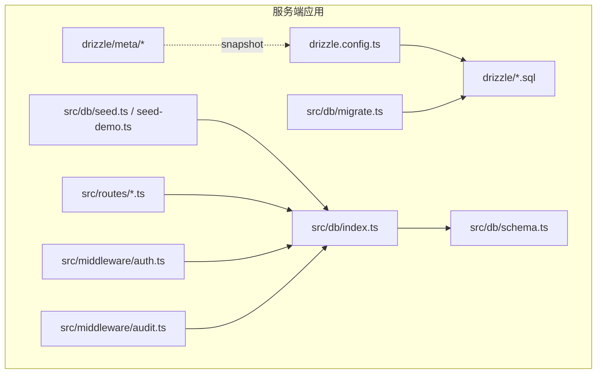
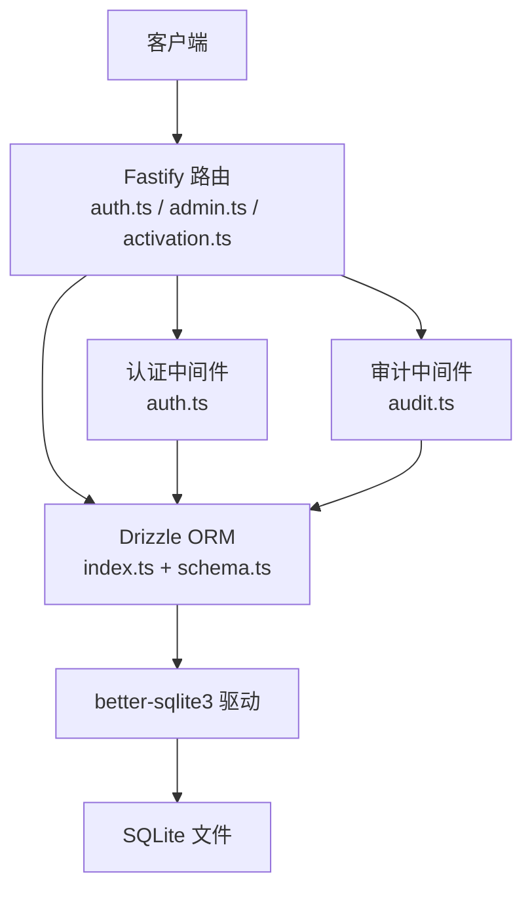
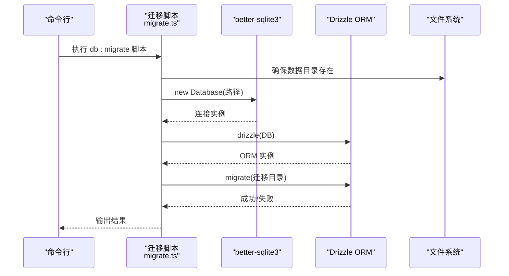
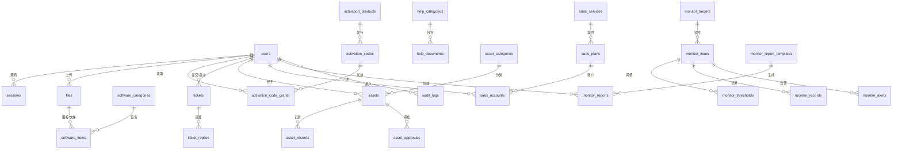
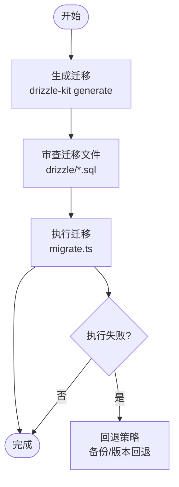
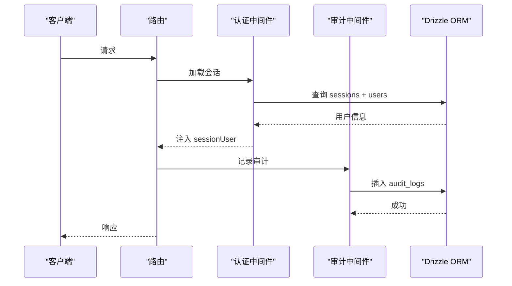
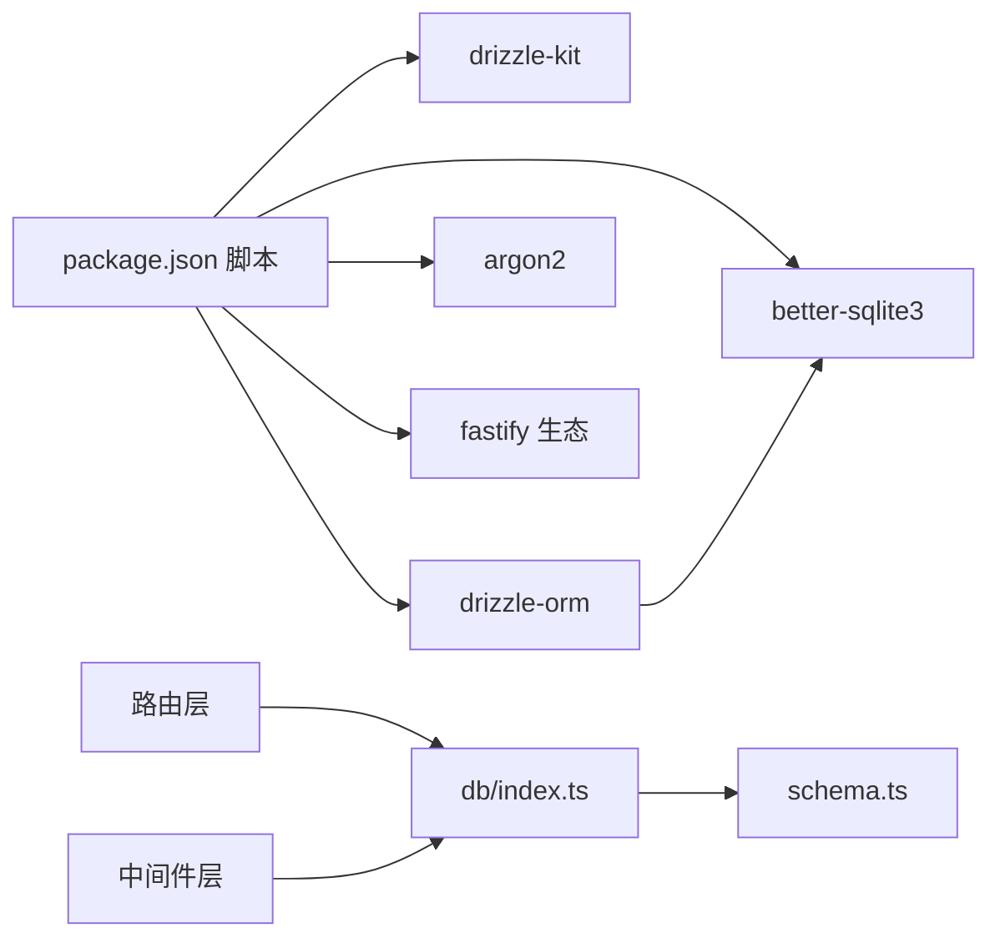

# 数据库架构设计

<cite>
**本文引用的文件**
- [apps/server/drizzle.config.ts](file://apps/server/drizzle.config.ts)
- [apps/server/src/db/index.ts](file://apps/server/src/db/index.ts)
- [apps/server/src/db/schema.ts](file://apps/server/src/db/schema.ts)
- [apps/server/src/db/migrate.ts](file://apps/server/src/db/migrate.ts)
- [apps/server/src/db/seed.ts](file://apps/server/src/db/seed.ts)
- [apps/server/src/db/seed-demo.ts](file://apps/server/src/db/seed-demo.ts)
- [apps/server/package.json](file://apps/server/package.json)
- [apps/server/src/middleware/auth.ts](file://apps/server/src/middleware/auth.ts)
- [apps/server/src/middleware/audit.ts](file://apps/server/src/middleware/audit.ts)
- [apps/server/src/routes/auth.ts](file://apps/server/src/routes/auth.ts)
- [apps/server/src/routes/admin.ts](file://apps/server/src/routes/admin.ts)
- [apps/server/src/routes/activation.ts](file://apps/server/src/routes/activation.ts)
- [apps/server/drizzle/0000_absurd_liz_osborn.sql](file://apps/server/drizzle/0000_absurd_liz_osborn.sql)
- [apps/server/drizzle/0001_zippy_shadowcat.sql](file://apps/server/drizzle/0001_zippy_shadowcat.sql)
- [apps/server/drizzle/0002_special_medusa.sql](file://apps/server/drizzle/0002_special_medusa.sql)
</cite>

## 目录
1. [引言](#引言)
2. [项目结构](#项目结构)
3. [核心组件](#核心组件)
4. [架构总览](#架构总览)
5. [详细组件分析](#详细组件分析)
6. [依赖分析](#依赖分析)
7. [性能考量](#性能考量)
8. [故障排查指南](#故障排查指南)
9. [结论](#结论)
10. [附录](#附录)

## 引言
本文件为 ZBH2 平台数据库架构设计文档，聚焦于 Drizzle ORM 在 SQLite 上的配置与使用，涵盖数据库连接、迁移管理、类型安全查询、数据模型设计、实体关系与约束、迁移策略与版本管理、回滚机制、SQLite 选型理由与扩展性限制、数据访问层设计模式（Repository 模式）、事务管理、数据库优化与监控方案等内容。文档旨在帮助开发者与运维人员理解并维护数据库层。

## 项目结构
数据库相关代码主要位于服务端应用 apps/server 中，采用“按功能域划分”的组织方式：
- Drizzle 配置与迁移：drizzle.config.ts、drizzle 目录下的 SQL 迁移文件
- 数据访问层：src/db 下的入口、模式定义、迁移脚本、种子数据
- 中间件与路由：认证、审计日志、业务路由均通过 Drizzle ORM 访问数据库
- 包管理与脚本：package.json 中提供数据库相关脚本（生成、迁移、播种）

图表来源
- [apps/server/drizzle.config.ts:1-11](file://apps/server/drizzle.config.ts#L1-L11)
- [apps/server/src/db/index.ts:1-16](file://apps/server/src/db/index.ts#L1-L16)
- [apps/server/src/db/schema.ts:1-330](file://apps/server/src/db/schema.ts#L1-L330)
- [apps/server/src/db/migrate.ts:1-18](file://apps/server/src/db/migrate.ts#L1-L18)
- [apps/server/src/db/seed.ts:1-98](file://apps/server/src/db/seed.ts#L1-L98)
- [apps/server/src/db/seed-demo.ts:1-800](file://apps/server/src/db/seed-demo.ts#L1-L800)
- [apps/server/src/middleware/auth.ts:1-56](file://apps/server/src/middleware/auth.ts#L1-L56)
- [apps/server/src/middleware/audit.ts:1-28](file://apps/server/src/middleware/audit.ts#L1-L28)
- [apps/server/src/routes/auth.ts:1-51](file://apps/server/src/routes/auth.ts#L1-L51)
- [apps/server/src/routes/admin.ts:1-279](file://apps/server/src/routes/admin.ts#L1-L279)
- [apps/server/src/routes/activation.ts:1-95](file://apps/server/src/routes/activation.ts#L1-L95)

章节来源
- [apps/server/drizzle.config.ts:1-11](file://apps/server/drizzle.config.ts#L1-L11)
- [apps/server/src/db/index.ts:1-16](file://apps/server/src/db/index.ts#L1-L16)
- [apps/server/src/db/schema.ts:1-330](file://apps/server/src/db/schema.ts#L1-L330)
- [apps/server/src/db/migrate.ts:1-18](file://apps/server/src/db/migrate.ts#L1-L18)
- [apps/server/src/db/seed.ts:1-98](file://apps/server/src/db/seed.ts#L1-L98)
- [apps/server/src/db/seed-demo.ts:1-800](file://apps/server/src/db/seed-demo.ts#L1-L800)
- [apps/server/package.json:1-37](file://apps/server/package.json#L1-L37)

## 核心组件
- Drizzle 配置与驱动
  - 配置文件指定 schema、输出目录、方言与数据库凭据（URL）
  - 运行时通过 better-sqlite3 初始化连接，并启用 WAL 与外键校验
- 数据模型与类型安全
  - schema.ts 使用 sqliteTable 定义各实体字段、主键、唯一索引、枚举与默认值
  - Drizzle ORM 提供编译期类型推断，保证查询返回类型安全
- 迁移与版本管理
  - 迁移脚本执行 drizzle-orm/better-sqlite3/migrator，基于 drizzle 目录的 SQL 文件
  - drizzle-kit 生成迁移快照与 SQL 文件，meta 目录保存快照
- 种子数据
  - seed.ts 提供最小可用数据（管理员、分类、FAQ、资产分类）
  - seed-demo.ts 提供演示数据（软件项、帮助文档等）
- 认证与审计中间件
  - 加载会话、鉴权与权限控制
  - 审计日志记录用户行为与结果
- 路由层
  - 认证路由、管理员管理、激活码发放等均通过 Drizzle ORM 访问数据库

章节来源
- [apps/server/drizzle.config.ts:1-11](file://apps/server/drizzle.config.ts#L1-L11)
- [apps/server/src/db/index.ts:1-16](file://apps/server/src/db/index.ts#L1-L16)
- [apps/server/src/db/schema.ts:1-330](file://apps/server/src/db/schema.ts#L1-L330)
- [apps/server/src/db/migrate.ts:1-18](file://apps/server/src/db/migrate.ts#L1-L18)
- [apps/server/src/db/seed.ts:1-98](file://apps/server/src/db/seed.ts#L1-L98)
- [apps/server/src/db/seed-demo.ts:1-800](file://apps/server/src/db/seed-demo.ts#L1-L800)
- [apps/server/src/middleware/auth.ts:1-56](file://apps/server/src/middleware/auth.ts#L1-L56)
- [apps/server/src/middleware/audit.ts:1-28](file://apps/server/src/middleware/audit.ts#L1-L28)
- [apps/server/src/routes/auth.ts:1-51](file://apps/server/src/routes/auth.ts#L1-L51)
- [apps/server/src/routes/admin.ts:1-279](file://apps/server/src/routes/admin.ts#L1-L279)
- [apps/server/src/routes/activation.ts:1-95](file://apps/server/src/routes/activation.ts#L1-L95)

## 架构总览
下图展示 Drizzle ORM 在 ZBH2 中的整体交互：应用路由调用中间件与业务逻辑，通过 Drizzle ORM 访问 SQLite；迁移脚本与种子脚本分别负责数据库初始化与数据填充。

图表来源
- [apps/server/src/routes/auth.ts:1-51](file://apps/server/src/routes/auth.ts#L1-L51)
- [apps/server/src/routes/admin.ts:1-279](file://apps/server/src/routes/admin.ts#L1-L279)
- [apps/server/src/routes/activation.ts:1-95](file://apps/server/src/routes/activation.ts#L1-L95)
- [apps/server/src/middleware/auth.ts:1-56](file://apps/server/src/middleware/auth.ts#L1-L56)
- [apps/server/src/middleware/audit.ts:1-28](file://apps/server/src/middleware/audit.ts#L1-L28)
- [apps/server/src/db/index.ts:1-16](file://apps/server/src/db/index.ts#L1-L16)
- [apps/server/src/db/schema.ts:1-330](file://apps/server/src/db/schema.ts#L1-L330)

## 详细组件分析

### Drizzle ORM 配置与连接
- 配置要点
  - schema 指向 src/db/schema.ts
  - 输出目录为 drizzle
  - 方言为 sqlite
  - 数据库 URL 来自环境变量 DATABASE_URL，否则默认 ../../data/app.sqlite
- 运行时连接
  - 使用 better-sqlite3 创建连接
  - 启用 WAL（写-ahead logging）与外键检查
  - 通过 drizzle(sqlite, { schema }) 创建 ORM 实例

图表来源
- [apps/server/src/db/migrate.ts:1-18](file://apps/server/src/db/migrate.ts#L1-L18)
- [apps/server/src/db/index.ts:1-16](file://apps/server/src/db/index.ts#L1-L16)
- [apps/server/drizzle.config.ts:1-11](file://apps/server/drizzle.config.ts#L1-L11)

章节来源
- [apps/server/drizzle.config.ts:1-11](file://apps/server/drizzle.config.ts#L1-L11)
- [apps/server/src/db/index.ts:1-16](file://apps/server/src/db/index.ts#L1-L16)
- [apps/server/src/db/migrate.ts:1-18](file://apps/server/src/db/migrate.ts#L1-L18)

### 数据模型设计与实体关系
- 设计原则
  - 字段类型与约束：使用 integer、text、real 等明确类型；notNull、unique、default、枚举等约束
  - 时间戳：统一使用 text 存储 ISO 字符串，配合 $defaultFn 自动生成
  - 外键：通过 references 定义，部分表启用级联删除（如 sessions、ticket_replies、monitor_items/records/thresholds）
- 实体关系
  - 用户与会话：一对多（用户可有多个会话）
  - 软件分类与软件条目：一对多
  - 文件与软件条目：多对一（图标与安装包）
  - 帮助分类与帮助文档：一对多
  - 激活产品与激活码/发放记录：一对多/多对一
  - 工单与回复：一对多
  - 资产分类与资产：一对多
  - 资产审批与记录：一对多
  - SaaS 服务/计划/账户：三层关联
  - 运维监控：目标、指标、阈值、记录、告警、报告、平台
  - 审计日志：记录用户行为与结果

图表来源
- [apps/server/src/db/schema.ts:1-330](file://apps/server/src/db/schema.ts#L1-L330)

章节来源
- [apps/server/src/db/schema.ts:1-330](file://apps/server/src/db/schema.ts#L1-L330)

### 迁移策略、版本管理与回滚
- 迁移生成
  - 使用 drizzle-kit generate 基于 schema.ts 生成迁移快照与 SQL 文件
  - drizzle 目录存放 SQL 迁移；meta 目录保存快照文件
- 迁移执行
  - 迁移脚本加载数据库连接，调用 migrate(db, { migrationsFolder }) 执行
- 版本管理
  - 通过 SQL 文件名与内容追踪版本演进
  - 示例迁移文件展示了激活、资产、SaaS、工单、监控、审计等模块的演进
- 回滚机制
  - 当前仓库未提供显式的回滚脚本；建议在生产环境谨慎执行迁移，必要时通过备份与版本回退策略保障

图表来源
- [apps/server/drizzle.config.ts:1-11](file://apps/server/drizzle.config.ts#L1-L11)
- [apps/server/src/db/migrate.ts:1-18](file://apps/server/src/db/migrate.ts#L1-L18)
- [apps/server/drizzle/0000_absurd_liz_osborn.sql:1-108](file://apps/server/drizzle/0000_absurd_liz_osborn.sql#L1-L108)
- [apps/server/drizzle/0001_zippy_shadowcat.sql:1-132](file://apps/server/drizzle/0001_zippy_shadowcat.sql#L1-L132)
- [apps/server/drizzle/0002_special_medusa.sql:1-125](file://apps/server/drizzle/0002_special_medusa.sql#L1-L125)

章节来源
- [apps/server/drizzle.config.ts:1-11](file://apps/server/drizzle.config.ts#L1-L11)
- [apps/server/src/db/migrate.ts:1-18](file://apps/server/src/db/migrate.ts#L1-L18)
- [apps/server/drizzle/0000_absurd_liz_osborn.sql:1-108](file://apps/server/drizzle/0000_absurd_liz_osborn.sql#L1-L108)
- [apps/server/drizzle/0001_zippy_shadowcat.sql:1-132](file://apps/server/drizzle/0001_zippy_shadowcat.sql#L1-L132)
- [apps/server/drizzle/0002_special_medusa.sql:1-125](file://apps/server/drizzle/0002_special_medusa.sql#L1-L125)

### 类型安全查询与数据访问层
- 类型安全
  - schema.ts 使用 sqliteTable 定义表结构，Drizzle 提供编译期类型推断
  - 查询返回类型与字段一一对应，减少运行时错误
- 数据访问层
  - db/index.ts 暴露 db 实例与 schema 对象，路由与中间件统一通过该入口访问数据库
  - 中间件与路由中广泛使用 select、insert、update、delete 与条件查询（eq、and、gt 等）
- Repository 模式
  - 当前未实现独立的 Repository 抽象类，但可通过封装 db/index.ts 与 schema.* 在路由或服务层形成“数据访问对象”职责
  - 建议在复杂业务场景引入 Repository，以隔离数据访问细节、便于测试与维护

章节来源
- [apps/server/src/db/index.ts:1-16](file://apps/server/src/db/index.ts#L1-L16)
- [apps/server/src/db/schema.ts:1-330](file://apps/server/src/db/schema.ts#L1-L330)
- [apps/server/src/middleware/auth.ts:1-56](file://apps/server/src/middleware/auth.ts#L1-L56)
- [apps/server/src/middleware/audit.ts:1-28](file://apps/server/src/middleware/audit.ts#L1-L28)
- [apps/server/src/routes/auth.ts:1-51](file://apps/server/src/routes/auth.ts#L1-L51)
- [apps/server/src/routes/admin.ts:1-279](file://apps/server/src/routes/admin.ts#L1-L279)
- [apps/server/src/routes/activation.ts:1-95](file://apps/server/src/routes/activation.ts#L1-L95)

### 事务管理
- 当前实现
  - 路由与中间件中使用单条语句或简单事务（如激活码领取流程中的更新与插入）
- 建议
  - 对于跨多表、多步骤的业务（如批量导入、发放与扣减库存），建议使用事务包裹，确保一致性
  - 可在 db/index.ts 中封装事务函数，统一处理 begin/commit/rollback

章节来源
- [apps/server/src/routes/activation.ts:1-95](file://apps/server/src/routes/activation.ts#L1-L95)

### 种子数据与演示数据
- seed.ts
  - 确保管理员用户存在，初始化软件与帮助分类、FAQ、资产分类等基础数据
- seed-demo.ts
  - 提供大量演示数据（软件项、帮助文档等），便于演示与测试

章节来源
- [apps/server/src/db/seed.ts:1-98](file://apps/server/src/db/seed.ts#L1-L98)
- [apps/server/src/db/seed-demo.ts:1-800](file://apps/server/src/db/seed-demo.ts#L1-L800)

### 认证与审计
- 认证中间件
  - 从 Cookie 读取 sid，查询 sessions 与 users，校验过期时间与用户状态
  - 将用户信息注入请求上下文，供后续路由使用
- 审计中间件
  - 统一封装审计日志插入，记录用户、动作、目标、结果等

图表来源
- [apps/server/src/middleware/auth.ts:1-56](file://apps/server/src/middleware/auth.ts#L1-L56)
- [apps/server/src/middleware/audit.ts:1-28](file://apps/server/src/middleware/audit.ts#L1-L28)
- [apps/server/src/db/index.ts:1-16](file://apps/server/src/db/index.ts#L1-L16)

章节来源
- [apps/server/src/middleware/auth.ts:1-56](file://apps/server/src/middleware/auth.ts#L1-L56)
- [apps/server/src/middleware/audit.ts:1-28](file://apps/server/src/middleware/audit.ts#L1-L28)

## 依赖分析
- 外部依赖
  - better-sqlite3：SQLite 驱动
  - drizzle-orm 与 drizzle-kit：ORM 与迁移工具
  - argon2：密码哈希
  - fastify 生态：路由与中间件
- 内部依赖
  - 路由依赖中间件与 db/index.ts
  - 中间件依赖 db/index.ts 与 schema.*
  - 迁移脚本依赖 better-sqlite3 与 migrator

图表来源
- [apps/server/package.json:1-37](file://apps/server/package.json#L1-L37)
- [apps/server/src/db/index.ts:1-16](file://apps/server/src/db/index.ts#L1-L16)
- [apps/server/src/db/schema.ts:1-330](file://apps/server/src/db/schema.ts#L1-L330)

章节来源
- [apps/server/package.json:1-37](file://apps/server/package.json#L1-L37)

## 性能考量
- SQLite 选型理由
  - 部署简单、零配置、单文件存储，适合中小规模与开发/演示场景
- 性能优化建议
  - 使用 WAL 模式提升并发写入能力（已在连接初始化中启用）
  - 为高频查询字段建立索引（如 users.username、activation_codes.code6、files.hash 等）
  - 合理拆分大表与使用视图，避免一次性全表扫描
  - 批量写入：对批量导入场景使用批量 insert/update
  - 查询优化：避免 N+1 查询，使用 join 与 limit 控制结果集大小
- 扩展性限制
  - SQLite 为单文件数据库，不支持多实例写入与分布式扩展
  - 高并发写入场景建议评估迁移到关系型数据库（如 PostgreSQL/MySQL）

章节来源
- [apps/server/src/db/index.ts:1-16](file://apps/server/src/db/index.ts#L1-L16)
- [apps/server/src/db/schema.ts:1-330](file://apps/server/src/db/schema.ts#L1-L330)

## 故障排查指南
- 迁移失败
  - 检查 drizzle 目录 SQL 文件是否与 schema.ts 一致
  - 确认数据库文件路径与权限（DATABASE_URL 或默认路径）
  - 查看迁移脚本输出与 better-sqlite3 错误信息
- 连接问题
  - 确认 data 目录存在且可写
  - 检查 WAL 与外键 pragma 是否正确设置
- 认证异常
  - 检查 Cookie sid 是否存在与未过期
  - 确认 users.status 为 active
- 审计日志缺失
  - 确认审计中间件是否在相应路由中调用
  - 检查 audit_logs 表结构与字段映射

章节来源
- [apps/server/src/db/migrate.ts:1-18](file://apps/server/src/db/migrate.ts#L1-L18)
- [apps/server/src/db/index.ts:1-16](file://apps/server/src/db/index.ts#L1-L16)
- [apps/server/src/middleware/auth.ts:1-56](file://apps/server/src/middleware/auth.ts#L1-L56)
- [apps/server/src/middleware/audit.ts:1-28](file://apps/server/src/middleware/audit.ts#L1-L28)

## 结论
ZBH2 平台采用 Drizzle ORM + SQLite 的组合，实现了类型安全、可迁移、可维护的数据库层。schema.ts 清晰定义了实体与关系，迁移与种子脚本保障了初始化与数据准备。当前实现满足中小规模需求，未来可按需引入 Repository 模式与事务封装，并在高并发或扩展需求时评估数据库迁移方案。

## 附录
- 数据库脚本与命令
  - 生成迁移：npm run db:generate
  - 执行迁移：npm run db:migrate
  - 播种数据：npm run db:seed
- 迁移文件参考
  - 0000_absurd_liz_osborn.sql：基础实体（用户、会话、文件、软件、帮助、激活）
  - 0001_zippy_shadowcat.sql：资产、SaaS、工单
  - 0002_special_medusa.sql：审计、监控

章节来源
- [apps/server/package.json:1-37](file://apps/server/package.json#L1-L37)
- [apps/server/drizzle/0000_absurd_liz_osborn.sql:1-108](file://apps/server/drizzle/0000_absurd_liz_osborn.sql#L1-L108)
- [apps/server/drizzle/0001_zippy_shadowcat.sql:1-132](file://apps/server/drizzle/0001_zippy_shadowcat.sql#L1-L132)
- [apps/server/drizzle/0002_special_medusa.sql:1-125](file://apps/server/drizzle/0002_special_medusa.sql#L1-L125)