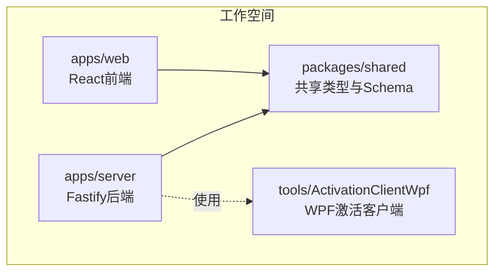
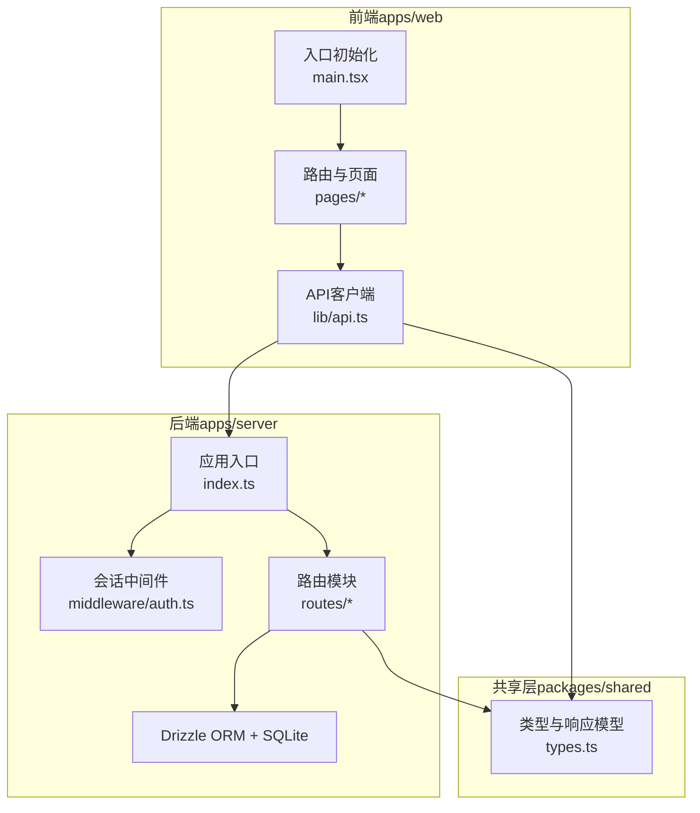
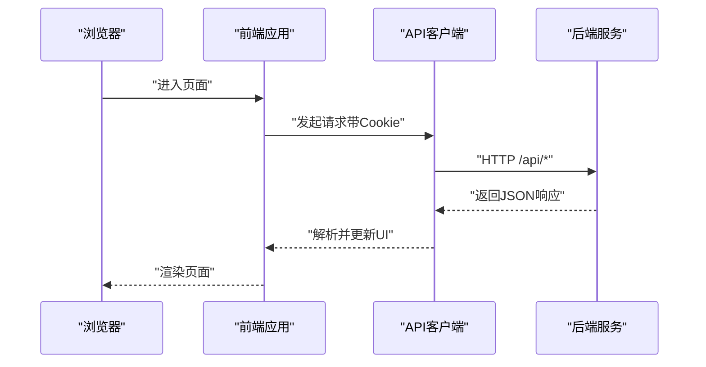
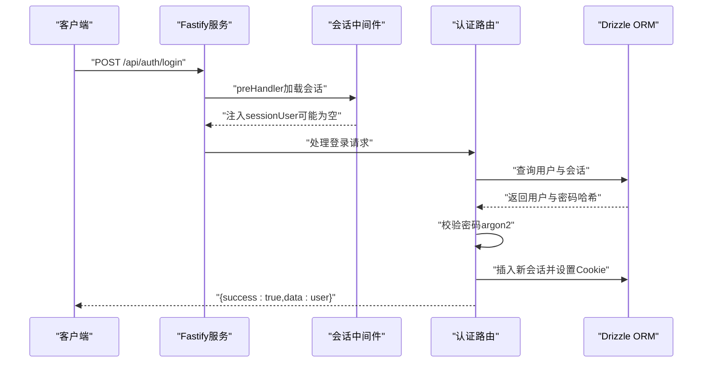
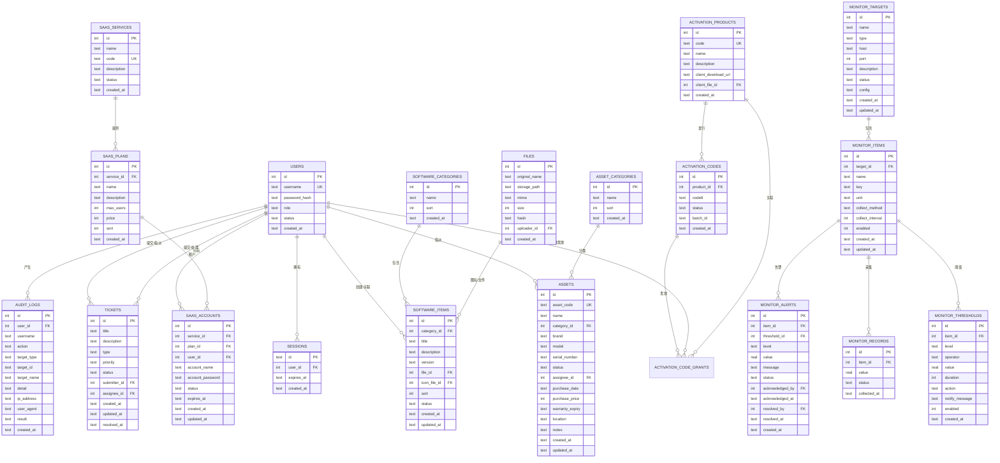
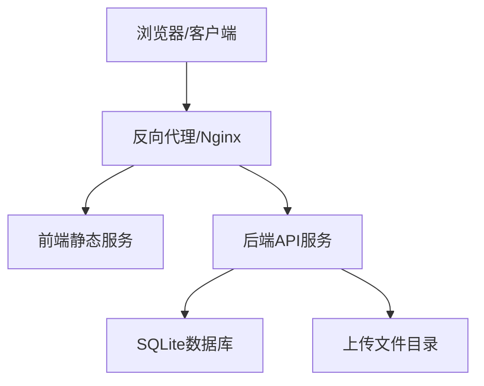
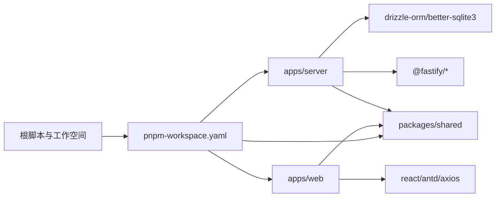

# 整体架构设计

<cite>
**本文引用的文件**
- [package.json](file://package.json)
- [pnpm-workspace.yaml](file://pnpm-workspace.yaml)
- [apps/server/src/index.ts](file://apps/server/src/index.ts)
- [apps/server/src/middleware/auth.ts](file://apps/server/src/middleware/auth.ts)
- [apps/server/src/routes/auth.ts](file://apps/server/src/routes/auth.ts)
- [apps/server/src/db/schema.ts](file://apps/server/src/db/schema.ts)
- [apps/server/drizzle.config.ts](file://apps/server/drizzle.config.ts)
- [apps/web/src/main.tsx](file://apps/web/src/main.tsx)
- [apps/web/src/lib/api.ts](file://apps/web/src/lib/api.ts)
- [apps/web/vite.config.ts](file://apps/web/vite.config.ts)
- [packages/shared/src/types.ts](file://packages/shared/src/types.ts)
- [README.md](file://README.md)
</cite>

## 目录
1. [引言](#引言)
2. [项目结构](#项目结构)
3. [核心组件](#核心组件)
4. [架构总览](#架构总览)
5. [详细组件分析](#详细组件分析)
6. [依赖分析](#依赖分析)
7. [性能考量](#性能考量)
8. [故障排查指南](#故障排查指南)
9. [结论](#结论)
10. [附录](#附录)

## 引言
本文件面向ZBH2平台的整体架构设计，系统采用Monorepo组织方式，通过pnpm工作空间管理多包协作；前端使用React + Vite构建，后端基于Fastify提供REST API，数据访问层采用Drizzle ORM与SQLite结合。本文从分层架构、组件交互、数据流、部署拓扑、技术选型与权衡等方面进行系统性阐述，并给出可视化图示以帮助不同背景读者理解。

## 项目结构
ZBH2采用典型的Monorepo + 多包（apps + packages）结构：
- apps/server：Fastify后端API，包含路由、中间件、数据库schema与迁移脚本
- apps/web：React前端应用，包含页面、布局、API客户端与主题配置
- packages/shared：前后端共享的类型与Zod校验Schema
- tools/ActivationClientWpf：Windows平台激活演示客户端（独立工具）

图表来源
- [pnpm-workspace.yaml:1-5](file://pnpm-workspace.yaml#L1-L5)
- [apps/server/package.json:1-37](file://apps/server/package.json#L1-L37)
- [apps/web/package.json:1-29](file://apps/web/package.json#L1-L29)
- [packages/shared/package.json:1-24](file://packages/shared/package.json#L1-L24)

章节来源
- [README.md:47-68](file://README.md#L47-L68)
- [pnpm-workspace.yaml:1-5](file://pnpm-workspace.yaml#L1-L5)

## 核心组件
- 表现层（前端React应用）
  - 入口初始化：路由、主题、国际化、全局Provider装配
  - API客户端：基于Axios，统一前缀与凭证传递，拦截器处理未授权等场景
  - 开发代理：Vite代理将/api请求转发至后端
- 业务逻辑层（Fastify后端API）
  - 中间件：安全头、CORS、Cookie、限流、静态资源、会话加载
  - 路由：认证、公开接口、管理后台、上传、激活、工单、资产、SaaS、报告、AI FAQ、监控等模块化路由
  - 会话鉴权：基于httpOnly Cookie + 数据库会话表，提供requireAuth/requireAdmin
- 数据访问层（Drizzle ORM + SQLite）
  - Schema定义：用户、会话、软件、帮助、激活、工单、资产、SaaS、监控、审计等完整领域模型
  - 配置：SQLite方言、Drizzle Kit迁移输出目录与数据库URL
  - 迁移与种子：通过脚本驱动数据库演进与初始数据填充

章节来源
- [apps/web/src/main.tsx:1-22](file://apps/web/src/main.tsx#L1-L22)
- [apps/web/src/lib/api.ts:1-16](file://apps/web/src/lib/api.ts#L1-L16)
- [apps/web/vite.config.ts:1-13](file://apps/web/vite.config.ts#L1-L13)
- [apps/server/src/index.ts:1-60](file://apps/server/src/index.ts#L1-L60)
- [apps/server/src/middleware/auth.ts:1-56](file://apps/server/src/middleware/auth.ts#L1-L56)
- [apps/server/src/routes/auth.ts:1-51](file://apps/server/src/routes/auth.ts#L1-L51)
- [apps/server/src/db/schema.ts:1-330](file://apps/server/src/db/schema.ts#L1-L330)
- [apps/server/drizzle.config.ts:1-11](file://apps/server/drizzle.config.ts#L1-L11)

## 架构总览
系统采用前后端分离的B/S架构，前端通过浏览器与后端交互，后端提供REST风格API，数据持久化使用SQLite并通过Drizzle进行ORM映射。Monorepo通过pnpm工作空间实现依赖与脚本统一管理。

图表来源
- [apps/web/src/main.tsx:1-22](file://apps/web/src/main.tsx#L1-L22)
- [apps/web/src/lib/api.ts:1-16](file://apps/web/src/lib/api.ts#L1-L16)
- [apps/server/src/index.ts:1-60](file://apps/server/src/index.ts#L1-L60)
- [apps/server/src/middleware/auth.ts:1-56](file://apps/server/src/middleware/auth.ts#L1-L56)
- [apps/server/src/routes/auth.ts:1-51](file://apps/server/src/routes/auth.ts#L1-L51)
- [apps/server/src/db/schema.ts:1-330](file://apps/server/src/db/schema.ts#L1-L330)
- [packages/shared/src/types.ts:1-18](file://packages/shared/src/types.ts#L1-L18)

## 详细组件分析

### 前端组件分析
- 入口与上下文
  - 使用BrowserRouter、ConfigProvider、主题与语言包装配
  - 提供全局认证上下文，承载登录态与权限信息
- API客户端
  - 统一baseURL为/api，开启withCredentials以便携带Cookie
  - 响应拦截器用于处理未授权等异常，避免重复跳转
- 开发代理
  - 将/api请求转发至后端7500端口，便于前后端联调

图表来源
- [apps/web/src/main.tsx:1-22](file://apps/web/src/main.tsx#L1-L22)
- [apps/web/src/lib/api.ts:1-16](file://apps/web/src/lib/api.ts#L1-L16)
- [apps/web/vite.config.ts:6-12](file://apps/web/vite.config.ts#L6-L12)
- [apps/server/src/index.ts:27-54](file://apps/server/src/index.ts#L27-L54)

章节来源
- [apps/web/src/main.tsx:1-22](file://apps/web/src/main.tsx#L1-L22)
- [apps/web/src/lib/api.ts:1-16](file://apps/web/src/lib/api.ts#L1-L16)
- [apps/web/vite.config.ts:1-13](file://apps/web/vite.config.ts#L1-L13)

### 后端组件分析
- 应用入口与中间件
  - 注册安全与网络中间件（Helmet、CORS、Cookie、Multipart、RateLimit）
  - 挂载静态资源（上传目录），并注入会话加载钩子
  - 注册各模块路由（认证、公开、管理、上传、激活、工单、资产、SaaS、报告、AI FAQ、监控）
- 会话中间件
  - 从Cookie读取sid，查询有效且未过期的会话，回填到请求对象
  - 校验用户状态为active，否则忽略会话
- 认证路由
  - 登录：Zod参数校验、查询用户、验证密码、写入会话、设置httpOnly Cookie
  - 登出：删除会话、清理Cookie
  - 获取当前用户：根据会话返回用户信息

图表来源
- [apps/server/src/index.ts:27-54](file://apps/server/src/index.ts#L27-L54)
- [apps/server/src/middleware/auth.ts:17-40](file://apps/server/src/middleware/auth.ts#L17-L40)
- [apps/server/src/routes/auth.ts:9-33](file://apps/server/src/routes/auth.ts#L9-L33)
- [apps/server/src/db/schema.ts:3-17](file://apps/server/src/db/schema.ts#L3-L17)

章节来源
- [apps/server/src/index.ts:1-60](file://apps/server/src/index.ts#L1-L60)
- [apps/server/src/middleware/auth.ts:1-56](file://apps/server/src/middleware/auth.ts#L1-L56)
- [apps/server/src/routes/auth.ts:1-51](file://apps/server/src/routes/auth.ts#L1-L51)

### 数据模型与关系
Drizzle ORM定义了完整的业务模型，涵盖用户、会话、软件、帮助、激活、工单、资产、SaaS、监控、审计等。以下为关键实体的关系图：

图表来源
- [apps/server/src/db/schema.ts:1-330](file://apps/server/src/db/schema.ts#L1-L330)

章节来源
- [apps/server/src/db/schema.ts:1-330](file://apps/server/src/db/schema.ts#L1-L330)

### 数据库配置与迁移
- Drizzle配置
  - 指定schema路径、迁移输出目录、SQLite方言与数据库URL
- 迁移与种子
  - 通过脚本生成迁移、执行迁移、填充种子数据
- 运行时目录
  - 上传目录位于项目根下的data/uploads，首次运行自动创建

章节来源
- [apps/server/drizzle.config.ts:1-11](file://apps/server/drizzle.config.ts#L1-L11)
- [apps/server/src/index.ts:24-25](file://apps/server/src/index.ts#L24-L25)

### 前后端分离与API通信
- 设计理念
  - 前端负责UI与交互，后端提供无状态API，二者通过HTTP协议解耦
  - 通过Cookie维持会话，后端集中处理鉴权与权限控制
- API通信机制
  - 前端使用Axios统一前缀/api，自动携带Cookie
  - 后端注册CORS与Cookie中间件，允许凭据跨域
  - 会话中间件在每次请求前加载用户上下文
- 数据流向
  - 前端发起请求 → 后端中间件加载会话 → 路由处理业务 → ORM访问SQLite → 返回JSON响应

章节来源
- [apps/web/src/lib/api.ts:1-16](file://apps/web/src/lib/api.ts#L1-L16)
- [apps/server/src/index.ts:27-54](file://apps/server/src/index.ts#L27-L54)
- [apps/server/src/middleware/auth.ts:17-40](file://apps/server/src/middleware/auth.ts#L17-L40)

### 系统边界与部署拓扑
- 系统边界
  - 前端：浏览器渲染、路由导航、API调用
  - 后端：API网关、业务逻辑、会话与鉴权、数据库访问
  - 数据：SQLite文件与上传目录
- 部署拓扑
  - 单机部署：前端静态文件与后端服务在同一主机，通过反向代理暴露端口
  - 数据持久化：SQLite文件与上传目录需纳入备份策略
  - 代理与端口：前端开发代理将/api转发至后端端口7500

图表来源
- [apps/web/vite.config.ts:6-12](file://apps/web/vite.config.ts#L6-L12)
- [apps/server/src/index.ts:51-54](file://apps/server/src/index.ts#L51-L54)
- [apps/server/drizzle.config.ts:7-9](file://apps/server/drizzle.config.ts#L7-L9)

章节来源
- [README.md:26-31](file://README.md#L26-L31)
- [apps/web/vite.config.ts:1-13](file://apps/web/vite.config.ts#L1-L13)

## 依赖分析
- Monorepo与工作空间
  - pnpm工作空间声明apps/*与packages/*，并批准特定原生依赖的构建
  - 顶层脚本统一管理开发、构建、数据库任务
- 包依赖关系
  - apps/server依赖shared与drizzle-orm、fastify及安全/静态/限流等插件
  - apps/web依赖antd、react、axios与shared
  - shared导出类型与Schema，供前后端复用

图表来源
- [pnpm-workspace.yaml:1-5](file://pnpm-workspace.yaml#L1-L5)
- [package.json:4-12](file://package.json#L4-L12)
- [apps/server/package.json:14-36](file://apps/server/package.json#L14-L36)
- [apps/web/package.json:11-28](file://apps/web/package.json#L11-L28)
- [packages/shared/package.json:6-13](file://packages/shared/package.json#L6-L13)

章节来源
- [pnpm-workspace.yaml:1-5](file://pnpm-workspace.yaml#L1-L5)
- [package.json:1-20](file://package.json#L1-L20)
- [apps/server/package.json:1-37](file://apps/server/package.json#L1-L37)
- [apps/web/package.json:1-29](file://apps/web/package.json#L1-L29)
- [packages/shared/package.json:1-24](file://packages/shared/package.json#L1-L24)

## 性能考量
- 传输与会话
  - 使用httpOnly Cookie减少XSS风险，配合CORS与Helmet提升安全性
  - 限流中间件限制请求频率，保护后端免受滥用
- 数据库与ORM
  - SQLite适合中小规模数据与单机部署；建议对高频查询字段建立索引
  - Drizzle ORM提供类型安全与SQL生成，注意避免N+1查询
- 前端性能
  - Vite开发模式热更新，生产构建按需打包
  - Axios统一拦截器减少重复逻辑，避免不必要的重定向
- 文件上传
  - 上传目录独立于数据库，注意磁盘容量与IO瓶颈；建议限制文件大小与并发数

## 故障排查指南
- 登录失败
  - 检查用户名是否存在且状态为active
  - 核对密码哈希验证是否通过
  - 确认Cookie设置与CORS配置允许凭据
- 会话无效
  - 检查sid是否存在且未过期
  - 确认用户状态为active
- 数据库问题
  - 确认数据库URL指向正确文件路径
  - 执行迁移与种子脚本确保表结构与初始数据存在
- 上传失败
  - 检查上传目录权限与磁盘空间
  - 确认Multipart中间件配置的文件大小限制满足需求

章节来源
- [apps/server/src/routes/auth.ts:14-22](file://apps/server/src/routes/auth.ts#L14-L22)
- [apps/server/src/middleware/auth.ts:17-40](file://apps/server/src/middleware/auth.ts#L17-L40)
- [apps/server/src/index.ts:27-35](file://apps/server/src/index.ts#L27-L35)
- [apps/server/drizzle.config.ts:7-9](file://apps/server/drizzle.config.ts#L7-L9)
- [apps/server/src/index.ts:24-25](file://apps/server/src/index.ts#L24-L25)

## 结论
ZBH2平台通过Monorepo与pnpm工作空间实现了清晰的工程化组织，前端React与后端Fastify形成高内聚低耦合的分层架构，Drizzle ORM与SQLite提供了轻量级的数据持久化方案。该架构在保证开发效率的同时，兼顾了安全性与可维护性，适合中小规模的正版化软件管理场景。后续可在认证层引入OIDC扩展点，以满足更复杂的统一身份需求。

## 附录
- 环境变量
  - PORT：后端监听端口，默认7500
  - DATABASE_URL：SQLite文件路径，默认项目根/data/app.sqlite
- 默认管理员账号
  - 用户名：admin
  - 密码：admin123
  - 首次部署后请立即修改默认密码

章节来源
- [README.md:97-103](file://README.md#L97-L103)
- [README.md:32-38](file://README.md#L32-L38)