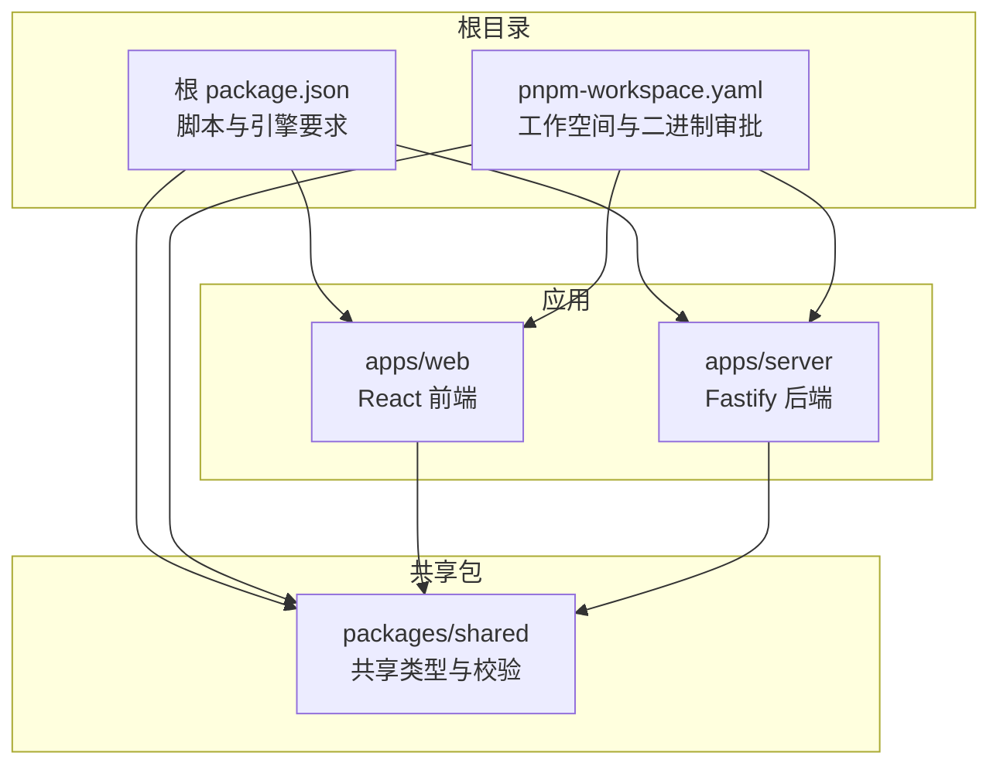
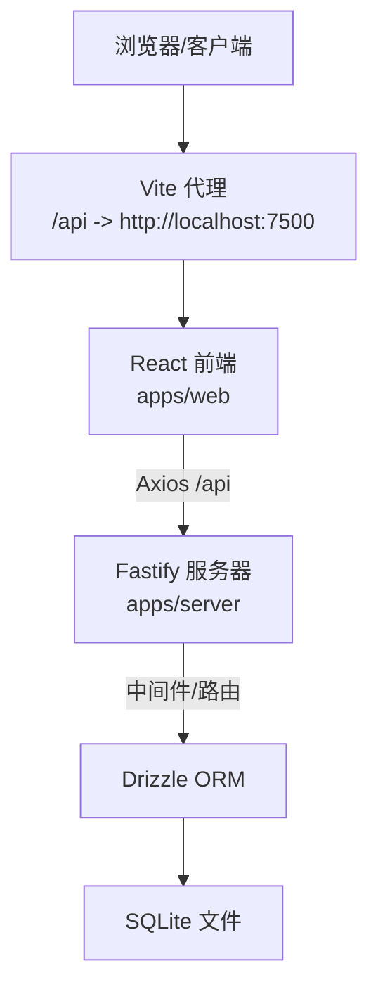
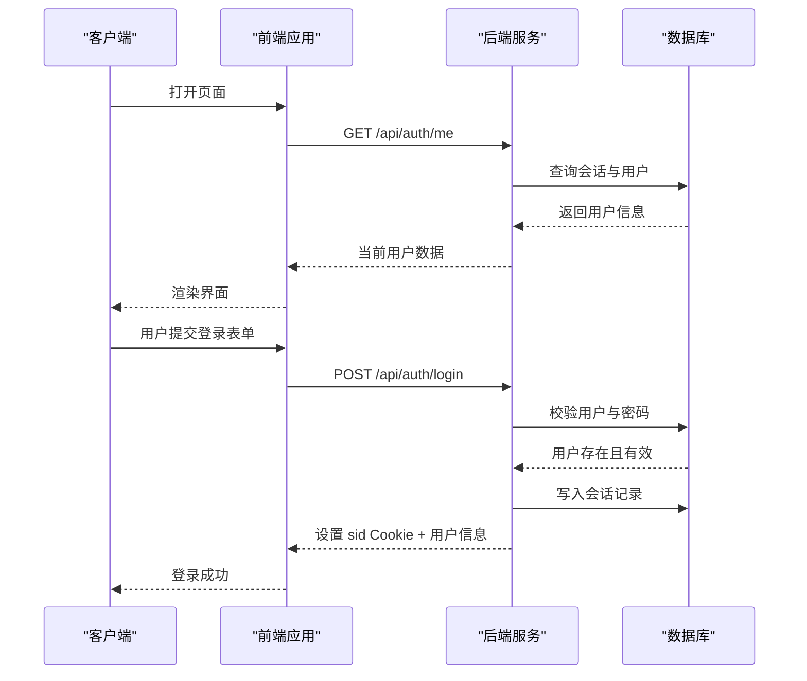
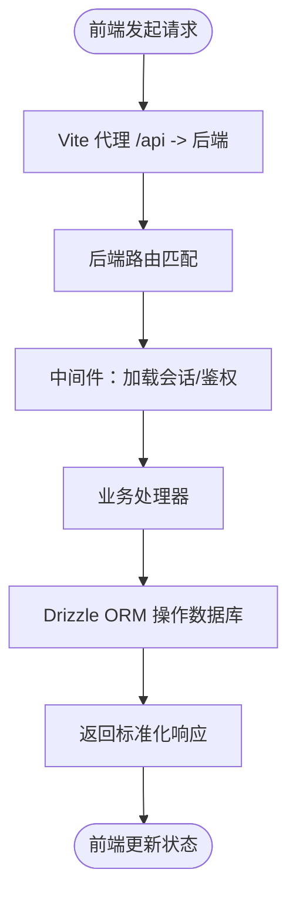
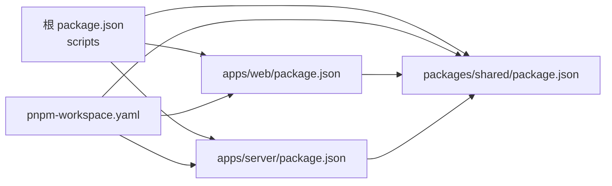
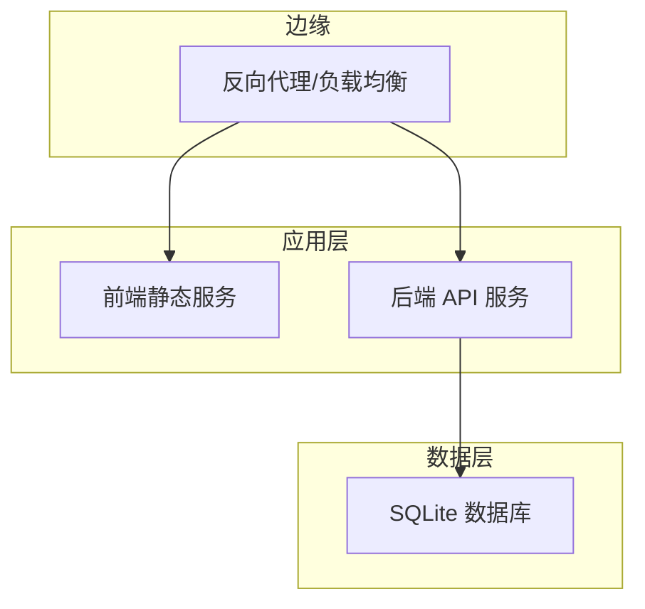

# 架构设计

<cite>
**本文引用的文件**
- [package.json](file://package.json)
- [pnpm-workspace.yaml](file://pnpm-workspace.yaml)
- [apps/server/package.json](file://apps/server/package.json)
- [apps/web/package.json](file://apps/web/package.json)
- [packages/shared/package.json](file://packages/shared/package.json)
- [apps/server/src/index.ts](file://apps/server/src/index.ts)
- [apps/server/src/db/schema.ts](file://apps/server/src/db/schema.ts)
- [apps/server/drizzle.config.ts](file://apps/server/drizzle.config.ts)
- [apps/server/src/db/migrate.ts](file://apps/server/src/db/migrate.ts)
- [apps/server/src/middleware/auth.ts](file://apps/server/src/middleware/auth.ts)
- [apps/server/src/routes/auth.ts](file://apps/server/src/routes/auth.ts)
- [apps/web/src/App.tsx](file://apps/web/src/App.tsx)
- [apps/web/vite.config.ts](file://apps/web/vite.config.ts)
- [apps/web/src/lib/api.ts](file://apps/web/src/lib/api.ts)
- [apps/web/src/lib/auth.tsx](file://apps/web/src/lib/auth.tsx)
</cite>

## 目录
1. [引言](#引言)
2. [项目结构](#项目结构)
3. [核心组件](#核心组件)
4. [架构总览](#架构总览)
5. [详细组件分析](#详细组件分析)
6. [依赖关系分析](#依赖关系分析)
7. [性能考量](#性能考量)
8. [故障排查指南](#故障排查指南)
9. [结论](#结论)
10. [附录](#附录)

## 引言
本文件为 ZBH2 平台的架构设计文档，面向技术与非技术读者，系统阐述平台的整体分层架构（表现层、业务逻辑层、数据访问层）、Monorepo 组织方式与 pnpm 工作空间配置、前后端分离设计理念与 API 通信机制、中间件模式在认证与会话管理中的应用、数据库架构与 Drizzle ORM 的使用、系统边界与组件交互、部署拓扑、技术决策权衡与约束、以及可扩展性与性能优化策略。

## 项目结构
ZBH2 采用 Monorepo 架构，通过 pnpm 工作空间统一管理多个包与应用：
- apps/server：后端服务，基于 Fastify，提供 REST API、静态资源托管、会话与认证、数据库迁移与种子数据等能力。
- apps/web：前端应用，基于 React + Vite，通过代理将 /api 请求转发至后端服务。
- packages/shared：共享包，提供类型与校验模型（如 Zod），供前后端复用。
- 根目录脚本与工作空间配置：统一开发、构建与数据库操作命令，并声明工作空间与二进制依赖审批。

图表来源
- [package.json:1-20](file://package.json#L1-L20)
- [pnpm-workspace.yaml:1-5](file://pnpm-workspace.yaml#L1-L5)
- [apps/web/package.json:1-29](file://apps/web/package.json#L1-L29)
- [apps/server/package.json:1-37](file://apps/server/package.json#L1-L37)
- [packages/shared/package.json:1-24](file://packages/shared/package.json#L1-L24)

章节来源
- [package.json:1-20](file://package.json#L1-L20)
- [pnpm-workspace.yaml:1-5](file://pnpm-workspace.yaml#L1-L5)

## 核心组件
- 表现层（Web 应用）
  - 路由与页面：集中于 React 路由，区分门户与管理后台布局与页面集合。
  - API 客户端：Axios 实例，统一基础路径与凭据传递；拦截器处理响应异常。
  - 认证上下文：全局状态管理用户登录态，支持登录、登出与刷新。
  - 开发代理：Vite 本地代理将 /api 请求转发到后端服务端口。
- 业务逻辑层（Server 应用）
  - 中间件：加载会话、鉴权与管理员权限控制。
  - 路由模块：按功能域拆分（认证、公共、管理、上传、激活码、工单、资产、SaaS、报表、AI FAQ、监控）。
  - 安全与防护：Helmet、CORS、Cookie、限流、静态文件服务。
- 数据访问层（Server 应用）
  - Drizzle ORM：SQLite 模式定义、迁移与种子数据。
  - 数据库初始化：WAL 模式、外键启用、迁移执行。

章节来源
- [apps/web/src/App.tsx:1-80](file://apps/web/src/App.tsx#L1-L80)
- [apps/web/src/lib/api.ts:1-16](file://apps/web/src/lib/api.ts#L1-L16)
- [apps/web/src/lib/auth.tsx:1-55](file://apps/web/src/lib/auth.tsx#L1-L55)
- [apps/web/vite.config.ts:1-13](file://apps/web/vite.config.ts#L1-L13)
- [apps/server/src/index.ts:1-60](file://apps/server/src/index.ts#L1-L60)
- [apps/server/src/middleware/auth.ts:1-56](file://apps/server/src/middleware/auth.ts#L1-L56)
- [apps/server/src/routes/auth.ts:1-51](file://apps/server/src/routes/auth.ts#L1-L51)
- [apps/server/src/db/schema.ts:1-330](file://apps/server/src/db/schema.ts#L1-L330)
- [apps/server/drizzle.config.ts:1-11](file://apps/server/drizzle.config.ts#L1-L11)
- [apps/server/src/db/migrate.ts:1-18](file://apps/server/src/db/migrate.ts#L1-L18)

## 架构总览
ZBH2 采用前后端分离的三层架构：
- 表现层：Web 应用负责用户界面与交互，通过 Axios 发起 API 请求。
- 业务逻辑层：Server 应用作为 API 提供者，集中处理业务规则、安全与中间件。
- 数据访问层：Drizzle ORM 驱动 SQLite，提供强类型的数据模型与迁移工具链。

图表来源
- [apps/web/vite.config.ts:6-11](file://apps/web/vite.config.ts#L6-L11)
- [apps/web/src/lib/api.ts:3](file://apps/web/src/lib/api.ts#L3)
- [apps/server/src/index.ts:27-54](file://apps/server/src/index.ts#L27-L54)
- [apps/server/src/db/schema.ts:1-330](file://apps/server/src/db/schema.ts#L1-L330)

## 详细组件分析

### 认证与会话管理（中间件模式）
- 会话加载中间件：在每个请求前从 Cookie 读取 sid，查询有效且未过期的会话，关联用户并注入到请求对象。
- 权限控制：提供 requireAuth 与 requireAdmin 中间件，分别用于登录态校验与管理员权限校验。
- 登录流程：参数校验、用户查找与状态检查、密码验证、生成会话 ID、写入会话记录、设置 Cookie。
- 登出流程：删除会话记录并清除 Cookie。
- 前端集成：全局认证上下文在应用启动时调用“获取当前用户”接口刷新登录态；登录/登出通过 API 完成。

图表来源
- [apps/server/src/middleware/auth.ts:17-40](file://apps/server/src/middleware/auth.ts#L17-L40)
- [apps/server/src/routes/auth.ts:9-33](file://apps/server/src/routes/auth.ts#L9-L33)
- [apps/web/src/lib/auth.tsx:24-45](file://apps/web/src/lib/auth.tsx#L24-L45)
- [apps/web/src/lib/api.ts:3](file://apps/web/src/lib/api.ts#L3)

章节来源
- [apps/server/src/middleware/auth.ts:1-56](file://apps/server/src/middleware/auth.ts#L1-L56)
- [apps/server/src/routes/auth.ts:1-51](file://apps/server/src/routes/auth.ts#L1-L51)
- [apps/web/src/lib/auth.tsx:1-55](file://apps/web/src/lib/auth.tsx#L1-L55)
- [apps/web/src/lib/api.ts:1-16](file://apps/web/src/lib/api.ts#L1-L16)

### 数据库架构与 Drizzle ORM 使用
- 数据模型：以 SQLite 为核心，涵盖用户与会话、软件与帮助、激活产品与代码、工单与回复、数字资产与审批、SaaS 服务与账户、AI FAQ、运维监控目标/指标/阈值/告警/报表/平台与审计日志等。
- 迁移与配置：通过 drizzle.config.ts 指定 schema 位置、输出目录、方言与数据库连接；迁移脚本确保 WAL 模式与外键开启，并执行迁移目录下的变更。
- 种子数据：提供种子脚本入口，便于开发环境快速填充示例数据。

```mermaid
erDiagram
USERS {
int id PK
string username UK
string password_hash
string role
string status
datetime created_at
}
SESSIONS {
string id PK
int user_id FK
datetime expires_at
datetime created_at
}
SOFTWARE_CATEGORIES {
int id PK
string name
int sort
datetime created_at
}
SOFTWARE_ITEMS {
int id PK
string title
string description
int category_id FK
string version
int file_id FK
int icon_file_id FK
int sort
string status
datetime created_at
datetime updated_at
}
FILES {
int id PK
string original_name
string storage_path
string mime
int size
string hash
int uploader_id FK
datetime created_at
}
HELP_CATEGORIES {
int id PK
string name
int sort
datetime created_at
}
HELP_DOCUMENTS {
int id PK
string title
text body
int category_id FK
int sort
string status
datetime published_at
datetime archived_at
datetime created_at
datetime updated_at
}
ACTIVATION_PRODUCTS {
int id PK
string code UK
string name
string description
string client_download_url
int client_file_id FK
datetime created_at
}
ACTIVATION_CODES {
int id PK
int product_id FK
string code6
string status
string batch_id
datetime created_at
}
ACTIVATION_CODE_GRANTS {
int id PK
int code_id FK
int user_id FK
int product_id FK
datetime granted_at
}
TICKETS {
int id PK
string title
text description
string type
string priority
string status
int submitter_id FK
int assignee_id FK
datetime created_at
datetime updated_at
datetime resolved_at
}
TICKET_REPLIES {
int id PK
int ticket_id FK
int user_id FK
text content
datetime created_at
}
ASSET_CATEGORIES {
int id PK
string name
int sort
datetime created_at
}
ASSETS {
int id PK
string asset_code UK
string name
int category_id FK
string brand
string model
string serial_number
string status
int assignee_id FK
datetime purchase_date
int purchase_price
datetime warranty_expiry
string location
string notes
datetime created_at
datetime updated_at
}
ASSET_RECORDS {
int id PK
int asset_id FK
string action
int operator_id FK
int target_user_id FK
text notes
datetime created_at
}
ASSET_APPROVALS {
int id PK
int asset_id FK
string type
int requester_id FK
int approver_id FK
string status
string reason
string comment
datetime created_at
datetime updated_at
}
SAAS_SERVICES {
int id PK
string name
string code UK
string description
string status
datetime created_at
}
SAAS_PLANS {
int id PK
int service_id FK
string name
string description
int max_users
int price
int sort
datetime created_at
}
SAAS_ACCOUNTS {
int id PK
int service_id FK
int plan_id FK
int user_id FK
string account_name
string account_password
string status
datetime expires_at
datetime created_at
datetime updated_at
}
FAQ_ENTRIES {
int id PK
string question
text answer
string keywords
string category
int sort
datetime created_at
}
MONITOR_TARGETS {
int id PK
string name
string type
string host
int port
text description
string status
text config
datetime created_at
datetime updated_at
}
MONITOR_ITEMS {
int id PK
int target_id FK
string name
string key
string unit
string collect_method
int collect_interval
int enabled
datetime created_at
datetime updated_at
}
MONITOR_THRESHOLDS {
int id PK
int item_id FK
string level
string operator
float value
int duration
string action
text notify_message
int enabled
datetime created_at
datetime updated_at
}
MONITOR_RECORDS {
int id PK
int item_id FK
float value
string status
datetime collected_at
}
MONITOR_ALERTS {
int id PK
int item_id FK
int threshold_id FK
string level
float value
text message
string status
int acknowledged_by FK
datetime acknowledged_at
int resolved_by FK
datetime resolved_at
datetime created_at
}
MONITOR_REPORT_TEMPLATES {
int id PK
string name
text description
text config
int created_by FK
datetime created_at
datetime updated_at
}
MONITOR_REPORTS {
int id PK
string title
string type
datetime start_time
datetime end_time
text content
int template_id FK
int created_by FK
datetime created_at
}
AUDIT_LOGS {
int id PK
int user_id FK
string username
string action
string target_type
string target_id
string target_name
text detail
string ip_address
text user_agent
string result
datetime created_at
}
MONITOR_PLATFORMS {
int id PK
string name
string type
string endpoint
string api_key
string secret
text sync_config
string status
datetime last_sync_at
text description
datetime created_at
datetime updated_at
}
USERS ||--o{ SESSIONS : "拥有"
SOFTWARE_CATEGORIES ||--o{ SOFTWARE_ITEMS : "包含"
FILES ||--o{ SOFTWARE_ITEMS : "被引用"
HELP_CATEGORIES ||--o{ HELP_DOCUMENTS : "包含"
ACTIVATION_PRODUCTS ||--o{ ACTIVATION_CODES : "生成"
ACTIVATION_CODES ||--o{ ACTIVATION_CODE_GRANTS : "授权"
USERS ||--o{ TICKETS : "提交/指派"
TICKETS ||--o{ TICKET_REPLIES : "回复"
ASSET_CATEGORIES ||--o{ ASSETS : "分类"
USERS ||--o{ ASSETS : "经手"
ASSETS ||--o{ ASSET_RECORDS : "产生记录"
ASSETS ||--o{ ASSET_APPROVALS : "申请"
SAAS_SERVICES ||--o{ SAAS_PLANS : "提供"
SAAS_PLANS ||--o{ SAAS_ACCOUNTS : "绑定"
USERS ||--o{ AUDIT_LOGS : "产生"
MONITOR_TARGETS ||--o{ MONITOR_ITEMS : "包含"
MONITOR_ITEMS ||--o{ MONITOR_THRESHOLDS : "设定阈值"
MONITOR_ITEMS ||--o{ MONITOR_RECORDS : "采集"
MONITOR_ITEMS ||--o{ MONITOR_ALERTS : "触发告警"
MONITOR_REPORT_TEMPLATES ||--o{ MONITOR_REPORTS : "生成报告"
USERS ||--o{ MONITOR_REPORTS : "创建"
USERS ||--o{ MONITOR_PLATFORMS : "管理"
```

图表来源
- [apps/server/src/db/schema.ts:3-330](file://apps/server/src/db/schema.ts#L3-L330)

章节来源
- [apps/server/src/db/schema.ts:1-330](file://apps/server/src/db/schema.ts#L1-L330)
- [apps/server/drizzle.config.ts:1-11](file://apps/server/drizzle.config.ts#L1-L11)
- [apps/server/src/db/migrate.ts:1-18](file://apps/server/src/db/migrate.ts#L1-L18)

### API 通信机制与数据流向
- 前端通过 Axios 实例发起 /api 前缀请求，本地开发时由 Vite 代理转发至后端服务。
- 后端注册多路由模块，统一在请求进入前加载会话，再根据路由进行业务处理。
- 认证相关接口返回标准化结构，前端据此更新全局登录态。

图表来源
- [apps/web/vite.config.ts:8-10](file://apps/web/vite.config.ts#L8-L10)
- [apps/web/src/lib/api.ts:3](file://apps/web/src/lib/api.ts#L3)
- [apps/server/src/index.ts:37-49](file://apps/server/src/index.ts#L37-L49)
- [apps/server/src/middleware/auth.ts:17-40](file://apps/server/src/middleware/auth.ts#L17-L40)

章节来源
- [apps/web/vite.config.ts:1-13](file://apps/web/vite.config.ts#L1-L13)
- [apps/web/src/lib/api.ts:1-16](file://apps/web/src/lib/api.ts#L1-L16)
- [apps/server/src/index.ts:1-60](file://apps/server/src/index.ts#L1-L60)

### 系统边界与组件交互
- 边界
  - 前端边界：仅通过 /api 与后端通信，不直接访问数据库。
  - 后端边界：暴露 REST 接口，内部通过 Drizzle 访问 SQLite。
  - 共享边界：packages/shared 提供跨端类型与校验模型。
- 交互
  - 认证：登录成功后后端写入会话并设置 Cookie，后续请求携带 sid 自动加载会话。
  - 文件上传：后端静态服务挂载上传目录，前端上传后通过 API 触发持久化。

章节来源
- [apps/server/src/index.ts:24-35](file://apps/server/src/index.ts#L24-L35)
- [apps/server/src/routes/auth.ts:23-32](file://apps/server/src/routes/auth.ts#L23-L32)
- [apps/web/src/lib/api.ts:3](file://apps/web/src/lib/api.ts#L3)

## 依赖关系分析
- 工作空间与脚本
  - 根脚本统一管理 server 与 web 的开发、构建与数据库任务。
  - pnpm 工作空间声明 apps/* 与 packages/*，并批准特定二进制依赖。
- 包依赖
  - apps/server：Fastify 生态、Drizzle ORM、better-sqlite3、argon2、共享包等。
  - apps/web：React、Ant Design、React Router、Axios、共享包等。
  - packages/shared：Zod 类型与校验模型。

图表来源
- [package.json:4-12](file://package.json#L4-L12)
- [pnpm-workspace.yaml:1-5](file://pnpm-workspace.yaml#L1-L5)
- [apps/server/package.json:14-27](file://apps/server/package.json#L14-L27)
- [apps/web/package.json:11-19](file://apps/web/package.json#L11-L19)
- [packages/shared/package.json:17-19](file://packages/shared/package.json#L17-L19)

章节来源
- [package.json:1-20](file://package.json#L1-L20)
- [pnpm-workspace.yaml:1-5](file://pnpm-workspace.yaml#L1-L5)
- [apps/server/package.json:1-37](file://apps/server/package.json#L1-L37)
- [apps/web/package.json:1-29](file://apps/web/package.json#L1-L29)
- [packages/shared/package.json:1-24](file://packages/shared/package.json#L1-L24)

## 性能考量
- 数据库
  - WAL 模式提升并发读写性能；外键开启保证参照完整性。
  - 迁移脚本集中初始化，避免运行时重复开销。
- 服务端
  - 限流中间件限制请求频率，降低滥用风险。
  - 静态文件服务直接映射上传目录，减少不必要的处理。
- 前端
  - 代理仅在开发阶段使用，生产环境建议由反向代理统一转发。
  - Axios 默认 withCredentials，注意跨域与 Cookie 安全策略。

章节来源
- [apps/server/src/db/migrate.ts:10-12](file://apps/server/src/db/migrate.ts#L10-L12)
- [apps/server/src/index.ts:34-35](file://apps/server/src/index.ts#L34-L35)

## 故障排查指南
- 登录失败
  - 检查用户名是否存在且状态为激活；确认密码哈希验证是否通过。
  - 查看会话写入与 Cookie 设置是否成功。
- 会话无效
  - 确认 sid 是否存在且未过期；核对用户状态是否仍为激活。
- 数据库迁移
  - 确认迁移目录存在且数据库文件可写；查看迁移日志输出。
- 前端无权限跳转
  - 检查认证上下文是否正确刷新；确认后端中间件返回的 401/403 状态。

章节来源
- [apps/server/src/routes/auth.ts:15-22](file://apps/server/src/routes/auth.ts#L15-L22)
- [apps/server/src/middleware/auth.ts:20-39](file://apps/server/src/middleware/auth.ts#L20-L39)
- [apps/server/src/db/migrate.ts:14-16](file://apps/server/src/db/migrate.ts#L14-L16)

## 结论
ZBH2 通过清晰的分层架构与 Monorepo 组织，实现了前后端分离与可演进的系统设计。Drizzle ORM 与 SQLite 的组合满足中小规模场景的数据需求，配合中间件模式的认证与会话管理，提供了良好的安全性与可维护性。建议在扩展阶段引入缓存、队列与可观测性组件，以进一步提升性能与稳定性。

## 附录
- 部署拓扑（概念示意）
  - 前端构建产物部署至静态服务器或 CDN；后端服务运行于容器或裸机；数据库文件位于持久化存储；反向代理统一入口并处理 TLS 与跨域。

[此图为概念性拓扑，无需图表来源]