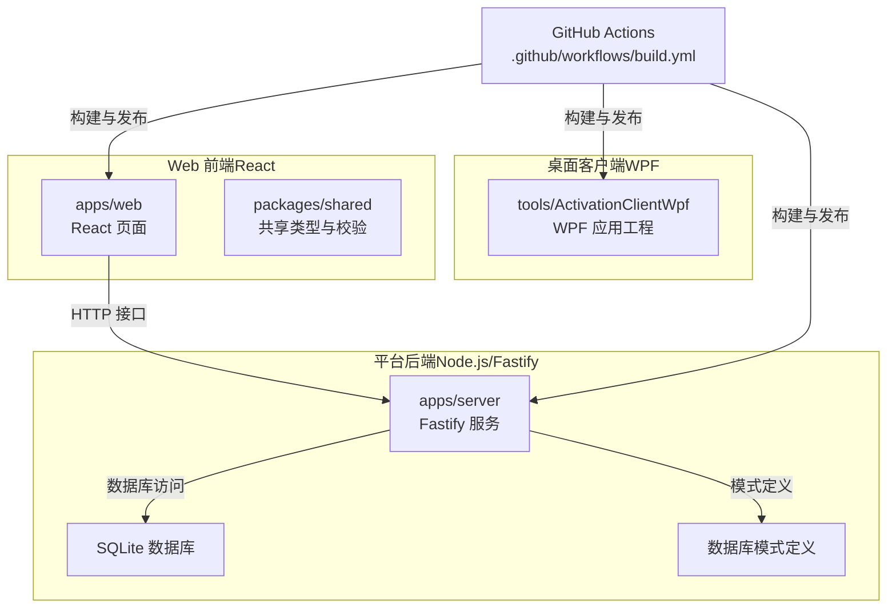
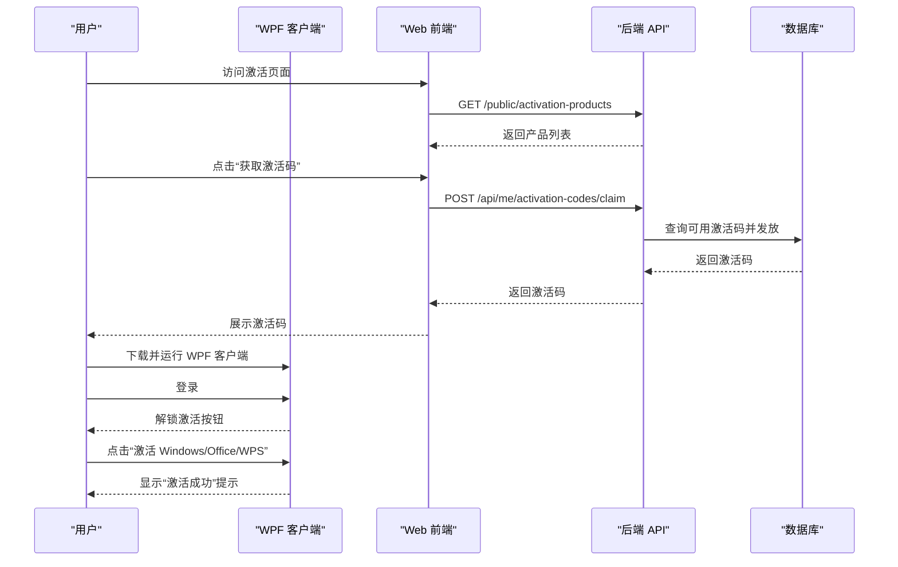
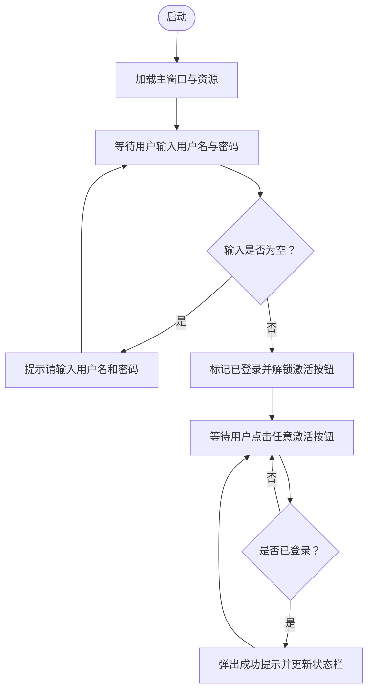
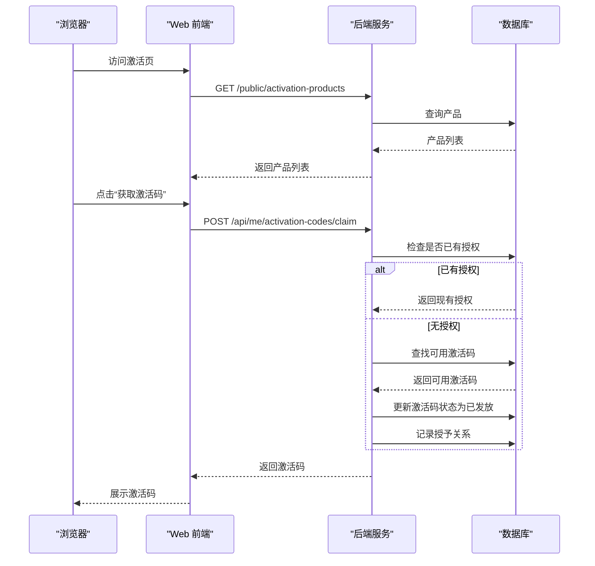
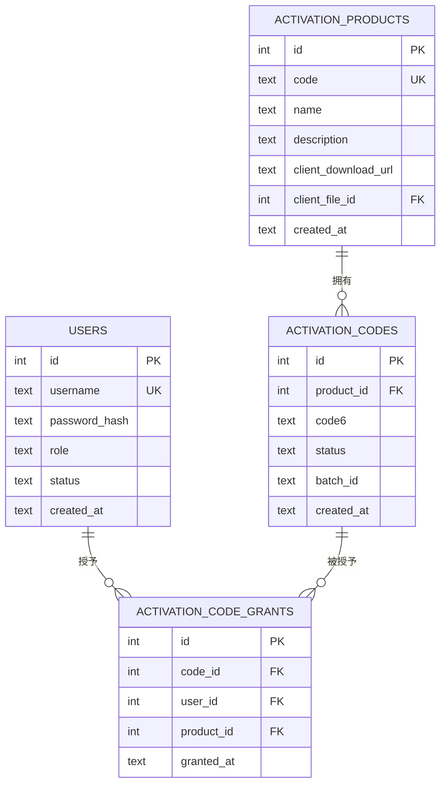
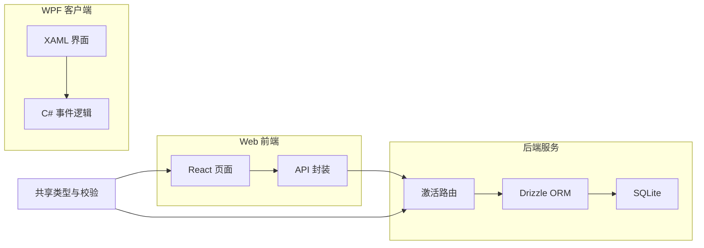

# 激活客户端工具

<cite>
**本文引用的文件**
- [README.md](file://tools/ActivationClientWpf/README.md)
- [App.xaml](file://tools/ActivationClientWpf/App.xaml)
- [App.xaml.cs](file://tools/ActivationClientWpf/App.xaml.cs)
- [MainWindow.xaml](file://tools/ActivationClientWpf/MainWindow.xaml)
- [MainWindow.xaml.cs](file://tools/ActivationClientWpf/MainWindow.xaml.cs)
- [ActivationClientDemo.csproj](file://tools/ActivationClientWpf/ActivationClientDemo.csproj)
- [app.manifest](file://tools/ActivationClientWpf/app.manifest)
- [activation.ts](file://apps/server/src/routes/activation.ts)
- [schema.ts](file://apps/server/src/db/schema.ts)
- [types.ts](file://packages/shared/src/types.ts)
- [schemas.ts](file://packages/shared/src/schemas.ts)
- [Activation.tsx](file://apps/web/src/pages/Activation.tsx)
- [build.yml](file://.github/workflows/build.yml)
- [package.json（服务端）](file://apps/server/package.json)
- [package.json（Web端）](file://apps/web/package.json)
</cite>

## 目录
1. [简介](#简介)
2. [项目结构](#项目结构)
3. [核心组件](#核心组件)
4. [架构总览](#架构总览)
5. [详细组件分析](#详细组件分析)
6. [依赖关系分析](#依赖关系分析)
7. [性能考虑](#性能考虑)
8. [故障排除指南](#故障排除指南)
9. [结论](#结论)
10. [附录](#附录)

## 简介
本项目提供一个面向 Windows 10/11 的 WPF 激活客户端演示程序，用于模拟“先登录再激活”的流程。该客户端不执行真实的系统激活（例如不调用 slmgr/ospp），也不进行联网校验，仅通过界面反馈“激活成功”。它与平台后端配合使用：用户通过 Web 端领取激活码，随后下载并使用本 WPF 客户端进行模拟激活。

该工具的设计目标是：
- 提供直观的图形界面，支持用户登录与产品激活操作
- 与平台后端的激活码发放与查询接口对接
- 支持 CI 自动发布，生成自包含的 Windows 可执行包

## 项目结构
本仓库采用多包工作区结构，激活客户端位于 tools/ActivationClientWpf，平台后端位于 apps/server，Web 前端位于 apps/web，共享类型定义位于 packages/shared。

图表来源
- [build.yml:53-87](file://.github/workflows/build.yml#L53-L87)
- [ActivationClientDemo.csproj:1-15](file://tools/ActivationClientWpf/ActivationClientDemo.csproj#L1-L15)
- [package.json（服务端）:1-37](file://apps/server/package.json#L1-L37)
- [package.json（Web端）:1-29](file://apps/web/package.json#L1-L29)

章节来源
- [README.md:1-35](file://tools/ActivationClientWpf/README.md#L1-L35)
- [build.yml:1-87](file://.github/workflows/build.yml#L1-L87)

## 核心组件
- WPF 桌面应用：负责用户交互与本地反馈，包含登录与三类产品的“激活”按钮。
- Web 平台：提供激活产品列表、激活码领取、以及激活客户端下载链接。
- 后端服务：提供激活码发放、查询等 API，维护激活产品与激活码的数据模型。
- 共享包：提供统一的响应结构与输入校验 Schema。

章节来源
- [MainWindow.xaml:1-60](file://tools/ActivationClientWpf/MainWindow.xaml#L1-L60)
- [MainWindow.xaml.cs:1-66](file://tools/ActivationClientWpf/MainWindow.xaml.cs#L1-L66)
- [Activation.tsx:1-98](file://apps/web/src/pages/Activation.tsx#L1-L98)
- [activation.ts:1-95](file://apps/server/src/routes/activation.ts#L1-L95)
- [schema.ts:71-96](file://apps/server/src/db/schema.ts#L71-L96)
- [types.ts:1-18](file://packages/shared/src/types.ts#L1-L18)
- [schemas.ts:41-51](file://packages/shared/src/schemas.ts#L41-L51)

## 架构总览
下图展示了从用户操作到后端处理与前端展示的整体流程：

图表来源
- [Activation.tsx:35-46](file://apps/web/src/pages/Activation.tsx#L35-L46)
- [activation.ts:8-75](file://apps/server/src/routes/activation.ts#L8-L75)
- [schema.ts:71-96](file://apps/server/src/db/schema.ts#L71-L96)

## 详细组件分析

### WPF 客户端界面与交互
- 登录区域：输入用户名与密码，校验非空后解锁激活按钮，禁用输入框并更新提示信息。
- 产品激活区域：包含“激活 Windows”“激活 Microsoft Office”“激活 WPS”三个按钮，均需登录后可用。
- 成功反馈：点击任一激活按钮后弹出信息框，显示模拟成功的提示文本，并在状态栏记录时间戳与结果。

图表来源
- [MainWindow.xaml.cs:14-64](file://tools/ActivationClientWpf/MainWindow.xaml.cs#L14-L64)
- [MainWindow.xaml:23-55](file://tools/ActivationClientWpf/MainWindow.xaml#L23-L55)

章节来源
- [MainWindow.xaml:1-60](file://tools/ActivationClientWpf/MainWindow.xaml#L1-L60)
- [MainWindow.xaml.cs:1-66](file://tools/ActivationClientWpf/MainWindow.xaml.cs#L1-L66)
- [App.xaml:1-25](file://tools/ActivationClientWpf/App.xaml#L1-L25)
- [App.xaml.cs:1-8](file://tools/ActivationClientWpf/App.xaml.cs#L1-L8)
- [ActivationClientDemo.csproj:1-15](file://tools/ActivationClientWpf/ActivationClientDemo.csproj#L1-L15)
- [app.manifest:1-16](file://tools/ActivationClientWpf/app.manifest#L1-L16)

### Web 平台与激活码发放流程
- 产品列表：GET /public/activation-products 返回可激活的产品清单，包含名称、描述与客户端下载地址。
- 领取激活码：POST /api/me/activation-codes/claim 需要登录态，按幂等策略检查是否已有激活授权，若无则分配一个可用的 6 位激活码并记录授予关系。
- 查询我的激活码：GET /api/me/activation-codes 返回当前用户已领取的激活码明细。

图表来源
- [Activation.tsx:31-46](file://apps/web/src/pages/Activation.tsx#L31-L46)
- [activation.ts:8-75](file://apps/server/src/routes/activation.ts#L8-L75)
- [schema.ts:71-96](file://apps/server/src/db/schema.ts#L71-L96)

章节来源
- [Activation.tsx:1-98](file://apps/web/src/pages/Activation.tsx#L1-L98)
- [activation.ts:1-95](file://apps/server/src/routes/activation.ts#L1-L95)
- [schema.ts:71-96](file://apps/server/src/db/schema.ts#L71-L96)

### 数据模型与安全校验
- 数据模型：activationProducts、activationCodes、activationCodeGrants 三张表分别存储产品、激活码与发放记录，使用 SQLite 存储。
- 输入校验：使用 Zod 对登录、创建用户、激活产品、激活码领取等请求体进行严格校验。
- 响应结构：统一的 ApiResponse 与分页响应结构，便于前后端一致处理。

图表来源
- [schema.ts:71-96](file://apps/server/src/db/schema.ts#L71-L96)
- [schemas.ts:41-51](file://packages/shared/src/schemas.ts#L41-L51)
- [types.ts:6-10](file://packages/shared/src/types.ts#L6-L10)

章节来源
- [schema.ts:1-330](file://apps/server/src/db/schema.ts#L1-L330)
- [schemas.ts:1-51](file://packages/shared/src/schemas.ts#L1-L51)
- [types.ts:1-18](file://packages/shared/src/types.ts#L1-L18)

## 依赖关系分析
- WPF 客户端依赖 .NET 8（Windows 平台）、WPF UI 框架与应用清单以启用 DPI 适配。
- Web 前端依赖 React、Ant Design、路由与 API 封装，通过共享包与后端保持一致的类型与校验。
- 后端服务依赖 Fastify、Drizzle ORM、Better-SQLite3、Zod 校验与 Helmet/CORS 等中间件。
- CI 使用 GitHub Actions 在 Windows Runner 上发布 WPF 客户端，在 Ubuntu Runner 上构建 Web 与服务端。

图表来源
- [ActivationClientDemo.csproj:1-15](file://tools/ActivationClientWpf/ActivationClientDemo.csproj#L1-L15)
- [package.json（Web端）:11-20](file://apps/web/package.json#L11-L20)
- [package.json（服务端）:14-28](file://apps/server/package.json#L14-L28)
- [build.yml:53-87](file://.github/workflows/build.yml#L53-L87)

章节来源
- [ActivationClientDemo.csproj:1-15](file://tools/ActivationClientWpf/ActivationClientDemo.csproj#L1-L15)
- [package.json（Web端）:1-29](file://apps/web/package.json#L1-L29)
- [package.json（服务端）:1-37](file://apps/server/package.json#L1-L37)
- [build.yml:1-87](file://.github/workflows/build.yml#L1-L87)

## 性能考虑
- WPF 客户端为轻量级 UI 交互，性能瓶颈主要在于 UI 响应与消息提示，无需额外优化。
- Web 前端与后端 API 的性能取决于数据库查询与网络延迟，建议：
  - 对激活码查询与发放路径使用索引与幂等逻辑，避免重复发放。
  - 合理设置缓存与限流策略，防止突发流量导致数据库压力过大。
- CI 发布采用自包含发布（Self-contained），可减少运行时依赖，提升部署一致性。

## 故障排除指南
- 无法在 macOS/Linux 编译 WPF
  - 现象：尝试在非 Windows 平台编译报错。
  - 原因：WPF 仅支持 Windows 平台。
  - 处理：在 Windows 上使用 .NET 8 SDK 进行构建与运行。
  - 参考：[README.md:10-10](file://tools/ActivationClientWpf/README.md#L10-L10)

- 登录失败或按钮不可用
  - 现象：输入用户名与密码后激活按钮仍不可用。
  - 原因：输入为空或未正确触发登录逻辑。
  - 处理：确保用户名与密码均非空，重新点击登录按钮。
  - 参考：[MainWindow.xaml.cs:19-34](file://tools/ActivationClientWpf/MainWindow.xaml.cs#L19-L34)

- 激活按钮点击无效
  - 现象：点击激活按钮无反应。
  - 原因：未登录状态下点击。
  - 处理：先完成登录，再点击激活按钮。
  - 参考：[MainWindow.xaml.cs:36-58](file://tools/ActivationClientWpf/MainWindow.xaml.cs#L36-L58)

- 无法获取激活码
  - 现象：点击“获取激活码”后提示失败或无可用激活码。
  - 原因：后端无可用激活码或用户已领取过。
  - 处理：联系管理员确认激活码库存，或检查用户是否已有授权。
  - 参考：[activation.ts:55-57](file://apps/server/src/routes/activation.ts#L55-L57)

- CI 发布产物缺失
  - 现象：发布阶段找不到 publish 输出目录。
  - 原因：构建未完成或路径错误。
  - 处理：确认在 Windows Runner 上执行 dotnet publish，检查输出目录是否存在。
  - 参考：[build.yml:66-79](file://.github/workflows/build.yml#L66-L79)

章节来源
- [README.md:10-10](file://tools/ActivationClientWpf/README.md#L10-L10)
- [MainWindow.xaml.cs:19-34](file://tools/ActivationClientWpf/MainWindow.xaml.cs#L19-L34)
- [activation.ts:55-57](file://apps/server/src/routes/activation.ts#L55-L57)
- [build.yml:66-79](file://.github/workflows/build.yml#L66-L79)

## 结论
本 WPF 激活客户端以最小实现满足“先登录再激活”的演示需求，不涉及真实系统激活与联网校验，适合用于培训、演示与二次开发。其与平台后端的集成通过标准 HTTP 接口完成，具备清晰的激活码发放与查询流程。结合 CI 自动发布，可快速产出跨平台部署所需的自包含可执行包。

## 附录

### 编译与部署说明
- 本地调试
  - 进入 tools/ActivationClientWpf 目录，执行还原、构建与运行命令。
  - 参考：[README.md:14-19](file://tools/ActivationClientWpf/README.md#L14-L19)

- 发布（自包含，win-x64）
  - 在 Release 配置下进行自包含发布，输出位于 bin/Release/net8.0-windows/win-x64/publish。
  - CI 会将发布目录打包为 ActivationClientDemo-win-x64.zip。
  - 参考：[README.md:21-31](file://tools/ActivationClientWpf/README.md#L21-L31)，[build.yml:66-85](file://.github/workflows/build.yml#L66-L85)

- 依赖安装与构建配置
  - WPF 工程：.NET 8 SDK、WPF 支持、Windows 平台 x64。
  - Web 与服务端：使用 pnpm 管理依赖，分别构建 Web 与服务端产物。
  - 参考：[ActivationClientDemo.csproj:1-15](file://tools/ActivationClientWpf/ActivationClientDemo.csproj#L1-L15)，[package.json（Web端）:1-29](file://apps/web/package.json#L1-L29)，[package.json（服务端）:1-37](file://apps/server/package.json#L1-L37)

### 安全特性
- 当前版本不进行真实系统激活与联网校验，不涉及证书验证与通信加密。
- 若后续接入真实激活流程，建议：
  - 引入 HTTPS 与证书固定（Pinning）以保护 API 通信。
  - 对敏感操作增加二次确认与审计日志。
  - 对激活码发放与使用进行更严格的幂等与防重策略。

### 扩展开发指导
- 新增产品激活类型
  - 在 Web 端页面中添加产品卡片与下载链接。
  - 在 WPF 端新增对应按钮与提示文案。
  - 在后端激活路由中扩展产品映射与发放逻辑。
  - 参考：[Activation.tsx:58-74](file://apps/web/src/pages/Activation.tsx#L58-L74)，[MainWindow.xaml:46-51](file://tools/ActivationClientWpf/MainWindow.xaml#L46-L51)，[activation.ts:7-20](file://apps/server/src/routes/activation.ts#L7-L20)

- 集成真实激活流程
  - 在 WPF 中替换“模拟成功”为真实系统调用（如 slmgr/ospp）与网络校验。
  - 在后端引入 KMS/SLM 服务器对接与状态同步。
  - 加强安全与审计，确保合规性与可追溯性。

### 版本管理与更新机制
- 使用 GitHub Actions 实现自动化构建与发布，产物上传为工件以便下载。
- 建议在后续迭代中引入版本号管理与变更日志，便于追踪更新内容。
- 参考：[build.yml:1-87](file://.github/workflows/build.yml#L1-L87)