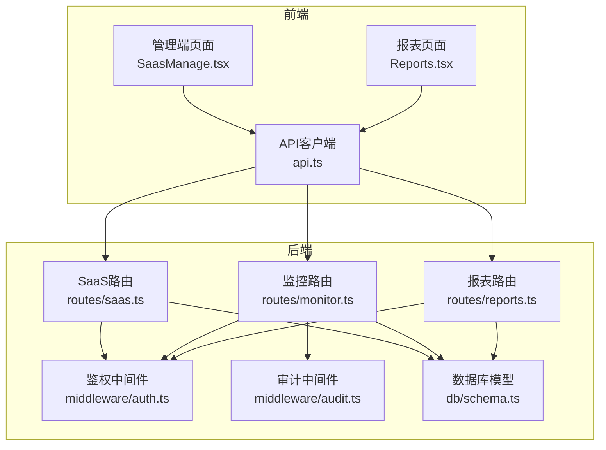
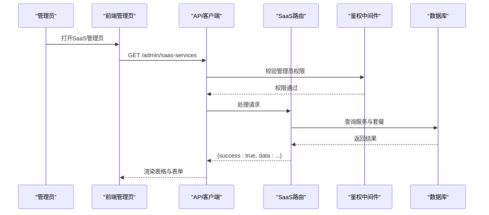
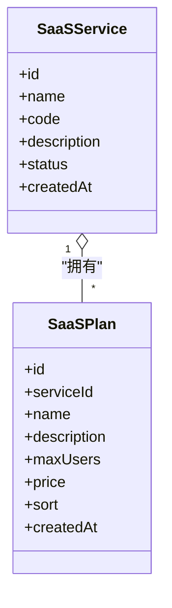
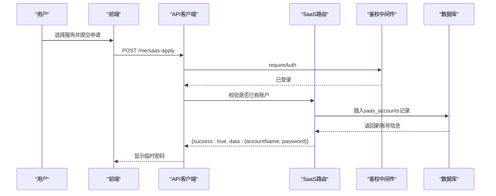
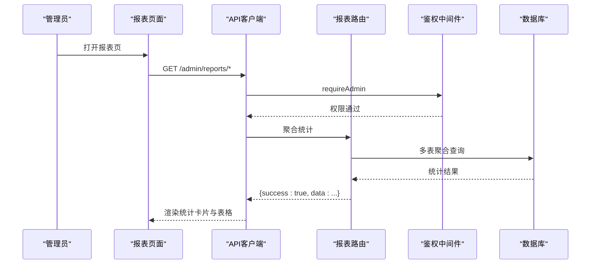
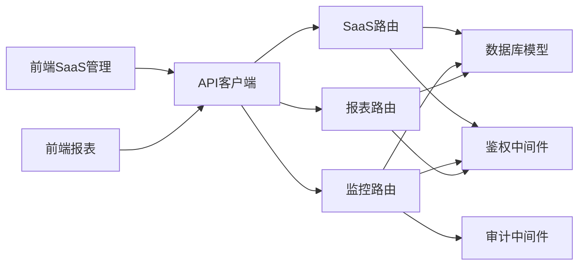

# SaaS管理

<cite>
**本文引用的文件**
- [apps/server/src/routes/saas.ts](file://apps/server/src/routes/saas.ts)
- [apps/server/src/db/schema.ts](file://apps/server/src/db/schema.ts)
- [apps/web/src/pages/admin/SaasManage.tsx](file://apps/web/src/pages/admin/SaasManage.tsx)
- [apps/server/src/middleware/auth.ts](file://apps/server/src/middleware/auth.ts)
- [apps/server/src/middleware/audit.ts](file://apps/server/src/middleware/audit.ts)
- [apps/server/src/routes/monitor.ts](file://apps/server/src/routes/monitor.ts)
- [apps/server/src/routes/reports.ts](file://apps/server/src/routes/reports.ts)
- [apps/web/src/pages/admin/Reports.tsx](file://apps/web/src/pages/admin/Reports.tsx)
- [apps/web/src/lib/api.ts](file://apps/web/src/lib/api.ts)
</cite>

## 目录
1. [简介](#简介)
2. [项目结构](#项目结构)
3. [核心组件](#核心组件)
4. [架构总览](#架构总览)
5. [详细组件分析](#详细组件分析)
6. [依赖关系分析](#依赖关系分析)
7. [性能考量](#性能考量)
8. [故障排查指南](#故障排查指南)
9. [结论](#结论)
10. [附录](#附录)

## 简介
本文件面向SaaS管理功能，围绕服务与套餐配置、客户账户管理、计费集成机制、监控与告警、报表统计以及安全与合规策略进行系统化说明。基于现有代码库，重点覆盖后端路由与数据库模型、前端管理界面与报表展示，帮助读者快速理解当前实现范围与扩展方向。

## 项目结构
后端采用Fastify + Drizzle ORM + SQLite，前端使用React + Ant Design。SaaS相关能力主要分布在以下模块：
- 路由层：SaaS服务与套餐、账户管理、公开服务列表、用户自助申请
- 数据层：SaaS服务、套餐、账户等表结构
- 中间件：鉴权与审计
- 监控与报表：监控指标、阈值、告警、报告与审计日志
- 前端：管理员SaaS管理页面、报表页面

图表来源
- [apps/web/src/pages/admin/SaasManage.tsx:1-169](file://apps/web/src/pages/admin/SaasManage.tsx#L1-L169)
- [apps/web/src/pages/admin/Reports.tsx:1-138](file://apps/web/src/pages/admin/Reports.tsx#L1-L138)
- [apps/web/src/lib/api.ts:1-16](file://apps/web/src/lib/api.ts#L1-L16)
- [apps/server/src/routes/saas.ts:1-160](file://apps/server/src/routes/saas.ts#L1-L160)
- [apps/server/src/routes/monitor.ts:1-595](file://apps/server/src/routes/monitor.ts#L1-L595)
- [apps/server/src/routes/reports.ts:1-146](file://apps/server/src/routes/reports.ts#L1-L146)
- [apps/server/src/middleware/auth.ts:1-56](file://apps/server/src/middleware/auth.ts#L1-L56)
- [apps/server/src/middleware/audit.ts:1-28](file://apps/server/src/middleware/audit.ts#L1-L28)
- [apps/server/src/db/schema.ts:171-203](file://apps/server/src/db/schema.ts#L171-L203)

章节来源
- [apps/server/src/routes/saas.ts:14-160](file://apps/server/src/routes/saas.ts#L14-L160)
- [apps/server/src/db/schema.ts:171-203](file://apps/server/src/db/schema.ts#L171-L203)
- [apps/web/src/pages/admin/SaasManage.tsx:8-169](file://apps/web/src/pages/admin/SaasManage.tsx#L8-L169)

## 核心组件
- SaaS服务与套餐
  - 服务：名称、编码、状态、描述
  - 套餐：所属服务、名称、描述、最大用户数、价格、排序
- SaaS账户
  - 关联用户、服务、可选套餐；包含账号名、密码、状态、过期时间
- 鉴权与审计
  - 登录态校验、管理员权限校验、操作审计日志
- 监控与告警
  - 监控目标、监控项、阈值、记录、告警、报告、平台接入、审计日志
- 报表
  - 软件资产、激活码使用、数字资产、综合导出

章节来源
- [apps/server/src/db/schema.ts:171-203](file://apps/server/src/db/schema.ts#L171-L203)
- [apps/server/src/middleware/auth.ts:17-55](file://apps/server/src/middleware/auth.ts#L17-L55)
- [apps/server/src/middleware/audit.ts:3-27](file://apps/server/src/middleware/audit.ts#L3-L27)

## 架构总览
SaaS管理采用前后端分离：
- 前端通过统一API客户端发起请求，后端路由根据鉴权中间件决定是否放行
- 数据持久化依赖SQLite与Drizzle ORM，所有写操作均通过路由层封装
- 管理员具备最高权限，普通用户仅能访问公开服务与自助申请

图表来源
- [apps/web/src/pages/admin/SaasManage.tsx:20-32](file://apps/web/src/pages/admin/SaasManage.tsx#L20-L32)
- [apps/web/src/lib/api.ts:3-13](file://apps/web/src/lib/api.ts#L3-L13)
- [apps/server/src/routes/saas.ts:16-24](file://apps/server/src/routes/saas.ts#L16-L24)
- [apps/server/src/middleware/auth.ts:48-55](file://apps/server/src/middleware/auth.ts#L48-L55)

## 详细组件分析

### SaaS服务与套餐配置
- 服务管理
  - 列表查询、新增、更新（含状态切换）
  - 每个服务关联多个套餐，按排序字段展示
- 套餐管理
  - 新增、更新、删除
  - 字段包含最大用户数与价格，用于后续计费策略设计

图表来源
- [apps/server/src/db/schema.ts:171-190](file://apps/server/src/db/schema.ts#L171-L190)

章节来源
- [apps/server/src/routes/saas.ts:16-43](file://apps/server/src/routes/saas.ts#L16-L43)
- [apps/server/src/routes/saas.ts:46-71](file://apps/server/src/routes/saas.ts#L46-L71)
- [apps/web/src/pages/admin/SaasManage.tsx:77-104](file://apps/web/src/pages/admin/SaasManage.tsx#L77-L104)

### 客户账户管理
- 管理员视角
  - 查看所有账户（关联用户与服务）、手动开通账号（自动生成密码）、重置密码、启用/禁用
- 用户视角
  - 查询公开服务、自助申请服务账号（同一用户对同一服务仅允许一个有效账户）

图表来源
- [apps/server/src/routes/saas.ts:132-146](file://apps/server/src/routes/saas.ts#L132-L146)
- [apps/server/src/middleware/auth.ts:42-46](file://apps/server/src/middleware/auth.ts#L42-L46)

章节来源
- [apps/server/src/routes/saas.ts:74-120](file://apps/server/src/routes/saas.ts#L74-L120)
- [apps/server/src/routes/saas.ts:148-158](file://apps/server/src/routes/saas.ts#L148-L158)
- [apps/web/src/pages/admin/SaasManage.tsx:107-131](file://apps/web/src/pages/admin/SaasManage.tsx#L107-L131)

### 计费集成机制
- 当前实现
  - 套餐包含价格字段，支持以“分”为最小单位
  - 账户状态包含待激活、启用、禁用、过期
- 可扩展点
  - 引入账单与支付流水表，结合定时任务或Webhook实现自动扣费与到期处理
  - 在账户过期时触发续费提醒与暂停服务逻辑
- 注意事项
  - 价格策略与到期管理需与支付网关对接，建议引入幂等性与重试机制

章节来源
- [apps/server/src/db/schema.ts:181-190](file://apps/server/src/db/schema.ts#L181-L190)
- [apps/server/src/db/schema.ts:192-203](file://apps/server/src/db/schema.ts#L192-L203)

### 监控与告警（SaaS相关）
- 监控目标/项/阈值/记录/告警/报告/平台接入/审计日志
- 与SaaS强相关的是“账户状态”与“服务可用性”，可通过阈值与告警联动实现异常通知
- 建议
  - 对账户到期、异常登录、资源用量接近上限等场景设置阈值
  - 将告警与通知渠道（如Webhook）打通，形成闭环

章节来源
- [apps/server/src/routes/monitor.ts:17-595](file://apps/server/src/routes/monitor.ts#L17-L595)
- [apps/server/src/middleware/audit.ts:3-27](file://apps/server/src/middleware/audit.ts#L3-L27)

### 报表功能
- 后端报表
  - 软件资产、激活码使用、数字资产、综合导出
- 前端展示
  - 分Tab展示各类统计，支持导出完整JSON

图表来源
- [apps/web/src/pages/admin/Reports.tsx:14-25](file://apps/web/src/pages/admin/Reports.tsx#L14-L25)
- [apps/server/src/routes/reports.ts:9-146](file://apps/server/src/routes/reports.ts#L9-L146)
- [apps/server/src/middleware/auth.ts:48-55](file://apps/server/src/middleware/auth.ts#L48-L55)

章节来源
- [apps/web/src/pages/admin/Reports.tsx:8-138](file://apps/web/src/pages/admin/Reports.tsx#L8-L138)
- [apps/server/src/routes/reports.ts:9-146](file://apps/server/src/routes/reports.ts#L9-L146)

## 依赖关系分析
- 路由到模型
  - SaaS路由依赖数据库模型定义的服务、套餐、账户表
- 路由到中间件
  - 管理端路由普遍依赖requireAdmin，用户端路由依赖requireAuth
- 前端到后端
  - 管理端页面通过统一API客户端调用后端接口

图表来源
- [apps/web/src/pages/admin/SaasManage.tsx:20-32](file://apps/web/src/pages/admin/SaasManage.tsx#L20-L32)
- [apps/web/src/pages/admin/Reports.tsx:14-25](file://apps/web/src/pages/admin/Reports.tsx#L14-L25)
- [apps/web/src/lib/api.ts:3-13](file://apps/web/src/lib/api.ts#L3-L13)
- [apps/server/src/routes/saas.ts:16-24](file://apps/server/src/routes/saas.ts#L16-L24)
- [apps/server/src/routes/monitor.ts:17-595](file://apps/server/src/routes/monitor.ts#L17-L595)
- [apps/server/src/routes/reports.ts:9-146](file://apps/server/src/routes/reports.ts#L9-L146)
- [apps/server/src/middleware/auth.ts:48-55](file://apps/server/src/middleware/auth.ts#L48-L55)
- [apps/server/src/middleware/audit.ts:3-27](file://apps/server/src/middleware/audit.ts#L3-L27)

章节来源
- [apps/server/src/db/schema.ts:171-203](file://apps/server/src/db/schema.ts#L171-L203)
- [apps/server/src/middleware/auth.ts:17-55](file://apps/server/src/middleware/auth.ts#L17-L55)

## 性能考量
- 查询优化
  - 使用Drizzle ORM的条件筛选与排序，避免一次性加载过多数据
  - 对分页接口（如监控记录、审计日志）限制每页大小，防止内存压力
- 写入与事务
  - 账户开通与密码生成为单条插入，注意并发下的唯一性约束
- 缓存与异步
  - 报表类统计可考虑缓存热点数据，定期刷新
  - 周期性任务（如到期检查、账单生成）建议异步执行，避免阻塞请求

## 故障排查指南
- 鉴权失败
  - 现象：返回401或403
  - 排查：确认登录态Cookie是否存在、会话是否过期、用户角色是否为管理员
- 资源不存在
  - 现象：返回404
  - 排查：确认ID是否存在、关联对象是否被删除
- 参数错误
  - 现象：返回400
  - 排查：核对必填字段（如服务名称、类型、阈值参数等）
- 审计与告警
  - 建议开启审计日志，定位问题操作人与时间线

章节来源
- [apps/server/src/middleware/auth.ts:42-55](file://apps/server/src/middleware/auth.ts#L42-L55)
- [apps/server/src/routes/monitor.ts:34-99](file://apps/server/src/routes/monitor.ts#L34-L99)
- [apps/server/src/middleware/audit.ts:3-27](file://apps/server/src/middleware/audit.ts#L3-L27)

## 结论
当前代码库提供了SaaS服务与套餐的基础配置能力、管理员账户管理与自助申请流程，以及完善的监控、告警与报表体系。计费集成与自动续费尚未在现有代码中体现，建议在现有schema基础上扩展账单与支付流水表，并通过定时任务或Webhook实现自动化流程。同时，建议强化审计与合规能力，确保操作可追溯、敏感数据受保护。

## 附录
- 数据模型概览（SaaS相关）
  - 服务表：包含名称、编码、状态、描述
  - 套餐表：包含所属服务、名称、描述、最大用户数、价格、排序
  - 账户表：包含服务、用户、套餐、账号名、密码、状态、过期时间

章节来源
- [apps/server/src/db/schema.ts:171-203](file://apps/server/src/db/schema.ts#L171-L203)