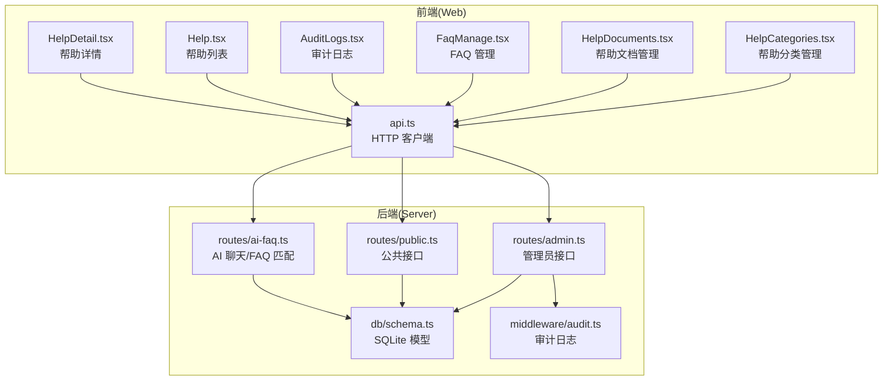
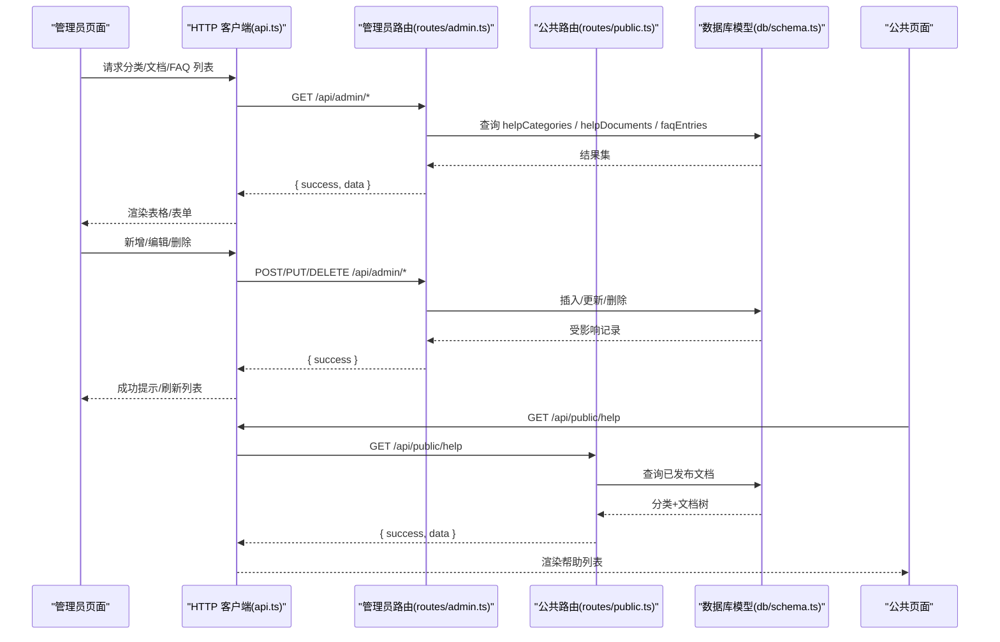
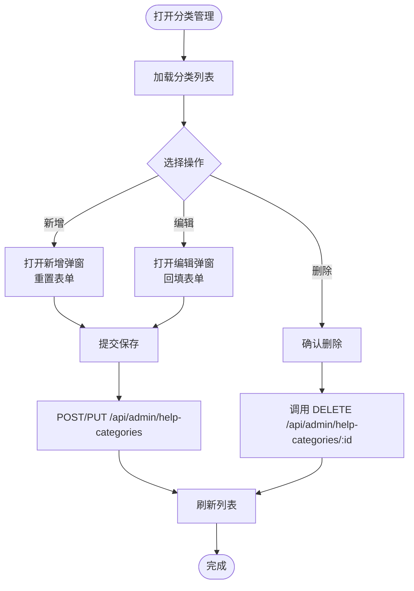
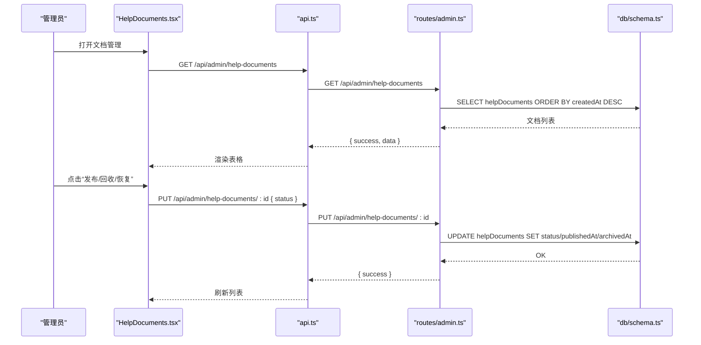
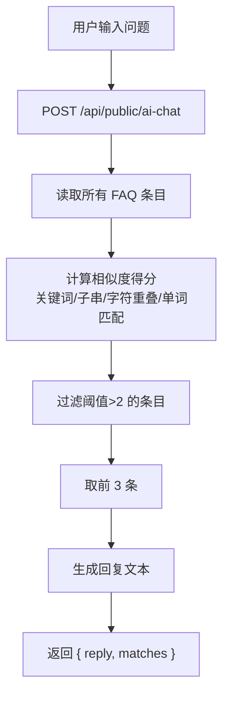
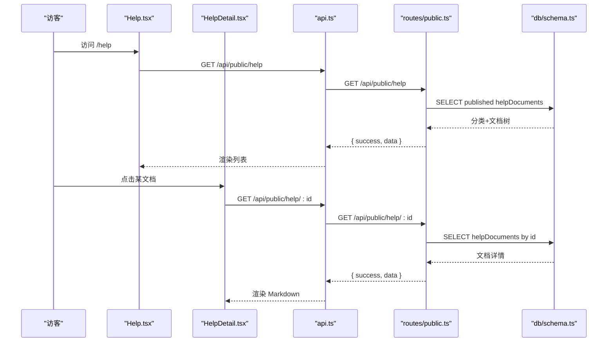
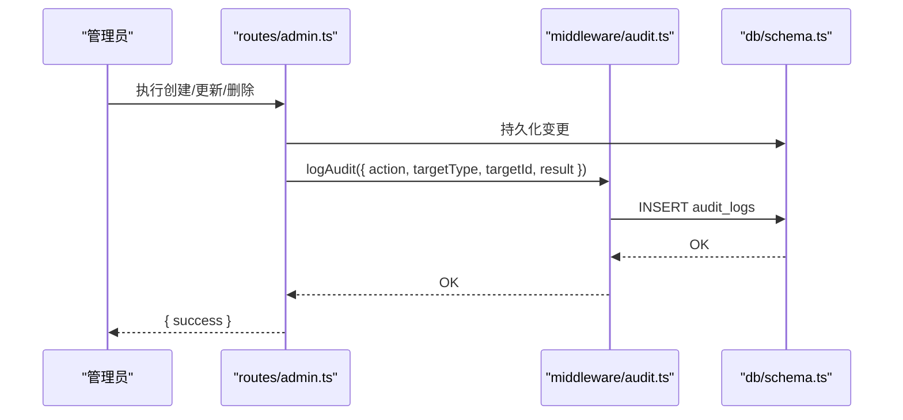
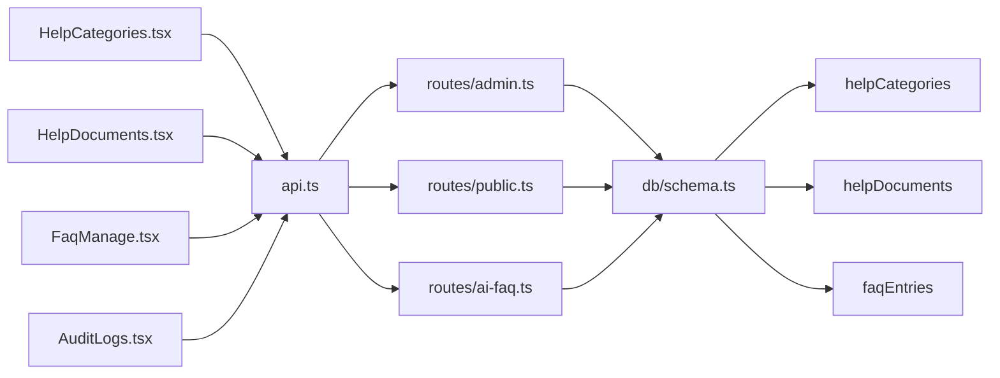

# 内容管理

<cite>
**本文引用的文件**
- [apps/web/src/pages/admin/HelpCategories.tsx](file://apps/web/src/pages/admin/HelpCategories.tsx)
- [apps/web/src/pages/admin/HelpDocuments.tsx](file://apps/web/src/pages/admin/HelpDocuments.tsx)
- [apps/web/src/pages/admin/FaqManage.tsx](file://apps/web/src/pages/admin/FaqManage.tsx)
- [apps/web/src/pages/Help.tsx](file://apps/web/src/pages/Help.tsx)
- [apps/web/src/pages/HelpDetail.tsx](file://apps/web/src/pages/HelpDetail.tsx)
- [apps/web/src/lib/api.ts](file://apps/web/src/lib/api.ts)
- [apps/server/src/routes/admin.ts](file://apps/server/src/routes/admin.ts)
- [apps/server/src/routes/public.ts](file://apps/server/src/routes/public.ts)
- [apps/server/src/routes/ai-faq.ts](file://apps/server/src/routes/ai-faq.ts)
- [apps/server/src/db/schema.ts](file://apps/server/src/db/schema.ts)
- [packages/shared/src/schemas.ts](file://packages/shared/src/schemas.ts)
- [packages/shared/src/types.ts](file://packages/shared/src/types.ts)
- [apps/server/src/middleware/audit.ts](file://apps/server/src/middleware/audit.ts)
- [apps/web/src/pages/admin/AuditLogs.tsx](file://apps/web/src/pages/admin/AuditLogs.tsx)
</cite>

## 目录
1. [简介](#简介)
2. [项目结构](#项目结构)
3. [核心组件](#核心组件)
4. [架构总览](#架构总览)
5. [详细组件分析](#详细组件分析)
6. [依赖关系分析](#依赖关系分析)
7. [性能考量](#性能考量)
8. [故障排查指南](#故障排查指南)
9. [结论](#结论)
10. [附录](#附录)

## 简介
本文件围绕内容管理功能进行系统化说明，覆盖帮助文档分类与内容管理、FAQ 管理、内容生命周期（草稿、发布、回收）、前端展示与公共访问、安全审计与版本控制策略等。文档以仓库现有实现为依据，结合前后端交互与数据库结构，提供可操作的流程图与架构图，帮助非技术读者快速理解系统能力。

## 项目结构
内容管理相关模块主要分布在以下位置：
- 前端管理页面：帮助分类、帮助文档、FAQ 管理、审计日志
- 前端公共页面：帮助列表与详情
- 后端路由：管理员接口、公共接口、AI FAQ 路由
- 数据库模型：帮助分类、帮助文档、FAQ 条目等
- 共享校验：Zod Schema 与通用类型定义
- 审计中间件：统一记录审计日志

图表来源
- [apps/web/src/pages/admin/HelpCategories.tsx:1-70](file://apps/web/src/pages/admin/HelpCategories.tsx#L1-L70)
- [apps/web/src/pages/admin/HelpDocuments.tsx:1-112](file://apps/web/src/pages/admin/HelpDocuments.tsx#L1-L112)
- [apps/web/src/pages/admin/FaqManage.tsx:1-71](file://apps/web/src/pages/admin/FaqManage.tsx#L1-L71)
- [apps/web/src/pages/admin/AuditLogs.tsx:1-102](file://apps/web/src/pages/admin/AuditLogs.tsx#L1-L102)
- [apps/web/src/pages/Help.tsx:1-61](file://apps/web/src/pages/Help.tsx#L1-L61)
- [apps/web/src/pages/HelpDetail.tsx:1-38](file://apps/web/src/pages/HelpDetail.tsx#L1-L38)
- [apps/web/src/lib/api.ts:1-16](file://apps/web/src/lib/api.ts#L1-L16)
- [apps/server/src/routes/admin.ts:1-279](file://apps/server/src/routes/admin.ts#L1-L279)
- [apps/server/src/routes/public.ts:1-52](file://apps/server/src/routes/public.ts#L1-L52)
- [apps/server/src/routes/ai-faq.ts:1-100](file://apps/server/src/routes/ai-faq.ts#L1-L100)
- [apps/server/src/db/schema.ts:51-69](file://apps/server/src/db/schema.ts#L51-L69)
- [apps/server/src/middleware/audit.ts:1-28](file://apps/server/src/middleware/audit.ts#L1-L28)

章节来源
- [apps/web/src/lib/api.ts:1-16](file://apps/web/src/lib/api.ts#L1-L16)
- [apps/server/src/routes/admin.ts:1-279](file://apps/server/src/routes/admin.ts#L1-L279)
- [apps/server/src/routes/public.ts:1-52](file://apps/server/src/routes/public.ts#L1-L52)
- [apps/server/src/routes/ai-faq.ts:1-100](file://apps/server/src/routes/ai-faq.ts#L1-L100)
- [apps/server/src/db/schema.ts:51-69](file://apps/server/src/db/schema.ts#L51-L69)

## 核心组件
- 帮助文档分类管理：支持分类增删改查、排序调整，用于组织帮助文档。
- 帮助文档管理：支持标题、分类、内容（Markdown）、排序、状态（草稿/发布/回收）管理，并提供发布/回收/恢复草稿等状态流转。
- FAQ 管理：支持问题、答案、关键词、分类、排序管理，用于构建 AI 知识库。
- 公共帮助展示：按分类聚合已发布文档，支持点击进入详情页。
- 审计日志：记录管理员对内容相关对象的操作轨迹，便于追溯与合规。

章节来源
- [apps/web/src/pages/admin/HelpCategories.tsx:1-70](file://apps/web/src/pages/admin/HelpCategories.tsx#L1-L70)
- [apps/web/src/pages/admin/HelpDocuments.tsx:1-112](file://apps/web/src/pages/admin/HelpDocuments.tsx#L1-L112)
- [apps/web/src/pages/admin/FaqManage.tsx:1-71](file://apps/web/src/pages/admin/FaqManage.tsx#L1-L71)
- [apps/web/src/pages/Help.tsx:1-61](file://apps/web/src/pages/Help.tsx#L1-L61)
- [apps/web/src/pages/HelpDetail.tsx:1-38](file://apps/web/src/pages/HelpDetail.tsx#L1-L38)
- [apps/web/src/pages/admin/AuditLogs.tsx:1-102](file://apps/web/src/pages/admin/AuditLogs.tsx#L1-L102)

## 架构总览
内容管理采用“前端页面 + 后端路由 + 数据库模型”的分层设计。前端通过统一的 HTTP 客户端调用后端 API；后端路由负责鉴权、参数校验、业务处理与持久化；数据库模型定义了帮助分类、帮助文档、FAQ 条目等核心实体。

图表来源
- [apps/web/src/lib/api.ts:1-16](file://apps/web/src/lib/api.ts#L1-L16)
- [apps/server/src/routes/admin.ts:75-134](file://apps/server/src/routes/admin.ts#L75-L134)
- [apps/server/src/routes/public.ts:26-44](file://apps/server/src/routes/public.ts#L26-L44)
- [apps/server/src/db/schema.ts:51-69](file://apps/server/src/db/schema.ts#L51-L69)

## 详细组件分析

### 帮助文档分类管理
- 功能要点
  - 列表展示：ID、名称、排序。
  - 表单：名称必填，排序默认 0。
  - 操作：新增、编辑、删除。
- 数据流
  - 前端调用 /api/admin/help-categories 获取/提交数据。
  - 后端使用 Zod 校验 helpCategorySchema，写入 helpCategories 表。
- 复杂度
  - 列表查询为 O(n)，排序字段支持升序排列。

图表来源
- [apps/web/src/pages/admin/HelpCategories.tsx:12-34](file://apps/web/src/pages/admin/HelpCategories.tsx#L12-L34)
- [apps/server/src/routes/admin.ts:75-100](file://apps/server/src/routes/admin.ts#L75-L100)
- [packages/shared/src/schemas.ts:19-22](file://packages/shared/src/schemas.ts#L19-L22)

章节来源
- [apps/web/src/pages/admin/HelpCategories.tsx:1-70](file://apps/web/src/pages/admin/HelpCategories.tsx#L1-L70)
- [apps/server/src/routes/admin.ts:75-100](file://apps/server/src/routes/admin.ts#L75-L100)
- [apps/server/src/db/schema.ts:51-56](file://apps/server/src/db/schema.ts#L51-L56)
- [packages/shared/src/schemas.ts:19-22](file://packages/shared/src/schemas.ts#L19-L22)

### 帮助文档管理
- 功能要点
  - 列表：标题、分类、排序、状态标签、操作按钮（编辑、发布、回收、恢复草稿、删除）。
  - 表单：标题、分类、内容（Markdown 文本域）、排序、状态（草稿/发布/回收）。
  - 状态流转：草稿 ↔ 发布 ↔ 回收。
- 数据流
  - 前端同时加载文档与分类，渲染下拉选择与分类映射。
  - 状态变更时 PUT /api/admin/help-documents/:id 更新状态与时间戳。
  - 新建/编辑时使用 helpDocumentSchema 校验。
- 复杂度
  - 列表查询为 O(n)，状态字段更新为 O(1)。

图表来源
- [apps/web/src/pages/admin/HelpDocuments.tsx:19-53](file://apps/web/src/pages/admin/HelpDocuments.tsx#L19-L53)
- [apps/server/src/routes/admin.ts:102-134](file://apps/server/src/routes/admin.ts#L102-L134)
- [apps/server/src/db/schema.ts:58-69](file://apps/server/src/db/schema.ts#L58-L69)

章节来源
- [apps/web/src/pages/admin/HelpDocuments.tsx:1-112](file://apps/web/src/pages/admin/HelpDocuments.tsx#L1-L112)
- [apps/server/src/routes/admin.ts:102-134](file://apps/server/src/routes/admin.ts#L102-L134)
- [apps/server/src/db/schema.ts:58-69](file://apps/server/src/db/schema.ts#L58-L69)
- [packages/shared/src/schemas.ts:33-39](file://packages/shared/src/schemas.ts#L33-L39)

### FAQ 管理与 AI 匹配
- 功能要点
  - 管理：问题、答案、关键词（逗号分隔）、分类、排序。
  - 公共：AI 聊天接口根据关键词与问题相似度匹配，返回最佳答案与候选问题。
- 数据流
  - 管理端 CRUD：/api/admin/faq。
  - 公共聊天：/api/public/ai-chat，基于 faqEntries 建立关键词索引并打分。
- 复杂度
  - 匹配算法对每条 FAQ 计算得分，整体 O(m·n)，其中 m 为输入词数，n 为 FAQ 条目数。

图表来源
- [apps/server/src/routes/ai-faq.ts:43-98](file://apps/server/src/routes/ai-faq.ts#L43-L98)
- [apps/server/src/db/schema.ts:206-214](file://apps/server/src/db/schema.ts#L206-L214)

章节来源
- [apps/web/src/pages/admin/FaqManage.tsx:1-71](file://apps/web/src/pages/admin/FaqManage.tsx#L1-L71)
- [apps/server/src/routes/ai-faq.ts:1-100](file://apps/server/src/routes/ai-faq.ts#L1-L100)
- [apps/server/src/db/schema.ts:206-214](file://apps/server/src/db/schema.ts#L206-L214)

### 公共帮助展示与详情
- 功能要点
  - 帮助列表：按分类聚合已发布文档，支持展开查看。
  - 文档详情：Markdown 渲染显示正文。
- 数据流
  - 列表：GET /api/public/help → 返回分类+文档树。
  - 详情：GET /api/public/help/:id → 返回指定文档（仅已发布）。

图表来源
- [apps/web/src/pages/Help.tsx:21-27](file://apps/web/src/pages/Help.tsx#L21-L27)
- [apps/web/src/pages/HelpDetail.tsx:10-18](file://apps/web/src/pages/HelpDetail.tsx#L10-L18)
- [apps/server/src/routes/public.ts:26-44](file://apps/server/src/routes/public.ts#L26-L44)
- [apps/server/src/db/schema.ts:58-69](file://apps/server/src/db/schema.ts#L58-L69)

章节来源
- [apps/web/src/pages/Help.tsx:1-61](file://apps/web/src/pages/Help.tsx#L1-L61)
- [apps/web/src/pages/HelpDetail.tsx:1-38](file://apps/web/src/pages/HelpDetail.tsx#L1-L38)
- [apps/server/src/routes/public.ts:26-44](file://apps/server/src/routes/public.ts#L26-L44)

### 审计日志与安全策略
- 审计日志
  - 统一记录用户行为：登录、创建、更新、删除、查看、导出、配置等。
  - 支持按用户、操作类型、目标类型、时间范围筛选。
- 安全策略
  - 管理员路由均需 requireAdmin 鉴权。
  - 审计中间件 logAudit 记录操作者、目标、IP、UA、结果等。
  - 共享类型定义中包含 ContentStatus（draft/published/archived），用于统一状态语义。

图表来源
- [apps/server/src/routes/admin.ts:15-16](file://apps/server/src/routes/admin.ts#L15-L16)
- [apps/server/src/middleware/audit.ts:3-27](file://apps/server/src/middleware/audit.ts#L3-L27)
- [apps/server/src/db/schema.ts:301-314](file://apps/server/src/db/schema.ts#L301-L314)
- [apps/web/src/pages/admin/AuditLogs.tsx:28-54](file://apps/web/src/pages/admin/AuditLogs.tsx#L28-L54)

章节来源
- [apps/server/src/middleware/audit.ts:1-28](file://apps/server/src/middleware/audit.ts#L1-L28)
- [apps/server/src/db/schema.ts:301-314](file://apps/server/src/db/schema.ts#L301-L314)
- [apps/web/src/pages/admin/AuditLogs.tsx:1-102](file://apps/web/src/pages/admin/AuditLogs.tsx#L1-L102)
- [packages/shared/src/types.ts](file://packages/shared/src/types.ts#L3)

## 依赖关系分析
- 前端依赖
  - api.ts 提供统一 baseURL 与拦截器。
  - 管理页面通过 Ant Design 表格/表单组件与 axios 交互。
- 后端依赖
  - routes/admin.ts 使用 drizzle-orm 查询/更新数据库。
  - routes/public.ts 仅读取已发布数据，保证公开安全。
  - routes/ai-faq.ts 对 FAQ 做关键词与语义匹配。
- 数据模型
  - helpCategories、helpDocuments、faqEntries 三张核心表支撑内容管理。
- 类型与校验
  - shared/schemas.ts 定义 helpCategorySchema、helpDocumentSchema，确保入参合法。
  - shared/types.ts 定义 ContentStatus，统一状态枚举。

图表来源
- [apps/web/src/lib/api.ts:1-16](file://apps/web/src/lib/api.ts#L1-L16)
- [apps/server/src/routes/admin.ts:1-279](file://apps/server/src/routes/admin.ts#L1-L279)
- [apps/server/src/routes/public.ts:1-52](file://apps/server/src/routes/public.ts#L1-L52)
- [apps/server/src/routes/ai-faq.ts:1-100](file://apps/server/src/routes/ai-faq.ts#L1-L100)
- [apps/server/src/db/schema.ts:51-69](file://apps/server/src/db/schema.ts#L51-L69)

章节来源
- [apps/web/src/lib/api.ts:1-16](file://apps/web/src/lib/api.ts#L1-L16)
- [apps/server/src/db/schema.ts:51-69](file://apps/server/src/db/schema.ts#L51-L69)
- [packages/shared/src/schemas.ts:19-39](file://packages/shared/src/schemas.ts#L19-L39)

## 性能考量
- 列表查询
  - 当前路由未实现分页，建议在 /api/admin/help-documents 与 /api/admin/faq 增加分页参数，避免一次性加载大量数据。
- 匹配算法
  - ai-faq 的关键词匹配为 O(m·n)，建议对关键词建立索引或缓存热门问题，降低重复计算成本。
- Markdown 渲染
  - 前端使用 react-markdown 渲染，建议在公共页面对长文档做懒加载或分段渲染，提升首屏性能。
- 审计日志
  - 审计写入为同步操作，建议在高并发场景下考虑异步队列或批量写入，避免阻塞主请求。

## 故障排查指南
- 401 未授权
  - api.ts 在响应拦截器中处理 401，若非登录页将不自动跳转。检查登录态与路由守卫。
- 参数校验失败
  - 管理端路由对请求体使用 Zod 校验，错误时返回 400。检查表单字段是否符合 helpCategorySchema 或 helpDocumentSchema。
- 文档不存在或未发布
  - 公共路由对 help/:id 仅返回已发布文档，若返回 404，请确认状态为 published。
- 审计日志缺失
  - 确认中间件 logAudit 是否被正确调用，以及 audit_logs 表是否存在数据。

章节来源
- [apps/web/src/lib/api.ts:5-13](file://apps/web/src/lib/api.ts#L5-L13)
- [apps/server/src/routes/admin.ts:75-134](file://apps/server/src/routes/admin.ts#L75-L134)
- [apps/server/src/routes/public.ts:37-44](file://apps/server/src/routes/public.ts#L37-L44)
- [apps/server/src/middleware/audit.ts:14-27](file://apps/server/src/middleware/audit.ts#L14-L27)

## 结论
本内容管理系统以清晰的前后端职责划分与数据库模型为基础，实现了帮助文档分类与内容管理、FAQ 知识库与 AI 匹配、公共展示与审计追踪等核心能力。建议后续引入分页、索引与缓存优化、Markdown 渲染性能优化及异步审计队列，以进一步提升可用性与扩展性。

## 附录

### 内容生命周期管理
- 草稿：默认状态，仅管理员可见。
- 发布：将状态切换为已发布，公共接口可访问。
- 回收：将状态切换为已回收，不再对外展示。
- 恢复草稿：从回收状态恢复为草稿。

章节来源
- [apps/web/src/pages/admin/HelpDocuments.tsx:6-10](file://apps/web/src/pages/admin/HelpDocuments.tsx#L6-L10)
- [apps/server/src/routes/admin.ts:117-128](file://apps/server/src/routes/admin.ts#L117-L128)
- [apps/server/src/db/schema.ts:58-69](file://apps/server/src/db/schema.ts#L58-L69)

### SEO 优化建议
- 标题：确保每个帮助文档的标题简洁明确，包含关键词。
- 描述：可在文档内容中自然体现摘要信息，便于搜索引擎抓取。
- 关键词：FAQ 管理支持关键词字段，建议按逗号分隔填写高频词。
- 结构化链接：公共帮助列表按分类组织，利于爬虫抓取与用户导航。

章节来源
- [apps/web/src/pages/admin/FaqManage.tsx:62-65](file://apps/web/src/pages/admin/FaqManage.tsx#L62-L65)
- [apps/server/src/routes/public.ts:26-44](file://apps/server/src/routes/public.ts#L26-L44)

### 版本控制与审计
- 审计日志覆盖 create/update/delete/view/export/config 等动作，目标类型包含 document、faq 等。
- 建议在内容模型中增加版本号字段与差异对比，以便更精细地追踪变更历史。

章节来源
- [apps/server/src/middleware/audit.ts:3-27](file://apps/server/src/middleware/audit.ts#L3-L27)
- [apps/server/src/db/schema.ts:301-314](file://apps/server/src/db/schema.ts#L301-L314)
- [apps/web/src/pages/admin/AuditLogs.tsx:9-23](file://apps/web/src/pages/admin/AuditLogs.tsx#L9-L23)