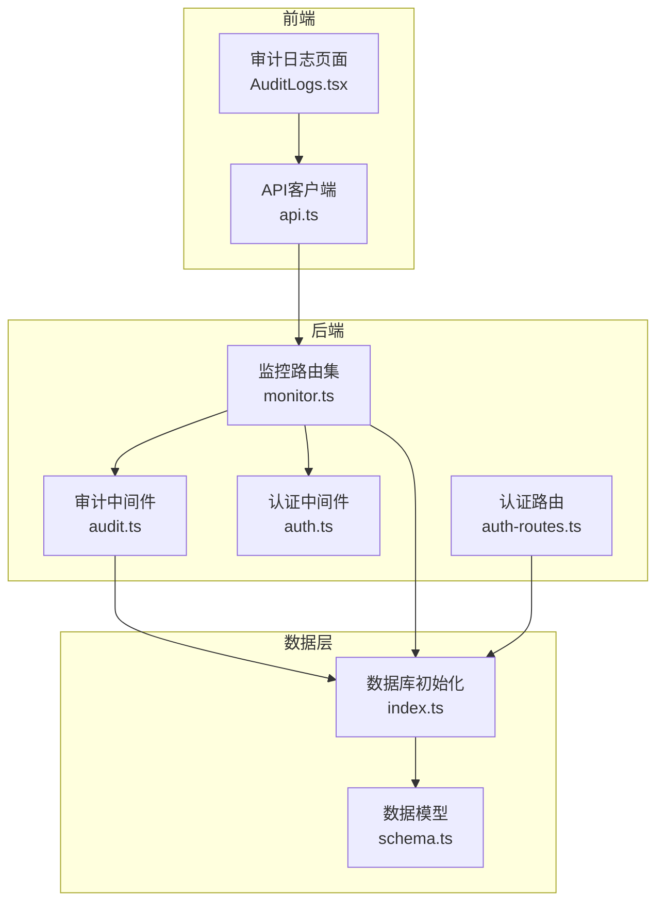
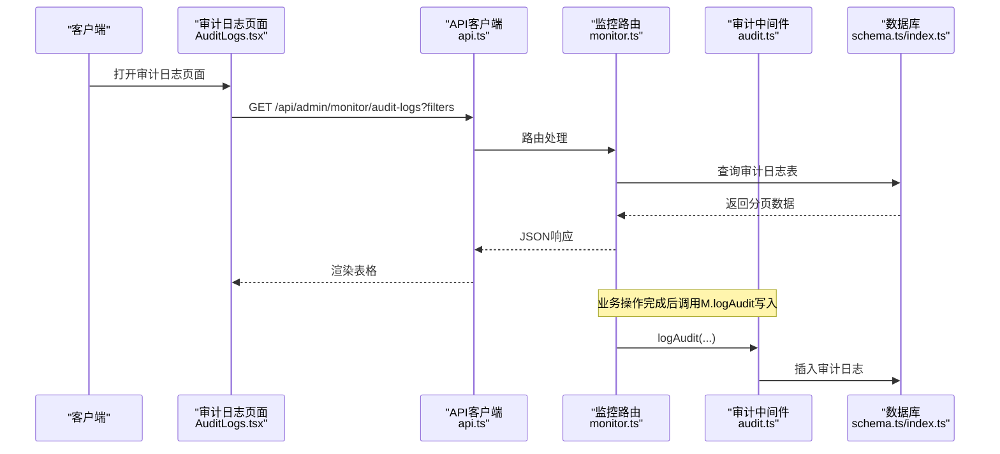
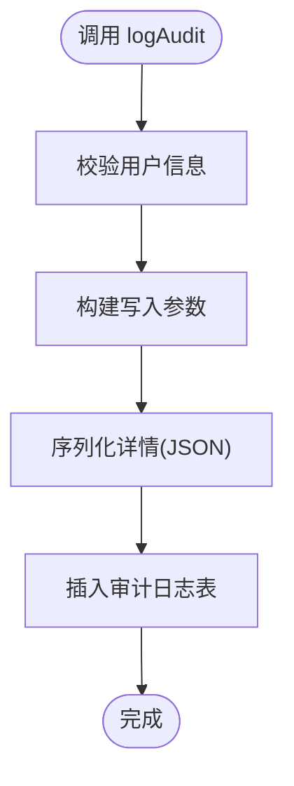
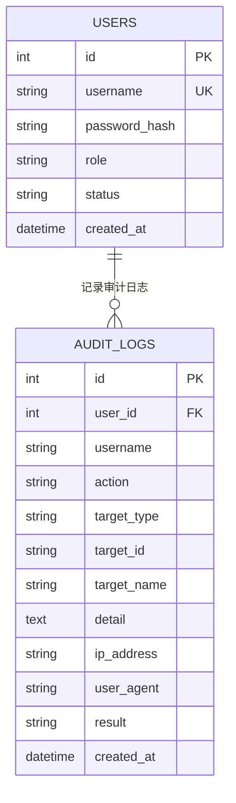
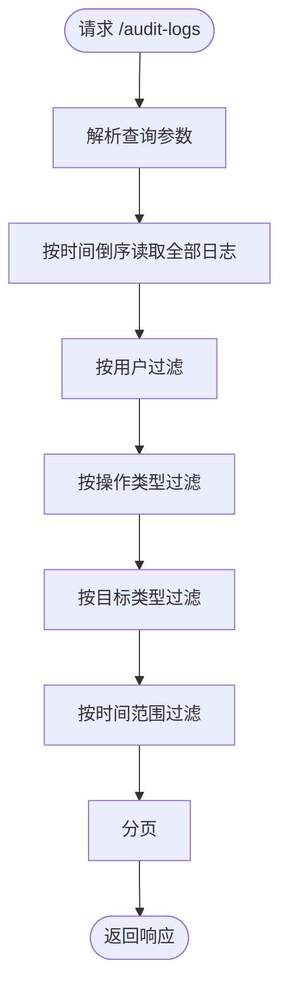
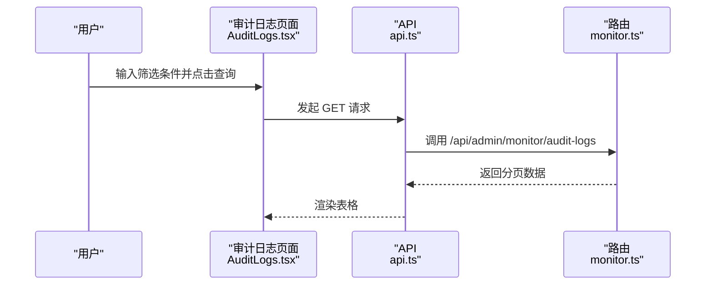
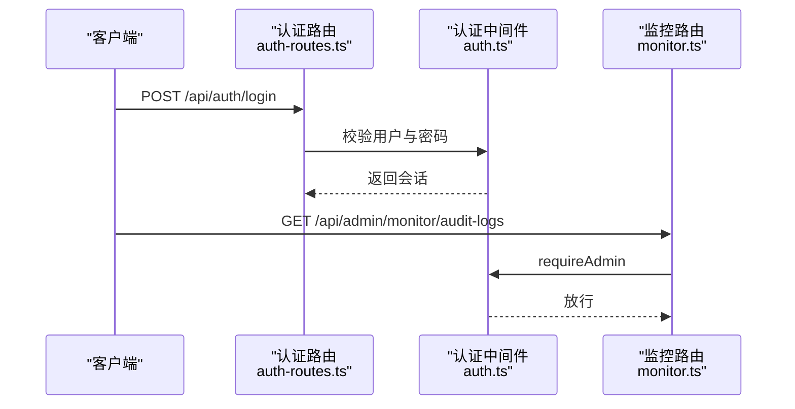
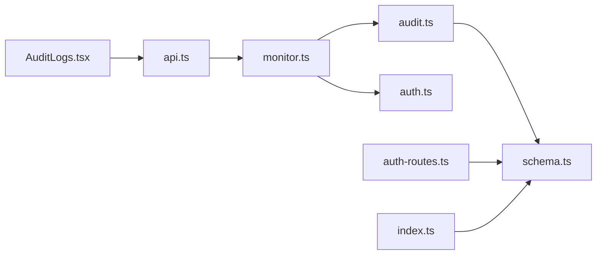

# 审计日志

<cite>
**本文引用的文件**
- [audit.ts](file://apps/server/src/middleware/audit.ts)
- [schema.ts](file://apps/server/src/db/schema.ts)
- [index.ts](file://apps/server/src/db/index.ts)
- [monitor.ts](file://apps/server/src/routes/monitor.ts)
- [AuditLogs.tsx](file://apps/web/src/pages/admin/AuditLogs.tsx)
- [api.ts](file://apps/web/src/lib/api.ts)
- [auth.ts](file://apps/server/src/middleware/auth.ts)
- [auth-routes.ts](file://apps/server/src/routes/auth.ts)
- [seed-demo.ts](file://apps/server/src/db/seed-demo.ts)
</cite>

## 目录
1. [简介](#简介)
2. [项目结构](#项目结构)
3. [核心组件](#核心组件)
4. [架构总览](#架构总览)
5. [详细组件分析](#详细组件分析)
6. [依赖关系分析](#依赖关系分析)
7. [性能考量](#性能考量)
8. [故障排查指南](#故障排查指南)
9. [结论](#结论)
10. [附录](#附录)

## 简介
本文件系统性阐述审计日志功能的设计与实现，覆盖以下方面：
- 设计原理与记录策略：操作类型分类、日志级别、敏感信息处理
- 查询与筛选：按时间范围、操作人、操作类型、目标类型等多维过滤
- 日志详情展示：操作上下文、影响范围、结果状态
- 分析能力：高频操作识别、异常行为检测、合规性检查思路
- 导出与归档：批量导出、长期存储、压缩加密建议
- 安全与隐私：访问控制、最小化采集、脱敏策略

## 项目结构
审计日志功能由“后端中间件写入 + 后端路由查询 + 前端页面展示”三层构成，并通过SQLite数据库持久化。

图表来源
- [AuditLogs.tsx:1-102](file://apps/web/src/pages/admin/AuditLogs.tsx#L1-L102)
- [api.ts:1-16](file://apps/web/src/lib/api.ts#L1-L16)
- [audit.ts:1-28](file://apps/server/src/middleware/audit.ts#L1-L28)
- [monitor.ts:1-595](file://apps/server/src/routes/monitor.ts#L1-L595)
- [auth.ts:1-56](file://apps/server/src/middleware/auth.ts#L1-L56)
- [auth-routes.ts:1-51](file://apps/server/src/routes/auth.ts#L1-L51)
- [index.ts:1-16](file://apps/server/src/db/index.ts#L1-L16)
- [schema.ts:1-330](file://apps/server/src/db/schema.ts#L1-L330)

章节来源
- [AuditLogs.tsx:1-102](file://apps/web/src/pages/admin/AuditLogs.tsx#L1-L102)
- [api.ts:1-16](file://apps/web/src/lib/api.ts#L1-L16)
- [audit.ts:1-28](file://apps/server/src/middleware/audit.ts#L1-L28)
- [monitor.ts:1-595](file://apps/server/src/routes/monitor.ts#L1-L595)
- [auth.ts:1-56](file://apps/server/src/middleware/auth.ts#L1-L56)
- [auth-routes.ts:1-51](file://apps/server/src/routes/auth.ts#L1-L51)
- [index.ts:1-16](file://apps/server/src/db/index.ts#L1-L16)
- [schema.ts:1-330](file://apps/server/src/db/schema.ts#L1-L330)

## 核心组件
- 审计中间件：统一写入审计日志，支持用户、操作、目标、上下文、结果等字段
- 数据模型：定义审计日志表结构及枚举字段（操作类型、目标类型、结果）
- 查询路由：提供分页、过滤、统计接口
- 前端页面：提供查询表单与表格展示，支持时间范围、用户名、操作类型、目标类型筛选
- 认证中间件：确保仅管理员可访问审计日志相关接口

章节来源
- [audit.ts:1-28](file://apps/server/src/middleware/audit.ts#L1-L28)
- [schema.ts:301-314](file://apps/server/src/db/schema.ts#L301-L314)
- [monitor.ts:455-487](file://apps/server/src/routes/monitor.ts#L455-L487)
- [AuditLogs.tsx:1-102](file://apps/web/src/pages/admin/AuditLogs.tsx#L1-L102)
- [auth.ts:48-55](file://apps/server/src/middleware/auth.ts#L48-L55)

## 架构总览
审计日志从“业务操作触发写入”，到“管理员查询与分析”的完整闭环如下：

图表来源
- [AuditLogs.tsx:36-51](file://apps/web/src/pages/admin/AuditLogs.tsx#L36-L51)
- [api.ts:1-16](file://apps/web/src/lib/api.ts#L1-L16)
- [monitor.ts:455-474](file://apps/server/src/routes/monitor.ts#L455-L474)
- [audit.ts:3-27](file://apps/server/src/middleware/audit.ts#L3-L27)
- [schema.ts:301-314](file://apps/server/src/db/schema.ts#L301-L314)
- [index.ts:1-16](file://apps/server/src/db/index.ts#L1-L16)

## 详细组件分析

### 审计中间件（logAudit）
- 职责：接收操作上下文参数，写入审计日志表
- 关键字段：用户标识、用户名、操作类型、目标类型、目标ID/名称、详情JSON、IP、UA、结果
- 结果字段：默认成功，失败场景可显式传入
- JSON详情：对复杂上下文进行序列化存储，便于后续分析

图表来源
- [audit.ts:3-27](file://apps/server/src/middleware/audit.ts#L3-L27)

章节来源
- [audit.ts:1-28](file://apps/server/src/middleware/audit.ts#L1-L28)

### 数据模型（审计日志表）
- 字段设计：主键、用户外键、用户名、操作类型、目标类型、目标ID/名称、详情、IP、UA、结果、创建时间
- 枚举约束：操作类型、目标类型、结果均采用枚举，保证一致性
- 外键关联：审计日志可关联用户表，便于跨表查询

图表来源
- [schema.ts:301-314](file://apps/server/src/db/schema.ts#L301-L314)
- [schema.ts:3-10](file://apps/server/src/db/schema.ts#L3-L10)

章节来源
- [schema.ts:301-314](file://apps/server/src/db/schema.ts#L301-L314)

### 查询与筛选（后端路由）
- 接口：GET /api/admin/monitor/audit-logs
- 支持参数：page、pageSize、userId、action、targetType、startTime、endTime
- 过滤逻辑：先按创建时间倒序全量读取，再按条件过滤，最后分页返回
- 统计接口：GET /api/admin/monitor/audit-logs/stats，提供按操作类型与目标类型的频次统计

图表来源
- [monitor.ts:455-474](file://apps/server/src/routes/monitor.ts#L455-L474)

章节来源
- [monitor.ts:455-487](file://apps/server/src/routes/monitor.ts#L455-L487)

### 前端展示（审计日志页面）
- 表单字段：用户名、操作类型、目标类型、时间范围
- 表格列：时间、用户、操作、目标类型、目标名称、IP、结果、详情
- 分页与加载：支持页码与每页数量切换，加载态友好
- 结果标签：根据结果状态着色显示

图表来源
- [AuditLogs.tsx:36-51](file://apps/web/src/pages/admin/AuditLogs.tsx#L36-L51)
- [api.ts:1-16](file://apps/web/src/lib/api.ts#L1-L16)
- [monitor.ts:455-474](file://apps/server/src/routes/monitor.ts#L455-L474)

章节来源
- [AuditLogs.tsx:1-102](file://apps/web/src/pages/admin/AuditLogs.tsx#L1-L102)

### 认证与访问控制
- 管理员前置钩子：所有审计日志相关路由均需管理员权限
- 会话加载：从Cookie中解析会话，校验有效期与用户状态
- 登录/登出路由：生成/清理会话，配合审计中间件记录登录登出

图表来源
- [auth-routes.ts:9-32](file://apps/server/src/routes/auth.ts#L9-L32)
- [auth.ts:48-55](file://apps/server/src/middleware/auth.ts#L48-L55)
- [monitor.ts:455-474](file://apps/server/src/routes/monitor.ts#L455-L474)

章节来源
- [auth.ts:17-40](file://apps/server/src/middleware/auth.ts#L17-L40)
- [auth-routes.ts:1-51](file://apps/server/src/routes/auth.ts#L1-L51)
- [monitor.ts:13-14](file://apps/server/src/routes/monitor.ts#L13-L14)

### 操作类型与目标类型分类
- 操作类型：登录、登出、创建、更新、删除、查看、导出、配置
- 目标类型：用户、软件、文档、激活、资产、工单、SaaS、FAQ、系统、数据库、设备、监控
- 用途：前端下拉选择、后端过滤、统计分析

章节来源
- [AuditLogs.tsx:9-23](file://apps/web/src/pages/admin/AuditLogs.tsx#L9-L23)
- [schema.ts:305-306](file://apps/server/src/db/schema.ts#L305-L306)

### 敏感信息处理与日志级别
- 敏感信息：密码哈希、会话密钥等不在审计详情中直接记录；当前实现未对IP、UA做脱敏
- 日志级别：以“成功/失败”二元结果表示，便于统计与告警

章节来源
- [audit.ts:22-24](file://apps/server/src/middleware/audit.ts#L22-L24)
- [schema.ts:312](file://apps/server/src/db/schema.ts#L312)

### 日志详情展示
- 展示字段：时间、用户、操作、目标类型、目标名称、IP、结果、详情
- 详情内容：业务操作产生的上下文信息，如变更前后对比、操作原因等

章节来源
- [AuditLogs.tsx:76-98](file://apps/web/src/pages/admin/AuditLogs.tsx#L76-L98)
- [audit.ts:10](file://apps/server/src/middleware/audit.ts#L10)

### 日志分析能力
- 高频操作识别：通过统计接口按操作类型聚合，识别热点操作
- 异常行为检测：结合时间范围、用户、目标类型过滤，定位异常集中时间段与用户
- 合规性检查：基于操作类型与目标类型组合，验证是否符合最小权限与审批流程

章节来源
- [monitor.ts:476-487](file://apps/server/src/routes/monitor.ts#L476-L487)

### 导出与归档机制
- 当前实现：未提供审计日志的直接导出接口
- 建议方案：
  - 批量导出：在查询接口基础上增加导出参数，后端返回CSV/JSON文件流
  - 长期存储：将历史日志迁移至专用审计数据库或对象存储
  - 压缩加密：导出文件采用压缩与加密，确保传输与存储安全

章节来源
- [monitor.ts:455-474](file://apps/server/src/routes/monitor.ts#L455-L474)

### 安全策略与隐私保护
- 访问控制：管理员专属接口，防止越权访问
- 最小化采集：仅记录必要信息，避免记录明文密码、敏感参数
- 传输安全：启用HTTPS，Cookie设置HttpOnly与SameSite策略
- 存储安全：数据库文件权限控制，定期备份与轮换

章节来源
- [auth-routes.ts:26-31](file://apps/server/src/routes/auth.ts#L26-L31)
- [auth.ts:48-55](file://apps/server/src/middleware/auth.ts#L48-L55)

## 依赖关系分析

图表来源
- [AuditLogs.tsx:1-102](file://apps/web/src/pages/admin/AuditLogs.tsx#L1-L102)
- [api.ts:1-16](file://apps/web/src/lib/api.ts#L1-L16)
- [monitor.ts:1-595](file://apps/server/src/routes/monitor.ts#L1-L595)
- [audit.ts:1-28](file://apps/server/src/middleware/audit.ts#L1-L28)
- [schema.ts:1-330](file://apps/server/src/db/schema.ts#L1-L330)
- [auth.ts:1-56](file://apps/server/src/middleware/auth.ts#L1-L56)
- [auth-routes.ts:1-51](file://apps/server/src/routes/auth.ts#L1-L51)
- [index.ts:1-16](file://apps/server/src/db/index.ts#L1-L16)

章节来源
- [monitor.ts:13-14](file://apps/server/src/routes/monitor.ts#L13-L14)

## 性能考量
- 查询性能：当前实现先全量读取再过滤，适合中小规模数据；建议在审计日志表上建立索引（如用户、时间、目标类型），并限制最大分页大小
- 写入性能：审计写入为轻量级插入，建议在高并发场景下考虑异步队列或批量写入
- 存储成本：建议按月/季度归档旧日志，保留热数据于内存/SSD，冷数据落盘

## 故障排查指南
- 无数据或空结果
  - 检查筛选条件是否过于严格（如时间范围、用户、目标类型）
  - 确认管理员权限是否正确传递
- 权限问题
  - 确保登录且角色为管理员
  - 检查会话Cookie是否正确设置与携带
- 数据库问题
  - 确认数据库路径与权限
  - 检查表结构是否与模型一致

章节来源
- [monitor.ts:455-474](file://apps/server/src/routes/monitor.ts#L455-L474)
- [auth.ts:48-55](file://apps/server/src/middleware/auth.ts#L48-L55)
- [index.ts:7-12](file://apps/server/src/db/index.ts#L7-L12)

## 结论
该审计日志系统以简洁的中间件写入与路由查询为核心，配合前端表格展示，实现了对关键业务操作的可观测性。建议后续完善导出接口、建立索引与归档策略，并在敏感信息处理与隐私保护方面进一步强化。

## 附录
- 示例数据：演示页面包含大量审计日志样例，便于测试与演示
- 开发提示：新增业务操作时，应在成功/失败分支调用审计中间件记录日志

章节来源
- [seed-demo.ts:1487-1576](file://apps/server/src/db/seed-demo.ts#L1487-L1576)