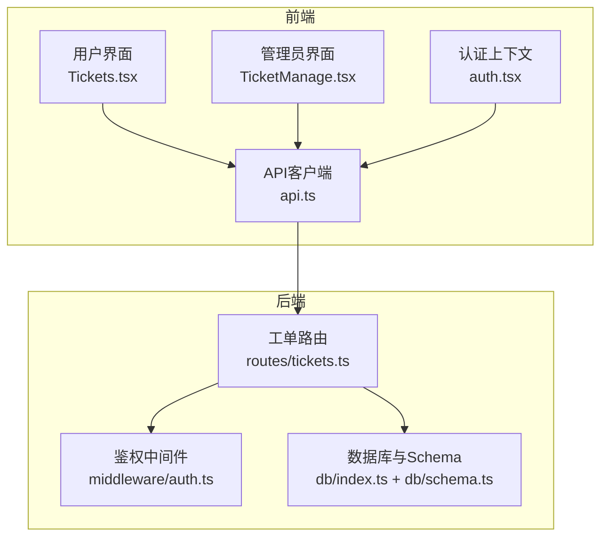
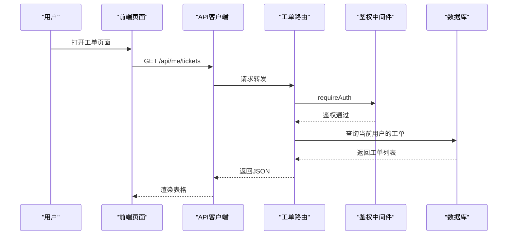
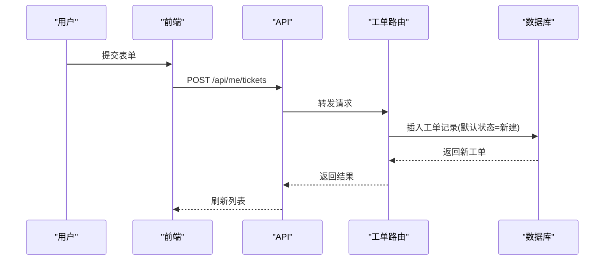
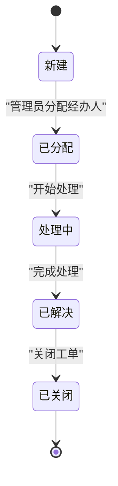
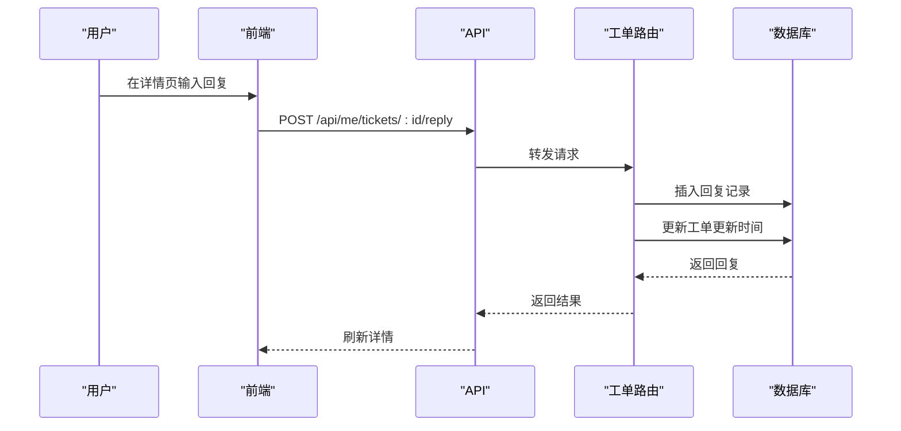
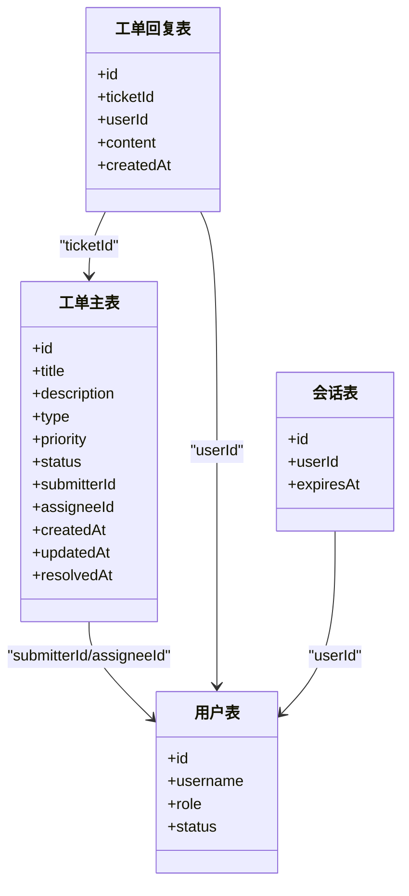

# 工单管理

<cite>
**本文引用的文件**
- [apps/server/src/routes/tickets.ts](file://apps/server/src/routes/tickets.ts)
- [apps/server/src/db/schema.ts](file://apps/server/src/db/schema.ts)
- [apps/server/src/db/index.ts](file://apps/server/src/db/index.ts)
- [apps/server/src/middleware/auth.ts](file://apps/server/src/middleware/auth.ts)
- [apps/web/src/pages/Tickets.tsx](file://apps/web/src/pages/Tickets.tsx)
- [apps/web/src/pages/admin/TicketManage.tsx](file://apps/web/src/pages/admin/TicketManage.tsx)
- [apps/web/src/lib/api.ts](file://apps/web/src/lib/api.ts)
- [apps/web/src/lib/auth.tsx](file://apps/web/src/lib/auth.tsx)
- [apps/server/src/routes/reports.ts](file://apps/server/src/routes/reports.ts)
- [apps/web/src/pages/admin/Reports.tsx](file://apps/web/src/pages/admin/Reports.tsx)
</cite>

## 目录
1. [简介](#简介)
2. [项目结构](#项目结构)
3. [核心组件](#核心组件)
4. [架构总览](#架构总览)
5. [详细组件分析](#详细组件分析)
6. [依赖关系分析](#依赖关系分析)
7. [性能考虑](#性能考虑)
8. [故障排查指南](#故障排查指南)
9. [结论](#结论)
10. [附录](#附录)

## 简介
本文件面向“工单管理”功能，系统性梳理工单类型与配置、创建与分配机制、状态流转、回复与沟通、统计与报表以及工作流程优化建议。当前仓库实现了基础的工单生命周期管理：用户提交工单、查看与回复、管理员查看与处理、工单状态与分配变更、以及与审计日志相关的数据模型。统计与报表模块目前聚焦于软件资产、激活码使用与数字资产，尚未直接提供工单处理时效、满意度统计等指标。后续可基于现有数据模型扩展相应统计接口。

## 项目结构
工单管理由前端页面与后端路由/数据库共同组成：
- 前端
  - 用户侧：我的工单列表与详情、提交工单表单
  - 管理员侧：工单管理列表、筛选、状态变更、分配、回复
  - 认证与API封装：会话加载、鉴权拦截、统一API客户端
- 后端
  - 路由：用户与管理员的工单相关接口（提交、查询、回复、状态/分配变更）
  - 数据库：工单主表、回复表、用户表、会话表、审计日志等
  - 中间件：会话加载、用户鉴权、管理员鉴权

图表来源
- [apps/web/src/pages/Tickets.tsx:1-132](file://apps/web/src/pages/Tickets.tsx#L1-L132)
- [apps/web/src/pages/admin/TicketManage.tsx:1-120](file://apps/web/src/pages/admin/TicketManage.tsx#L1-L120)
- [apps/web/src/lib/auth.tsx:1-55](file://apps/web/src/lib/auth.tsx#L1-L55)
- [apps/web/src/lib/api.ts:1-16](file://apps/web/src/lib/api.ts#L1-L16)
- [apps/server/src/routes/tickets.ts:1-137](file://apps/server/src/routes/tickets.ts#L1-L137)
- [apps/server/src/middleware/auth.ts:1-56](file://apps/server/src/middleware/auth.ts#L1-L56)
- [apps/server/src/db/index.ts:1-16](file://apps/server/src/db/index.ts#L1-L16)
- [apps/server/src/db/schema.ts:1-330](file://apps/server/src/db/schema.ts#L1-L330)

章节来源
- [apps/web/src/pages/Tickets.tsx:1-132](file://apps/web/src/pages/Tickets.tsx#L1-L132)
- [apps/web/src/pages/admin/TicketManage.tsx:1-120](file://apps/web/src/pages/admin/TicketManage.tsx#L1-L120)
- [apps/web/src/lib/auth.tsx:1-55](file://apps/web/src/lib/auth.tsx#L1-L55)
- [apps/web/src/lib/api.ts:1-16](file://apps/web/src/lib/api.ts#L1-L16)
- [apps/server/src/routes/tickets.ts:1-137](file://apps/server/src/routes/tickets.ts#L1-L137)
- [apps/server/src/middleware/auth.ts:1-56](file://apps/server/src/middleware/auth.ts#L1-L56)
- [apps/server/src/db/index.ts:1-16](file://apps/server/src/db/index.ts#L1-L16)
- [apps/server/src/db/schema.ts:1-330](file://apps/server/src/db/schema.ts#L1-L330)

## 核心组件
- 工单类型与优先级
  - 类型：故障报修、需求建议、咨询提问、其他
  - 优先级：低、中、高、紧急
- 工单状态
  - 新建、已分配、处理中、已解决、已关闭
- 数据模型
  - 工单主表：包含标题、描述、类型、优先级、状态、提交人、经办人、创建/更新/解决时间
  - 工单回复表：关联工单与用户，记录回复内容与时间
  - 用户与会话：用于鉴权与关联
  - 审计日志：记录用户行为，可用于追踪工单相关操作

章节来源
- [apps/server/src/db/schema.ts:99-119](file://apps/server/src/db/schema.ts#L99-L119)
- [apps/web/src/pages/Tickets.tsx:11-22](file://apps/web/src/pages/Tickets.tsx#L11-L22)
- [apps/web/src/pages/admin/TicketManage.tsx:7-16](file://apps/web/src/pages/admin/TicketManage.tsx#L7-L16)

## 架构总览
前后端通过REST接口交互，前端负责展示与用户交互，后端负责业务逻辑与数据持久化。鉴权中间件确保访问控制，数据库采用SQLite+Drizzle ORM。

图表来源
- [apps/web/src/pages/Tickets.tsx:40-43](file://apps/web/src/pages/Tickets.tsx#L40-L43)
- [apps/server/src/routes/tickets.ts:21-27](file://apps/server/src/routes/tickets.ts#L21-L27)
- [apps/server/src/middleware/auth.ts:42-46](file://apps/server/src/middleware/auth.ts#L42-L46)
- [apps/server/src/db/index.ts:1-16](file://apps/server/src/db/index.ts#L1-L16)

## 详细组件分析

### 工单类型与配置
- 类型定义
  - 后端枚举：故障报修、需求建议、咨询提问、其他
  - 前端映射：中文标签用于展示
- 优先级定义
  - 后端枚举：低、中、高、紧急
  - 前端映射：颜色与标签
- 默认值
  - 创建时若未指定类型/优先级，默认为“咨询提问/中”

章节来源
- [apps/server/src/db/schema.ts:103-105](file://apps/server/src/db/schema.ts#L103-L105)
- [apps/web/src/pages/Tickets.tsx:91-96](file://apps/web/src/pages/Tickets.tsx#L91-L96)
- [apps/server/src/routes/tickets.ts:8-18](file://apps/server/src/routes/tickets.ts#L8-L18)

### 工单创建与分配机制
- 用户创建
  - 接口：POST /api/me/tickets
  - 参数：标题、描述、类型、优先级
  - 关联：提交人为当前登录用户
- 工单分配
  - 管理员接口：PUT /api/admin/tickets/:id
  - 可同时更新状态与经办人
  - 默认状态变更：当经办人被分配时，状态可设为“已分配”
- 自动分配算法
  - 当前代码未实现自动分配逻辑；可在 PUT /api/admin/tickets/:id 处扩展策略（如按负载或技能匹配）

图表来源
- [apps/server/src/routes/tickets.ts:8-19](file://apps/server/src/routes/tickets.ts#L8-L19)
- [apps/web/src/pages/Tickets.tsx:45-52](file://apps/web/src/pages/Tickets.tsx#L45-L52)

章节来源
- [apps/server/src/routes/tickets.ts:8-19](file://apps/server/src/routes/tickets.ts#L8-L19)
- [apps/web/src/pages/Tickets.tsx:45-52](file://apps/web/src/pages/Tickets.tsx#L45-L52)

### 工单状态流转
- 状态枚举：新建、已分配、处理中、已解决、已关闭
- 管理员变更
  - 接口：PUT /api/admin/tickets/:id
  - 更新字段：状态、经办人
  - 特殊处理：当状态设为“已解决”时，写入解决时间
- 用户侧状态展示
  - 前端根据状态映射显示中文标签与颜色

图表来源
- [apps/server/src/db/schema.ts](file://apps/server/src/db/schema.ts#L105)
- [apps/server/src/routes/tickets.ts:112-121](file://apps/server/src/routes/tickets.ts#L112-L121)
- [apps/web/src/pages/admin/TicketManage.tsx:7-16](file://apps/web/src/pages/admin/TicketManage.tsx#L7-L16)

章节来源
- [apps/server/src/db/schema.ts](file://apps/server/src/db/schema.ts#L105)
- [apps/server/src/routes/tickets.ts:112-121](file://apps/server/src/routes/tickets.ts#L112-L121)
- [apps/web/src/pages/admin/TicketManage.tsx:7-16](file://apps/web/src/pages/admin/TicketManage.tsx#L7-L16)

### 工单回复与沟通
- 用户回复
  - 接口：POST /api/me/tickets/:id/reply
  - 仅限工单提交人回复
- 管理员回复
  - 接口：POST /api/admin/tickets/:id/reply
  - 回复后更新工单更新时间
- 前端展示
  - 工单详情页展示所有回复，区分用户与管理员
  - 用户侧在非“已解决/已关闭”状态下允许回复

图表来源
- [apps/server/src/routes/tickets.ts:48-62](file://apps/server/src/routes/tickets.ts#L48-L62)
- [apps/web/src/pages/Tickets.tsx:61-66](file://apps/web/src/pages/Tickets.tsx#L61-L66)

章节来源
- [apps/server/src/routes/tickets.ts:48-62](file://apps/server/src/routes/tickets.ts#L48-L62)
- [apps/web/src/pages/Tickets.tsx:61-66](file://apps/web/src/pages/Tickets.tsx#L61-L66)
- [apps/web/src/pages/admin/TicketManage.tsx:52-57](file://apps/web/src/pages/admin/TicketManage.tsx#L52-L57)

### 工单统计与报表
- 现有报表模块
  - 软件资产、激活码使用、数字资产等报表接口
  - 管理员侧报表页面聚合展示
- 工单相关统计现状
  - 未提供工单处理时效、满意度统计、热门问题分析等指标
- 建议扩展点
  - 新增工单处理时效统计：计算从创建到解决的时间差
  - 新增满意度统计：通过外部调查或标记字段收集
  - 新增热门问题分析：统计高频关键词或主题

章节来源
- [apps/server/src/routes/reports.ts:1-146](file://apps/server/src/routes/reports.ts#L1-L146)
- [apps/web/src/pages/admin/Reports.tsx:1-138](file://apps/web/src/pages/admin/Reports.tsx#L1-L138)

## 依赖关系分析

图表来源
- [apps/server/src/db/schema.ts:3-11](file://apps/server/src/db/schema.ts#L3-L11)
- [apps/server/src/db/schema.ts:99-119](file://apps/server/src/db/schema.ts#L99-L119)

章节来源
- [apps/server/src/db/schema.ts:3-11](file://apps/server/src/db/schema.ts#L3-L11)
- [apps/server/src/db/schema.ts:99-119](file://apps/server/src/db/schema.ts#L99-L119)

## 性能考虑
- 数据库
  - 使用SQLite+WAL模式，适合轻量场景；若并发较高，建议评估分片或迁移至更健壮的数据库
  - 开启外键约束，保证数据一致性
- 查询
  - 工单列表按创建时间倒序，避免全表扫描；可考虑在关键列建立索引（如submitterId、assigneeId、status）
- 前端
  - 分页加载（每页10/15条），减少一次性渲染压力
  - 按需加载详情与回复，避免冗余请求

## 故障排查指南
- 401 未登录
  - 前端API拦截器对401不做重定向，需在页面中提示登录
- 403 权限不足
  - 管理员接口未满足管理员角色时返回
- 工单不存在
  - 查询用户自己的工单详情时，若无权限或不存在返回错误
- 回复为空
  - 回复内容必填，空内容会被拒绝

章节来源
- [apps/web/src/lib/api.ts:5-13](file://apps/web/src/lib/api.ts#L5-L13)
- [apps/server/src/middleware/auth.ts:42-55](file://apps/server/src/middleware/auth.ts#L42-L55)
- [apps/server/src/routes/tickets.ts:30-35](file://apps/server/src/routes/tickets.ts#L30-L35)
- [apps/server/src/routes/tickets.ts:48-62](file://apps/server/src/routes/tickets.ts#L48-L62)

## 结论
该工单管理功能提供了完整的用户提交、查看与回复能力，以及管理员侧的状态变更与分配能力。数据模型清晰，前后端职责明确。当前统计与报表模块未覆盖工单处理时效与满意度等指标，建议在现有Schema基础上扩展统计接口与前端展示，以完善工单生命周期的可视化与优化闭环。

## 附录

### 工单类型与处理流程建议
- Bug
  - 特点：影响系统稳定性或功能异常
  - 流程：新建→已分配→处理中→已解决→已关闭
- 需求
  - 特点：新增功能或改进需求
  - 流程：新建→已分配→处理中→已解决→已关闭
- 咨询
  - 特点：用户询问与指导类
  - 流程：新建→处理中→已解决→已关闭

### 工单分配策略建议
- 负载均衡：按管理员当前处理中的工单数量分配
- 技能匹配：根据工单类型或关键词匹配对应专家
- 时间窗口：优先分配给最近空闲的管理员

### 工单统计与报表扩展建议
- 处理时效
  - 统计：平均解决时间、最长解决时间、按类型/优先级分布
  - 指标：SLA达成率、超时工单占比
- 满意度
  - 收集：工单关闭后邀请评价
  - 指标：平均评分、各类型满意度对比
- 热门问题
  - 统计：高频关键词、重复主题、部门/用户维度Top问题