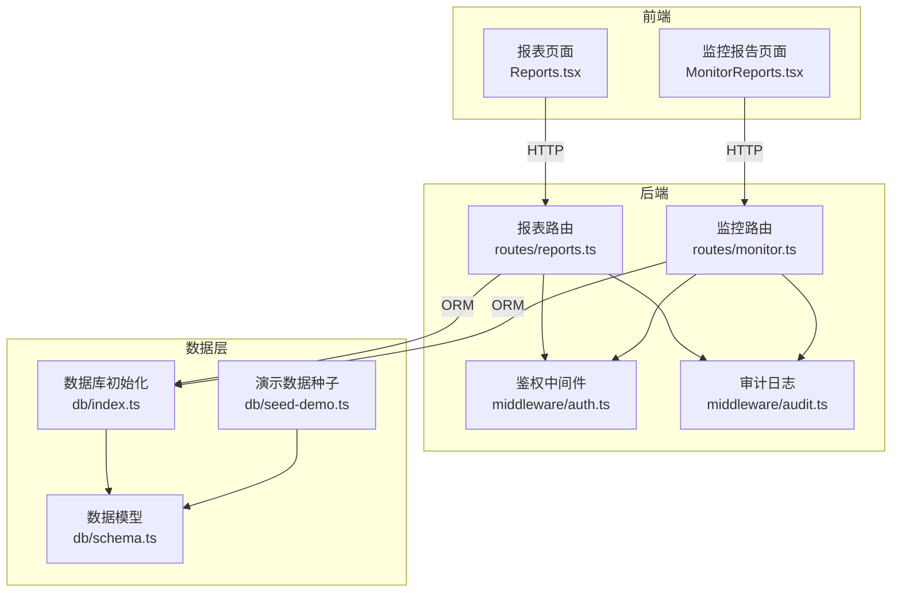
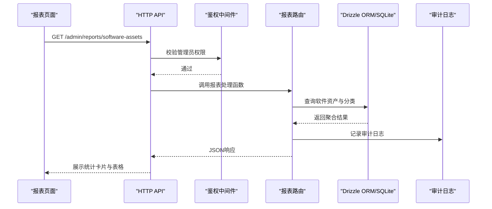
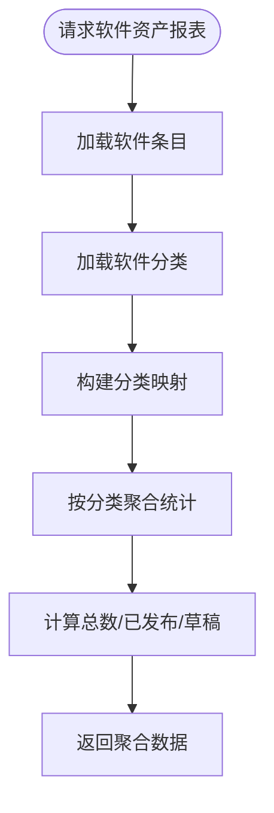
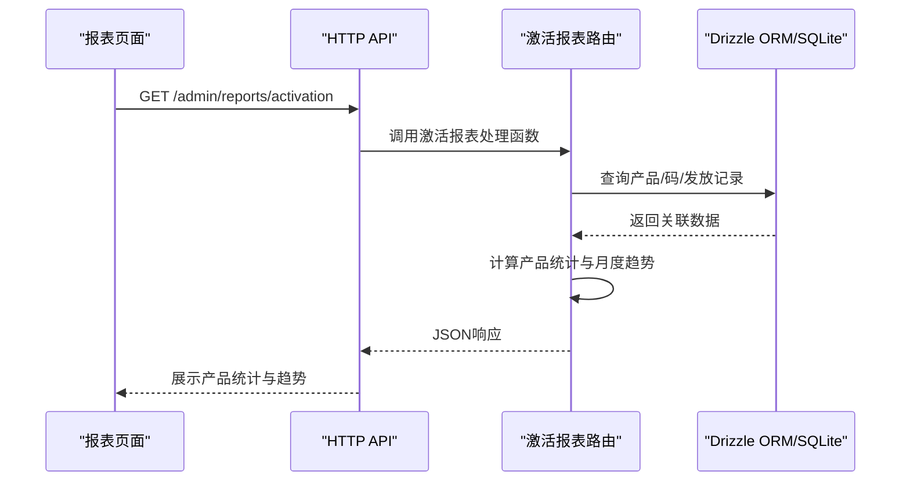
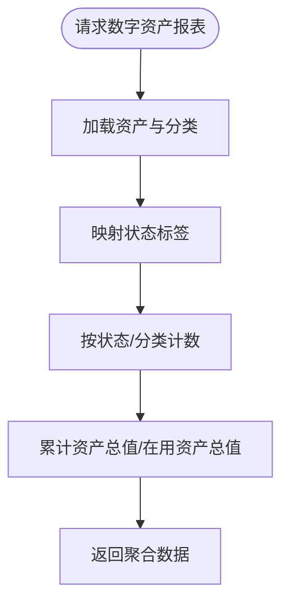
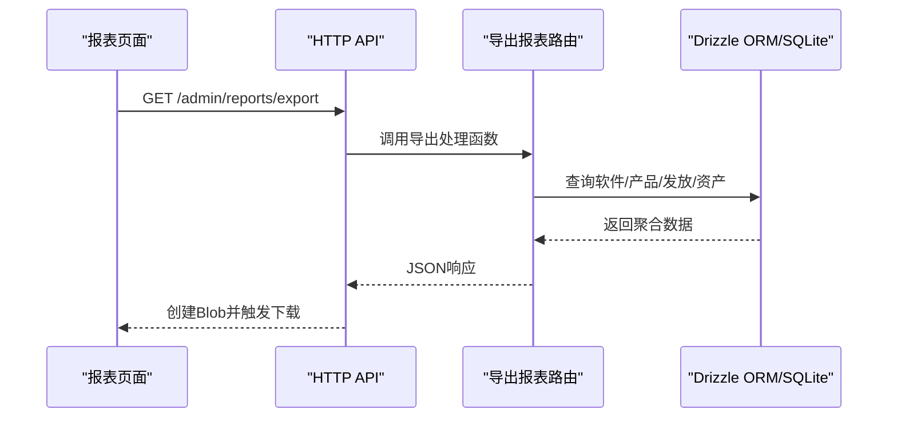
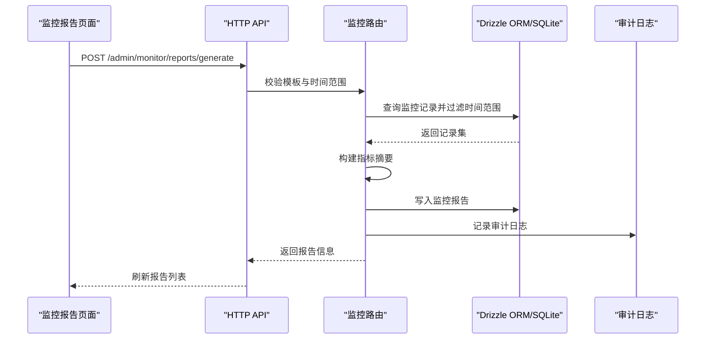
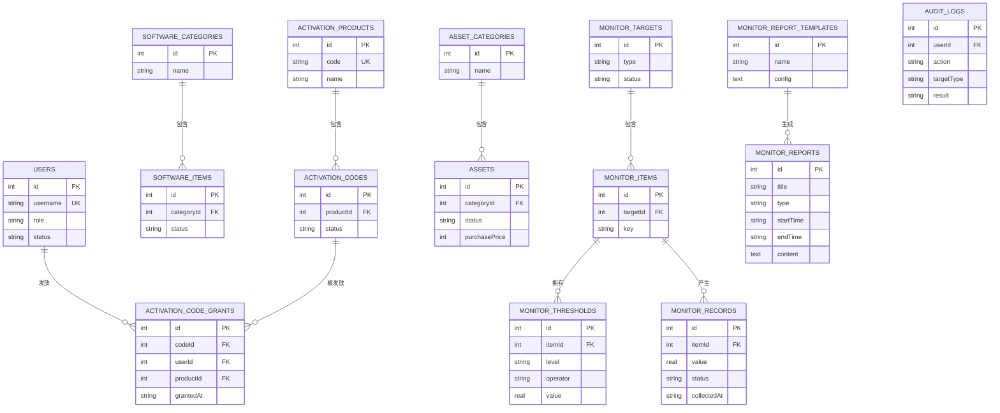
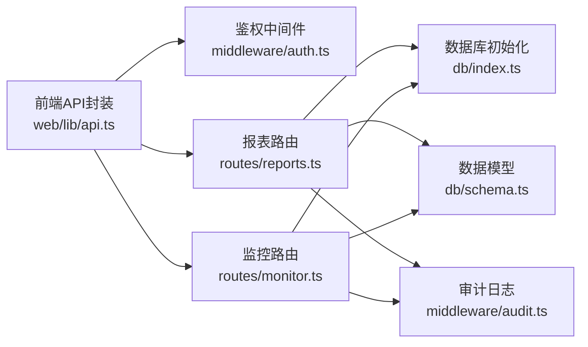

# 报表统计

<cite>
**本文引用的文件**
- [apps/server/src/routes/reports.ts](file://apps/server/src/routes/reports.ts)
- [apps/web/src/pages/admin/Reports.tsx](file://apps/web/src/pages/admin/Reports.tsx)
- [apps/server/src/db/schema.ts](file://apps/server/src/db/schema.ts)
- [apps/server/src/middleware/audit.ts](file://apps/server/src/middleware/audit.ts)
- [apps/server/src/middleware/auth.ts](file://apps/server/src/middleware/auth.ts)
- [apps/server/src/db/index.ts](file://apps/server/src/db/index.ts)
- [apps/web/src/lib/api.ts](file://apps/web/src/lib/api.ts)
- [apps/server/src/routes/monitor.ts](file://apps/server/src/routes/monitor.ts)
- [apps/web/src/pages/admin/MonitorReports.tsx](file://apps/web/src/pages/admin/MonitorReports.tsx)
- [apps/server/src/db/seed-demo.ts](file://apps/server/src/db/seed-demo.ts)
</cite>

## 目录
1. [简介](#简介)
2. [项目结构](#项目结构)
3. [核心组件](#核心组件)
4. [架构总览](#架构总览)
5. [详细组件分析](#详细组件分析)
6. [依赖关系分析](#依赖关系分析)
7. [性能考虑](#性能考虑)
8. [故障排查指南](#故障排查指南)
9. [结论](#结论)
10. [附录](#附录)

## 简介
本文件系统性梳理了报表统计功能的设计与实现，覆盖用户统计、软件使用统计、财务报表、运营分析报表四大类报表，并详细说明报表的生成与导出、时间范围选择、数据筛选、格式转换、模板管理、实时数据更新机制、趋势与对比分析、异常检测、性能优化与数据安全保护等。报表系统由前端页面、后端接口与SQLite数据库三层组成，采用Drizzle ORM进行数据建模与查询，结合审计日志保障可追溯性。

## 项目结构
报表统计功能主要分布在以下位置：
- 后端路由层：负责报表接口、鉴权与审计日志记录
- 数据模型层：定义软件资产、激活码、数字资产、监控报告等实体
- 前端页面层：提供报表展示与导出交互界面
- 数据库层：SQLite 存储与 WAL 模式、外键约束

图表来源
- [apps/server/src/routes/reports.ts:1-146](file://apps/server/src/routes/reports.ts#L1-L146)
- [apps/server/src/routes/monitor.ts:1-595](file://apps/server/src/routes/monitor.ts#L1-L595)
- [apps/server/src/middleware/auth.ts:1-56](file://apps/server/src/middleware/auth.ts#L1-L56)
- [apps/server/src/middleware/audit.ts:1-28](file://apps/server/src/middleware/audit.ts#L1-L28)
- [apps/server/src/db/index.ts:1-16](file://apps/server/src/db/index.ts#L1-L16)
- [apps/server/src/db/schema.ts:1-330](file://apps/server/src/db/schema.ts#L1-L330)
- [apps/web/src/pages/admin/Reports.tsx:1-138](file://apps/web/src/pages/admin/Reports.tsx#L1-L138)
- [apps/web/src/pages/admin/MonitorReports.tsx:1-189](file://apps/web/src/pages/admin/MonitorReports.tsx#L1-L189)

章节来源
- [apps/server/src/routes/reports.ts:1-146](file://apps/server/src/routes/reports.ts#L1-L146)
- [apps/server/src/routes/monitor.ts:1-595](file://apps/server/src/routes/monitor.ts#L1-L595)
- [apps/server/src/db/schema.ts:1-330](file://apps/server/src/db/schema.ts#L1-L330)
- [apps/server/src/db/index.ts:1-16](file://apps/server/src/db/index.ts#L1-L16)
- [apps/web/src/pages/admin/Reports.tsx:1-138](file://apps/web/src/pages/admin/Reports.tsx#L1-L138)
- [apps/web/src/pages/admin/MonitorReports.tsx:1-189](file://apps/web/src/pages/admin/MonitorReports.tsx#L1-L189)

## 核心组件
- 报表路由与聚合接口：提供软件资产、激活码使用、数字资产三类报表的聚合数据接口；提供导出接口一次性返回多类报表数据。
- 监控报告与模板：提供监控仪表盘、报告生成、模板管理、审计日志统计等功能。
- 鉴权与审计：基于会话的管理员权限控制，以及对报表相关操作的审计日志记录。
- 数据模型：围绕软件、激活码、资产、监控指标、报告模板等实体建立关系模型。
- 前端页面：报表页面展示三类报表的统计卡片与表格，支持导出为JSON；监控报告页面支持模板管理与报告生成。

章节来源
- [apps/server/src/routes/reports.ts:9-144](file://apps/server/src/routes/reports.ts#L9-L144)
- [apps/server/src/routes/monitor.ts:321-453](file://apps/server/src/routes/monitor.ts#L321-L453)
- [apps/server/src/middleware/auth.ts:48-55](file://apps/server/src/middleware/auth.ts#L48-L55)
- [apps/server/src/middleware/audit.ts:3-27](file://apps/server/src/middleware/audit.ts#L3-L27)
- [apps/server/src/db/schema.ts:37-170](file://apps/server/src/db/schema.ts#L37-L170)
- [apps/web/src/pages/admin/Reports.tsx:8-137](file://apps/web/src/pages/admin/Reports.tsx#L8-L137)

## 架构总览
报表系统遵循“前端页面—后端路由—数据库”的分层架构。前端通过API发起请求，后端路由在鉴权中间件校验后执行业务逻辑，使用Drizzle ORM访问SQLite数据库，最终返回JSON响应。审计中间件对关键操作进行记录，便于追踪与合规。

图表来源
- [apps/web/src/pages/admin/Reports.tsx:14-25](file://apps/web/src/pages/admin/Reports.tsx#L14-L25)
- [apps/server/src/middleware/auth.ts:48-55](file://apps/server/src/middleware/auth.ts#L48-L55)
- [apps/server/src/routes/reports.ts:9-34](file://apps/server/src/routes/reports.ts#L9-L34)
- [apps/server/src/middleware/audit.ts:14-27](file://apps/server/src/middleware/audit.ts#L14-L27)

## 详细组件分析

### 软件资产报表
- 设计理念：按分类统计软件总数、已发布与草稿数量，辅助资产盘点与合规管理。
- 数据来源：软件条目与软件分类表，通过关联查询构建分类映射与计数。
- 时间范围：当前实现为全量统计，未内置时间范围参数。
- 导出能力：导出接口可同时输出软件清单、激活产品、激活发放明细与数字资产，便于统一归档。
- 前端展示：统计卡片与表格，支持按分类查看发布状态分布。

图表来源
- [apps/server/src/routes/reports.ts:9-34](file://apps/server/src/routes/reports.ts#L9-L34)

章节来源
- [apps/server/src/routes/reports.ts:9-34](file://apps/server/src/routes/reports.ts#L9-L34)
- [apps/web/src/pages/admin/Reports.tsx:46-68](file://apps/web/src/pages/admin/Reports.tsx#L46-L68)

### 激活码使用报表
- 设计理念：评估激活产品的发放效率与使用率，支持月度趋势分析。
- 数据来源：激活产品、激活码、激活发放记录，通过左连接获取用户名与产品名。
- 统计维度：按产品统计码总量、可用、已发放、已作废与使用率；月度发放趋势按发放时间年月聚合。
- 导出能力：导出接口包含激活发放明细（含用户名、产品名、发放时间）。
- 前端展示：统计卡片、产品维度表格与月度趋势表格。

图表来源
- [apps/server/src/routes/reports.ts:36-74](file://apps/server/src/routes/reports.ts#L36-L74)
- [apps/web/src/pages/admin/Reports.tsx:70-102](file://apps/web/src/pages/admin/Reports.tsx#L70-L102)

章节来源
- [apps/server/src/routes/reports.ts:36-74](file://apps/server/src/routes/reports.ts#L36-L74)
- [apps/web/src/pages/admin/Reports.tsx:70-102](file://apps/web/src/pages/admin/Reports.tsx#L70-L102)

### 数字资产报表
- 设计理念：统计资产总数、按状态与分类分布、资产总值与在用资产总值，支撑财务与运维分析。
- 数据来源：资产与资产分类表，状态标签映射，按状态累加价值。
- 导出能力：导出接口包含资产清单，便于财务对账与审计。
- 前端展示：统计卡片与按状态/分类的表格。

图表来源
- [apps/server/src/routes/reports.ts:76-111](file://apps/server/src/routes/reports.ts#L76-L111)

章节来源
- [apps/server/src/routes/reports.ts:76-111](file://apps/server/src/routes/reports.ts#L76-L111)
- [apps/web/src/pages/admin/Reports.tsx:104-133](file://apps/web/src/pages/admin/Reports.tsx#L104-L133)

### 报表导出与格式转换
- 导出入口：导出接口一次性返回软件、激活产品、激活发放明细与数字资产，便于统一归档。
- 格式：当前导出为JSON字符串，前端以Blob形式下载。
- 时间范围：导出接口未内置时间范围参数，若需按时间段导出，可在前端或后端增加过滤条件。

图表来源
- [apps/server/src/routes/reports.ts:113-144](file://apps/server/src/routes/reports.ts#L113-L144)
- [apps/web/src/pages/admin/Reports.tsx:27-37](file://apps/web/src/pages/admin/Reports.tsx#L27-L37)

章节来源
- [apps/server/src/routes/reports.ts:113-144](file://apps/server/src/routes/reports.ts#L113-L144)
- [apps/web/src/pages/admin/Reports.tsx:27-37](file://apps/web/src/pages/admin/Reports.tsx#L27-L37)

### 监控报告与模板管理
- 报告生成：根据模板配置与时间范围收集监控记录，构建指标摘要（最小值、最大值、平均值、告警计数），写入监控报告表。
- 模板管理：支持增删改查模板，模板配置为JSON，包含指标集合与显示方式。
- 前端交互：支持选择模板、设置时间范围、生成报告、查看报告列表与详情、删除报告；支持新增/编辑模板、删除模板。

图表来源
- [apps/server/src/routes/monitor.ts:332-391](file://apps/server/src/routes/monitor.ts#L332-L391)
- [apps/web/src/pages/admin/MonitorReports.tsx:52-64](file://apps/web/src/pages/admin/MonitorReports.tsx#L52-L64)

章节来源
- [apps/server/src/routes/monitor.ts:321-453](file://apps/server/src/routes/monitor.ts#L321-L453)
- [apps/web/src/pages/admin/MonitorReports.tsx:1-189](file://apps/web/src/pages/admin/MonitorReports.tsx#L1-L189)

### 数据模型与实体关系
报表涉及的核心实体包括：用户、软件条目、软件分类、激活产品、激活码、激活发放、资产、资产分类、监控目标、监控项、监控阈值、监控记录、监控报告、监控报告模板、审计日志等。这些实体通过外键关联形成清晰的关系模型，支撑报表统计与导出。

图表来源
- [apps/server/src/db/schema.ts:3-330](file://apps/server/src/db/schema.ts#L3-L330)

章节来源
- [apps/server/src/db/schema.ts:3-330](file://apps/server/src/db/schema.ts#L3-L330)

### 报表分析功能
- 趋势分析：激活码月度发放趋势按年月聚合，可用于观察发放节奏与促销活动效果。
- 对比分析：软件资产按分类对比总数、已发布与草稿，资产按状态与分类对比数量，便于资源分配与预算规划。
- 异常检测：监控报告中的告警计数与状态分布可用于识别异常波动；阈值规则支持告警级别与持续时长配置。

章节来源
- [apps/server/src/routes/reports.ts:58-74](file://apps/server/src/routes/reports.ts#L58-L74)
- [apps/server/src/routes/reports.ts:82-98](file://apps/server/src/routes/reports.ts#L82-L98)
- [apps/server/src/routes/monitor.ts:166-214](file://apps/server/src/routes/monitor.ts#L166-L214)

## 依赖关系分析
- 前端依赖：Ant Design UI组件、Axios HTTP客户端、Day.js日期处理。
- 后端依赖：Fastify Web框架、Drizzle ORM、better-sqlite3、SQLite。
- 中间件：鉴权中间件（会话加载与管理员校验）、审计中间件（统一记录审计日志）。
- 数据库：SQLite WAL模式、外键约束，确保并发写入与数据一致性。

图表来源
- [apps/web/src/lib/api.ts:1-16](file://apps/web/src/lib/api.ts#L1-L16)
- [apps/server/src/middleware/auth.ts:1-56](file://apps/server/src/middleware/auth.ts#L1-L56)
- [apps/server/src/routes/reports.ts:1-146](file://apps/server/src/routes/reports.ts#L1-L146)
- [apps/server/src/routes/monitor.ts:1-595](file://apps/server/src/routes/monitor.ts#L1-L595)
- [apps/server/src/db/index.ts:1-16](file://apps/server/src/db/index.ts#L1-L16)
- [apps/server/src/db/schema.ts:1-330](file://apps/server/src/db/schema.ts#L1-L330)
- [apps/server/src/middleware/audit.ts:1-28](file://apps/server/src/middleware/audit.ts#L1-L28)

章节来源
- [apps/web/src/lib/api.ts:1-16](file://apps/web/src/lib/api.ts#L1-L16)
- [apps/server/src/middleware/auth.ts:1-56](file://apps/server/src/middleware/auth.ts#L1-L56)
- [apps/server/src/routes/reports.ts:1-146](file://apps/server/src/routes/reports.ts#L1-L146)
- [apps/server/src/routes/monitor.ts:1-595](file://apps/server/src/routes/monitor.ts#L1-L595)
- [apps/server/src/db/index.ts:1-16](file://apps/server/src/db/index.ts#L1-L16)
- [apps/server/src/db/schema.ts:1-330](file://apps/server/src/db/schema.ts#L1-L330)
- [apps/server/src/middleware/audit.ts:1-28](file://apps/server/src/middleware/audit.ts#L1-L28)

## 性能考虑
- 数据库优化
  - WAL模式：启用WAL模式提升并发写入性能，减少锁竞争。
  - 外键约束：开启外键约束保证数据一致性，避免脏数据影响报表准确性。
  - 分页查询：监控路由对目标、项、记录、告警等列表查询均采用分页，避免一次性加载大量数据。
- 查询优化
  - 聚合统计：报表路由在内存中进行聚合与计数，避免复杂SQL子查询。
  - 关联查询：激活报表使用左连接获取用户名与产品名，减少多次查询。
- 前端优化
  - 并发请求：报表页面并发拉取三类报表数据，缩短首屏等待时间。
  - 导出：导出接口一次性返回多类数据，减少多次请求。
- 可扩展性
  - 模板化监控报告：通过模板配置灵活组合指标与展示方式，便于扩展新的报表类型。
  - 审计日志：统一记录报表相关操作，便于问题追踪与审计。

章节来源
- [apps/server/src/db/index.ts:10-12](file://apps/server/src/db/index.ts#L10-L12)
- [apps/server/src/routes/monitor.ts:7-11](file://apps/server/src/routes/monitor.ts#L7-L11)
- [apps/web/src/pages/admin/Reports.tsx:14-25](file://apps/web/src/pages/admin/Reports.tsx#L14-L25)

## 故障排查指南
- 权限错误
  - 现象：返回401未登录或403权限不足。
  - 排查：确认管理员会话是否有效，检查鉴权中间件逻辑。
- 报表为空或数据不一致
  - 现象：报表统计为0或与预期不符。
  - 排查：检查数据模型与关联关系，确认分类映射与状态枚举；验证导出接口是否正确聚合。
- 监控报告生成失败
  - 现象：生成接口返回错误或报告未入库。
  - 排查：确认模板ID与时间范围参数；检查监控记录是否存在且在时间范围内；查看审计日志定位问题。
- 导出文件异常
  - 现象：导出文件无法打开或内容为空。
  - 排查：确认导出接口返回的数据结构；检查前端Blob创建与下载逻辑；验证文件名与MIME类型。

章节来源
- [apps/server/src/middleware/auth.ts:42-55](file://apps/server/src/middleware/auth.ts#L42-L55)
- [apps/server/src/routes/reports.ts:113-144](file://apps/server/src/routes/reports.ts#L113-L144)
- [apps/server/src/routes/monitor.ts:332-391](file://apps/server/src/routes/monitor.ts#L332-L391)
- [apps/web/src/pages/admin/Reports.tsx:27-37](file://apps/web/src/pages/admin/Reports.tsx#L27-L37)

## 结论
报表统计功能以清晰的数据模型与简洁的路由设计为基础，结合前端直观的可视化展示与审计日志的可追溯性，实现了软件资产、激活码使用、数字资产与监控报告的多维度统计分析。通过模板化与导出能力，系统既满足日常运营分析需求，也为财务与合规审计提供了可靠的数据支撑。未来可在时间范围筛选、增量更新与缓存策略方面进一步优化，以提升大数据量场景下的性能与用户体验。

## 附录
- 演示数据：种子脚本包含监控记录与报告模板示例，便于快速验证报表生成与展示。
- 审计范围：报表相关的关键操作（创建、更新、删除、导出）均记录在审计日志中，便于追踪与审计。

章节来源
- [apps/server/src/db/seed-demo.ts:1336-1463](file://apps/server/src/db/seed-demo.ts#L1336-L1463)
- [apps/server/src/middleware/audit.ts:14-27](file://apps/server/src/middleware/audit.ts#L14-L27)