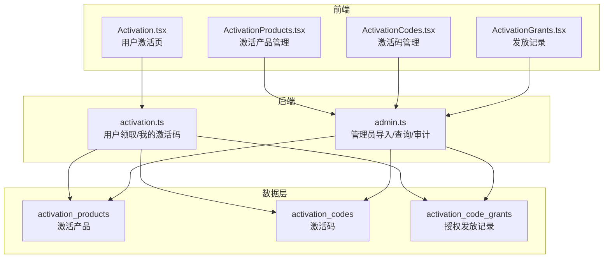
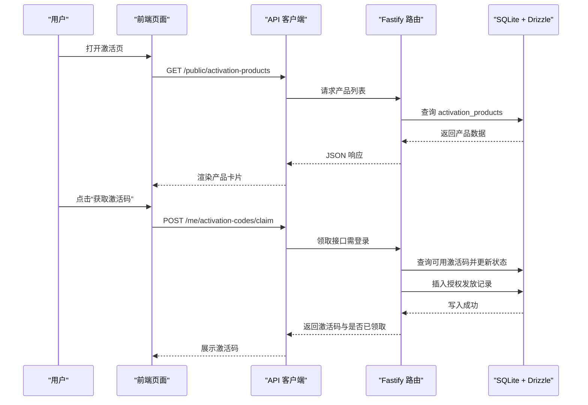
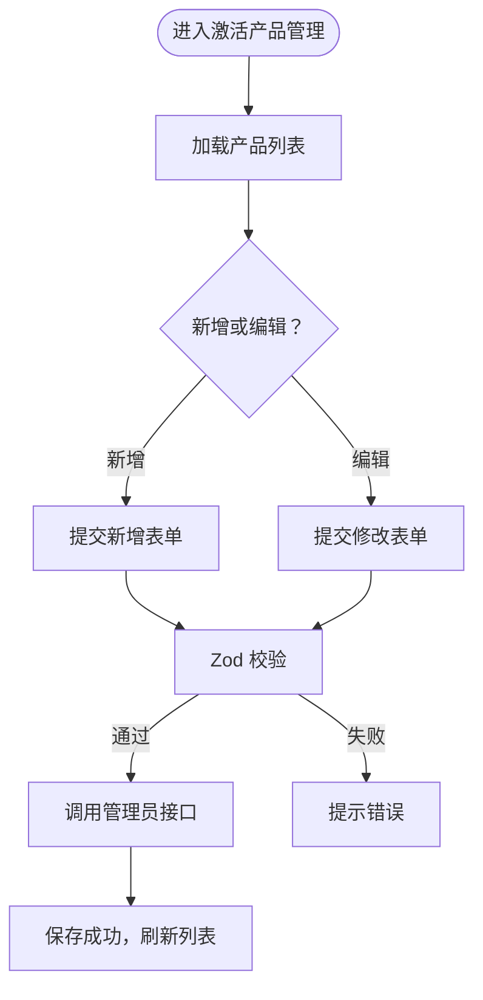
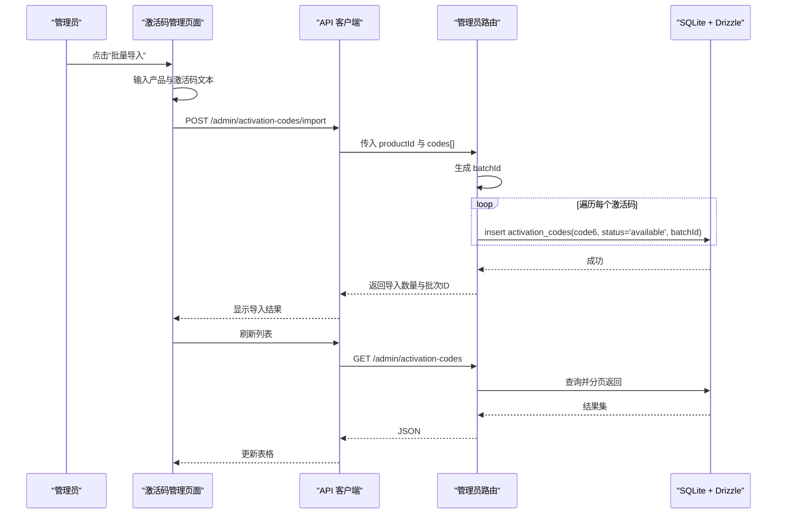
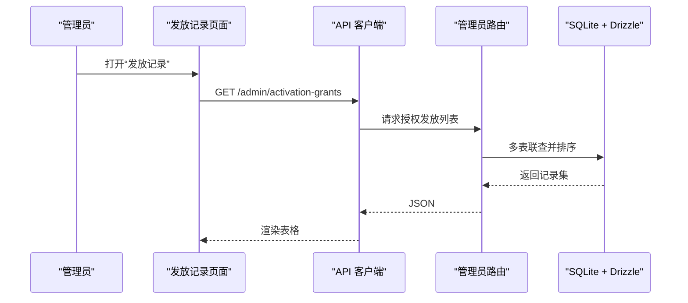
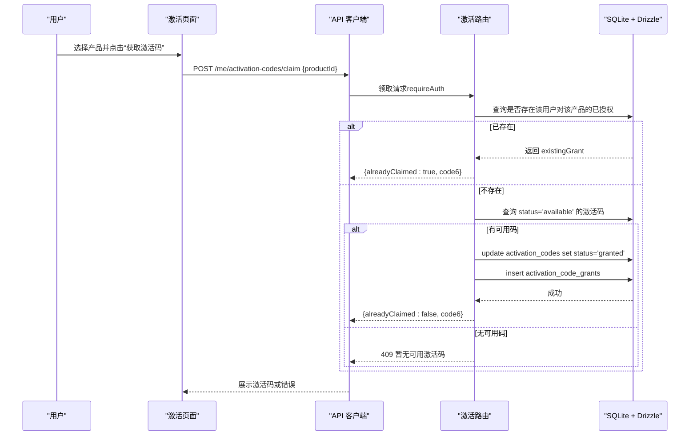
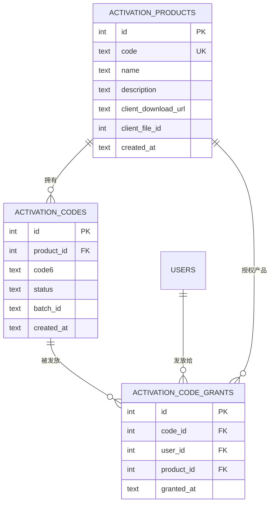
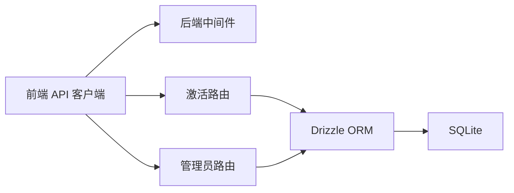

# 激活管理

<cite>
**本文引用的文件**
- [apps/server/src/routes/activation.ts](file://apps/server/src/routes/activation.ts)
- [apps/server/src/routes/admin.ts](file://apps/server/src/routes/admin.ts)
- [apps/server/src/db/schema.ts](file://apps/server/src/db/schema.ts)
- [apps/web/src/pages/admin/ActivationProducts.tsx](file://apps/web/src/pages/admin/ActivationProducts.tsx)
- [apps/web/src/pages/admin/ActivationCodes.tsx](file://apps/web/src/pages/admin/ActivationCodes.tsx)
- [apps/web/src/pages/admin/ActivationGrants.tsx](file://apps/web/src/pages/admin/ActivationGrants.tsx)
- [apps/web/src/pages/Activation.tsx](file://apps/web/src/pages/Activation.tsx)
- [apps/web/src/lib/api.ts](file://apps/web/src/lib/api.ts)
- [packages/shared/src/schemas.ts](file://packages/shared/src/schemas.ts)
- [apps/server/drizzle/meta/0000_snapshot.json](file://apps/server/drizzle/meta/0000_snapshot.json)
- [apps/server/drizzle/meta/0001_snapshot.json](file://apps/server/drizzle/meta/0001_snapshot.json)
- [apps/server/drizzle/meta/0002_snapshot.json](file://apps/server/drizzle/meta/0002_snapshot.json)
</cite>

## 目录
1. [简介](#简介)
2. [项目结构](#项目结构)
3. [核心组件](#核心组件)
4. [架构总览](#架构总览)
5. [详细组件分析](#详细组件分析)
6. [依赖关系分析](#依赖关系分析)
7. [性能考量](#性能考量)
8. [故障排查指南](#故障排查指南)
9. [结论](#结论)
10. [附录](#附录)

## 简介
本文件系统性阐述激活管理功能的设计与实现，覆盖激活产品的创建与配置、授权规则与有效期策略、激活码的生成与管理（含批量导入）、授权发放与审计、使用状态追踪与撤销机制，以及安全防护（防重复使用、防篡改、防泄漏）。同时提供最佳实践与风险控制建议，并基于现有代码实现路径进行可视化说明。

## 项目结构
激活管理由“前端页面 + 后端接口 + 数据模型”三层构成：
- 前端：管理员侧的“激活产品管理”“激活码管理”“激活码发放记录”，以及用户侧“激活页面”
- 后端：激活相关路由（用户领取、管理员导入/查询/审计）
- 数据层：激活产品、激活码、授权发放三张表及关联关系

图表来源
- [apps/web/src/pages/admin/ActivationProducts.tsx:1-66](file://apps/web/src/pages/admin/ActivationProducts.tsx#L1-L66)
- [apps/web/src/pages/admin/ActivationCodes.tsx:1-74](file://apps/web/src/pages/admin/ActivationCodes.tsx#L1-L74)
- [apps/web/src/pages/admin/ActivationGrants.tsx:1-27](file://apps/web/src/pages/admin/ActivationGrants.tsx#L1-L27)
- [apps/web/src/pages/Activation.tsx:1-98](file://apps/web/src/pages/Activation.tsx#L1-L98)
- [apps/server/src/routes/activation.ts:1-95](file://apps/server/src/routes/activation.ts#L1-L95)
- [apps/server/src/routes/admin.ts:1-279](file://apps/server/src/routes/admin.ts#L1-L279)
- [apps/server/src/db/schema.ts:71-96](file://apps/server/src/db/schema.ts#L71-L96)

章节来源
- [apps/web/src/pages/admin/ActivationProducts.tsx:1-66](file://apps/web/src/pages/admin/ActivationProducts.tsx#L1-L66)
- [apps/web/src/pages/admin/ActivationCodes.tsx:1-74](file://apps/web/src/pages/admin/ActivationCodes.tsx#L1-L74)
- [apps/web/src/pages/admin/ActivationGrants.tsx:1-27](file://apps/web/src/pages/admin/ActivationGrants.tsx#L1-L27)
- [apps/web/src/pages/Activation.tsx:1-98](file://apps/web/src/pages/Activation.tsx#L1-L98)
- [apps/server/src/routes/activation.ts:1-95](file://apps/server/src/routes/activation.ts#L1-L95)
- [apps/server/src/routes/admin.ts:1-279](file://apps/server/src/routes/admin.ts#L1-L279)
- [apps/server/src/db/schema.ts:71-96](file://apps/server/src/db/schema.ts#L71-L96)

## 核心组件
- 激活产品（activation_products）
  - 字段：编码、名称、描述、客户端下载地址、客户端文件ID、创建时间
  - 用途：定义可激活的软件产品，作为激活码的归属对象
- 激活码（activation_codes）
  - 字段：所属产品、6位激活码、状态（可用/已发放/已作废）、批次ID、创建时间
  - 用途：承载实际的激活凭证；支持按产品筛选与分页查询
- 授权发放（activation_code_grants）
  - 字段：关联激活码、用户、产品、发放时间
  - 用途：记录“谁在何时为哪个产品领取了哪个激活码”的审计事实

章节来源
- [apps/server/src/db/schema.ts:71-96](file://apps/server/src/db/schema.ts#L71-L96)
- [apps/server/drizzle/meta/0000_snapshot.json:160-242](file://apps/server/drizzle/meta/0000_snapshot.json#L160-L242)
- [apps/server/drizzle/meta/0001_snapshot.json:160-242](file://apps/server/drizzle/meta/0001_snapshot.json#L160-L242)
- [apps/server/drizzle/meta/0002_snapshot.json:160-242](file://apps/server/drizzle/meta/0002_snapshot.json#L160-L242)

## 架构总览
激活系统采用前后端分离设计：
- 前端通过统一的 API 客户端发起请求
- 后端使用 Fastify 提供 REST 接口，Drizzle ORM 访问 SQLite
- 数据模型以三张表为核心，通过外键建立关联

图表来源
- [apps/web/src/pages/Activation.tsx:31-46](file://apps/web/src/pages/Activation.tsx#L31-L46)
- [apps/web/src/lib/api.ts:1-16](file://apps/web/src/lib/api.ts#L1-L16)
- [apps/server/src/routes/activation.ts:8-75](file://apps/server/src/routes/activation.ts#L8-L75)
- [apps/server/src/db/schema.ts:71-96](file://apps/server/src/db/schema.ts#L71-L96)

## 详细组件分析

### 组件一：激活产品管理（管理员）
- 功能点
  - 新增/编辑激活产品，填写产品编码、名称、描述、客户端下载链接等
  - 列表展示产品信息，支持快速编辑
- 关键实现
  - 前端调用管理员路由：POST/PUT/PATCH 对应产品管理接口
  - 后端使用 Zod 校验请求体，写入 activation_products 表
- 使用场景
  - 为不同软件产品建立激活入口，便于后续绑定激活码与发放

图表来源
- [apps/web/src/pages/admin/ActivationProducts.tsx:17-27](file://apps/web/src/pages/admin/ActivationProducts.tsx#L17-L27)
- [apps/server/src/routes/admin.ts:142-158](file://apps/server/src/routes/admin.ts#L142-L158)
- [packages/shared/src/schemas.ts:41-46](file://packages/shared/src/schemas.ts#L41-L46)

章节来源
- [apps/web/src/pages/admin/ActivationProducts.tsx:1-66](file://apps/web/src/pages/admin/ActivationProducts.tsx#L1-L66)
- [apps/server/src/routes/admin.ts:142-158](file://apps/server/src/routes/admin.ts#L142-L158)
- [packages/shared/src/schemas.ts:41-46](file://packages/shared/src/schemas.ts#L41-L46)

### 组件二：激活码管理（管理员）
- 功能点
  - 分页列出激活码，按产品筛选，显示状态、批次、创建时间
  - 批量导入：将逗号/分号/换行分隔的6位激活码导入到指定产品下
- 关键实现
  - 列表接口支持分页与按产品过滤
  - 导入接口校验参数，逐条插入 activation_codes，统一生成批次ID
- 使用场景
  - 快速批量生成与入库激活码，便于后续发放与审计

图表来源
- [apps/web/src/pages/admin/ActivationCodes.tsx:31-43](file://apps/web/src/pages/admin/ActivationCodes.tsx#L31-L43)
- [apps/server/src/routes/admin.ts:161-197](file://apps/server/src/routes/admin.ts#L161-L197)
- [apps/server/src/db/schema.ts:81-88](file://apps/server/src/db/schema.ts#L81-L88)

章节来源
- [apps/web/src/pages/admin/ActivationCodes.tsx:1-74](file://apps/web/src/pages/admin/ActivationCodes.tsx#L1-L74)
- [apps/server/src/routes/admin.ts:161-197](file://apps/server/src/routes/admin.ts#L161-L197)

### 组件三：激活授权发放与审计（管理员）
- 功能点
  - 查看所有授权发放记录，包含用户、产品、激活码、发放时间
- 关键实现
  - 后端联表查询 activation_code_grants + activation_codes + users + activation_products
  - 支持按时间倒序排序，便于审计追踪

图表来源
- [apps/web/src/pages/admin/ActivationGrants.tsx:9-11](file://apps/web/src/pages/admin/ActivationGrants.tsx#L9-L11)
- [apps/server/src/routes/admin.ts:199-219](file://apps/server/src/routes/admin.ts#L199-L219)

章节来源
- [apps/web/src/pages/admin/ActivationGrants.tsx:1-27](file://apps/web/src/pages/admin/ActivationGrants.tsx#L1-L27)
- [apps/server/src/routes/admin.ts:199-219](file://apps/server/src/routes/admin.ts#L199-L219)

### 组件四：用户激活码领取（用户）
- 功能点
  - 登录后为指定产品领取激活码，若已领取则返回已有激活码
- 关键实现
  - 用户端调用 /me/activation-codes/claim，携带 productId
  - 后端幂等检查：同一用户对同一产品仅允许一次有效授权
  - 后端原子性：先锁定并更新激活码状态为“已发放”，再插入授权发放记录
- 安全要点
  - 需登录态（requireAuth）
  - 幂等性避免重复发放
  - 状态机约束（available → granted）

图表来源
- [apps/web/src/pages/Activation.tsx:35-46](file://apps/web/src/pages/Activation.tsx#L35-L46)
- [apps/server/src/routes/activation.ts:8-75](file://apps/server/src/routes/activation.ts#L8-L75)
- [packages/shared/src/schemas.ts:48-50](file://packages/shared/src/schemas.ts#L48-L50)

章节来源
- [apps/web/src/pages/Activation.tsx:1-98](file://apps/web/src/pages/Activation.tsx#L1-L98)
- [apps/server/src/routes/activation.ts:1-95](file://apps/server/src/routes/activation.ts#L1-L95)
- [packages/shared/src/schemas.ts:48-50](file://packages/shared/src/schemas.ts#L48-L50)

### 组件五：数据模型与关系
- 表关系
  - activation_products.id → activation_codes.product_id
  - activation_codes.id → activation_code_grants.code_id
  - users.id → activation_code_grants.user_id
  - activation_products.id → activation_code_grants.product_id

图表来源
- [apps/server/src/db/schema.ts:71-96](file://apps/server/src/db/schema.ts#L71-L96)
- [apps/server/drizzle/meta/0000_snapshot.json:160-242](file://apps/server/drizzle/meta/0000_snapshot.json#L160-L242)
- [apps/server/drizzle/meta/0001_snapshot.json:160-242](file://apps/server/drizzle/meta/0001_snapshot.json#L160-L242)
- [apps/server/drizzle/meta/0002_snapshot.json:160-242](file://apps/server/drizzle/meta/0002_snapshot.json#L160-L242)

章节来源
- [apps/server/src/db/schema.ts:71-96](file://apps/server/src/db/schema.ts#L71-L96)
- [apps/server/drizzle/meta/0000_snapshot.json:160-242](file://apps/server/drizzle/meta/0000_snapshot.json#L160-L242)
- [apps/server/drizzle/meta/0001_snapshot.json:160-242](file://apps/server/drizzle/meta/0001_snapshot.json#L160-L242)
- [apps/server/drizzle/meta/0002_snapshot.json:160-242](file://apps/server/drizzle/meta/0002_snapshot.json#L160-L242)

## 依赖关系分析
- 前端依赖
  - API 客户端：统一基地址与凭据传递
  - 页面组件：调用管理员与公共接口
- 后端依赖
  - Drizzle ORM：类型化 SQL 构建与执行
  - Zod：请求体校验
  - 中间件：鉴权与审计
- 数据依赖
  - 外键约束保证数据一致性
  - 索引与唯一约束（产品编码）提升查询效率

图表来源
- [apps/web/src/lib/api.ts:1-16](file://apps/web/src/lib/api.ts#L1-L16)
- [apps/server/src/routes/activation.ts:1-95](file://apps/server/src/routes/activation.ts#L1-L95)
- [apps/server/src/routes/admin.ts:1-279](file://apps/server/src/routes/admin.ts#L1-L279)

章节来源
- [apps/web/src/lib/api.ts:1-16](file://apps/web/src/lib/api.ts#L1-L16)
- [apps/server/src/routes/activation.ts:1-95](file://apps/server/src/routes/activation.ts#L1-L95)
- [apps/server/src/routes/admin.ts:1-279](file://apps/server/src/routes/admin.ts#L1-L279)

## 性能考量
- 查询优化
  - 激活码列表按产品过滤与分页，避免一次性拉取大量数据
  - 授权发放记录按时间倒序，利于审计
- 写入优化
  - 批量导入时逐条插入，建议在高并发场景考虑事务包裹与批量插入（当前实现逐条写入）
- 存储与索引
  - 产品编码唯一索引，减少重复录入带来的查询成本
  - 激活码状态字段用于快速筛选可用码

[本节为通用性能建议，不直接分析具体文件]

## 故障排查指南
- 常见问题
  - “暂无可用激活码”：确认管理员是否已导入激活码且状态为“可用”
  - “重复领取”：系统具备幂等保护，同一用户对同一产品不会重复发放
  - “导入失败”：检查激活码格式是否为6位字符，产品ID是否正确
- 审计与定位
  - 通过“发放记录”页面核对授权发放详情
  - 通过“激活码管理”页面核对激活码状态与批次

章节来源
- [apps/server/src/routes/activation.ts:22-42](file://apps/server/src/routes/activation.ts#L22-L42)
- [apps/server/src/routes/admin.ts:178-197](file://apps/server/src/routes/admin.ts#L178-L197)
- [apps/web/src/pages/admin/ActivationGrants.tsx:1-27](file://apps/web/src/pages/admin/ActivationGrants.tsx#L1-L27)
- [apps/web/src/pages/admin/ActivationCodes.tsx:1-74](file://apps/web/src/pages/admin/ActivationCodes.tsx#L1-L74)

## 结论
激活管理系统以简洁的数据模型与清晰的业务流程实现了从产品配置、激活码入库、用户领取到授权审计的完整闭环。通过幂等检查与状态机约束，系统在易用性与安全性之间取得平衡。建议在高并发场景下进一步优化导入与查询性能，并持续完善安全与合规能力。

[本节为总结性内容，不直接分析具体文件]

## 附录

### A. 激活码格式与有效期
- 激活码格式
  - 6位字符，导入时会去除空白并校验长度
- 有效期管理
  - 当前代码未体现显式有效期字段与到期逻辑；如需有效期，可在 activation_codes 表新增到期时间字段并在前端与后端进行校验

章节来源
- [apps/server/src/routes/admin.ts:178-197](file://apps/server/src/routes/admin.ts#L178-L197)
- [apps/web/src/pages/admin/ActivationCodes.tsx:31-43](file://apps/web/src/pages/admin/ActivationCodes.tsx#L31-L43)

### B. 授权规则与撤销机制
- 授权规则
  - 同一用户对同一产品仅允许一次有效授权（幂等）
- 撤销机制
  - 当前未提供撤销接口；如需撤销，可在 activation_codes 表增加“已作废”状态并提供管理员撤销接口

章节来源
- [apps/server/src/routes/activation.ts:22-42](file://apps/server/src/routes/activation.ts#L22-L42)
- [apps/server/src/db/schema.ts:81-88](file://apps/server/src/db/schema.ts#L81-L88)

### C. 安全机制
- 防重复使用
  - 幂等检查与状态机（available → granted），避免重复发放
- 防篡改
  - 激活码为纯文本存储，建议在客户端侧进行格式校验与传输加密
- 防泄漏
  - 建议在前端展示时进行遮罩处理，仅在弹窗中短暂显示
  - 后端日志脱敏，避免敏感字段泄露

章节来源
- [apps/server/src/routes/activation.ts:22-75](file://apps/server/src/routes/activation.ts#L22-L75)
- [apps/web/src/pages/Activation.tsx:77-94](file://apps/web/src/pages/Activation.tsx#L77-L94)

### D. 最佳实践与风险控制
- 最佳实践
  - 产品维度管理激活码，便于按产品统计与审计
  - 批量导入时统一批次ID，便于追踪来源
  - 严格区分“可用/已发放/已作废”状态，避免误发
- 风险控制
  - 引入有效期与到期提醒
  - 增加撤销与重置能力
  - 加强日志审计与异常告警

[本节为通用建议，不直接分析具体文件]