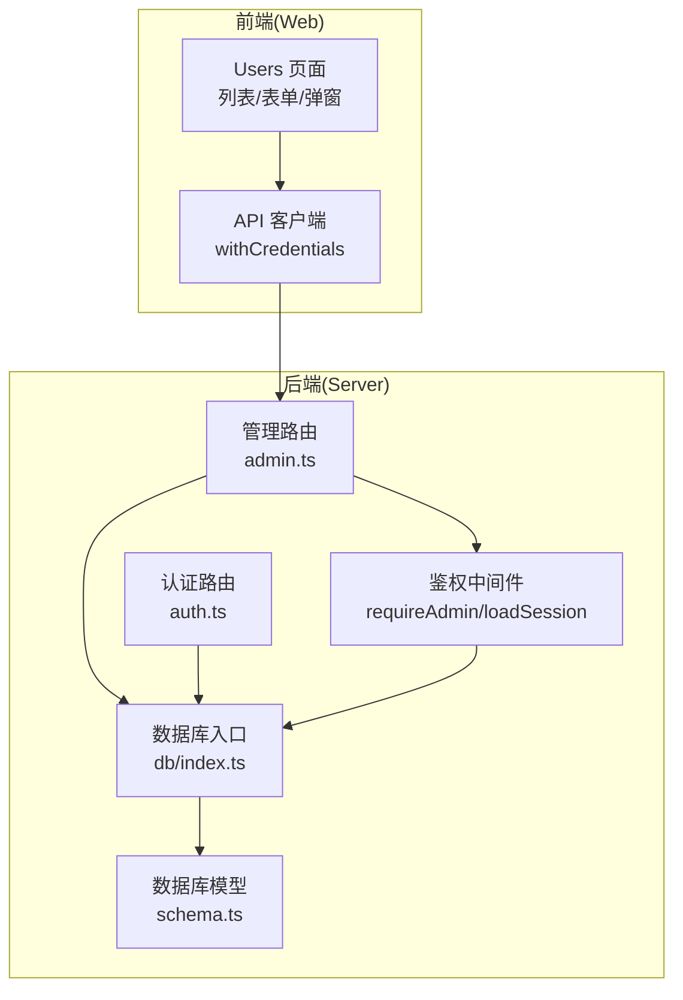
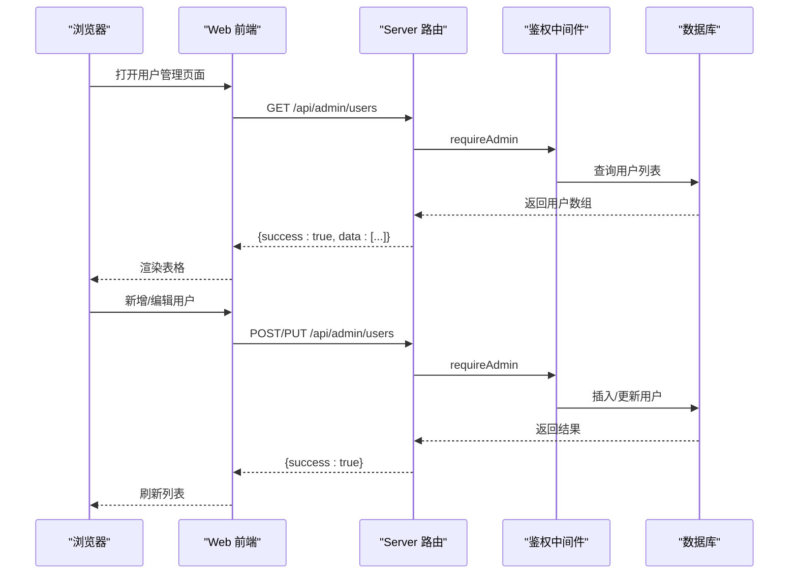
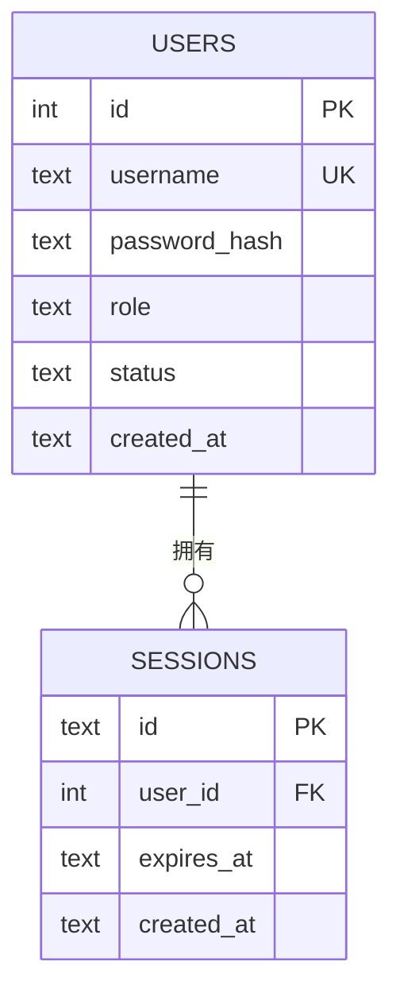
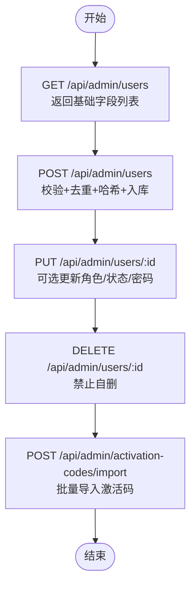
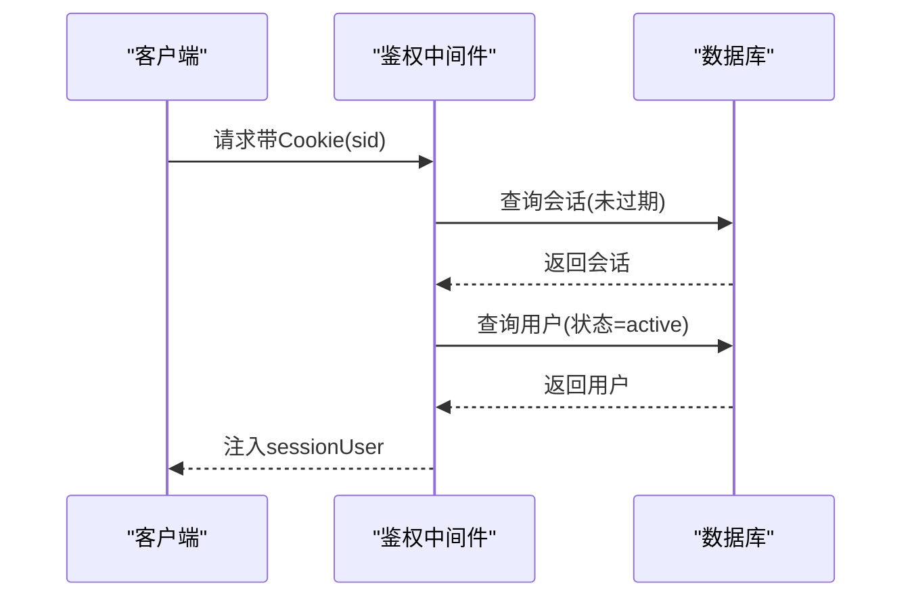
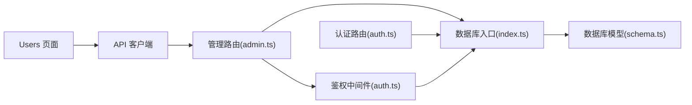

# 用户管理

<cite>
**本文引用的文件**
- [apps/server/src/db/schema.ts](file://apps/server/src/db/schema.ts)
- [apps/server/src/db/index.ts](file://apps/server/src/db/index.ts)
- [apps/server/src/db/seed.ts](file://apps/server/src/db/seed.ts)
- [apps/server/src/routes/admin.ts](file://apps/server/src/routes/admin.ts)
- [apps/server/src/routes/auth.ts](file://apps/server/src/routes/auth.ts)
- [apps/server/src/middleware/auth.ts](file://apps/server/src/middleware/auth.ts)
- [apps/server/src/middleware/audit.ts](file://apps/server/src/middleware/audit.ts)
- [apps/web/src/pages/admin/Users.tsx](file://apps/web/src/pages/admin/Users.tsx)
- [apps/web/src/lib/api.ts](file://apps/web/src/lib/api.ts)
- [packages/shared/src/schemas.ts](file://packages/shared/src/schemas.ts)
</cite>

## 目录
1. [简介](#简介)
2. [项目结构](#项目结构)
3. [核心组件](#核心组件)
4. [架构总览](#架构总览)
5. [详细组件分析](#详细组件分析)
6. [依赖关系分析](#依赖关系分析)
7. [性能考量](#性能考量)
8. [故障排查指南](#故障排查指南)
9. [结论](#结论)
10. [附录](#附录)

## 简介
本文件围绕用户管理功能进行系统化梳理，覆盖用户列表的CRUD操作、搜索与筛选、分页展示；用户创建流程（基本信息、角色分配、初始密码设置）；用户状态管理（启用/禁用、账户锁定机制）；角色权限体系（角色定义、权限分配、继承规则）；批量操作能力（批量导入、批量状态修改）；以及用户安全策略与最佳实践。内容基于仓库中的实际实现进行归纳总结，并通过图示帮助读者快速理解前后端协作与数据流。

## 项目结构
用户管理功能由前端页面、API路由、数据库模型与中间件共同组成：
- 前端页面负责用户列表展示、表单交互与调用API；
- 后端路由提供REST接口，执行业务逻辑与数据持久化；
- 数据库模型定义用户表结构与枚举值；
- 中间件负责鉴权与会话加载；
- 共享包提供输入校验Schema。

图表来源
- [apps/web/src/pages/admin/Users.tsx:1-90](file://apps/web/src/pages/admin/Users.tsx#L1-L90)
- [apps/web/src/lib/api.ts:1-16](file://apps/web/src/lib/api.ts#L1-L16)
- [apps/server/src/routes/admin.ts:1-279](file://apps/server/src/routes/admin.ts#L1-L279)
- [apps/server/src/routes/auth.ts:1-51](file://apps/server/src/routes/auth.ts#L1-L51)
- [apps/server/src/middleware/auth.ts:1-56](file://apps/server/src/middleware/auth.ts#L1-L56)
- [apps/server/src/db/index.ts:1-16](file://apps/server/src/db/index.ts#L1-L16)
- [apps/server/src/db/schema.ts:1-330](file://apps/server/src/db/schema.ts#L1-L330)

章节来源
- [apps/web/src/pages/admin/Users.tsx:1-90](file://apps/web/src/pages/admin/Users.tsx#L1-L90)
- [apps/server/src/routes/admin.ts:1-279](file://apps/server/src/routes/admin.ts#L1-L279)
- [apps/server/src/db/schema.ts:1-330](file://apps/server/src/db/schema.ts#L1-L330)

## 核心组件
- 用户数据模型：定义用户字段、枚举类型（角色、状态）、创建时间等。
- 管理路由：提供用户列表查询、创建、更新、删除接口。
- 鉴权中间件：加载会话、要求管理员权限。
- 前端页面：用户列表展示、新增/编辑弹窗、删除确认。
- 共享Schema：统一输入校验（用户名、密码、角色）。
- 种子数据：初始化管理员账户。

章节来源
- [apps/server/src/db/schema.ts:3-10](file://apps/server/src/db/schema.ts#L3-L10)
- [apps/server/src/routes/admin.ts:221-271](file://apps/server/src/routes/admin.ts#L221-L271)
- [apps/server/src/middleware/auth.ts:17-55](file://apps/server/src/middleware/auth.ts#L17-L55)
- [apps/web/src/pages/admin/Users.tsx:6-89](file://apps/web/src/pages/admin/Users.tsx#L6-L89)
- [packages/shared/src/schemas.ts:8-12](file://packages/shared/src/schemas.ts#L8-L12)
- [apps/server/src/db/seed.ts:5-18](file://apps/server/src/db/seed.ts#L5-L18)

## 架构总览
用户管理的典型请求流程如下：前端打开用户管理页面，发起GET请求获取用户列表；点击“新增”打开表单，提交POST创建用户；点击“编辑”可修改角色、状态与密码；点击“删除”触发DELETE请求；所有管理接口均受管理员权限保护。

图表来源
- [apps/web/src/pages/admin/Users.tsx:12-32](file://apps/web/src/pages/admin/Users.tsx#L12-L32)
- [apps/server/src/routes/admin.ts:221-271](file://apps/server/src/routes/admin.ts#L221-L271)
- [apps/server/src/middleware/auth.ts:48-55](file://apps/server/src/middleware/auth.ts#L48-L55)

## 详细组件分析

### 用户数据模型与枚举
- 用户表包含主键、用户名（唯一）、密码哈希、角色（枚举：admin/user）、状态（枚举：active/disabled）、创建时间等字段。
- 角色与状态均为数据库层面的枚举约束，保证数据一致性。
- 会话表与用户表建立外键关联，支持会话过期与级联删除。

图表来源
- [apps/server/src/db/schema.ts:3-17](file://apps/server/src/db/schema.ts#L3-L17)

章节来源
- [apps/server/src/db/schema.ts:3-17](file://apps/server/src/db/schema.ts#L3-L17)

### 管理路由：用户CRUD与批量导入
- 列表查询：返回用户基础字段（ID、用户名、角色、状态、创建时间），按创建时间倒序。
- 创建用户：使用共享Schema进行输入校验，检查用户名唯一性，生成密码哈希后写入数据库。
- 更新用户：支持修改角色、状态与密码（仅当提供有效密码时才更新哈希）。
- 删除用户：禁止删除当前登录用户，执行删除并返回成功。
- 批量导入：接收产品ID与激活码数组，按6位长度过滤并批量插入，返回导入数量与批次ID。

图表来源
- [apps/server/src/routes/admin.ts:221-271](file://apps/server/src/routes/admin.ts#L221-L271)

章节来源
- [apps/server/src/routes/admin.ts:221-271](file://apps/server/src/routes/admin.ts#L221-L271)

### 前端页面：用户列表与表单
- 列表展示：ID、用户名、角色标签、状态标签、创建时间；提供“新增用户”按钮。
- 表单交互：新增时必填用户名与密码；编辑时可选择角色与状态，密码留空表示不修改。
- 删除操作：二次确认弹窗，删除成功后刷新列表。
- 分页：前端表格默认每页20条，实际分页逻辑在后端路由中实现（见下节）。

章节来源
- [apps/web/src/pages/admin/Users.tsx:6-89](file://apps/web/src/pages/admin/Users.tsx#L6-L89)

### 鉴权与会话加载
- 会话加载：从Cookie读取sid，查询未过期且用户状态为“启用”的会话，将用户信息注入请求上下文。
- 权限控制：requireAdmin中间件要求已登录且角色为admin，否则返回401/403。
- 登录流程：校验用户名与密码，验证通过后生成sid并写入Cookie，同时记录会话。

图表来源
- [apps/server/src/middleware/auth.ts:17-40](file://apps/server/src/middleware/auth.ts#L17-L40)

章节来源
- [apps/server/src/middleware/auth.ts:17-55](file://apps/server/src/middleware/auth.ts#L17-L55)
- [apps/server/src/routes/auth.ts:9-33](file://apps/server/src/routes/auth.ts#L9-L33)

### 输入校验与种子数据
- 共享Schema：定义用户名、密码、角色的最小长度与枚举范围，用于创建用户时的输入校验。
- 种子数据：初始化管理员账户（用户名、密码哈希、角色、状态），确保系统可用。

章节来源
- [packages/shared/src/schemas.ts:8-12](file://packages/shared/src/schemas.ts#L8-L12)
- [apps/server/src/db/seed.ts:5-18](file://apps/server/src/db/seed.ts#L5-L18)

### 审计日志与安全策略
- 审计日志：提供统一的日志记录函数，记录用户行为、目标类型、IP、UA、结果等，便于追踪与合规。
- 安全策略建议：
  - 密码必须使用强哈希算法存储，避免明文或弱加密。
  - 会话有效期与Cookie属性（HttpOnly、SameSite、Secure）需结合HTTPS部署配置。
  - 管理员操作应纳入审计日志，保留不可篡改的记录。
  - 对敏感操作（删除、状态变更）增加二次确认与权限校验。

章节来源
- [apps/server/src/middleware/audit.ts:3-27](file://apps/server/src/middleware/audit.ts#L3-L27)

## 依赖关系分析
- 前端依赖API客户端，后者以withCredentials方式访问后端，自动携带Cookie。
- 后端路由依赖共享Schema进行输入校验，依赖数据库入口与模型定义。
- 鉴权中间件依赖数据库查询用户与会话状态。
- 管理路由在执行前通过requireAdmin钩子强制管理员权限。

图表来源
- [apps/web/src/lib/api.ts:1-16](file://apps/web/src/lib/api.ts#L1-L16)
- [apps/server/src/routes/admin.ts:1-279](file://apps/server/src/routes/admin.ts#L1-L279)
- [apps/server/src/middleware/auth.ts:1-56](file://apps/server/src/middleware/auth.ts#L1-L56)
- [apps/server/src/db/index.ts:1-16](file://apps/server/src/db/index.ts#L1-L16)
- [apps/server/src/db/schema.ts:1-330](file://apps/server/src/db/schema.ts#L1-L330)
- [apps/server/src/routes/auth.ts:1-51](file://apps/server/src/routes/auth.ts#L1-L51)

章节来源
- [apps/web/src/lib/api.ts:1-16](file://apps/web/src/lib/api.ts#L1-L16)
- [apps/server/src/routes/admin.ts:1-279](file://apps/server/src/routes/admin.ts#L1-L279)
- [apps/server/src/middleware/auth.ts:1-56](file://apps/server/src/middleware/auth.ts#L1-L56)
- [apps/server/src/db/index.ts:1-16](file://apps/server/src/db/index.ts#L1-L16)
- [apps/server/src/db/schema.ts:1-330](file://apps/server/src/db/schema.ts#L1-L330)
- [apps/server/src/routes/auth.ts:1-51](file://apps/server/src/routes/auth.ts#L1-L51)

## 性能考量
- 列表查询：当前实现直接返回全量数据并由前端分页，适合中小规模数据。若用户量增长，建议在后端实现分页参数（page/pageSize）与总数统计，减少传输与前端渲染压力。
- 密码哈希：使用Argon2进行哈希，安全性高；注意在批量导入场景中逐条处理，避免阻塞主线程。
- 会话查询：会话与用户状态查询均有条件过滤，建议在会话表与用户表上建立索引以提升查询效率。
- 并发控制：删除自身用户等关键操作已在后端进行边界检查，避免并发冲突带来的数据异常。

[本节为通用性能建议，不直接分析具体文件]

## 故障排查指南
- 登录失败
  - 检查用户名是否存在且状态为“启用”，确认密码正确。
  - 查看会话是否过期或被清理。
  - 参考：[apps/server/src/routes/auth.ts:14-22](file://apps/server/src/routes/auth.ts#L14-L22)，[apps/server/src/middleware/auth.ts:31-39](file://apps/server/src/middleware/auth.ts#L31-L39)
- 权限不足
  - 管理员接口返回403，确认当前用户角色为admin。
  - 参考：[apps/server/src/middleware/auth.ts:48-55](file://apps/server/src/middleware/auth.ts#L48-L55)
- 创建用户失败
  - 检查用户名是否重复，密码长度是否满足最小长度。
  - 参考：[apps/server/src/routes/admin.ts:237-249](file://apps/server/src/routes/admin.ts#L237-L249)，[packages/shared/src/schemas.ts:8-12](file://packages/shared/src/schemas.ts#L8-L12)
- 更新用户失败
  - 密码更新需提供至少6位字符串；角色与状态更新需传入有效枚举值。
  - 参考：[apps/server/src/routes/admin.ts:251-262](file://apps/server/src/routes/admin.ts#L251-L262)
- 删除用户失败
  - 当前登录用户不可删除自身。
  - 参考：[apps/server/src/routes/admin.ts:264-271](file://apps/server/src/routes/admin.ts#L264-L271)
- 批量导入激活码
  - 确保提供产品ID与6位激活码数组，系统会过滤非6位码。
  - 参考：[apps/server/src/routes/admin.ts:178-197](file://apps/server/src/routes/admin.ts#L178-L197)

章节来源
- [apps/server/src/routes/auth.ts:9-33](file://apps/server/src/routes/auth.ts#L9-L33)
- [apps/server/src/middleware/auth.ts:48-55](file://apps/server/src/middleware/auth.ts#L48-L55)
- [apps/server/src/routes/admin.ts:237-271](file://apps/server/src/routes/admin.ts#L237-L271)
- [packages/shared/src/schemas.ts:8-12](file://packages/shared/src/schemas.ts#L8-L12)

## 结论
本项目实现了完整的用户管理闭环：从前端列表到后端CRUD，从鉴权到会话管理，从输入校验到数据模型约束。当前版本具备基本的用户创建、编辑、删除与状态管理能力，并支持批量导入激活码。后续可在后端引入分页与搜索、增强审计日志、完善权限继承与批量状态修改等能力，以满足更复杂的运营需求。

[本节为总结性内容，不直接分析具体文件]

## 附录

### 用户搜索、筛选与分页
- 现状：当前用户列表接口未实现搜索与筛选参数，也未返回总数与分页信息。
- 建议：在后端路由中增加查询参数（如用户名模糊匹配、角色筛选、状态筛选、分页参数），并在数据库层实现LIMIT/OFFSET或COUNT统计，以提升大列表场景下的性能与体验。

章节来源
- [apps/server/src/routes/admin.ts:221-235](file://apps/server/src/routes/admin.ts#L221-L235)

### 用户状态管理与账户锁定机制
- 现状：用户状态为“启用/禁用”，登录时会检查状态为“启用”。
- 建议：可扩展状态枚举（如锁定、待审核等），并结合登录失败次数与封禁策略，实现账户锁定与自动解锁机制。

章节来源
- [apps/server/src/db/schema.ts:7-9](file://apps/server/src/db/schema.ts#L7-L9)
- [apps/server/src/routes/auth.ts:15-18](file://apps/server/src/routes/auth.ts#L15-L18)

### 角色权限系统
- 现状：角色为“admin/user”，管理路由通过requireAdmin中间件限制访问。
- 建议：细化权限粒度（如“用户管理-查看/编辑/删除”），在中间件中按资源与动作进行细粒度校验，并记录审计日志。

章节来源
- [apps/server/src/middleware/auth.ts:48-55](file://apps/server/src/middleware/auth.ts#L48-L55)
- [apps/server/src/db/schema.ts:7](file://apps/server/src/db/schema.ts#L7)

### 批量操作实现
- 现状：提供激活码批量导入接口，支持6位激活码过滤与批次标记。
- 建议：扩展用户批量状态修改、批量导出等功能，结合前端多选与后端事务处理，确保操作原子性与可观测性。

章节来源
- [apps/server/src/routes/admin.ts:178-197](file://apps/server/src/routes/admin.ts#L178-L197)

### 用户安全策略与最佳实践
- 强制使用Argon2进行密码哈希，避免明文或弱加密。
- 会话Cookie设置HttpOnly、SameSite、Secure（生产环境建议HTTPS）。
- 管理员操作全部纳入审计日志，保留不可篡改记录。
- 对敏感操作增加二次确认与权限校验，防止误操作。
- 定期轮换管理员密码，限制会话有效期，及时清理过期会话。

章节来源
- [apps/server/src/routes/auth.ts:23-32](file://apps/server/src/routes/auth.ts#L23-L32)
- [apps/server/src/middleware/audit.ts:3-27](file://apps/server/src/middleware/audit.ts#L3-L27)