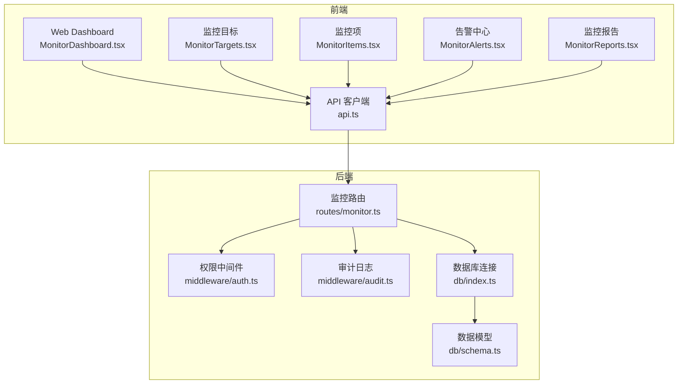
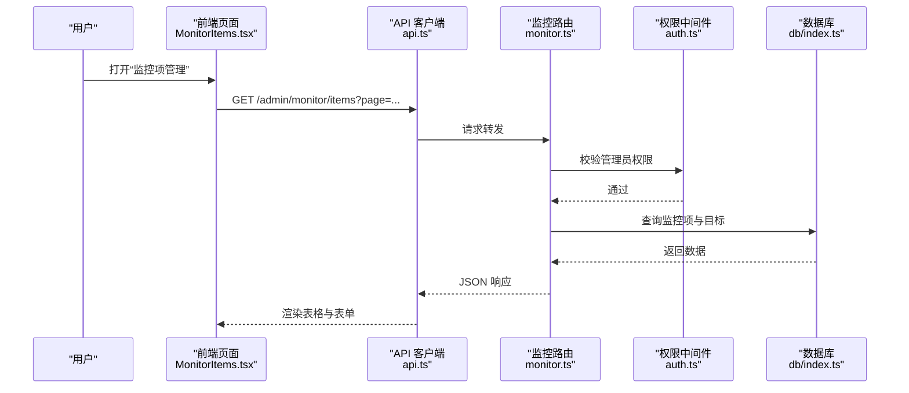
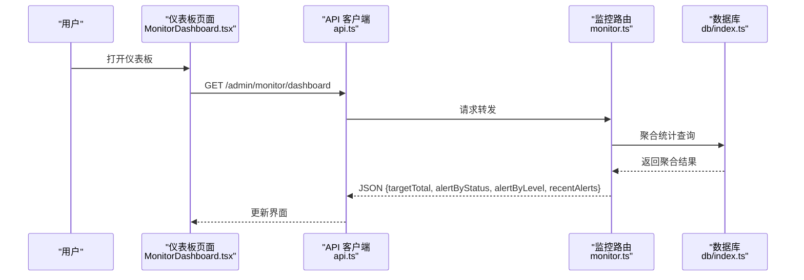
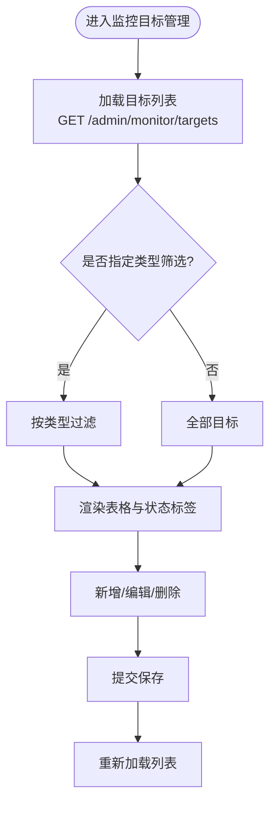
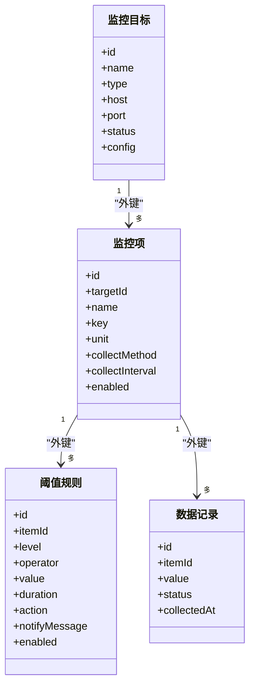
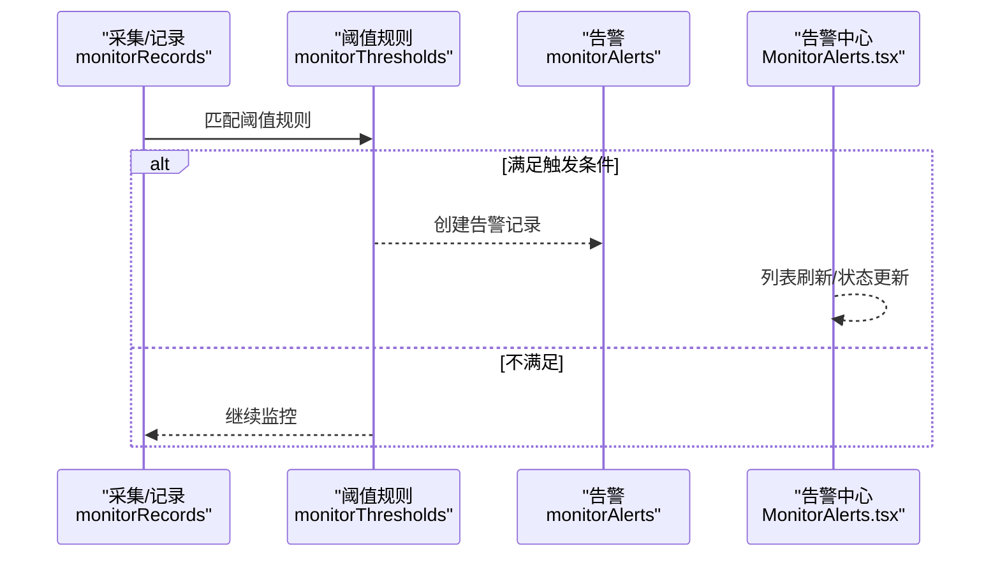
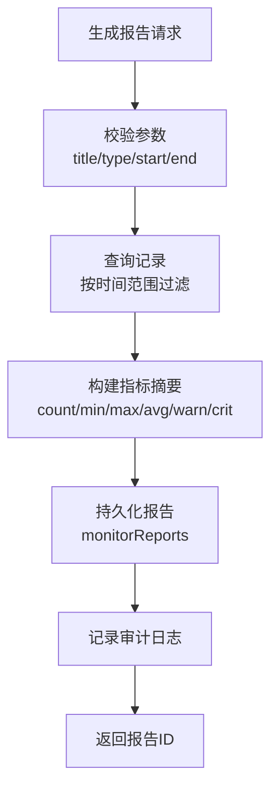
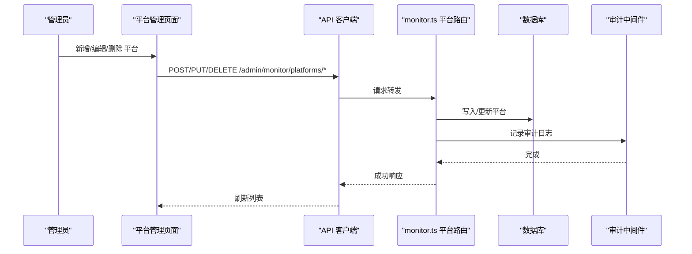
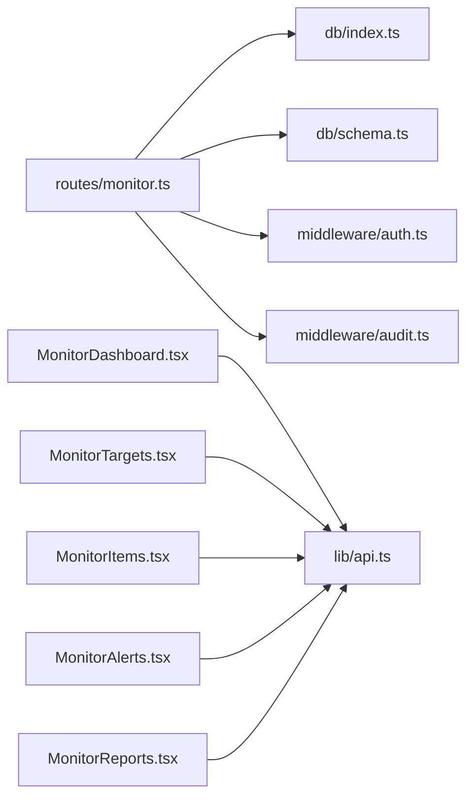

# 监控管理

<cite>
**本文引用的文件**
- [apps/server/src/routes/monitor.ts](file://apps/server/src/routes/monitor.ts)
- [apps/server/src/db/schema.ts](file://apps/server/src/db/schema.ts)
- [apps/server/src/db/index.ts](file://apps/server/src/db/index.ts)
- [apps/server/src/middleware/auth.ts](file://apps/server/src/middleware/auth.ts)
- [apps/server/src/middleware/audit.ts](file://apps/server/src/middleware/audit.ts)
- [apps/web/src/pages/admin/MonitorDashboard.tsx](file://apps/web/src/pages/admin/MonitorDashboard.tsx)
- [apps/web/src/pages/admin/MonitorTargets.tsx](file://apps/web/src/pages/admin/MonitorTargets.tsx)
- [apps/web/src/pages/admin/MonitorItems.tsx](file://apps/web/src/pages/admin/MonitorItems.tsx)
- [apps/web/src/pages/admin/MonitorAlerts.tsx](file://apps/web/src/pages/admin/MonitorAlerts.tsx)
- [apps/web/src/pages/admin/MonitorReports.tsx](file://apps/web/src/pages/admin/MonitorReports.tsx)
- [apps/web/src/lib/api.ts](file://apps/web/src/lib/api.ts)
</cite>

## 目录
1. [简介](#简介)
2. [项目结构](#项目结构)
3. [核心组件](#核心组件)
4. [架构总览](#架构总览)
5. [详细组件分析](#详细组件分析)
6. [依赖关系分析](#依赖关系分析)
7. [性能考虑](#性能考虑)
8. [故障排查指南](#故障排查指南)
9. [结论](#结论)
10. [附录](#附录)

## 简介
本文件系统化阐述监控管理功能的设计与实现，覆盖以下方面：
- 仪表板设计与实现：指标展示、图表配置、实时数据更新
- 监控目标管理：目标类型定义、监控参数配置、目标分组管理
- 监控项配置：采集频率、数据处理、阈值设置
- 告警机制：告警规则、通知方式、告警升级策略
- 监控报表：历史数据分析、趋势预测、性能评估
- 性能优化与故障排查

监控系统采用前后端分离架构：前端基于 Ant Design 的管理页面，通过统一的 /api 前缀调用后端接口；后端使用 Fastify 提供 REST 接口，Drizzle ORM 访问 SQLite 数据库。

## 项目结构
- 后端路由与业务逻辑集中在 apps/server/src/routes/monitor.ts，涵盖监控目标、监控项、阈值、数据记录、告警、仪表板、报表、平台接入、审计日志等模块。
- 数据模型定义在 apps/server/src/db/schema.ts，包含 monitor_* 表及审计日志表。
- 数据库初始化与连接在 apps/server/src/db/index.ts，使用 better-sqlite3 与 WAL 模式。
- 权限控制与审计日志分别在 apps/server/src/middleware/auth.ts 与 apps/server/src/middleware/audit.ts。
- 前端管理页面位于 apps/web/src/pages/admin 下，对应各功能模块。

**图示来源**
- [apps/web/src/pages/admin/MonitorDashboard.tsx:1-100](file://apps/web/src/pages/admin/MonitorDashboard.tsx#L1-L100)
- [apps/web/src/pages/admin/MonitorTargets.tsx:1-110](file://apps/web/src/pages/admin/MonitorTargets.tsx#L1-L110)
- [apps/web/src/pages/admin/MonitorItems.tsx:1-232](file://apps/web/src/pages/admin/MonitorItems.tsx#L1-L232)
- [apps/web/src/pages/admin/MonitorAlerts.tsx:1-91](file://apps/web/src/pages/admin/MonitorAlerts.tsx#L1-L91)
- [apps/web/src/pages/admin/MonitorReports.tsx:1-189](file://apps/web/src/pages/admin/MonitorReports.tsx#L1-L189)
- [apps/web/src/lib/api.ts:1-16](file://apps/web/src/lib/api.ts#L1-L16)
- [apps/server/src/routes/monitor.ts:1-595](file://apps/server/src/routes/monitor.ts#L1-L595)
- [apps/server/src/middleware/auth.ts:1-56](file://apps/server/src/middleware/auth.ts#L1-L56)
- [apps/server/src/middleware/audit.ts:1-28](file://apps/server/src/middleware/audit.ts#L1-L28)
- [apps/server/src/db/index.ts:1-16](file://apps/server/src/db/index.ts#L1-L16)
- [apps/server/src/db/schema.ts:216-330](file://apps/server/src/db/schema.ts#L216-L330)

**章节来源**
- [apps/server/src/routes/monitor.ts:1-595](file://apps/server/src/routes/monitor.ts#L1-L595)
- [apps/server/src/db/schema.ts:216-330](file://apps/server/src/db/schema.ts#L216-L330)
- [apps/server/src/db/index.ts:1-16](file://apps/server/src/db/index.ts#L1-L16)
- [apps/web/src/lib/api.ts:1-16](file://apps/web/src/lib/api.ts#L1-L16)

## 核心组件
- 监控目标（monitorTargets）：定义被监控对象（服务器、网络设备、应用、数据库、容器等），支持主机、端口、状态、配置等字段。
- 监控项（monitorItems）：具体指标，绑定到目标，包含采集方法、采集间隔、单位、启用状态等。
- 阈值规则（monitorThresholds）：针对监控项设定告警阈值、比较运算符、持续时长、响应动作与通知消息。
- 数据记录（monitorRecords）：按时间序列存储指标值与状态（正常/警告/严重）。
- 告警（monitorAlerts）：由阈值触发，记录级别、值、消息、状态（待处理/已确认/已解决）及处理人与时间。
- 报表与模板（monitorReports、monitorReportTemplates）：按模板生成历史报告，包含时间范围、指标摘要等。
- 平台接入（monitorPlatforms）：支持 webhook、API、Agent 等接入方式，用于外部系统同步或上报。
- 审计日志（auditLogs）：记录管理员对监控相关资源的操作行为。

**章节来源**
- [apps/server/src/db/schema.ts:216-330](file://apps/server/src/db/schema.ts#L216-L330)
- [apps/server/src/routes/monitor.ts:13-595](file://apps/server/src/routes/monitor.ts#L13-L595)

## 架构总览
后端以 Fastify 路由为中心，统一鉴权中间件要求管理员权限，审计中间件记录关键操作。数据库层采用 Drizzle ORM + better-sqlite3，SQLite 使用 WAL 模式提升并发写入性能。前端通过 axios 实例统一访问 /api，页面组件负责渲染与交互。

**图示来源**
- [apps/web/src/pages/admin/MonitorItems.tsx:1-232](file://apps/web/src/pages/admin/MonitorItems.tsx#L1-L232)
- [apps/web/src/lib/api.ts:1-16](file://apps/web/src/lib/api.ts#L1-L16)
- [apps/server/src/routes/monitor.ts:108-164](file://apps/server/src/routes/monitor.ts#L108-L164)
- [apps/server/src/middleware/auth.ts:48-56](file://apps/server/src/middleware/auth.ts#L48-L56)
- [apps/server/src/db/index.ts:1-16](file://apps/server/src/db/index.ts#L1-L16)

## 详细组件分析

### 仪表板设计与实现
- 指标展示：后端聚合目标总数、按状态分布、告警状态与级别分布、最近告警列表；前端以卡片与表格形式展示。
- 图表配置：当前仪表板以静态统计卡片为主，未直接集成可视化图表组件；若需图表，可在前端引入图表库并在仪表板页面扩展。
- 实时数据更新：当前未实现 WebSocket 或轮询自动刷新；建议在仪表板组件中增加定时拉取或订阅机制。

**图示来源**
- [apps/web/src/pages/admin/MonitorDashboard.tsx:1-100](file://apps/web/src/pages/admin/MonitorDashboard.tsx#L1-L100)
- [apps/web/src/lib/api.ts:1-16](file://apps/web/src/lib/api.ts#L1-L16)
- [apps/server/src/routes/monitor.ts:290-319](file://apps/server/src/routes/monitor.ts#L290-L319)
- [apps/server/src/db/index.ts:1-16](file://apps/server/src/db/index.ts#L1-L16)

**章节来源**
- [apps/server/src/routes/monitor.ts:290-319](file://apps/server/src/routes/monitor.ts#L290-L319)
- [apps/web/src/pages/admin/MonitorDashboard.tsx:1-100](file://apps/web/src/pages/admin/MonitorDashboard.tsx#L1-L100)

### 监控目标管理
- 目标类型：支持 device/system/database/service 等类型，便于分类与分组管理。
- 参数配置：名称、类型、主机、端口、描述、状态、自定义配置等。
- 分组管理：可通过类型筛选与分页查询实现目标分组浏览；建议在前端增加按类型/状态/主机的筛选器。

**图示来源**
- [apps/server/src/routes/monitor.ts:16-106](file://apps/server/src/routes/monitor.ts#L16-L106)
- [apps/web/src/pages/admin/MonitorTargets.tsx:1-110](file://apps/web/src/pages/admin/MonitorTargets.tsx#L1-L110)
- [apps/server/src/db/schema.ts:216-228](file://apps/server/src/db/schema.ts#L216-L228)

**章节来源**
- [apps/server/src/routes/monitor.ts:16-106](file://apps/server/src/routes/monitor.ts#L16-L106)
- [apps/web/src/pages/admin/MonitorTargets.tsx:1-110](file://apps/web/src/pages/admin/MonitorTargets.tsx#L1-L110)
- [apps/server/src/db/schema.ts:216-228](file://apps/server/src/db/schema.ts#L216-L228)

### 监控项配置
- 关联目标：每个监控项绑定到一个目标，支持跨目标复用。
- 采集频率：可配置采集间隔（秒），默认 60 秒。
- 数据处理：监控项记录包含指标值与状态（正常/警告/严重），用于后续阈值判断与报表统计。
- 阈值设置：通过“阈值规则”为监控项配置不同级别的告警条件。

**图示来源**
- [apps/server/src/db/schema.ts:216-262](file://apps/server/src/db/schema.ts#L216-L262)

**章节来源**
- [apps/server/src/routes/monitor.ts:108-164](file://apps/server/src/routes/monitor.ts#L108-L164)
- [apps/web/src/pages/admin/MonitorItems.tsx:1-232](file://apps/web/src/pages/admin/MonitorItems.tsx#L1-L232)
- [apps/server/src/db/schema.ts:230-262](file://apps/server/src/db/schema.ts#L230-L262)

### 告警机制
- 触发条件：当某监控项的最新记录值满足阈值规则（含比较运算符与持续时长）时，生成告警。
- 状态流转：待处理 → 已确认 → 已解决；支持手动确认与解决。
- 通知方式：阈值规则可配置通知消息模板，用于对外部系统或渠道发送告警信息（当前路由未实现具体通知发送逻辑，仅保存模板）。

**图示来源**
- [apps/server/src/db/schema.ts:243-277](file://apps/server/src/db/schema.ts#L243-L277)
- [apps/server/src/routes/monitor.ts:242-288](file://apps/server/src/routes/monitor.ts#L242-L288)
- [apps/web/src/pages/admin/MonitorAlerts.tsx:1-91](file://apps/web/src/pages/admin/MonitorAlerts.tsx#L1-L91)

**章节来源**
- [apps/server/src/routes/monitor.ts:242-288](file://apps/server/src/routes/monitor.ts#L242-L288)
- [apps/web/src/pages/admin/MonitorAlerts.tsx:1-91](file://apps/web/src/pages/admin/MonitorAlerts.tsx#L1-L91)
- [apps/server/src/db/schema.ts:264-277](file://apps/server/src/db/schema.ts#L264-L277)

### 监控报表功能
- 历史数据分析：根据起止时间筛选数据记录，计算每项的最小/最大/平均值、告警示数与严重数等。
- 趋势预测：当前未实现趋势预测算法；可在前端基于历史数据进行简单趋势展示（如折线图）。
- 性能评估：通过报表模板配置显示项集合与展示方式，生成周期性报告。

**图示来源**
- [apps/server/src/routes/monitor.ts:332-391](file://apps/server/src/routes/monitor.ts#L332-L391)
- [apps/web/src/pages/admin/MonitorReports.tsx:1-189](file://apps/web/src/pages/admin/MonitorReports.tsx#L1-L189)
- [apps/server/src/db/schema.ts:279-299](file://apps/server/src/db/schema.ts#L279-L299)

**章节来源**
- [apps/server/src/routes/monitor.ts:321-407](file://apps/server/src/routes/monitor.ts#L321-L407)
- [apps/web/src/pages/admin/MonitorReports.tsx:1-189](file://apps/web/src/pages/admin/MonitorReports.tsx#L1-L189)
- [apps/server/src/db/schema.ts:279-299](file://apps/server/src/db/schema.ts#L279-L299)

### 平台接入与审计
- 平台接入：支持 webhook、API、Agent 等类型，可配置端点、密钥、同步配置与状态。
- 测试连通性：提供测试接口模拟连接测试与状态更新。
- 审计日志：所有管理员对监控资源的关键操作均记录审计日志，便于追踪与合规。

**图示来源**
- [apps/server/src/routes/monitor.ts:489-593](file://apps/server/src/routes/monitor.ts#L489-L593)
- [apps/server/src/middleware/audit.ts:1-28](file://apps/server/src/middleware/audit.ts#L1-L28)
- [apps/web/src/pages/admin/MonitorReports.tsx:1-189](file://apps/web/src/pages/admin/MonitorReports.tsx#L1-L189)

**章节来源**
- [apps/server/src/routes/monitor.ts:489-593](file://apps/server/src/routes/monitor.ts#L489-L593)
- [apps/server/src/middleware/audit.ts:1-28](file://apps/server/src/middleware/audit.ts#L1-L28)

## 依赖关系分析
- 路由依赖：monitor.ts 依赖 db/index.ts 与 schema.ts，使用 Drizzle ORM 进行查询与写入。
- 中间件依赖：requireAdmin 强制管理员权限，logAudit 在关键写操作后记录审计。
- 前端依赖：各页面组件依赖 api.ts 发起请求，依赖 Ant Design 组件库进行 UI 呈现。

**图示来源**
- [apps/server/src/routes/monitor.ts:1-595](file://apps/server/src/routes/monitor.ts#L1-L595)
- [apps/server/src/db/index.ts:1-16](file://apps/server/src/db/index.ts#L1-L16)
- [apps/server/src/db/schema.ts:216-330](file://apps/server/src/db/schema.ts#L216-L330)
- [apps/server/src/middleware/auth.ts:1-56](file://apps/server/src/middleware/auth.ts#L1-L56)
- [apps/server/src/middleware/audit.ts:1-28](file://apps/server/src/middleware/audit.ts#L1-L28)
- [apps/web/src/lib/api.ts:1-16](file://apps/web/src/lib/api.ts#L1-L16)

**章节来源**
- [apps/server/src/routes/monitor.ts:1-595](file://apps/server/src/routes/monitor.ts#L1-L595)
- [apps/server/src/db/index.ts:1-16](file://apps/server/src/db/index.ts#L1-L16)
- [apps/server/src/db/schema.ts:216-330](file://apps/server/src/db/schema.ts#L216-L330)
- [apps/server/src/middleware/auth.ts:1-56](file://apps/server/src/middleware/auth.ts#L1-L56)
- [apps/server/src/middleware/audit.ts:1-28](file://apps/server/src/middleware/audit.ts#L1-L28)
- [apps/web/src/lib/api.ts:1-16](file://apps/web/src/lib/api.ts#L1-L16)

## 性能考虑
- 数据库模式
  - 使用 SQLite + WAL 模式，提升写入吞吐；外键约束确保数据一致性。
  - 建议对高频查询列（如 monitorRecords.item_id、monitorRecords.collected_at）建立索引以优化报表统计。
- 查询与分页
  - 后端对多数列表接口提供分页与过滤，避免一次性返回大量数据。
- 前端渲染
  - 大表格建议启用虚拟滚动与固定列，减少 DOM 渲染压力。
- 实时更新
  - 当前未实现自动刷新；建议在仪表板与列表页增加定时任务或 WebSocket 订阅，降低轮询频率与带宽消耗。
- 报表生成
  - 历史数据聚合在服务端完成，建议对大时间窗口的统计增加缓存或预聚合表，缩短生成时间。

[本节为通用性能建议，不直接分析具体文件]

## 故障排查指南
- 权限问题
  - 确认管理员会话有效；后端 requireAdmin 将拒绝非管理员请求。
- 数据异常
  - 检查 monitorTargets 与 monitorItems 的外键关系；删除目标时会级联删除其监控项。
  - 检查 monitorRecords 的 item_id 是否指向有效监控项。
- 告警未产生
  - 确认监控项 enabled 为启用；阈值规则 enabled 为启用；比较运算符与阈值设置合理；duration 设置是否导致延迟触发。
- 报表为空
  - 确认时间范围正确且存在记录；检查模板配置中的 itemIds 是否匹配实际监控项。
- 平台接入失败
  - 使用测试接口验证端点连通性；核对 endpoint、apiKey、secret 配置；查看状态是否被临时置为 testing。

**章节来源**
- [apps/server/src/middleware/auth.ts:48-56](file://apps/server/src/middleware/auth.ts#L48-L56)
- [apps/server/src/db/schema.ts:216-330](file://apps/server/src/db/schema.ts#L216-L330)
- [apps/server/src/routes/monitor.ts:108-164](file://apps/server/src/routes/monitor.ts#L108-L164)

## 结论
该监控管理系统以清晰的数据模型与完善的后端路由支撑，实现了从目标管理、监控项配置、阈值规则、告警处理到报表生成的完整闭环。前端页面提供了直观的管理体验。为进一步提升可用性与性能，建议：
- 在前端增加仪表板与列表的自动刷新机制；
- 对高频查询字段建立索引；
- 在报表生成中引入缓存与预聚合；
- 在阈值规则中完善通知通道对接（如邮件、IM、Webhook）。

[本节为总结性内容，不直接分析具体文件]

## 附录
- API 路由概览（节选）
  - 监控目标：GET/POST/PUT/DELETE /admin/monitor/targets
  - 监控项：GET/POST/PUT/DELETE /admin/monitor/items
  - 阈值规则：GET/POST/PUT/DELETE /admin/monitor/thresholds
  - 数据记录：GET /admin/monitor/records
  - 告警：GET /admin/monitor/alerts；PUT /admin/monitor/alerts/:id/acknowledge；PUT /admin/monitor/alerts/:id/resolve
  - 仪表板：GET /admin/monitor/dashboard
  - 报表：GET /admin/monitor/reports；POST /admin/monitor/reports/generate；GET/DELETE /admin/monitor/reports/:id；GET/POST/PUT/DELETE /admin/monitor/report-templates
  - 平台接入：GET/POST/PUT/DELETE /admin/monitor/platforms；POST /admin/monitor/platforms/:id/test
  - 审计日志：GET /admin/monitor/audit-logs；GET /admin/monitor/audit-logs/stats

**章节来源**
- [apps/server/src/routes/monitor.ts:13-595](file://apps/server/src/routes/monitor.ts#L13-L595)