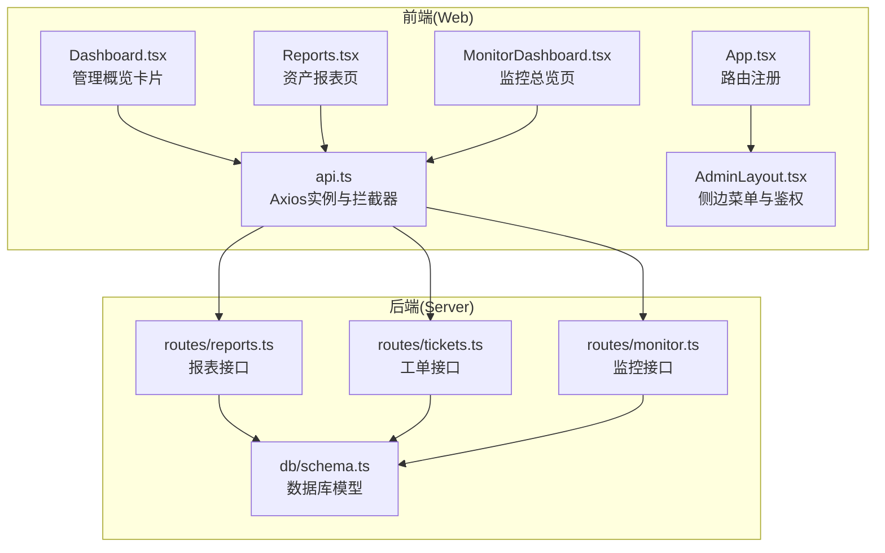
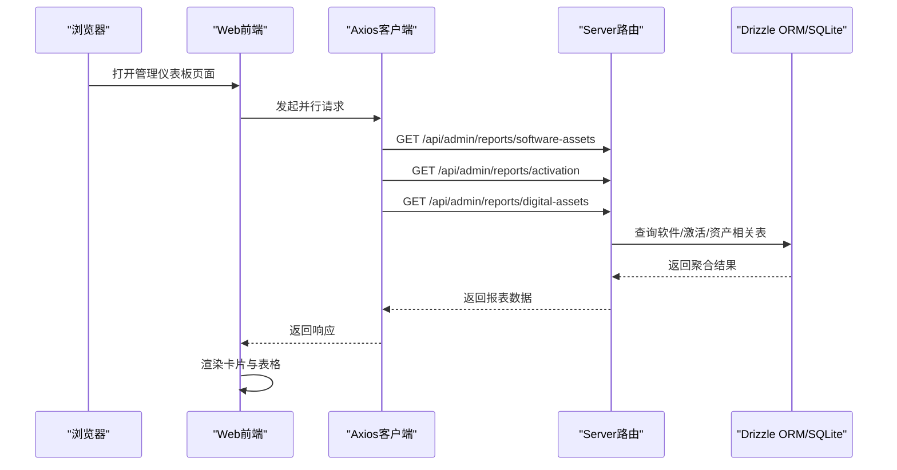
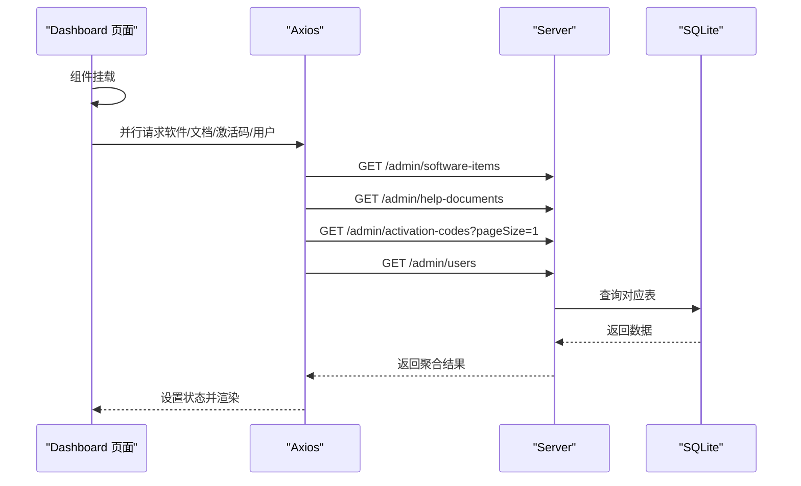
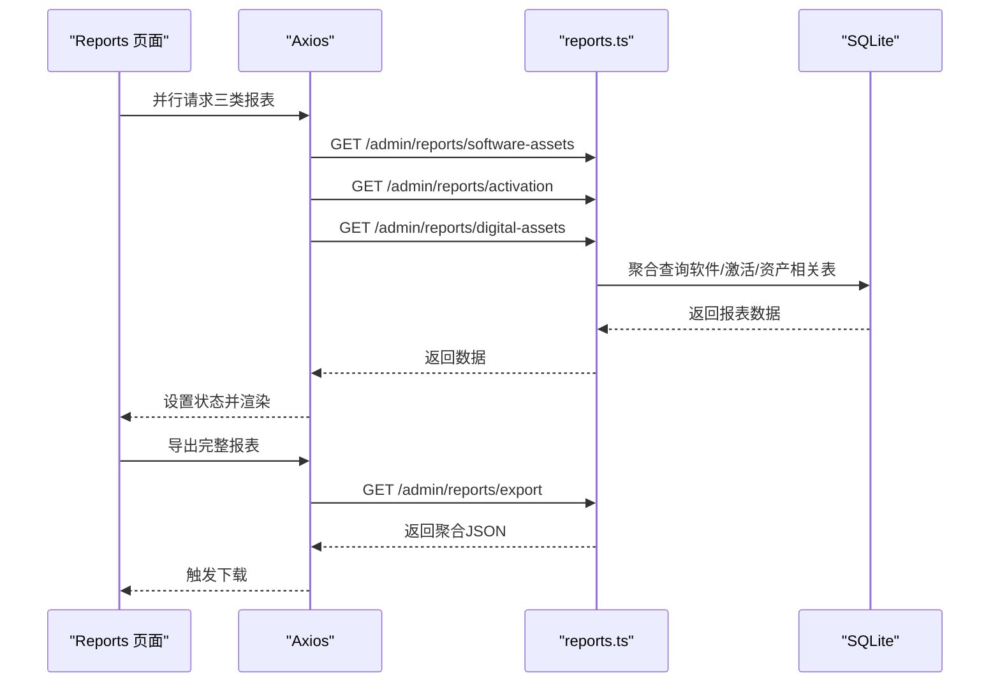
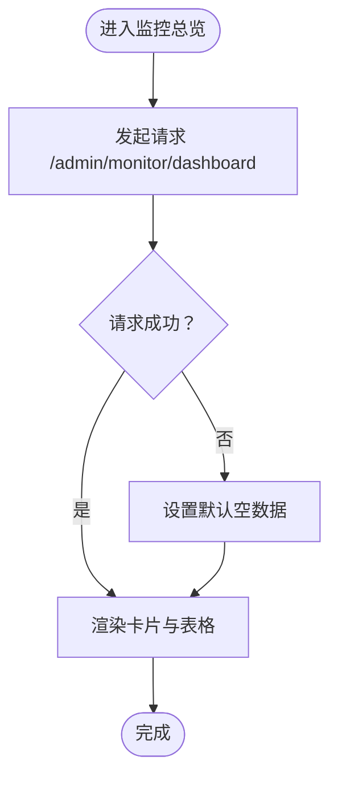
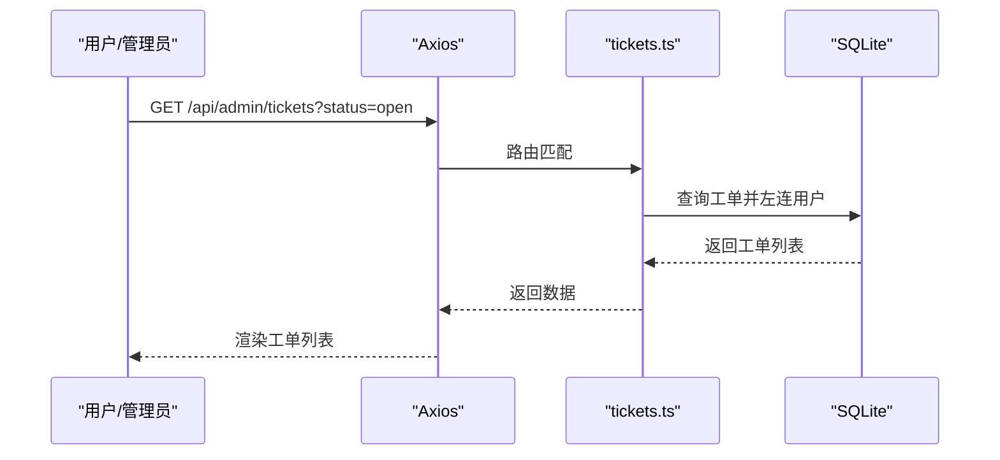
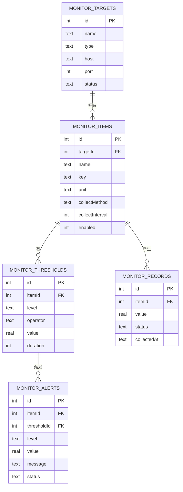
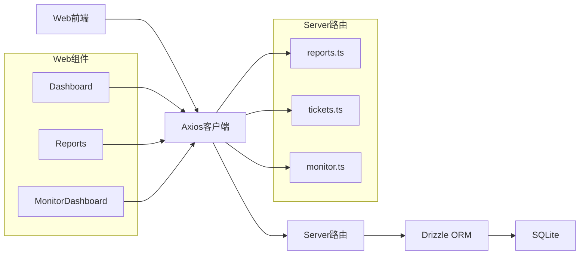

# 管理仪表板

<cite>
**本文引用的文件**
- [apps/web/src/pages/admin/Dashboard.tsx](file://apps/web/src/pages/admin/Dashboard.tsx)
- [apps/web/src/pages/admin/Reports.tsx](file://apps/web/src/pages/admin/Reports.tsx)
- [apps/web/src/pages/admin/MonitorDashboard.tsx](file://apps/web/src/pages/admin/MonitorDashboard.tsx)
- [apps/web/src/lib/api.ts](file://apps/web/src/lib/api.ts)
- [apps/web/src/App.tsx](file://apps/web/src/App.tsx)
- [apps/web/src/layouts/AdminLayout.tsx](file://apps/web/src/layouts/AdminLayout.tsx)
- [apps/server/src/routes/reports.ts](file://apps/server/src/routes/reports.ts)
- [apps/server/src/routes/tickets.ts](file://apps/server/src/routes/tickets.ts)
- [apps/server/src/routes/monitor.ts](file://apps/server/src/routes/monitor.ts)
- [apps/server/src/db/schema.ts](file://apps/server/src/db/schema.ts)
</cite>

## 目录
1. [简介](#简介)
2. [项目结构](#项目结构)
3. [核心组件](#核心组件)
4. [架构总览](#架构总览)
5. [详细组件分析](#详细组件分析)
6. [依赖关系分析](#依赖关系分析)
7. [性能考虑](#性能考虑)
8. [故障排查指南](#故障排查指南)
9. [结论](#结论)
10. [附录](#附录)

## 简介
本文件面向“管理仪表板”功能，系统性阐述前端仪表板页面、后端数据接口与数据库模型之间的协作关系，覆盖以下主题：
- 仪表板整体设计理念与数据可视化方案：关键指标展示、表格与标签组件使用、加载态与错误兜底。
- 统计模块实现：软件资产、激活码使用、数字资产、系统监控等。
- 自定义配置能力：组件布局、筛选条件（查询参数）与导出能力。
- 实时更新机制：当前实现为一次性加载，建议采用轮询或订阅方案以支持实时更新。
- 性能优化建议与最佳实践：并发请求、分页、缓存与懒加载策略。
- 配置选项说明与代码示例路径。

## 项目结构
管理仪表板由前端页面与后端路由两部分组成，通过统一的 /api 前缀进行交互；数据库模型位于后端，使用 Drizzle ORM 定义。

**图示来源**
- [apps/web/src/pages/admin/Dashboard.tsx:1-47](file://apps/web/src/pages/admin/Dashboard.tsx#L1-L47)
- [apps/web/src/pages/admin/Reports.tsx:1-138](file://apps/web/src/pages/admin/Reports.tsx#L1-L138)
- [apps/web/src/pages/admin/MonitorDashboard.tsx:1-100](file://apps/web/src/pages/admin/MonitorDashboard.tsx#L1-L100)
- [apps/web/src/lib/api.ts:1-16](file://apps/web/src/lib/api.ts#L1-L16)
- [apps/web/src/App.tsx:1-80](file://apps/web/src/App.tsx#L1-L80)
- [apps/web/src/layouts/AdminLayout.tsx:1-126](file://apps/web/src/layouts/AdminLayout.tsx#L1-L126)
- [apps/server/src/routes/reports.ts:1-146](file://apps/server/src/routes/reports.ts#L1-L146)
- [apps/server/src/routes/tickets.ts:1-137](file://apps/server/src/routes/tickets.ts#L1-L137)
- [apps/server/src/routes/monitor.ts:1-595](file://apps/server/src/routes/monitor.ts#L1-L595)
- [apps/server/src/db/schema.ts:1-330](file://apps/server/src/db/schema.ts#L1-L330)

**章节来源**
- [apps/web/src/App.tsx:38-79](file://apps/web/src/App.tsx#L38-L79)
- [apps/web/src/layouts/AdminLayout.tsx:88-126](file://apps/web/src/layouts/AdminLayout.tsx#L88-L126)

## 核心组件
- 管理概览（Dashboard）
  - 使用卡片与统计组件展示软件数、文档数、激活码总量、用户数。
  - 首次进入页面时并行拉取四项统计数据，完成后渲染。
- 资产报表（Reports）
  - 并行获取软件资产、激活码使用、数字资产三类报表数据。
  - 提供“导出完整报表”按钮，将后端聚合数据以 JSON 下载。
- 监控总览（MonitorDashboard）
  - 展示监控目标总数、在线数、告警数、今日采集记录。
  - 列表展示最近告警与各目标状态，含状态颜色映射与标签渲染。
- API 客户端（api.ts）
  - 创建带凭证的 Axios 实例，并在响应拦截器中处理 401 场景。
- 路由与布局（App.tsx、AdminLayout.tsx）
  - 注册管理后台路由，提供侧边菜单与管理员权限校验。

**章节来源**
- [apps/web/src/pages/admin/Dashboard.tsx:8-46](file://apps/web/src/pages/admin/Dashboard.tsx#L8-L46)
- [apps/web/src/pages/admin/Reports.tsx:8-137](file://apps/web/src/pages/admin/Reports.tsx#L8-L137)
- [apps/web/src/pages/admin/MonitorDashboard.tsx:15-99](file://apps/web/src/pages/admin/MonitorDashboard.tsx#L15-L99)
- [apps/web/src/lib/api.ts:1-16](file://apps/web/src/lib/api.ts#L1-L16)
- [apps/web/src/App.tsx:38-79](file://apps/web/src/App.tsx#L38-L79)
- [apps/web/src/layouts/AdminLayout.tsx:88-126](file://apps/web/src/layouts/AdminLayout.tsx#L88-L126)

## 架构总览
前端通过统一的 /api 前缀调用后端接口，后端路由根据业务域划分（报表、工单、监控），并使用 Drizzle ORM 访问 SQLite 数据库。

**图示来源**
- [apps/web/src/pages/admin/Reports.tsx:14-25](file://apps/web/src/pages/admin/Reports.tsx#L14-L25)
- [apps/server/src/routes/reports.ts:9-34](file://apps/server/src/routes/reports.ts#L9-L34)

## 详细组件分析

### 管理概览（Dashboard）
- 设计理念
  - 使用栅格布局与卡片组件展示关键指标，前缀图标增强可读性。
  - 指标来源于四个独立接口，采用 Promise.all 并行请求，减少首屏等待。
- 数据流
  - 首次挂载触发请求，成功后写入本地状态并渲染。
- 可视化方案
  - 使用 Statistic 组件展示数值与前缀图标；Ant Design 的 Card 提供容器样式。
- 错误与加载
  - 当前未显式处理错误与加载态，建议增加 loading 与错误提示。

**图示来源**
- [apps/web/src/pages/admin/Dashboard.tsx:11-25](file://apps/web/src/pages/admin/Dashboard.tsx#L11-L25)
- [apps/web/src/lib/api.ts:3-13](file://apps/web/src/lib/api.ts#L3-L13)

**章节来源**
- [apps/web/src/pages/admin/Dashboard.tsx:8-46](file://apps/web/src/pages/admin/Dashboard.tsx#L8-L46)

### 资产报表（Reports）
- 统计模块
  - 软件资产：总数、已发布/草稿数量、按分类统计。
  - 激活码使用：总发放次数、按产品统计（可用/已发放/已作废/使用率）、月度发放趋势。
  - 数字资产：总数、资产总值、在用资产总值、按状态与分类统计。
- 导出能力
  - 提供“导出完整报表”按钮，后端返回聚合 JSON 数据，前端生成 Blob 并触发下载。
- 可视化方案
  - 使用 Statistic、Table、Tag、Tabs 等组件组合展示多维度数据。

**图示来源**
- [apps/web/src/pages/admin/Reports.tsx:14-37](file://apps/web/src/pages/admin/Reports.tsx#L14-L37)
- [apps/server/src/routes/reports.ts:9-34](file://apps/server/src/routes/reports.ts#L9-L34)
- [apps/server/src/routes/reports.ts:114-144](file://apps/server/src/routes/reports.ts#L114-L144)

**章节来源**
- [apps/web/src/pages/admin/Reports.tsx:8-137](file://apps/web/src/pages/admin/Reports.tsx#L8-L137)
- [apps/server/src/routes/reports.ts:9-144](file://apps/server/src/routes/reports.ts#L9-L144)

### 监控总览（MonitorDashboard）
- 关键指标
  - 目标总数、在线数、告警数、今日采集记录。
- 最近告警与目标状态
  - 表格展示告警级别、状态、消息与目标信息；状态使用颜色与标签映射。
- 错误兜底
  - 请求失败时回退到默认空数据结构，避免页面崩溃。
- 加载态
  - 使用 Spin 组件提供加载指示。

**图示来源**
- [apps/web/src/pages/admin/MonitorDashboard.tsx:19-26](file://apps/web/src/pages/admin/MonitorDashboard.tsx#L19-L26)
- [apps/web/src/pages/admin/MonitorDashboard.tsx:31-96](file://apps/web/src/pages/admin/MonitorDashboard.tsx#L31-L96)

**章节来源**
- [apps/web/src/pages/admin/MonitorDashboard.tsx:15-99](file://apps/web/src/pages/admin/MonitorDashboard.tsx#L15-L99)

### 工单处理情况（Tickets）
- 后端接口
  - 用户可提交工单、查看自己的工单列表与详情、回复工单。
  - 管理员可列出所有工单、按状态筛选、查看详情、分配/修改状态、回复工单。
- 数据模型
  - tickets 与 ticketReplies 表用于存储工单与回复，包含类型、优先级、状态等字段。
- 仪表板关联
  - 仪表板未直接展示工单数据；可在报表或监控页扩展工单相关看板。

**图示来源**
- [apps/server/src/routes/tickets.ts:65-93](file://apps/server/src/routes/tickets.ts#L65-L93)
- [apps/server/src/db/schema.ts:99-119](file://apps/server/src/db/schema.ts#L99-L119)

**章节来源**
- [apps/server/src/routes/tickets.ts:6-137](file://apps/server/src/routes/tickets.ts#L6-L137)
- [apps/server/src/db/schema.ts:99-119](file://apps/server/src/db/schema.ts#L99-L119)

### 系统健康状态（Monitor）
- 监控目标与项
  - 支持按类型筛选目标、分页查询；监控项包含采集方法、间隔、启用状态等。
- 阈值与记录
  - 阈值规则定义告警级别与比较运算符；记录包含采集值与状态。
- 告警管理
  - 支持按状态/级别筛选告警，提供测试平台连通性等能力。
- 仪表板数据
  - 监控总览页通过 /admin/monitor/dashboard 获取汇总指标与最近告警、目标状态。

**图示来源**
- [apps/server/src/db/schema.ts:217-277](file://apps/server/src/db/schema.ts#L217-L277)

**章节来源**
- [apps/server/src/routes/monitor.ts:17-32](file://apps/server/src/routes/monitor.ts#L17-L32)
- [apps/server/src/routes/monitor.ts:109-124](file://apps/server/src/routes/monitor.ts#L109-L124)
- [apps/server/src/routes/monitor.ts:167-173](file://apps/server/src/routes/monitor.ts#L167-L173)
- [apps/server/src/routes/monitor.ts:222-240](file://apps/server/src/routes/monitor.ts#L222-L240)
- [apps/server/src/routes/monitor.ts:243-296](file://apps/server/src/routes/monitor.ts#L243-L296)
- [apps/server/src/db/schema.ts:217-277](file://apps/server/src/db/schema.ts#L217-L277)

## 依赖关系分析
- 前端依赖
  - Ant Design 的 Card、Statistic、Table、Tag、Spin、Tabs 等组件用于数据可视化。
  - React Hooks（useState/useEffect）管理状态与副作用。
  - Axios 作为 HTTP 客户端，统一 baseURL 与凭证处理。
- 后端依赖
  - Fastify 路由层，配合 Drizzle ORM 与 SQLite。
  - 权限中间件 requireAdmin 保护管理端接口。
- 数据耦合
  - 报表接口依赖软件、激活、资产等多表聚合；监控接口依赖目标、项、阈值、记录、告警等多表关联。

**图示来源**
- [apps/web/src/lib/api.ts:3-13](file://apps/web/src/lib/api.ts#L3-L13)
- [apps/server/src/routes/reports.ts:1-146](file://apps/server/src/routes/reports.ts#L1-L146)
- [apps/server/src/routes/tickets.ts:1-137](file://apps/server/src/routes/tickets.ts#L1-L137)
- [apps/server/src/routes/monitor.ts:1-595](file://apps/server/src/routes/monitor.ts#L1-L595)

**章节来源**
- [apps/web/src/lib/api.ts:1-16](file://apps/web/src/lib/api.ts#L1-L16)
- [apps/server/src/routes/reports.ts:1-146](file://apps/server/src/routes/reports.ts#L1-L146)
- [apps/server/src/routes/tickets.ts:1-137](file://apps/server/src/routes/tickets.ts#L1-L137)
- [apps/server/src/routes/monitor.ts:1-595](file://apps/server/src/routes/monitor.ts#L1-L595)

## 性能考虑
- 并发请求
  - Dashboard 与 Reports 已采用 Promise.all 并行请求，建议保持该模式以缩短首屏时间。
- 分页与筛选
  - 监控相关接口已内置分页与查询参数（如 page、pageSize、type、status、level、itemId、startTime、endTime），建议在前端表格中结合分页控件使用，避免一次性加载过多数据。
- 缓存与去重
  - 对于不频繁变化的静态报表数据，可在前端引入轻量缓存（如内存缓存）并在一定时间窗口内复用。
- 懒加载与虚拟滚动
  - 对于长列表（如监控记录、告警历史），建议使用虚拟滚动或分页懒加载以降低 DOM 压力。
- 实时更新
  - 当前实现为一次性加载；建议在监控与工单场景引入轮询或 WebSocket 订阅，以实现指标与告警的实时刷新。
- 错误与降级
  - MonitorDashboard 已具备失败兜底逻辑；建议在其他页面也增加统一的错误边界与加载占位。

[本节为通用性能建议，无需特定文件引用]

## 故障排查指南
- 401 未授权
  - api.ts 中对 401 响应进行拦截，非公开页面遇到 401 将阻止跳转登录页。若出现异常跳转，检查拦截器逻辑与路由守卫。
- 监控总览空白
  - 若网络异常或后端未返回数据，MonitorDashboard 会回退为空数据结构。检查 /admin/monitor/dashboard 接口是否可达，以及数据库中监控相关表是否有数据。
- 报表导出失败
  - Reports 页面导出依赖 /admin/reports/export 接口返回 JSON 数据。若下载失败，检查后端聚合逻辑与前端 Blob 生成流程。
- 权限不足
  - AdminLayout 对非管理员用户进行重定向。若无法进入管理页，请确认登录用户角色为 admin。

**章节来源**
- [apps/web/src/lib/api.ts:5-13](file://apps/web/src/lib/api.ts#L5-L13)
- [apps/web/src/pages/admin/MonitorDashboard.tsx:19-26](file://apps/web/src/pages/admin/MonitorDashboard.tsx#L19-L26)
- [apps/web/src/pages/admin/Reports.tsx:27-37](file://apps/web/src/pages/admin/Reports.tsx#L27-L37)
- [apps/web/src/layouts/AdminLayout.tsx:93-97](file://apps/web/src/layouts/AdminLayout.tsx#L93-L97)

## 结论
管理仪表板通过简洁的卡片与表格组件，实现了对软件资产、激活码使用、数字资产与系统监控的多维度可视化。前端采用并行请求提升首屏性能，后端路由按领域拆分职责，数据库模型清晰表达监控与工单等业务实体。建议后续在工单与监控场景引入实时更新机制，并完善错误处理与加载态，以进一步提升用户体验与稳定性。

[本节为总结性内容，无需特定文件引用]

## 附录

### 自定义配置与扩展建议
- 组件布局调整
  - Dashboard 与 Reports 使用栅格布局（Row/Col），可通过调整列宽与卡片数量适配不同屏幕尺寸。
- 数据筛选条件
  - 监控接口支持多种查询参数（如 type、status、level、itemId、startTime、endTime），可在前端表单中暴露筛选控件并与路由查询参数联动。
- 导出能力
  - Reports 提供完整报表导出，建议在监控与工单页同样提供导出能力，便于审计与归档。

**章节来源**
- [apps/web/src/pages/admin/Dashboard.tsx:30-43](file://apps/web/src/pages/admin/Dashboard.tsx#L30-L43)
- [apps/web/src/pages/admin/Reports.tsx:40-44](file://apps/web/src/pages/admin/Reports.tsx#L40-L44)
- [apps/server/src/routes/monitor.ts:17-32](file://apps/server/src/routes/monitor.ts#L17-L32)
- [apps/server/src/routes/monitor.ts:222-240](file://apps/server/src/routes/monitor.ts#L222-L240)
- [apps/server/src/routes/monitor.ts:243-296](file://apps/server/src/routes/monitor.ts#L243-L296)

### 代码示例路径参考
- 管理概览数据请求与渲染
  - [apps/web/src/pages/admin/Dashboard.tsx:11-25](file://apps/web/src/pages/admin/Dashboard.tsx#L11-L25)
- 资产报表并行请求与导出
  - [apps/web/src/pages/admin/Reports.tsx:14-37](file://apps/web/src/pages/admin/Reports.tsx#L14-L37)
- 监控总览加载与兜底
  - [apps/web/src/pages/admin/MonitorDashboard.tsx:19-26](file://apps/web/src/pages/admin/MonitorDashboard.tsx#L19-L26)
- API 客户端与拦截器
  - [apps/web/src/lib/api.ts:1-16](file://apps/web/src/lib/api.ts#L1-L16)
- 路由注册与管理员权限
  - [apps/web/src/App.tsx:38-79](file://apps/web/src/App.tsx#L38-L79)
  - [apps/web/src/layouts/AdminLayout.tsx:88-126](file://apps/web/src/layouts/AdminLayout.tsx#L88-L126)
- 报表聚合逻辑（后端）
  - [apps/server/src/routes/reports.ts:9-34](file://apps/server/src/routes/reports.ts#L9-L34)
  - [apps/server/src/routes/reports.ts:36-74](file://apps/server/src/routes/reports.ts#L36-L74)
  - [apps/server/src/routes/reports.ts:76-111](file://apps/server/src/routes/reports.ts#L76-L111)
  - [apps/server/src/routes/reports.ts:114-144](file://apps/server/src/routes/reports.ts#L114-L144)
- 工单接口（后端）
  - [apps/server/src/routes/tickets.ts:65-135](file://apps/server/src/routes/tickets.ts#L65-L135)
- 监控接口（后端）
  - [apps/server/src/routes/monitor.ts:17-32](file://apps/server/src/routes/monitor.ts#L17-L32)
  - [apps/server/src/routes/monitor.ts:109-124](file://apps/server/src/routes/monitor.ts#L109-L124)
  - [apps/server/src/routes/monitor.ts:222-240](file://apps/server/src/routes/monitor.ts#L222-L240)
  - [apps/server/src/routes/monitor.ts:243-296](file://apps/server/src/routes/monitor.ts#L243-L296)